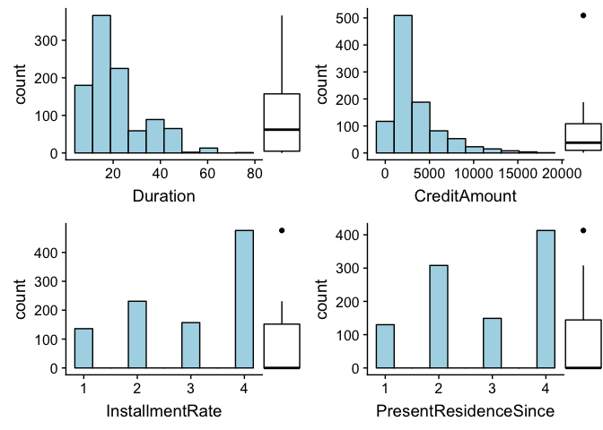
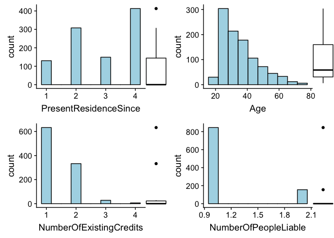
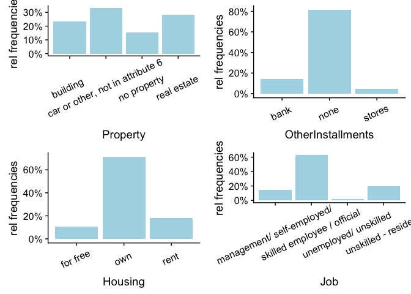
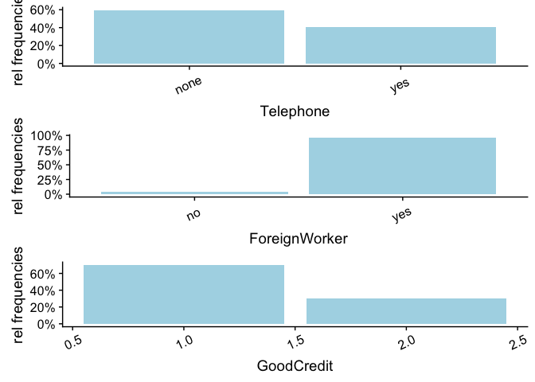
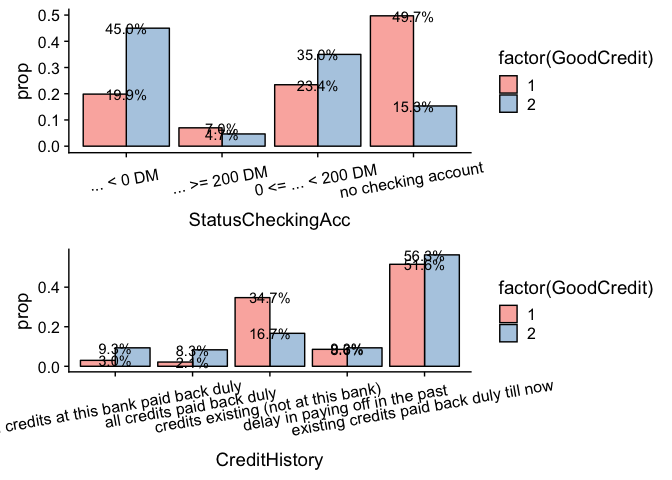

Credit Risk Approval
================
Pedro Alarcon
July 22, 2018

Introduction & Executive Summary
================================

This data set was donated by Prof. Hofmann and is available at the [UCI Machine Learning Respitory](https://archive.ics.uci.edu/ml/datasets/statlog+(german+credit+data)).

> Given various categorical and numerical features, the aim is to build a predictive model that determines whether a bank loan applicant is a good or bad credit risk in order to assist banks in decision making when confronted with a loan applicant. These decisions are translated as profit consideration for the banks The associated risks are as follows:

-   If an applicant is credit worthy, then denying a loan application results in a loss in business profit.
-   If an applicant is not credit worthy, then approving the loan application results in financial loss.

We assume a correct bank decision leads to 35% profit. Otherwise, if bank decises an applicant is credit worthy when in reality they are not, then the loss is 100%. Hence, the second risk has more weight than the first.

Source: Dua, D. and Karra Taniskidou, E. (2017). UCI Machine Learning Repository \[<http://archive.ics.uci.edu/ml>\]. Irvine, CA: University of California, School of Information and Computer Science.

User-Defined Function
=====================

*cost\_profit\_cal* This function calculates the profit per applicant based on the formula \[True Positive\]x.35 + \[False Positive\] x-1 The argument takes a two element vector first first elemenet one = True Positive and element two = False Positive

*create.plots* Function takes in a data frame and a plotting function as their arguments and uses lapply() to create a list of plots from a specifiec data frame. In addition, a for loop is used to paste the corresponding variable name from the data to the elements of plot list. The need for this function was neccessary in order to easily plot frequency distributions, histograms, dodged bars, etc of all variables at once and in a single page. This saves time meanwhile allowing me to analyze many variables at once with ease.

``` r
cost_profit_cal = function(x){
  profit = (x[1] * .35) + (-1*x[2]) #calculates profit
  row = c(x,profit) #appends to TN and FN vector
  return(row)
}


#function takes a data frame and a plot function as its arguments and 
#returns a list of ggplots with their corresponding variable name pasted. 
create.plots = function(data.frame, plot.function){
  
plot.list = lapply(data.frame, function(i) plot.function(i) ) #creates a list of plots

plots = list() #empty list to save updated plots
j=0
for( i in plot.list){
  j=j+1
  i = i + labs(x = names(plot.list)[j]) #paste corresponding names to each plot
  plots[[j]] = i #adds plot to list
}
return(plots)
}
```

Importing & Preparing Data Set
==============================

To begin with, I'll import the data file from UCI Machine Learning Respitory. From prior inspection, we note that the data is in .data file type with columns seperated by spaces. I will also change column names to get a better representation of the columns.

``` r
library(ggplot2)
library(plotly)
library(tidyr)
library(reshape2)
library(cowplot)
library(ggExtra)
library(ggcorrplot)
library(DataExplorer)
library(tidyr) #to seperate data into several columns
library(scales) #for percentages
library(gtable)
library(gridExtra)
library(grid)
library(MASS) #for LDA model fitting
library(rockchalk) #combine factor levels
library(knitr)
library(kableExtra)
library(randomForest)
library(e1071)
```

``` r
url = "https://archive.ics.uci.edu/ml/machine-learning-databases/statlog/german/german.data"
df = read.table(url, sep = " ") #reads .data files


attr_list = as.list(as.vector(strsplit(attr_info, "Attribute ")[[1]])[2:22])

attr_names = sapply(attr_list, function(attr_desc) strsplit(attr_desc, "\n")[[1]][2])

colnames(df) = attr_names
```

Data Exploration
================

Variable Identification
-----------------------

Let's view our data columns/rows, along with its dimensions and data type of our variables.

``` r
dim(df); str(df)
```

    ## [1] 1000   21

    ## 'data.frame':    1000 obs. of  21 variables:
    ##  $ StatusCheckingAcc      : Factor w/ 4 levels "A11","A12","A13",..: 1 2 4 1 1 4 4 2 4 2 ...
    ##  $ Duration               : int  6 48 12 42 24 36 24 36 12 30 ...
    ##  $ CreditHistory          : Factor w/ 5 levels "A30","A31","A32",..: 5 3 5 3 4 3 3 3 3 5 ...
    ##  $ Purpose                : Factor w/ 10 levels "A40","A41","A410",..: 5 5 8 4 1 8 4 2 5 1 ...
    ##  $ CreditAmount           : int  1169 5951 2096 7882 4870 9055 2835 6948 3059 5234 ...
    ##  $ SavingsAccount         : Factor w/ 5 levels "A61","A62","A63",..: 5 1 1 1 1 5 3 1 4 1 ...
    ##  $ EmployedSince          : Factor w/ 5 levels "A71","A72","A73",..: 5 3 4 4 3 3 5 3 4 1 ...
    ##  $ InstallmentRate        : int  4 2 2 2 3 2 3 2 2 4 ...
    ##  $ SexPersonalStatus      : Factor w/ 4 levels "A91","A92","A93",..: 3 2 3 3 3 3 3 3 1 4 ...
    ##  $ OtherDebtors           : Factor w/ 3 levels "A101","A102",..: 1 1 1 3 1 1 1 1 1 1 ...
    ##  $ PresentResidenceSince  : int  4 2 3 4 4 4 4 2 4 2 ...
    ##  $ Property               : Factor w/ 4 levels "A121","A122",..: 1 1 1 2 4 4 2 3 1 3 ...
    ##  $ Age                    : int  67 22 49 45 53 35 53 35 61 28 ...
    ##  $ OtherInstallments      : Factor w/ 3 levels "A141","A142",..: 3 3 3 3 3 3 3 3 3 3 ...
    ##  $ Housing                : Factor w/ 3 levels "A151","A152",..: 2 2 2 3 3 3 2 1 2 2 ...
    ##  $ NumberOfExistingCredits: int  2 1 1 1 2 1 1 1 1 2 ...
    ##  $ Job                    : Factor w/ 4 levels "A171","A172",..: 3 3 2 3 3 2 3 4 2 4 ...
    ##  $ NumberOfPeopleLiable   : int  1 1 2 2 2 2 1 1 1 1 ...
    ##  $ Telephone              : Factor w/ 2 levels "A191","A192": 2 1 1 1 1 2 1 2 1 1 ...
    ##  $ ForeignWorker          : Factor w/ 2 levels "A201","A202": 1 1 1 1 1 1 1 1 1 1 ...
    ##  $ GoodCredit             : int  1 2 1 1 2 1 1 1 1 2 ...

``` r
kable(df[1:6,]) %>%
kable_styling() 
```

<table class="table" style="margin-left: auto; margin-right: auto;">
<thead>
<tr>
<th style="text-align:left;">
StatusCheckingAcc
</th>
<th style="text-align:right;">
Duration
</th>
<th style="text-align:left;">
CreditHistory
</th>
<th style="text-align:left;">
Purpose
</th>
<th style="text-align:right;">
CreditAmount
</th>
<th style="text-align:left;">
SavingsAccount
</th>
<th style="text-align:left;">
EmployedSince
</th>
<th style="text-align:right;">
InstallmentRate
</th>
<th style="text-align:left;">
SexPersonalStatus
</th>
<th style="text-align:left;">
OtherDebtors
</th>
<th style="text-align:right;">
PresentResidenceSince
</th>
<th style="text-align:left;">
Property
</th>
<th style="text-align:right;">
Age
</th>
<th style="text-align:left;">
OtherInstallments
</th>
<th style="text-align:left;">
Housing
</th>
<th style="text-align:right;">
NumberOfExistingCredits
</th>
<th style="text-align:left;">
Job
</th>
<th style="text-align:right;">
NumberOfPeopleLiable
</th>
<th style="text-align:left;">
Telephone
</th>
<th style="text-align:left;">
ForeignWorker
</th>
<th style="text-align:right;">
GoodCredit
</th>
</tr>
</thead>
<tbody>
<tr>
<td style="text-align:left;">
A11
</td>
<td style="text-align:right;">
6
</td>
<td style="text-align:left;">
A34
</td>
<td style="text-align:left;">
A43
</td>
<td style="text-align:right;">
1169
</td>
<td style="text-align:left;">
A65
</td>
<td style="text-align:left;">
A75
</td>
<td style="text-align:right;">
4
</td>
<td style="text-align:left;">
A93
</td>
<td style="text-align:left;">
A101
</td>
<td style="text-align:right;">
4
</td>
<td style="text-align:left;">
A121
</td>
<td style="text-align:right;">
67
</td>
<td style="text-align:left;">
A143
</td>
<td style="text-align:left;">
A152
</td>
<td style="text-align:right;">
2
</td>
<td style="text-align:left;">
A173
</td>
<td style="text-align:right;">
1
</td>
<td style="text-align:left;">
A192
</td>
<td style="text-align:left;">
A201
</td>
<td style="text-align:right;">
1
</td>
</tr>
<tr>
<td style="text-align:left;">
A12
</td>
<td style="text-align:right;">
48
</td>
<td style="text-align:left;">
A32
</td>
<td style="text-align:left;">
A43
</td>
<td style="text-align:right;">
5951
</td>
<td style="text-align:left;">
A61
</td>
<td style="text-align:left;">
A73
</td>
<td style="text-align:right;">
2
</td>
<td style="text-align:left;">
A92
</td>
<td style="text-align:left;">
A101
</td>
<td style="text-align:right;">
2
</td>
<td style="text-align:left;">
A121
</td>
<td style="text-align:right;">
22
</td>
<td style="text-align:left;">
A143
</td>
<td style="text-align:left;">
A152
</td>
<td style="text-align:right;">
1
</td>
<td style="text-align:left;">
A173
</td>
<td style="text-align:right;">
1
</td>
<td style="text-align:left;">
A191
</td>
<td style="text-align:left;">
A201
</td>
<td style="text-align:right;">
2
</td>
</tr>
<tr>
<td style="text-align:left;">
A14
</td>
<td style="text-align:right;">
12
</td>
<td style="text-align:left;">
A34
</td>
<td style="text-align:left;">
A46
</td>
<td style="text-align:right;">
2096
</td>
<td style="text-align:left;">
A61
</td>
<td style="text-align:left;">
A74
</td>
<td style="text-align:right;">
2
</td>
<td style="text-align:left;">
A93
</td>
<td style="text-align:left;">
A101
</td>
<td style="text-align:right;">
3
</td>
<td style="text-align:left;">
A121
</td>
<td style="text-align:right;">
49
</td>
<td style="text-align:left;">
A143
</td>
<td style="text-align:left;">
A152
</td>
<td style="text-align:right;">
1
</td>
<td style="text-align:left;">
A172
</td>
<td style="text-align:right;">
2
</td>
<td style="text-align:left;">
A191
</td>
<td style="text-align:left;">
A201
</td>
<td style="text-align:right;">
1
</td>
</tr>
<tr>
<td style="text-align:left;">
A11
</td>
<td style="text-align:right;">
42
</td>
<td style="text-align:left;">
A32
</td>
<td style="text-align:left;">
A42
</td>
<td style="text-align:right;">
7882
</td>
<td style="text-align:left;">
A61
</td>
<td style="text-align:left;">
A74
</td>
<td style="text-align:right;">
2
</td>
<td style="text-align:left;">
A93
</td>
<td style="text-align:left;">
A103
</td>
<td style="text-align:right;">
4
</td>
<td style="text-align:left;">
A122
</td>
<td style="text-align:right;">
45
</td>
<td style="text-align:left;">
A143
</td>
<td style="text-align:left;">
A153
</td>
<td style="text-align:right;">
1
</td>
<td style="text-align:left;">
A173
</td>
<td style="text-align:right;">
2
</td>
<td style="text-align:left;">
A191
</td>
<td style="text-align:left;">
A201
</td>
<td style="text-align:right;">
1
</td>
</tr>
<tr>
<td style="text-align:left;">
A11
</td>
<td style="text-align:right;">
24
</td>
<td style="text-align:left;">
A33
</td>
<td style="text-align:left;">
A40
</td>
<td style="text-align:right;">
4870
</td>
<td style="text-align:left;">
A61
</td>
<td style="text-align:left;">
A73
</td>
<td style="text-align:right;">
3
</td>
<td style="text-align:left;">
A93
</td>
<td style="text-align:left;">
A101
</td>
<td style="text-align:right;">
4
</td>
<td style="text-align:left;">
A124
</td>
<td style="text-align:right;">
53
</td>
<td style="text-align:left;">
A143
</td>
<td style="text-align:left;">
A153
</td>
<td style="text-align:right;">
2
</td>
<td style="text-align:left;">
A173
</td>
<td style="text-align:right;">
2
</td>
<td style="text-align:left;">
A191
</td>
<td style="text-align:left;">
A201
</td>
<td style="text-align:right;">
2
</td>
</tr>
<tr>
<td style="text-align:left;">
A14
</td>
<td style="text-align:right;">
36
</td>
<td style="text-align:left;">
A32
</td>
<td style="text-align:left;">
A46
</td>
<td style="text-align:right;">
9055
</td>
<td style="text-align:left;">
A65
</td>
<td style="text-align:left;">
A73
</td>
<td style="text-align:right;">
2
</td>
<td style="text-align:left;">
A93
</td>
<td style="text-align:left;">
A101
</td>
<td style="text-align:right;">
4
</td>
<td style="text-align:left;">
A124
</td>
<td style="text-align:right;">
35
</td>
<td style="text-align:left;">
A143
</td>
<td style="text-align:left;">
A153
</td>
<td style="text-align:right;">
1
</td>
<td style="text-align:left;">
A172
</td>
<td style="text-align:right;">
2
</td>
<td style="text-align:left;">
A192
</td>
<td style="text-align:left;">
A201
</td>
<td style="text-align:right;">
1
</td>
</tr>
</tbody>
</table>
This data set consists of 1000 rows and 21 columns. The first 20 are the predictors and the the last is the target variable which is a numerical data type. Being a binary classification problem, I will turn this variable into a factor.

Furthermore, note that most of the columns are categorical predictors (13 of them) with several levels. In addition, these levels have been encoded into symbolic characters. Personally, before analysing data with various visual techniques, I prefer to have the factor levels with descriptive names for better interpretability. Hence, I will change the factor names as described in the German data set description, before proceeding any further.

``` r
for(i in 1:21){
  attr_desc = attr_list[[i]]
  if(length(grep("qualitative",attr_desc))>0){
    lines_all = as.vector(strsplit(attr_desc, "\n")[[1]])
    lines = lines_all[3:(length(lines_all)-1)]
    str_vals = sapply(lines, function(line) strsplit(line, " : ")[[1]][2])
    df[,i] = as.numeric(df[,i])
    
    for (val_i in 1:length(lines)){
      df[,i] <- ifelse(df[,i]==val_i, str_vals[val_i], df[,i])
    }
  }
}
```

Next, I will subset each predictor based on variable category and check the proportions of the target variable.

``` r
numerical = c(2,5,8,11,13,16,18)
factorials = setdiff(1:21,numerical)
df.cat = df[,factorials]  #categorical subset
df.num = df[,numerical] #numerical subset


prop.table(table(df.cat$GoodCredit)) #checking target level propotions
```

    ## 
    ##   1   2 
    ## 0.7 0.3

It seems that the target variable is somewhat imbalanced, with the majority class (credible applicants) having a 70% proportion and the minority class with 30%. This will be important to keep in mind since missclassifying a non-credit worthy applicant has a bigger penalty than missclassifying a credit worthy applicant.

Univariate Analysis
-------------------

As previosly stated, the majority of the predictors are categorical variables with several levels. This may be a problem since a full cross-classification of all variables may lead to zero observations in many cells. Therefore, we need to eliminate the variables that have little influence. In addition, we can combine categorical levels on imbalanced predictors, where a level has a frequency less than 5%. To do this, lets get an idea of the distributions of factor levels in each categorical veriable. I will do this by plotting bar charts.

``` r
bar_chart = function(i){
  ggplot(df.cat, aes(x = i)) + 
          geom_bar(fill = "lightblue",stat = "count" ,aes(y = (..count..)/sum(..count..))) + scale_y_continuous(labels=scales::percent) + ylab("rel frequencies") + theme(axis.text.x = element_text(angle=25, vjust=0.6)) 
}

bar.charts = create.plots(df.cat, bar_chart)

do.call(grid.arrange,bar.charts[1:4] )
```



``` r
do.call(grid.arrange,bar.charts[5:8])
```



``` r
do.call(grid.arrange,bar.charts[8:11])
```



``` r
do.call(grid.arrange,bar.charts[12:14])
```



``` r
#(lapply(df.cat, function(x) margin.table(prop.table(table(x)),1 ))) 
```

Analysis of imbalanced predictors from bar plot and proportion table results:

1.  $AccountStatus: Only 6.3% of applicant have an account balance above 200 DM (about 120 US dollars ). We can merge this with applicants that have a balance of 0 to 200 DM and name the new level as "some balance"

2.  $CreditHistory:

3.  $Purpose: Most individuals tend to apply to credit for their car payments and furniture. We can generalize the furniture, radio/television, repairs, and domestic into a "home related" purpose. Education, vacation, and retraining make up less than 1% each, we can include it into an "others" level and include business along too.

4.  $Account: It seems most people have less than 100 DM (about 60 dollars) in their savings account. We can group individuals with savings from 100 to above 1000.

5.  $EmploymentSince: only 6.2% of individuals are unemployed, while other levels contain &gt; 17%. We can bin unemployment and below 1 year into a single level.

6.  $PersonalStatus: divorced males make up 5% of applicants, we may bin this with the single males.

7.  $OtherDebtors: guarantors and co applicant levels can be bined together to create a "yes" or "no" levels.

8.  $OtherInstallPlans: We can merge bank and store credit installments to make a new level since stores only have a 4.7% frequency. Either you have concurrent credit or you dont.

9.  $Job: unskilled and unemployed/nonresident can be generalized to simply unskilled. The new levels can then become unskilled/unemployed, skilled, and highly skilled/management.

10. $ForeignWorker: Only 3.7% of applicants are not foreign workers. Since there are only two levels, we can potentially eliminate this variable all together.

Now for continuos variables, it is important to understand the spread and central tendency of the variables.

``` r
#function plots a histogram given a data frame column
histogram = function(i){
  ggplot(df.num, aes(x =i  )) + geom_histogram(fill = "lightblue", color= "black", bins = 10) 
}


histo.plots = create.plots(df.num, histogram)


do.call(grid.arrange,lapply(histo.plots[1:4], function(x) ggMarginal(x, type = "boxplot", fill="transparent", margins = "y") ))
```



``` r
do.call(grid.arrange,lapply(histo.plots[4:7], function(x) ggMarginal(x, type = "boxplot", fill="transparent", margins = "y") ))
```


Bi-variate Analysis
-------------------

``` r
require(grid)
bar = function(i){
   ggplot(df.cat, aes(x=i,group = GoodCredit ,fill=factor(GoodCredit))) +
   geom_bar(position="dodge" ,color="black", stat = "count", aes(y = ..prop..))+theme(axis.text.x = element_text(angle=10, vjust=.6)) +geom_text(aes( label = scales::percent(..prop..), y= ..prop.. ), stat= "count")+scale_fill_brewer(palette = "Pastel1")
}

dodged.bars = create.plots(df.cat, bar)

do.call(grid.arrange,dodged.bars[1:2])
```

 continuos variables

Data Engineering
================

``` r
eng.df.cat = df.cat
eng.df.cat[] = lapply(eng.df.cat, factor)

eng.df.cat$StatusCheckingAcc = combineLevels(eng.df.cat$StatusCheckingAcc,levs = c("... >= 200 DM ","0 <= ... < 200 DM "), newLabel = c("Some Balance") )


eng.df.cat$Purpose = combineLevels(eng.df.cat$Purpose, levs= c("domestic appliances ",  "radio/television ","furniture/equipment "), newLabel = c("Home Related"))
eng.df.cat$Purpose = combineLevels(eng.df.cat$Purpose, levs=c("business " ,"repairs ","education ","vacation ","retraining "), newLabel = c("Other"))

eng.df.cat$SavingsAccount = combineLevels(eng.df.cat$SavingsAccount, levs = c(".. >= 1000 DM ","500 <= ... < 1000 DM "), newLabel = c(">= 500"))

eng.df.cat$EmployedSince = combineLevels(eng.df.cat$EmployedSince, levs = c("... < 1 year ", "unemployed "), newLabel = c("<1 or unemployed"))

eng.df.cat$SexPersonalStatus = combineLevels(eng.df.cat$SexPersonalStatus, levs = c("male - divorced/separated ","male - single " ), newLabel = "male - single/divorced" )

levels(eng.df.cat$OtherDebtors)
eng.df.cat$OtherDebtors =combineLevels( eng.df.cat$OtherDebtors, levs = c("guarantor ","co-applicant " ), newLabel = "yes")

eng.df.cat$OtherInstallments = combineLevels(eng.df.cat$OtherInstallments, levs = c("bank ","stores "), newLabel = c("bank/stores"))

eng.df.cat$Job = combineLevels(eng.df.cat$Job,levs = c("unemployed/ unskilled ", "unskilled - resident "), newLabel = c("unemployed/unskilled") )

eng.df.cat$CreditHistory = combineLevels(eng.df.cat$CreditHistory, levs = c("all credits at this bank paid back duly " ,"all credits paid back duly " ), newLabel = c("Paid"))

#sapply(eng.df.cat, function(x) margin.table(prop.table(table(x)),1) )
```

``` r
eng.df.cat$ForeignWorker = NULL #drops the frgn column
```

Machine Learning
================

It is time to fit our data with various statistical models. I will first recombine our numerical and categorical features to split the full data into two equal sets: (1) Training set that will serve to fit various statistical models and (2)Validation set that wll serve to test the accuracy of each model.

``` r
data = cbind(eng.df.cat,df.num)
set.seed(1)

train = sample(1:nrow(data), size = nrow(data)*.50 )
data.train = data[train,]
data.test = data[-train,]

GoodCreditity.test = data.test$GoodCredit
```

Logistic Regression
-------------------

``` r
#Base Model
logistic.fit = glm(GoodCredit~., data = data, subset = train, family = binomial)
sig.level =data.frame(summary(logistic.fit)$coef)
sig.level
```

    ##                                                             Estimate
    ## (Intercept)                                            -4.0224919032
    ## StatusCheckingAccno checking account                   -1.1774806099
    ## StatusCheckingAccSome Balance                          -0.2421331795
    ## CreditHistorydelay in paying off in the past            0.8279743081
    ## CreditHistoryexisting credits paid back duly till now   1.5613482604
    ## CreditHistoryPaid                                       1.8154400300
    ## Purposecar (used)                                      -2.4483505675
    ## PurposeHome Related                                    -0.9486702453
    ## PurposeOther                                           -0.7228378956
    ## SavingsAccount100 <= ... < 500 DM                      -0.6143957980
    ## SavingsAccountno savings                               -1.0992783014
    ## SavingsAccount>= 500                                   -0.7287839254
    ## EmployedSince1 <= ... < 4 years                         0.2397797176
    ## EmployedSince4 <= ... < 7 years                        -0.5411413173
    ## EmployedSince<1 or unemployed                           0.4318976671
    ## SexPersonalStatusmale - married/widowed                -0.3532890504
    ## SexPersonalStatusmale - single/divorced                -0.1185437306
    ## OtherDebtorsyes                                        -0.6973300006
    ## Propertycar or other, not in attribute 6               -0.2050619720
    ## Propertyno property                                     0.6415386931
    ## Propertyreal estate                                    -0.5818103359
    ## OtherInstallmentsbank/stores                            0.9459467177
    ## Housingown                                              0.5354319821
    ## Housingrent                                             0.8317049320
    ## Jobskilled employee / official                          0.4048621889
    ## Jobunemployed/unskilled                                 0.2346147212
    ## Telephoneyes                                           -0.1021898875
    ## Duration                                                0.0383846817
    ## CreditAmount                                            0.0001020386
    ## InstallmentRate                                         0.2347495656
    ## PresentResidenceSince                                   0.1255694291
    ## Age                                                    -0.0161311219
    ## NumberOfExistingCredits                                 0.6187391680
    ## NumberOfPeopleLiable                                    0.0937084735
    ##                                                          Std..Error
    ## (Intercept)                                            1.431959e+00
    ## StatusCheckingAccno checking account                   3.274609e-01
    ## StatusCheckingAccSome Balance                          3.027951e-01
    ## CreditHistorydelay in paying off in the past           4.828560e-01
    ## CreditHistoryexisting credits paid back duly till now  3.971152e-01
    ## CreditHistoryPaid                                      4.851522e-01
    ## Purposecar (used)                                      6.077786e-01
    ## PurposeHome Related                                    3.076256e-01
    ## PurposeOther                                           3.686220e-01
    ## SavingsAccount100 <= ... < 500 DM                      4.134954e-01
    ## SavingsAccountno savings                               3.790153e-01
    ## SavingsAccount>= 500                                   4.483301e-01
    ## EmployedSince1 <= ... < 4 years                        3.490028e-01
    ## EmployedSince4 <= ... < 7 years                        4.459416e-01
    ## EmployedSince<1 or unemployed                          3.792139e-01
    ## SexPersonalStatusmale - married/widowed                4.601406e-01
    ## SexPersonalStatusmale - single/divorced                3.105588e-01
    ## OtherDebtorsyes                                        4.619844e-01
    ## Propertycar or other, not in attribute 6               3.212607e-01
    ## Propertyno property                                    5.547211e-01
    ## Propertyreal estate                                    3.570635e-01
    ## OtherInstallmentsbank/stores                           2.965678e-01
    ## Housingown                                             6.205264e-01
    ## Housingrent                                            6.625823e-01
    ## Jobskilled employee / official                         4.211094e-01
    ## Jobunemployed/unskilled                                5.003296e-01
    ## Telephoneyes                                           2.937343e-01
    ## Duration                                               1.392267e-02
    ## CreditAmount                                           7.414435e-05
    ## InstallmentRate                                        1.281782e-01
    ## PresentResidenceSince                                  1.222451e-01
    ## Age                                                    1.265545e-02
    ## NumberOfExistingCredits                                2.714515e-01
    ## NumberOfPeopleLiable                                   3.554298e-01
    ##                                                           z.value
    ## (Intercept)                                            -2.8090823
    ## StatusCheckingAccno checking account                   -3.5957899
    ## StatusCheckingAccSome Balance                          -0.7996601
    ## CreditHistorydelay in paying off in the past            1.7147437
    ## CreditHistoryexisting credits paid back duly till now   3.9317266
    ## CreditHistoryPaid                                       3.7420013
    ## Purposecar (used)                                      -4.0283594
    ## PurposeHome Related                                    -3.0838467
    ## PurposeOther                                           -1.9609191
    ## SavingsAccount100 <= ... < 500 DM                      -1.4858588
    ## SavingsAccountno savings                               -2.9003536
    ## SavingsAccount>= 500                                   -1.6255522
    ## EmployedSince1 <= ... < 4 years                         0.6870423
    ## EmployedSince4 <= ... < 7 years                        -1.2134802
    ## EmployedSince<1 or unemployed                           1.1389288
    ## SexPersonalStatusmale - married/widowed                -0.7677851
    ## SexPersonalStatusmale - single/divorced                -0.3817111
    ## OtherDebtorsyes                                        -1.5094234
    ## Propertycar or other, not in attribute 6               -0.6383039
    ## Propertyno property                                     1.1565067
    ## Propertyreal estate                                    -1.6294311
    ## OtherInstallmentsbank/stores                            3.1896475
    ## Housingown                                              0.8628674
    ## Housingrent                                             1.2552477
    ## Jobskilled employee / official                          0.9614181
    ## Jobunemployed/unskilled                                 0.4689204
    ## Telephoneyes                                           -0.3478990
    ## Duration                                                2.7569916
    ## CreditAmount                                            1.3762157
    ## InstallmentRate                                         1.8314306
    ## PresentResidenceSince                                   1.0271938
    ## Age                                                    -1.2746381
    ## NumberOfExistingCredits                                 2.2793725
    ## NumberOfPeopleLiable                                    0.2636483
    ##                                                            Pr...z..
    ## (Intercept)                                            4.968295e-03
    ## StatusCheckingAccno checking account                   3.234088e-04
    ## StatusCheckingAccSome Balance                          4.239077e-01
    ## CreditHistorydelay in paying off in the past           8.639223e-02
    ## CreditHistoryexisting credits paid back duly till now  8.433796e-05
    ## CreditHistoryPaid                                      1.825606e-04
    ## Purposecar (used)                                      5.616743e-05
    ## PurposeHome Related                                    2.043429e-03
    ## PurposeOther                                           4.988847e-02
    ## SavingsAccount100 <= ... < 500 DM                      1.373165e-01
    ## SavingsAccountno savings                               3.727419e-03
    ## SavingsAccount>= 500                                   1.040449e-01
    ## EmployedSince1 <= ... < 4 years                        4.920560e-01
    ## EmployedSince4 <= ... < 7 years                        2.249463e-01
    ## EmployedSince<1 or unemployed                          2.547329e-01
    ## SexPersonalStatusmale - married/widowed                4.426149e-01
    ## SexPersonalStatusmale - single/divorced                7.026756e-01
    ## OtherDebtorsyes                                        1.311906e-01
    ## Propertycar or other, not in attribute 6               5.232759e-01
    ## Propertyno property                                    2.474740e-01
    ## Propertyreal estate                                    1.032218e-01
    ## OtherInstallmentsbank/stores                           1.424464e-03
    ## Housingown                                             3.882104e-01
    ## Housingrent                                            2.093889e-01
    ## Jobskilled employee / official                         3.363420e-01
    ## Jobunemployed/unskilled                                6.391266e-01
    ## Telephoneyes                                           7.279160e-01
    ## Duration                                               5.833586e-03
    ## CreditAmount                                           1.687549e-01
    ## InstallmentRate                                        6.703630e-02
    ## PresentResidenceSince                                  3.043292e-01
    ## Age                                                    2.024374e-01
    ## NumberOfExistingCredits                                2.264493e-02
    ## NumberOfPeopleLiable                                   7.920509e-01

``` r
#Model 3
logistic.fit3 = glm(GoodCredit~. -SexPersonalStatus -Telephone  -NumberOfPeopleLiable -Job -Housing -PresentResidenceSince -CreditAmount, data = data, subset = train, family = binomial)

 
logistic.probs  = predict(logistic.fit3, data.test, type = "response")
#30% threshold
glm.predict1 = rep("credible", 500)
glm.predict1[logistic.probs > .30] = "non.credible"
#50% threshold
glm.predict2 = rep("credible", 500)
glm.predict2[logistic.probs > .50] = "non.credible"


glm.TN.FP1 = table(GoodCreditity.test, glm.predict1)[,1]/500
glm.TN.FP2 = table(GoodCreditity.test, glm.predict2)[,1]/500
```

linear Discriminant Analysis
----------------------------

LDA assumes a multivariate normal distribution, hence we only use predictors that are either ordinal or continuos.

``` r
library(MASS)
lda.fit = lda(GoodCredit~SavingsAccount+EmployedSince+Duration+OtherInstallments+InstallmentRate+NumberOfExistingCredits+Age+CreditAmount ,data=data, subset=train)

lda.pred = predict(lda.fit, data.test)
lda.TP.FP = table(GoodCreditity.test,lda.pred$class)[,1]/500

lda.fit2 = lda(GoodCredit~. ,data=data, subset=train)
lda.pred2 = predict(lda.fit2, data.test)
classification = lda.pred2$class
lda.TP.FP2 = table(GoodCreditity.test, classification)[,1]/500


#qda
qda.fit = qda(GoodCredit~., data=data, subset=train)
qda.pred = predict(qda.fit, data.test)
qda.TP.FP = table(GoodCreditity.test, qda.pred$class)[,1]/500
```

Tree Based Methods
------------------

``` r
library(tree)
tree.cred = tree(GoodCredit~., data, subset = train)
tree.pred = predict(tree.cred, data.test, type="class")
tree.TP.FP = table(GoodCreditity.test, tree.pred)[,1]/500

#summary(tree.cred)
```

### Prunning the tree

``` r
set.seed(3)
cv.data = cv.tree(tree.cred, FUN = prune.misclass)
best.size = cv.data$size[which.min(cv.data$dev)]

prune.data = prune.misclass(tree.cred, best = best.size)
tree.pred2 = predict(prune.data, data.test, type="class")
tree.TP.FP2 = table(GoodCreditity.test, tree.pred2)[,1]/500
```

### Random Forest

``` r
rf.data = randomForest(GoodCredit~., data= data , subset= train, mtry = 6, importance =T)
rf.predict = predict(rf.data, data.test)
Forest.TP.FP = table(GoodCreditity.test, rf.predict)[,1]/500
```

SMC and SVM
-----------

``` r
#svm.fit = svm(GoodCredit~., data = data.train, kernel = "linear", cost = 10, scale =FALSE)
tune.out = tune(svm, GoodCredit~., data = data.train, kernel = "linear", ranges = list(cost=c(0.001, 0.01, 0.1, 1,5,10,100)))
bestmod = tune.out$best.model
#summary(bestmod)

svc.predict = predict(bestmod, data.test)
svc.TP.FP = table( GoodCreditity.test, svc.predict)[,1]/500


#radial kernel
svm.fit = svm(GoodCredit~., data = data.train, kernel = "radial", gamma = 1, cost = 1)
tune.out=tune(svm, GoodCredit~., data=data.train, kernel="radial",cranges=list(cost=c(0.1,1,10,100,1000), gamma=c(0.5,1,2,3,4) ))
bestmod = tune.out$best.model

svm.predict = predict(bestmod,data.test) 
svm.TP.FP = table(GoodCreditity.test, svm.predict)[,1]/500
```

Summary/ Cost-Profit Consideration
==================================

``` r
cross.profit = data.frame(matrix(ncol = 9, nrow = 3))
rownames(cross.profit) = c("Credible", "Non-Credible", "Per Applicant Profit")


cross.profit$X1 = cost_profit_cal(glm.TN.FP1)
cross.profit$X2 = cost_profit_cal(glm.TN.FP2)
cross.profit$X3 = cost_profit_cal(lda.TP.FP2)
cross.profit$X4 = cost_profit_cal(qda.TP.FP)
cross.profit$X5 = cost_profit_cal(tree.TP.FP)
cross.profit$X6 = cost_profit_cal(tree.TP.FP2)
cross.profit$X7 = cost_profit_cal(Forest.TP.FP)
cross.profit$X8 = cost_profit_cal(svc.TP.FP)
cross.profit$X9 = cost_profit_cal(svm.TP.FP)


cross.profit %>%
  kable() %>%
  kable_styling() %>%
  add_header_above(c("Test ", "30% threshold" , "50% threshold", "Linear", "quadratic","Unpruned Tree", "Pruned Tree","Random Forest", "SVC", "SVM")) %>%
  add_header_above(c( "", "Logistic" = 2, "Discriminant Analysis" = 2, "Trees" = 2, "" , "","" ))
```

<table class="table" style="margin-left: auto; margin-right: auto;">
<thead>
<tr>
<th style="border-bottom:hidden" colspan="1">
</th>
<th style="border-bottom:hidden; padding-bottom:0; padding-left:3px;padding-right:3px;text-align: center; " colspan="2">
Logistic

</th>
<th style="border-bottom:hidden; padding-bottom:0; padding-left:3px;padding-right:3px;text-align: center; " colspan="2">
Discriminant Analysis

</th>
<th style="border-bottom:hidden; padding-bottom:0; padding-left:3px;padding-right:3px;text-align: center; " colspan="2">
Trees

</th>
<th style="border-bottom:hidden" colspan="1">
</th>
<th style="border-bottom:hidden" colspan="1">
</th>
<th style="border-bottom:hidden" colspan="1">
</th>
</tr>
<tr>
<th style="border-bottom:hidden; padding-bottom:0; padding-left:3px;padding-right:3px;text-align: center; " colspan="1">
Test

</th>
<th style="border-bottom:hidden; padding-bottom:0; padding-left:3px;padding-right:3px;text-align: center; " colspan="1">
30% threshold

</th>
<th style="border-bottom:hidden; padding-bottom:0; padding-left:3px;padding-right:3px;text-align: center; " colspan="1">
50% threshold

</th>
<th style="border-bottom:hidden; padding-bottom:0; padding-left:3px;padding-right:3px;text-align: center; " colspan="1">
Linear

</th>
<th style="border-bottom:hidden; padding-bottom:0; padding-left:3px;padding-right:3px;text-align: center; " colspan="1">
quadratic

</th>
<th style="border-bottom:hidden; padding-bottom:0; padding-left:3px;padding-right:3px;text-align: center; " colspan="1">
Unpruned Tree

</th>
<th style="border-bottom:hidden; padding-bottom:0; padding-left:3px;padding-right:3px;text-align: center; " colspan="1">
Pruned Tree

</th>
<th style="border-bottom:hidden; padding-bottom:0; padding-left:3px;padding-right:3px;text-align: center; " colspan="1">
Random Forest

</th>
<th style="border-bottom:hidden; padding-bottom:0; padding-left:3px;padding-right:3px;text-align: center; " colspan="1">
SVC

</th>
<th style="border-bottom:hidden; padding-bottom:0; padding-left:3px;padding-right:3px;text-align: center; " colspan="1">
SVM

</th>
</tr>
<tr>
<th style="text-align:left;">
</th>
<th style="text-align:right;">
X1
</th>
<th style="text-align:right;">
X2
</th>
<th style="text-align:right;">
X3
</th>
<th style="text-align:right;">
X4
</th>
<th style="text-align:right;">
X5
</th>
<th style="text-align:right;">
X6
</th>
<th style="text-align:right;">
X7
</th>
<th style="text-align:right;">
X8
</th>
<th style="text-align:right;">
X9
</th>
</tr>
</thead>
<tbody>
<tr>
<td style="text-align:left;">
Credible
</td>
<td style="text-align:right;">
0.500
</td>
<td style="text-align:right;">
0.600
</td>
<td style="text-align:right;">
0.6040
</td>
<td style="text-align:right;">
0.5780
</td>
<td style="text-align:right;">
0.5760
</td>
<td style="text-align:right;">
0.6180
</td>
<td style="text-align:right;">
0.6440
</td>
<td style="text-align:right;">
0.6160
</td>
<td style="text-align:right;">
0.6660
</td>
</tr>
<tr>
<td style="text-align:left;">
Non-Credible
</td>
<td style="text-align:right;">
0.102
</td>
<td style="text-align:right;">
0.176
</td>
<td style="text-align:right;">
0.1780
</td>
<td style="text-align:right;">
0.1520
</td>
<td style="text-align:right;">
0.1880
</td>
<td style="text-align:right;">
0.2020
</td>
<td style="text-align:right;">
0.2120
</td>
<td style="text-align:right;">
0.2120
</td>
<td style="text-align:right;">
0.2900
</td>
</tr>
<tr>
<td style="text-align:left;">
Per Applicant Profit
</td>
<td style="text-align:right;">
0.073
</td>
<td style="text-align:right;">
0.034
</td>
<td style="text-align:right;">
0.0334
</td>
<td style="text-align:right;">
0.0503
</td>
<td style="text-align:right;">
0.0136
</td>
<td style="text-align:right;">
0.0143
</td>
<td style="text-align:right;">
0.0134
</td>
<td style="text-align:right;">
0.0036
</td>
<td style="text-align:right;">
-0.0569
</td>
</tr>
</tbody>
</table>
In conclusion, Logistic Regression at a 30% threshold turned out to have the biggest profit per applicant.
