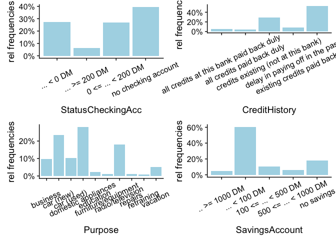
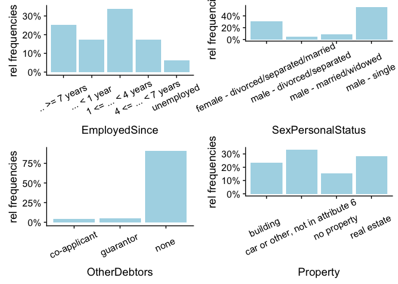
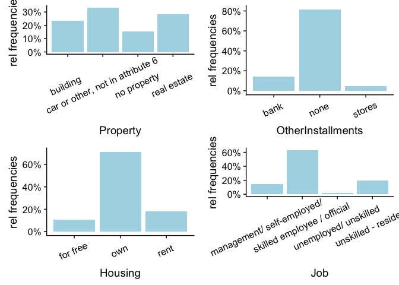
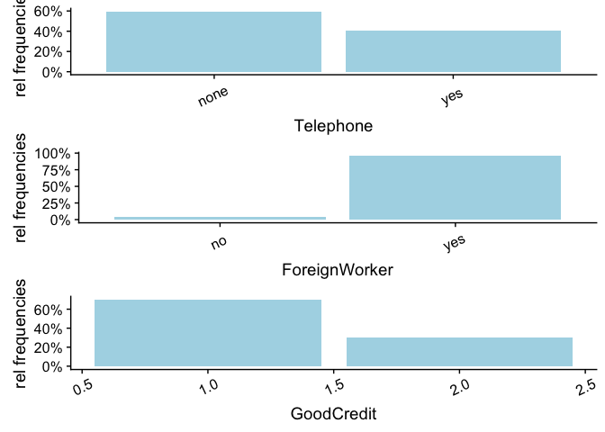

Credit Risk Approval
================
Pedro Alarcon
July 22, 2018

``` r
library(ggplot2)
library(plotly)
library(tidyr)
library(reshape2)
library(cowplot)
library(ggExtra)
library(ggcorrplot)
library(DataExplorer)
library(tidyr) #to seperate data into several columns
library(scales) #for percentages
library(gtable)
library(gridExtra)
library(grid)
library(MASS) #for LDA model fitting
library(rockchalk) #combine factor levels
library(knitr)
library(kableExtra)
library(randomForest)
library(e1071)
```

Introduction & Executive Summary
================================

This data set was donated by Prof. Hofmann and is available at the [UCI Machine Learning Respitory](https://archive.ics.uci.edu/ml/datasets/statlog+(german+credit+data)).

> Given various categorical and numerical features, the aim is to build a predictive model that determines whether a bank loan applicant is a good or bad credit risk in order to assist banks in decision making when confronted with a loan applicant. These decisions are translated as profit consideration for the banks The associated risks are as follows:

-   If an applicant is credit worthy, then denying a loan application results in a loss in business profit.
-   If an applicant is not credit worthy, then approving the loan application results in financial loss.

We assume a correct bank decision leads to 35% profit. Otherwise, if bank decises an applicant is credit worthy when in reality they are not, then the loss is 100%. Hence, the second risk has more weight than the first.

Source: Dua, D. and Karra Taniskidou, E. (2017). UCI Machine Learning Repository \[<http://archive.ics.uci.edu/ml>\]. Irvine, CA: University of California, School of Information and Computer Science.

User-Defined Function
=====================

*cost\_profit\_cal* This function calculates the profit per applicant based on the formula \[True Positive\]x.35 + \[False Positive\] x-1 The argument takes a two element vector first first elemenet one = True Positive and element two = False Positive

*create.plots* Function takes in a data frame and a plotting function as their arguments and uses lapply() to create a list of plots from a specifiec data frame. In addition, a for loop is used to paste the corresponding variable name from the data to the elements of plot list. The need for this function was neccessary in order to easily plot frequency distributions, histograms, dodged bars, etc of all variables at once and in a single page. This saves time meanwhile allowing me to analyze many variables at once with ease.

``` r
cost_profit_cal = function(x){
  profit = (x[1] * .35) + (-1*x[2]) #calculates profit
  row = c(x,profit) #appends to TN and FN vector
  return(row)
}


#function takes a data frame and a plot function as its arguments and 
#returns a list of ggplots with their corresponding variable name pasted. 
create.plots = function(data.frame, plot.function){
  
plot.list = lapply(data.frame, function(i) plot.function(i) ) #creates a list of plots

plots = list() #empty list to save updated plots
j=0
for( i in plot.list){
  j=j+1
  i = i + labs(x = names(plot.list)[j]) #paste corresponding names to each plot
  plots[[j]] = i #adds plot to list
}
return(plots)
}
```

Importing & Preparing Data Set
==============================

To begin with, I'll import the data file from UCI Machine Learning Respitory. From prior inspection, we note that the data is in .data file type with columns seperated by spaces. I will also change column names to get a better representation of the columns.

``` r
url = "https://archive.ics.uci.edu/ml/machine-learning-databases/statlog/german/german.data"
df = read.table(url, sep = " ") #reads .data files


attr_info = 
"Attribute 1: (qualitative) 
StatusCheckingAcc
A11 : ... < 0 DM 
A12 : 0 <= ... < 200 DM 
A13 : ... >= 200 DM 
A14 : no checking account 

Attribute 2: (numerical) 
Duration

Attribute 3: (qualitative) 
CreditHistory
A30 : all credits paid back duly 
A31 : all credits at this bank paid back duly 
A32 : existing credits paid back duly till now 
A33 : delay in paying off in the past 
A34 : credits existing (not at this bank) 

Attribute 4: (qualitative) 
Purpose
A40 : car (new) 
A41 : car (used) 
A42 : furniture/equipment 
A43 : radio/television 
A44 : domestic appliances 
A45 : repairs 
A46 : education 
A47 : vacation 
A48 : retraining 
A49 : business 
A410 : others 

Attribute 5: (numerical) 
CreditAmount

Attribute 6: (qualitative) 
SavingsAccount
A61 : ... < 100 DM 
A62 : 100 <= ... < 500 DM 
A63 : 500 <= ... < 1000 DM 
A64 : .. >= 1000 DM 
A65 : no savings

Attribute 7: (qualitative) 
EmployedSince
A71 : unemployed 
A72 : ... < 1 year 
A73 : 1 <= ... < 4 years 
A74 : 4 <= ... < 7 years 
A75 : .. >= 7 years 

Attribute 8: (numerical) 
InstallmentRate

Attribute 9: (qualitative) 
SexPersonalStatus
A91 : male - divorced/separated 
A92 : female - divorced/separated/married 
A93 : male - single 
A94 : male - married/widowed 
A95 : female - single 

Attribute 10: (qualitative) 
OtherDebtors
A101 : none 
A102 : co-applicant 
A103 : guarantor 

Attribute 11: (numerical) 
PresentResidenceSince

Attribute 12: (qualitative) 
Property
A121 : real estate 
A122 : building  
A123 : car or other, not in attribute 6 
A124 : no property 

Attribute 13: (numerical) 
Age

Attribute 14: (qualitative) 
OtherInstallments
A141 : bank 
A142 : stores 
A143 : none 

Attribute 15: (qualitative) 
Housing
A151 : rent 
A152 : own 
A153 : for free 

Attribute 16: (numerical) 
NumberOfExistingCredits

Attribute 17: (qualitative) 
Job
A171 : unemployed/ unskilled 
A172 : unskilled - resident 
A173 : skilled employee / official 
A174 : management/ self-employed/ 
highly qualified employee/ officer 

Attribute 18: (numerical) 
NumberOfPeopleLiable

Attribute 19: (qualitative) 
Telephone
A191 : none 
A192 : yes 

Attribute 20: (qualitative) 
ForeignWorker
A201 : yes 
A202 : no 

Attribute 21: (quantitative)
GoodCredit
1: Good
2: Bad
"

attr_list = as.list(as.vector(strsplit(attr_info, "Attribute ")[[1]])[2:22])

attr_names = sapply(attr_list, function(attr_desc) strsplit(attr_desc, "\n")[[1]][2])

colnames(df) = attr_names
```

Data Exploration
================

Variable Identification
-----------------------

Let's view our data columns/rows, along with its dimensions and data type of our variables.

``` r
dim(df); str(df)
```

    ## [1] 1000   21

    ## 'data.frame':    1000 obs. of  21 variables:
    ##  $ StatusCheckingAcc      : Factor w/ 4 levels "A11","A12","A13",..: 1 2 4 1 1 4 4 2 4 2 ...
    ##  $ Duration               : int  6 48 12 42 24 36 24 36 12 30 ...
    ##  $ CreditHistory          : Factor w/ 5 levels "A30","A31","A32",..: 5 3 5 3 4 3 3 3 3 5 ...
    ##  $ Purpose                : Factor w/ 10 levels "A40","A41","A410",..: 5 5 8 4 1 8 4 2 5 1 ...
    ##  $ CreditAmount           : int  1169 5951 2096 7882 4870 9055 2835 6948 3059 5234 ...
    ##  $ SavingsAccount         : Factor w/ 5 levels "A61","A62","A63",..: 5 1 1 1 1 5 3 1 4 1 ...
    ##  $ EmployedSince          : Factor w/ 5 levels "A71","A72","A73",..: 5 3 4 4 3 3 5 3 4 1 ...
    ##  $ InstallmentRate        : int  4 2 2 2 3 2 3 2 2 4 ...
    ##  $ SexPersonalStatus      : Factor w/ 4 levels "A91","A92","A93",..: 3 2 3 3 3 3 3 3 1 4 ...
    ##  $ OtherDebtors           : Factor w/ 3 levels "A101","A102",..: 1 1 1 3 1 1 1 1 1 1 ...
    ##  $ PresentResidenceSince  : int  4 2 3 4 4 4 4 2 4 2 ...
    ##  $ Property               : Factor w/ 4 levels "A121","A122",..: 1 1 1 2 4 4 2 3 1 3 ...
    ##  $ Age                    : int  67 22 49 45 53 35 53 35 61 28 ...
    ##  $ OtherInstallments      : Factor w/ 3 levels "A141","A142",..: 3 3 3 3 3 3 3 3 3 3 ...
    ##  $ Housing                : Factor w/ 3 levels "A151","A152",..: 2 2 2 3 3 3 2 1 2 2 ...
    ##  $ NumberOfExistingCredits: int  2 1 1 1 2 1 1 1 1 2 ...
    ##  $ Job                    : Factor w/ 4 levels "A171","A172",..: 3 3 2 3 3 2 3 4 2 4 ...
    ##  $ NumberOfPeopleLiable   : int  1 1 2 2 2 2 1 1 1 1 ...
    ##  $ Telephone              : Factor w/ 2 levels "A191","A192": 2 1 1 1 1 2 1 2 1 1 ...
    ##  $ ForeignWorker          : Factor w/ 2 levels "A201","A202": 1 1 1 1 1 1 1 1 1 1 ...
    ##  $ GoodCredit             : int  1 2 1 1 2 1 1 1 1 2 ...

``` r
kable(df) %>%
kable_styling() 
```

<table class="table" style="margin-left: auto; margin-right: auto;">
<thead>
<tr>
<th style="text-align:left;">
StatusCheckingAcc
</th>
<th style="text-align:right;">
Duration
</th>
<th style="text-align:left;">
CreditHistory
</th>
<th style="text-align:left;">
Purpose
</th>
<th style="text-align:right;">
CreditAmount
</th>
<th style="text-align:left;">
SavingsAccount
</th>
<th style="text-align:left;">
EmployedSince
</th>
<th style="text-align:right;">
InstallmentRate
</th>
<th style="text-align:left;">
SexPersonalStatus
</th>
<th style="text-align:left;">
OtherDebtors
</th>
<th style="text-align:right;">
PresentResidenceSince
</th>
<th style="text-align:left;">
Property
</th>
<th style="text-align:right;">
Age
</th>
<th style="text-align:left;">
OtherInstallments
</th>
<th style="text-align:left;">
Housing
</th>
<th style="text-align:right;">
NumberOfExistingCredits
</th>
<th style="text-align:left;">
Job
</th>
<th style="text-align:right;">
NumberOfPeopleLiable
</th>
<th style="text-align:left;">
Telephone
</th>
<th style="text-align:left;">
ForeignWorker
</th>
<th style="text-align:right;">
GoodCredit
</th>
</tr>
</thead>
<tbody>
<tr>
<td style="text-align:left;">
A11
</td>
<td style="text-align:right;">
6
</td>
<td style="text-align:left;">
A34
</td>
<td style="text-align:left;">
A43
</td>
<td style="text-align:right;">
1169
</td>
<td style="text-align:left;">
A65
</td>
<td style="text-align:left;">
A75
</td>
<td style="text-align:right;">
4
</td>
<td style="text-align:left;">
A93
</td>
<td style="text-align:left;">
A101
</td>
<td style="text-align:right;">
4
</td>
<td style="text-align:left;">
A121
</td>
<td style="text-align:right;">
67
</td>
<td style="text-align:left;">
A143
</td>
<td style="text-align:left;">
A152
</td>
<td style="text-align:right;">
2
</td>
<td style="text-align:left;">
A173
</td>
<td style="text-align:right;">
1
</td>
<td style="text-align:left;">
A192
</td>
<td style="text-align:left;">
A201
</td>
<td style="text-align:right;">
1
</td>
</tr>
<tr>
<td style="text-align:left;">
A12
</td>
<td style="text-align:right;">
48
</td>
<td style="text-align:left;">
A32
</td>
<td style="text-align:left;">
A43
</td>
<td style="text-align:right;">
5951
</td>
<td style="text-align:left;">
A61
</td>
<td style="text-align:left;">
A73
</td>
<td style="text-align:right;">
2
</td>
<td style="text-align:left;">
A92
</td>
<td style="text-align:left;">
A101
</td>
<td style="text-align:right;">
2
</td>
<td style="text-align:left;">
A121
</td>
<td style="text-align:right;">
22
</td>
<td style="text-align:left;">
A143
</td>
<td style="text-align:left;">
A152
</td>
<td style="text-align:right;">
1
</td>
<td style="text-align:left;">
A173
</td>
<td style="text-align:right;">
1
</td>
<td style="text-align:left;">
A191
</td>
<td style="text-align:left;">
A201
</td>
<td style="text-align:right;">
2
</td>
</tr>
<tr>
<td style="text-align:left;">
A14
</td>
<td style="text-align:right;">
12
</td>
<td style="text-align:left;">
A34
</td>
<td style="text-align:left;">
A46
</td>
<td style="text-align:right;">
2096
</td>
<td style="text-align:left;">
A61
</td>
<td style="text-align:left;">
A74
</td>
<td style="text-align:right;">
2
</td>
<td style="text-align:left;">
A93
</td>
<td style="text-align:left;">
A101
</td>
<td style="text-align:right;">
3
</td>
<td style="text-align:left;">
A121
</td>
<td style="text-align:right;">
49
</td>
<td style="text-align:left;">
A143
</td>
<td style="text-align:left;">
A152
</td>
<td style="text-align:right;">
1
</td>
<td style="text-align:left;">
A172
</td>
<td style="text-align:right;">
2
</td>
<td style="text-align:left;">
A191
</td>
<td style="text-align:left;">
A201
</td>
<td style="text-align:right;">
1
</td>
</tr>
<tr>
<td style="text-align:left;">
A11
</td>
<td style="text-align:right;">
42
</td>
<td style="text-align:left;">
A32
</td>
<td style="text-align:left;">
A42
</td>
<td style="text-align:right;">
7882
</td>
<td style="text-align:left;">
A61
</td>
<td style="text-align:left;">
A74
</td>
<td style="text-align:right;">
2
</td>
<td style="text-align:left;">
A93
</td>
<td style="text-align:left;">
A103
</td>
<td style="text-align:right;">
4
</td>
<td style="text-align:left;">
A122
</td>
<td style="text-align:right;">
45
</td>
<td style="text-align:left;">
A143
</td>
<td style="text-align:left;">
A153
</td>
<td style="text-align:right;">
1
</td>
<td style="text-align:left;">
A173
</td>
<td style="text-align:right;">
2
</td>
<td style="text-align:left;">
A191
</td>
<td style="text-align:left;">
A201
</td>
<td style="text-align:right;">
1
</td>
</tr>
<tr>
<td style="text-align:left;">
A11
</td>
<td style="text-align:right;">
24
</td>
<td style="text-align:left;">
A33
</td>
<td style="text-align:left;">
A40
</td>
<td style="text-align:right;">
4870
</td>
<td style="text-align:left;">
A61
</td>
<td style="text-align:left;">
A73
</td>
<td style="text-align:right;">
3
</td>
<td style="text-align:left;">
A93
</td>
<td style="text-align:left;">
A101
</td>
<td style="text-align:right;">
4
</td>
<td style="text-align:left;">
A124
</td>
<td style="text-align:right;">
53
</td>
<td style="text-align:left;">
A143
</td>
<td style="text-align:left;">
A153
</td>
<td style="text-align:right;">
2
</td>
<td style="text-align:left;">
A173
</td>
<td style="text-align:right;">
2
</td>
<td style="text-align:left;">
A191
</td>
<td style="text-align:left;">
A201
</td>
<td style="text-align:right;">
2
</td>
</tr>
<tr>
<td style="text-align:left;">
A14
</td>
<td style="text-align:right;">
36
</td>
<td style="text-align:left;">
A32
</td>
<td style="text-align:left;">
A46
</td>
<td style="text-align:right;">
9055
</td>
<td style="text-align:left;">
A65
</td>
<td style="text-align:left;">
A73
</td>
<td style="text-align:right;">
2
</td>
<td style="text-align:left;">
A93
</td>
<td style="text-align:left;">
A101
</td>
<td style="text-align:right;">
4
</td>
<td style="text-align:left;">
A124
</td>
<td style="text-align:right;">
35
</td>
<td style="text-align:left;">
A143
</td>
<td style="text-align:left;">
A153
</td>
<td style="text-align:right;">
1
</td>
<td style="text-align:left;">
A172
</td>
<td style="text-align:right;">
2
</td>
<td style="text-align:left;">
A192
</td>
<td style="text-align:left;">
A201
</td>
<td style="text-align:right;">
1
</td>
</tr>
<tr>
<td style="text-align:left;">
A14
</td>
<td style="text-align:right;">
24
</td>
<td style="text-align:left;">
A32
</td>
<td style="text-align:left;">
A42
</td>
<td style="text-align:right;">
2835
</td>
<td style="text-align:left;">
A63
</td>
<td style="text-align:left;">
A75
</td>
<td style="text-align:right;">
3
</td>
<td style="text-align:left;">
A93
</td>
<td style="text-align:left;">
A101
</td>
<td style="text-align:right;">
4
</td>
<td style="text-align:left;">
A122
</td>
<td style="text-align:right;">
53
</td>
<td style="text-align:left;">
A143
</td>
<td style="text-align:left;">
A152
</td>
<td style="text-align:right;">
1
</td>
<td style="text-align:left;">
A173
</td>
<td style="text-align:right;">
1
</td>
<td style="text-align:left;">
A191
</td>
<td style="text-align:left;">
A201
</td>
<td style="text-align:right;">
1
</td>
</tr>
<tr>
<td style="text-align:left;">
A12
</td>
<td style="text-align:right;">
36
</td>
<td style="text-align:left;">
A32
</td>
<td style="text-align:left;">
A41
</td>
<td style="text-align:right;">
6948
</td>
<td style="text-align:left;">
A61
</td>
<td style="text-align:left;">
A73
</td>
<td style="text-align:right;">
2
</td>
<td style="text-align:left;">
A93
</td>
<td style="text-align:left;">
A101
</td>
<td style="text-align:right;">
2
</td>
<td style="text-align:left;">
A123
</td>
<td style="text-align:right;">
35
</td>
<td style="text-align:left;">
A143
</td>
<td style="text-align:left;">
A151
</td>
<td style="text-align:right;">
1
</td>
<td style="text-align:left;">
A174
</td>
<td style="text-align:right;">
1
</td>
<td style="text-align:left;">
A192
</td>
<td style="text-align:left;">
A201
</td>
<td style="text-align:right;">
1
</td>
</tr>
<tr>
<td style="text-align:left;">
A14
</td>
<td style="text-align:right;">
12
</td>
<td style="text-align:left;">
A32
</td>
<td style="text-align:left;">
A43
</td>
<td style="text-align:right;">
3059
</td>
<td style="text-align:left;">
A64
</td>
<td style="text-align:left;">
A74
</td>
<td style="text-align:right;">
2
</td>
<td style="text-align:left;">
A91
</td>
<td style="text-align:left;">
A101
</td>
<td style="text-align:right;">
4
</td>
<td style="text-align:left;">
A121
</td>
<td style="text-align:right;">
61
</td>
<td style="text-align:left;">
A143
</td>
<td style="text-align:left;">
A152
</td>
<td style="text-align:right;">
1
</td>
<td style="text-align:left;">
A172
</td>
<td style="text-align:right;">
1
</td>
<td style="text-align:left;">
A191
</td>
<td style="text-align:left;">
A201
</td>
<td style="text-align:right;">
1
</td>
</tr>
<tr>
<td style="text-align:left;">
A12
</td>
<td style="text-align:right;">
30
</td>
<td style="text-align:left;">
A34
</td>
<td style="text-align:left;">
A40
</td>
<td style="text-align:right;">
5234
</td>
<td style="text-align:left;">
A61
</td>
<td style="text-align:left;">
A71
</td>
<td style="text-align:right;">
4
</td>
<td style="text-align:left;">
A94
</td>
<td style="text-align:left;">
A101
</td>
<td style="text-align:right;">
2
</td>
<td style="text-align:left;">
A123
</td>
<td style="text-align:right;">
28
</td>
<td style="text-align:left;">
A143
</td>
<td style="text-align:left;">
A152
</td>
<td style="text-align:right;">
2
</td>
<td style="text-align:left;">
A174
</td>
<td style="text-align:right;">
1
</td>
<td style="text-align:left;">
A191
</td>
<td style="text-align:left;">
A201
</td>
<td style="text-align:right;">
2
</td>
</tr>
<tr>
<td style="text-align:left;">
A12
</td>
<td style="text-align:right;">
12
</td>
<td style="text-align:left;">
A32
</td>
<td style="text-align:left;">
A40
</td>
<td style="text-align:right;">
1295
</td>
<td style="text-align:left;">
A61
</td>
<td style="text-align:left;">
A72
</td>
<td style="text-align:right;">
3
</td>
<td style="text-align:left;">
A92
</td>
<td style="text-align:left;">
A101
</td>
<td style="text-align:right;">
1
</td>
<td style="text-align:left;">
A123
</td>
<td style="text-align:right;">
25
</td>
<td style="text-align:left;">
A143
</td>
<td style="text-align:left;">
A151
</td>
<td style="text-align:right;">
1
</td>
<td style="text-align:left;">
A173
</td>
<td style="text-align:right;">
1
</td>
<td style="text-align:left;">
A191
</td>
<td style="text-align:left;">
A201
</td>
<td style="text-align:right;">
2
</td>
</tr>
<tr>
<td style="text-align:left;">
A11
</td>
<td style="text-align:right;">
48
</td>
<td style="text-align:left;">
A32
</td>
<td style="text-align:left;">
A49
</td>
<td style="text-align:right;">
4308
</td>
<td style="text-align:left;">
A61
</td>
<td style="text-align:left;">
A72
</td>
<td style="text-align:right;">
3
</td>
<td style="text-align:left;">
A92
</td>
<td style="text-align:left;">
A101
</td>
<td style="text-align:right;">
4
</td>
<td style="text-align:left;">
A122
</td>
<td style="text-align:right;">
24
</td>
<td style="text-align:left;">
A143
</td>
<td style="text-align:left;">
A151
</td>
<td style="text-align:right;">
1
</td>
<td style="text-align:left;">
A173
</td>
<td style="text-align:right;">
1
</td>
<td style="text-align:left;">
A191
</td>
<td style="text-align:left;">
A201
</td>
<td style="text-align:right;">
2
</td>
</tr>
<tr>
<td style="text-align:left;">
A12
</td>
<td style="text-align:right;">
12
</td>
<td style="text-align:left;">
A32
</td>
<td style="text-align:left;">
A43
</td>
<td style="text-align:right;">
1567
</td>
<td style="text-align:left;">
A61
</td>
<td style="text-align:left;">
A73
</td>
<td style="text-align:right;">
1
</td>
<td style="text-align:left;">
A92
</td>
<td style="text-align:left;">
A101
</td>
<td style="text-align:right;">
1
</td>
<td style="text-align:left;">
A123
</td>
<td style="text-align:right;">
22
</td>
<td style="text-align:left;">
A143
</td>
<td style="text-align:left;">
A152
</td>
<td style="text-align:right;">
1
</td>
<td style="text-align:left;">
A173
</td>
<td style="text-align:right;">
1
</td>
<td style="text-align:left;">
A192
</td>
<td style="text-align:left;">
A201
</td>
<td style="text-align:right;">
1
</td>
</tr>
<tr>
<td style="text-align:left;">
A11
</td>
<td style="text-align:right;">
24
</td>
<td style="text-align:left;">
A34
</td>
<td style="text-align:left;">
A40
</td>
<td style="text-align:right;">
1199
</td>
<td style="text-align:left;">
A61
</td>
<td style="text-align:left;">
A75
</td>
<td style="text-align:right;">
4
</td>
<td style="text-align:left;">
A93
</td>
<td style="text-align:left;">
A101
</td>
<td style="text-align:right;">
4
</td>
<td style="text-align:left;">
A123
</td>
<td style="text-align:right;">
60
</td>
<td style="text-align:left;">
A143
</td>
<td style="text-align:left;">
A152
</td>
<td style="text-align:right;">
2
</td>
<td style="text-align:left;">
A172
</td>
<td style="text-align:right;">
1
</td>
<td style="text-align:left;">
A191
</td>
<td style="text-align:left;">
A201
</td>
<td style="text-align:right;">
2
</td>
</tr>
<tr>
<td style="text-align:left;">
A11
</td>
<td style="text-align:right;">
15
</td>
<td style="text-align:left;">
A32
</td>
<td style="text-align:left;">
A40
</td>
<td style="text-align:right;">
1403
</td>
<td style="text-align:left;">
A61
</td>
<td style="text-align:left;">
A73
</td>
<td style="text-align:right;">
2
</td>
<td style="text-align:left;">
A92
</td>
<td style="text-align:left;">
A101
</td>
<td style="text-align:right;">
4
</td>
<td style="text-align:left;">
A123
</td>
<td style="text-align:right;">
28
</td>
<td style="text-align:left;">
A143
</td>
<td style="text-align:left;">
A151
</td>
<td style="text-align:right;">
1
</td>
<td style="text-align:left;">
A173
</td>
<td style="text-align:right;">
1
</td>
<td style="text-align:left;">
A191
</td>
<td style="text-align:left;">
A201
</td>
<td style="text-align:right;">
1
</td>
</tr>
<tr>
<td style="text-align:left;">
A11
</td>
<td style="text-align:right;">
24
</td>
<td style="text-align:left;">
A32
</td>
<td style="text-align:left;">
A43
</td>
<td style="text-align:right;">
1282
</td>
<td style="text-align:left;">
A62
</td>
<td style="text-align:left;">
A73
</td>
<td style="text-align:right;">
4
</td>
<td style="text-align:left;">
A92
</td>
<td style="text-align:left;">
A101
</td>
<td style="text-align:right;">
2
</td>
<td style="text-align:left;">
A123
</td>
<td style="text-align:right;">
32
</td>
<td style="text-align:left;">
A143
</td>
<td style="text-align:left;">
A152
</td>
<td style="text-align:right;">
1
</td>
<td style="text-align:left;">
A172
</td>
<td style="text-align:right;">
1
</td>
<td style="text-align:left;">
A191
</td>
<td style="text-align:left;">
A201
</td>
<td style="text-align:right;">
2
</td>
</tr>
<tr>
<td style="text-align:left;">
A14
</td>
<td style="text-align:right;">
24
</td>
<td style="text-align:left;">
A34
</td>
<td style="text-align:left;">
A43
</td>
<td style="text-align:right;">
2424
</td>
<td style="text-align:left;">
A65
</td>
<td style="text-align:left;">
A75
</td>
<td style="text-align:right;">
4
</td>
<td style="text-align:left;">
A93
</td>
<td style="text-align:left;">
A101
</td>
<td style="text-align:right;">
4
</td>
<td style="text-align:left;">
A122
</td>
<td style="text-align:right;">
53
</td>
<td style="text-align:left;">
A143
</td>
<td style="text-align:left;">
A152
</td>
<td style="text-align:right;">
2
</td>
<td style="text-align:left;">
A173
</td>
<td style="text-align:right;">
1
</td>
<td style="text-align:left;">
A191
</td>
<td style="text-align:left;">
A201
</td>
<td style="text-align:right;">
1
</td>
</tr>
<tr>
<td style="text-align:left;">
A11
</td>
<td style="text-align:right;">
30
</td>
<td style="text-align:left;">
A30
</td>
<td style="text-align:left;">
A49
</td>
<td style="text-align:right;">
8072
</td>
<td style="text-align:left;">
A65
</td>
<td style="text-align:left;">
A72
</td>
<td style="text-align:right;">
2
</td>
<td style="text-align:left;">
A93
</td>
<td style="text-align:left;">
A101
</td>
<td style="text-align:right;">
3
</td>
<td style="text-align:left;">
A123
</td>
<td style="text-align:right;">
25
</td>
<td style="text-align:left;">
A141
</td>
<td style="text-align:left;">
A152
</td>
<td style="text-align:right;">
3
</td>
<td style="text-align:left;">
A173
</td>
<td style="text-align:right;">
1
</td>
<td style="text-align:left;">
A191
</td>
<td style="text-align:left;">
A201
</td>
<td style="text-align:right;">
1
</td>
</tr>
<tr>
<td style="text-align:left;">
A12
</td>
<td style="text-align:right;">
24
</td>
<td style="text-align:left;">
A32
</td>
<td style="text-align:left;">
A41
</td>
<td style="text-align:right;">
12579
</td>
<td style="text-align:left;">
A61
</td>
<td style="text-align:left;">
A75
</td>
<td style="text-align:right;">
4
</td>
<td style="text-align:left;">
A92
</td>
<td style="text-align:left;">
A101
</td>
<td style="text-align:right;">
2
</td>
<td style="text-align:left;">
A124
</td>
<td style="text-align:right;">
44
</td>
<td style="text-align:left;">
A143
</td>
<td style="text-align:left;">
A153
</td>
<td style="text-align:right;">
1
</td>
<td style="text-align:left;">
A174
</td>
<td style="text-align:right;">
1
</td>
<td style="text-align:left;">
A192
</td>
<td style="text-align:left;">
A201
</td>
<td style="text-align:right;">
2
</td>
</tr>
<tr>
<td style="text-align:left;">
A14
</td>
<td style="text-align:right;">
24
</td>
<td style="text-align:left;">
A32
</td>
<td style="text-align:left;">
A43
</td>
<td style="text-align:right;">
3430
</td>
<td style="text-align:left;">
A63
</td>
<td style="text-align:left;">
A75
</td>
<td style="text-align:right;">
3
</td>
<td style="text-align:left;">
A93
</td>
<td style="text-align:left;">
A101
</td>
<td style="text-align:right;">
2
</td>
<td style="text-align:left;">
A123
</td>
<td style="text-align:right;">
31
</td>
<td style="text-align:left;">
A143
</td>
<td style="text-align:left;">
A152
</td>
<td style="text-align:right;">
1
</td>
<td style="text-align:left;">
A173
</td>
<td style="text-align:right;">
2
</td>
<td style="text-align:left;">
A192
</td>
<td style="text-align:left;">
A201
</td>
<td style="text-align:right;">
1
</td>
</tr>
<tr>
<td style="text-align:left;">
A14
</td>
<td style="text-align:right;">
9
</td>
<td style="text-align:left;">
A34
</td>
<td style="text-align:left;">
A40
</td>
<td style="text-align:right;">
2134
</td>
<td style="text-align:left;">
A61
</td>
<td style="text-align:left;">
A73
</td>
<td style="text-align:right;">
4
</td>
<td style="text-align:left;">
A93
</td>
<td style="text-align:left;">
A101
</td>
<td style="text-align:right;">
4
</td>
<td style="text-align:left;">
A123
</td>
<td style="text-align:right;">
48
</td>
<td style="text-align:left;">
A143
</td>
<td style="text-align:left;">
A152
</td>
<td style="text-align:right;">
3
</td>
<td style="text-align:left;">
A173
</td>
<td style="text-align:right;">
1
</td>
<td style="text-align:left;">
A192
</td>
<td style="text-align:left;">
A201
</td>
<td style="text-align:right;">
1
</td>
</tr>
<tr>
<td style="text-align:left;">
A11
</td>
<td style="text-align:right;">
6
</td>
<td style="text-align:left;">
A32
</td>
<td style="text-align:left;">
A43
</td>
<td style="text-align:right;">
2647
</td>
<td style="text-align:left;">
A63
</td>
<td style="text-align:left;">
A73
</td>
<td style="text-align:right;">
2
</td>
<td style="text-align:left;">
A93
</td>
<td style="text-align:left;">
A101
</td>
<td style="text-align:right;">
3
</td>
<td style="text-align:left;">
A121
</td>
<td style="text-align:right;">
44
</td>
<td style="text-align:left;">
A143
</td>
<td style="text-align:left;">
A151
</td>
<td style="text-align:right;">
1
</td>
<td style="text-align:left;">
A173
</td>
<td style="text-align:right;">
2
</td>
<td style="text-align:left;">
A191
</td>
<td style="text-align:left;">
A201
</td>
<td style="text-align:right;">
1
</td>
</tr>
<tr>
<td style="text-align:left;">
A11
</td>
<td style="text-align:right;">
10
</td>
<td style="text-align:left;">
A34
</td>
<td style="text-align:left;">
A40
</td>
<td style="text-align:right;">
2241
</td>
<td style="text-align:left;">
A61
</td>
<td style="text-align:left;">
A72
</td>
<td style="text-align:right;">
1
</td>
<td style="text-align:left;">
A93
</td>
<td style="text-align:left;">
A101
</td>
<td style="text-align:right;">
3
</td>
<td style="text-align:left;">
A121
</td>
<td style="text-align:right;">
48
</td>
<td style="text-align:left;">
A143
</td>
<td style="text-align:left;">
A151
</td>
<td style="text-align:right;">
2
</td>
<td style="text-align:left;">
A172
</td>
<td style="text-align:right;">
2
</td>
<td style="text-align:left;">
A191
</td>
<td style="text-align:left;">
A202
</td>
<td style="text-align:right;">
1
</td>
</tr>
<tr>
<td style="text-align:left;">
A12
</td>
<td style="text-align:right;">
12
</td>
<td style="text-align:left;">
A34
</td>
<td style="text-align:left;">
A41
</td>
<td style="text-align:right;">
1804
</td>
<td style="text-align:left;">
A62
</td>
<td style="text-align:left;">
A72
</td>
<td style="text-align:right;">
3
</td>
<td style="text-align:left;">
A93
</td>
<td style="text-align:left;">
A101
</td>
<td style="text-align:right;">
4
</td>
<td style="text-align:left;">
A122
</td>
<td style="text-align:right;">
44
</td>
<td style="text-align:left;">
A143
</td>
<td style="text-align:left;">
A152
</td>
<td style="text-align:right;">
1
</td>
<td style="text-align:left;">
A173
</td>
<td style="text-align:right;">
1
</td>
<td style="text-align:left;">
A191
</td>
<td style="text-align:left;">
A201
</td>
<td style="text-align:right;">
1
</td>
</tr>
<tr>
<td style="text-align:left;">
A14
</td>
<td style="text-align:right;">
10
</td>
<td style="text-align:left;">
A34
</td>
<td style="text-align:left;">
A42
</td>
<td style="text-align:right;">
2069
</td>
<td style="text-align:left;">
A65
</td>
<td style="text-align:left;">
A73
</td>
<td style="text-align:right;">
2
</td>
<td style="text-align:left;">
A94
</td>
<td style="text-align:left;">
A101
</td>
<td style="text-align:right;">
1
</td>
<td style="text-align:left;">
A123
</td>
<td style="text-align:right;">
26
</td>
<td style="text-align:left;">
A143
</td>
<td style="text-align:left;">
A152
</td>
<td style="text-align:right;">
2
</td>
<td style="text-align:left;">
A173
</td>
<td style="text-align:right;">
1
</td>
<td style="text-align:left;">
A191
</td>
<td style="text-align:left;">
A202
</td>
<td style="text-align:right;">
1
</td>
</tr>
<tr>
<td style="text-align:left;">
A11
</td>
<td style="text-align:right;">
6
</td>
<td style="text-align:left;">
A32
</td>
<td style="text-align:left;">
A42
</td>
<td style="text-align:right;">
1374
</td>
<td style="text-align:left;">
A61
</td>
<td style="text-align:left;">
A73
</td>
<td style="text-align:right;">
1
</td>
<td style="text-align:left;">
A93
</td>
<td style="text-align:left;">
A101
</td>
<td style="text-align:right;">
2
</td>
<td style="text-align:left;">
A121
</td>
<td style="text-align:right;">
36
</td>
<td style="text-align:left;">
A141
</td>
<td style="text-align:left;">
A152
</td>
<td style="text-align:right;">
1
</td>
<td style="text-align:left;">
A172
</td>
<td style="text-align:right;">
1
</td>
<td style="text-align:left;">
A192
</td>
<td style="text-align:left;">
A201
</td>
<td style="text-align:right;">
1
</td>
</tr>
<tr>
<td style="text-align:left;">
A14
</td>
<td style="text-align:right;">
6
</td>
<td style="text-align:left;">
A30
</td>
<td style="text-align:left;">
A43
</td>
<td style="text-align:right;">
426
</td>
<td style="text-align:left;">
A61
</td>
<td style="text-align:left;">
A75
</td>
<td style="text-align:right;">
4
</td>
<td style="text-align:left;">
A94
</td>
<td style="text-align:left;">
A101
</td>
<td style="text-align:right;">
4
</td>
<td style="text-align:left;">
A123
</td>
<td style="text-align:right;">
39
</td>
<td style="text-align:left;">
A143
</td>
<td style="text-align:left;">
A152
</td>
<td style="text-align:right;">
1
</td>
<td style="text-align:left;">
A172
</td>
<td style="text-align:right;">
1
</td>
<td style="text-align:left;">
A191
</td>
<td style="text-align:left;">
A201
</td>
<td style="text-align:right;">
1
</td>
</tr>
<tr>
<td style="text-align:left;">
A13
</td>
<td style="text-align:right;">
12
</td>
<td style="text-align:left;">
A31
</td>
<td style="text-align:left;">
A43
</td>
<td style="text-align:right;">
409
</td>
<td style="text-align:left;">
A64
</td>
<td style="text-align:left;">
A73
</td>
<td style="text-align:right;">
3
</td>
<td style="text-align:left;">
A92
</td>
<td style="text-align:left;">
A101
</td>
<td style="text-align:right;">
3
</td>
<td style="text-align:left;">
A121
</td>
<td style="text-align:right;">
42
</td>
<td style="text-align:left;">
A143
</td>
<td style="text-align:left;">
A151
</td>
<td style="text-align:right;">
2
</td>
<td style="text-align:left;">
A173
</td>
<td style="text-align:right;">
1
</td>
<td style="text-align:left;">
A191
</td>
<td style="text-align:left;">
A201
</td>
<td style="text-align:right;">
1
</td>
</tr>
<tr>
<td style="text-align:left;">
A12
</td>
<td style="text-align:right;">
7
</td>
<td style="text-align:left;">
A32
</td>
<td style="text-align:left;">
A43
</td>
<td style="text-align:right;">
2415
</td>
<td style="text-align:left;">
A61
</td>
<td style="text-align:left;">
A73
</td>
<td style="text-align:right;">
3
</td>
<td style="text-align:left;">
A93
</td>
<td style="text-align:left;">
A103
</td>
<td style="text-align:right;">
2
</td>
<td style="text-align:left;">
A121
</td>
<td style="text-align:right;">
34
</td>
<td style="text-align:left;">
A143
</td>
<td style="text-align:left;">
A152
</td>
<td style="text-align:right;">
1
</td>
<td style="text-align:left;">
A173
</td>
<td style="text-align:right;">
1
</td>
<td style="text-align:left;">
A191
</td>
<td style="text-align:left;">
A201
</td>
<td style="text-align:right;">
1
</td>
</tr>
<tr>
<td style="text-align:left;">
A11
</td>
<td style="text-align:right;">
60
</td>
<td style="text-align:left;">
A33
</td>
<td style="text-align:left;">
A49
</td>
<td style="text-align:right;">
6836
</td>
<td style="text-align:left;">
A61
</td>
<td style="text-align:left;">
A75
</td>
<td style="text-align:right;">
3
</td>
<td style="text-align:left;">
A93
</td>
<td style="text-align:left;">
A101
</td>
<td style="text-align:right;">
4
</td>
<td style="text-align:left;">
A124
</td>
<td style="text-align:right;">
63
</td>
<td style="text-align:left;">
A143
</td>
<td style="text-align:left;">
A152
</td>
<td style="text-align:right;">
2
</td>
<td style="text-align:left;">
A173
</td>
<td style="text-align:right;">
1
</td>
<td style="text-align:left;">
A192
</td>
<td style="text-align:left;">
A201
</td>
<td style="text-align:right;">
2
</td>
</tr>
<tr>
<td style="text-align:left;">
A12
</td>
<td style="text-align:right;">
18
</td>
<td style="text-align:left;">
A32
</td>
<td style="text-align:left;">
A49
</td>
<td style="text-align:right;">
1913
</td>
<td style="text-align:left;">
A64
</td>
<td style="text-align:left;">
A72
</td>
<td style="text-align:right;">
3
</td>
<td style="text-align:left;">
A94
</td>
<td style="text-align:left;">
A101
</td>
<td style="text-align:right;">
3
</td>
<td style="text-align:left;">
A121
</td>
<td style="text-align:right;">
36
</td>
<td style="text-align:left;">
A141
</td>
<td style="text-align:left;">
A152
</td>
<td style="text-align:right;">
1
</td>
<td style="text-align:left;">
A173
</td>
<td style="text-align:right;">
1
</td>
<td style="text-align:left;">
A192
</td>
<td style="text-align:left;">
A201
</td>
<td style="text-align:right;">
1
</td>
</tr>
<tr>
<td style="text-align:left;">
A11
</td>
<td style="text-align:right;">
24
</td>
<td style="text-align:left;">
A32
</td>
<td style="text-align:left;">
A42
</td>
<td style="text-align:right;">
4020
</td>
<td style="text-align:left;">
A61
</td>
<td style="text-align:left;">
A73
</td>
<td style="text-align:right;">
2
</td>
<td style="text-align:left;">
A93
</td>
<td style="text-align:left;">
A101
</td>
<td style="text-align:right;">
2
</td>
<td style="text-align:left;">
A123
</td>
<td style="text-align:right;">
27
</td>
<td style="text-align:left;">
A142
</td>
<td style="text-align:left;">
A152
</td>
<td style="text-align:right;">
1
</td>
<td style="text-align:left;">
A173
</td>
<td style="text-align:right;">
1
</td>
<td style="text-align:left;">
A191
</td>
<td style="text-align:left;">
A201
</td>
<td style="text-align:right;">
1
</td>
</tr>
<tr>
<td style="text-align:left;">
A12
</td>
<td style="text-align:right;">
18
</td>
<td style="text-align:left;">
A32
</td>
<td style="text-align:left;">
A40
</td>
<td style="text-align:right;">
5866
</td>
<td style="text-align:left;">
A62
</td>
<td style="text-align:left;">
A73
</td>
<td style="text-align:right;">
2
</td>
<td style="text-align:left;">
A93
</td>
<td style="text-align:left;">
A101
</td>
<td style="text-align:right;">
2
</td>
<td style="text-align:left;">
A123
</td>
<td style="text-align:right;">
30
</td>
<td style="text-align:left;">
A143
</td>
<td style="text-align:left;">
A152
</td>
<td style="text-align:right;">
2
</td>
<td style="text-align:left;">
A173
</td>
<td style="text-align:right;">
1
</td>
<td style="text-align:left;">
A192
</td>
<td style="text-align:left;">
A201
</td>
<td style="text-align:right;">
1
</td>
</tr>
<tr>
<td style="text-align:left;">
A14
</td>
<td style="text-align:right;">
12
</td>
<td style="text-align:left;">
A34
</td>
<td style="text-align:left;">
A49
</td>
<td style="text-align:right;">
1264
</td>
<td style="text-align:left;">
A65
</td>
<td style="text-align:left;">
A75
</td>
<td style="text-align:right;">
4
</td>
<td style="text-align:left;">
A93
</td>
<td style="text-align:left;">
A101
</td>
<td style="text-align:right;">
4
</td>
<td style="text-align:left;">
A124
</td>
<td style="text-align:right;">
57
</td>
<td style="text-align:left;">
A143
</td>
<td style="text-align:left;">
A151
</td>
<td style="text-align:right;">
1
</td>
<td style="text-align:left;">
A172
</td>
<td style="text-align:right;">
1
</td>
<td style="text-align:left;">
A191
</td>
<td style="text-align:left;">
A201
</td>
<td style="text-align:right;">
1
</td>
</tr>
<tr>
<td style="text-align:left;">
A13
</td>
<td style="text-align:right;">
12
</td>
<td style="text-align:left;">
A32
</td>
<td style="text-align:left;">
A42
</td>
<td style="text-align:right;">
1474
</td>
<td style="text-align:left;">
A61
</td>
<td style="text-align:left;">
A72
</td>
<td style="text-align:right;">
4
</td>
<td style="text-align:left;">
A92
</td>
<td style="text-align:left;">
A101
</td>
<td style="text-align:right;">
1
</td>
<td style="text-align:left;">
A122
</td>
<td style="text-align:right;">
33
</td>
<td style="text-align:left;">
A141
</td>
<td style="text-align:left;">
A152
</td>
<td style="text-align:right;">
1
</td>
<td style="text-align:left;">
A174
</td>
<td style="text-align:right;">
1
</td>
<td style="text-align:left;">
A192
</td>
<td style="text-align:left;">
A201
</td>
<td style="text-align:right;">
1
</td>
</tr>
<tr>
<td style="text-align:left;">
A12
</td>
<td style="text-align:right;">
45
</td>
<td style="text-align:left;">
A34
</td>
<td style="text-align:left;">
A43
</td>
<td style="text-align:right;">
4746
</td>
<td style="text-align:left;">
A61
</td>
<td style="text-align:left;">
A72
</td>
<td style="text-align:right;">
4
</td>
<td style="text-align:left;">
A93
</td>
<td style="text-align:left;">
A101
</td>
<td style="text-align:right;">
2
</td>
<td style="text-align:left;">
A122
</td>
<td style="text-align:right;">
25
</td>
<td style="text-align:left;">
A143
</td>
<td style="text-align:left;">
A152
</td>
<td style="text-align:right;">
2
</td>
<td style="text-align:left;">
A172
</td>
<td style="text-align:right;">
1
</td>
<td style="text-align:left;">
A191
</td>
<td style="text-align:left;">
A201
</td>
<td style="text-align:right;">
2
</td>
</tr>
<tr>
<td style="text-align:left;">
A14
</td>
<td style="text-align:right;">
48
</td>
<td style="text-align:left;">
A34
</td>
<td style="text-align:left;">
A46
</td>
<td style="text-align:right;">
6110
</td>
<td style="text-align:left;">
A61
</td>
<td style="text-align:left;">
A73
</td>
<td style="text-align:right;">
1
</td>
<td style="text-align:left;">
A93
</td>
<td style="text-align:left;">
A101
</td>
<td style="text-align:right;">
3
</td>
<td style="text-align:left;">
A124
</td>
<td style="text-align:right;">
31
</td>
<td style="text-align:left;">
A141
</td>
<td style="text-align:left;">
A153
</td>
<td style="text-align:right;">
1
</td>
<td style="text-align:left;">
A173
</td>
<td style="text-align:right;">
1
</td>
<td style="text-align:left;">
A192
</td>
<td style="text-align:left;">
A201
</td>
<td style="text-align:right;">
1
</td>
</tr>
<tr>
<td style="text-align:left;">
A13
</td>
<td style="text-align:right;">
18
</td>
<td style="text-align:left;">
A32
</td>
<td style="text-align:left;">
A43
</td>
<td style="text-align:right;">
2100
</td>
<td style="text-align:left;">
A61
</td>
<td style="text-align:left;">
A73
</td>
<td style="text-align:right;">
4
</td>
<td style="text-align:left;">
A93
</td>
<td style="text-align:left;">
A102
</td>
<td style="text-align:right;">
2
</td>
<td style="text-align:left;">
A121
</td>
<td style="text-align:right;">
37
</td>
<td style="text-align:left;">
A142
</td>
<td style="text-align:left;">
A152
</td>
<td style="text-align:right;">
1
</td>
<td style="text-align:left;">
A173
</td>
<td style="text-align:right;">
1
</td>
<td style="text-align:left;">
A191
</td>
<td style="text-align:left;">
A201
</td>
<td style="text-align:right;">
2
</td>
</tr>
<tr>
<td style="text-align:left;">
A13
</td>
<td style="text-align:right;">
10
</td>
<td style="text-align:left;">
A32
</td>
<td style="text-align:left;">
A44
</td>
<td style="text-align:right;">
1225
</td>
<td style="text-align:left;">
A61
</td>
<td style="text-align:left;">
A73
</td>
<td style="text-align:right;">
2
</td>
<td style="text-align:left;">
A93
</td>
<td style="text-align:left;">
A101
</td>
<td style="text-align:right;">
2
</td>
<td style="text-align:left;">
A123
</td>
<td style="text-align:right;">
37
</td>
<td style="text-align:left;">
A143
</td>
<td style="text-align:left;">
A152
</td>
<td style="text-align:right;">
1
</td>
<td style="text-align:left;">
A173
</td>
<td style="text-align:right;">
1
</td>
<td style="text-align:left;">
A192
</td>
<td style="text-align:left;">
A201
</td>
<td style="text-align:right;">
1
</td>
</tr>
<tr>
<td style="text-align:left;">
A12
</td>
<td style="text-align:right;">
9
</td>
<td style="text-align:left;">
A32
</td>
<td style="text-align:left;">
A43
</td>
<td style="text-align:right;">
458
</td>
<td style="text-align:left;">
A61
</td>
<td style="text-align:left;">
A73
</td>
<td style="text-align:right;">
4
</td>
<td style="text-align:left;">
A93
</td>
<td style="text-align:left;">
A101
</td>
<td style="text-align:right;">
3
</td>
<td style="text-align:left;">
A121
</td>
<td style="text-align:right;">
24
</td>
<td style="text-align:left;">
A143
</td>
<td style="text-align:left;">
A152
</td>
<td style="text-align:right;">
1
</td>
<td style="text-align:left;">
A173
</td>
<td style="text-align:right;">
1
</td>
<td style="text-align:left;">
A191
</td>
<td style="text-align:left;">
A201
</td>
<td style="text-align:right;">
1
</td>
</tr>
<tr>
<td style="text-align:left;">
A14
</td>
<td style="text-align:right;">
30
</td>
<td style="text-align:left;">
A32
</td>
<td style="text-align:left;">
A43
</td>
<td style="text-align:right;">
2333
</td>
<td style="text-align:left;">
A63
</td>
<td style="text-align:left;">
A75
</td>
<td style="text-align:right;">
4
</td>
<td style="text-align:left;">
A93
</td>
<td style="text-align:left;">
A101
</td>
<td style="text-align:right;">
2
</td>
<td style="text-align:left;">
A123
</td>
<td style="text-align:right;">
30
</td>
<td style="text-align:left;">
A141
</td>
<td style="text-align:left;">
A152
</td>
<td style="text-align:right;">
1
</td>
<td style="text-align:left;">
A174
</td>
<td style="text-align:right;">
1
</td>
<td style="text-align:left;">
A191
</td>
<td style="text-align:left;">
A201
</td>
<td style="text-align:right;">
1
</td>
</tr>
<tr>
<td style="text-align:left;">
A12
</td>
<td style="text-align:right;">
12
</td>
<td style="text-align:left;">
A32
</td>
<td style="text-align:left;">
A43
</td>
<td style="text-align:right;">
1158
</td>
<td style="text-align:left;">
A63
</td>
<td style="text-align:left;">
A73
</td>
<td style="text-align:right;">
3
</td>
<td style="text-align:left;">
A91
</td>
<td style="text-align:left;">
A101
</td>
<td style="text-align:right;">
1
</td>
<td style="text-align:left;">
A123
</td>
<td style="text-align:right;">
26
</td>
<td style="text-align:left;">
A143
</td>
<td style="text-align:left;">
A152
</td>
<td style="text-align:right;">
1
</td>
<td style="text-align:left;">
A173
</td>
<td style="text-align:right;">
1
</td>
<td style="text-align:left;">
A192
</td>
<td style="text-align:left;">
A201
</td>
<td style="text-align:right;">
1
</td>
</tr>
<tr>
<td style="text-align:left;">
A12
</td>
<td style="text-align:right;">
18
</td>
<td style="text-align:left;">
A33
</td>
<td style="text-align:left;">
A45
</td>
<td style="text-align:right;">
6204
</td>
<td style="text-align:left;">
A61
</td>
<td style="text-align:left;">
A73
</td>
<td style="text-align:right;">
2
</td>
<td style="text-align:left;">
A93
</td>
<td style="text-align:left;">
A101
</td>
<td style="text-align:right;">
4
</td>
<td style="text-align:left;">
A121
</td>
<td style="text-align:right;">
44
</td>
<td style="text-align:left;">
A143
</td>
<td style="text-align:left;">
A152
</td>
<td style="text-align:right;">
1
</td>
<td style="text-align:left;">
A172
</td>
<td style="text-align:right;">
2
</td>
<td style="text-align:left;">
A192
</td>
<td style="text-align:left;">
A201
</td>
<td style="text-align:right;">
1
</td>
</tr>
<tr>
<td style="text-align:left;">
A11
</td>
<td style="text-align:right;">
30
</td>
<td style="text-align:left;">
A34
</td>
<td style="text-align:left;">
A41
</td>
<td style="text-align:right;">
6187
</td>
<td style="text-align:left;">
A62
</td>
<td style="text-align:left;">
A74
</td>
<td style="text-align:right;">
1
</td>
<td style="text-align:left;">
A94
</td>
<td style="text-align:left;">
A101
</td>
<td style="text-align:right;">
4
</td>
<td style="text-align:left;">
A123
</td>
<td style="text-align:right;">
24
</td>
<td style="text-align:left;">
A143
</td>
<td style="text-align:left;">
A151
</td>
<td style="text-align:right;">
2
</td>
<td style="text-align:left;">
A173
</td>
<td style="text-align:right;">
1
</td>
<td style="text-align:left;">
A191
</td>
<td style="text-align:left;">
A201
</td>
<td style="text-align:right;">
1
</td>
</tr>
<tr>
<td style="text-align:left;">
A11
</td>
<td style="text-align:right;">
48
</td>
<td style="text-align:left;">
A34
</td>
<td style="text-align:left;">
A41
</td>
<td style="text-align:right;">
6143
</td>
<td style="text-align:left;">
A61
</td>
<td style="text-align:left;">
A75
</td>
<td style="text-align:right;">
4
</td>
<td style="text-align:left;">
A92
</td>
<td style="text-align:left;">
A101
</td>
<td style="text-align:right;">
4
</td>
<td style="text-align:left;">
A124
</td>
<td style="text-align:right;">
58
</td>
<td style="text-align:left;">
A142
</td>
<td style="text-align:left;">
A153
</td>
<td style="text-align:right;">
2
</td>
<td style="text-align:left;">
A172
</td>
<td style="text-align:right;">
1
</td>
<td style="text-align:left;">
A191
</td>
<td style="text-align:left;">
A201
</td>
<td style="text-align:right;">
2
</td>
</tr>
<tr>
<td style="text-align:left;">
A14
</td>
<td style="text-align:right;">
11
</td>
<td style="text-align:left;">
A34
</td>
<td style="text-align:left;">
A40
</td>
<td style="text-align:right;">
1393
</td>
<td style="text-align:left;">
A61
</td>
<td style="text-align:left;">
A72
</td>
<td style="text-align:right;">
4
</td>
<td style="text-align:left;">
A92
</td>
<td style="text-align:left;">
A101
</td>
<td style="text-align:right;">
4
</td>
<td style="text-align:left;">
A123
</td>
<td style="text-align:right;">
35
</td>
<td style="text-align:left;">
A143
</td>
<td style="text-align:left;">
A152
</td>
<td style="text-align:right;">
2
</td>
<td style="text-align:left;">
A174
</td>
<td style="text-align:right;">
1
</td>
<td style="text-align:left;">
A191
</td>
<td style="text-align:left;">
A201
</td>
<td style="text-align:right;">
1
</td>
</tr>
<tr>
<td style="text-align:left;">
A14
</td>
<td style="text-align:right;">
36
</td>
<td style="text-align:left;">
A32
</td>
<td style="text-align:left;">
A43
</td>
<td style="text-align:right;">
2299
</td>
<td style="text-align:left;">
A63
</td>
<td style="text-align:left;">
A75
</td>
<td style="text-align:right;">
4
</td>
<td style="text-align:left;">
A93
</td>
<td style="text-align:left;">
A101
</td>
<td style="text-align:right;">
4
</td>
<td style="text-align:left;">
A123
</td>
<td style="text-align:right;">
39
</td>
<td style="text-align:left;">
A143
</td>
<td style="text-align:left;">
A152
</td>
<td style="text-align:right;">
1
</td>
<td style="text-align:left;">
A173
</td>
<td style="text-align:right;">
1
</td>
<td style="text-align:left;">
A191
</td>
<td style="text-align:left;">
A201
</td>
<td style="text-align:right;">
1
</td>
</tr>
<tr>
<td style="text-align:left;">
A11
</td>
<td style="text-align:right;">
6
</td>
<td style="text-align:left;">
A32
</td>
<td style="text-align:left;">
A41
</td>
<td style="text-align:right;">
1352
</td>
<td style="text-align:left;">
A63
</td>
<td style="text-align:left;">
A71
</td>
<td style="text-align:right;">
1
</td>
<td style="text-align:left;">
A92
</td>
<td style="text-align:left;">
A101
</td>
<td style="text-align:right;">
2
</td>
<td style="text-align:left;">
A122
</td>
<td style="text-align:right;">
23
</td>
<td style="text-align:left;">
A143
</td>
<td style="text-align:left;">
A151
</td>
<td style="text-align:right;">
1
</td>
<td style="text-align:left;">
A171
</td>
<td style="text-align:right;">
1
</td>
<td style="text-align:left;">
A192
</td>
<td style="text-align:left;">
A201
</td>
<td style="text-align:right;">
1
</td>
</tr>
<tr>
<td style="text-align:left;">
A14
</td>
<td style="text-align:right;">
11
</td>
<td style="text-align:left;">
A34
</td>
<td style="text-align:left;">
A40
</td>
<td style="text-align:right;">
7228
</td>
<td style="text-align:left;">
A61
</td>
<td style="text-align:left;">
A73
</td>
<td style="text-align:right;">
1
</td>
<td style="text-align:left;">
A93
</td>
<td style="text-align:left;">
A101
</td>
<td style="text-align:right;">
4
</td>
<td style="text-align:left;">
A122
</td>
<td style="text-align:right;">
39
</td>
<td style="text-align:left;">
A143
</td>
<td style="text-align:left;">
A152
</td>
<td style="text-align:right;">
2
</td>
<td style="text-align:left;">
A172
</td>
<td style="text-align:right;">
1
</td>
<td style="text-align:left;">
A191
</td>
<td style="text-align:left;">
A201
</td>
<td style="text-align:right;">
1
</td>
</tr>
<tr>
<td style="text-align:left;">
A14
</td>
<td style="text-align:right;">
12
</td>
<td style="text-align:left;">
A32
</td>
<td style="text-align:left;">
A43
</td>
<td style="text-align:right;">
2073
</td>
<td style="text-align:left;">
A62
</td>
<td style="text-align:left;">
A73
</td>
<td style="text-align:right;">
4
</td>
<td style="text-align:left;">
A92
</td>
<td style="text-align:left;">
A102
</td>
<td style="text-align:right;">
2
</td>
<td style="text-align:left;">
A121
</td>
<td style="text-align:right;">
28
</td>
<td style="text-align:left;">
A143
</td>
<td style="text-align:left;">
A152
</td>
<td style="text-align:right;">
1
</td>
<td style="text-align:left;">
A173
</td>
<td style="text-align:right;">
1
</td>
<td style="text-align:left;">
A191
</td>
<td style="text-align:left;">
A201
</td>
<td style="text-align:right;">
1
</td>
</tr>
<tr>
<td style="text-align:left;">
A12
</td>
<td style="text-align:right;">
24
</td>
<td style="text-align:left;">
A33
</td>
<td style="text-align:left;">
A42
</td>
<td style="text-align:right;">
2333
</td>
<td style="text-align:left;">
A65
</td>
<td style="text-align:left;">
A72
</td>
<td style="text-align:right;">
4
</td>
<td style="text-align:left;">
A93
</td>
<td style="text-align:left;">
A101
</td>
<td style="text-align:right;">
2
</td>
<td style="text-align:left;">
A122
</td>
<td style="text-align:right;">
29
</td>
<td style="text-align:left;">
A141
</td>
<td style="text-align:left;">
A152
</td>
<td style="text-align:right;">
1
</td>
<td style="text-align:left;">
A172
</td>
<td style="text-align:right;">
1
</td>
<td style="text-align:left;">
A191
</td>
<td style="text-align:left;">
A201
</td>
<td style="text-align:right;">
1
</td>
</tr>
<tr>
<td style="text-align:left;">
A12
</td>
<td style="text-align:right;">
27
</td>
<td style="text-align:left;">
A33
</td>
<td style="text-align:left;">
A41
</td>
<td style="text-align:right;">
5965
</td>
<td style="text-align:left;">
A61
</td>
<td style="text-align:left;">
A75
</td>
<td style="text-align:right;">
1
</td>
<td style="text-align:left;">
A93
</td>
<td style="text-align:left;">
A101
</td>
<td style="text-align:right;">
2
</td>
<td style="text-align:left;">
A123
</td>
<td style="text-align:right;">
30
</td>
<td style="text-align:left;">
A143
</td>
<td style="text-align:left;">
A152
</td>
<td style="text-align:right;">
2
</td>
<td style="text-align:left;">
A174
</td>
<td style="text-align:right;">
1
</td>
<td style="text-align:left;">
A192
</td>
<td style="text-align:left;">
A201
</td>
<td style="text-align:right;">
1
</td>
</tr>
<tr>
<td style="text-align:left;">
A14
</td>
<td style="text-align:right;">
12
</td>
<td style="text-align:left;">
A32
</td>
<td style="text-align:left;">
A43
</td>
<td style="text-align:right;">
1262
</td>
<td style="text-align:left;">
A61
</td>
<td style="text-align:left;">
A73
</td>
<td style="text-align:right;">
3
</td>
<td style="text-align:left;">
A93
</td>
<td style="text-align:left;">
A101
</td>
<td style="text-align:right;">
2
</td>
<td style="text-align:left;">
A123
</td>
<td style="text-align:right;">
25
</td>
<td style="text-align:left;">
A143
</td>
<td style="text-align:left;">
A152
</td>
<td style="text-align:right;">
1
</td>
<td style="text-align:left;">
A173
</td>
<td style="text-align:right;">
1
</td>
<td style="text-align:left;">
A191
</td>
<td style="text-align:left;">
A201
</td>
<td style="text-align:right;">
1
</td>
</tr>
<tr>
<td style="text-align:left;">
A14
</td>
<td style="text-align:right;">
18
</td>
<td style="text-align:left;">
A32
</td>
<td style="text-align:left;">
A41
</td>
<td style="text-align:right;">
3378
</td>
<td style="text-align:left;">
A65
</td>
<td style="text-align:left;">
A73
</td>
<td style="text-align:right;">
2
</td>
<td style="text-align:left;">
A93
</td>
<td style="text-align:left;">
A101
</td>
<td style="text-align:right;">
1
</td>
<td style="text-align:left;">
A122
</td>
<td style="text-align:right;">
31
</td>
<td style="text-align:left;">
A143
</td>
<td style="text-align:left;">
A152
</td>
<td style="text-align:right;">
1
</td>
<td style="text-align:left;">
A173
</td>
<td style="text-align:right;">
1
</td>
<td style="text-align:left;">
A192
</td>
<td style="text-align:left;">
A201
</td>
<td style="text-align:right;">
1
</td>
</tr>
<tr>
<td style="text-align:left;">
A12
</td>
<td style="text-align:right;">
36
</td>
<td style="text-align:left;">
A33
</td>
<td style="text-align:left;">
A40
</td>
<td style="text-align:right;">
2225
</td>
<td style="text-align:left;">
A61
</td>
<td style="text-align:left;">
A75
</td>
<td style="text-align:right;">
4
</td>
<td style="text-align:left;">
A93
</td>
<td style="text-align:left;">
A101
</td>
<td style="text-align:right;">
4
</td>
<td style="text-align:left;">
A124
</td>
<td style="text-align:right;">
57
</td>
<td style="text-align:left;">
A141
</td>
<td style="text-align:left;">
A153
</td>
<td style="text-align:right;">
2
</td>
<td style="text-align:left;">
A173
</td>
<td style="text-align:right;">
1
</td>
<td style="text-align:left;">
A192
</td>
<td style="text-align:left;">
A201
</td>
<td style="text-align:right;">
2
</td>
</tr>
<tr>
<td style="text-align:left;">
A14
</td>
<td style="text-align:right;">
6
</td>
<td style="text-align:left;">
A31
</td>
<td style="text-align:left;">
A40
</td>
<td style="text-align:right;">
783
</td>
<td style="text-align:left;">
A65
</td>
<td style="text-align:left;">
A73
</td>
<td style="text-align:right;">
1
</td>
<td style="text-align:left;">
A93
</td>
<td style="text-align:left;">
A103
</td>
<td style="text-align:right;">
2
</td>
<td style="text-align:left;">
A121
</td>
<td style="text-align:right;">
26
</td>
<td style="text-align:left;">
A142
</td>
<td style="text-align:left;">
A152
</td>
<td style="text-align:right;">
1
</td>
<td style="text-align:left;">
A172
</td>
<td style="text-align:right;">
2
</td>
<td style="text-align:left;">
A191
</td>
<td style="text-align:left;">
A201
</td>
<td style="text-align:right;">
1
</td>
</tr>
<tr>
<td style="text-align:left;">
A12
</td>
<td style="text-align:right;">
12
</td>
<td style="text-align:left;">
A32
</td>
<td style="text-align:left;">
A43
</td>
<td style="text-align:right;">
6468
</td>
<td style="text-align:left;">
A65
</td>
<td style="text-align:left;">
A71
</td>
<td style="text-align:right;">
2
</td>
<td style="text-align:left;">
A93
</td>
<td style="text-align:left;">
A101
</td>
<td style="text-align:right;">
1
</td>
<td style="text-align:left;">
A124
</td>
<td style="text-align:right;">
52
</td>
<td style="text-align:left;">
A143
</td>
<td style="text-align:left;">
A152
</td>
<td style="text-align:right;">
1
</td>
<td style="text-align:left;">
A174
</td>
<td style="text-align:right;">
1
</td>
<td style="text-align:left;">
A192
</td>
<td style="text-align:left;">
A201
</td>
<td style="text-align:right;">
2
</td>
</tr>
<tr>
<td style="text-align:left;">
A14
</td>
<td style="text-align:right;">
36
</td>
<td style="text-align:left;">
A34
</td>
<td style="text-align:left;">
A43
</td>
<td style="text-align:right;">
9566
</td>
<td style="text-align:left;">
A61
</td>
<td style="text-align:left;">
A73
</td>
<td style="text-align:right;">
2
</td>
<td style="text-align:left;">
A92
</td>
<td style="text-align:left;">
A101
</td>
<td style="text-align:right;">
2
</td>
<td style="text-align:left;">
A123
</td>
<td style="text-align:right;">
31
</td>
<td style="text-align:left;">
A142
</td>
<td style="text-align:left;">
A152
</td>
<td style="text-align:right;">
2
</td>
<td style="text-align:left;">
A173
</td>
<td style="text-align:right;">
1
</td>
<td style="text-align:left;">
A191
</td>
<td style="text-align:left;">
A201
</td>
<td style="text-align:right;">
1
</td>
</tr>
<tr>
<td style="text-align:left;">
A13
</td>
<td style="text-align:right;">
18
</td>
<td style="text-align:left;">
A32
</td>
<td style="text-align:left;">
A40
</td>
<td style="text-align:right;">
1961
</td>
<td style="text-align:left;">
A61
</td>
<td style="text-align:left;">
A75
</td>
<td style="text-align:right;">
3
</td>
<td style="text-align:left;">
A92
</td>
<td style="text-align:left;">
A101
</td>
<td style="text-align:right;">
2
</td>
<td style="text-align:left;">
A123
</td>
<td style="text-align:right;">
23
</td>
<td style="text-align:left;">
A143
</td>
<td style="text-align:left;">
A152
</td>
<td style="text-align:right;">
1
</td>
<td style="text-align:left;">
A174
</td>
<td style="text-align:right;">
1
</td>
<td style="text-align:left;">
A191
</td>
<td style="text-align:left;">
A201
</td>
<td style="text-align:right;">
1
</td>
</tr>
<tr>
<td style="text-align:left;">
A11
</td>
<td style="text-align:right;">
36
</td>
<td style="text-align:left;">
A34
</td>
<td style="text-align:left;">
A42
</td>
<td style="text-align:right;">
6229
</td>
<td style="text-align:left;">
A61
</td>
<td style="text-align:left;">
A72
</td>
<td style="text-align:right;">
4
</td>
<td style="text-align:left;">
A92
</td>
<td style="text-align:left;">
A102
</td>
<td style="text-align:right;">
4
</td>
<td style="text-align:left;">
A124
</td>
<td style="text-align:right;">
23
</td>
<td style="text-align:left;">
A143
</td>
<td style="text-align:left;">
A151
</td>
<td style="text-align:right;">
2
</td>
<td style="text-align:left;">
A172
</td>
<td style="text-align:right;">
1
</td>
<td style="text-align:left;">
A192
</td>
<td style="text-align:left;">
A201
</td>
<td style="text-align:right;">
2
</td>
</tr>
<tr>
<td style="text-align:left;">
A12
</td>
<td style="text-align:right;">
9
</td>
<td style="text-align:left;">
A32
</td>
<td style="text-align:left;">
A49
</td>
<td style="text-align:right;">
1391
</td>
<td style="text-align:left;">
A61
</td>
<td style="text-align:left;">
A73
</td>
<td style="text-align:right;">
2
</td>
<td style="text-align:left;">
A94
</td>
<td style="text-align:left;">
A101
</td>
<td style="text-align:right;">
1
</td>
<td style="text-align:left;">
A121
</td>
<td style="text-align:right;">
27
</td>
<td style="text-align:left;">
A141
</td>
<td style="text-align:left;">
A152
</td>
<td style="text-align:right;">
1
</td>
<td style="text-align:left;">
A173
</td>
<td style="text-align:right;">
1
</td>
<td style="text-align:left;">
A192
</td>
<td style="text-align:left;">
A201
</td>
<td style="text-align:right;">
1
</td>
</tr>
<tr>
<td style="text-align:left;">
A12
</td>
<td style="text-align:right;">
15
</td>
<td style="text-align:left;">
A34
</td>
<td style="text-align:left;">
A43
</td>
<td style="text-align:right;">
1537
</td>
<td style="text-align:left;">
A65
</td>
<td style="text-align:left;">
A75
</td>
<td style="text-align:right;">
4
</td>
<td style="text-align:left;">
A93
</td>
<td style="text-align:left;">
A103
</td>
<td style="text-align:right;">
4
</td>
<td style="text-align:left;">
A121
</td>
<td style="text-align:right;">
50
</td>
<td style="text-align:left;">
A143
</td>
<td style="text-align:left;">
A152
</td>
<td style="text-align:right;">
2
</td>
<td style="text-align:left;">
A173
</td>
<td style="text-align:right;">
1
</td>
<td style="text-align:left;">
A192
</td>
<td style="text-align:left;">
A201
</td>
<td style="text-align:right;">
1
</td>
</tr>
<tr>
<td style="text-align:left;">
A12
</td>
<td style="text-align:right;">
36
</td>
<td style="text-align:left;">
A30
</td>
<td style="text-align:left;">
A49
</td>
<td style="text-align:right;">
1953
</td>
<td style="text-align:left;">
A61
</td>
<td style="text-align:left;">
A75
</td>
<td style="text-align:right;">
4
</td>
<td style="text-align:left;">
A93
</td>
<td style="text-align:left;">
A101
</td>
<td style="text-align:right;">
4
</td>
<td style="text-align:left;">
A124
</td>
<td style="text-align:right;">
61
</td>
<td style="text-align:left;">
A143
</td>
<td style="text-align:left;">
A153
</td>
<td style="text-align:right;">
1
</td>
<td style="text-align:left;">
A174
</td>
<td style="text-align:right;">
1
</td>
<td style="text-align:left;">
A192
</td>
<td style="text-align:left;">
A201
</td>
<td style="text-align:right;">
2
</td>
</tr>
<tr>
<td style="text-align:left;">
A12
</td>
<td style="text-align:right;">
48
</td>
<td style="text-align:left;">
A30
</td>
<td style="text-align:left;">
A49
</td>
<td style="text-align:right;">
14421
</td>
<td style="text-align:left;">
A61
</td>
<td style="text-align:left;">
A73
</td>
<td style="text-align:right;">
2
</td>
<td style="text-align:left;">
A93
</td>
<td style="text-align:left;">
A101
</td>
<td style="text-align:right;">
2
</td>
<td style="text-align:left;">
A123
</td>
<td style="text-align:right;">
25
</td>
<td style="text-align:left;">
A143
</td>
<td style="text-align:left;">
A152
</td>
<td style="text-align:right;">
1
</td>
<td style="text-align:left;">
A173
</td>
<td style="text-align:right;">
1
</td>
<td style="text-align:left;">
A192
</td>
<td style="text-align:left;">
A201
</td>
<td style="text-align:right;">
2
</td>
</tr>
<tr>
<td style="text-align:left;">
A14
</td>
<td style="text-align:right;">
24
</td>
<td style="text-align:left;">
A32
</td>
<td style="text-align:left;">
A43
</td>
<td style="text-align:right;">
3181
</td>
<td style="text-align:left;">
A61
</td>
<td style="text-align:left;">
A72
</td>
<td style="text-align:right;">
4
</td>
<td style="text-align:left;">
A92
</td>
<td style="text-align:left;">
A101
</td>
<td style="text-align:right;">
4
</td>
<td style="text-align:left;">
A122
</td>
<td style="text-align:right;">
26
</td>
<td style="text-align:left;">
A143
</td>
<td style="text-align:left;">
A152
</td>
<td style="text-align:right;">
1
</td>
<td style="text-align:left;">
A173
</td>
<td style="text-align:right;">
1
</td>
<td style="text-align:left;">
A192
</td>
<td style="text-align:left;">
A201
</td>
<td style="text-align:right;">
1
</td>
</tr>
<tr>
<td style="text-align:left;">
A14
</td>
<td style="text-align:right;">
27
</td>
<td style="text-align:left;">
A32
</td>
<td style="text-align:left;">
A45
</td>
<td style="text-align:right;">
5190
</td>
<td style="text-align:left;">
A65
</td>
<td style="text-align:left;">
A75
</td>
<td style="text-align:right;">
4
</td>
<td style="text-align:left;">
A93
</td>
<td style="text-align:left;">
A101
</td>
<td style="text-align:right;">
4
</td>
<td style="text-align:left;">
A122
</td>
<td style="text-align:right;">
48
</td>
<td style="text-align:left;">
A143
</td>
<td style="text-align:left;">
A152
</td>
<td style="text-align:right;">
4
</td>
<td style="text-align:left;">
A173
</td>
<td style="text-align:right;">
2
</td>
<td style="text-align:left;">
A192
</td>
<td style="text-align:left;">
A201
</td>
<td style="text-align:right;">
1
</td>
</tr>
<tr>
<td style="text-align:left;">
A14
</td>
<td style="text-align:right;">
12
</td>
<td style="text-align:left;">
A32
</td>
<td style="text-align:left;">
A43
</td>
<td style="text-align:right;">
2171
</td>
<td style="text-align:left;">
A61
</td>
<td style="text-align:left;">
A72
</td>
<td style="text-align:right;">
2
</td>
<td style="text-align:left;">
A92
</td>
<td style="text-align:left;">
A101
</td>
<td style="text-align:right;">
2
</td>
<td style="text-align:left;">
A123
</td>
<td style="text-align:right;">
29
</td>
<td style="text-align:left;">
A141
</td>
<td style="text-align:left;">
A152
</td>
<td style="text-align:right;">
1
</td>
<td style="text-align:left;">
A173
</td>
<td style="text-align:right;">
1
</td>
<td style="text-align:left;">
A191
</td>
<td style="text-align:left;">
A201
</td>
<td style="text-align:right;">
1
</td>
</tr>
<tr>
<td style="text-align:left;">
A12
</td>
<td style="text-align:right;">
12
</td>
<td style="text-align:left;">
A32
</td>
<td style="text-align:left;">
A40
</td>
<td style="text-align:right;">
1007
</td>
<td style="text-align:left;">
A64
</td>
<td style="text-align:left;">
A73
</td>
<td style="text-align:right;">
4
</td>
<td style="text-align:left;">
A94
</td>
<td style="text-align:left;">
A101
</td>
<td style="text-align:right;">
1
</td>
<td style="text-align:left;">
A121
</td>
<td style="text-align:right;">
22
</td>
<td style="text-align:left;">
A143
</td>
<td style="text-align:left;">
A152
</td>
<td style="text-align:right;">
1
</td>
<td style="text-align:left;">
A173
</td>
<td style="text-align:right;">
1
</td>
<td style="text-align:left;">
A191
</td>
<td style="text-align:left;">
A201
</td>
<td style="text-align:right;">
1
</td>
</tr>
<tr>
<td style="text-align:left;">
A14
</td>
<td style="text-align:right;">
36
</td>
<td style="text-align:left;">
A32
</td>
<td style="text-align:left;">
A46
</td>
<td style="text-align:right;">
1819
</td>
<td style="text-align:left;">
A61
</td>
<td style="text-align:left;">
A73
</td>
<td style="text-align:right;">
4
</td>
<td style="text-align:left;">
A93
</td>
<td style="text-align:left;">
A101
</td>
<td style="text-align:right;">
4
</td>
<td style="text-align:left;">
A124
</td>
<td style="text-align:right;">
37
</td>
<td style="text-align:left;">
A142
</td>
<td style="text-align:left;">
A153
</td>
<td style="text-align:right;">
1
</td>
<td style="text-align:left;">
A173
</td>
<td style="text-align:right;">
1
</td>
<td style="text-align:left;">
A192
</td>
<td style="text-align:left;">
A201
</td>
<td style="text-align:right;">
2
</td>
</tr>
<tr>
<td style="text-align:left;">
A14
</td>
<td style="text-align:right;">
36
</td>
<td style="text-align:left;">
A32
</td>
<td style="text-align:left;">
A43
</td>
<td style="text-align:right;">
2394
</td>
<td style="text-align:left;">
A65
</td>
<td style="text-align:left;">
A73
</td>
<td style="text-align:right;">
4
</td>
<td style="text-align:left;">
A92
</td>
<td style="text-align:left;">
A101
</td>
<td style="text-align:right;">
4
</td>
<td style="text-align:left;">
A123
</td>
<td style="text-align:right;">
25
</td>
<td style="text-align:left;">
A143
</td>
<td style="text-align:left;">
A152
</td>
<td style="text-align:right;">
1
</td>
<td style="text-align:left;">
A173
</td>
<td style="text-align:right;">
1
</td>
<td style="text-align:left;">
A191
</td>
<td style="text-align:left;">
A201
</td>
<td style="text-align:right;">
1
</td>
</tr>
<tr>
<td style="text-align:left;">
A14
</td>
<td style="text-align:right;">
36
</td>
<td style="text-align:left;">
A32
</td>
<td style="text-align:left;">
A41
</td>
<td style="text-align:right;">
8133
</td>
<td style="text-align:left;">
A61
</td>
<td style="text-align:left;">
A73
</td>
<td style="text-align:right;">
1
</td>
<td style="text-align:left;">
A92
</td>
<td style="text-align:left;">
A101
</td>
<td style="text-align:right;">
2
</td>
<td style="text-align:left;">
A122
</td>
<td style="text-align:right;">
30
</td>
<td style="text-align:left;">
A141
</td>
<td style="text-align:left;">
A152
</td>
<td style="text-align:right;">
1
</td>
<td style="text-align:left;">
A173
</td>
<td style="text-align:right;">
1
</td>
<td style="text-align:left;">
A191
</td>
<td style="text-align:left;">
A201
</td>
<td style="text-align:right;">
1
</td>
</tr>
<tr>
<td style="text-align:left;">
A14
</td>
<td style="text-align:right;">
7
</td>
<td style="text-align:left;">
A34
</td>
<td style="text-align:left;">
A43
</td>
<td style="text-align:right;">
730
</td>
<td style="text-align:left;">
A65
</td>
<td style="text-align:left;">
A75
</td>
<td style="text-align:right;">
4
</td>
<td style="text-align:left;">
A93
</td>
<td style="text-align:left;">
A101
</td>
<td style="text-align:right;">
2
</td>
<td style="text-align:left;">
A122
</td>
<td style="text-align:right;">
46
</td>
<td style="text-align:left;">
A143
</td>
<td style="text-align:left;">
A151
</td>
<td style="text-align:right;">
2
</td>
<td style="text-align:left;">
A172
</td>
<td style="text-align:right;">
1
</td>
<td style="text-align:left;">
A192
</td>
<td style="text-align:left;">
A201
</td>
<td style="text-align:right;">
1
</td>
</tr>
<tr>
<td style="text-align:left;">
A11
</td>
<td style="text-align:right;">
8
</td>
<td style="text-align:left;">
A34
</td>
<td style="text-align:left;">
A410
</td>
<td style="text-align:right;">
1164
</td>
<td style="text-align:left;">
A61
</td>
<td style="text-align:left;">
A75
</td>
<td style="text-align:right;">
3
</td>
<td style="text-align:left;">
A93
</td>
<td style="text-align:left;">
A101
</td>
<td style="text-align:right;">
4
</td>
<td style="text-align:left;">
A124
</td>
<td style="text-align:right;">
51
</td>
<td style="text-align:left;">
A141
</td>
<td style="text-align:left;">
A153
</td>
<td style="text-align:right;">
2
</td>
<td style="text-align:left;">
A174
</td>
<td style="text-align:right;">
2
</td>
<td style="text-align:left;">
A192
</td>
<td style="text-align:left;">
A201
</td>
<td style="text-align:right;">
1
</td>
</tr>
<tr>
<td style="text-align:left;">
A12
</td>
<td style="text-align:right;">
42
</td>
<td style="text-align:left;">
A34
</td>
<td style="text-align:left;">
A49
</td>
<td style="text-align:right;">
5954
</td>
<td style="text-align:left;">
A61
</td>
<td style="text-align:left;">
A74
</td>
<td style="text-align:right;">
2
</td>
<td style="text-align:left;">
A92
</td>
<td style="text-align:left;">
A101
</td>
<td style="text-align:right;">
1
</td>
<td style="text-align:left;">
A121
</td>
<td style="text-align:right;">
41
</td>
<td style="text-align:left;">
A141
</td>
<td style="text-align:left;">
A152
</td>
<td style="text-align:right;">
2
</td>
<td style="text-align:left;">
A172
</td>
<td style="text-align:right;">
1
</td>
<td style="text-align:left;">
A191
</td>
<td style="text-align:left;">
A201
</td>
<td style="text-align:right;">
1
</td>
</tr>
<tr>
<td style="text-align:left;">
A11
</td>
<td style="text-align:right;">
36
</td>
<td style="text-align:left;">
A32
</td>
<td style="text-align:left;">
A46
</td>
<td style="text-align:right;">
1977
</td>
<td style="text-align:left;">
A65
</td>
<td style="text-align:left;">
A75
</td>
<td style="text-align:right;">
4
</td>
<td style="text-align:left;">
A93
</td>
<td style="text-align:left;">
A101
</td>
<td style="text-align:right;">
4
</td>
<td style="text-align:left;">
A124
</td>
<td style="text-align:right;">
40
</td>
<td style="text-align:left;">
A143
</td>
<td style="text-align:left;">
A152
</td>
<td style="text-align:right;">
1
</td>
<td style="text-align:left;">
A174
</td>
<td style="text-align:right;">
1
</td>
<td style="text-align:left;">
A192
</td>
<td style="text-align:left;">
A201
</td>
<td style="text-align:right;">
2
</td>
</tr>
<tr>
<td style="text-align:left;">
A11
</td>
<td style="text-align:right;">
12
</td>
<td style="text-align:left;">
A34
</td>
<td style="text-align:left;">
A41
</td>
<td style="text-align:right;">
1526
</td>
<td style="text-align:left;">
A61
</td>
<td style="text-align:left;">
A75
</td>
<td style="text-align:right;">
4
</td>
<td style="text-align:left;">
A93
</td>
<td style="text-align:left;">
A101
</td>
<td style="text-align:right;">
4
</td>
<td style="text-align:left;">
A124
</td>
<td style="text-align:right;">
66
</td>
<td style="text-align:left;">
A143
</td>
<td style="text-align:left;">
A153
</td>
<td style="text-align:right;">
2
</td>
<td style="text-align:left;">
A174
</td>
<td style="text-align:right;">
1
</td>
<td style="text-align:left;">
A191
</td>
<td style="text-align:left;">
A201
</td>
<td style="text-align:right;">
1
</td>
</tr>
<tr>
<td style="text-align:left;">
A11
</td>
<td style="text-align:right;">
42
</td>
<td style="text-align:left;">
A32
</td>
<td style="text-align:left;">
A43
</td>
<td style="text-align:right;">
3965
</td>
<td style="text-align:left;">
A61
</td>
<td style="text-align:left;">
A72
</td>
<td style="text-align:right;">
4
</td>
<td style="text-align:left;">
A93
</td>
<td style="text-align:left;">
A101
</td>
<td style="text-align:right;">
3
</td>
<td style="text-align:left;">
A123
</td>
<td style="text-align:right;">
34
</td>
<td style="text-align:left;">
A143
</td>
<td style="text-align:left;">
A152
</td>
<td style="text-align:right;">
1
</td>
<td style="text-align:left;">
A173
</td>
<td style="text-align:right;">
1
</td>
<td style="text-align:left;">
A191
</td>
<td style="text-align:left;">
A201
</td>
<td style="text-align:right;">
2
</td>
</tr>
<tr>
<td style="text-align:left;">
A12
</td>
<td style="text-align:right;">
11
</td>
<td style="text-align:left;">
A33
</td>
<td style="text-align:left;">
A43
</td>
<td style="text-align:right;">
4771
</td>
<td style="text-align:left;">
A61
</td>
<td style="text-align:left;">
A74
</td>
<td style="text-align:right;">
2
</td>
<td style="text-align:left;">
A93
</td>
<td style="text-align:left;">
A101
</td>
<td style="text-align:right;">
4
</td>
<td style="text-align:left;">
A122
</td>
<td style="text-align:right;">
51
</td>
<td style="text-align:left;">
A143
</td>
<td style="text-align:left;">
A152
</td>
<td style="text-align:right;">
1
</td>
<td style="text-align:left;">
A173
</td>
<td style="text-align:right;">
1
</td>
<td style="text-align:left;">
A191
</td>
<td style="text-align:left;">
A201
</td>
<td style="text-align:right;">
1
</td>
</tr>
<tr>
<td style="text-align:left;">
A14
</td>
<td style="text-align:right;">
54
</td>
<td style="text-align:left;">
A30
</td>
<td style="text-align:left;">
A41
</td>
<td style="text-align:right;">
9436
</td>
<td style="text-align:left;">
A65
</td>
<td style="text-align:left;">
A73
</td>
<td style="text-align:right;">
2
</td>
<td style="text-align:left;">
A93
</td>
<td style="text-align:left;">
A101
</td>
<td style="text-align:right;">
2
</td>
<td style="text-align:left;">
A122
</td>
<td style="text-align:right;">
39
</td>
<td style="text-align:left;">
A143
</td>
<td style="text-align:left;">
A152
</td>
<td style="text-align:right;">
1
</td>
<td style="text-align:left;">
A172
</td>
<td style="text-align:right;">
2
</td>
<td style="text-align:left;">
A191
</td>
<td style="text-align:left;">
A201
</td>
<td style="text-align:right;">
1
</td>
</tr>
<tr>
<td style="text-align:left;">
A12
</td>
<td style="text-align:right;">
30
</td>
<td style="text-align:left;">
A32
</td>
<td style="text-align:left;">
A42
</td>
<td style="text-align:right;">
3832
</td>
<td style="text-align:left;">
A61
</td>
<td style="text-align:left;">
A72
</td>
<td style="text-align:right;">
2
</td>
<td style="text-align:left;">
A94
</td>
<td style="text-align:left;">
A101
</td>
<td style="text-align:right;">
1
</td>
<td style="text-align:left;">
A122
</td>
<td style="text-align:right;">
22
</td>
<td style="text-align:left;">
A143
</td>
<td style="text-align:left;">
A152
</td>
<td style="text-align:right;">
1
</td>
<td style="text-align:left;">
A173
</td>
<td style="text-align:right;">
1
</td>
<td style="text-align:left;">
A191
</td>
<td style="text-align:left;">
A201
</td>
<td style="text-align:right;">
1
</td>
</tr>
<tr>
<td style="text-align:left;">
A14
</td>
<td style="text-align:right;">
24
</td>
<td style="text-align:left;">
A32
</td>
<td style="text-align:left;">
A43
</td>
<td style="text-align:right;">
5943
</td>
<td style="text-align:left;">
A65
</td>
<td style="text-align:left;">
A72
</td>
<td style="text-align:right;">
1
</td>
<td style="text-align:left;">
A92
</td>
<td style="text-align:left;">
A101
</td>
<td style="text-align:right;">
1
</td>
<td style="text-align:left;">
A123
</td>
<td style="text-align:right;">
44
</td>
<td style="text-align:left;">
A143
</td>
<td style="text-align:left;">
A152
</td>
<td style="text-align:right;">
2
</td>
<td style="text-align:left;">
A173
</td>
<td style="text-align:right;">
1
</td>
<td style="text-align:left;">
A192
</td>
<td style="text-align:left;">
A201
</td>
<td style="text-align:right;">
2
</td>
</tr>
<tr>
<td style="text-align:left;">
A14
</td>
<td style="text-align:right;">
15
</td>
<td style="text-align:left;">
A32
</td>
<td style="text-align:left;">
A43
</td>
<td style="text-align:right;">
1213
</td>
<td style="text-align:left;">
A63
</td>
<td style="text-align:left;">
A75
</td>
<td style="text-align:right;">
4
</td>
<td style="text-align:left;">
A93
</td>
<td style="text-align:left;">
A101
</td>
<td style="text-align:right;">
3
</td>
<td style="text-align:left;">
A122
</td>
<td style="text-align:right;">
47
</td>
<td style="text-align:left;">
A142
</td>
<td style="text-align:left;">
A152
</td>
<td style="text-align:right;">
1
</td>
<td style="text-align:left;">
A173
</td>
<td style="text-align:right;">
1
</td>
<td style="text-align:left;">
A192
</td>
<td style="text-align:left;">
A201
</td>
<td style="text-align:right;">
1
</td>
</tr>
<tr>
<td style="text-align:left;">
A14
</td>
<td style="text-align:right;">
18
</td>
<td style="text-align:left;">
A32
</td>
<td style="text-align:left;">
A49
</td>
<td style="text-align:right;">
1568
</td>
<td style="text-align:left;">
A62
</td>
<td style="text-align:left;">
A73
</td>
<td style="text-align:right;">
3
</td>
<td style="text-align:left;">
A92
</td>
<td style="text-align:left;">
A101
</td>
<td style="text-align:right;">
4
</td>
<td style="text-align:left;">
A122
</td>
<td style="text-align:right;">
24
</td>
<td style="text-align:left;">
A143
</td>
<td style="text-align:left;">
A151
</td>
<td style="text-align:right;">
1
</td>
<td style="text-align:left;">
A172
</td>
<td style="text-align:right;">
1
</td>
<td style="text-align:left;">
A191
</td>
<td style="text-align:left;">
A201
</td>
<td style="text-align:right;">
1
</td>
</tr>
<tr>
<td style="text-align:left;">
A11
</td>
<td style="text-align:right;">
24
</td>
<td style="text-align:left;">
A32
</td>
<td style="text-align:left;">
A410
</td>
<td style="text-align:right;">
1755
</td>
<td style="text-align:left;">
A61
</td>
<td style="text-align:left;">
A75
</td>
<td style="text-align:right;">
4
</td>
<td style="text-align:left;">
A92
</td>
<td style="text-align:left;">
A103
</td>
<td style="text-align:right;">
4
</td>
<td style="text-align:left;">
A121
</td>
<td style="text-align:right;">
58
</td>
<td style="text-align:left;">
A143
</td>
<td style="text-align:left;">
A152
</td>
<td style="text-align:right;">
1
</td>
<td style="text-align:left;">
A172
</td>
<td style="text-align:right;">
1
</td>
<td style="text-align:left;">
A192
</td>
<td style="text-align:left;">
A201
</td>
<td style="text-align:right;">
1
</td>
</tr>
<tr>
<td style="text-align:left;">
A11
</td>
<td style="text-align:right;">
10
</td>
<td style="text-align:left;">
A32
</td>
<td style="text-align:left;">
A43
</td>
<td style="text-align:right;">
2315
</td>
<td style="text-align:left;">
A61
</td>
<td style="text-align:left;">
A75
</td>
<td style="text-align:right;">
3
</td>
<td style="text-align:left;">
A93
</td>
<td style="text-align:left;">
A101
</td>
<td style="text-align:right;">
4
</td>
<td style="text-align:left;">
A121
</td>
<td style="text-align:right;">
52
</td>
<td style="text-align:left;">
A143
</td>
<td style="text-align:left;">
A152
</td>
<td style="text-align:right;">
1
</td>
<td style="text-align:left;">
A172
</td>
<td style="text-align:right;">
1
</td>
<td style="text-align:left;">
A191
</td>
<td style="text-align:left;">
A201
</td>
<td style="text-align:right;">
1
</td>
</tr>
<tr>
<td style="text-align:left;">
A14
</td>
<td style="text-align:right;">
12
</td>
<td style="text-align:left;">
A34
</td>
<td style="text-align:left;">
A49
</td>
<td style="text-align:right;">
1412
</td>
<td style="text-align:left;">
A61
</td>
<td style="text-align:left;">
A73
</td>
<td style="text-align:right;">
4
</td>
<td style="text-align:left;">
A92
</td>
<td style="text-align:left;">
A103
</td>
<td style="text-align:right;">
2
</td>
<td style="text-align:left;">
A121
</td>
<td style="text-align:right;">
29
</td>
<td style="text-align:left;">
A143
</td>
<td style="text-align:left;">
A152
</td>
<td style="text-align:right;">
2
</td>
<td style="text-align:left;">
A174
</td>
<td style="text-align:right;">
1
</td>
<td style="text-align:left;">
A192
</td>
<td style="text-align:left;">
A201
</td>
<td style="text-align:right;">
1
</td>
</tr>
<tr>
<td style="text-align:left;">
A12
</td>
<td style="text-align:right;">
18
</td>
<td style="text-align:left;">
A34
</td>
<td style="text-align:left;">
A42
</td>
<td style="text-align:right;">
1295
</td>
<td style="text-align:left;">
A61
</td>
<td style="text-align:left;">
A72
</td>
<td style="text-align:right;">
4
</td>
<td style="text-align:left;">
A92
</td>
<td style="text-align:left;">
A101
</td>
<td style="text-align:right;">
1
</td>
<td style="text-align:left;">
A122
</td>
<td style="text-align:right;">
27
</td>
<td style="text-align:left;">
A143
</td>
<td style="text-align:left;">
A152
</td>
<td style="text-align:right;">
2
</td>
<td style="text-align:left;">
A173
</td>
<td style="text-align:right;">
1
</td>
<td style="text-align:left;">
A191
</td>
<td style="text-align:left;">
A201
</td>
<td style="text-align:right;">
1
</td>
</tr>
<tr>
<td style="text-align:left;">
A12
</td>
<td style="text-align:right;">
36
</td>
<td style="text-align:left;">
A32
</td>
<td style="text-align:left;">
A46
</td>
<td style="text-align:right;">
12612
</td>
<td style="text-align:left;">
A62
</td>
<td style="text-align:left;">
A73
</td>
<td style="text-align:right;">
1
</td>
<td style="text-align:left;">
A93
</td>
<td style="text-align:left;">
A101
</td>
<td style="text-align:right;">
4
</td>
<td style="text-align:left;">
A124
</td>
<td style="text-align:right;">
47
</td>
<td style="text-align:left;">
A143
</td>
<td style="text-align:left;">
A153
</td>
<td style="text-align:right;">
1
</td>
<td style="text-align:left;">
A173
</td>
<td style="text-align:right;">
2
</td>
<td style="text-align:left;">
A192
</td>
<td style="text-align:left;">
A201
</td>
<td style="text-align:right;">
2
</td>
</tr>
<tr>
<td style="text-align:left;">
A11
</td>
<td style="text-align:right;">
18
</td>
<td style="text-align:left;">
A32
</td>
<td style="text-align:left;">
A40
</td>
<td style="text-align:right;">
2249
</td>
<td style="text-align:left;">
A62
</td>
<td style="text-align:left;">
A74
</td>
<td style="text-align:right;">
4
</td>
<td style="text-align:left;">
A93
</td>
<td style="text-align:left;">
A101
</td>
<td style="text-align:right;">
3
</td>
<td style="text-align:left;">
A123
</td>
<td style="text-align:right;">
30
</td>
<td style="text-align:left;">
A143
</td>
<td style="text-align:left;">
A152
</td>
<td style="text-align:right;">
1
</td>
<td style="text-align:left;">
A174
</td>
<td style="text-align:right;">
2
</td>
<td style="text-align:left;">
A192
</td>
<td style="text-align:left;">
A201
</td>
<td style="text-align:right;">
1
</td>
</tr>
<tr>
<td style="text-align:left;">
A11
</td>
<td style="text-align:right;">
12
</td>
<td style="text-align:left;">
A30
</td>
<td style="text-align:left;">
A45
</td>
<td style="text-align:right;">
1108
</td>
<td style="text-align:left;">
A61
</td>
<td style="text-align:left;">
A74
</td>
<td style="text-align:right;">
4
</td>
<td style="text-align:left;">
A93
</td>
<td style="text-align:left;">
A101
</td>
<td style="text-align:right;">
3
</td>
<td style="text-align:left;">
A121
</td>
<td style="text-align:right;">
28
</td>
<td style="text-align:left;">
A143
</td>
<td style="text-align:left;">
A152
</td>
<td style="text-align:right;">
2
</td>
<td style="text-align:left;">
A173
</td>
<td style="text-align:right;">
1
</td>
<td style="text-align:left;">
A191
</td>
<td style="text-align:left;">
A201
</td>
<td style="text-align:right;">
2
</td>
</tr>
<tr>
<td style="text-align:left;">
A14
</td>
<td style="text-align:right;">
12
</td>
<td style="text-align:left;">
A34
</td>
<td style="text-align:left;">
A43
</td>
<td style="text-align:right;">
618
</td>
<td style="text-align:left;">
A61
</td>
<td style="text-align:left;">
A75
</td>
<td style="text-align:right;">
4
</td>
<td style="text-align:left;">
A93
</td>
<td style="text-align:left;">
A101
</td>
<td style="text-align:right;">
4
</td>
<td style="text-align:left;">
A121
</td>
<td style="text-align:right;">
56
</td>
<td style="text-align:left;">
A143
</td>
<td style="text-align:left;">
A152
</td>
<td style="text-align:right;">
1
</td>
<td style="text-align:left;">
A173
</td>
<td style="text-align:right;">
1
</td>
<td style="text-align:left;">
A191
</td>
<td style="text-align:left;">
A201
</td>
<td style="text-align:right;">
1
</td>
</tr>
<tr>
<td style="text-align:left;">
A11
</td>
<td style="text-align:right;">
12
</td>
<td style="text-align:left;">
A34
</td>
<td style="text-align:left;">
A41
</td>
<td style="text-align:right;">
1409
</td>
<td style="text-align:left;">
A61
</td>
<td style="text-align:left;">
A75
</td>
<td style="text-align:right;">
4
</td>
<td style="text-align:left;">
A93
</td>
<td style="text-align:left;">
A101
</td>
<td style="text-align:right;">
3
</td>
<td style="text-align:left;">
A121
</td>
<td style="text-align:right;">
54
</td>
<td style="text-align:left;">
A143
</td>
<td style="text-align:left;">
A152
</td>
<td style="text-align:right;">
1
</td>
<td style="text-align:left;">
A173
</td>
<td style="text-align:right;">
1
</td>
<td style="text-align:left;">
A191
</td>
<td style="text-align:left;">
A201
</td>
<td style="text-align:right;">
1
</td>
</tr>
<tr>
<td style="text-align:left;">
A14
</td>
<td style="text-align:right;">
12
</td>
<td style="text-align:left;">
A34
</td>
<td style="text-align:left;">
A43
</td>
<td style="text-align:right;">
797
</td>
<td style="text-align:left;">
A65
</td>
<td style="text-align:left;">
A75
</td>
<td style="text-align:right;">
4
</td>
<td style="text-align:left;">
A92
</td>
<td style="text-align:left;">
A101
</td>
<td style="text-align:right;">
3
</td>
<td style="text-align:left;">
A122
</td>
<td style="text-align:right;">
33
</td>
<td style="text-align:left;">
A141
</td>
<td style="text-align:left;">
A152
</td>
<td style="text-align:right;">
1
</td>
<td style="text-align:left;">
A172
</td>
<td style="text-align:right;">
2
</td>
<td style="text-align:left;">
A191
</td>
<td style="text-align:left;">
A201
</td>
<td style="text-align:right;">
2
</td>
</tr>
<tr>
<td style="text-align:left;">
A13
</td>
<td style="text-align:right;">
24
</td>
<td style="text-align:left;">
A34
</td>
<td style="text-align:left;">
A42
</td>
<td style="text-align:right;">
3617
</td>
<td style="text-align:left;">
A65
</td>
<td style="text-align:left;">
A75
</td>
<td style="text-align:right;">
4
</td>
<td style="text-align:left;">
A93
</td>
<td style="text-align:left;">
A102
</td>
<td style="text-align:right;">
4
</td>
<td style="text-align:left;">
A124
</td>
<td style="text-align:right;">
20
</td>
<td style="text-align:left;">
A143
</td>
<td style="text-align:left;">
A151
</td>
<td style="text-align:right;">
2
</td>
<td style="text-align:left;">
A173
</td>
<td style="text-align:right;">
1
</td>
<td style="text-align:left;">
A191
</td>
<td style="text-align:left;">
A201
</td>
<td style="text-align:right;">
1
</td>
</tr>
<tr>
<td style="text-align:left;">
A12
</td>
<td style="text-align:right;">
12
</td>
<td style="text-align:left;">
A32
</td>
<td style="text-align:left;">
A40
</td>
<td style="text-align:right;">
1318
</td>
<td style="text-align:left;">
A64
</td>
<td style="text-align:left;">
A75
</td>
<td style="text-align:right;">
4
</td>
<td style="text-align:left;">
A93
</td>
<td style="text-align:left;">
A101
</td>
<td style="text-align:right;">
4
</td>
<td style="text-align:left;">
A121
</td>
<td style="text-align:right;">
54
</td>
<td style="text-align:left;">
A143
</td>
<td style="text-align:left;">
A152
</td>
<td style="text-align:right;">
1
</td>
<td style="text-align:left;">
A173
</td>
<td style="text-align:right;">
1
</td>
<td style="text-align:left;">
A192
</td>
<td style="text-align:left;">
A201
</td>
<td style="text-align:right;">
1
</td>
</tr>
<tr>
<td style="text-align:left;">
A12
</td>
<td style="text-align:right;">
54
</td>
<td style="text-align:left;">
A30
</td>
<td style="text-align:left;">
A49
</td>
<td style="text-align:right;">
15945
</td>
<td style="text-align:left;">
A61
</td>
<td style="text-align:left;">
A72
</td>
<td style="text-align:right;">
3
</td>
<td style="text-align:left;">
A93
</td>
<td style="text-align:left;">
A101
</td>
<td style="text-align:right;">
4
</td>
<td style="text-align:left;">
A124
</td>
<td style="text-align:right;">
58
</td>
<td style="text-align:left;">
A143
</td>
<td style="text-align:left;">
A151
</td>
<td style="text-align:right;">
1
</td>
<td style="text-align:left;">
A173
</td>
<td style="text-align:right;">
1
</td>
<td style="text-align:left;">
A192
</td>
<td style="text-align:left;">
A201
</td>
<td style="text-align:right;">
2
</td>
</tr>
<tr>
<td style="text-align:left;">
A14
</td>
<td style="text-align:right;">
12
</td>
<td style="text-align:left;">
A34
</td>
<td style="text-align:left;">
A46
</td>
<td style="text-align:right;">
2012
</td>
<td style="text-align:left;">
A65
</td>
<td style="text-align:left;">
A74
</td>
<td style="text-align:right;">
4
</td>
<td style="text-align:left;">
A92
</td>
<td style="text-align:left;">
A101
</td>
<td style="text-align:right;">
2
</td>
<td style="text-align:left;">
A123
</td>
<td style="text-align:right;">
61
</td>
<td style="text-align:left;">
A143
</td>
<td style="text-align:left;">
A152
</td>
<td style="text-align:right;">
1
</td>
<td style="text-align:left;">
A173
</td>
<td style="text-align:right;">
1
</td>
<td style="text-align:left;">
A191
</td>
<td style="text-align:left;">
A201
</td>
<td style="text-align:right;">
1
</td>
</tr>
<tr>
<td style="text-align:left;">
A12
</td>
<td style="text-align:right;">
18
</td>
<td style="text-align:left;">
A32
</td>
<td style="text-align:left;">
A49
</td>
<td style="text-align:right;">
2622
</td>
<td style="text-align:left;">
A62
</td>
<td style="text-align:left;">
A73
</td>
<td style="text-align:right;">
4
</td>
<td style="text-align:left;">
A93
</td>
<td style="text-align:left;">
A101
</td>
<td style="text-align:right;">
4
</td>
<td style="text-align:left;">
A123
</td>
<td style="text-align:right;">
34
</td>
<td style="text-align:left;">
A143
</td>
<td style="text-align:left;">
A152
</td>
<td style="text-align:right;">
1
</td>
<td style="text-align:left;">
A173
</td>
<td style="text-align:right;">
1
</td>
<td style="text-align:left;">
A191
</td>
<td style="text-align:left;">
A201
</td>
<td style="text-align:right;">
1
</td>
</tr>
<tr>
<td style="text-align:left;">
A12
</td>
<td style="text-align:right;">
36
</td>
<td style="text-align:left;">
A34
</td>
<td style="text-align:left;">
A43
</td>
<td style="text-align:right;">
2337
</td>
<td style="text-align:left;">
A61
</td>
<td style="text-align:left;">
A75
</td>
<td style="text-align:right;">
4
</td>
<td style="text-align:left;">
A93
</td>
<td style="text-align:left;">
A101
</td>
<td style="text-align:right;">
4
</td>
<td style="text-align:left;">
A121
</td>
<td style="text-align:right;">
36
</td>
<td style="text-align:left;">
A143
</td>
<td style="text-align:left;">
A152
</td>
<td style="text-align:right;">
1
</td>
<td style="text-align:left;">
A173
</td>
<td style="text-align:right;">
1
</td>
<td style="text-align:left;">
A191
</td>
<td style="text-align:left;">
A201
</td>
<td style="text-align:right;">
1
</td>
</tr>
<tr>
<td style="text-align:left;">
A12
</td>
<td style="text-align:right;">
20
</td>
<td style="text-align:left;">
A33
</td>
<td style="text-align:left;">
A41
</td>
<td style="text-align:right;">
7057
</td>
<td style="text-align:left;">
A65
</td>
<td style="text-align:left;">
A74
</td>
<td style="text-align:right;">
3
</td>
<td style="text-align:left;">
A93
</td>
<td style="text-align:left;">
A101
</td>
<td style="text-align:right;">
4
</td>
<td style="text-align:left;">
A122
</td>
<td style="text-align:right;">
36
</td>
<td style="text-align:left;">
A141
</td>
<td style="text-align:left;">
A151
</td>
<td style="text-align:right;">
2
</td>
<td style="text-align:left;">
A174
</td>
<td style="text-align:right;">
2
</td>
<td style="text-align:left;">
A192
</td>
<td style="text-align:left;">
A201
</td>
<td style="text-align:right;">
1
</td>
</tr>
<tr>
<td style="text-align:left;">
A14
</td>
<td style="text-align:right;">
24
</td>
<td style="text-align:left;">
A32
</td>
<td style="text-align:left;">
A40
</td>
<td style="text-align:right;">
1469
</td>
<td style="text-align:left;">
A62
</td>
<td style="text-align:left;">
A75
</td>
<td style="text-align:right;">
4
</td>
<td style="text-align:left;">
A94
</td>
<td style="text-align:left;">
A101
</td>
<td style="text-align:right;">
4
</td>
<td style="text-align:left;">
A121
</td>
<td style="text-align:right;">
41
</td>
<td style="text-align:left;">
A143
</td>
<td style="text-align:left;">
A151
</td>
<td style="text-align:right;">
1
</td>
<td style="text-align:left;">
A172
</td>
<td style="text-align:right;">
1
</td>
<td style="text-align:left;">
A191
</td>
<td style="text-align:left;">
A201
</td>
<td style="text-align:right;">
1
</td>
</tr>
<tr>
<td style="text-align:left;">
A12
</td>
<td style="text-align:right;">
36
</td>
<td style="text-align:left;">
A32
</td>
<td style="text-align:left;">
A43
</td>
<td style="text-align:right;">
2323
</td>
<td style="text-align:left;">
A61
</td>
<td style="text-align:left;">
A74
</td>
<td style="text-align:right;">
4
</td>
<td style="text-align:left;">
A93
</td>
<td style="text-align:left;">
A101
</td>
<td style="text-align:right;">
4
</td>
<td style="text-align:left;">
A123
</td>
<td style="text-align:right;">
24
</td>
<td style="text-align:left;">
A143
</td>
<td style="text-align:left;">
A151
</td>
<td style="text-align:right;">
1
</td>
<td style="text-align:left;">
A173
</td>
<td style="text-align:right;">
1
</td>
<td style="text-align:left;">
A191
</td>
<td style="text-align:left;">
A201
</td>
<td style="text-align:right;">
1
</td>
</tr>
<tr>
<td style="text-align:left;">
A14
</td>
<td style="text-align:right;">
6
</td>
<td style="text-align:left;">
A33
</td>
<td style="text-align:left;">
A43
</td>
<td style="text-align:right;">
932
</td>
<td style="text-align:left;">
A61
</td>
<td style="text-align:left;">
A73
</td>
<td style="text-align:right;">
3
</td>
<td style="text-align:left;">
A92
</td>
<td style="text-align:left;">
A101
</td>
<td style="text-align:right;">
2
</td>
<td style="text-align:left;">
A121
</td>
<td style="text-align:right;">
24
</td>
<td style="text-align:left;">
A143
</td>
<td style="text-align:left;">
A152
</td>
<td style="text-align:right;">
1
</td>
<td style="text-align:left;">
A173
</td>
<td style="text-align:right;">
1
</td>
<td style="text-align:left;">
A191
</td>
<td style="text-align:left;">
A201
</td>
<td style="text-align:right;">
1
</td>
</tr>
<tr>
<td style="text-align:left;">
A12
</td>
<td style="text-align:right;">
9
</td>
<td style="text-align:left;">
A34
</td>
<td style="text-align:left;">
A42
</td>
<td style="text-align:right;">
1919
</td>
<td style="text-align:left;">
A61
</td>
<td style="text-align:left;">
A74
</td>
<td style="text-align:right;">
4
</td>
<td style="text-align:left;">
A93
</td>
<td style="text-align:left;">
A101
</td>
<td style="text-align:right;">
3
</td>
<td style="text-align:left;">
A123
</td>
<td style="text-align:right;">
35
</td>
<td style="text-align:left;">
A143
</td>
<td style="text-align:left;">
A151
</td>
<td style="text-align:right;">
1
</td>
<td style="text-align:left;">
A173
</td>
<td style="text-align:right;">
1
</td>
<td style="text-align:left;">
A192
</td>
<td style="text-align:left;">
A201
</td>
<td style="text-align:right;">
1
</td>
</tr>
<tr>
<td style="text-align:left;">
A14
</td>
<td style="text-align:right;">
12
</td>
<td style="text-align:left;">
A32
</td>
<td style="text-align:left;">
A41
</td>
<td style="text-align:right;">
2445
</td>
<td style="text-align:left;">
A65
</td>
<td style="text-align:left;">
A72
</td>
<td style="text-align:right;">
2
</td>
<td style="text-align:left;">
A94
</td>
<td style="text-align:left;">
A101
</td>
<td style="text-align:right;">
4
</td>
<td style="text-align:left;">
A123
</td>
<td style="text-align:right;">
26
</td>
<td style="text-align:left;">
A143
</td>
<td style="text-align:left;">
A151
</td>
<td style="text-align:right;">
1
</td>
<td style="text-align:left;">
A173
</td>
<td style="text-align:right;">
1
</td>
<td style="text-align:left;">
A192
</td>
<td style="text-align:left;">
A201
</td>
<td style="text-align:right;">
1
</td>
</tr>
<tr>
<td style="text-align:left;">
A12
</td>
<td style="text-align:right;">
24
</td>
<td style="text-align:left;">
A34
</td>
<td style="text-align:left;">
A410
</td>
<td style="text-align:right;">
11938
</td>
<td style="text-align:left;">
A61
</td>
<td style="text-align:left;">
A73
</td>
<td style="text-align:right;">
2
</td>
<td style="text-align:left;">
A93
</td>
<td style="text-align:left;">
A102
</td>
<td style="text-align:right;">
3
</td>
<td style="text-align:left;">
A123
</td>
<td style="text-align:right;">
39
</td>
<td style="text-align:left;">
A143
</td>
<td style="text-align:left;">
A152
</td>
<td style="text-align:right;">
2
</td>
<td style="text-align:left;">
A174
</td>
<td style="text-align:right;">
2
</td>
<td style="text-align:left;">
A192
</td>
<td style="text-align:left;">
A201
</td>
<td style="text-align:right;">
2
</td>
</tr>
<tr>
<td style="text-align:left;">
A14
</td>
<td style="text-align:right;">
18
</td>
<td style="text-align:left;">
A31
</td>
<td style="text-align:left;">
A40
</td>
<td style="text-align:right;">
6458
</td>
<td style="text-align:left;">
A61
</td>
<td style="text-align:left;">
A75
</td>
<td style="text-align:right;">
2
</td>
<td style="text-align:left;">
A93
</td>
<td style="text-align:left;">
A101
</td>
<td style="text-align:right;">
4
</td>
<td style="text-align:left;">
A124
</td>
<td style="text-align:right;">
39
</td>
<td style="text-align:left;">
A141
</td>
<td style="text-align:left;">
A152
</td>
<td style="text-align:right;">
2
</td>
<td style="text-align:left;">
A174
</td>
<td style="text-align:right;">
2
</td>
<td style="text-align:left;">
A192
</td>
<td style="text-align:left;">
A201
</td>
<td style="text-align:right;">
2
</td>
</tr>
<tr>
<td style="text-align:left;">
A12
</td>
<td style="text-align:right;">
12
</td>
<td style="text-align:left;">
A32
</td>
<td style="text-align:left;">
A40
</td>
<td style="text-align:right;">
6078
</td>
<td style="text-align:left;">
A61
</td>
<td style="text-align:left;">
A74
</td>
<td style="text-align:right;">
2
</td>
<td style="text-align:left;">
A93
</td>
<td style="text-align:left;">
A101
</td>
<td style="text-align:right;">
2
</td>
<td style="text-align:left;">
A123
</td>
<td style="text-align:right;">
32
</td>
<td style="text-align:left;">
A143
</td>
<td style="text-align:left;">
A152
</td>
<td style="text-align:right;">
1
</td>
<td style="text-align:left;">
A173
</td>
<td style="text-align:right;">
1
</td>
<td style="text-align:left;">
A191
</td>
<td style="text-align:left;">
A201
</td>
<td style="text-align:right;">
1
</td>
</tr>
<tr>
<td style="text-align:left;">
A11
</td>
<td style="text-align:right;">
24
</td>
<td style="text-align:left;">
A32
</td>
<td style="text-align:left;">
A42
</td>
<td style="text-align:right;">
7721
</td>
<td style="text-align:left;">
A65
</td>
<td style="text-align:left;">
A72
</td>
<td style="text-align:right;">
1
</td>
<td style="text-align:left;">
A92
</td>
<td style="text-align:left;">
A101
</td>
<td style="text-align:right;">
2
</td>
<td style="text-align:left;">
A122
</td>
<td style="text-align:right;">
30
</td>
<td style="text-align:left;">
A143
</td>
<td style="text-align:left;">
A152
</td>
<td style="text-align:right;">
1
</td>
<td style="text-align:left;">
A173
</td>
<td style="text-align:right;">
1
</td>
<td style="text-align:left;">
A192
</td>
<td style="text-align:left;">
A202
</td>
<td style="text-align:right;">
1
</td>
</tr>
<tr>
<td style="text-align:left;">
A12
</td>
<td style="text-align:right;">
14
</td>
<td style="text-align:left;">
A32
</td>
<td style="text-align:left;">
A49
</td>
<td style="text-align:right;">
1410
</td>
<td style="text-align:left;">
A63
</td>
<td style="text-align:left;">
A75
</td>
<td style="text-align:right;">
1
</td>
<td style="text-align:left;">
A94
</td>
<td style="text-align:left;">
A101
</td>
<td style="text-align:right;">
2
</td>
<td style="text-align:left;">
A121
</td>
<td style="text-align:right;">
35
</td>
<td style="text-align:left;">
A143
</td>
<td style="text-align:left;">
A152
</td>
<td style="text-align:right;">
1
</td>
<td style="text-align:left;">
A173
</td>
<td style="text-align:right;">
1
</td>
<td style="text-align:left;">
A192
</td>
<td style="text-align:left;">
A201
</td>
<td style="text-align:right;">
1
</td>
</tr>
<tr>
<td style="text-align:left;">
A12
</td>
<td style="text-align:right;">
6
</td>
<td style="text-align:left;">
A33
</td>
<td style="text-align:left;">
A49
</td>
<td style="text-align:right;">
1449
</td>
<td style="text-align:left;">
A62
</td>
<td style="text-align:left;">
A75
</td>
<td style="text-align:right;">
1
</td>
<td style="text-align:left;">
A91
</td>
<td style="text-align:left;">
A101
</td>
<td style="text-align:right;">
2
</td>
<td style="text-align:left;">
A123
</td>
<td style="text-align:right;">
31
</td>
<td style="text-align:left;">
A141
</td>
<td style="text-align:left;">
A152
</td>
<td style="text-align:right;">
2
</td>
<td style="text-align:left;">
A173
</td>
<td style="text-align:right;">
2
</td>
<td style="text-align:left;">
A191
</td>
<td style="text-align:left;">
A201
</td>
<td style="text-align:right;">
1
</td>
</tr>
<tr>
<td style="text-align:left;">
A13
</td>
<td style="text-align:right;">
15
</td>
<td style="text-align:left;">
A32
</td>
<td style="text-align:left;">
A46
</td>
<td style="text-align:right;">
392
</td>
<td style="text-align:left;">
A61
</td>
<td style="text-align:left;">
A72
</td>
<td style="text-align:right;">
4
</td>
<td style="text-align:left;">
A92
</td>
<td style="text-align:left;">
A101
</td>
<td style="text-align:right;">
4
</td>
<td style="text-align:left;">
A122
</td>
<td style="text-align:right;">
23
</td>
<td style="text-align:left;">
A143
</td>
<td style="text-align:left;">
A151
</td>
<td style="text-align:right;">
1
</td>
<td style="text-align:left;">
A173
</td>
<td style="text-align:right;">
1
</td>
<td style="text-align:left;">
A192
</td>
<td style="text-align:left;">
A201
</td>
<td style="text-align:right;">
1
</td>
</tr>
<tr>
<td style="text-align:left;">
A12
</td>
<td style="text-align:right;">
18
</td>
<td style="text-align:left;">
A32
</td>
<td style="text-align:left;">
A40
</td>
<td style="text-align:right;">
6260
</td>
<td style="text-align:left;">
A61
</td>
<td style="text-align:left;">
A74
</td>
<td style="text-align:right;">
3
</td>
<td style="text-align:left;">
A93
</td>
<td style="text-align:left;">
A101
</td>
<td style="text-align:right;">
3
</td>
<td style="text-align:left;">
A121
</td>
<td style="text-align:right;">
28
</td>
<td style="text-align:left;">
A143
</td>
<td style="text-align:left;">
A151
</td>
<td style="text-align:right;">
1
</td>
<td style="text-align:left;">
A172
</td>
<td style="text-align:right;">
1
</td>
<td style="text-align:left;">
A191
</td>
<td style="text-align:left;">
A201
</td>
<td style="text-align:right;">
1
</td>
</tr>
<tr>
<td style="text-align:left;">
A14
</td>
<td style="text-align:right;">
36
</td>
<td style="text-align:left;">
A34
</td>
<td style="text-align:left;">
A40
</td>
<td style="text-align:right;">
7855
</td>
<td style="text-align:left;">
A61
</td>
<td style="text-align:left;">
A73
</td>
<td style="text-align:right;">
4
</td>
<td style="text-align:left;">
A92
</td>
<td style="text-align:left;">
A101
</td>
<td style="text-align:right;">
2
</td>
<td style="text-align:left;">
A121
</td>
<td style="text-align:right;">
25
</td>
<td style="text-align:left;">
A142
</td>
<td style="text-align:left;">
A152
</td>
<td style="text-align:right;">
2
</td>
<td style="text-align:left;">
A173
</td>
<td style="text-align:right;">
1
</td>
<td style="text-align:left;">
A192
</td>
<td style="text-align:left;">
A201
</td>
<td style="text-align:right;">
2
</td>
</tr>
<tr>
<td style="text-align:left;">
A11
</td>
<td style="text-align:right;">
12
</td>
<td style="text-align:left;">
A32
</td>
<td style="text-align:left;">
A43
</td>
<td style="text-align:right;">
1680
</td>
<td style="text-align:left;">
A63
</td>
<td style="text-align:left;">
A75
</td>
<td style="text-align:right;">
3
</td>
<td style="text-align:left;">
A94
</td>
<td style="text-align:left;">
A101
</td>
<td style="text-align:right;">
1
</td>
<td style="text-align:left;">
A121
</td>
<td style="text-align:right;">
35
</td>
<td style="text-align:left;">
A143
</td>
<td style="text-align:left;">
A152
</td>
<td style="text-align:right;">
1
</td>
<td style="text-align:left;">
A173
</td>
<td style="text-align:right;">
1
</td>
<td style="text-align:left;">
A191
</td>
<td style="text-align:left;">
A201
</td>
<td style="text-align:right;">
1
</td>
</tr>
<tr>
<td style="text-align:left;">
A14
</td>
<td style="text-align:right;">
48
</td>
<td style="text-align:left;">
A34
</td>
<td style="text-align:left;">
A43
</td>
<td style="text-align:right;">
3578
</td>
<td style="text-align:left;">
A65
</td>
<td style="text-align:left;">
A75
</td>
<td style="text-align:right;">
4
</td>
<td style="text-align:left;">
A93
</td>
<td style="text-align:left;">
A101
</td>
<td style="text-align:right;">
1
</td>
<td style="text-align:left;">
A121
</td>
<td style="text-align:right;">
47
</td>
<td style="text-align:left;">
A143
</td>
<td style="text-align:left;">
A152
</td>
<td style="text-align:right;">
1
</td>
<td style="text-align:left;">
A173
</td>
<td style="text-align:right;">
1
</td>
<td style="text-align:left;">
A192
</td>
<td style="text-align:left;">
A201
</td>
<td style="text-align:right;">
1
</td>
</tr>
<tr>
<td style="text-align:left;">
A11
</td>
<td style="text-align:right;">
42
</td>
<td style="text-align:left;">
A32
</td>
<td style="text-align:left;">
A43
</td>
<td style="text-align:right;">
7174
</td>
<td style="text-align:left;">
A65
</td>
<td style="text-align:left;">
A74
</td>
<td style="text-align:right;">
4
</td>
<td style="text-align:left;">
A92
</td>
<td style="text-align:left;">
A101
</td>
<td style="text-align:right;">
3
</td>
<td style="text-align:left;">
A123
</td>
<td style="text-align:right;">
30
</td>
<td style="text-align:left;">
A143
</td>
<td style="text-align:left;">
A152
</td>
<td style="text-align:right;">
1
</td>
<td style="text-align:left;">
A174
</td>
<td style="text-align:right;">
1
</td>
<td style="text-align:left;">
A192
</td>
<td style="text-align:left;">
A201
</td>
<td style="text-align:right;">
2
</td>
</tr>
<tr>
<td style="text-align:left;">
A11
</td>
<td style="text-align:right;">
10
</td>
<td style="text-align:left;">
A34
</td>
<td style="text-align:left;">
A42
</td>
<td style="text-align:right;">
2132
</td>
<td style="text-align:left;">
A65
</td>
<td style="text-align:left;">
A72
</td>
<td style="text-align:right;">
2
</td>
<td style="text-align:left;">
A92
</td>
<td style="text-align:left;">
A102
</td>
<td style="text-align:right;">
3
</td>
<td style="text-align:left;">
A121
</td>
<td style="text-align:right;">
27
</td>
<td style="text-align:left;">
A143
</td>
<td style="text-align:left;">
A151
</td>
<td style="text-align:right;">
2
</td>
<td style="text-align:left;">
A173
</td>
<td style="text-align:right;">
1
</td>
<td style="text-align:left;">
A191
</td>
<td style="text-align:left;">
A202
</td>
<td style="text-align:right;">
1
</td>
</tr>
<tr>
<td style="text-align:left;">
A11
</td>
<td style="text-align:right;">
33
</td>
<td style="text-align:left;">
A34
</td>
<td style="text-align:left;">
A42
</td>
<td style="text-align:right;">
4281
</td>
<td style="text-align:left;">
A63
</td>
<td style="text-align:left;">
A73
</td>
<td style="text-align:right;">
1
</td>
<td style="text-align:left;">
A92
</td>
<td style="text-align:left;">
A101
</td>
<td style="text-align:right;">
4
</td>
<td style="text-align:left;">
A123
</td>
<td style="text-align:right;">
23
</td>
<td style="text-align:left;">
A143
</td>
<td style="text-align:left;">
A152
</td>
<td style="text-align:right;">
2
</td>
<td style="text-align:left;">
A173
</td>
<td style="text-align:right;">
1
</td>
<td style="text-align:left;">
A191
</td>
<td style="text-align:left;">
A201
</td>
<td style="text-align:right;">
2
</td>
</tr>
<tr>
<td style="text-align:left;">
A12
</td>
<td style="text-align:right;">
12
</td>
<td style="text-align:left;">
A34
</td>
<td style="text-align:left;">
A40
</td>
<td style="text-align:right;">
2366
</td>
<td style="text-align:left;">
A63
</td>
<td style="text-align:left;">
A74
</td>
<td style="text-align:right;">
3
</td>
<td style="text-align:left;">
A91
</td>
<td style="text-align:left;">
A101
</td>
<td style="text-align:right;">
3
</td>
<td style="text-align:left;">
A123
</td>
<td style="text-align:right;">
36
</td>
<td style="text-align:left;">
A143
</td>
<td style="text-align:left;">
A152
</td>
<td style="text-align:right;">
1
</td>
<td style="text-align:left;">
A174
</td>
<td style="text-align:right;">
1
</td>
<td style="text-align:left;">
A192
</td>
<td style="text-align:left;">
A201
</td>
<td style="text-align:right;">
1
</td>
</tr>
<tr>
<td style="text-align:left;">
A11
</td>
<td style="text-align:right;">
21
</td>
<td style="text-align:left;">
A32
</td>
<td style="text-align:left;">
A43
</td>
<td style="text-align:right;">
1835
</td>
<td style="text-align:left;">
A61
</td>
<td style="text-align:left;">
A73
</td>
<td style="text-align:right;">
3
</td>
<td style="text-align:left;">
A92
</td>
<td style="text-align:left;">
A101
</td>
<td style="text-align:right;">
2
</td>
<td style="text-align:left;">
A121
</td>
<td style="text-align:right;">
25
</td>
<td style="text-align:left;">
A143
</td>
<td style="text-align:left;">
A152
</td>
<td style="text-align:right;">
2
</td>
<td style="text-align:left;">
A173
</td>
<td style="text-align:right;">
1
</td>
<td style="text-align:left;">
A192
</td>
<td style="text-align:left;">
A201
</td>
<td style="text-align:right;">
2
</td>
</tr>
<tr>
<td style="text-align:left;">
A14
</td>
<td style="text-align:right;">
24
</td>
<td style="text-align:left;">
A34
</td>
<td style="text-align:left;">
A41
</td>
<td style="text-align:right;">
3868
</td>
<td style="text-align:left;">
A61
</td>
<td style="text-align:left;">
A75
</td>
<td style="text-align:right;">
4
</td>
<td style="text-align:left;">
A92
</td>
<td style="text-align:left;">
A101
</td>
<td style="text-align:right;">
2
</td>
<td style="text-align:left;">
A123
</td>
<td style="text-align:right;">
41
</td>
<td style="text-align:left;">
A143
</td>
<td style="text-align:left;">
A151
</td>
<td style="text-align:right;">
2
</td>
<td style="text-align:left;">
A174
</td>
<td style="text-align:right;">
1
</td>
<td style="text-align:left;">
A192
</td>
<td style="text-align:left;">
A201
</td>
<td style="text-align:right;">
1
</td>
</tr>
<tr>
<td style="text-align:left;">
A14
</td>
<td style="text-align:right;">
12
</td>
<td style="text-align:left;">
A32
</td>
<td style="text-align:left;">
A42
</td>
<td style="text-align:right;">
1768
</td>
<td style="text-align:left;">
A61
</td>
<td style="text-align:left;">
A73
</td>
<td style="text-align:right;">
3
</td>
<td style="text-align:left;">
A93
</td>
<td style="text-align:left;">
A101
</td>
<td style="text-align:right;">
2
</td>
<td style="text-align:left;">
A121
</td>
<td style="text-align:right;">
24
</td>
<td style="text-align:left;">
A143
</td>
<td style="text-align:left;">
A151
</td>
<td style="text-align:right;">
1
</td>
<td style="text-align:left;">
A172
</td>
<td style="text-align:right;">
1
</td>
<td style="text-align:left;">
A191
</td>
<td style="text-align:left;">
A201
</td>
<td style="text-align:right;">
1
</td>
</tr>
<tr>
<td style="text-align:left;">
A13
</td>
<td style="text-align:right;">
10
</td>
<td style="text-align:left;">
A34
</td>
<td style="text-align:left;">
A40
</td>
<td style="text-align:right;">
781
</td>
<td style="text-align:left;">
A61
</td>
<td style="text-align:left;">
A75
</td>
<td style="text-align:right;">
4
</td>
<td style="text-align:left;">
A93
</td>
<td style="text-align:left;">
A101
</td>
<td style="text-align:right;">
4
</td>
<td style="text-align:left;">
A124
</td>
<td style="text-align:right;">
63
</td>
<td style="text-align:left;">
A143
</td>
<td style="text-align:left;">
A153
</td>
<td style="text-align:right;">
2
</td>
<td style="text-align:left;">
A173
</td>
<td style="text-align:right;">
1
</td>
<td style="text-align:left;">
A192
</td>
<td style="text-align:left;">
A201
</td>
<td style="text-align:right;">
1
</td>
</tr>
<tr>
<td style="text-align:left;">
A12
</td>
<td style="text-align:right;">
18
</td>
<td style="text-align:left;">
A32
</td>
<td style="text-align:left;">
A42
</td>
<td style="text-align:right;">
1924
</td>
<td style="text-align:left;">
A65
</td>
<td style="text-align:left;">
A72
</td>
<td style="text-align:right;">
4
</td>
<td style="text-align:left;">
A92
</td>
<td style="text-align:left;">
A101
</td>
<td style="text-align:right;">
3
</td>
<td style="text-align:left;">
A121
</td>
<td style="text-align:right;">
27
</td>
<td style="text-align:left;">
A143
</td>
<td style="text-align:left;">
A151
</td>
<td style="text-align:right;">
1
</td>
<td style="text-align:left;">
A173
</td>
<td style="text-align:right;">
1
</td>
<td style="text-align:left;">
A191
</td>
<td style="text-align:left;">
A201
</td>
<td style="text-align:right;">
2
</td>
</tr>
<tr>
<td style="text-align:left;">
A11
</td>
<td style="text-align:right;">
12
</td>
<td style="text-align:left;">
A34
</td>
<td style="text-align:left;">
A40
</td>
<td style="text-align:right;">
2121
</td>
<td style="text-align:left;">
A61
</td>
<td style="text-align:left;">
A73
</td>
<td style="text-align:right;">
4
</td>
<td style="text-align:left;">
A93
</td>
<td style="text-align:left;">
A101
</td>
<td style="text-align:right;">
2
</td>
<td style="text-align:left;">
A122
</td>
<td style="text-align:right;">
30
</td>
<td style="text-align:left;">
A143
</td>
<td style="text-align:left;">
A152
</td>
<td style="text-align:right;">
2
</td>
<td style="text-align:left;">
A173
</td>
<td style="text-align:right;">
1
</td>
<td style="text-align:left;">
A191
</td>
<td style="text-align:left;">
A201
</td>
<td style="text-align:right;">
1
</td>
</tr>
<tr>
<td style="text-align:left;">
A11
</td>
<td style="text-align:right;">
12
</td>
<td style="text-align:left;">
A32
</td>
<td style="text-align:left;">
A43
</td>
<td style="text-align:right;">
701
</td>
<td style="text-align:left;">
A61
</td>
<td style="text-align:left;">
A73
</td>
<td style="text-align:right;">
4
</td>
<td style="text-align:left;">
A94
</td>
<td style="text-align:left;">
A101
</td>
<td style="text-align:right;">
2
</td>
<td style="text-align:left;">
A121
</td>
<td style="text-align:right;">
40
</td>
<td style="text-align:left;">
A143
</td>
<td style="text-align:left;">
A152
</td>
<td style="text-align:right;">
1
</td>
<td style="text-align:left;">
A172
</td>
<td style="text-align:right;">
1
</td>
<td style="text-align:left;">
A191
</td>
<td style="text-align:left;">
A201
</td>
<td style="text-align:right;">
1
</td>
</tr>
<tr>
<td style="text-align:left;">
A12
</td>
<td style="text-align:right;">
12
</td>
<td style="text-align:left;">
A32
</td>
<td style="text-align:left;">
A45
</td>
<td style="text-align:right;">
639
</td>
<td style="text-align:left;">
A61
</td>
<td style="text-align:left;">
A73
</td>
<td style="text-align:right;">
4
</td>
<td style="text-align:left;">
A93
</td>
<td style="text-align:left;">
A101
</td>
<td style="text-align:right;">
2
</td>
<td style="text-align:left;">
A123
</td>
<td style="text-align:right;">
30
</td>
<td style="text-align:left;">
A143
</td>
<td style="text-align:left;">
A152
</td>
<td style="text-align:right;">
1
</td>
<td style="text-align:left;">
A173
</td>
<td style="text-align:right;">
1
</td>
<td style="text-align:left;">
A191
</td>
<td style="text-align:left;">
A201
</td>
<td style="text-align:right;">
2
</td>
</tr>
<tr>
<td style="text-align:left;">
A12
</td>
<td style="text-align:right;">
12
</td>
<td style="text-align:left;">
A34
</td>
<td style="text-align:left;">
A41
</td>
<td style="text-align:right;">
1860
</td>
<td style="text-align:left;">
A61
</td>
<td style="text-align:left;">
A71
</td>
<td style="text-align:right;">
4
</td>
<td style="text-align:left;">
A93
</td>
<td style="text-align:left;">
A101
</td>
<td style="text-align:right;">
2
</td>
<td style="text-align:left;">
A123
</td>
<td style="text-align:right;">
34
</td>
<td style="text-align:left;">
A143
</td>
<td style="text-align:left;">
A152
</td>
<td style="text-align:right;">
2
</td>
<td style="text-align:left;">
A174
</td>
<td style="text-align:right;">
1
</td>
<td style="text-align:left;">
A192
</td>
<td style="text-align:left;">
A201
</td>
<td style="text-align:right;">
1
</td>
</tr>
<tr>
<td style="text-align:left;">
A11
</td>
<td style="text-align:right;">
12
</td>
<td style="text-align:left;">
A34
</td>
<td style="text-align:left;">
A40
</td>
<td style="text-align:right;">
3499
</td>
<td style="text-align:left;">
A61
</td>
<td style="text-align:left;">
A73
</td>
<td style="text-align:right;">
3
</td>
<td style="text-align:left;">
A92
</td>
<td style="text-align:left;">
A102
</td>
<td style="text-align:right;">
2
</td>
<td style="text-align:left;">
A121
</td>
<td style="text-align:right;">
29
</td>
<td style="text-align:left;">
A143
</td>
<td style="text-align:left;">
A152
</td>
<td style="text-align:right;">
2
</td>
<td style="text-align:left;">
A173
</td>
<td style="text-align:right;">
1
</td>
<td style="text-align:left;">
A191
</td>
<td style="text-align:left;">
A201
</td>
<td style="text-align:right;">
2
</td>
</tr>
<tr>
<td style="text-align:left;">
A12
</td>
<td style="text-align:right;">
48
</td>
<td style="text-align:left;">
A32
</td>
<td style="text-align:left;">
A40
</td>
<td style="text-align:right;">
8487
</td>
<td style="text-align:left;">
A65
</td>
<td style="text-align:left;">
A74
</td>
<td style="text-align:right;">
1
</td>
<td style="text-align:left;">
A92
</td>
<td style="text-align:left;">
A101
</td>
<td style="text-align:right;">
2
</td>
<td style="text-align:left;">
A123
</td>
<td style="text-align:right;">
24
</td>
<td style="text-align:left;">
A143
</td>
<td style="text-align:left;">
A152
</td>
<td style="text-align:right;">
1
</td>
<td style="text-align:left;">
A173
</td>
<td style="text-align:right;">
1
</td>
<td style="text-align:left;">
A191
</td>
<td style="text-align:left;">
A201
</td>
<td style="text-align:right;">
1
</td>
</tr>
<tr>
<td style="text-align:left;">
A11
</td>
<td style="text-align:right;">
36
</td>
<td style="text-align:left;">
A33
</td>
<td style="text-align:left;">
A46
</td>
<td style="text-align:right;">
6887
</td>
<td style="text-align:left;">
A61
</td>
<td style="text-align:left;">
A73
</td>
<td style="text-align:right;">
4
</td>
<td style="text-align:left;">
A93
</td>
<td style="text-align:left;">
A101
</td>
<td style="text-align:right;">
3
</td>
<td style="text-align:left;">
A122
</td>
<td style="text-align:right;">
29
</td>
<td style="text-align:left;">
A142
</td>
<td style="text-align:left;">
A152
</td>
<td style="text-align:right;">
1
</td>
<td style="text-align:left;">
A173
</td>
<td style="text-align:right;">
1
</td>
<td style="text-align:left;">
A192
</td>
<td style="text-align:left;">
A201
</td>
<td style="text-align:right;">
2
</td>
</tr>
<tr>
<td style="text-align:left;">
A14
</td>
<td style="text-align:right;">
15
</td>
<td style="text-align:left;">
A32
</td>
<td style="text-align:left;">
A42
</td>
<td style="text-align:right;">
2708
</td>
<td style="text-align:left;">
A61
</td>
<td style="text-align:left;">
A72
</td>
<td style="text-align:right;">
2
</td>
<td style="text-align:left;">
A93
</td>
<td style="text-align:left;">
A101
</td>
<td style="text-align:right;">
3
</td>
<td style="text-align:left;">
A122
</td>
<td style="text-align:right;">
27
</td>
<td style="text-align:left;">
A141
</td>
<td style="text-align:left;">
A152
</td>
<td style="text-align:right;">
2
</td>
<td style="text-align:left;">
A172
</td>
<td style="text-align:right;">
1
</td>
<td style="text-align:left;">
A191
</td>
<td style="text-align:left;">
A201
</td>
<td style="text-align:right;">
1
</td>
</tr>
<tr>
<td style="text-align:left;">
A14
</td>
<td style="text-align:right;">
18
</td>
<td style="text-align:left;">
A32
</td>
<td style="text-align:left;">
A42
</td>
<td style="text-align:right;">
1984
</td>
<td style="text-align:left;">
A61
</td>
<td style="text-align:left;">
A73
</td>
<td style="text-align:right;">
4
</td>
<td style="text-align:left;">
A93
</td>
<td style="text-align:left;">
A101
</td>
<td style="text-align:right;">
4
</td>
<td style="text-align:left;">
A124
</td>
<td style="text-align:right;">
47
</td>
<td style="text-align:left;">
A141
</td>
<td style="text-align:left;">
A153
</td>
<td style="text-align:right;">
2
</td>
<td style="text-align:left;">
A173
</td>
<td style="text-align:right;">
1
</td>
<td style="text-align:left;">
A191
</td>
<td style="text-align:left;">
A201
</td>
<td style="text-align:right;">
1
</td>
</tr>
<tr>
<td style="text-align:left;">
A14
</td>
<td style="text-align:right;">
60
</td>
<td style="text-align:left;">
A32
</td>
<td style="text-align:left;">
A43
</td>
<td style="text-align:right;">
10144
</td>
<td style="text-align:left;">
A62
</td>
<td style="text-align:left;">
A74
</td>
<td style="text-align:right;">
2
</td>
<td style="text-align:left;">
A92
</td>
<td style="text-align:left;">
A101
</td>
<td style="text-align:right;">
4
</td>
<td style="text-align:left;">
A121
</td>
<td style="text-align:right;">
21
</td>
<td style="text-align:left;">
A143
</td>
<td style="text-align:left;">
A152
</td>
<td style="text-align:right;">
1
</td>
<td style="text-align:left;">
A173
</td>
<td style="text-align:right;">
1
</td>
<td style="text-align:left;">
A192
</td>
<td style="text-align:left;">
A201
</td>
<td style="text-align:right;">
1
</td>
</tr>
<tr>
<td style="text-align:left;">
A14
</td>
<td style="text-align:right;">
12
</td>
<td style="text-align:left;">
A34
</td>
<td style="text-align:left;">
A43
</td>
<td style="text-align:right;">
1240
</td>
<td style="text-align:left;">
A65
</td>
<td style="text-align:left;">
A75
</td>
<td style="text-align:right;">
4
</td>
<td style="text-align:left;">
A92
</td>
<td style="text-align:left;">
A101
</td>
<td style="text-align:right;">
2
</td>
<td style="text-align:left;">
A121
</td>
<td style="text-align:right;">
38
</td>
<td style="text-align:left;">
A143
</td>
<td style="text-align:left;">
A152
</td>
<td style="text-align:right;">
2
</td>
<td style="text-align:left;">
A173
</td>
<td style="text-align:right;">
1
</td>
<td style="text-align:left;">
A192
</td>
<td style="text-align:left;">
A201
</td>
<td style="text-align:right;">
1
</td>
</tr>
<tr>
<td style="text-align:left;">
A14
</td>
<td style="text-align:right;">
27
</td>
<td style="text-align:left;">
A33
</td>
<td style="text-align:left;">
A41
</td>
<td style="text-align:right;">
8613
</td>
<td style="text-align:left;">
A64
</td>
<td style="text-align:left;">
A73
</td>
<td style="text-align:right;">
2
</td>
<td style="text-align:left;">
A93
</td>
<td style="text-align:left;">
A101
</td>
<td style="text-align:right;">
2
</td>
<td style="text-align:left;">
A123
</td>
<td style="text-align:right;">
27
</td>
<td style="text-align:left;">
A143
</td>
<td style="text-align:left;">
A152
</td>
<td style="text-align:right;">
2
</td>
<td style="text-align:left;">
A173
</td>
<td style="text-align:right;">
1
</td>
<td style="text-align:left;">
A191
</td>
<td style="text-align:left;">
A201
</td>
<td style="text-align:right;">
1
</td>
</tr>
<tr>
<td style="text-align:left;">
A12
</td>
<td style="text-align:right;">
12
</td>
<td style="text-align:left;">
A32
</td>
<td style="text-align:left;">
A43
</td>
<td style="text-align:right;">
766
</td>
<td style="text-align:left;">
A63
</td>
<td style="text-align:left;">
A73
</td>
<td style="text-align:right;">
4
</td>
<td style="text-align:left;">
A93
</td>
<td style="text-align:left;">
A101
</td>
<td style="text-align:right;">
3
</td>
<td style="text-align:left;">
A121
</td>
<td style="text-align:right;">
66
</td>
<td style="text-align:left;">
A143
</td>
<td style="text-align:left;">
A152
</td>
<td style="text-align:right;">
1
</td>
<td style="text-align:left;">
A172
</td>
<td style="text-align:right;">
1
</td>
<td style="text-align:left;">
A191
</td>
<td style="text-align:left;">
A201
</td>
<td style="text-align:right;">
2
</td>
</tr>
<tr>
<td style="text-align:left;">
A12
</td>
<td style="text-align:right;">
15
</td>
<td style="text-align:left;">
A34
</td>
<td style="text-align:left;">
A43
</td>
<td style="text-align:right;">
2728
</td>
<td style="text-align:left;">
A65
</td>
<td style="text-align:left;">
A74
</td>
<td style="text-align:right;">
4
</td>
<td style="text-align:left;">
A93
</td>
<td style="text-align:left;">
A103
</td>
<td style="text-align:right;">
2
</td>
<td style="text-align:left;">
A121
</td>
<td style="text-align:right;">
35
</td>
<td style="text-align:left;">
A141
</td>
<td style="text-align:left;">
A152
</td>
<td style="text-align:right;">
3
</td>
<td style="text-align:left;">
A173
</td>
<td style="text-align:right;">
1
</td>
<td style="text-align:left;">
A192
</td>
<td style="text-align:left;">
A201
</td>
<td style="text-align:right;">
1
</td>
</tr>
<tr>
<td style="text-align:left;">
A13
</td>
<td style="text-align:right;">
12
</td>
<td style="text-align:left;">
A32
</td>
<td style="text-align:left;">
A43
</td>
<td style="text-align:right;">
1881
</td>
<td style="text-align:left;">
A61
</td>
<td style="text-align:left;">
A73
</td>
<td style="text-align:right;">
2
</td>
<td style="text-align:left;">
A92
</td>
<td style="text-align:left;">
A101
</td>
<td style="text-align:right;">
2
</td>
<td style="text-align:left;">
A123
</td>
<td style="text-align:right;">
44
</td>
<td style="text-align:left;">
A143
</td>
<td style="text-align:left;">
A151
</td>
<td style="text-align:right;">
1
</td>
<td style="text-align:left;">
A172
</td>
<td style="text-align:right;">
1
</td>
<td style="text-align:left;">
A192
</td>
<td style="text-align:left;">
A201
</td>
<td style="text-align:right;">
1
</td>
</tr>
<tr>
<td style="text-align:left;">
A13
</td>
<td style="text-align:right;">
6
</td>
<td style="text-align:left;">
A32
</td>
<td style="text-align:left;">
A40
</td>
<td style="text-align:right;">
709
</td>
<td style="text-align:left;">
A64
</td>
<td style="text-align:left;">
A72
</td>
<td style="text-align:right;">
2
</td>
<td style="text-align:left;">
A94
</td>
<td style="text-align:left;">
A101
</td>
<td style="text-align:right;">
2
</td>
<td style="text-align:left;">
A121
</td>
<td style="text-align:right;">
27
</td>
<td style="text-align:left;">
A143
</td>
<td style="text-align:left;">
A152
</td>
<td style="text-align:right;">
1
</td>
<td style="text-align:left;">
A171
</td>
<td style="text-align:right;">
1
</td>
<td style="text-align:left;">
A191
</td>
<td style="text-align:left;">
A202
</td>
<td style="text-align:right;">
1
</td>
</tr>
<tr>
<td style="text-align:left;">
A12
</td>
<td style="text-align:right;">
36
</td>
<td style="text-align:left;">
A32
</td>
<td style="text-align:left;">
A43
</td>
<td style="text-align:right;">
4795
</td>
<td style="text-align:left;">
A61
</td>
<td style="text-align:left;">
A72
</td>
<td style="text-align:right;">
4
</td>
<td style="text-align:left;">
A92
</td>
<td style="text-align:left;">
A101
</td>
<td style="text-align:right;">
1
</td>
<td style="text-align:left;">
A124
</td>
<td style="text-align:right;">
30
</td>
<td style="text-align:left;">
A143
</td>
<td style="text-align:left;">
A152
</td>
<td style="text-align:right;">
1
</td>
<td style="text-align:left;">
A174
</td>
<td style="text-align:right;">
1
</td>
<td style="text-align:left;">
A192
</td>
<td style="text-align:left;">
A201
</td>
<td style="text-align:right;">
1
</td>
</tr>
<tr>
<td style="text-align:left;">
A11
</td>
<td style="text-align:right;">
27
</td>
<td style="text-align:left;">
A32
</td>
<td style="text-align:left;">
A43
</td>
<td style="text-align:right;">
3416
</td>
<td style="text-align:left;">
A61
</td>
<td style="text-align:left;">
A73
</td>
<td style="text-align:right;">
3
</td>
<td style="text-align:left;">
A93
</td>
<td style="text-align:left;">
A101
</td>
<td style="text-align:right;">
2
</td>
<td style="text-align:left;">
A123
</td>
<td style="text-align:right;">
27
</td>
<td style="text-align:left;">
A143
</td>
<td style="text-align:left;">
A152
</td>
<td style="text-align:right;">
1
</td>
<td style="text-align:left;">
A174
</td>
<td style="text-align:right;">
1
</td>
<td style="text-align:left;">
A191
</td>
<td style="text-align:left;">
A201
</td>
<td style="text-align:right;">
1
</td>
</tr>
<tr>
<td style="text-align:left;">
A11
</td>
<td style="text-align:right;">
18
</td>
<td style="text-align:left;">
A32
</td>
<td style="text-align:left;">
A42
</td>
<td style="text-align:right;">
2462
</td>
<td style="text-align:left;">
A61
</td>
<td style="text-align:left;">
A73
</td>
<td style="text-align:right;">
2
</td>
<td style="text-align:left;">
A93
</td>
<td style="text-align:left;">
A101
</td>
<td style="text-align:right;">
2
</td>
<td style="text-align:left;">
A123
</td>
<td style="text-align:right;">
22
</td>
<td style="text-align:left;">
A143
</td>
<td style="text-align:left;">
A152
</td>
<td style="text-align:right;">
1
</td>
<td style="text-align:left;">
A173
</td>
<td style="text-align:right;">
1
</td>
<td style="text-align:left;">
A191
</td>
<td style="text-align:left;">
A201
</td>
<td style="text-align:right;">
2
</td>
</tr>
<tr>
<td style="text-align:left;">
A14
</td>
<td style="text-align:right;">
21
</td>
<td style="text-align:left;">
A34
</td>
<td style="text-align:left;">
A42
</td>
<td style="text-align:right;">
2288
</td>
<td style="text-align:left;">
A61
</td>
<td style="text-align:left;">
A72
</td>
<td style="text-align:right;">
4
</td>
<td style="text-align:left;">
A92
</td>
<td style="text-align:left;">
A101
</td>
<td style="text-align:right;">
4
</td>
<td style="text-align:left;">
A122
</td>
<td style="text-align:right;">
23
</td>
<td style="text-align:left;">
A143
</td>
<td style="text-align:left;">
A152
</td>
<td style="text-align:right;">
1
</td>
<td style="text-align:left;">
A173
</td>
<td style="text-align:right;">
1
</td>
<td style="text-align:left;">
A192
</td>
<td style="text-align:left;">
A201
</td>
<td style="text-align:right;">
1
</td>
</tr>
<tr>
<td style="text-align:left;">
A12
</td>
<td style="text-align:right;">
48
</td>
<td style="text-align:left;">
A31
</td>
<td style="text-align:left;">
A49
</td>
<td style="text-align:right;">
3566
</td>
<td style="text-align:left;">
A62
</td>
<td style="text-align:left;">
A74
</td>
<td style="text-align:right;">
4
</td>
<td style="text-align:left;">
A93
</td>
<td style="text-align:left;">
A101
</td>
<td style="text-align:right;">
2
</td>
<td style="text-align:left;">
A123
</td>
<td style="text-align:right;">
30
</td>
<td style="text-align:left;">
A143
</td>
<td style="text-align:left;">
A152
</td>
<td style="text-align:right;">
1
</td>
<td style="text-align:left;">
A173
</td>
<td style="text-align:right;">
1
</td>
<td style="text-align:left;">
A191
</td>
<td style="text-align:left;">
A201
</td>
<td style="text-align:right;">
1
</td>
</tr>
<tr>
<td style="text-align:left;">
A11
</td>
<td style="text-align:right;">
6
</td>
<td style="text-align:left;">
A34
</td>
<td style="text-align:left;">
A40
</td>
<td style="text-align:right;">
860
</td>
<td style="text-align:left;">
A61
</td>
<td style="text-align:left;">
A75
</td>
<td style="text-align:right;">
1
</td>
<td style="text-align:left;">
A92
</td>
<td style="text-align:left;">
A101
</td>
<td style="text-align:right;">
4
</td>
<td style="text-align:left;">
A124
</td>
<td style="text-align:right;">
39
</td>
<td style="text-align:left;">
A143
</td>
<td style="text-align:left;">
A152
</td>
<td style="text-align:right;">
2
</td>
<td style="text-align:left;">
A173
</td>
<td style="text-align:right;">
1
</td>
<td style="text-align:left;">
A192
</td>
<td style="text-align:left;">
A201
</td>
<td style="text-align:right;">
1
</td>
</tr>
<tr>
<td style="text-align:left;">
A14
</td>
<td style="text-align:right;">
12
</td>
<td style="text-align:left;">
A34
</td>
<td style="text-align:left;">
A40
</td>
<td style="text-align:right;">
682
</td>
<td style="text-align:left;">
A62
</td>
<td style="text-align:left;">
A74
</td>
<td style="text-align:right;">
4
</td>
<td style="text-align:left;">
A92
</td>
<td style="text-align:left;">
A101
</td>
<td style="text-align:right;">
3
</td>
<td style="text-align:left;">
A123
</td>
<td style="text-align:right;">
51
</td>
<td style="text-align:left;">
A143
</td>
<td style="text-align:left;">
A152
</td>
<td style="text-align:right;">
2
</td>
<td style="text-align:left;">
A173
</td>
<td style="text-align:right;">
1
</td>
<td style="text-align:left;">
A192
</td>
<td style="text-align:left;">
A201
</td>
<td style="text-align:right;">
1
</td>
</tr>
<tr>
<td style="text-align:left;">
A11
</td>
<td style="text-align:right;">
36
</td>
<td style="text-align:left;">
A34
</td>
<td style="text-align:left;">
A42
</td>
<td style="text-align:right;">
5371
</td>
<td style="text-align:left;">
A61
</td>
<td style="text-align:left;">
A73
</td>
<td style="text-align:right;">
3
</td>
<td style="text-align:left;">
A93
</td>
<td style="text-align:left;">
A103
</td>
<td style="text-align:right;">
2
</td>
<td style="text-align:left;">
A122
</td>
<td style="text-align:right;">
28
</td>
<td style="text-align:left;">
A143
</td>
<td style="text-align:left;">
A152
</td>
<td style="text-align:right;">
2
</td>
<td style="text-align:left;">
A173
</td>
<td style="text-align:right;">
1
</td>
<td style="text-align:left;">
A191
</td>
<td style="text-align:left;">
A201
</td>
<td style="text-align:right;">
1
</td>
</tr>
<tr>
<td style="text-align:left;">
A14
</td>
<td style="text-align:right;">
18
</td>
<td style="text-align:left;">
A34
</td>
<td style="text-align:left;">
A43
</td>
<td style="text-align:right;">
1582
</td>
<td style="text-align:left;">
A64
</td>
<td style="text-align:left;">
A75
</td>
<td style="text-align:right;">
4
</td>
<td style="text-align:left;">
A93
</td>
<td style="text-align:left;">
A101
</td>
<td style="text-align:right;">
4
</td>
<td style="text-align:left;">
A123
</td>
<td style="text-align:right;">
46
</td>
<td style="text-align:left;">
A143
</td>
<td style="text-align:left;">
A152
</td>
<td style="text-align:right;">
2
</td>
<td style="text-align:left;">
A173
</td>
<td style="text-align:right;">
1
</td>
<td style="text-align:left;">
A191
</td>
<td style="text-align:left;">
A201
</td>
<td style="text-align:right;">
1
</td>
</tr>
<tr>
<td style="text-align:left;">
A14
</td>
<td style="text-align:right;">
6
</td>
<td style="text-align:left;">
A32
</td>
<td style="text-align:left;">
A43
</td>
<td style="text-align:right;">
1346
</td>
<td style="text-align:left;">
A62
</td>
<td style="text-align:left;">
A75
</td>
<td style="text-align:right;">
2
</td>
<td style="text-align:left;">
A93
</td>
<td style="text-align:left;">
A101
</td>
<td style="text-align:right;">
4
</td>
<td style="text-align:left;">
A124
</td>
<td style="text-align:right;">
42
</td>
<td style="text-align:left;">
A141
</td>
<td style="text-align:left;">
A153
</td>
<td style="text-align:right;">
1
</td>
<td style="text-align:left;">
A173
</td>
<td style="text-align:right;">
2
</td>
<td style="text-align:left;">
A192
</td>
<td style="text-align:left;">
A201
</td>
<td style="text-align:right;">
1
</td>
</tr>
<tr>
<td style="text-align:left;">
A14
</td>
<td style="text-align:right;">
10
</td>
<td style="text-align:left;">
A32
</td>
<td style="text-align:left;">
A43
</td>
<td style="text-align:right;">
1924
</td>
<td style="text-align:left;">
A61
</td>
<td style="text-align:left;">
A73
</td>
<td style="text-align:right;">
1
</td>
<td style="text-align:left;">
A93
</td>
<td style="text-align:left;">
A101
</td>
<td style="text-align:right;">
4
</td>
<td style="text-align:left;">
A122
</td>
<td style="text-align:right;">
38
</td>
<td style="text-align:left;">
A143
</td>
<td style="text-align:left;">
A152
</td>
<td style="text-align:right;">
1
</td>
<td style="text-align:left;">
A173
</td>
<td style="text-align:right;">
1
</td>
<td style="text-align:left;">
A192
</td>
<td style="text-align:left;">
A202
</td>
<td style="text-align:right;">
1
</td>
</tr>
<tr>
<td style="text-align:left;">
A13
</td>
<td style="text-align:right;">
36
</td>
<td style="text-align:left;">
A32
</td>
<td style="text-align:left;">
A43
</td>
<td style="text-align:right;">
5848
</td>
<td style="text-align:left;">
A61
</td>
<td style="text-align:left;">
A73
</td>
<td style="text-align:right;">
4
</td>
<td style="text-align:left;">
A93
</td>
<td style="text-align:left;">
A101
</td>
<td style="text-align:right;">
1
</td>
<td style="text-align:left;">
A123
</td>
<td style="text-align:right;">
24
</td>
<td style="text-align:left;">
A143
</td>
<td style="text-align:left;">
A152
</td>
<td style="text-align:right;">
1
</td>
<td style="text-align:left;">
A173
</td>
<td style="text-align:right;">
1
</td>
<td style="text-align:left;">
A191
</td>
<td style="text-align:left;">
A201
</td>
<td style="text-align:right;">
1
</td>
</tr>
<tr>
<td style="text-align:left;">
A12
</td>
<td style="text-align:right;">
24
</td>
<td style="text-align:left;">
A34
</td>
<td style="text-align:left;">
A41
</td>
<td style="text-align:right;">
7758
</td>
<td style="text-align:left;">
A64
</td>
<td style="text-align:left;">
A75
</td>
<td style="text-align:right;">
2
</td>
<td style="text-align:left;">
A92
</td>
<td style="text-align:left;">
A101
</td>
<td style="text-align:right;">
4
</td>
<td style="text-align:left;">
A124
</td>
<td style="text-align:right;">
29
</td>
<td style="text-align:left;">
A143
</td>
<td style="text-align:left;">
A151
</td>
<td style="text-align:right;">
1
</td>
<td style="text-align:left;">
A173
</td>
<td style="text-align:right;">
1
</td>
<td style="text-align:left;">
A191
</td>
<td style="text-align:left;">
A201
</td>
<td style="text-align:right;">
1
</td>
</tr>
<tr>
<td style="text-align:left;">
A12
</td>
<td style="text-align:right;">
24
</td>
<td style="text-align:left;">
A33
</td>
<td style="text-align:left;">
A49
</td>
<td style="text-align:right;">
6967
</td>
<td style="text-align:left;">
A62
</td>
<td style="text-align:left;">
A74
</td>
<td style="text-align:right;">
4
</td>
<td style="text-align:left;">
A93
</td>
<td style="text-align:left;">
A101
</td>
<td style="text-align:right;">
4
</td>
<td style="text-align:left;">
A123
</td>
<td style="text-align:right;">
36
</td>
<td style="text-align:left;">
A143
</td>
<td style="text-align:left;">
A151
</td>
<td style="text-align:right;">
1
</td>
<td style="text-align:left;">
A174
</td>
<td style="text-align:right;">
1
</td>
<td style="text-align:left;">
A192
</td>
<td style="text-align:left;">
A201
</td>
<td style="text-align:right;">
1
</td>
</tr>
<tr>
<td style="text-align:left;">
A11
</td>
<td style="text-align:right;">
12
</td>
<td style="text-align:left;">
A32
</td>
<td style="text-align:left;">
A42
</td>
<td style="text-align:right;">
1282
</td>
<td style="text-align:left;">
A61
</td>
<td style="text-align:left;">
A73
</td>
<td style="text-align:right;">
2
</td>
<td style="text-align:left;">
A92
</td>
<td style="text-align:left;">
A101
</td>
<td style="text-align:right;">
4
</td>
<td style="text-align:left;">
A123
</td>
<td style="text-align:right;">
20
</td>
<td style="text-align:left;">
A143
</td>
<td style="text-align:left;">
A151
</td>
<td style="text-align:right;">
1
</td>
<td style="text-align:left;">
A173
</td>
<td style="text-align:right;">
1
</td>
<td style="text-align:left;">
A191
</td>
<td style="text-align:left;">
A201
</td>
<td style="text-align:right;">
2
</td>
</tr>
<tr>
<td style="text-align:left;">
A11
</td>
<td style="text-align:right;">
9
</td>
<td style="text-align:left;">
A34
</td>
<td style="text-align:left;">
A45
</td>
<td style="text-align:right;">
1288
</td>
<td style="text-align:left;">
A62
</td>
<td style="text-align:left;">
A75
</td>
<td style="text-align:right;">
3
</td>
<td style="text-align:left;">
A93
</td>
<td style="text-align:left;">
A103
</td>
<td style="text-align:right;">
4
</td>
<td style="text-align:left;">
A121
</td>
<td style="text-align:right;">
48
</td>
<td style="text-align:left;">
A143
</td>
<td style="text-align:left;">
A152
</td>
<td style="text-align:right;">
2
</td>
<td style="text-align:left;">
A173
</td>
<td style="text-align:right;">
2
</td>
<td style="text-align:left;">
A191
</td>
<td style="text-align:left;">
A202
</td>
<td style="text-align:right;">
1
</td>
</tr>
<tr>
<td style="text-align:left;">
A11
</td>
<td style="text-align:right;">
12
</td>
<td style="text-align:left;">
A31
</td>
<td style="text-align:left;">
A48
</td>
<td style="text-align:right;">
339
</td>
<td style="text-align:left;">
A61
</td>
<td style="text-align:left;">
A75
</td>
<td style="text-align:right;">
4
</td>
<td style="text-align:left;">
A94
</td>
<td style="text-align:left;">
A101
</td>
<td style="text-align:right;">
1
</td>
<td style="text-align:left;">
A123
</td>
<td style="text-align:right;">
45
</td>
<td style="text-align:left;">
A141
</td>
<td style="text-align:left;">
A152
</td>
<td style="text-align:right;">
1
</td>
<td style="text-align:left;">
A172
</td>
<td style="text-align:right;">
1
</td>
<td style="text-align:left;">
A191
</td>
<td style="text-align:left;">
A201
</td>
<td style="text-align:right;">
1
</td>
</tr>
<tr>
<td style="text-align:left;">
A12
</td>
<td style="text-align:right;">
24
</td>
<td style="text-align:left;">
A32
</td>
<td style="text-align:left;">
A40
</td>
<td style="text-align:right;">
3512
</td>
<td style="text-align:left;">
A62
</td>
<td style="text-align:left;">
A74
</td>
<td style="text-align:right;">
2
</td>
<td style="text-align:left;">
A93
</td>
<td style="text-align:left;">
A101
</td>
<td style="text-align:right;">
3
</td>
<td style="text-align:left;">
A123
</td>
<td style="text-align:right;">
38
</td>
<td style="text-align:left;">
A141
</td>
<td style="text-align:left;">
A152
</td>
<td style="text-align:right;">
2
</td>
<td style="text-align:left;">
A173
</td>
<td style="text-align:right;">
1
</td>
<td style="text-align:left;">
A192
</td>
<td style="text-align:left;">
A201
</td>
<td style="text-align:right;">
1
</td>
</tr>
<tr>
<td style="text-align:left;">
A14
</td>
<td style="text-align:right;">
6
</td>
<td style="text-align:left;">
A34
</td>
<td style="text-align:left;">
A43
</td>
<td style="text-align:right;">
1898
</td>
<td style="text-align:left;">
A65
</td>
<td style="text-align:left;">
A73
</td>
<td style="text-align:right;">
1
</td>
<td style="text-align:left;">
A93
</td>
<td style="text-align:left;">
A101
</td>
<td style="text-align:right;">
2
</td>
<td style="text-align:left;">
A121
</td>
<td style="text-align:right;">
34
</td>
<td style="text-align:left;">
A143
</td>
<td style="text-align:left;">
A152
</td>
<td style="text-align:right;">
2
</td>
<td style="text-align:left;">
A172
</td>
<td style="text-align:right;">
2
</td>
<td style="text-align:left;">
A191
</td>
<td style="text-align:left;">
A201
</td>
<td style="text-align:right;">
1
</td>
</tr>
<tr>
<td style="text-align:left;">
A14
</td>
<td style="text-align:right;">
24
</td>
<td style="text-align:left;">
A34
</td>
<td style="text-align:left;">
A43
</td>
<td style="text-align:right;">
2872
</td>
<td style="text-align:left;">
A62
</td>
<td style="text-align:left;">
A75
</td>
<td style="text-align:right;">
3
</td>
<td style="text-align:left;">
A93
</td>
<td style="text-align:left;">
A101
</td>
<td style="text-align:right;">
4
</td>
<td style="text-align:left;">
A121
</td>
<td style="text-align:right;">
36
</td>
<td style="text-align:left;">
A143
</td>
<td style="text-align:left;">
A152
</td>
<td style="text-align:right;">
1
</td>
<td style="text-align:left;">
A173
</td>
<td style="text-align:right;">
2
</td>
<td style="text-align:left;">
A192
</td>
<td style="text-align:left;">
A201
</td>
<td style="text-align:right;">
1
</td>
</tr>
<tr>
<td style="text-align:left;">
A14
</td>
<td style="text-align:right;">
18
</td>
<td style="text-align:left;">
A34
</td>
<td style="text-align:left;">
A40
</td>
<td style="text-align:right;">
1055
</td>
<td style="text-align:left;">
A61
</td>
<td style="text-align:left;">
A72
</td>
<td style="text-align:right;">
4
</td>
<td style="text-align:left;">
A92
</td>
<td style="text-align:left;">
A101
</td>
<td style="text-align:right;">
1
</td>
<td style="text-align:left;">
A122
</td>
<td style="text-align:right;">
30
</td>
<td style="text-align:left;">
A143
</td>
<td style="text-align:left;">
A152
</td>
<td style="text-align:right;">
2
</td>
<td style="text-align:left;">
A173
</td>
<td style="text-align:right;">
1
</td>
<td style="text-align:left;">
A191
</td>
<td style="text-align:left;">
A201
</td>
<td style="text-align:right;">
1
</td>
</tr>
<tr>
<td style="text-align:left;">
A14
</td>
<td style="text-align:right;">
15
</td>
<td style="text-align:left;">
A32
</td>
<td style="text-align:left;">
A44
</td>
<td style="text-align:right;">
1262
</td>
<td style="text-align:left;">
A63
</td>
<td style="text-align:left;">
A74
</td>
<td style="text-align:right;">
4
</td>
<td style="text-align:left;">
A93
</td>
<td style="text-align:left;">
A101
</td>
<td style="text-align:right;">
3
</td>
<td style="text-align:left;">
A122
</td>
<td style="text-align:right;">
36
</td>
<td style="text-align:left;">
A143
</td>
<td style="text-align:left;">
A152
</td>
<td style="text-align:right;">
2
</td>
<td style="text-align:left;">
A173
</td>
<td style="text-align:right;">
1
</td>
<td style="text-align:left;">
A192
</td>
<td style="text-align:left;">
A201
</td>
<td style="text-align:right;">
1
</td>
</tr>
<tr>
<td style="text-align:left;">
A12
</td>
<td style="text-align:right;">
10
</td>
<td style="text-align:left;">
A32
</td>
<td style="text-align:left;">
A40
</td>
<td style="text-align:right;">
7308
</td>
<td style="text-align:left;">
A61
</td>
<td style="text-align:left;">
A71
</td>
<td style="text-align:right;">
2
</td>
<td style="text-align:left;">
A93
</td>
<td style="text-align:left;">
A101
</td>
<td style="text-align:right;">
4
</td>
<td style="text-align:left;">
A124
</td>
<td style="text-align:right;">
70
</td>
<td style="text-align:left;">
A141
</td>
<td style="text-align:left;">
A153
</td>
<td style="text-align:right;">
1
</td>
<td style="text-align:left;">
A174
</td>
<td style="text-align:right;">
1
</td>
<td style="text-align:left;">
A192
</td>
<td style="text-align:left;">
A201
</td>
<td style="text-align:right;">
1
</td>
</tr>
<tr>
<td style="text-align:left;">
A14
</td>
<td style="text-align:right;">
36
</td>
<td style="text-align:left;">
A32
</td>
<td style="text-align:left;">
A40
</td>
<td style="text-align:right;">
909
</td>
<td style="text-align:left;">
A63
</td>
<td style="text-align:left;">
A75
</td>
<td style="text-align:right;">
4
</td>
<td style="text-align:left;">
A93
</td>
<td style="text-align:left;">
A101
</td>
<td style="text-align:right;">
4
</td>
<td style="text-align:left;">
A122
</td>
<td style="text-align:right;">
36
</td>
<td style="text-align:left;">
A143
</td>
<td style="text-align:left;">
A152
</td>
<td style="text-align:right;">
1
</td>
<td style="text-align:left;">
A173
</td>
<td style="text-align:right;">
1
</td>
<td style="text-align:left;">
A191
</td>
<td style="text-align:left;">
A201
</td>
<td style="text-align:right;">
1
</td>
</tr>
<tr>
<td style="text-align:left;">
A14
</td>
<td style="text-align:right;">
6
</td>
<td style="text-align:left;">
A32
</td>
<td style="text-align:left;">
A42
</td>
<td style="text-align:right;">
2978
</td>
<td style="text-align:left;">
A63
</td>
<td style="text-align:left;">
A73
</td>
<td style="text-align:right;">
1
</td>
<td style="text-align:left;">
A93
</td>
<td style="text-align:left;">
A101
</td>
<td style="text-align:right;">
2
</td>
<td style="text-align:left;">
A123
</td>
<td style="text-align:right;">
32
</td>
<td style="text-align:left;">
A143
</td>
<td style="text-align:left;">
A152
</td>
<td style="text-align:right;">
1
</td>
<td style="text-align:left;">
A173
</td>
<td style="text-align:right;">
1
</td>
<td style="text-align:left;">
A192
</td>
<td style="text-align:left;">
A201
</td>
<td style="text-align:right;">
1
</td>
</tr>
<tr>
<td style="text-align:left;">
A11
</td>
<td style="text-align:right;">
18
</td>
<td style="text-align:left;">
A32
</td>
<td style="text-align:left;">
A42
</td>
<td style="text-align:right;">
1131
</td>
<td style="text-align:left;">
A61
</td>
<td style="text-align:left;">
A71
</td>
<td style="text-align:right;">
4
</td>
<td style="text-align:left;">
A92
</td>
<td style="text-align:left;">
A101
</td>
<td style="text-align:right;">
2
</td>
<td style="text-align:left;">
A123
</td>
<td style="text-align:right;">
33
</td>
<td style="text-align:left;">
A143
</td>
<td style="text-align:left;">
A152
</td>
<td style="text-align:right;">
1
</td>
<td style="text-align:left;">
A173
</td>
<td style="text-align:right;">
1
</td>
<td style="text-align:left;">
A191
</td>
<td style="text-align:left;">
A201
</td>
<td style="text-align:right;">
2
</td>
</tr>
<tr>
<td style="text-align:left;">
A12
</td>
<td style="text-align:right;">
11
</td>
<td style="text-align:left;">
A32
</td>
<td style="text-align:left;">
A42
</td>
<td style="text-align:right;">
1577
</td>
<td style="text-align:left;">
A64
</td>
<td style="text-align:left;">
A72
</td>
<td style="text-align:right;">
4
</td>
<td style="text-align:left;">
A92
</td>
<td style="text-align:left;">
A101
</td>
<td style="text-align:right;">
1
</td>
<td style="text-align:left;">
A121
</td>
<td style="text-align:right;">
20
</td>
<td style="text-align:left;">
A143
</td>
<td style="text-align:left;">
A152
</td>
<td style="text-align:right;">
1
</td>
<td style="text-align:left;">
A173
</td>
<td style="text-align:right;">
1
</td>
<td style="text-align:left;">
A191
</td>
<td style="text-align:left;">
A201
</td>
<td style="text-align:right;">
1
</td>
</tr>
<tr>
<td style="text-align:left;">
A14
</td>
<td style="text-align:right;">
24
</td>
<td style="text-align:left;">
A32
</td>
<td style="text-align:left;">
A42
</td>
<td style="text-align:right;">
3972
</td>
<td style="text-align:left;">
A61
</td>
<td style="text-align:left;">
A74
</td>
<td style="text-align:right;">
2
</td>
<td style="text-align:left;">
A92
</td>
<td style="text-align:left;">
A101
</td>
<td style="text-align:right;">
4
</td>
<td style="text-align:left;">
A122
</td>
<td style="text-align:right;">
25
</td>
<td style="text-align:left;">
A143
</td>
<td style="text-align:left;">
A151
</td>
<td style="text-align:right;">
1
</td>
<td style="text-align:left;">
A173
</td>
<td style="text-align:right;">
1
</td>
<td style="text-align:left;">
A192
</td>
<td style="text-align:left;">
A201
</td>
<td style="text-align:right;">
1
</td>
</tr>
<tr>
<td style="text-align:left;">
A12
</td>
<td style="text-align:right;">
24
</td>
<td style="text-align:left;">
A34
</td>
<td style="text-align:left;">
A49
</td>
<td style="text-align:right;">
1935
</td>
<td style="text-align:left;">
A61
</td>
<td style="text-align:left;">
A75
</td>
<td style="text-align:right;">
4
</td>
<td style="text-align:left;">
A91
</td>
<td style="text-align:left;">
A101
</td>
<td style="text-align:right;">
4
</td>
<td style="text-align:left;">
A121
</td>
<td style="text-align:right;">
31
</td>
<td style="text-align:left;">
A143
</td>
<td style="text-align:left;">
A152
</td>
<td style="text-align:right;">
2
</td>
<td style="text-align:left;">
A173
</td>
<td style="text-align:right;">
1
</td>
<td style="text-align:left;">
A192
</td>
<td style="text-align:left;">
A201
</td>
<td style="text-align:right;">
2
</td>
</tr>
<tr>
<td style="text-align:left;">
A11
</td>
<td style="text-align:right;">
15
</td>
<td style="text-align:left;">
A30
</td>
<td style="text-align:left;">
A40
</td>
<td style="text-align:right;">
950
</td>
<td style="text-align:left;">
A61
</td>
<td style="text-align:left;">
A75
</td>
<td style="text-align:right;">
4
</td>
<td style="text-align:left;">
A93
</td>
<td style="text-align:left;">
A101
</td>
<td style="text-align:right;">
3
</td>
<td style="text-align:left;">
A123
</td>
<td style="text-align:right;">
33
</td>
<td style="text-align:left;">
A143
</td>
<td style="text-align:left;">
A151
</td>
<td style="text-align:right;">
2
</td>
<td style="text-align:left;">
A173
</td>
<td style="text-align:right;">
2
</td>
<td style="text-align:left;">
A191
</td>
<td style="text-align:left;">
A201
</td>
<td style="text-align:right;">
2
</td>
</tr>
<tr>
<td style="text-align:left;">
A14
</td>
<td style="text-align:right;">
12
</td>
<td style="text-align:left;">
A32
</td>
<td style="text-align:left;">
A42
</td>
<td style="text-align:right;">
763
</td>
<td style="text-align:left;">
A61
</td>
<td style="text-align:left;">
A73
</td>
<td style="text-align:right;">
4
</td>
<td style="text-align:left;">
A92
</td>
<td style="text-align:left;">
A101
</td>
<td style="text-align:right;">
1
</td>
<td style="text-align:left;">
A121
</td>
<td style="text-align:right;">
26
</td>
<td style="text-align:left;">
A143
</td>
<td style="text-align:left;">
A152
</td>
<td style="text-align:right;">
1
</td>
<td style="text-align:left;">
A173
</td>
<td style="text-align:right;">
1
</td>
<td style="text-align:left;">
A192
</td>
<td style="text-align:left;">
A201
</td>
<td style="text-align:right;">
1
</td>
</tr>
<tr>
<td style="text-align:left;">
A12
</td>
<td style="text-align:right;">
24
</td>
<td style="text-align:left;">
A33
</td>
<td style="text-align:left;">
A42
</td>
<td style="text-align:right;">
2064
</td>
<td style="text-align:left;">
A61
</td>
<td style="text-align:left;">
A71
</td>
<td style="text-align:right;">
3
</td>
<td style="text-align:left;">
A92
</td>
<td style="text-align:left;">
A101
</td>
<td style="text-align:right;">
2
</td>
<td style="text-align:left;">
A122
</td>
<td style="text-align:right;">
34
</td>
<td style="text-align:left;">
A143
</td>
<td style="text-align:left;">
A152
</td>
<td style="text-align:right;">
1
</td>
<td style="text-align:left;">
A174
</td>
<td style="text-align:right;">
1
</td>
<td style="text-align:left;">
A192
</td>
<td style="text-align:left;">
A201
</td>
<td style="text-align:right;">
2
</td>
</tr>
<tr>
<td style="text-align:left;">
A12
</td>
<td style="text-align:right;">
8
</td>
<td style="text-align:left;">
A32
</td>
<td style="text-align:left;">
A43
</td>
<td style="text-align:right;">
1414
</td>
<td style="text-align:left;">
A61
</td>
<td style="text-align:left;">
A73
</td>
<td style="text-align:right;">
4
</td>
<td style="text-align:left;">
A93
</td>
<td style="text-align:left;">
A103
</td>
<td style="text-align:right;">
2
</td>
<td style="text-align:left;">
A121
</td>
<td style="text-align:right;">
33
</td>
<td style="text-align:left;">
A143
</td>
<td style="text-align:left;">
A152
</td>
<td style="text-align:right;">
1
</td>
<td style="text-align:left;">
A173
</td>
<td style="text-align:right;">
1
</td>
<td style="text-align:left;">
A191
</td>
<td style="text-align:left;">
A202
</td>
<td style="text-align:right;">
1
</td>
</tr>
<tr>
<td style="text-align:left;">
A11
</td>
<td style="text-align:right;">
21
</td>
<td style="text-align:left;">
A33
</td>
<td style="text-align:left;">
A46
</td>
<td style="text-align:right;">
3414
</td>
<td style="text-align:left;">
A61
</td>
<td style="text-align:left;">
A72
</td>
<td style="text-align:right;">
2
</td>
<td style="text-align:left;">
A93
</td>
<td style="text-align:left;">
A101
</td>
<td style="text-align:right;">
1
</td>
<td style="text-align:left;">
A122
</td>
<td style="text-align:right;">
26
</td>
<td style="text-align:left;">
A143
</td>
<td style="text-align:left;">
A152
</td>
<td style="text-align:right;">
2
</td>
<td style="text-align:left;">
A173
</td>
<td style="text-align:right;">
1
</td>
<td style="text-align:left;">
A191
</td>
<td style="text-align:left;">
A201
</td>
<td style="text-align:right;">
2
</td>
</tr>
<tr>
<td style="text-align:left;">
A14
</td>
<td style="text-align:right;">
30
</td>
<td style="text-align:left;">
A31
</td>
<td style="text-align:left;">
A41
</td>
<td style="text-align:right;">
7485
</td>
<td style="text-align:left;">
A65
</td>
<td style="text-align:left;">
A71
</td>
<td style="text-align:right;">
4
</td>
<td style="text-align:left;">
A92
</td>
<td style="text-align:left;">
A101
</td>
<td style="text-align:right;">
1
</td>
<td style="text-align:left;">
A121
</td>
<td style="text-align:right;">
53
</td>
<td style="text-align:left;">
A141
</td>
<td style="text-align:left;">
A152
</td>
<td style="text-align:right;">
1
</td>
<td style="text-align:left;">
A174
</td>
<td style="text-align:right;">
1
</td>
<td style="text-align:left;">
A192
</td>
<td style="text-align:left;">
A201
</td>
<td style="text-align:right;">
2
</td>
</tr>
<tr>
<td style="text-align:left;">
A11
</td>
<td style="text-align:right;">
12
</td>
<td style="text-align:left;">
A32
</td>
<td style="text-align:left;">
A42
</td>
<td style="text-align:right;">
2577
</td>
<td style="text-align:left;">
A61
</td>
<td style="text-align:left;">
A73
</td>
<td style="text-align:right;">
2
</td>
<td style="text-align:left;">
A91
</td>
<td style="text-align:left;">
A101
</td>
<td style="text-align:right;">
1
</td>
<td style="text-align:left;">
A123
</td>
<td style="text-align:right;">
42
</td>
<td style="text-align:left;">
A143
</td>
<td style="text-align:left;">
A152
</td>
<td style="text-align:right;">
1
</td>
<td style="text-align:left;">
A173
</td>
<td style="text-align:right;">
1
</td>
<td style="text-align:left;">
A191
</td>
<td style="text-align:left;">
A201
</td>
<td style="text-align:right;">
1
</td>
</tr>
<tr>
<td style="text-align:left;">
A11
</td>
<td style="text-align:right;">
6
</td>
<td style="text-align:left;">
A34
</td>
<td style="text-align:left;">
A43
</td>
<td style="text-align:right;">
338
</td>
<td style="text-align:left;">
A63
</td>
<td style="text-align:left;">
A75
</td>
<td style="text-align:right;">
4
</td>
<td style="text-align:left;">
A93
</td>
<td style="text-align:left;">
A101
</td>
<td style="text-align:right;">
4
</td>
<td style="text-align:left;">
A123
</td>
<td style="text-align:right;">
52
</td>
<td style="text-align:left;">
A143
</td>
<td style="text-align:left;">
A152
</td>
<td style="text-align:right;">
2
</td>
<td style="text-align:left;">
A173
</td>
<td style="text-align:right;">
1
</td>
<td style="text-align:left;">
A191
</td>
<td style="text-align:left;">
A201
</td>
<td style="text-align:right;">
1
</td>
</tr>
<tr>
<td style="text-align:left;">
A14
</td>
<td style="text-align:right;">
12
</td>
<td style="text-align:left;">
A32
</td>
<td style="text-align:left;">
A43
</td>
<td style="text-align:right;">
1963
</td>
<td style="text-align:left;">
A61
</td>
<td style="text-align:left;">
A74
</td>
<td style="text-align:right;">
4
</td>
<td style="text-align:left;">
A93
</td>
<td style="text-align:left;">
A101
</td>
<td style="text-align:right;">
2
</td>
<td style="text-align:left;">
A123
</td>
<td style="text-align:right;">
31
</td>
<td style="text-align:left;">
A143
</td>
<td style="text-align:left;">
A151
</td>
<td style="text-align:right;">
2
</td>
<td style="text-align:left;">
A174
</td>
<td style="text-align:right;">
2
</td>
<td style="text-align:left;">
A192
</td>
<td style="text-align:left;">
A201
</td>
<td style="text-align:right;">
1
</td>
</tr>
<tr>
<td style="text-align:left;">
A11
</td>
<td style="text-align:right;">
21
</td>
<td style="text-align:left;">
A34
</td>
<td style="text-align:left;">
A40
</td>
<td style="text-align:right;">
571
</td>
<td style="text-align:left;">
A61
</td>
<td style="text-align:left;">
A75
</td>
<td style="text-align:right;">
4
</td>
<td style="text-align:left;">
A93
</td>
<td style="text-align:left;">
A101
</td>
<td style="text-align:right;">
4
</td>
<td style="text-align:left;">
A121
</td>
<td style="text-align:right;">
65
</td>
<td style="text-align:left;">
A143
</td>
<td style="text-align:left;">
A152
</td>
<td style="text-align:right;">
2
</td>
<td style="text-align:left;">
A173
</td>
<td style="text-align:right;">
1
</td>
<td style="text-align:left;">
A191
</td>
<td style="text-align:left;">
A201
</td>
<td style="text-align:right;">
1
</td>
</tr>
<tr>
<td style="text-align:left;">
A14
</td>
<td style="text-align:right;">
36
</td>
<td style="text-align:left;">
A33
</td>
<td style="text-align:left;">
A49
</td>
<td style="text-align:right;">
9572
</td>
<td style="text-align:left;">
A61
</td>
<td style="text-align:left;">
A72
</td>
<td style="text-align:right;">
1
</td>
<td style="text-align:left;">
A91
</td>
<td style="text-align:left;">
A101
</td>
<td style="text-align:right;">
1
</td>
<td style="text-align:left;">
A123
</td>
<td style="text-align:right;">
28
</td>
<td style="text-align:left;">
A143
</td>
<td style="text-align:left;">
A152
</td>
<td style="text-align:right;">
2
</td>
<td style="text-align:left;">
A173
</td>
<td style="text-align:right;">
1
</td>
<td style="text-align:left;">
A191
</td>
<td style="text-align:left;">
A201
</td>
<td style="text-align:right;">
2
</td>
</tr>
<tr>
<td style="text-align:left;">
A12
</td>
<td style="text-align:right;">
36
</td>
<td style="text-align:left;">
A33
</td>
<td style="text-align:left;">
A49
</td>
<td style="text-align:right;">
4455
</td>
<td style="text-align:left;">
A61
</td>
<td style="text-align:left;">
A73
</td>
<td style="text-align:right;">
2
</td>
<td style="text-align:left;">
A91
</td>
<td style="text-align:left;">
A101
</td>
<td style="text-align:right;">
2
</td>
<td style="text-align:left;">
A121
</td>
<td style="text-align:right;">
30
</td>
<td style="text-align:left;">
A142
</td>
<td style="text-align:left;">
A152
</td>
<td style="text-align:right;">
2
</td>
<td style="text-align:left;">
A174
</td>
<td style="text-align:right;">
1
</td>
<td style="text-align:left;">
A192
</td>
<td style="text-align:left;">
A201
</td>
<td style="text-align:right;">
2
</td>
</tr>
<tr>
<td style="text-align:left;">
A11
</td>
<td style="text-align:right;">
21
</td>
<td style="text-align:left;">
A31
</td>
<td style="text-align:left;">
A40
</td>
<td style="text-align:right;">
1647
</td>
<td style="text-align:left;">
A65
</td>
<td style="text-align:left;">
A73
</td>
<td style="text-align:right;">
4
</td>
<td style="text-align:left;">
A93
</td>
<td style="text-align:left;">
A101
</td>
<td style="text-align:right;">
2
</td>
<td style="text-align:left;">
A122
</td>
<td style="text-align:right;">
40
</td>
<td style="text-align:left;">
A143
</td>
<td style="text-align:left;">
A152
</td>
<td style="text-align:right;">
2
</td>
<td style="text-align:left;">
A172
</td>
<td style="text-align:right;">
2
</td>
<td style="text-align:left;">
A191
</td>
<td style="text-align:left;">
A201
</td>
<td style="text-align:right;">
2
</td>
</tr>
<tr>
<td style="text-align:left;">
A14
</td>
<td style="text-align:right;">
24
</td>
<td style="text-align:left;">
A34
</td>
<td style="text-align:left;">
A42
</td>
<td style="text-align:right;">
3777
</td>
<td style="text-align:left;">
A64
</td>
<td style="text-align:left;">
A73
</td>
<td style="text-align:right;">
4
</td>
<td style="text-align:left;">
A93
</td>
<td style="text-align:left;">
A101
</td>
<td style="text-align:right;">
4
</td>
<td style="text-align:left;">
A121
</td>
<td style="text-align:right;">
50
</td>
<td style="text-align:left;">
A143
</td>
<td style="text-align:left;">
A152
</td>
<td style="text-align:right;">
1
</td>
<td style="text-align:left;">
A173
</td>
<td style="text-align:right;">
1
</td>
<td style="text-align:left;">
A192
</td>
<td style="text-align:left;">
A201
</td>
<td style="text-align:right;">
1
</td>
</tr>
<tr>
<td style="text-align:left;">
A12
</td>
<td style="text-align:right;">
18
</td>
<td style="text-align:left;">
A34
</td>
<td style="text-align:left;">
A40
</td>
<td style="text-align:right;">
884
</td>
<td style="text-align:left;">
A61
</td>
<td style="text-align:left;">
A75
</td>
<td style="text-align:right;">
4
</td>
<td style="text-align:left;">
A93
</td>
<td style="text-align:left;">
A101
</td>
<td style="text-align:right;">
4
</td>
<td style="text-align:left;">
A123
</td>
<td style="text-align:right;">
36
</td>
<td style="text-align:left;">
A141
</td>
<td style="text-align:left;">
A152
</td>
<td style="text-align:right;">
1
</td>
<td style="text-align:left;">
A173
</td>
<td style="text-align:right;">
2
</td>
<td style="text-align:left;">
A192
</td>
<td style="text-align:left;">
A201
</td>
<td style="text-align:right;">
2
</td>
</tr>
<tr>
<td style="text-align:left;">
A14
</td>
<td style="text-align:right;">
15
</td>
<td style="text-align:left;">
A34
</td>
<td style="text-align:left;">
A43
</td>
<td style="text-align:right;">
1360
</td>
<td style="text-align:left;">
A61
</td>
<td style="text-align:left;">
A73
</td>
<td style="text-align:right;">
4
</td>
<td style="text-align:left;">
A93
</td>
<td style="text-align:left;">
A101
</td>
<td style="text-align:right;">
2
</td>
<td style="text-align:left;">
A122
</td>
<td style="text-align:right;">
31
</td>
<td style="text-align:left;">
A143
</td>
<td style="text-align:left;">
A152
</td>
<td style="text-align:right;">
2
</td>
<td style="text-align:left;">
A173
</td>
<td style="text-align:right;">
1
</td>
<td style="text-align:left;">
A191
</td>
<td style="text-align:left;">
A201
</td>
<td style="text-align:right;">
1
</td>
</tr>
<tr>
<td style="text-align:left;">
A12
</td>
<td style="text-align:right;">
9
</td>
<td style="text-align:left;">
A31
</td>
<td style="text-align:left;">
A41
</td>
<td style="text-align:right;">
5129
</td>
<td style="text-align:left;">
A61
</td>
<td style="text-align:left;">
A75
</td>
<td style="text-align:right;">
2
</td>
<td style="text-align:left;">
A92
</td>
<td style="text-align:left;">
A101
</td>
<td style="text-align:right;">
4
</td>
<td style="text-align:left;">
A124
</td>
<td style="text-align:right;">
74
</td>
<td style="text-align:left;">
A141
</td>
<td style="text-align:left;">
A153
</td>
<td style="text-align:right;">
1
</td>
<td style="text-align:left;">
A174
</td>
<td style="text-align:right;">
2
</td>
<td style="text-align:left;">
A192
</td>
<td style="text-align:left;">
A201
</td>
<td style="text-align:right;">
2
</td>
</tr>
<tr>
<td style="text-align:left;">
A12
</td>
<td style="text-align:right;">
16
</td>
<td style="text-align:left;">
A34
</td>
<td style="text-align:left;">
A40
</td>
<td style="text-align:right;">
1175
</td>
<td style="text-align:left;">
A61
</td>
<td style="text-align:left;">
A71
</td>
<td style="text-align:right;">
2
</td>
<td style="text-align:left;">
A93
</td>
<td style="text-align:left;">
A101
</td>
<td style="text-align:right;">
3
</td>
<td style="text-align:left;">
A123
</td>
<td style="text-align:right;">
68
</td>
<td style="text-align:left;">
A143
</td>
<td style="text-align:left;">
A153
</td>
<td style="text-align:right;">
3
</td>
<td style="text-align:left;">
A171
</td>
<td style="text-align:right;">
1
</td>
<td style="text-align:left;">
A192
</td>
<td style="text-align:left;">
A201
</td>
<td style="text-align:right;">
1
</td>
</tr>
<tr>
<td style="text-align:left;">
A11
</td>
<td style="text-align:right;">
12
</td>
<td style="text-align:left;">
A32
</td>
<td style="text-align:left;">
A43
</td>
<td style="text-align:right;">
674
</td>
<td style="text-align:left;">
A62
</td>
<td style="text-align:left;">
A74
</td>
<td style="text-align:right;">
4
</td>
<td style="text-align:left;">
A94
</td>
<td style="text-align:left;">
A101
</td>
<td style="text-align:right;">
1
</td>
<td style="text-align:left;">
A122
</td>
<td style="text-align:right;">
20
</td>
<td style="text-align:left;">
A143
</td>
<td style="text-align:left;">
A152
</td>
<td style="text-align:right;">
1
</td>
<td style="text-align:left;">
A173
</td>
<td style="text-align:right;">
1
</td>
<td style="text-align:left;">
A191
</td>
<td style="text-align:left;">
A201
</td>
<td style="text-align:right;">
2
</td>
</tr>
<tr>
<td style="text-align:left;">
A12
</td>
<td style="text-align:right;">
18
</td>
<td style="text-align:left;">
A30
</td>
<td style="text-align:left;">
A42
</td>
<td style="text-align:right;">
3244
</td>
<td style="text-align:left;">
A61
</td>
<td style="text-align:left;">
A73
</td>
<td style="text-align:right;">
1
</td>
<td style="text-align:left;">
A92
</td>
<td style="text-align:left;">
A101
</td>
<td style="text-align:right;">
4
</td>
<td style="text-align:left;">
A123
</td>
<td style="text-align:right;">
33
</td>
<td style="text-align:left;">
A141
</td>
<td style="text-align:left;">
A152
</td>
<td style="text-align:right;">
2
</td>
<td style="text-align:left;">
A173
</td>
<td style="text-align:right;">
1
</td>
<td style="text-align:left;">
A192
</td>
<td style="text-align:left;">
A201
</td>
<td style="text-align:right;">
1
</td>
</tr>
<tr>
<td style="text-align:left;">
A14
</td>
<td style="text-align:right;">
24
</td>
<td style="text-align:left;">
A32
</td>
<td style="text-align:left;">
A49
</td>
<td style="text-align:right;">
4591
</td>
<td style="text-align:left;">
A64
</td>
<td style="text-align:left;">
A73
</td>
<td style="text-align:right;">
2
</td>
<td style="text-align:left;">
A93
</td>
<td style="text-align:left;">
A101
</td>
<td style="text-align:right;">
3
</td>
<td style="text-align:left;">
A122
</td>
<td style="text-align:right;">
54
</td>
<td style="text-align:left;">
A143
</td>
<td style="text-align:left;">
A152
</td>
<td style="text-align:right;">
3
</td>
<td style="text-align:left;">
A174
</td>
<td style="text-align:right;">
1
</td>
<td style="text-align:left;">
A192
</td>
<td style="text-align:left;">
A201
</td>
<td style="text-align:right;">
2
</td>
</tr>
<tr>
<td style="text-align:left;">
A12
</td>
<td style="text-align:right;">
48
</td>
<td style="text-align:left;">
A30
</td>
<td style="text-align:left;">
A49
</td>
<td style="text-align:right;">
3844
</td>
<td style="text-align:left;">
A62
</td>
<td style="text-align:left;">
A74
</td>
<td style="text-align:right;">
4
</td>
<td style="text-align:left;">
A93
</td>
<td style="text-align:left;">
A101
</td>
<td style="text-align:right;">
4
</td>
<td style="text-align:left;">
A124
</td>
<td style="text-align:right;">
34
</td>
<td style="text-align:left;">
A143
</td>
<td style="text-align:left;">
A153
</td>
<td style="text-align:right;">
1
</td>
<td style="text-align:left;">
A172
</td>
<td style="text-align:right;">
2
</td>
<td style="text-align:left;">
A191
</td>
<td style="text-align:left;">
A201
</td>
<td style="text-align:right;">
2
</td>
</tr>
<tr>
<td style="text-align:left;">
A12
</td>
<td style="text-align:right;">
27
</td>
<td style="text-align:left;">
A32
</td>
<td style="text-align:left;">
A49
</td>
<td style="text-align:right;">
3915
</td>
<td style="text-align:left;">
A61
</td>
<td style="text-align:left;">
A73
</td>
<td style="text-align:right;">
4
</td>
<td style="text-align:left;">
A93
</td>
<td style="text-align:left;">
A101
</td>
<td style="text-align:right;">
2
</td>
<td style="text-align:left;">
A123
</td>
<td style="text-align:right;">
36
</td>
<td style="text-align:left;">
A143
</td>
<td style="text-align:left;">
A152
</td>
<td style="text-align:right;">
1
</td>
<td style="text-align:left;">
A173
</td>
<td style="text-align:right;">
2
</td>
<td style="text-align:left;">
A192
</td>
<td style="text-align:left;">
A201
</td>
<td style="text-align:right;">
2
</td>
</tr>
<tr>
<td style="text-align:left;">
A14
</td>
<td style="text-align:right;">
6
</td>
<td style="text-align:left;">
A32
</td>
<td style="text-align:left;">
A43
</td>
<td style="text-align:right;">
2108
</td>
<td style="text-align:left;">
A61
</td>
<td style="text-align:left;">
A74
</td>
<td style="text-align:right;">
2
</td>
<td style="text-align:left;">
A94
</td>
<td style="text-align:left;">
A101
</td>
<td style="text-align:right;">
2
</td>
<td style="text-align:left;">
A121
</td>
<td style="text-align:right;">
29
</td>
<td style="text-align:left;">
A143
</td>
<td style="text-align:left;">
A151
</td>
<td style="text-align:right;">
1
</td>
<td style="text-align:left;">
A173
</td>
<td style="text-align:right;">
1
</td>
<td style="text-align:left;">
A191
</td>
<td style="text-align:left;">
A201
</td>
<td style="text-align:right;">
1
</td>
</tr>
<tr>
<td style="text-align:left;">
A12
</td>
<td style="text-align:right;">
45
</td>
<td style="text-align:left;">
A32
</td>
<td style="text-align:left;">
A43
</td>
<td style="text-align:right;">
3031
</td>
<td style="text-align:left;">
A62
</td>
<td style="text-align:left;">
A73
</td>
<td style="text-align:right;">
4
</td>
<td style="text-align:left;">
A93
</td>
<td style="text-align:left;">
A103
</td>
<td style="text-align:right;">
4
</td>
<td style="text-align:left;">
A122
</td>
<td style="text-align:right;">
21
</td>
<td style="text-align:left;">
A143
</td>
<td style="text-align:left;">
A151
</td>
<td style="text-align:right;">
1
</td>
<td style="text-align:left;">
A173
</td>
<td style="text-align:right;">
1
</td>
<td style="text-align:left;">
A191
</td>
<td style="text-align:left;">
A201
</td>
<td style="text-align:right;">
2
</td>
</tr>
<tr>
<td style="text-align:left;">
A12
</td>
<td style="text-align:right;">
9
</td>
<td style="text-align:left;">
A34
</td>
<td style="text-align:left;">
A46
</td>
<td style="text-align:right;">
1501
</td>
<td style="text-align:left;">
A61
</td>
<td style="text-align:left;">
A75
</td>
<td style="text-align:right;">
2
</td>
<td style="text-align:left;">
A92
</td>
<td style="text-align:left;">
A101
</td>
<td style="text-align:right;">
3
</td>
<td style="text-align:left;">
A123
</td>
<td style="text-align:right;">
34
</td>
<td style="text-align:left;">
A143
</td>
<td style="text-align:left;">
A152
</td>
<td style="text-align:right;">
2
</td>
<td style="text-align:left;">
A174
</td>
<td style="text-align:right;">
1
</td>
<td style="text-align:left;">
A192
</td>
<td style="text-align:left;">
A201
</td>
<td style="text-align:right;">
2
</td>
</tr>
<tr>
<td style="text-align:left;">
A14
</td>
<td style="text-align:right;">
6
</td>
<td style="text-align:left;">
A34
</td>
<td style="text-align:left;">
A43
</td>
<td style="text-align:right;">
1382
</td>
<td style="text-align:left;">
A61
</td>
<td style="text-align:left;">
A73
</td>
<td style="text-align:right;">
1
</td>
<td style="text-align:left;">
A92
</td>
<td style="text-align:left;">
A101
</td>
<td style="text-align:right;">
1
</td>
<td style="text-align:left;">
A123
</td>
<td style="text-align:right;">
28
</td>
<td style="text-align:left;">
A143
</td>
<td style="text-align:left;">
A152
</td>
<td style="text-align:right;">
2
</td>
<td style="text-align:left;">
A173
</td>
<td style="text-align:right;">
1
</td>
<td style="text-align:left;">
A192
</td>
<td style="text-align:left;">
A201
</td>
<td style="text-align:right;">
1
</td>
</tr>
<tr>
<td style="text-align:left;">
A12
</td>
<td style="text-align:right;">
12
</td>
<td style="text-align:left;">
A32
</td>
<td style="text-align:left;">
A42
</td>
<td style="text-align:right;">
951
</td>
<td style="text-align:left;">
A62
</td>
<td style="text-align:left;">
A72
</td>
<td style="text-align:right;">
4
</td>
<td style="text-align:left;">
A92
</td>
<td style="text-align:left;">
A101
</td>
<td style="text-align:right;">
4
</td>
<td style="text-align:left;">
A123
</td>
<td style="text-align:right;">
27
</td>
<td style="text-align:left;">
A141
</td>
<td style="text-align:left;">
A151
</td>
<td style="text-align:right;">
4
</td>
<td style="text-align:left;">
A173
</td>
<td style="text-align:right;">
1
</td>
<td style="text-align:left;">
A191
</td>
<td style="text-align:left;">
A201
</td>
<td style="text-align:right;">
2
</td>
</tr>
<tr>
<td style="text-align:left;">
A12
</td>
<td style="text-align:right;">
24
</td>
<td style="text-align:left;">
A32
</td>
<td style="text-align:left;">
A41
</td>
<td style="text-align:right;">
2760
</td>
<td style="text-align:left;">
A65
</td>
<td style="text-align:left;">
A75
</td>
<td style="text-align:right;">
4
</td>
<td style="text-align:left;">
A93
</td>
<td style="text-align:left;">
A101
</td>
<td style="text-align:right;">
4
</td>
<td style="text-align:left;">
A124
</td>
<td style="text-align:right;">
36
</td>
<td style="text-align:left;">
A141
</td>
<td style="text-align:left;">
A153
</td>
<td style="text-align:right;">
1
</td>
<td style="text-align:left;">
A173
</td>
<td style="text-align:right;">
1
</td>
<td style="text-align:left;">
A192
</td>
<td style="text-align:left;">
A201
</td>
<td style="text-align:right;">
1
</td>
</tr>
<tr>
<td style="text-align:left;">
A12
</td>
<td style="text-align:right;">
18
</td>
<td style="text-align:left;">
A33
</td>
<td style="text-align:left;">
A42
</td>
<td style="text-align:right;">
4297
</td>
<td style="text-align:left;">
A61
</td>
<td style="text-align:left;">
A75
</td>
<td style="text-align:right;">
4
</td>
<td style="text-align:left;">
A91
</td>
<td style="text-align:left;">
A101
</td>
<td style="text-align:right;">
3
</td>
<td style="text-align:left;">
A124
</td>
<td style="text-align:right;">
40
</td>
<td style="text-align:left;">
A143
</td>
<td style="text-align:left;">
A152
</td>
<td style="text-align:right;">
1
</td>
<td style="text-align:left;">
A174
</td>
<td style="text-align:right;">
1
</td>
<td style="text-align:left;">
A192
</td>
<td style="text-align:left;">
A201
</td>
<td style="text-align:right;">
2
</td>
</tr>
<tr>
<td style="text-align:left;">
A14
</td>
<td style="text-align:right;">
9
</td>
<td style="text-align:left;">
A34
</td>
<td style="text-align:left;">
A46
</td>
<td style="text-align:right;">
936
</td>
<td style="text-align:left;">
A63
</td>
<td style="text-align:left;">
A75
</td>
<td style="text-align:right;">
4
</td>
<td style="text-align:left;">
A93
</td>
<td style="text-align:left;">
A101
</td>
<td style="text-align:right;">
2
</td>
<td style="text-align:left;">
A123
</td>
<td style="text-align:right;">
52
</td>
<td style="text-align:left;">
A143
</td>
<td style="text-align:left;">
A152
</td>
<td style="text-align:right;">
2
</td>
<td style="text-align:left;">
A173
</td>
<td style="text-align:right;">
1
</td>
<td style="text-align:left;">
A192
</td>
<td style="text-align:left;">
A201
</td>
<td style="text-align:right;">
1
</td>
</tr>
<tr>
<td style="text-align:left;">
A11
</td>
<td style="text-align:right;">
12
</td>
<td style="text-align:left;">
A32
</td>
<td style="text-align:left;">
A40
</td>
<td style="text-align:right;">
1168
</td>
<td style="text-align:left;">
A61
</td>
<td style="text-align:left;">
A73
</td>
<td style="text-align:right;">
4
</td>
<td style="text-align:left;">
A94
</td>
<td style="text-align:left;">
A101
</td>
<td style="text-align:right;">
3
</td>
<td style="text-align:left;">
A121
</td>
<td style="text-align:right;">
27
</td>
<td style="text-align:left;">
A143
</td>
<td style="text-align:left;">
A152
</td>
<td style="text-align:right;">
1
</td>
<td style="text-align:left;">
A172
</td>
<td style="text-align:right;">
1
</td>
<td style="text-align:left;">
A191
</td>
<td style="text-align:left;">
A201
</td>
<td style="text-align:right;">
1
</td>
</tr>
<tr>
<td style="text-align:left;">
A14
</td>
<td style="text-align:right;">
27
</td>
<td style="text-align:left;">
A33
</td>
<td style="text-align:left;">
A49
</td>
<td style="text-align:right;">
5117
</td>
<td style="text-align:left;">
A61
</td>
<td style="text-align:left;">
A74
</td>
<td style="text-align:right;">
3
</td>
<td style="text-align:left;">
A93
</td>
<td style="text-align:left;">
A101
</td>
<td style="text-align:right;">
4
</td>
<td style="text-align:left;">
A123
</td>
<td style="text-align:right;">
26
</td>
<td style="text-align:left;">
A143
</td>
<td style="text-align:left;">
A152
</td>
<td style="text-align:right;">
2
</td>
<td style="text-align:left;">
A173
</td>
<td style="text-align:right;">
1
</td>
<td style="text-align:left;">
A191
</td>
<td style="text-align:left;">
A201
</td>
<td style="text-align:right;">
1
</td>
</tr>
<tr>
<td style="text-align:left;">
A11
</td>
<td style="text-align:right;">
12
</td>
<td style="text-align:left;">
A32
</td>
<td style="text-align:left;">
A48
</td>
<td style="text-align:right;">
902
</td>
<td style="text-align:left;">
A61
</td>
<td style="text-align:left;">
A74
</td>
<td style="text-align:right;">
4
</td>
<td style="text-align:left;">
A94
</td>
<td style="text-align:left;">
A101
</td>
<td style="text-align:right;">
4
</td>
<td style="text-align:left;">
A122
</td>
<td style="text-align:right;">
21
</td>
<td style="text-align:left;">
A143
</td>
<td style="text-align:left;">
A151
</td>
<td style="text-align:right;">
1
</td>
<td style="text-align:left;">
A173
</td>
<td style="text-align:right;">
1
</td>
<td style="text-align:left;">
A191
</td>
<td style="text-align:left;">
A201
</td>
<td style="text-align:right;">
2
</td>
</tr>
<tr>
<td style="text-align:left;">
A14
</td>
<td style="text-align:right;">
12
</td>
<td style="text-align:left;">
A34
</td>
<td style="text-align:left;">
A40
</td>
<td style="text-align:right;">
1495
</td>
<td style="text-align:left;">
A61
</td>
<td style="text-align:left;">
A75
</td>
<td style="text-align:right;">
4
</td>
<td style="text-align:left;">
A93
</td>
<td style="text-align:left;">
A101
</td>
<td style="text-align:right;">
1
</td>
<td style="text-align:left;">
A121
</td>
<td style="text-align:right;">
38
</td>
<td style="text-align:left;">
A143
</td>
<td style="text-align:left;">
A152
</td>
<td style="text-align:right;">
2
</td>
<td style="text-align:left;">
A172
</td>
<td style="text-align:right;">
2
</td>
<td style="text-align:left;">
A191
</td>
<td style="text-align:left;">
A201
</td>
<td style="text-align:right;">
1
</td>
</tr>
<tr>
<td style="text-align:left;">
A11
</td>
<td style="text-align:right;">
30
</td>
<td style="text-align:left;">
A34
</td>
<td style="text-align:left;">
A41
</td>
<td style="text-align:right;">
10623
</td>
<td style="text-align:left;">
A61
</td>
<td style="text-align:left;">
A75
</td>
<td style="text-align:right;">
3
</td>
<td style="text-align:left;">
A93
</td>
<td style="text-align:left;">
A101
</td>
<td style="text-align:right;">
4
</td>
<td style="text-align:left;">
A124
</td>
<td style="text-align:right;">
38
</td>
<td style="text-align:left;">
A143
</td>
<td style="text-align:left;">
A153
</td>
<td style="text-align:right;">
3
</td>
<td style="text-align:left;">
A174
</td>
<td style="text-align:right;">
2
</td>
<td style="text-align:left;">
A192
</td>
<td style="text-align:left;">
A201
</td>
<td style="text-align:right;">
1
</td>
</tr>
<tr>
<td style="text-align:left;">
A14
</td>
<td style="text-align:right;">
12
</td>
<td style="text-align:left;">
A34
</td>
<td style="text-align:left;">
A42
</td>
<td style="text-align:right;">
1935
</td>
<td style="text-align:left;">
A61
</td>
<td style="text-align:left;">
A75
</td>
<td style="text-align:right;">
4
</td>
<td style="text-align:left;">
A93
</td>
<td style="text-align:left;">
A101
</td>
<td style="text-align:right;">
4
</td>
<td style="text-align:left;">
A121
</td>
<td style="text-align:right;">
43
</td>
<td style="text-align:left;">
A143
</td>
<td style="text-align:left;">
A152
</td>
<td style="text-align:right;">
3
</td>
<td style="text-align:left;">
A173
</td>
<td style="text-align:right;">
1
</td>
<td style="text-align:left;">
A192
</td>
<td style="text-align:left;">
A201
</td>
<td style="text-align:right;">
1
</td>
</tr>
<tr>
<td style="text-align:left;">
A12
</td>
<td style="text-align:right;">
12
</td>
<td style="text-align:left;">
A34
</td>
<td style="text-align:left;">
A44
</td>
<td style="text-align:right;">
1424
</td>
<td style="text-align:left;">
A61
</td>
<td style="text-align:left;">
A74
</td>
<td style="text-align:right;">
4
</td>
<td style="text-align:left;">
A93
</td>
<td style="text-align:left;">
A101
</td>
<td style="text-align:right;">
3
</td>
<td style="text-align:left;">
A122
</td>
<td style="text-align:right;">
26
</td>
<td style="text-align:left;">
A143
</td>
<td style="text-align:left;">
A152
</td>
<td style="text-align:right;">
1
</td>
<td style="text-align:left;">
A173
</td>
<td style="text-align:right;">
1
</td>
<td style="text-align:left;">
A191
</td>
<td style="text-align:left;">
A201
</td>
<td style="text-align:right;">
1
</td>
</tr>
<tr>
<td style="text-align:left;">
A11
</td>
<td style="text-align:right;">
24
</td>
<td style="text-align:left;">
A32
</td>
<td style="text-align:left;">
A49
</td>
<td style="text-align:right;">
6568
</td>
<td style="text-align:left;">
A61
</td>
<td style="text-align:left;">
A73
</td>
<td style="text-align:right;">
2
</td>
<td style="text-align:left;">
A94
</td>
<td style="text-align:left;">
A101
</td>
<td style="text-align:right;">
2
</td>
<td style="text-align:left;">
A123
</td>
<td style="text-align:right;">
21
</td>
<td style="text-align:left;">
A142
</td>
<td style="text-align:left;">
A152
</td>
<td style="text-align:right;">
1
</td>
<td style="text-align:left;">
A172
</td>
<td style="text-align:right;">
1
</td>
<td style="text-align:left;">
A191
</td>
<td style="text-align:left;">
A201
</td>
<td style="text-align:right;">
1
</td>
</tr>
<tr>
<td style="text-align:left;">
A14
</td>
<td style="text-align:right;">
12
</td>
<td style="text-align:left;">
A32
</td>
<td style="text-align:left;">
A41
</td>
<td style="text-align:right;">
1413
</td>
<td style="text-align:left;">
A64
</td>
<td style="text-align:left;">
A74
</td>
<td style="text-align:right;">
3
</td>
<td style="text-align:left;">
A93
</td>
<td style="text-align:left;">
A101
</td>
<td style="text-align:right;">
2
</td>
<td style="text-align:left;">
A122
</td>
<td style="text-align:right;">
55
</td>
<td style="text-align:left;">
A143
</td>
<td style="text-align:left;">
A152
</td>
<td style="text-align:right;">
1
</td>
<td style="text-align:left;">
A173
</td>
<td style="text-align:right;">
1
</td>
<td style="text-align:left;">
A191
</td>
<td style="text-align:left;">
A202
</td>
<td style="text-align:right;">
1
</td>
</tr>
<tr>
<td style="text-align:left;">
A14
</td>
<td style="text-align:right;">
9
</td>
<td style="text-align:left;">
A34
</td>
<td style="text-align:left;">
A43
</td>
<td style="text-align:right;">
3074
</td>
<td style="text-align:left;">
A65
</td>
<td style="text-align:left;">
A73
</td>
<td style="text-align:right;">
1
</td>
<td style="text-align:left;">
A93
</td>
<td style="text-align:left;">
A101
</td>
<td style="text-align:right;">
2
</td>
<td style="text-align:left;">
A121
</td>
<td style="text-align:right;">
33
</td>
<td style="text-align:left;">
A143
</td>
<td style="text-align:left;">
A152
</td>
<td style="text-align:right;">
2
</td>
<td style="text-align:left;">
A173
</td>
<td style="text-align:right;">
2
</td>
<td style="text-align:left;">
A191
</td>
<td style="text-align:left;">
A201
</td>
<td style="text-align:right;">
1
</td>
</tr>
<tr>
<td style="text-align:left;">
A14
</td>
<td style="text-align:right;">
36
</td>
<td style="text-align:left;">
A32
</td>
<td style="text-align:left;">
A43
</td>
<td style="text-align:right;">
3835
</td>
<td style="text-align:left;">
A65
</td>
<td style="text-align:left;">
A75
</td>
<td style="text-align:right;">
2
</td>
<td style="text-align:left;">
A92
</td>
<td style="text-align:left;">
A101
</td>
<td style="text-align:right;">
4
</td>
<td style="text-align:left;">
A121
</td>
<td style="text-align:right;">
45
</td>
<td style="text-align:left;">
A143
</td>
<td style="text-align:left;">
A152
</td>
<td style="text-align:right;">
1
</td>
<td style="text-align:left;">
A172
</td>
<td style="text-align:right;">
1
</td>
<td style="text-align:left;">
A192
</td>
<td style="text-align:left;">
A201
</td>
<td style="text-align:right;">
1
</td>
</tr>
<tr>
<td style="text-align:left;">
A11
</td>
<td style="text-align:right;">
27
</td>
<td style="text-align:left;">
A30
</td>
<td style="text-align:left;">
A49
</td>
<td style="text-align:right;">
5293
</td>
<td style="text-align:left;">
A61
</td>
<td style="text-align:left;">
A71
</td>
<td style="text-align:right;">
2
</td>
<td style="text-align:left;">
A93
</td>
<td style="text-align:left;">
A101
</td>
<td style="text-align:right;">
4
</td>
<td style="text-align:left;">
A122
</td>
<td style="text-align:right;">
50
</td>
<td style="text-align:left;">
A142
</td>
<td style="text-align:left;">
A152
</td>
<td style="text-align:right;">
2
</td>
<td style="text-align:left;">
A173
</td>
<td style="text-align:right;">
1
</td>
<td style="text-align:left;">
A192
</td>
<td style="text-align:left;">
A201
</td>
<td style="text-align:right;">
2
</td>
</tr>
<tr>
<td style="text-align:left;">
A13
</td>
<td style="text-align:right;">
30
</td>
<td style="text-align:left;">
A33
</td>
<td style="text-align:left;">
A49
</td>
<td style="text-align:right;">
1908
</td>
<td style="text-align:left;">
A61
</td>
<td style="text-align:left;">
A75
</td>
<td style="text-align:right;">
4
</td>
<td style="text-align:left;">
A93
</td>
<td style="text-align:left;">
A101
</td>
<td style="text-align:right;">
4
</td>
<td style="text-align:left;">
A121
</td>
<td style="text-align:right;">
66
</td>
<td style="text-align:left;">
A143
</td>
<td style="text-align:left;">
A152
</td>
<td style="text-align:right;">
1
</td>
<td style="text-align:left;">
A174
</td>
<td style="text-align:right;">
1
</td>
<td style="text-align:left;">
A192
</td>
<td style="text-align:left;">
A201
</td>
<td style="text-align:right;">
2
</td>
</tr>
<tr>
<td style="text-align:left;">
A14
</td>
<td style="text-align:right;">
36
</td>
<td style="text-align:left;">
A34
</td>
<td style="text-align:left;">
A43
</td>
<td style="text-align:right;">
3342
</td>
<td style="text-align:left;">
A65
</td>
<td style="text-align:left;">
A75
</td>
<td style="text-align:right;">
4
</td>
<td style="text-align:left;">
A93
</td>
<td style="text-align:left;">
A101
</td>
<td style="text-align:right;">
2
</td>
<td style="text-align:left;">
A123
</td>
<td style="text-align:right;">
51
</td>
<td style="text-align:left;">
A143
</td>
<td style="text-align:left;">
A152
</td>
<td style="text-align:right;">
1
</td>
<td style="text-align:left;">
A173
</td>
<td style="text-align:right;">
1
</td>
<td style="text-align:left;">
A192
</td>
<td style="text-align:left;">
A201
</td>
<td style="text-align:right;">
1
</td>
</tr>
<tr>
<td style="text-align:left;">
A12
</td>
<td style="text-align:right;">
6
</td>
<td style="text-align:left;">
A34
</td>
<td style="text-align:left;">
A48
</td>
<td style="text-align:right;">
932
</td>
<td style="text-align:left;">
A65
</td>
<td style="text-align:left;">
A74
</td>
<td style="text-align:right;">
1
</td>
<td style="text-align:left;">
A92
</td>
<td style="text-align:left;">
A101
</td>
<td style="text-align:right;">
3
</td>
<td style="text-align:left;">
A122
</td>
<td style="text-align:right;">
39
</td>
<td style="text-align:left;">
A143
</td>
<td style="text-align:left;">
A152
</td>
<td style="text-align:right;">
2
</td>
<td style="text-align:left;">
A172
</td>
<td style="text-align:right;">
1
</td>
<td style="text-align:left;">
A191
</td>
<td style="text-align:left;">
A201
</td>
<td style="text-align:right;">
1
</td>
</tr>
<tr>
<td style="text-align:left;">
A11
</td>
<td style="text-align:right;">
18
</td>
<td style="text-align:left;">
A30
</td>
<td style="text-align:left;">
A49
</td>
<td style="text-align:right;">
3104
</td>
<td style="text-align:left;">
A61
</td>
<td style="text-align:left;">
A74
</td>
<td style="text-align:right;">
3
</td>
<td style="text-align:left;">
A93
</td>
<td style="text-align:left;">
A101
</td>
<td style="text-align:right;">
1
</td>
<td style="text-align:left;">
A122
</td>
<td style="text-align:right;">
31
</td>
<td style="text-align:left;">
A141
</td>
<td style="text-align:left;">
A152
</td>
<td style="text-align:right;">
1
</td>
<td style="text-align:left;">
A173
</td>
<td style="text-align:right;">
1
</td>
<td style="text-align:left;">
A192
</td>
<td style="text-align:left;">
A201
</td>
<td style="text-align:right;">
1
</td>
</tr>
<tr>
<td style="text-align:left;">
A13
</td>
<td style="text-align:right;">
36
</td>
<td style="text-align:left;">
A32
</td>
<td style="text-align:left;">
A43
</td>
<td style="text-align:right;">
3913
</td>
<td style="text-align:left;">
A61
</td>
<td style="text-align:left;">
A73
</td>
<td style="text-align:right;">
2
</td>
<td style="text-align:left;">
A93
</td>
<td style="text-align:left;">
A101
</td>
<td style="text-align:right;">
2
</td>
<td style="text-align:left;">
A121
</td>
<td style="text-align:right;">
23
</td>
<td style="text-align:left;">
A143
</td>
<td style="text-align:left;">
A152
</td>
<td style="text-align:right;">
1
</td>
<td style="text-align:left;">
A173
</td>
<td style="text-align:right;">
1
</td>
<td style="text-align:left;">
A192
</td>
<td style="text-align:left;">
A201
</td>
<td style="text-align:right;">
1
</td>
</tr>
<tr>
<td style="text-align:left;">
A11
</td>
<td style="text-align:right;">
24
</td>
<td style="text-align:left;">
A32
</td>
<td style="text-align:left;">
A42
</td>
<td style="text-align:right;">
3021
</td>
<td style="text-align:left;">
A61
</td>
<td style="text-align:left;">
A73
</td>
<td style="text-align:right;">
2
</td>
<td style="text-align:left;">
A91
</td>
<td style="text-align:left;">
A101
</td>
<td style="text-align:right;">
2
</td>
<td style="text-align:left;">
A121
</td>
<td style="text-align:right;">
24
</td>
<td style="text-align:left;">
A143
</td>
<td style="text-align:left;">
A151
</td>
<td style="text-align:right;">
1
</td>
<td style="text-align:left;">
A172
</td>
<td style="text-align:right;">
1
</td>
<td style="text-align:left;">
A191
</td>
<td style="text-align:left;">
A201
</td>
<td style="text-align:right;">
1
</td>
</tr>
<tr>
<td style="text-align:left;">
A14
</td>
<td style="text-align:right;">
10
</td>
<td style="text-align:left;">
A32
</td>
<td style="text-align:left;">
A40
</td>
<td style="text-align:right;">
1364
</td>
<td style="text-align:left;">
A61
</td>
<td style="text-align:left;">
A73
</td>
<td style="text-align:right;">
2
</td>
<td style="text-align:left;">
A92
</td>
<td style="text-align:left;">
A101
</td>
<td style="text-align:right;">
4
</td>
<td style="text-align:left;">
A123
</td>
<td style="text-align:right;">
64
</td>
<td style="text-align:left;">
A143
</td>
<td style="text-align:left;">
A152
</td>
<td style="text-align:right;">
1
</td>
<td style="text-align:left;">
A173
</td>
<td style="text-align:right;">
1
</td>
<td style="text-align:left;">
A192
</td>
<td style="text-align:left;">
A201
</td>
<td style="text-align:right;">
1
</td>
</tr>
<tr>
<td style="text-align:left;">
A12
</td>
<td style="text-align:right;">
12
</td>
<td style="text-align:left;">
A32
</td>
<td style="text-align:left;">
A43
</td>
<td style="text-align:right;">
625
</td>
<td style="text-align:left;">
A61
</td>
<td style="text-align:left;">
A72
</td>
<td style="text-align:right;">
4
</td>
<td style="text-align:left;">
A94
</td>
<td style="text-align:left;">
A103
</td>
<td style="text-align:right;">
1
</td>
<td style="text-align:left;">
A121
</td>
<td style="text-align:right;">
26
</td>
<td style="text-align:left;">
A141
</td>
<td style="text-align:left;">
A152
</td>
<td style="text-align:right;">
1
</td>
<td style="text-align:left;">
A172
</td>
<td style="text-align:right;">
1
</td>
<td style="text-align:left;">
A191
</td>
<td style="text-align:left;">
A201
</td>
<td style="text-align:right;">
1
</td>
</tr>
<tr>
<td style="text-align:left;">
A11
</td>
<td style="text-align:right;">
12
</td>
<td style="text-align:left;">
A32
</td>
<td style="text-align:left;">
A46
</td>
<td style="text-align:right;">
1200
</td>
<td style="text-align:left;">
A65
</td>
<td style="text-align:left;">
A73
</td>
<td style="text-align:right;">
4
</td>
<td style="text-align:left;">
A92
</td>
<td style="text-align:left;">
A101
</td>
<td style="text-align:right;">
4
</td>
<td style="text-align:left;">
A122
</td>
<td style="text-align:right;">
23
</td>
<td style="text-align:left;">
A141
</td>
<td style="text-align:left;">
A151
</td>
<td style="text-align:right;">
1
</td>
<td style="text-align:left;">
A173
</td>
<td style="text-align:right;">
1
</td>
<td style="text-align:left;">
A192
</td>
<td style="text-align:left;">
A201
</td>
<td style="text-align:right;">
1
</td>
</tr>
<tr>
<td style="text-align:left;">
A14
</td>
<td style="text-align:right;">
12
</td>
<td style="text-align:left;">
A32
</td>
<td style="text-align:left;">
A43
</td>
<td style="text-align:right;">
707
</td>
<td style="text-align:left;">
A61
</td>
<td style="text-align:left;">
A73
</td>
<td style="text-align:right;">
4
</td>
<td style="text-align:left;">
A93
</td>
<td style="text-align:left;">
A101
</td>
<td style="text-align:right;">
2
</td>
<td style="text-align:left;">
A121
</td>
<td style="text-align:right;">
30
</td>
<td style="text-align:left;">
A141
</td>
<td style="text-align:left;">
A152
</td>
<td style="text-align:right;">
2
</td>
<td style="text-align:left;">
A173
</td>
<td style="text-align:right;">
1
</td>
<td style="text-align:left;">
A191
</td>
<td style="text-align:left;">
A201
</td>
<td style="text-align:right;">
1
</td>
</tr>
<tr>
<td style="text-align:left;">
A14
</td>
<td style="text-align:right;">
24
</td>
<td style="text-align:left;">
A33
</td>
<td style="text-align:left;">
A49
</td>
<td style="text-align:right;">
2978
</td>
<td style="text-align:left;">
A65
</td>
<td style="text-align:left;">
A73
</td>
<td style="text-align:right;">
4
</td>
<td style="text-align:left;">
A93
</td>
<td style="text-align:left;">
A101
</td>
<td style="text-align:right;">
4
</td>
<td style="text-align:left;">
A121
</td>
<td style="text-align:right;">
32
</td>
<td style="text-align:left;">
A143
</td>
<td style="text-align:left;">
A152
</td>
<td style="text-align:right;">
2
</td>
<td style="text-align:left;">
A173
</td>
<td style="text-align:right;">
2
</td>
<td style="text-align:left;">
A192
</td>
<td style="text-align:left;">
A201
</td>
<td style="text-align:right;">
1
</td>
</tr>
<tr>
<td style="text-align:left;">
A14
</td>
<td style="text-align:right;">
15
</td>
<td style="text-align:left;">
A32
</td>
<td style="text-align:left;">
A41
</td>
<td style="text-align:right;">
4657
</td>
<td style="text-align:left;">
A61
</td>
<td style="text-align:left;">
A73
</td>
<td style="text-align:right;">
3
</td>
<td style="text-align:left;">
A93
</td>
<td style="text-align:left;">
A101
</td>
<td style="text-align:right;">
2
</td>
<td style="text-align:left;">
A123
</td>
<td style="text-align:right;">
30
</td>
<td style="text-align:left;">
A143
</td>
<td style="text-align:left;">
A152
</td>
<td style="text-align:right;">
1
</td>
<td style="text-align:left;">
A173
</td>
<td style="text-align:right;">
1
</td>
<td style="text-align:left;">
A192
</td>
<td style="text-align:left;">
A201
</td>
<td style="text-align:right;">
1
</td>
</tr>
<tr>
<td style="text-align:left;">
A14
</td>
<td style="text-align:right;">
36
</td>
<td style="text-align:left;">
A30
</td>
<td style="text-align:left;">
A45
</td>
<td style="text-align:right;">
2613
</td>
<td style="text-align:left;">
A61
</td>
<td style="text-align:left;">
A73
</td>
<td style="text-align:right;">
4
</td>
<td style="text-align:left;">
A93
</td>
<td style="text-align:left;">
A101
</td>
<td style="text-align:right;">
2
</td>
<td style="text-align:left;">
A123
</td>
<td style="text-align:right;">
27
</td>
<td style="text-align:left;">
A143
</td>
<td style="text-align:left;">
A152
</td>
<td style="text-align:right;">
2
</td>
<td style="text-align:left;">
A173
</td>
<td style="text-align:right;">
1
</td>
<td style="text-align:left;">
A191
</td>
<td style="text-align:left;">
A201
</td>
<td style="text-align:right;">
1
</td>
</tr>
<tr>
<td style="text-align:left;">
A12
</td>
<td style="text-align:right;">
48
</td>
<td style="text-align:left;">
A32
</td>
<td style="text-align:left;">
A43
</td>
<td style="text-align:right;">
10961
</td>
<td style="text-align:left;">
A64
</td>
<td style="text-align:left;">
A74
</td>
<td style="text-align:right;">
1
</td>
<td style="text-align:left;">
A93
</td>
<td style="text-align:left;">
A102
</td>
<td style="text-align:right;">
2
</td>
<td style="text-align:left;">
A124
</td>
<td style="text-align:right;">
27
</td>
<td style="text-align:left;">
A141
</td>
<td style="text-align:left;">
A152
</td>
<td style="text-align:right;">
2
</td>
<td style="text-align:left;">
A173
</td>
<td style="text-align:right;">
1
</td>
<td style="text-align:left;">
A192
</td>
<td style="text-align:left;">
A201
</td>
<td style="text-align:right;">
2
</td>
</tr>
<tr>
<td style="text-align:left;">
A11
</td>
<td style="text-align:right;">
12
</td>
<td style="text-align:left;">
A32
</td>
<td style="text-align:left;">
A42
</td>
<td style="text-align:right;">
7865
</td>
<td style="text-align:left;">
A61
</td>
<td style="text-align:left;">
A75
</td>
<td style="text-align:right;">
4
</td>
<td style="text-align:left;">
A93
</td>
<td style="text-align:left;">
A101
</td>
<td style="text-align:right;">
4
</td>
<td style="text-align:left;">
A124
</td>
<td style="text-align:right;">
53
</td>
<td style="text-align:left;">
A143
</td>
<td style="text-align:left;">
A153
</td>
<td style="text-align:right;">
1
</td>
<td style="text-align:left;">
A174
</td>
<td style="text-align:right;">
1
</td>
<td style="text-align:left;">
A192
</td>
<td style="text-align:left;">
A201
</td>
<td style="text-align:right;">
2
</td>
</tr>
<tr>
<td style="text-align:left;">
A14
</td>
<td style="text-align:right;">
9
</td>
<td style="text-align:left;">
A32
</td>
<td style="text-align:left;">
A43
</td>
<td style="text-align:right;">
1478
</td>
<td style="text-align:left;">
A61
</td>
<td style="text-align:left;">
A74
</td>
<td style="text-align:right;">
4
</td>
<td style="text-align:left;">
A93
</td>
<td style="text-align:left;">
A101
</td>
<td style="text-align:right;">
2
</td>
<td style="text-align:left;">
A123
</td>
<td style="text-align:right;">
22
</td>
<td style="text-align:left;">
A143
</td>
<td style="text-align:left;">
A152
</td>
<td style="text-align:right;">
1
</td>
<td style="text-align:left;">
A173
</td>
<td style="text-align:right;">
1
</td>
<td style="text-align:left;">
A191
</td>
<td style="text-align:left;">
A201
</td>
<td style="text-align:right;">
2
</td>
</tr>
<tr>
<td style="text-align:left;">
A11
</td>
<td style="text-align:right;">
24
</td>
<td style="text-align:left;">
A32
</td>
<td style="text-align:left;">
A42
</td>
<td style="text-align:right;">
3149
</td>
<td style="text-align:left;">
A61
</td>
<td style="text-align:left;">
A72
</td>
<td style="text-align:right;">
4
</td>
<td style="text-align:left;">
A93
</td>
<td style="text-align:left;">
A101
</td>
<td style="text-align:right;">
1
</td>
<td style="text-align:left;">
A124
</td>
<td style="text-align:right;">
22
</td>
<td style="text-align:left;">
A141
</td>
<td style="text-align:left;">
A153
</td>
<td style="text-align:right;">
1
</td>
<td style="text-align:left;">
A173
</td>
<td style="text-align:right;">
1
</td>
<td style="text-align:left;">
A191
</td>
<td style="text-align:left;">
A201
</td>
<td style="text-align:right;">
1
</td>
</tr>
<tr>
<td style="text-align:left;">
A13
</td>
<td style="text-align:right;">
36
</td>
<td style="text-align:left;">
A32
</td>
<td style="text-align:left;">
A43
</td>
<td style="text-align:right;">
4210
</td>
<td style="text-align:left;">
A61
</td>
<td style="text-align:left;">
A73
</td>
<td style="text-align:right;">
4
</td>
<td style="text-align:left;">
A93
</td>
<td style="text-align:left;">
A101
</td>
<td style="text-align:right;">
2
</td>
<td style="text-align:left;">
A123
</td>
<td style="text-align:right;">
26
</td>
<td style="text-align:left;">
A143
</td>
<td style="text-align:left;">
A152
</td>
<td style="text-align:right;">
1
</td>
<td style="text-align:left;">
A173
</td>
<td style="text-align:right;">
1
</td>
<td style="text-align:left;">
A191
</td>
<td style="text-align:left;">
A201
</td>
<td style="text-align:right;">
2
</td>
</tr>
<tr>
<td style="text-align:left;">
A14
</td>
<td style="text-align:right;">
9
</td>
<td style="text-align:left;">
A32
</td>
<td style="text-align:left;">
A40
</td>
<td style="text-align:right;">
2507
</td>
<td style="text-align:left;">
A63
</td>
<td style="text-align:left;">
A75
</td>
<td style="text-align:right;">
2
</td>
<td style="text-align:left;">
A93
</td>
<td style="text-align:left;">
A101
</td>
<td style="text-align:right;">
4
</td>
<td style="text-align:left;">
A124
</td>
<td style="text-align:right;">
51
</td>
<td style="text-align:left;">
A143
</td>
<td style="text-align:left;">
A153
</td>
<td style="text-align:right;">
1
</td>
<td style="text-align:left;">
A172
</td>
<td style="text-align:right;">
1
</td>
<td style="text-align:left;">
A191
</td>
<td style="text-align:left;">
A201
</td>
<td style="text-align:right;">
1
</td>
</tr>
<tr>
<td style="text-align:left;">
A14
</td>
<td style="text-align:right;">
12
</td>
<td style="text-align:left;">
A32
</td>
<td style="text-align:left;">
A43
</td>
<td style="text-align:right;">
2141
</td>
<td style="text-align:left;">
A62
</td>
<td style="text-align:left;">
A74
</td>
<td style="text-align:right;">
3
</td>
<td style="text-align:left;">
A93
</td>
<td style="text-align:left;">
A101
</td>
<td style="text-align:right;">
1
</td>
<td style="text-align:left;">
A124
</td>
<td style="text-align:right;">
35
</td>
<td style="text-align:left;">
A143
</td>
<td style="text-align:left;">
A152
</td>
<td style="text-align:right;">
1
</td>
<td style="text-align:left;">
A173
</td>
<td style="text-align:right;">
1
</td>
<td style="text-align:left;">
A191
</td>
<td style="text-align:left;">
A201
</td>
<td style="text-align:right;">
1
</td>
</tr>
<tr>
<td style="text-align:left;">
A12
</td>
<td style="text-align:right;">
18
</td>
<td style="text-align:left;">
A32
</td>
<td style="text-align:left;">
A43
</td>
<td style="text-align:right;">
866
</td>
<td style="text-align:left;">
A61
</td>
<td style="text-align:left;">
A73
</td>
<td style="text-align:right;">
4
</td>
<td style="text-align:left;">
A94
</td>
<td style="text-align:left;">
A103
</td>
<td style="text-align:right;">
2
</td>
<td style="text-align:left;">
A121
</td>
<td style="text-align:right;">
25
</td>
<td style="text-align:left;">
A143
</td>
<td style="text-align:left;">
A152
</td>
<td style="text-align:right;">
1
</td>
<td style="text-align:left;">
A172
</td>
<td style="text-align:right;">
1
</td>
<td style="text-align:left;">
A191
</td>
<td style="text-align:left;">
A201
</td>
<td style="text-align:right;">
1
</td>
</tr>
<tr>
<td style="text-align:left;">
A14
</td>
<td style="text-align:right;">
4
</td>
<td style="text-align:left;">
A34
</td>
<td style="text-align:left;">
A43
</td>
<td style="text-align:right;">
1544
</td>
<td style="text-align:left;">
A61
</td>
<td style="text-align:left;">
A74
</td>
<td style="text-align:right;">
2
</td>
<td style="text-align:left;">
A93
</td>
<td style="text-align:left;">
A101
</td>
<td style="text-align:right;">
1
</td>
<td style="text-align:left;">
A121
</td>
<td style="text-align:right;">
42
</td>
<td style="text-align:left;">
A143
</td>
<td style="text-align:left;">
A152
</td>
<td style="text-align:right;">
3
</td>
<td style="text-align:left;">
A172
</td>
<td style="text-align:right;">
2
</td>
<td style="text-align:left;">
A191
</td>
<td style="text-align:left;">
A201
</td>
<td style="text-align:right;">
1
</td>
</tr>
<tr>
<td style="text-align:left;">
A11
</td>
<td style="text-align:right;">
24
</td>
<td style="text-align:left;">
A32
</td>
<td style="text-align:left;">
A43
</td>
<td style="text-align:right;">
1823
</td>
<td style="text-align:left;">
A61
</td>
<td style="text-align:left;">
A71
</td>
<td style="text-align:right;">
4
</td>
<td style="text-align:left;">
A93
</td>
<td style="text-align:left;">
A101
</td>
<td style="text-align:right;">
2
</td>
<td style="text-align:left;">
A123
</td>
<td style="text-align:right;">
30
</td>
<td style="text-align:left;">
A142
</td>
<td style="text-align:left;">
A152
</td>
<td style="text-align:right;">
1
</td>
<td style="text-align:left;">
A174
</td>
<td style="text-align:right;">
2
</td>
<td style="text-align:left;">
A191
</td>
<td style="text-align:left;">
A201
</td>
<td style="text-align:right;">
2
</td>
</tr>
<tr>
<td style="text-align:left;">
A12
</td>
<td style="text-align:right;">
6
</td>
<td style="text-align:left;">
A32
</td>
<td style="text-align:left;">
A40
</td>
<td style="text-align:right;">
14555
</td>
<td style="text-align:left;">
A65
</td>
<td style="text-align:left;">
A71
</td>
<td style="text-align:right;">
1
</td>
<td style="text-align:left;">
A93
</td>
<td style="text-align:left;">
A101
</td>
<td style="text-align:right;">
2
</td>
<td style="text-align:left;">
A122
</td>
<td style="text-align:right;">
23
</td>
<td style="text-align:left;">
A143
</td>
<td style="text-align:left;">
A152
</td>
<td style="text-align:right;">
1
</td>
<td style="text-align:left;">
A171
</td>
<td style="text-align:right;">
1
</td>
<td style="text-align:left;">
A192
</td>
<td style="text-align:left;">
A201
</td>
<td style="text-align:right;">
2
</td>
</tr>
<tr>
<td style="text-align:left;">
A12
</td>
<td style="text-align:right;">
21
</td>
<td style="text-align:left;">
A32
</td>
<td style="text-align:left;">
A49
</td>
<td style="text-align:right;">
2767
</td>
<td style="text-align:left;">
A62
</td>
<td style="text-align:left;">
A75
</td>
<td style="text-align:right;">
4
</td>
<td style="text-align:left;">
A91
</td>
<td style="text-align:left;">
A101
</td>
<td style="text-align:right;">
2
</td>
<td style="text-align:left;">
A123
</td>
<td style="text-align:right;">
61
</td>
<td style="text-align:left;">
A141
</td>
<td style="text-align:left;">
A151
</td>
<td style="text-align:right;">
2
</td>
<td style="text-align:left;">
A172
</td>
<td style="text-align:right;">
1
</td>
<td style="text-align:left;">
A191
</td>
<td style="text-align:left;">
A201
</td>
<td style="text-align:right;">
2
</td>
</tr>
<tr>
<td style="text-align:left;">
A14
</td>
<td style="text-align:right;">
12
</td>
<td style="text-align:left;">
A34
</td>
<td style="text-align:left;">
A43
</td>
<td style="text-align:right;">
1291
</td>
<td style="text-align:left;">
A61
</td>
<td style="text-align:left;">
A73
</td>
<td style="text-align:right;">
4
</td>
<td style="text-align:left;">
A92
</td>
<td style="text-align:left;">
A101
</td>
<td style="text-align:right;">
2
</td>
<td style="text-align:left;">
A122
</td>
<td style="text-align:right;">
35
</td>
<td style="text-align:left;">
A143
</td>
<td style="text-align:left;">
A152
</td>
<td style="text-align:right;">
2
</td>
<td style="text-align:left;">
A173
</td>
<td style="text-align:right;">
1
</td>
<td style="text-align:left;">
A191
</td>
<td style="text-align:left;">
A201
</td>
<td style="text-align:right;">
1
</td>
</tr>
<tr>
<td style="text-align:left;">
A11
</td>
<td style="text-align:right;">
30
</td>
<td style="text-align:left;">
A32
</td>
<td style="text-align:left;">
A43
</td>
<td style="text-align:right;">
2522
</td>
<td style="text-align:left;">
A61
</td>
<td style="text-align:left;">
A75
</td>
<td style="text-align:right;">
1
</td>
<td style="text-align:left;">
A93
</td>
<td style="text-align:left;">
A103
</td>
<td style="text-align:right;">
3
</td>
<td style="text-align:left;">
A122
</td>
<td style="text-align:right;">
39
</td>
<td style="text-align:left;">
A143
</td>
<td style="text-align:left;">
A152
</td>
<td style="text-align:right;">
1
</td>
<td style="text-align:left;">
A173
</td>
<td style="text-align:right;">
2
</td>
<td style="text-align:left;">
A191
</td>
<td style="text-align:left;">
A201
</td>
<td style="text-align:right;">
1
</td>
</tr>
<tr>
<td style="text-align:left;">
A11
</td>
<td style="text-align:right;">
24
</td>
<td style="text-align:left;">
A32
</td>
<td style="text-align:left;">
A40
</td>
<td style="text-align:right;">
915
</td>
<td style="text-align:left;">
A65
</td>
<td style="text-align:left;">
A75
</td>
<td style="text-align:right;">
4
</td>
<td style="text-align:left;">
A92
</td>
<td style="text-align:left;">
A101
</td>
<td style="text-align:right;">
2
</td>
<td style="text-align:left;">
A123
</td>
<td style="text-align:right;">
29
</td>
<td style="text-align:left;">
A141
</td>
<td style="text-align:left;">
A152
</td>
<td style="text-align:right;">
1
</td>
<td style="text-align:left;">
A173
</td>
<td style="text-align:right;">
1
</td>
<td style="text-align:left;">
A191
</td>
<td style="text-align:left;">
A201
</td>
<td style="text-align:right;">
2
</td>
</tr>
<tr>
<td style="text-align:left;">
A14
</td>
<td style="text-align:right;">
6
</td>
<td style="text-align:left;">
A32
</td>
<td style="text-align:left;">
A43
</td>
<td style="text-align:right;">
1595
</td>
<td style="text-align:left;">
A61
</td>
<td style="text-align:left;">
A74
</td>
<td style="text-align:right;">
3
</td>
<td style="text-align:left;">
A93
</td>
<td style="text-align:left;">
A101
</td>
<td style="text-align:right;">
2
</td>
<td style="text-align:left;">
A122
</td>
<td style="text-align:right;">
51
</td>
<td style="text-align:left;">
A143
</td>
<td style="text-align:left;">
A152
</td>
<td style="text-align:right;">
1
</td>
<td style="text-align:left;">
A173
</td>
<td style="text-align:right;">
2
</td>
<td style="text-align:left;">
A191
</td>
<td style="text-align:left;">
A201
</td>
<td style="text-align:right;">
1
</td>
</tr>
<tr>
<td style="text-align:left;">
A11
</td>
<td style="text-align:right;">
48
</td>
<td style="text-align:left;">
A30
</td>
<td style="text-align:left;">
A41
</td>
<td style="text-align:right;">
4605
</td>
<td style="text-align:left;">
A61
</td>
<td style="text-align:left;">
A75
</td>
<td style="text-align:right;">
3
</td>
<td style="text-align:left;">
A93
</td>
<td style="text-align:left;">
A101
</td>
<td style="text-align:right;">
4
</td>
<td style="text-align:left;">
A124
</td>
<td style="text-align:right;">
24
</td>
<td style="text-align:left;">
A143
</td>
<td style="text-align:left;">
A153
</td>
<td style="text-align:right;">
2
</td>
<td style="text-align:left;">
A173
</td>
<td style="text-align:right;">
2
</td>
<td style="text-align:left;">
A191
</td>
<td style="text-align:left;">
A201
</td>
<td style="text-align:right;">
2
</td>
</tr>
<tr>
<td style="text-align:left;">
A14
</td>
<td style="text-align:right;">
12
</td>
<td style="text-align:left;">
A34
</td>
<td style="text-align:left;">
A49
</td>
<td style="text-align:right;">
1185
</td>
<td style="text-align:left;">
A61
</td>
<td style="text-align:left;">
A73
</td>
<td style="text-align:right;">
3
</td>
<td style="text-align:left;">
A92
</td>
<td style="text-align:left;">
A101
</td>
<td style="text-align:right;">
2
</td>
<td style="text-align:left;">
A121
</td>
<td style="text-align:right;">
27
</td>
<td style="text-align:left;">
A143
</td>
<td style="text-align:left;">
A152
</td>
<td style="text-align:right;">
2
</td>
<td style="text-align:left;">
A173
</td>
<td style="text-align:right;">
1
</td>
<td style="text-align:left;">
A191
</td>
<td style="text-align:left;">
A201
</td>
<td style="text-align:right;">
1
</td>
</tr>
<tr>
<td style="text-align:left;">
A14
</td>
<td style="text-align:right;">
12
</td>
<td style="text-align:left;">
A31
</td>
<td style="text-align:left;">
A48
</td>
<td style="text-align:right;">
3447
</td>
<td style="text-align:left;">
A63
</td>
<td style="text-align:left;">
A73
</td>
<td style="text-align:right;">
4
</td>
<td style="text-align:left;">
A92
</td>
<td style="text-align:left;">
A101
</td>
<td style="text-align:right;">
3
</td>
<td style="text-align:left;">
A121
</td>
<td style="text-align:right;">
35
</td>
<td style="text-align:left;">
A143
</td>
<td style="text-align:left;">
A152
</td>
<td style="text-align:right;">
1
</td>
<td style="text-align:left;">
A172
</td>
<td style="text-align:right;">
2
</td>
<td style="text-align:left;">
A191
</td>
<td style="text-align:left;">
A201
</td>
<td style="text-align:right;">
1
</td>
</tr>
<tr>
<td style="text-align:left;">
A14
</td>
<td style="text-align:right;">
24
</td>
<td style="text-align:left;">
A32
</td>
<td style="text-align:left;">
A49
</td>
<td style="text-align:right;">
1258
</td>
<td style="text-align:left;">
A61
</td>
<td style="text-align:left;">
A74
</td>
<td style="text-align:right;">
4
</td>
<td style="text-align:left;">
A93
</td>
<td style="text-align:left;">
A101
</td>
<td style="text-align:right;">
1
</td>
<td style="text-align:left;">
A121
</td>
<td style="text-align:right;">
25
</td>
<td style="text-align:left;">
A143
</td>
<td style="text-align:left;">
A152
</td>
<td style="text-align:right;">
1
</td>
<td style="text-align:left;">
A173
</td>
<td style="text-align:right;">
1
</td>
<td style="text-align:left;">
A192
</td>
<td style="text-align:left;">
A201
</td>
<td style="text-align:right;">
1
</td>
</tr>
<tr>
<td style="text-align:left;">
A14
</td>
<td style="text-align:right;">
12
</td>
<td style="text-align:left;">
A34
</td>
<td style="text-align:left;">
A43
</td>
<td style="text-align:right;">
717
</td>
<td style="text-align:left;">
A61
</td>
<td style="text-align:left;">
A75
</td>
<td style="text-align:right;">
4
</td>
<td style="text-align:left;">
A93
</td>
<td style="text-align:left;">
A101
</td>
<td style="text-align:right;">
4
</td>
<td style="text-align:left;">
A121
</td>
<td style="text-align:right;">
52
</td>
<td style="text-align:left;">
A143
</td>
<td style="text-align:left;">
A152
</td>
<td style="text-align:right;">
3
</td>
<td style="text-align:left;">
A173
</td>
<td style="text-align:right;">
1
</td>
<td style="text-align:left;">
A191
</td>
<td style="text-align:left;">
A201
</td>
<td style="text-align:right;">
1
</td>
</tr>
<tr>
<td style="text-align:left;">
A14
</td>
<td style="text-align:right;">
6
</td>
<td style="text-align:left;">
A30
</td>
<td style="text-align:left;">
A40
</td>
<td style="text-align:right;">
1204
</td>
<td style="text-align:left;">
A62
</td>
<td style="text-align:left;">
A73
</td>
<td style="text-align:right;">
4
</td>
<td style="text-align:left;">
A93
</td>
<td style="text-align:left;">
A101
</td>
<td style="text-align:right;">
1
</td>
<td style="text-align:left;">
A124
</td>
<td style="text-align:right;">
35
</td>
<td style="text-align:left;">
A141
</td>
<td style="text-align:left;">
A151
</td>
<td style="text-align:right;">
1
</td>
<td style="text-align:left;">
A173
</td>
<td style="text-align:right;">
1
</td>
<td style="text-align:left;">
A191
</td>
<td style="text-align:left;">
A202
</td>
<td style="text-align:right;">
1
</td>
</tr>
<tr>
<td style="text-align:left;">
A13
</td>
<td style="text-align:right;">
24
</td>
<td style="text-align:left;">
A32
</td>
<td style="text-align:left;">
A42
</td>
<td style="text-align:right;">
1925
</td>
<td style="text-align:left;">
A61
</td>
<td style="text-align:left;">
A73
</td>
<td style="text-align:right;">
2
</td>
<td style="text-align:left;">
A93
</td>
<td style="text-align:left;">
A101
</td>
<td style="text-align:right;">
2
</td>
<td style="text-align:left;">
A121
</td>
<td style="text-align:right;">
26
</td>
<td style="text-align:left;">
A143
</td>
<td style="text-align:left;">
A152
</td>
<td style="text-align:right;">
1
</td>
<td style="text-align:left;">
A173
</td>
<td style="text-align:right;">
1
</td>
<td style="text-align:left;">
A191
</td>
<td style="text-align:left;">
A201
</td>
<td style="text-align:right;">
1
</td>
</tr>
<tr>
<td style="text-align:left;">
A14
</td>
<td style="text-align:right;">
18
</td>
<td style="text-align:left;">
A32
</td>
<td style="text-align:left;">
A43
</td>
<td style="text-align:right;">
433
</td>
<td style="text-align:left;">
A61
</td>
<td style="text-align:left;">
A71
</td>
<td style="text-align:right;">
3
</td>
<td style="text-align:left;">
A92
</td>
<td style="text-align:left;">
A102
</td>
<td style="text-align:right;">
4
</td>
<td style="text-align:left;">
A121
</td>
<td style="text-align:right;">
22
</td>
<td style="text-align:left;">
A143
</td>
<td style="text-align:left;">
A151
</td>
<td style="text-align:right;">
1
</td>
<td style="text-align:left;">
A173
</td>
<td style="text-align:right;">
1
</td>
<td style="text-align:left;">
A191
</td>
<td style="text-align:left;">
A201
</td>
<td style="text-align:right;">
2
</td>
</tr>
<tr>
<td style="text-align:left;">
A11
</td>
<td style="text-align:right;">
6
</td>
<td style="text-align:left;">
A34
</td>
<td style="text-align:left;">
A40
</td>
<td style="text-align:right;">
666
</td>
<td style="text-align:left;">
A64
</td>
<td style="text-align:left;">
A74
</td>
<td style="text-align:right;">
3
</td>
<td style="text-align:left;">
A92
</td>
<td style="text-align:left;">
A101
</td>
<td style="text-align:right;">
4
</td>
<td style="text-align:left;">
A121
</td>
<td style="text-align:right;">
39
</td>
<td style="text-align:left;">
A143
</td>
<td style="text-align:left;">
A152
</td>
<td style="text-align:right;">
2
</td>
<td style="text-align:left;">
A172
</td>
<td style="text-align:right;">
1
</td>
<td style="text-align:left;">
A192
</td>
<td style="text-align:left;">
A201
</td>
<td style="text-align:right;">
1
</td>
</tr>
<tr>
<td style="text-align:left;">
A13
</td>
<td style="text-align:right;">
12
</td>
<td style="text-align:left;">
A32
</td>
<td style="text-align:left;">
A42
</td>
<td style="text-align:right;">
2251
</td>
<td style="text-align:left;">
A61
</td>
<td style="text-align:left;">
A73
</td>
<td style="text-align:right;">
1
</td>
<td style="text-align:left;">
A92
</td>
<td style="text-align:left;">
A101
</td>
<td style="text-align:right;">
2
</td>
<td style="text-align:left;">
A123
</td>
<td style="text-align:right;">
46
</td>
<td style="text-align:left;">
A143
</td>
<td style="text-align:left;">
A152
</td>
<td style="text-align:right;">
1
</td>
<td style="text-align:left;">
A172
</td>
<td style="text-align:right;">
1
</td>
<td style="text-align:left;">
A191
</td>
<td style="text-align:left;">
A201
</td>
<td style="text-align:right;">
1
</td>
</tr>
<tr>
<td style="text-align:left;">
A12
</td>
<td style="text-align:right;">
30
</td>
<td style="text-align:left;">
A32
</td>
<td style="text-align:left;">
A40
</td>
<td style="text-align:right;">
2150
</td>
<td style="text-align:left;">
A61
</td>
<td style="text-align:left;">
A73
</td>
<td style="text-align:right;">
4
</td>
<td style="text-align:left;">
A92
</td>
<td style="text-align:left;">
A103
</td>
<td style="text-align:right;">
2
</td>
<td style="text-align:left;">
A124
</td>
<td style="text-align:right;">
24
</td>
<td style="text-align:left;">
A141
</td>
<td style="text-align:left;">
A152
</td>
<td style="text-align:right;">
1
</td>
<td style="text-align:left;">
A173
</td>
<td style="text-align:right;">
1
</td>
<td style="text-align:left;">
A191
</td>
<td style="text-align:left;">
A201
</td>
<td style="text-align:right;">
2
</td>
</tr>
<tr>
<td style="text-align:left;">
A14
</td>
<td style="text-align:right;">
24
</td>
<td style="text-align:left;">
A33
</td>
<td style="text-align:left;">
A42
</td>
<td style="text-align:right;">
4151
</td>
<td style="text-align:left;">
A62
</td>
<td style="text-align:left;">
A73
</td>
<td style="text-align:right;">
2
</td>
<td style="text-align:left;">
A93
</td>
<td style="text-align:left;">
A101
</td>
<td style="text-align:right;">
3
</td>
<td style="text-align:left;">
A122
</td>
<td style="text-align:right;">
35
</td>
<td style="text-align:left;">
A143
</td>
<td style="text-align:left;">
A152
</td>
<td style="text-align:right;">
2
</td>
<td style="text-align:left;">
A173
</td>
<td style="text-align:right;">
1
</td>
<td style="text-align:left;">
A191
</td>
<td style="text-align:left;">
A201
</td>
<td style="text-align:right;">
1
</td>
</tr>
<tr>
<td style="text-align:left;">
A12
</td>
<td style="text-align:right;">
9
</td>
<td style="text-align:left;">
A32
</td>
<td style="text-align:left;">
A42
</td>
<td style="text-align:right;">
2030
</td>
<td style="text-align:left;">
A65
</td>
<td style="text-align:left;">
A74
</td>
<td style="text-align:right;">
2
</td>
<td style="text-align:left;">
A93
</td>
<td style="text-align:left;">
A101
</td>
<td style="text-align:right;">
1
</td>
<td style="text-align:left;">
A123
</td>
<td style="text-align:right;">
24
</td>
<td style="text-align:left;">
A143
</td>
<td style="text-align:left;">
A152
</td>
<td style="text-align:right;">
1
</td>
<td style="text-align:left;">
A173
</td>
<td style="text-align:right;">
1
</td>
<td style="text-align:left;">
A192
</td>
<td style="text-align:left;">
A201
</td>
<td style="text-align:right;">
1
</td>
</tr>
<tr>
<td style="text-align:left;">
A12
</td>
<td style="text-align:right;">
60
</td>
<td style="text-align:left;">
A33
</td>
<td style="text-align:left;">
A43
</td>
<td style="text-align:right;">
7418
</td>
<td style="text-align:left;">
A65
</td>
<td style="text-align:left;">
A73
</td>
<td style="text-align:right;">
1
</td>
<td style="text-align:left;">
A93
</td>
<td style="text-align:left;">
A101
</td>
<td style="text-align:right;">
1
</td>
<td style="text-align:left;">
A121
</td>
<td style="text-align:right;">
27
</td>
<td style="text-align:left;">
A143
</td>
<td style="text-align:left;">
A152
</td>
<td style="text-align:right;">
1
</td>
<td style="text-align:left;">
A172
</td>
<td style="text-align:right;">
1
</td>
<td style="text-align:left;">
A191
</td>
<td style="text-align:left;">
A201
</td>
<td style="text-align:right;">
1
</td>
</tr>
<tr>
<td style="text-align:left;">
A14
</td>
<td style="text-align:right;">
24
</td>
<td style="text-align:left;">
A34
</td>
<td style="text-align:left;">
A43
</td>
<td style="text-align:right;">
2684
</td>
<td style="text-align:left;">
A61
</td>
<td style="text-align:left;">
A73
</td>
<td style="text-align:right;">
4
</td>
<td style="text-align:left;">
A93
</td>
<td style="text-align:left;">
A101
</td>
<td style="text-align:right;">
2
</td>
<td style="text-align:left;">
A121
</td>
<td style="text-align:right;">
35
</td>
<td style="text-align:left;">
A143
</td>
<td style="text-align:left;">
A152
</td>
<td style="text-align:right;">
2
</td>
<td style="text-align:left;">
A172
</td>
<td style="text-align:right;">
1
</td>
<td style="text-align:left;">
A191
</td>
<td style="text-align:left;">
A201
</td>
<td style="text-align:right;">
1
</td>
</tr>
<tr>
<td style="text-align:left;">
A11
</td>
<td style="text-align:right;">
12
</td>
<td style="text-align:left;">
A31
</td>
<td style="text-align:left;">
A43
</td>
<td style="text-align:right;">
2149
</td>
<td style="text-align:left;">
A61
</td>
<td style="text-align:left;">
A73
</td>
<td style="text-align:right;">
4
</td>
<td style="text-align:left;">
A91
</td>
<td style="text-align:left;">
A101
</td>
<td style="text-align:right;">
1
</td>
<td style="text-align:left;">
A124
</td>
<td style="text-align:right;">
29
</td>
<td style="text-align:left;">
A143
</td>
<td style="text-align:left;">
A153
</td>
<td style="text-align:right;">
1
</td>
<td style="text-align:left;">
A173
</td>
<td style="text-align:right;">
1
</td>
<td style="text-align:left;">
A191
</td>
<td style="text-align:left;">
A201
</td>
<td style="text-align:right;">
2
</td>
</tr>
<tr>
<td style="text-align:left;">
A14
</td>
<td style="text-align:right;">
15
</td>
<td style="text-align:left;">
A32
</td>
<td style="text-align:left;">
A41
</td>
<td style="text-align:right;">
3812
</td>
<td style="text-align:left;">
A62
</td>
<td style="text-align:left;">
A72
</td>
<td style="text-align:right;">
1
</td>
<td style="text-align:left;">
A92
</td>
<td style="text-align:left;">
A101
</td>
<td style="text-align:right;">
4
</td>
<td style="text-align:left;">
A123
</td>
<td style="text-align:right;">
23
</td>
<td style="text-align:left;">
A143
</td>
<td style="text-align:left;">
A152
</td>
<td style="text-align:right;">
1
</td>
<td style="text-align:left;">
A173
</td>
<td style="text-align:right;">
1
</td>
<td style="text-align:left;">
A192
</td>
<td style="text-align:left;">
A201
</td>
<td style="text-align:right;">
1
</td>
</tr>
<tr>
<td style="text-align:left;">
A14
</td>
<td style="text-align:right;">
11
</td>
<td style="text-align:left;">
A34
</td>
<td style="text-align:left;">
A43
</td>
<td style="text-align:right;">
1154
</td>
<td style="text-align:left;">
A62
</td>
<td style="text-align:left;">
A71
</td>
<td style="text-align:right;">
4
</td>
<td style="text-align:left;">
A92
</td>
<td style="text-align:left;">
A101
</td>
<td style="text-align:right;">
4
</td>
<td style="text-align:left;">
A121
</td>
<td style="text-align:right;">
57
</td>
<td style="text-align:left;">
A143
</td>
<td style="text-align:left;">
A152
</td>
<td style="text-align:right;">
3
</td>
<td style="text-align:left;">
A172
</td>
<td style="text-align:right;">
1
</td>
<td style="text-align:left;">
A191
</td>
<td style="text-align:left;">
A201
</td>
<td style="text-align:right;">
1
</td>
</tr>
<tr>
<td style="text-align:left;">
A11
</td>
<td style="text-align:right;">
12
</td>
<td style="text-align:left;">
A32
</td>
<td style="text-align:left;">
A42
</td>
<td style="text-align:right;">
1657
</td>
<td style="text-align:left;">
A61
</td>
<td style="text-align:left;">
A73
</td>
<td style="text-align:right;">
2
</td>
<td style="text-align:left;">
A93
</td>
<td style="text-align:left;">
A101
</td>
<td style="text-align:right;">
2
</td>
<td style="text-align:left;">
A121
</td>
<td style="text-align:right;">
27
</td>
<td style="text-align:left;">
A143
</td>
<td style="text-align:left;">
A152
</td>
<td style="text-align:right;">
1
</td>
<td style="text-align:left;">
A173
</td>
<td style="text-align:right;">
1
</td>
<td style="text-align:left;">
A191
</td>
<td style="text-align:left;">
A201
</td>
<td style="text-align:right;">
1
</td>
</tr>
<tr>
<td style="text-align:left;">
A11
</td>
<td style="text-align:right;">
24
</td>
<td style="text-align:left;">
A32
</td>
<td style="text-align:left;">
A43
</td>
<td style="text-align:right;">
1603
</td>
<td style="text-align:left;">
A61
</td>
<td style="text-align:left;">
A75
</td>
<td style="text-align:right;">
4
</td>
<td style="text-align:left;">
A92
</td>
<td style="text-align:left;">
A101
</td>
<td style="text-align:right;">
4
</td>
<td style="text-align:left;">
A123
</td>
<td style="text-align:right;">
55
</td>
<td style="text-align:left;">
A143
</td>
<td style="text-align:left;">
A152
</td>
<td style="text-align:right;">
1
</td>
<td style="text-align:left;">
A173
</td>
<td style="text-align:right;">
1
</td>
<td style="text-align:left;">
A191
</td>
<td style="text-align:left;">
A201
</td>
<td style="text-align:right;">
1
</td>
</tr>
<tr>
<td style="text-align:left;">
A11
</td>
<td style="text-align:right;">
18
</td>
<td style="text-align:left;">
A34
</td>
<td style="text-align:left;">
A40
</td>
<td style="text-align:right;">
5302
</td>
<td style="text-align:left;">
A61
</td>
<td style="text-align:left;">
A75
</td>
<td style="text-align:right;">
2
</td>
<td style="text-align:left;">
A93
</td>
<td style="text-align:left;">
A101
</td>
<td style="text-align:right;">
4
</td>
<td style="text-align:left;">
A124
</td>
<td style="text-align:right;">
36
</td>
<td style="text-align:left;">
A143
</td>
<td style="text-align:left;">
A153
</td>
<td style="text-align:right;">
3
</td>
<td style="text-align:left;">
A174
</td>
<td style="text-align:right;">
1
</td>
<td style="text-align:left;">
A192
</td>
<td style="text-align:left;">
A201
</td>
<td style="text-align:right;">
1
</td>
</tr>
<tr>
<td style="text-align:left;">
A14
</td>
<td style="text-align:right;">
12
</td>
<td style="text-align:left;">
A34
</td>
<td style="text-align:left;">
A46
</td>
<td style="text-align:right;">
2748
</td>
<td style="text-align:left;">
A61
</td>
<td style="text-align:left;">
A75
</td>
<td style="text-align:right;">
2
</td>
<td style="text-align:left;">
A92
</td>
<td style="text-align:left;">
A101
</td>
<td style="text-align:right;">
4
</td>
<td style="text-align:left;">
A124
</td>
<td style="text-align:right;">
57
</td>
<td style="text-align:left;">
A141
</td>
<td style="text-align:left;">
A153
</td>
<td style="text-align:right;">
3
</td>
<td style="text-align:left;">
A172
</td>
<td style="text-align:right;">
1
</td>
<td style="text-align:left;">
A191
</td>
<td style="text-align:left;">
A201
</td>
<td style="text-align:right;">
1
</td>
</tr>
<tr>
<td style="text-align:left;">
A14
</td>
<td style="text-align:right;">
10
</td>
<td style="text-align:left;">
A34
</td>
<td style="text-align:left;">
A40
</td>
<td style="text-align:right;">
1231
</td>
<td style="text-align:left;">
A61
</td>
<td style="text-align:left;">
A75
</td>
<td style="text-align:right;">
3
</td>
<td style="text-align:left;">
A93
</td>
<td style="text-align:left;">
A101
</td>
<td style="text-align:right;">
4
</td>
<td style="text-align:left;">
A121
</td>
<td style="text-align:right;">
32
</td>
<td style="text-align:left;">
A143
</td>
<td style="text-align:left;">
A152
</td>
<td style="text-align:right;">
2
</td>
<td style="text-align:left;">
A172
</td>
<td style="text-align:right;">
2
</td>
<td style="text-align:left;">
A191
</td>
<td style="text-align:left;">
A202
</td>
<td style="text-align:right;">
1
</td>
</tr>
<tr>
<td style="text-align:left;">
A12
</td>
<td style="text-align:right;">
15
</td>
<td style="text-align:left;">
A32
</td>
<td style="text-align:left;">
A43
</td>
<td style="text-align:right;">
802
</td>
<td style="text-align:left;">
A61
</td>
<td style="text-align:left;">
A75
</td>
<td style="text-align:right;">
4
</td>
<td style="text-align:left;">
A93
</td>
<td style="text-align:left;">
A101
</td>
<td style="text-align:right;">
3
</td>
<td style="text-align:left;">
A123
</td>
<td style="text-align:right;">
37
</td>
<td style="text-align:left;">
A143
</td>
<td style="text-align:left;">
A152
</td>
<td style="text-align:right;">
1
</td>
<td style="text-align:left;">
A173
</td>
<td style="text-align:right;">
2
</td>
<td style="text-align:left;">
A191
</td>
<td style="text-align:left;">
A201
</td>
<td style="text-align:right;">
2
</td>
</tr>
<tr>
<td style="text-align:left;">
A14
</td>
<td style="text-align:right;">
36
</td>
<td style="text-align:left;">
A34
</td>
<td style="text-align:left;">
A49
</td>
<td style="text-align:right;">
6304
</td>
<td style="text-align:left;">
A65
</td>
<td style="text-align:left;">
A75
</td>
<td style="text-align:right;">
4
</td>
<td style="text-align:left;">
A93
</td>
<td style="text-align:left;">
A101
</td>
<td style="text-align:right;">
4
</td>
<td style="text-align:left;">
A121
</td>
<td style="text-align:right;">
36
</td>
<td style="text-align:left;">
A143
</td>
<td style="text-align:left;">
A152
</td>
<td style="text-align:right;">
2
</td>
<td style="text-align:left;">
A173
</td>
<td style="text-align:right;">
1
</td>
<td style="text-align:left;">
A191
</td>
<td style="text-align:left;">
A201
</td>
<td style="text-align:right;">
1
</td>
</tr>
<tr>
<td style="text-align:left;">
A14
</td>
<td style="text-align:right;">
24
</td>
<td style="text-align:left;">
A32
</td>
<td style="text-align:left;">
A43
</td>
<td style="text-align:right;">
1533
</td>
<td style="text-align:left;">
A61
</td>
<td style="text-align:left;">
A72
</td>
<td style="text-align:right;">
4
</td>
<td style="text-align:left;">
A92
</td>
<td style="text-align:left;">
A101
</td>
<td style="text-align:right;">
3
</td>
<td style="text-align:left;">
A123
</td>
<td style="text-align:right;">
38
</td>
<td style="text-align:left;">
A142
</td>
<td style="text-align:left;">
A152
</td>
<td style="text-align:right;">
1
</td>
<td style="text-align:left;">
A173
</td>
<td style="text-align:right;">
1
</td>
<td style="text-align:left;">
A192
</td>
<td style="text-align:left;">
A201
</td>
<td style="text-align:right;">
1
</td>
</tr>
<tr>
<td style="text-align:left;">
A11
</td>
<td style="text-align:right;">
14
</td>
<td style="text-align:left;">
A32
</td>
<td style="text-align:left;">
A40
</td>
<td style="text-align:right;">
8978
</td>
<td style="text-align:left;">
A61
</td>
<td style="text-align:left;">
A75
</td>
<td style="text-align:right;">
1
</td>
<td style="text-align:left;">
A91
</td>
<td style="text-align:left;">
A101
</td>
<td style="text-align:right;">
4
</td>
<td style="text-align:left;">
A122
</td>
<td style="text-align:right;">
45
</td>
<td style="text-align:left;">
A143
</td>
<td style="text-align:left;">
A152
</td>
<td style="text-align:right;">
1
</td>
<td style="text-align:left;">
A174
</td>
<td style="text-align:right;">
1
</td>
<td style="text-align:left;">
A192
</td>
<td style="text-align:left;">
A202
</td>
<td style="text-align:right;">
2
</td>
</tr>
<tr>
<td style="text-align:left;">
A14
</td>
<td style="text-align:right;">
24
</td>
<td style="text-align:left;">
A32
</td>
<td style="text-align:left;">
A43
</td>
<td style="text-align:right;">
999
</td>
<td style="text-align:left;">
A65
</td>
<td style="text-align:left;">
A75
</td>
<td style="text-align:right;">
4
</td>
<td style="text-align:left;">
A93
</td>
<td style="text-align:left;">
A101
</td>
<td style="text-align:right;">
2
</td>
<td style="text-align:left;">
A123
</td>
<td style="text-align:right;">
25
</td>
<td style="text-align:left;">
A143
</td>
<td style="text-align:left;">
A152
</td>
<td style="text-align:right;">
2
</td>
<td style="text-align:left;">
A173
</td>
<td style="text-align:right;">
1
</td>
<td style="text-align:left;">
A191
</td>
<td style="text-align:left;">
A201
</td>
<td style="text-align:right;">
1
</td>
</tr>
<tr>
<td style="text-align:left;">
A14
</td>
<td style="text-align:right;">
18
</td>
<td style="text-align:left;">
A32
</td>
<td style="text-align:left;">
A40
</td>
<td style="text-align:right;">
2662
</td>
<td style="text-align:left;">
A65
</td>
<td style="text-align:left;">
A74
</td>
<td style="text-align:right;">
4
</td>
<td style="text-align:left;">
A93
</td>
<td style="text-align:left;">
A101
</td>
<td style="text-align:right;">
3
</td>
<td style="text-align:left;">
A122
</td>
<td style="text-align:right;">
32
</td>
<td style="text-align:left;">
A143
</td>
<td style="text-align:left;">
A152
</td>
<td style="text-align:right;">
1
</td>
<td style="text-align:left;">
A173
</td>
<td style="text-align:right;">
1
</td>
<td style="text-align:left;">
A191
</td>
<td style="text-align:left;">
A202
</td>
<td style="text-align:right;">
1
</td>
</tr>
<tr>
<td style="text-align:left;">
A14
</td>
<td style="text-align:right;">
12
</td>
<td style="text-align:left;">
A34
</td>
<td style="text-align:left;">
A42
</td>
<td style="text-align:right;">
1402
</td>
<td style="text-align:left;">
A63
</td>
<td style="text-align:left;">
A74
</td>
<td style="text-align:right;">
3
</td>
<td style="text-align:left;">
A92
</td>
<td style="text-align:left;">
A101
</td>
<td style="text-align:right;">
4
</td>
<td style="text-align:left;">
A123
</td>
<td style="text-align:right;">
37
</td>
<td style="text-align:left;">
A143
</td>
<td style="text-align:left;">
A151
</td>
<td style="text-align:right;">
1
</td>
<td style="text-align:left;">
A173
</td>
<td style="text-align:right;">
1
</td>
<td style="text-align:left;">
A192
</td>
<td style="text-align:left;">
A201
</td>
<td style="text-align:right;">
1
</td>
</tr>
<tr>
<td style="text-align:left;">
A12
</td>
<td style="text-align:right;">
48
</td>
<td style="text-align:left;">
A31
</td>
<td style="text-align:left;">
A40
</td>
<td style="text-align:right;">
12169
</td>
<td style="text-align:left;">
A65
</td>
<td style="text-align:left;">
A71
</td>
<td style="text-align:right;">
4
</td>
<td style="text-align:left;">
A93
</td>
<td style="text-align:left;">
A102
</td>
<td style="text-align:right;">
4
</td>
<td style="text-align:left;">
A124
</td>
<td style="text-align:right;">
36
</td>
<td style="text-align:left;">
A143
</td>
<td style="text-align:left;">
A153
</td>
<td style="text-align:right;">
1
</td>
<td style="text-align:left;">
A174
</td>
<td style="text-align:right;">
1
</td>
<td style="text-align:left;">
A192
</td>
<td style="text-align:left;">
A201
</td>
<td style="text-align:right;">
1
</td>
</tr>
<tr>
<td style="text-align:left;">
A12
</td>
<td style="text-align:right;">
48
</td>
<td style="text-align:left;">
A32
</td>
<td style="text-align:left;">
A43
</td>
<td style="text-align:right;">
3060
</td>
<td style="text-align:left;">
A61
</td>
<td style="text-align:left;">
A74
</td>
<td style="text-align:right;">
4
</td>
<td style="text-align:left;">
A93
</td>
<td style="text-align:left;">
A101
</td>
<td style="text-align:right;">
4
</td>
<td style="text-align:left;">
A121
</td>
<td style="text-align:right;">
28
</td>
<td style="text-align:left;">
A143
</td>
<td style="text-align:left;">
A152
</td>
<td style="text-align:right;">
2
</td>
<td style="text-align:left;">
A173
</td>
<td style="text-align:right;">
1
</td>
<td style="text-align:left;">
A191
</td>
<td style="text-align:left;">
A201
</td>
<td style="text-align:right;">
2
</td>
</tr>
<tr>
<td style="text-align:left;">
A11
</td>
<td style="text-align:right;">
30
</td>
<td style="text-align:left;">
A32
</td>
<td style="text-align:left;">
A45
</td>
<td style="text-align:right;">
11998
</td>
<td style="text-align:left;">
A61
</td>
<td style="text-align:left;">
A72
</td>
<td style="text-align:right;">
1
</td>
<td style="text-align:left;">
A91
</td>
<td style="text-align:left;">
A101
</td>
<td style="text-align:right;">
1
</td>
<td style="text-align:left;">
A124
</td>
<td style="text-align:right;">
34
</td>
<td style="text-align:left;">
A143
</td>
<td style="text-align:left;">
A152
</td>
<td style="text-align:right;">
1
</td>
<td style="text-align:left;">
A172
</td>
<td style="text-align:right;">
1
</td>
<td style="text-align:left;">
A192
</td>
<td style="text-align:left;">
A201
</td>
<td style="text-align:right;">
2
</td>
</tr>
<tr>
<td style="text-align:left;">
A14
</td>
<td style="text-align:right;">
9
</td>
<td style="text-align:left;">
A32
</td>
<td style="text-align:left;">
A43
</td>
<td style="text-align:right;">
2697
</td>
<td style="text-align:left;">
A61
</td>
<td style="text-align:left;">
A73
</td>
<td style="text-align:right;">
1
</td>
<td style="text-align:left;">
A93
</td>
<td style="text-align:left;">
A101
</td>
<td style="text-align:right;">
2
</td>
<td style="text-align:left;">
A121
</td>
<td style="text-align:right;">
32
</td>
<td style="text-align:left;">
A143
</td>
<td style="text-align:left;">
A152
</td>
<td style="text-align:right;">
1
</td>
<td style="text-align:left;">
A173
</td>
<td style="text-align:right;">
2
</td>
<td style="text-align:left;">
A191
</td>
<td style="text-align:left;">
A201
</td>
<td style="text-align:right;">
1
</td>
</tr>
<tr>
<td style="text-align:left;">
A14
</td>
<td style="text-align:right;">
18
</td>
<td style="text-align:left;">
A34
</td>
<td style="text-align:left;">
A43
</td>
<td style="text-align:right;">
2404
</td>
<td style="text-align:left;">
A61
</td>
<td style="text-align:left;">
A73
</td>
<td style="text-align:right;">
2
</td>
<td style="text-align:left;">
A92
</td>
<td style="text-align:left;">
A101
</td>
<td style="text-align:right;">
2
</td>
<td style="text-align:left;">
A123
</td>
<td style="text-align:right;">
26
</td>
<td style="text-align:left;">
A143
</td>
<td style="text-align:left;">
A152
</td>
<td style="text-align:right;">
2
</td>
<td style="text-align:left;">
A173
</td>
<td style="text-align:right;">
1
</td>
<td style="text-align:left;">
A191
</td>
<td style="text-align:left;">
A201
</td>
<td style="text-align:right;">
1
</td>
</tr>
<tr>
<td style="text-align:left;">
A11
</td>
<td style="text-align:right;">
12
</td>
<td style="text-align:left;">
A32
</td>
<td style="text-align:left;">
A42
</td>
<td style="text-align:right;">
1262
</td>
<td style="text-align:left;">
A65
</td>
<td style="text-align:left;">
A75
</td>
<td style="text-align:right;">
2
</td>
<td style="text-align:left;">
A91
</td>
<td style="text-align:left;">
A101
</td>
<td style="text-align:right;">
4
</td>
<td style="text-align:left;">
A122
</td>
<td style="text-align:right;">
49
</td>
<td style="text-align:left;">
A143
</td>
<td style="text-align:left;">
A152
</td>
<td style="text-align:right;">
1
</td>
<td style="text-align:left;">
A172
</td>
<td style="text-align:right;">
1
</td>
<td style="text-align:left;">
A192
</td>
<td style="text-align:left;">
A201
</td>
<td style="text-align:right;">
1
</td>
</tr>
<tr>
<td style="text-align:left;">
A14
</td>
<td style="text-align:right;">
6
</td>
<td style="text-align:left;">
A32
</td>
<td style="text-align:left;">
A42
</td>
<td style="text-align:right;">
4611
</td>
<td style="text-align:left;">
A61
</td>
<td style="text-align:left;">
A72
</td>
<td style="text-align:right;">
1
</td>
<td style="text-align:left;">
A92
</td>
<td style="text-align:left;">
A101
</td>
<td style="text-align:right;">
4
</td>
<td style="text-align:left;">
A122
</td>
<td style="text-align:right;">
32
</td>
<td style="text-align:left;">
A143
</td>
<td style="text-align:left;">
A152
</td>
<td style="text-align:right;">
1
</td>
<td style="text-align:left;">
A173
</td>
<td style="text-align:right;">
1
</td>
<td style="text-align:left;">
A191
</td>
<td style="text-align:left;">
A201
</td>
<td style="text-align:right;">
2
</td>
</tr>
<tr>
<td style="text-align:left;">
A14
</td>
<td style="text-align:right;">
24
</td>
<td style="text-align:left;">
A32
</td>
<td style="text-align:left;">
A43
</td>
<td style="text-align:right;">
1901
</td>
<td style="text-align:left;">
A62
</td>
<td style="text-align:left;">
A73
</td>
<td style="text-align:right;">
4
</td>
<td style="text-align:left;">
A93
</td>
<td style="text-align:left;">
A101
</td>
<td style="text-align:right;">
4
</td>
<td style="text-align:left;">
A123
</td>
<td style="text-align:right;">
29
</td>
<td style="text-align:left;">
A143
</td>
<td style="text-align:left;">
A151
</td>
<td style="text-align:right;">
1
</td>
<td style="text-align:left;">
A174
</td>
<td style="text-align:right;">
1
</td>
<td style="text-align:left;">
A192
</td>
<td style="text-align:left;">
A201
</td>
<td style="text-align:right;">
1
</td>
</tr>
<tr>
<td style="text-align:left;">
A14
</td>
<td style="text-align:right;">
15
</td>
<td style="text-align:left;">
A34
</td>
<td style="text-align:left;">
A41
</td>
<td style="text-align:right;">
3368
</td>
<td style="text-align:left;">
A64
</td>
<td style="text-align:left;">
A75
</td>
<td style="text-align:right;">
3
</td>
<td style="text-align:left;">
A93
</td>
<td style="text-align:left;">
A101
</td>
<td style="text-align:right;">
4
</td>
<td style="text-align:left;">
A124
</td>
<td style="text-align:right;">
23
</td>
<td style="text-align:left;">
A143
</td>
<td style="text-align:left;">
A151
</td>
<td style="text-align:right;">
2
</td>
<td style="text-align:left;">
A173
</td>
<td style="text-align:right;">
1
</td>
<td style="text-align:left;">
A192
</td>
<td style="text-align:left;">
A201
</td>
<td style="text-align:right;">
1
</td>
</tr>
<tr>
<td style="text-align:left;">
A14
</td>
<td style="text-align:right;">
12
</td>
<td style="text-align:left;">
A32
</td>
<td style="text-align:left;">
A42
</td>
<td style="text-align:right;">
1574
</td>
<td style="text-align:left;">
A61
</td>
<td style="text-align:left;">
A73
</td>
<td style="text-align:right;">
4
</td>
<td style="text-align:left;">
A93
</td>
<td style="text-align:left;">
A101
</td>
<td style="text-align:right;">
2
</td>
<td style="text-align:left;">
A121
</td>
<td style="text-align:right;">
50
</td>
<td style="text-align:left;">
A143
</td>
<td style="text-align:left;">
A152
</td>
<td style="text-align:right;">
1
</td>
<td style="text-align:left;">
A173
</td>
<td style="text-align:right;">
1
</td>
<td style="text-align:left;">
A191
</td>
<td style="text-align:left;">
A201
</td>
<td style="text-align:right;">
1
</td>
</tr>
<tr>
<td style="text-align:left;">
A13
</td>
<td style="text-align:right;">
18
</td>
<td style="text-align:left;">
A31
</td>
<td style="text-align:left;">
A43
</td>
<td style="text-align:right;">
1445
</td>
<td style="text-align:left;">
A65
</td>
<td style="text-align:left;">
A74
</td>
<td style="text-align:right;">
4
</td>
<td style="text-align:left;">
A93
</td>
<td style="text-align:left;">
A101
</td>
<td style="text-align:right;">
4
</td>
<td style="text-align:left;">
A123
</td>
<td style="text-align:right;">
49
</td>
<td style="text-align:left;">
A141
</td>
<td style="text-align:left;">
A152
</td>
<td style="text-align:right;">
1
</td>
<td style="text-align:left;">
A172
</td>
<td style="text-align:right;">
1
</td>
<td style="text-align:left;">
A191
</td>
<td style="text-align:left;">
A201
</td>
<td style="text-align:right;">
1
</td>
</tr>
<tr>
<td style="text-align:left;">
A14
</td>
<td style="text-align:right;">
15
</td>
<td style="text-align:left;">
A34
</td>
<td style="text-align:left;">
A42
</td>
<td style="text-align:right;">
1520
</td>
<td style="text-align:left;">
A65
</td>
<td style="text-align:left;">
A75
</td>
<td style="text-align:right;">
4
</td>
<td style="text-align:left;">
A93
</td>
<td style="text-align:left;">
A101
</td>
<td style="text-align:right;">
4
</td>
<td style="text-align:left;">
A122
</td>
<td style="text-align:right;">
63
</td>
<td style="text-align:left;">
A143
</td>
<td style="text-align:left;">
A152
</td>
<td style="text-align:right;">
1
</td>
<td style="text-align:left;">
A173
</td>
<td style="text-align:right;">
1
</td>
<td style="text-align:left;">
A191
</td>
<td style="text-align:left;">
A201
</td>
<td style="text-align:right;">
1
</td>
</tr>
<tr>
<td style="text-align:left;">
A12
</td>
<td style="text-align:right;">
24
</td>
<td style="text-align:left;">
A34
</td>
<td style="text-align:left;">
A40
</td>
<td style="text-align:right;">
3878
</td>
<td style="text-align:left;">
A62
</td>
<td style="text-align:left;">
A72
</td>
<td style="text-align:right;">
4
</td>
<td style="text-align:left;">
A91
</td>
<td style="text-align:left;">
A101
</td>
<td style="text-align:right;">
2
</td>
<td style="text-align:left;">
A123
</td>
<td style="text-align:right;">
37
</td>
<td style="text-align:left;">
A143
</td>
<td style="text-align:left;">
A152
</td>
<td style="text-align:right;">
1
</td>
<td style="text-align:left;">
A173
</td>
<td style="text-align:right;">
1
</td>
<td style="text-align:left;">
A192
</td>
<td style="text-align:left;">
A201
</td>
<td style="text-align:right;">
1
</td>
</tr>
<tr>
<td style="text-align:left;">
A11
</td>
<td style="text-align:right;">
47
</td>
<td style="text-align:left;">
A32
</td>
<td style="text-align:left;">
A40
</td>
<td style="text-align:right;">
10722
</td>
<td style="text-align:left;">
A61
</td>
<td style="text-align:left;">
A72
</td>
<td style="text-align:right;">
1
</td>
<td style="text-align:left;">
A92
</td>
<td style="text-align:left;">
A101
</td>
<td style="text-align:right;">
1
</td>
<td style="text-align:left;">
A121
</td>
<td style="text-align:right;">
35
</td>
<td style="text-align:left;">
A143
</td>
<td style="text-align:left;">
A152
</td>
<td style="text-align:right;">
1
</td>
<td style="text-align:left;">
A172
</td>
<td style="text-align:right;">
1
</td>
<td style="text-align:left;">
A192
</td>
<td style="text-align:left;">
A201
</td>
<td style="text-align:right;">
1
</td>
</tr>
<tr>
<td style="text-align:left;">
A11
</td>
<td style="text-align:right;">
48
</td>
<td style="text-align:left;">
A32
</td>
<td style="text-align:left;">
A41
</td>
<td style="text-align:right;">
4788
</td>
<td style="text-align:left;">
A61
</td>
<td style="text-align:left;">
A74
</td>
<td style="text-align:right;">
4
</td>
<td style="text-align:left;">
A93
</td>
<td style="text-align:left;">
A101
</td>
<td style="text-align:right;">
3
</td>
<td style="text-align:left;">
A122
</td>
<td style="text-align:right;">
26
</td>
<td style="text-align:left;">
A143
</td>
<td style="text-align:left;">
A152
</td>
<td style="text-align:right;">
1
</td>
<td style="text-align:left;">
A173
</td>
<td style="text-align:right;">
2
</td>
<td style="text-align:left;">
A191
</td>
<td style="text-align:left;">
A201
</td>
<td style="text-align:right;">
1
</td>
</tr>
<tr>
<td style="text-align:left;">
A12
</td>
<td style="text-align:right;">
48
</td>
<td style="text-align:left;">
A33
</td>
<td style="text-align:left;">
A410
</td>
<td style="text-align:right;">
7582
</td>
<td style="text-align:left;">
A62
</td>
<td style="text-align:left;">
A71
</td>
<td style="text-align:right;">
2
</td>
<td style="text-align:left;">
A93
</td>
<td style="text-align:left;">
A101
</td>
<td style="text-align:right;">
4
</td>
<td style="text-align:left;">
A124
</td>
<td style="text-align:right;">
31
</td>
<td style="text-align:left;">
A143
</td>
<td style="text-align:left;">
A153
</td>
<td style="text-align:right;">
1
</td>
<td style="text-align:left;">
A174
</td>
<td style="text-align:right;">
1
</td>
<td style="text-align:left;">
A192
</td>
<td style="text-align:left;">
A201
</td>
<td style="text-align:right;">
1
</td>
</tr>
<tr>
<td style="text-align:left;">
A12
</td>
<td style="text-align:right;">
12
</td>
<td style="text-align:left;">
A32
</td>
<td style="text-align:left;">
A43
</td>
<td style="text-align:right;">
1092
</td>
<td style="text-align:left;">
A61
</td>
<td style="text-align:left;">
A73
</td>
<td style="text-align:right;">
4
</td>
<td style="text-align:left;">
A92
</td>
<td style="text-align:left;">
A103
</td>
<td style="text-align:right;">
4
</td>
<td style="text-align:left;">
A121
</td>
<td style="text-align:right;">
49
</td>
<td style="text-align:left;">
A143
</td>
<td style="text-align:left;">
A152
</td>
<td style="text-align:right;">
2
</td>
<td style="text-align:left;">
A173
</td>
<td style="text-align:right;">
1
</td>
<td style="text-align:left;">
A192
</td>
<td style="text-align:left;">
A201
</td>
<td style="text-align:right;">
1
</td>
</tr>
<tr>
<td style="text-align:left;">
A11
</td>
<td style="text-align:right;">
24
</td>
<td style="text-align:left;">
A33
</td>
<td style="text-align:left;">
A43
</td>
<td style="text-align:right;">
1024
</td>
<td style="text-align:left;">
A61
</td>
<td style="text-align:left;">
A72
</td>
<td style="text-align:right;">
4
</td>
<td style="text-align:left;">
A94
</td>
<td style="text-align:left;">
A101
</td>
<td style="text-align:right;">
4
</td>
<td style="text-align:left;">
A121
</td>
<td style="text-align:right;">
48
</td>
<td style="text-align:left;">
A142
</td>
<td style="text-align:left;">
A152
</td>
<td style="text-align:right;">
1
</td>
<td style="text-align:left;">
A173
</td>
<td style="text-align:right;">
1
</td>
<td style="text-align:left;">
A191
</td>
<td style="text-align:left;">
A201
</td>
<td style="text-align:right;">
2
</td>
</tr>
<tr>
<td style="text-align:left;">
A14
</td>
<td style="text-align:right;">
12
</td>
<td style="text-align:left;">
A32
</td>
<td style="text-align:left;">
A49
</td>
<td style="text-align:right;">
1076
</td>
<td style="text-align:left;">
A61
</td>
<td style="text-align:left;">
A73
</td>
<td style="text-align:right;">
2
</td>
<td style="text-align:left;">
A94
</td>
<td style="text-align:left;">
A101
</td>
<td style="text-align:right;">
2
</td>
<td style="text-align:left;">
A121
</td>
<td style="text-align:right;">
26
</td>
<td style="text-align:left;">
A143
</td>
<td style="text-align:left;">
A152
</td>
<td style="text-align:right;">
1
</td>
<td style="text-align:left;">
A173
</td>
<td style="text-align:right;">
1
</td>
<td style="text-align:left;">
A192
</td>
<td style="text-align:left;">
A202
</td>
<td style="text-align:right;">
1
</td>
</tr>
<tr>
<td style="text-align:left;">
A12
</td>
<td style="text-align:right;">
36
</td>
<td style="text-align:left;">
A32
</td>
<td style="text-align:left;">
A41
</td>
<td style="text-align:right;">
9398
</td>
<td style="text-align:left;">
A61
</td>
<td style="text-align:left;">
A72
</td>
<td style="text-align:right;">
1
</td>
<td style="text-align:left;">
A94
</td>
<td style="text-align:left;">
A101
</td>
<td style="text-align:right;">
4
</td>
<td style="text-align:left;">
A123
</td>
<td style="text-align:right;">
28
</td>
<td style="text-align:left;">
A143
</td>
<td style="text-align:left;">
A151
</td>
<td style="text-align:right;">
1
</td>
<td style="text-align:left;">
A174
</td>
<td style="text-align:right;">
1
</td>
<td style="text-align:left;">
A192
</td>
<td style="text-align:left;">
A201
</td>
<td style="text-align:right;">
2
</td>
</tr>
<tr>
<td style="text-align:left;">
A11
</td>
<td style="text-align:right;">
24
</td>
<td style="text-align:left;">
A34
</td>
<td style="text-align:left;">
A41
</td>
<td style="text-align:right;">
6419
</td>
<td style="text-align:left;">
A61
</td>
<td style="text-align:left;">
A75
</td>
<td style="text-align:right;">
2
</td>
<td style="text-align:left;">
A92
</td>
<td style="text-align:left;">
A101
</td>
<td style="text-align:right;">
4
</td>
<td style="text-align:left;">
A124
</td>
<td style="text-align:right;">
44
</td>
<td style="text-align:left;">
A143
</td>
<td style="text-align:left;">
A153
</td>
<td style="text-align:right;">
2
</td>
<td style="text-align:left;">
A174
</td>
<td style="text-align:right;">
2
</td>
<td style="text-align:left;">
A192
</td>
<td style="text-align:left;">
A201
</td>
<td style="text-align:right;">
1
</td>
</tr>
<tr>
<td style="text-align:left;">
A13
</td>
<td style="text-align:right;">
42
</td>
<td style="text-align:left;">
A34
</td>
<td style="text-align:left;">
A41
</td>
<td style="text-align:right;">
4796
</td>
<td style="text-align:left;">
A61
</td>
<td style="text-align:left;">
A75
</td>
<td style="text-align:right;">
4
</td>
<td style="text-align:left;">
A93
</td>
<td style="text-align:left;">
A101
</td>
<td style="text-align:right;">
4
</td>
<td style="text-align:left;">
A124
</td>
<td style="text-align:right;">
56
</td>
<td style="text-align:left;">
A143
</td>
<td style="text-align:left;">
A153
</td>
<td style="text-align:right;">
1
</td>
<td style="text-align:left;">
A173
</td>
<td style="text-align:right;">
1
</td>
<td style="text-align:left;">
A191
</td>
<td style="text-align:left;">
A201
</td>
<td style="text-align:right;">
1
</td>
</tr>
<tr>
<td style="text-align:left;">
A14
</td>
<td style="text-align:right;">
48
</td>
<td style="text-align:left;">
A34
</td>
<td style="text-align:left;">
A49
</td>
<td style="text-align:right;">
7629
</td>
<td style="text-align:left;">
A65
</td>
<td style="text-align:left;">
A75
</td>
<td style="text-align:right;">
4
</td>
<td style="text-align:left;">
A91
</td>
<td style="text-align:left;">
A101
</td>
<td style="text-align:right;">
2
</td>
<td style="text-align:left;">
A123
</td>
<td style="text-align:right;">
46
</td>
<td style="text-align:left;">
A141
</td>
<td style="text-align:left;">
A152
</td>
<td style="text-align:right;">
2
</td>
<td style="text-align:left;">
A174
</td>
<td style="text-align:right;">
2
</td>
<td style="text-align:left;">
A191
</td>
<td style="text-align:left;">
A201
</td>
<td style="text-align:right;">
1
</td>
</tr>
<tr>
<td style="text-align:left;">
A12
</td>
<td style="text-align:right;">
48
</td>
<td style="text-align:left;">
A32
</td>
<td style="text-align:left;">
A42
</td>
<td style="text-align:right;">
9960
</td>
<td style="text-align:left;">
A61
</td>
<td style="text-align:left;">
A72
</td>
<td style="text-align:right;">
1
</td>
<td style="text-align:left;">
A92
</td>
<td style="text-align:left;">
A101
</td>
<td style="text-align:right;">
2
</td>
<td style="text-align:left;">
A123
</td>
<td style="text-align:right;">
26
</td>
<td style="text-align:left;">
A143
</td>
<td style="text-align:left;">
A152
</td>
<td style="text-align:right;">
1
</td>
<td style="text-align:left;">
A173
</td>
<td style="text-align:right;">
1
</td>
<td style="text-align:left;">
A192
</td>
<td style="text-align:left;">
A201
</td>
<td style="text-align:right;">
2
</td>
</tr>
<tr>
<td style="text-align:left;">
A14
</td>
<td style="text-align:right;">
12
</td>
<td style="text-align:left;">
A32
</td>
<td style="text-align:left;">
A41
</td>
<td style="text-align:right;">
4675
</td>
<td style="text-align:left;">
A65
</td>
<td style="text-align:left;">
A72
</td>
<td style="text-align:right;">
1
</td>
<td style="text-align:left;">
A92
</td>
<td style="text-align:left;">
A101
</td>
<td style="text-align:right;">
4
</td>
<td style="text-align:left;">
A123
</td>
<td style="text-align:right;">
20
</td>
<td style="text-align:left;">
A143
</td>
<td style="text-align:left;">
A151
</td>
<td style="text-align:right;">
1
</td>
<td style="text-align:left;">
A173
</td>
<td style="text-align:right;">
1
</td>
<td style="text-align:left;">
A191
</td>
<td style="text-align:left;">
A201
</td>
<td style="text-align:right;">
1
</td>
</tr>
<tr>
<td style="text-align:left;">
A14
</td>
<td style="text-align:right;">
10
</td>
<td style="text-align:left;">
A32
</td>
<td style="text-align:left;">
A40
</td>
<td style="text-align:right;">
1287
</td>
<td style="text-align:left;">
A65
</td>
<td style="text-align:left;">
A75
</td>
<td style="text-align:right;">
4
</td>
<td style="text-align:left;">
A93
</td>
<td style="text-align:left;">
A102
</td>
<td style="text-align:right;">
2
</td>
<td style="text-align:left;">
A122
</td>
<td style="text-align:right;">
45
</td>
<td style="text-align:left;">
A143
</td>
<td style="text-align:left;">
A152
</td>
<td style="text-align:right;">
1
</td>
<td style="text-align:left;">
A172
</td>
<td style="text-align:right;">
1
</td>
<td style="text-align:left;">
A191
</td>
<td style="text-align:left;">
A202
</td>
<td style="text-align:right;">
1
</td>
</tr>
<tr>
<td style="text-align:left;">
A14
</td>
<td style="text-align:right;">
18
</td>
<td style="text-align:left;">
A32
</td>
<td style="text-align:left;">
A42
</td>
<td style="text-align:right;">
2515
</td>
<td style="text-align:left;">
A61
</td>
<td style="text-align:left;">
A73
</td>
<td style="text-align:right;">
3
</td>
<td style="text-align:left;">
A93
</td>
<td style="text-align:left;">
A101
</td>
<td style="text-align:right;">
4
</td>
<td style="text-align:left;">
A121
</td>
<td style="text-align:right;">
43
</td>
<td style="text-align:left;">
A143
</td>
<td style="text-align:left;">
A152
</td>
<td style="text-align:right;">
1
</td>
<td style="text-align:left;">
A173
</td>
<td style="text-align:right;">
1
</td>
<td style="text-align:left;">
A192
</td>
<td style="text-align:left;">
A201
</td>
<td style="text-align:right;">
1
</td>
</tr>
<tr>
<td style="text-align:left;">
A12
</td>
<td style="text-align:right;">
21
</td>
<td style="text-align:left;">
A34
</td>
<td style="text-align:left;">
A42
</td>
<td style="text-align:right;">
2745
</td>
<td style="text-align:left;">
A64
</td>
<td style="text-align:left;">
A74
</td>
<td style="text-align:right;">
3
</td>
<td style="text-align:left;">
A93
</td>
<td style="text-align:left;">
A101
</td>
<td style="text-align:right;">
2
</td>
<td style="text-align:left;">
A123
</td>
<td style="text-align:right;">
32
</td>
<td style="text-align:left;">
A143
</td>
<td style="text-align:left;">
A152
</td>
<td style="text-align:right;">
2
</td>
<td style="text-align:left;">
A173
</td>
<td style="text-align:right;">
1
</td>
<td style="text-align:left;">
A192
</td>
<td style="text-align:left;">
A201
</td>
<td style="text-align:right;">
1
</td>
</tr>
<tr>
<td style="text-align:left;">
A14
</td>
<td style="text-align:right;">
6
</td>
<td style="text-align:left;">
A32
</td>
<td style="text-align:left;">
A40
</td>
<td style="text-align:right;">
672
</td>
<td style="text-align:left;">
A61
</td>
<td style="text-align:left;">
A71
</td>
<td style="text-align:right;">
1
</td>
<td style="text-align:left;">
A92
</td>
<td style="text-align:left;">
A101
</td>
<td style="text-align:right;">
4
</td>
<td style="text-align:left;">
A121
</td>
<td style="text-align:right;">
54
</td>
<td style="text-align:left;">
A143
</td>
<td style="text-align:left;">
A152
</td>
<td style="text-align:right;">
1
</td>
<td style="text-align:left;">
A171
</td>
<td style="text-align:right;">
1
</td>
<td style="text-align:left;">
A192
</td>
<td style="text-align:left;">
A201
</td>
<td style="text-align:right;">
1
</td>
</tr>
<tr>
<td style="text-align:left;">
A12
</td>
<td style="text-align:right;">
36
</td>
<td style="text-align:left;">
A30
</td>
<td style="text-align:left;">
A43
</td>
<td style="text-align:right;">
3804
</td>
<td style="text-align:left;">
A61
</td>
<td style="text-align:left;">
A73
</td>
<td style="text-align:right;">
4
</td>
<td style="text-align:left;">
A92
</td>
<td style="text-align:left;">
A101
</td>
<td style="text-align:right;">
1
</td>
<td style="text-align:left;">
A123
</td>
<td style="text-align:right;">
42
</td>
<td style="text-align:left;">
A143
</td>
<td style="text-align:left;">
A152
</td>
<td style="text-align:right;">
1
</td>
<td style="text-align:left;">
A173
</td>
<td style="text-align:right;">
1
</td>
<td style="text-align:left;">
A192
</td>
<td style="text-align:left;">
A201
</td>
<td style="text-align:right;">
2
</td>
</tr>
<tr>
<td style="text-align:left;">
A13
</td>
<td style="text-align:right;">
24
</td>
<td style="text-align:left;">
A34
</td>
<td style="text-align:left;">
A40
</td>
<td style="text-align:right;">
1344
</td>
<td style="text-align:left;">
A65
</td>
<td style="text-align:left;">
A74
</td>
<td style="text-align:right;">
4
</td>
<td style="text-align:left;">
A93
</td>
<td style="text-align:left;">
A101
</td>
<td style="text-align:right;">
2
</td>
<td style="text-align:left;">
A121
</td>
<td style="text-align:right;">
37
</td>
<td style="text-align:left;">
A141
</td>
<td style="text-align:left;">
A152
</td>
<td style="text-align:right;">
2
</td>
<td style="text-align:left;">
A172
</td>
<td style="text-align:right;">
2
</td>
<td style="text-align:left;">
A191
</td>
<td style="text-align:left;">
A201
</td>
<td style="text-align:right;">
2
</td>
</tr>
<tr>
<td style="text-align:left;">
A11
</td>
<td style="text-align:right;">
10
</td>
<td style="text-align:left;">
A34
</td>
<td style="text-align:left;">
A40
</td>
<td style="text-align:right;">
1038
</td>
<td style="text-align:left;">
A61
</td>
<td style="text-align:left;">
A74
</td>
<td style="text-align:right;">
4
</td>
<td style="text-align:left;">
A93
</td>
<td style="text-align:left;">
A102
</td>
<td style="text-align:right;">
3
</td>
<td style="text-align:left;">
A122
</td>
<td style="text-align:right;">
49
</td>
<td style="text-align:left;">
A143
</td>
<td style="text-align:left;">
A152
</td>
<td style="text-align:right;">
2
</td>
<td style="text-align:left;">
A173
</td>
<td style="text-align:right;">
1
</td>
<td style="text-align:left;">
A192
</td>
<td style="text-align:left;">
A201
</td>
<td style="text-align:right;">
1
</td>
</tr>
<tr>
<td style="text-align:left;">
A14
</td>
<td style="text-align:right;">
48
</td>
<td style="text-align:left;">
A34
</td>
<td style="text-align:left;">
A40
</td>
<td style="text-align:right;">
10127
</td>
<td style="text-align:left;">
A63
</td>
<td style="text-align:left;">
A73
</td>
<td style="text-align:right;">
2
</td>
<td style="text-align:left;">
A93
</td>
<td style="text-align:left;">
A101
</td>
<td style="text-align:right;">
2
</td>
<td style="text-align:left;">
A124
</td>
<td style="text-align:right;">
44
</td>
<td style="text-align:left;">
A141
</td>
<td style="text-align:left;">
A153
</td>
<td style="text-align:right;">
1
</td>
<td style="text-align:left;">
A173
</td>
<td style="text-align:right;">
1
</td>
<td style="text-align:left;">
A191
</td>
<td style="text-align:left;">
A201
</td>
<td style="text-align:right;">
2
</td>
</tr>
<tr>
<td style="text-align:left;">
A14
</td>
<td style="text-align:right;">
6
</td>
<td style="text-align:left;">
A32
</td>
<td style="text-align:left;">
A42
</td>
<td style="text-align:right;">
1543
</td>
<td style="text-align:left;">
A64
</td>
<td style="text-align:left;">
A73
</td>
<td style="text-align:right;">
4
</td>
<td style="text-align:left;">
A91
</td>
<td style="text-align:left;">
A101
</td>
<td style="text-align:right;">
2
</td>
<td style="text-align:left;">
A121
</td>
<td style="text-align:right;">
33
</td>
<td style="text-align:left;">
A143
</td>
<td style="text-align:left;">
A152
</td>
<td style="text-align:right;">
1
</td>
<td style="text-align:left;">
A173
</td>
<td style="text-align:right;">
1
</td>
<td style="text-align:left;">
A191
</td>
<td style="text-align:left;">
A201
</td>
<td style="text-align:right;">
1
</td>
</tr>
<tr>
<td style="text-align:left;">
A14
</td>
<td style="text-align:right;">
30
</td>
<td style="text-align:left;">
A32
</td>
<td style="text-align:left;">
A41
</td>
<td style="text-align:right;">
4811
</td>
<td style="text-align:left;">
A65
</td>
<td style="text-align:left;">
A74
</td>
<td style="text-align:right;">
2
</td>
<td style="text-align:left;">
A92
</td>
<td style="text-align:left;">
A101
</td>
<td style="text-align:right;">
4
</td>
<td style="text-align:left;">
A122
</td>
<td style="text-align:right;">
24
</td>
<td style="text-align:left;">
A142
</td>
<td style="text-align:left;">
A151
</td>
<td style="text-align:right;">
1
</td>
<td style="text-align:left;">
A172
</td>
<td style="text-align:right;">
1
</td>
<td style="text-align:left;">
A191
</td>
<td style="text-align:left;">
A201
</td>
<td style="text-align:right;">
1
</td>
</tr>
<tr>
<td style="text-align:left;">
A11
</td>
<td style="text-align:right;">
12
</td>
<td style="text-align:left;">
A32
</td>
<td style="text-align:left;">
A43
</td>
<td style="text-align:right;">
727
</td>
<td style="text-align:left;">
A62
</td>
<td style="text-align:left;">
A72
</td>
<td style="text-align:right;">
4
</td>
<td style="text-align:left;">
A94
</td>
<td style="text-align:left;">
A101
</td>
<td style="text-align:right;">
3
</td>
<td style="text-align:left;">
A124
</td>
<td style="text-align:right;">
33
</td>
<td style="text-align:left;">
A143
</td>
<td style="text-align:left;">
A152
</td>
<td style="text-align:right;">
1
</td>
<td style="text-align:left;">
A172
</td>
<td style="text-align:right;">
1
</td>
<td style="text-align:left;">
A192
</td>
<td style="text-align:left;">
A201
</td>
<td style="text-align:right;">
2
</td>
</tr>
<tr>
<td style="text-align:left;">
A12
</td>
<td style="text-align:right;">
8
</td>
<td style="text-align:left;">
A32
</td>
<td style="text-align:left;">
A42
</td>
<td style="text-align:right;">
1237
</td>
<td style="text-align:left;">
A61
</td>
<td style="text-align:left;">
A73
</td>
<td style="text-align:right;">
3
</td>
<td style="text-align:left;">
A92
</td>
<td style="text-align:left;">
A101
</td>
<td style="text-align:right;">
4
</td>
<td style="text-align:left;">
A121
</td>
<td style="text-align:right;">
24
</td>
<td style="text-align:left;">
A143
</td>
<td style="text-align:left;">
A152
</td>
<td style="text-align:right;">
1
</td>
<td style="text-align:left;">
A173
</td>
<td style="text-align:right;">
1
</td>
<td style="text-align:left;">
A191
</td>
<td style="text-align:left;">
A201
</td>
<td style="text-align:right;">
2
</td>
</tr>
<tr>
<td style="text-align:left;">
A12
</td>
<td style="text-align:right;">
9
</td>
<td style="text-align:left;">
A32
</td>
<td style="text-align:left;">
A40
</td>
<td style="text-align:right;">
276
</td>
<td style="text-align:left;">
A61
</td>
<td style="text-align:left;">
A73
</td>
<td style="text-align:right;">
4
</td>
<td style="text-align:left;">
A94
</td>
<td style="text-align:left;">
A101
</td>
<td style="text-align:right;">
4
</td>
<td style="text-align:left;">
A121
</td>
<td style="text-align:right;">
22
</td>
<td style="text-align:left;">
A143
</td>
<td style="text-align:left;">
A151
</td>
<td style="text-align:right;">
1
</td>
<td style="text-align:left;">
A172
</td>
<td style="text-align:right;">
1
</td>
<td style="text-align:left;">
A191
</td>
<td style="text-align:left;">
A201
</td>
<td style="text-align:right;">
1
</td>
</tr>
<tr>
<td style="text-align:left;">
A12
</td>
<td style="text-align:right;">
48
</td>
<td style="text-align:left;">
A32
</td>
<td style="text-align:left;">
A410
</td>
<td style="text-align:right;">
5381
</td>
<td style="text-align:left;">
A65
</td>
<td style="text-align:left;">
A71
</td>
<td style="text-align:right;">
3
</td>
<td style="text-align:left;">
A93
</td>
<td style="text-align:left;">
A101
</td>
<td style="text-align:right;">
4
</td>
<td style="text-align:left;">
A124
</td>
<td style="text-align:right;">
40
</td>
<td style="text-align:left;">
A141
</td>
<td style="text-align:left;">
A153
</td>
<td style="text-align:right;">
1
</td>
<td style="text-align:left;">
A171
</td>
<td style="text-align:right;">
1
</td>
<td style="text-align:left;">
A192
</td>
<td style="text-align:left;">
A201
</td>
<td style="text-align:right;">
1
</td>
</tr>
<tr>
<td style="text-align:left;">
A14
</td>
<td style="text-align:right;">
24
</td>
<td style="text-align:left;">
A32
</td>
<td style="text-align:left;">
A42
</td>
<td style="text-align:right;">
5511
</td>
<td style="text-align:left;">
A62
</td>
<td style="text-align:left;">
A73
</td>
<td style="text-align:right;">
4
</td>
<td style="text-align:left;">
A93
</td>
<td style="text-align:left;">
A101
</td>
<td style="text-align:right;">
1
</td>
<td style="text-align:left;">
A123
</td>
<td style="text-align:right;">
25
</td>
<td style="text-align:left;">
A142
</td>
<td style="text-align:left;">
A152
</td>
<td style="text-align:right;">
1
</td>
<td style="text-align:left;">
A173
</td>
<td style="text-align:right;">
1
</td>
<td style="text-align:left;">
A191
</td>
<td style="text-align:left;">
A201
</td>
<td style="text-align:right;">
1
</td>
</tr>
<tr>
<td style="text-align:left;">
A13
</td>
<td style="text-align:right;">
24
</td>
<td style="text-align:left;">
A32
</td>
<td style="text-align:left;">
A42
</td>
<td style="text-align:right;">
3749
</td>
<td style="text-align:left;">
A61
</td>
<td style="text-align:left;">
A72
</td>
<td style="text-align:right;">
2
</td>
<td style="text-align:left;">
A92
</td>
<td style="text-align:left;">
A101
</td>
<td style="text-align:right;">
4
</td>
<td style="text-align:left;">
A123
</td>
<td style="text-align:right;">
26
</td>
<td style="text-align:left;">
A143
</td>
<td style="text-align:left;">
A152
</td>
<td style="text-align:right;">
1
</td>
<td style="text-align:left;">
A173
</td>
<td style="text-align:right;">
1
</td>
<td style="text-align:left;">
A191
</td>
<td style="text-align:left;">
A201
</td>
<td style="text-align:right;">
1
</td>
</tr>
<tr>
<td style="text-align:left;">
A12
</td>
<td style="text-align:right;">
12
</td>
<td style="text-align:left;">
A32
</td>
<td style="text-align:left;">
A40
</td>
<td style="text-align:right;">
685
</td>
<td style="text-align:left;">
A61
</td>
<td style="text-align:left;">
A74
</td>
<td style="text-align:right;">
2
</td>
<td style="text-align:left;">
A94
</td>
<td style="text-align:left;">
A101
</td>
<td style="text-align:right;">
3
</td>
<td style="text-align:left;">
A123
</td>
<td style="text-align:right;">
25
</td>
<td style="text-align:left;">
A141
</td>
<td style="text-align:left;">
A152
</td>
<td style="text-align:right;">
1
</td>
<td style="text-align:left;">
A172
</td>
<td style="text-align:right;">
1
</td>
<td style="text-align:left;">
A191
</td>
<td style="text-align:left;">
A201
</td>
<td style="text-align:right;">
2
</td>
</tr>
<tr>
<td style="text-align:left;">
A13
</td>
<td style="text-align:right;">
4
</td>
<td style="text-align:left;">
A32
</td>
<td style="text-align:left;">
A40
</td>
<td style="text-align:right;">
1494
</td>
<td style="text-align:left;">
A65
</td>
<td style="text-align:left;">
A72
</td>
<td style="text-align:right;">
1
</td>
<td style="text-align:left;">
A93
</td>
<td style="text-align:left;">
A101
</td>
<td style="text-align:right;">
2
</td>
<td style="text-align:left;">
A121
</td>
<td style="text-align:right;">
29
</td>
<td style="text-align:left;">
A143
</td>
<td style="text-align:left;">
A152
</td>
<td style="text-align:right;">
1
</td>
<td style="text-align:left;">
A172
</td>
<td style="text-align:right;">
2
</td>
<td style="text-align:left;">
A191
</td>
<td style="text-align:left;">
A202
</td>
<td style="text-align:right;">
1
</td>
</tr>
<tr>
<td style="text-align:left;">
A11
</td>
<td style="text-align:right;">
36
</td>
<td style="text-align:left;">
A31
</td>
<td style="text-align:left;">
A42
</td>
<td style="text-align:right;">
2746
</td>
<td style="text-align:left;">
A61
</td>
<td style="text-align:left;">
A75
</td>
<td style="text-align:right;">
4
</td>
<td style="text-align:left;">
A93
</td>
<td style="text-align:left;">
A101
</td>
<td style="text-align:right;">
4
</td>
<td style="text-align:left;">
A123
</td>
<td style="text-align:right;">
31
</td>
<td style="text-align:left;">
A141
</td>
<td style="text-align:left;">
A152
</td>
<td style="text-align:right;">
1
</td>
<td style="text-align:left;">
A173
</td>
<td style="text-align:right;">
1
</td>
<td style="text-align:left;">
A191
</td>
<td style="text-align:left;">
A201
</td>
<td style="text-align:right;">
2
</td>
</tr>
<tr>
<td style="text-align:left;">
A11
</td>
<td style="text-align:right;">
12
</td>
<td style="text-align:left;">
A32
</td>
<td style="text-align:left;">
A42
</td>
<td style="text-align:right;">
708
</td>
<td style="text-align:left;">
A61
</td>
<td style="text-align:left;">
A73
</td>
<td style="text-align:right;">
2
</td>
<td style="text-align:left;">
A93
</td>
<td style="text-align:left;">
A103
</td>
<td style="text-align:right;">
3
</td>
<td style="text-align:left;">
A122
</td>
<td style="text-align:right;">
38
</td>
<td style="text-align:left;">
A143
</td>
<td style="text-align:left;">
A152
</td>
<td style="text-align:right;">
1
</td>
<td style="text-align:left;">
A172
</td>
<td style="text-align:right;">
2
</td>
<td style="text-align:left;">
A191
</td>
<td style="text-align:left;">
A201
</td>
<td style="text-align:right;">
1
</td>
</tr>
<tr>
<td style="text-align:left;">
A12
</td>
<td style="text-align:right;">
24
</td>
<td style="text-align:left;">
A32
</td>
<td style="text-align:left;">
A42
</td>
<td style="text-align:right;">
4351
</td>
<td style="text-align:left;">
A65
</td>
<td style="text-align:left;">
A73
</td>
<td style="text-align:right;">
1
</td>
<td style="text-align:left;">
A92
</td>
<td style="text-align:left;">
A101
</td>
<td style="text-align:right;">
4
</td>
<td style="text-align:left;">
A122
</td>
<td style="text-align:right;">
48
</td>
<td style="text-align:left;">
A143
</td>
<td style="text-align:left;">
A152
</td>
<td style="text-align:right;">
1
</td>
<td style="text-align:left;">
A172
</td>
<td style="text-align:right;">
1
</td>
<td style="text-align:left;">
A192
</td>
<td style="text-align:left;">
A201
</td>
<td style="text-align:right;">
1
</td>
</tr>
<tr>
<td style="text-align:left;">
A14
</td>
<td style="text-align:right;">
12
</td>
<td style="text-align:left;">
A34
</td>
<td style="text-align:left;">
A46
</td>
<td style="text-align:right;">
701
</td>
<td style="text-align:left;">
A61
</td>
<td style="text-align:left;">
A73
</td>
<td style="text-align:right;">
4
</td>
<td style="text-align:left;">
A93
</td>
<td style="text-align:left;">
A101
</td>
<td style="text-align:right;">
2
</td>
<td style="text-align:left;">
A123
</td>
<td style="text-align:right;">
32
</td>
<td style="text-align:left;">
A143
</td>
<td style="text-align:left;">
A152
</td>
<td style="text-align:right;">
2
</td>
<td style="text-align:left;">
A173
</td>
<td style="text-align:right;">
1
</td>
<td style="text-align:left;">
A191
</td>
<td style="text-align:left;">
A201
</td>
<td style="text-align:right;">
1
</td>
</tr>
<tr>
<td style="text-align:left;">
A11
</td>
<td style="text-align:right;">
15
</td>
<td style="text-align:left;">
A33
</td>
<td style="text-align:left;">
A42
</td>
<td style="text-align:right;">
3643
</td>
<td style="text-align:left;">
A61
</td>
<td style="text-align:left;">
A75
</td>
<td style="text-align:right;">
1
</td>
<td style="text-align:left;">
A92
</td>
<td style="text-align:left;">
A101
</td>
<td style="text-align:right;">
4
</td>
<td style="text-align:left;">
A122
</td>
<td style="text-align:right;">
27
</td>
<td style="text-align:left;">
A143
</td>
<td style="text-align:left;">
A152
</td>
<td style="text-align:right;">
2
</td>
<td style="text-align:left;">
A172
</td>
<td style="text-align:right;">
1
</td>
<td style="text-align:left;">
A191
</td>
<td style="text-align:left;">
A201
</td>
<td style="text-align:right;">
1
</td>
</tr>
<tr>
<td style="text-align:left;">
A12
</td>
<td style="text-align:right;">
30
</td>
<td style="text-align:left;">
A34
</td>
<td style="text-align:left;">
A40
</td>
<td style="text-align:right;">
4249
</td>
<td style="text-align:left;">
A61
</td>
<td style="text-align:left;">
A71
</td>
<td style="text-align:right;">
4
</td>
<td style="text-align:left;">
A94
</td>
<td style="text-align:left;">
A101
</td>
<td style="text-align:right;">
2
</td>
<td style="text-align:left;">
A123
</td>
<td style="text-align:right;">
28
</td>
<td style="text-align:left;">
A143
</td>
<td style="text-align:left;">
A152
</td>
<td style="text-align:right;">
2
</td>
<td style="text-align:left;">
A174
</td>
<td style="text-align:right;">
1
</td>
<td style="text-align:left;">
A191
</td>
<td style="text-align:left;">
A201
</td>
<td style="text-align:right;">
2
</td>
</tr>
<tr>
<td style="text-align:left;">
A11
</td>
<td style="text-align:right;">
24
</td>
<td style="text-align:left;">
A32
</td>
<td style="text-align:left;">
A43
</td>
<td style="text-align:right;">
1938
</td>
<td style="text-align:left;">
A61
</td>
<td style="text-align:left;">
A72
</td>
<td style="text-align:right;">
4
</td>
<td style="text-align:left;">
A91
</td>
<td style="text-align:left;">
A101
</td>
<td style="text-align:right;">
3
</td>
<td style="text-align:left;">
A122
</td>
<td style="text-align:right;">
32
</td>
<td style="text-align:left;">
A143
</td>
<td style="text-align:left;">
A152
</td>
<td style="text-align:right;">
1
</td>
<td style="text-align:left;">
A173
</td>
<td style="text-align:right;">
1
</td>
<td style="text-align:left;">
A191
</td>
<td style="text-align:left;">
A201
</td>
<td style="text-align:right;">
2
</td>
</tr>
<tr>
<td style="text-align:left;">
A11
</td>
<td style="text-align:right;">
24
</td>
<td style="text-align:left;">
A32
</td>
<td style="text-align:left;">
A41
</td>
<td style="text-align:right;">
2910
</td>
<td style="text-align:left;">
A61
</td>
<td style="text-align:left;">
A74
</td>
<td style="text-align:right;">
2
</td>
<td style="text-align:left;">
A93
</td>
<td style="text-align:left;">
A101
</td>
<td style="text-align:right;">
1
</td>
<td style="text-align:left;">
A124
</td>
<td style="text-align:right;">
34
</td>
<td style="text-align:left;">
A143
</td>
<td style="text-align:left;">
A153
</td>
<td style="text-align:right;">
1
</td>
<td style="text-align:left;">
A174
</td>
<td style="text-align:right;">
1
</td>
<td style="text-align:left;">
A192
</td>
<td style="text-align:left;">
A201
</td>
<td style="text-align:right;">
1
</td>
</tr>
<tr>
<td style="text-align:left;">
A11
</td>
<td style="text-align:right;">
18
</td>
<td style="text-align:left;">
A32
</td>
<td style="text-align:left;">
A42
</td>
<td style="text-align:right;">
2659
</td>
<td style="text-align:left;">
A64
</td>
<td style="text-align:left;">
A73
</td>
<td style="text-align:right;">
4
</td>
<td style="text-align:left;">
A93
</td>
<td style="text-align:left;">
A101
</td>
<td style="text-align:right;">
2
</td>
<td style="text-align:left;">
A123
</td>
<td style="text-align:right;">
28
</td>
<td style="text-align:left;">
A143
</td>
<td style="text-align:left;">
A152
</td>
<td style="text-align:right;">
1
</td>
<td style="text-align:left;">
A173
</td>
<td style="text-align:right;">
1
</td>
<td style="text-align:left;">
A191
</td>
<td style="text-align:left;">
A201
</td>
<td style="text-align:right;">
1
</td>
</tr>
<tr>
<td style="text-align:left;">
A14
</td>
<td style="text-align:right;">
18
</td>
<td style="text-align:left;">
A34
</td>
<td style="text-align:left;">
A40
</td>
<td style="text-align:right;">
1028
</td>
<td style="text-align:left;">
A61
</td>
<td style="text-align:left;">
A73
</td>
<td style="text-align:right;">
4
</td>
<td style="text-align:left;">
A92
</td>
<td style="text-align:left;">
A101
</td>
<td style="text-align:right;">
3
</td>
<td style="text-align:left;">
A121
</td>
<td style="text-align:right;">
36
</td>
<td style="text-align:left;">
A143
</td>
<td style="text-align:left;">
A152
</td>
<td style="text-align:right;">
2
</td>
<td style="text-align:left;">
A173
</td>
<td style="text-align:right;">
1
</td>
<td style="text-align:left;">
A191
</td>
<td style="text-align:left;">
A201
</td>
<td style="text-align:right;">
1
</td>
</tr>
<tr>
<td style="text-align:left;">
A11
</td>
<td style="text-align:right;">
8
</td>
<td style="text-align:left;">
A34
</td>
<td style="text-align:left;">
A40
</td>
<td style="text-align:right;">
3398
</td>
<td style="text-align:left;">
A61
</td>
<td style="text-align:left;">
A74
</td>
<td style="text-align:right;">
1
</td>
<td style="text-align:left;">
A93
</td>
<td style="text-align:left;">
A101
</td>
<td style="text-align:right;">
4
</td>
<td style="text-align:left;">
A121
</td>
<td style="text-align:right;">
39
</td>
<td style="text-align:left;">
A143
</td>
<td style="text-align:left;">
A152
</td>
<td style="text-align:right;">
2
</td>
<td style="text-align:left;">
A172
</td>
<td style="text-align:right;">
1
</td>
<td style="text-align:left;">
A191
</td>
<td style="text-align:left;">
A202
</td>
<td style="text-align:right;">
1
</td>
</tr>
<tr>
<td style="text-align:left;">
A14
</td>
<td style="text-align:right;">
12
</td>
<td style="text-align:left;">
A34
</td>
<td style="text-align:left;">
A42
</td>
<td style="text-align:right;">
5801
</td>
<td style="text-align:left;">
A65
</td>
<td style="text-align:left;">
A75
</td>
<td style="text-align:right;">
2
</td>
<td style="text-align:left;">
A93
</td>
<td style="text-align:left;">
A101
</td>
<td style="text-align:right;">
4
</td>
<td style="text-align:left;">
A122
</td>
<td style="text-align:right;">
49
</td>
<td style="text-align:left;">
A143
</td>
<td style="text-align:left;">
A151
</td>
<td style="text-align:right;">
1
</td>
<td style="text-align:left;">
A173
</td>
<td style="text-align:right;">
1
</td>
<td style="text-align:left;">
A192
</td>
<td style="text-align:left;">
A201
</td>
<td style="text-align:right;">
1
</td>
</tr>
<tr>
<td style="text-align:left;">
A14
</td>
<td style="text-align:right;">
24
</td>
<td style="text-align:left;">
A32
</td>
<td style="text-align:left;">
A40
</td>
<td style="text-align:right;">
1525
</td>
<td style="text-align:left;">
A64
</td>
<td style="text-align:left;">
A74
</td>
<td style="text-align:right;">
4
</td>
<td style="text-align:left;">
A92
</td>
<td style="text-align:left;">
A101
</td>
<td style="text-align:right;">
3
</td>
<td style="text-align:left;">
A123
</td>
<td style="text-align:right;">
34
</td>
<td style="text-align:left;">
A143
</td>
<td style="text-align:left;">
A152
</td>
<td style="text-align:right;">
1
</td>
<td style="text-align:left;">
A173
</td>
<td style="text-align:right;">
2
</td>
<td style="text-align:left;">
A192
</td>
<td style="text-align:left;">
A201
</td>
<td style="text-align:right;">
1
</td>
</tr>
<tr>
<td style="text-align:left;">
A13
</td>
<td style="text-align:right;">
36
</td>
<td style="text-align:left;">
A32
</td>
<td style="text-align:left;">
A43
</td>
<td style="text-align:right;">
4473
</td>
<td style="text-align:left;">
A61
</td>
<td style="text-align:left;">
A75
</td>
<td style="text-align:right;">
4
</td>
<td style="text-align:left;">
A93
</td>
<td style="text-align:left;">
A101
</td>
<td style="text-align:right;">
2
</td>
<td style="text-align:left;">
A123
</td>
<td style="text-align:right;">
31
</td>
<td style="text-align:left;">
A143
</td>
<td style="text-align:left;">
A152
</td>
<td style="text-align:right;">
1
</td>
<td style="text-align:left;">
A173
</td>
<td style="text-align:right;">
1
</td>
<td style="text-align:left;">
A191
</td>
<td style="text-align:left;">
A201
</td>
<td style="text-align:right;">
1
</td>
</tr>
<tr>
<td style="text-align:left;">
A12
</td>
<td style="text-align:right;">
6
</td>
<td style="text-align:left;">
A32
</td>
<td style="text-align:left;">
A43
</td>
<td style="text-align:right;">
1068
</td>
<td style="text-align:left;">
A61
</td>
<td style="text-align:left;">
A75
</td>
<td style="text-align:right;">
4
</td>
<td style="text-align:left;">
A93
</td>
<td style="text-align:left;">
A101
</td>
<td style="text-align:right;">
4
</td>
<td style="text-align:left;">
A123
</td>
<td style="text-align:right;">
28
</td>
<td style="text-align:left;">
A143
</td>
<td style="text-align:left;">
A152
</td>
<td style="text-align:right;">
1
</td>
<td style="text-align:left;">
A173
</td>
<td style="text-align:right;">
2
</td>
<td style="text-align:left;">
A191
</td>
<td style="text-align:left;">
A201
</td>
<td style="text-align:right;">
1
</td>
</tr>
<tr>
<td style="text-align:left;">
A11
</td>
<td style="text-align:right;">
24
</td>
<td style="text-align:left;">
A34
</td>
<td style="text-align:left;">
A41
</td>
<td style="text-align:right;">
6615
</td>
<td style="text-align:left;">
A61
</td>
<td style="text-align:left;">
A71
</td>
<td style="text-align:right;">
2
</td>
<td style="text-align:left;">
A93
</td>
<td style="text-align:left;">
A101
</td>
<td style="text-align:right;">
4
</td>
<td style="text-align:left;">
A124
</td>
<td style="text-align:right;">
75
</td>
<td style="text-align:left;">
A143
</td>
<td style="text-align:left;">
A153
</td>
<td style="text-align:right;">
2
</td>
<td style="text-align:left;">
A174
</td>
<td style="text-align:right;">
1
</td>
<td style="text-align:left;">
A192
</td>
<td style="text-align:left;">
A201
</td>
<td style="text-align:right;">
1
</td>
</tr>
<tr>
<td style="text-align:left;">
A14
</td>
<td style="text-align:right;">
18
</td>
<td style="text-align:left;">
A34
</td>
<td style="text-align:left;">
A46
</td>
<td style="text-align:right;">
1864
</td>
<td style="text-align:left;">
A62
</td>
<td style="text-align:left;">
A73
</td>
<td style="text-align:right;">
4
</td>
<td style="text-align:left;">
A92
</td>
<td style="text-align:left;">
A101
</td>
<td style="text-align:right;">
2
</td>
<td style="text-align:left;">
A121
</td>
<td style="text-align:right;">
30
</td>
<td style="text-align:left;">
A143
</td>
<td style="text-align:left;">
A152
</td>
<td style="text-align:right;">
2
</td>
<td style="text-align:left;">
A173
</td>
<td style="text-align:right;">
1
</td>
<td style="text-align:left;">
A191
</td>
<td style="text-align:left;">
A201
</td>
<td style="text-align:right;">
2
</td>
</tr>
<tr>
<td style="text-align:left;">
A12
</td>
<td style="text-align:right;">
60
</td>
<td style="text-align:left;">
A32
</td>
<td style="text-align:left;">
A40
</td>
<td style="text-align:right;">
7408
</td>
<td style="text-align:left;">
A62
</td>
<td style="text-align:left;">
A72
</td>
<td style="text-align:right;">
4
</td>
<td style="text-align:left;">
A92
</td>
<td style="text-align:left;">
A101
</td>
<td style="text-align:right;">
2
</td>
<td style="text-align:left;">
A122
</td>
<td style="text-align:right;">
24
</td>
<td style="text-align:left;">
A143
</td>
<td style="text-align:left;">
A152
</td>
<td style="text-align:right;">
1
</td>
<td style="text-align:left;">
A174
</td>
<td style="text-align:right;">
1
</td>
<td style="text-align:left;">
A191
</td>
<td style="text-align:left;">
A201
</td>
<td style="text-align:right;">
2
</td>
</tr>
<tr>
<td style="text-align:left;">
A14
</td>
<td style="text-align:right;">
48
</td>
<td style="text-align:left;">
A34
</td>
<td style="text-align:left;">
A41
</td>
<td style="text-align:right;">
11590
</td>
<td style="text-align:left;">
A62
</td>
<td style="text-align:left;">
A73
</td>
<td style="text-align:right;">
2
</td>
<td style="text-align:left;">
A92
</td>
<td style="text-align:left;">
A101
</td>
<td style="text-align:right;">
4
</td>
<td style="text-align:left;">
A123
</td>
<td style="text-align:right;">
24
</td>
<td style="text-align:left;">
A141
</td>
<td style="text-align:left;">
A151
</td>
<td style="text-align:right;">
2
</td>
<td style="text-align:left;">
A172
</td>
<td style="text-align:right;">
1
</td>
<td style="text-align:left;">
A191
</td>
<td style="text-align:left;">
A201
</td>
<td style="text-align:right;">
2
</td>
</tr>
<tr>
<td style="text-align:left;">
A11
</td>
<td style="text-align:right;">
24
</td>
<td style="text-align:left;">
A30
</td>
<td style="text-align:left;">
A42
</td>
<td style="text-align:right;">
4110
</td>
<td style="text-align:left;">
A61
</td>
<td style="text-align:left;">
A75
</td>
<td style="text-align:right;">
3
</td>
<td style="text-align:left;">
A93
</td>
<td style="text-align:left;">
A101
</td>
<td style="text-align:right;">
4
</td>
<td style="text-align:left;">
A124
</td>
<td style="text-align:right;">
23
</td>
<td style="text-align:left;">
A141
</td>
<td style="text-align:left;">
A151
</td>
<td style="text-align:right;">
2
</td>
<td style="text-align:left;">
A173
</td>
<td style="text-align:right;">
2
</td>
<td style="text-align:left;">
A191
</td>
<td style="text-align:left;">
A201
</td>
<td style="text-align:right;">
2
</td>
</tr>
<tr>
<td style="text-align:left;">
A11
</td>
<td style="text-align:right;">
6
</td>
<td style="text-align:left;">
A34
</td>
<td style="text-align:left;">
A42
</td>
<td style="text-align:right;">
3384
</td>
<td style="text-align:left;">
A61
</td>
<td style="text-align:left;">
A73
</td>
<td style="text-align:right;">
1
</td>
<td style="text-align:left;">
A91
</td>
<td style="text-align:left;">
A101
</td>
<td style="text-align:right;">
4
</td>
<td style="text-align:left;">
A121
</td>
<td style="text-align:right;">
44
</td>
<td style="text-align:left;">
A143
</td>
<td style="text-align:left;">
A151
</td>
<td style="text-align:right;">
1
</td>
<td style="text-align:left;">
A174
</td>
<td style="text-align:right;">
1
</td>
<td style="text-align:left;">
A192
</td>
<td style="text-align:left;">
A201
</td>
<td style="text-align:right;">
2
</td>
</tr>
<tr>
<td style="text-align:left;">
A12
</td>
<td style="text-align:right;">
13
</td>
<td style="text-align:left;">
A32
</td>
<td style="text-align:left;">
A43
</td>
<td style="text-align:right;">
2101
</td>
<td style="text-align:left;">
A61
</td>
<td style="text-align:left;">
A72
</td>
<td style="text-align:right;">
2
</td>
<td style="text-align:left;">
A92
</td>
<td style="text-align:left;">
A103
</td>
<td style="text-align:right;">
4
</td>
<td style="text-align:left;">
A122
</td>
<td style="text-align:right;">
23
</td>
<td style="text-align:left;">
A143
</td>
<td style="text-align:left;">
A152
</td>
<td style="text-align:right;">
1
</td>
<td style="text-align:left;">
A172
</td>
<td style="text-align:right;">
1
</td>
<td style="text-align:left;">
A191
</td>
<td style="text-align:left;">
A201
</td>
<td style="text-align:right;">
1
</td>
</tr>
<tr>
<td style="text-align:left;">
A11
</td>
<td style="text-align:right;">
15
</td>
<td style="text-align:left;">
A32
</td>
<td style="text-align:left;">
A44
</td>
<td style="text-align:right;">
1275
</td>
<td style="text-align:left;">
A65
</td>
<td style="text-align:left;">
A73
</td>
<td style="text-align:right;">
4
</td>
<td style="text-align:left;">
A92
</td>
<td style="text-align:left;">
A101
</td>
<td style="text-align:right;">
2
</td>
<td style="text-align:left;">
A123
</td>
<td style="text-align:right;">
24
</td>
<td style="text-align:left;">
A143
</td>
<td style="text-align:left;">
A151
</td>
<td style="text-align:right;">
1
</td>
<td style="text-align:left;">
A173
</td>
<td style="text-align:right;">
1
</td>
<td style="text-align:left;">
A191
</td>
<td style="text-align:left;">
A201
</td>
<td style="text-align:right;">
2
</td>
</tr>
<tr>
<td style="text-align:left;">
A11
</td>
<td style="text-align:right;">
24
</td>
<td style="text-align:left;">
A32
</td>
<td style="text-align:left;">
A42
</td>
<td style="text-align:right;">
4169
</td>
<td style="text-align:left;">
A61
</td>
<td style="text-align:left;">
A73
</td>
<td style="text-align:right;">
4
</td>
<td style="text-align:left;">
A93
</td>
<td style="text-align:left;">
A101
</td>
<td style="text-align:right;">
4
</td>
<td style="text-align:left;">
A122
</td>
<td style="text-align:right;">
28
</td>
<td style="text-align:left;">
A143
</td>
<td style="text-align:left;">
A152
</td>
<td style="text-align:right;">
1
</td>
<td style="text-align:left;">
A173
</td>
<td style="text-align:right;">
1
</td>
<td style="text-align:left;">
A191
</td>
<td style="text-align:left;">
A201
</td>
<td style="text-align:right;">
1
</td>
</tr>
<tr>
<td style="text-align:left;">
A12
</td>
<td style="text-align:right;">
10
</td>
<td style="text-align:left;">
A32
</td>
<td style="text-align:left;">
A42
</td>
<td style="text-align:right;">
1521
</td>
<td style="text-align:left;">
A61
</td>
<td style="text-align:left;">
A73
</td>
<td style="text-align:right;">
4
</td>
<td style="text-align:left;">
A91
</td>
<td style="text-align:left;">
A101
</td>
<td style="text-align:right;">
2
</td>
<td style="text-align:left;">
A123
</td>
<td style="text-align:right;">
31
</td>
<td style="text-align:left;">
A143
</td>
<td style="text-align:left;">
A152
</td>
<td style="text-align:right;">
1
</td>
<td style="text-align:left;">
A172
</td>
<td style="text-align:right;">
1
</td>
<td style="text-align:left;">
A191
</td>
<td style="text-align:left;">
A201
</td>
<td style="text-align:right;">
1
</td>
</tr>
<tr>
<td style="text-align:left;">
A12
</td>
<td style="text-align:right;">
24
</td>
<td style="text-align:left;">
A34
</td>
<td style="text-align:left;">
A46
</td>
<td style="text-align:right;">
5743
</td>
<td style="text-align:left;">
A61
</td>
<td style="text-align:left;">
A72
</td>
<td style="text-align:right;">
2
</td>
<td style="text-align:left;">
A92
</td>
<td style="text-align:left;">
A101
</td>
<td style="text-align:right;">
4
</td>
<td style="text-align:left;">
A124
</td>
<td style="text-align:right;">
24
</td>
<td style="text-align:left;">
A143
</td>
<td style="text-align:left;">
A153
</td>
<td style="text-align:right;">
2
</td>
<td style="text-align:left;">
A173
</td>
<td style="text-align:right;">
1
</td>
<td style="text-align:left;">
A192
</td>
<td style="text-align:left;">
A201
</td>
<td style="text-align:right;">
1
</td>
</tr>
<tr>
<td style="text-align:left;">
A11
</td>
<td style="text-align:right;">
21
</td>
<td style="text-align:left;">
A32
</td>
<td style="text-align:left;">
A42
</td>
<td style="text-align:right;">
3599
</td>
<td style="text-align:left;">
A61
</td>
<td style="text-align:left;">
A74
</td>
<td style="text-align:right;">
1
</td>
<td style="text-align:left;">
A92
</td>
<td style="text-align:left;">
A101
</td>
<td style="text-align:right;">
4
</td>
<td style="text-align:left;">
A123
</td>
<td style="text-align:right;">
26
</td>
<td style="text-align:left;">
A143
</td>
<td style="text-align:left;">
A151
</td>
<td style="text-align:right;">
1
</td>
<td style="text-align:left;">
A172
</td>
<td style="text-align:right;">
1
</td>
<td style="text-align:left;">
A191
</td>
<td style="text-align:left;">
A201
</td>
<td style="text-align:right;">
1
</td>
</tr>
<tr>
<td style="text-align:left;">
A12
</td>
<td style="text-align:right;">
18
</td>
<td style="text-align:left;">
A32
</td>
<td style="text-align:left;">
A43
</td>
<td style="text-align:right;">
3213
</td>
<td style="text-align:left;">
A63
</td>
<td style="text-align:left;">
A72
</td>
<td style="text-align:right;">
1
</td>
<td style="text-align:left;">
A94
</td>
<td style="text-align:left;">
A101
</td>
<td style="text-align:right;">
3
</td>
<td style="text-align:left;">
A121
</td>
<td style="text-align:right;">
25
</td>
<td style="text-align:left;">
A143
</td>
<td style="text-align:left;">
A151
</td>
<td style="text-align:right;">
1
</td>
<td style="text-align:left;">
A173
</td>
<td style="text-align:right;">
1
</td>
<td style="text-align:left;">
A191
</td>
<td style="text-align:left;">
A201
</td>
<td style="text-align:right;">
1
</td>
</tr>
<tr>
<td style="text-align:left;">
A12
</td>
<td style="text-align:right;">
18
</td>
<td style="text-align:left;">
A32
</td>
<td style="text-align:left;">
A49
</td>
<td style="text-align:right;">
4439
</td>
<td style="text-align:left;">
A61
</td>
<td style="text-align:left;">
A75
</td>
<td style="text-align:right;">
1
</td>
<td style="text-align:left;">
A93
</td>
<td style="text-align:left;">
A102
</td>
<td style="text-align:right;">
1
</td>
<td style="text-align:left;">
A121
</td>
<td style="text-align:right;">
33
</td>
<td style="text-align:left;">
A141
</td>
<td style="text-align:left;">
A152
</td>
<td style="text-align:right;">
1
</td>
<td style="text-align:left;">
A174
</td>
<td style="text-align:right;">
1
</td>
<td style="text-align:left;">
A192
</td>
<td style="text-align:left;">
A201
</td>
<td style="text-align:right;">
1
</td>
</tr>
<tr>
<td style="text-align:left;">
A13
</td>
<td style="text-align:right;">
10
</td>
<td style="text-align:left;">
A32
</td>
<td style="text-align:left;">
A40
</td>
<td style="text-align:right;">
3949
</td>
<td style="text-align:left;">
A61
</td>
<td style="text-align:left;">
A72
</td>
<td style="text-align:right;">
1
</td>
<td style="text-align:left;">
A93
</td>
<td style="text-align:left;">
A103
</td>
<td style="text-align:right;">
1
</td>
<td style="text-align:left;">
A122
</td>
<td style="text-align:right;">
37
</td>
<td style="text-align:left;">
A143
</td>
<td style="text-align:left;">
A152
</td>
<td style="text-align:right;">
1
</td>
<td style="text-align:left;">
A172
</td>
<td style="text-align:right;">
2
</td>
<td style="text-align:left;">
A191
</td>
<td style="text-align:left;">
A201
</td>
<td style="text-align:right;">
1
</td>
</tr>
<tr>
<td style="text-align:left;">
A14
</td>
<td style="text-align:right;">
15
</td>
<td style="text-align:left;">
A34
</td>
<td style="text-align:left;">
A43
</td>
<td style="text-align:right;">
1459
</td>
<td style="text-align:left;">
A61
</td>
<td style="text-align:left;">
A73
</td>
<td style="text-align:right;">
4
</td>
<td style="text-align:left;">
A92
</td>
<td style="text-align:left;">
A101
</td>
<td style="text-align:right;">
2
</td>
<td style="text-align:left;">
A123
</td>
<td style="text-align:right;">
43
</td>
<td style="text-align:left;">
A143
</td>
<td style="text-align:left;">
A152
</td>
<td style="text-align:right;">
1
</td>
<td style="text-align:left;">
A172
</td>
<td style="text-align:right;">
1
</td>
<td style="text-align:left;">
A191
</td>
<td style="text-align:left;">
A201
</td>
<td style="text-align:right;">
1
</td>
</tr>
<tr>
<td style="text-align:left;">
A12
</td>
<td style="text-align:right;">
13
</td>
<td style="text-align:left;">
A34
</td>
<td style="text-align:left;">
A43
</td>
<td style="text-align:right;">
882
</td>
<td style="text-align:left;">
A61
</td>
<td style="text-align:left;">
A72
</td>
<td style="text-align:right;">
4
</td>
<td style="text-align:left;">
A93
</td>
<td style="text-align:left;">
A103
</td>
<td style="text-align:right;">
4
</td>
<td style="text-align:left;">
A121
</td>
<td style="text-align:right;">
23
</td>
<td style="text-align:left;">
A143
</td>
<td style="text-align:left;">
A152
</td>
<td style="text-align:right;">
2
</td>
<td style="text-align:left;">
A173
</td>
<td style="text-align:right;">
1
</td>
<td style="text-align:left;">
A191
</td>
<td style="text-align:left;">
A201
</td>
<td style="text-align:right;">
1
</td>
</tr>
<tr>
<td style="text-align:left;">
A12
</td>
<td style="text-align:right;">
24
</td>
<td style="text-align:left;">
A32
</td>
<td style="text-align:left;">
A43
</td>
<td style="text-align:right;">
3758
</td>
<td style="text-align:left;">
A63
</td>
<td style="text-align:left;">
A71
</td>
<td style="text-align:right;">
1
</td>
<td style="text-align:left;">
A92
</td>
<td style="text-align:left;">
A101
</td>
<td style="text-align:right;">
4
</td>
<td style="text-align:left;">
A124
</td>
<td style="text-align:right;">
23
</td>
<td style="text-align:left;">
A143
</td>
<td style="text-align:left;">
A151
</td>
<td style="text-align:right;">
1
</td>
<td style="text-align:left;">
A171
</td>
<td style="text-align:right;">
1
</td>
<td style="text-align:left;">
A191
</td>
<td style="text-align:left;">
A201
</td>
<td style="text-align:right;">
1
</td>
</tr>
<tr>
<td style="text-align:left;">
A14
</td>
<td style="text-align:right;">
6
</td>
<td style="text-align:left;">
A33
</td>
<td style="text-align:left;">
A49
</td>
<td style="text-align:right;">
1743
</td>
<td style="text-align:left;">
A62
</td>
<td style="text-align:left;">
A73
</td>
<td style="text-align:right;">
1
</td>
<td style="text-align:left;">
A93
</td>
<td style="text-align:left;">
A101
</td>
<td style="text-align:right;">
2
</td>
<td style="text-align:left;">
A121
</td>
<td style="text-align:right;">
34
</td>
<td style="text-align:left;">
A143
</td>
<td style="text-align:left;">
A152
</td>
<td style="text-align:right;">
2
</td>
<td style="text-align:left;">
A172
</td>
<td style="text-align:right;">
1
</td>
<td style="text-align:left;">
A191
</td>
<td style="text-align:left;">
A201
</td>
<td style="text-align:right;">
1
</td>
</tr>
<tr>
<td style="text-align:left;">
A12
</td>
<td style="text-align:right;">
9
</td>
<td style="text-align:left;">
A34
</td>
<td style="text-align:left;">
A46
</td>
<td style="text-align:right;">
1136
</td>
<td style="text-align:left;">
A64
</td>
<td style="text-align:left;">
A75
</td>
<td style="text-align:right;">
4
</td>
<td style="text-align:left;">
A93
</td>
<td style="text-align:left;">
A101
</td>
<td style="text-align:right;">
3
</td>
<td style="text-align:left;">
A124
</td>
<td style="text-align:right;">
32
</td>
<td style="text-align:left;">
A143
</td>
<td style="text-align:left;">
A153
</td>
<td style="text-align:right;">
2
</td>
<td style="text-align:left;">
A173
</td>
<td style="text-align:right;">
2
</td>
<td style="text-align:left;">
A191
</td>
<td style="text-align:left;">
A201
</td>
<td style="text-align:right;">
2
</td>
</tr>
<tr>
<td style="text-align:left;">
A14
</td>
<td style="text-align:right;">
9
</td>
<td style="text-align:left;">
A32
</td>
<td style="text-align:left;">
A44
</td>
<td style="text-align:right;">
1236
</td>
<td style="text-align:left;">
A61
</td>
<td style="text-align:left;">
A72
</td>
<td style="text-align:right;">
1
</td>
<td style="text-align:left;">
A92
</td>
<td style="text-align:left;">
A101
</td>
<td style="text-align:right;">
4
</td>
<td style="text-align:left;">
A121
</td>
<td style="text-align:right;">
23
</td>
<td style="text-align:left;">
A143
</td>
<td style="text-align:left;">
A151
</td>
<td style="text-align:right;">
1
</td>
<td style="text-align:left;">
A173
</td>
<td style="text-align:right;">
1
</td>
<td style="text-align:left;">
A192
</td>
<td style="text-align:left;">
A201
</td>
<td style="text-align:right;">
1
</td>
</tr>
<tr>
<td style="text-align:left;">
A12
</td>
<td style="text-align:right;">
9
</td>
<td style="text-align:left;">
A32
</td>
<td style="text-align:left;">
A42
</td>
<td style="text-align:right;">
959
</td>
<td style="text-align:left;">
A61
</td>
<td style="text-align:left;">
A73
</td>
<td style="text-align:right;">
1
</td>
<td style="text-align:left;">
A92
</td>
<td style="text-align:left;">
A101
</td>
<td style="text-align:right;">
2
</td>
<td style="text-align:left;">
A123
</td>
<td style="text-align:right;">
29
</td>
<td style="text-align:left;">
A143
</td>
<td style="text-align:left;">
A152
</td>
<td style="text-align:right;">
1
</td>
<td style="text-align:left;">
A173
</td>
<td style="text-align:right;">
1
</td>
<td style="text-align:left;">
A191
</td>
<td style="text-align:left;">
A202
</td>
<td style="text-align:right;">
2
</td>
</tr>
<tr>
<td style="text-align:left;">
A14
</td>
<td style="text-align:right;">
18
</td>
<td style="text-align:left;">
A34
</td>
<td style="text-align:left;">
A41
</td>
<td style="text-align:right;">
3229
</td>
<td style="text-align:left;">
A65
</td>
<td style="text-align:left;">
A71
</td>
<td style="text-align:right;">
2
</td>
<td style="text-align:left;">
A93
</td>
<td style="text-align:left;">
A101
</td>
<td style="text-align:right;">
4
</td>
<td style="text-align:left;">
A124
</td>
<td style="text-align:right;">
38
</td>
<td style="text-align:left;">
A143
</td>
<td style="text-align:left;">
A152
</td>
<td style="text-align:right;">
1
</td>
<td style="text-align:left;">
A174
</td>
<td style="text-align:right;">
1
</td>
<td style="text-align:left;">
A192
</td>
<td style="text-align:left;">
A201
</td>
<td style="text-align:right;">
1
</td>
</tr>
<tr>
<td style="text-align:left;">
A11
</td>
<td style="text-align:right;">
12
</td>
<td style="text-align:left;">
A30
</td>
<td style="text-align:left;">
A43
</td>
<td style="text-align:right;">
6199
</td>
<td style="text-align:left;">
A61
</td>
<td style="text-align:left;">
A73
</td>
<td style="text-align:right;">
4
</td>
<td style="text-align:left;">
A93
</td>
<td style="text-align:left;">
A101
</td>
<td style="text-align:right;">
2
</td>
<td style="text-align:left;">
A122
</td>
<td style="text-align:right;">
28
</td>
<td style="text-align:left;">
A143
</td>
<td style="text-align:left;">
A151
</td>
<td style="text-align:right;">
2
</td>
<td style="text-align:left;">
A173
</td>
<td style="text-align:right;">
1
</td>
<td style="text-align:left;">
A192
</td>
<td style="text-align:left;">
A201
</td>
<td style="text-align:right;">
2
</td>
</tr>
<tr>
<td style="text-align:left;">
A14
</td>
<td style="text-align:right;">
10
</td>
<td style="text-align:left;">
A32
</td>
<td style="text-align:left;">
A46
</td>
<td style="text-align:right;">
727
</td>
<td style="text-align:left;">
A63
</td>
<td style="text-align:left;">
A75
</td>
<td style="text-align:right;">
4
</td>
<td style="text-align:left;">
A93
</td>
<td style="text-align:left;">
A101
</td>
<td style="text-align:right;">
4
</td>
<td style="text-align:left;">
A124
</td>
<td style="text-align:right;">
46
</td>
<td style="text-align:left;">
A143
</td>
<td style="text-align:left;">
A153
</td>
<td style="text-align:right;">
1
</td>
<td style="text-align:left;">
A173
</td>
<td style="text-align:right;">
1
</td>
<td style="text-align:left;">
A192
</td>
<td style="text-align:left;">
A201
</td>
<td style="text-align:right;">
1
</td>
</tr>
<tr>
<td style="text-align:left;">
A12
</td>
<td style="text-align:right;">
24
</td>
<td style="text-align:left;">
A32
</td>
<td style="text-align:left;">
A40
</td>
<td style="text-align:right;">
1246
</td>
<td style="text-align:left;">
A61
</td>
<td style="text-align:left;">
A72
</td>
<td style="text-align:right;">
4
</td>
<td style="text-align:left;">
A93
</td>
<td style="text-align:left;">
A101
</td>
<td style="text-align:right;">
2
</td>
<td style="text-align:left;">
A121
</td>
<td style="text-align:right;">
23
</td>
<td style="text-align:left;">
A142
</td>
<td style="text-align:left;">
A152
</td>
<td style="text-align:right;">
1
</td>
<td style="text-align:left;">
A172
</td>
<td style="text-align:right;">
1
</td>
<td style="text-align:left;">
A191
</td>
<td style="text-align:left;">
A201
</td>
<td style="text-align:right;">
2
</td>
</tr>
<tr>
<td style="text-align:left;">
A14
</td>
<td style="text-align:right;">
12
</td>
<td style="text-align:left;">
A34
</td>
<td style="text-align:left;">
A43
</td>
<td style="text-align:right;">
2331
</td>
<td style="text-align:left;">
A65
</td>
<td style="text-align:left;">
A75
</td>
<td style="text-align:right;">
1
</td>
<td style="text-align:left;">
A93
</td>
<td style="text-align:left;">
A102
</td>
<td style="text-align:right;">
4
</td>
<td style="text-align:left;">
A121
</td>
<td style="text-align:right;">
49
</td>
<td style="text-align:left;">
A143
</td>
<td style="text-align:left;">
A152
</td>
<td style="text-align:right;">
1
</td>
<td style="text-align:left;">
A173
</td>
<td style="text-align:right;">
1
</td>
<td style="text-align:left;">
A192
</td>
<td style="text-align:left;">
A201
</td>
<td style="text-align:right;">
1
</td>
</tr>
<tr>
<td style="text-align:left;">
A14
</td>
<td style="text-align:right;">
36
</td>
<td style="text-align:left;">
A33
</td>
<td style="text-align:left;">
A43
</td>
<td style="text-align:right;">
4463
</td>
<td style="text-align:left;">
A61
</td>
<td style="text-align:left;">
A73
</td>
<td style="text-align:right;">
4
</td>
<td style="text-align:left;">
A93
</td>
<td style="text-align:left;">
A101
</td>
<td style="text-align:right;">
2
</td>
<td style="text-align:left;">
A123
</td>
<td style="text-align:right;">
26
</td>
<td style="text-align:left;">
A143
</td>
<td style="text-align:left;">
A152
</td>
<td style="text-align:right;">
2
</td>
<td style="text-align:left;">
A174
</td>
<td style="text-align:right;">
1
</td>
<td style="text-align:left;">
A192
</td>
<td style="text-align:left;">
A201
</td>
<td style="text-align:right;">
2
</td>
</tr>
<tr>
<td style="text-align:left;">
A14
</td>
<td style="text-align:right;">
12
</td>
<td style="text-align:left;">
A32
</td>
<td style="text-align:left;">
A43
</td>
<td style="text-align:right;">
776
</td>
<td style="text-align:left;">
A61
</td>
<td style="text-align:left;">
A73
</td>
<td style="text-align:right;">
4
</td>
<td style="text-align:left;">
A94
</td>
<td style="text-align:left;">
A101
</td>
<td style="text-align:right;">
2
</td>
<td style="text-align:left;">
A121
</td>
<td style="text-align:right;">
28
</td>
<td style="text-align:left;">
A143
</td>
<td style="text-align:left;">
A152
</td>
<td style="text-align:right;">
1
</td>
<td style="text-align:left;">
A173
</td>
<td style="text-align:right;">
1
</td>
<td style="text-align:left;">
A191
</td>
<td style="text-align:left;">
A201
</td>
<td style="text-align:right;">
1
</td>
</tr>
<tr>
<td style="text-align:left;">
A11
</td>
<td style="text-align:right;">
30
</td>
<td style="text-align:left;">
A32
</td>
<td style="text-align:left;">
A42
</td>
<td style="text-align:right;">
2406
</td>
<td style="text-align:left;">
A61
</td>
<td style="text-align:left;">
A74
</td>
<td style="text-align:right;">
4
</td>
<td style="text-align:left;">
A92
</td>
<td style="text-align:left;">
A101
</td>
<td style="text-align:right;">
4
</td>
<td style="text-align:left;">
A121
</td>
<td style="text-align:right;">
23
</td>
<td style="text-align:left;">
A143
</td>
<td style="text-align:left;">
A151
</td>
<td style="text-align:right;">
1
</td>
<td style="text-align:left;">
A173
</td>
<td style="text-align:right;">
1
</td>
<td style="text-align:left;">
A191
</td>
<td style="text-align:left;">
A201
</td>
<td style="text-align:right;">
2
</td>
</tr>
<tr>
<td style="text-align:left;">
A12
</td>
<td style="text-align:right;">
18
</td>
<td style="text-align:left;">
A32
</td>
<td style="text-align:left;">
A46
</td>
<td style="text-align:right;">
1239
</td>
<td style="text-align:left;">
A65
</td>
<td style="text-align:left;">
A73
</td>
<td style="text-align:right;">
4
</td>
<td style="text-align:left;">
A93
</td>
<td style="text-align:left;">
A101
</td>
<td style="text-align:right;">
4
</td>
<td style="text-align:left;">
A124
</td>
<td style="text-align:right;">
61
</td>
<td style="text-align:left;">
A143
</td>
<td style="text-align:left;">
A153
</td>
<td style="text-align:right;">
1
</td>
<td style="text-align:left;">
A173
</td>
<td style="text-align:right;">
1
</td>
<td style="text-align:left;">
A191
</td>
<td style="text-align:left;">
A201
</td>
<td style="text-align:right;">
1
</td>
</tr>
<tr>
<td style="text-align:left;">
A13
</td>
<td style="text-align:right;">
12
</td>
<td style="text-align:left;">
A32
</td>
<td style="text-align:left;">
A43
</td>
<td style="text-align:right;">
3399
</td>
<td style="text-align:left;">
A65
</td>
<td style="text-align:left;">
A75
</td>
<td style="text-align:right;">
2
</td>
<td style="text-align:left;">
A93
</td>
<td style="text-align:left;">
A101
</td>
<td style="text-align:right;">
3
</td>
<td style="text-align:left;">
A123
</td>
<td style="text-align:right;">
37
</td>
<td style="text-align:left;">
A143
</td>
<td style="text-align:left;">
A152
</td>
<td style="text-align:right;">
1
</td>
<td style="text-align:left;">
A174
</td>
<td style="text-align:right;">
1
</td>
<td style="text-align:left;">
A191
</td>
<td style="text-align:left;">
A201
</td>
<td style="text-align:right;">
1
</td>
</tr>
<tr>
<td style="text-align:left;">
A13
</td>
<td style="text-align:right;">
12
</td>
<td style="text-align:left;">
A33
</td>
<td style="text-align:left;">
A40
</td>
<td style="text-align:right;">
2247
</td>
<td style="text-align:left;">
A61
</td>
<td style="text-align:left;">
A73
</td>
<td style="text-align:right;">
2
</td>
<td style="text-align:left;">
A92
</td>
<td style="text-align:left;">
A101
</td>
<td style="text-align:right;">
2
</td>
<td style="text-align:left;">
A123
</td>
<td style="text-align:right;">
36
</td>
<td style="text-align:left;">
A142
</td>
<td style="text-align:left;">
A152
</td>
<td style="text-align:right;">
2
</td>
<td style="text-align:left;">
A173
</td>
<td style="text-align:right;">
1
</td>
<td style="text-align:left;">
A192
</td>
<td style="text-align:left;">
A201
</td>
<td style="text-align:right;">
1
</td>
</tr>
<tr>
<td style="text-align:left;">
A14
</td>
<td style="text-align:right;">
6
</td>
<td style="text-align:left;">
A32
</td>
<td style="text-align:left;">
A42
</td>
<td style="text-align:right;">
1766
</td>
<td style="text-align:left;">
A61
</td>
<td style="text-align:left;">
A73
</td>
<td style="text-align:right;">
1
</td>
<td style="text-align:left;">
A94
</td>
<td style="text-align:left;">
A101
</td>
<td style="text-align:right;">
2
</td>
<td style="text-align:left;">
A122
</td>
<td style="text-align:right;">
21
</td>
<td style="text-align:left;">
A143
</td>
<td style="text-align:left;">
A151
</td>
<td style="text-align:right;">
1
</td>
<td style="text-align:left;">
A173
</td>
<td style="text-align:right;">
1
</td>
<td style="text-align:left;">
A191
</td>
<td style="text-align:left;">
A201
</td>
<td style="text-align:right;">
1
</td>
</tr>
<tr>
<td style="text-align:left;">
A11
</td>
<td style="text-align:right;">
18
</td>
<td style="text-align:left;">
A32
</td>
<td style="text-align:left;">
A42
</td>
<td style="text-align:right;">
2473
</td>
<td style="text-align:left;">
A61
</td>
<td style="text-align:left;">
A71
</td>
<td style="text-align:right;">
4
</td>
<td style="text-align:left;">
A93
</td>
<td style="text-align:left;">
A101
</td>
<td style="text-align:right;">
1
</td>
<td style="text-align:left;">
A123
</td>
<td style="text-align:right;">
25
</td>
<td style="text-align:left;">
A143
</td>
<td style="text-align:left;">
A152
</td>
<td style="text-align:right;">
1
</td>
<td style="text-align:left;">
A171
</td>
<td style="text-align:right;">
1
</td>
<td style="text-align:left;">
A191
</td>
<td style="text-align:left;">
A201
</td>
<td style="text-align:right;">
2
</td>
</tr>
<tr>
<td style="text-align:left;">
A14
</td>
<td style="text-align:right;">
12
</td>
<td style="text-align:left;">
A32
</td>
<td style="text-align:left;">
A49
</td>
<td style="text-align:right;">
1542
</td>
<td style="text-align:left;">
A61
</td>
<td style="text-align:left;">
A74
</td>
<td style="text-align:right;">
2
</td>
<td style="text-align:left;">
A93
</td>
<td style="text-align:left;">
A101
</td>
<td style="text-align:right;">
4
</td>
<td style="text-align:left;">
A123
</td>
<td style="text-align:right;">
36
</td>
<td style="text-align:left;">
A143
</td>
<td style="text-align:left;">
A152
</td>
<td style="text-align:right;">
1
</td>
<td style="text-align:left;">
A173
</td>
<td style="text-align:right;">
1
</td>
<td style="text-align:left;">
A192
</td>
<td style="text-align:left;">
A201
</td>
<td style="text-align:right;">
1
</td>
</tr>
<tr>
<td style="text-align:left;">
A14
</td>
<td style="text-align:right;">
18
</td>
<td style="text-align:left;">
A34
</td>
<td style="text-align:left;">
A41
</td>
<td style="text-align:right;">
3850
</td>
<td style="text-align:left;">
A61
</td>
<td style="text-align:left;">
A74
</td>
<td style="text-align:right;">
3
</td>
<td style="text-align:left;">
A93
</td>
<td style="text-align:left;">
A101
</td>
<td style="text-align:right;">
1
</td>
<td style="text-align:left;">
A123
</td>
<td style="text-align:right;">
27
</td>
<td style="text-align:left;">
A143
</td>
<td style="text-align:left;">
A152
</td>
<td style="text-align:right;">
2
</td>
<td style="text-align:left;">
A173
</td>
<td style="text-align:right;">
1
</td>
<td style="text-align:left;">
A191
</td>
<td style="text-align:left;">
A201
</td>
<td style="text-align:right;">
1
</td>
</tr>
<tr>
<td style="text-align:left;">
A11
</td>
<td style="text-align:right;">
18
</td>
<td style="text-align:left;">
A32
</td>
<td style="text-align:left;">
A42
</td>
<td style="text-align:right;">
3650
</td>
<td style="text-align:left;">
A61
</td>
<td style="text-align:left;">
A72
</td>
<td style="text-align:right;">
1
</td>
<td style="text-align:left;">
A92
</td>
<td style="text-align:left;">
A101
</td>
<td style="text-align:right;">
4
</td>
<td style="text-align:left;">
A123
</td>
<td style="text-align:right;">
22
</td>
<td style="text-align:left;">
A143
</td>
<td style="text-align:left;">
A151
</td>
<td style="text-align:right;">
1
</td>
<td style="text-align:left;">
A173
</td>
<td style="text-align:right;">
1
</td>
<td style="text-align:left;">
A191
</td>
<td style="text-align:left;">
A201
</td>
<td style="text-align:right;">
1
</td>
</tr>
<tr>
<td style="text-align:left;">
A11
</td>
<td style="text-align:right;">
36
</td>
<td style="text-align:left;">
A32
</td>
<td style="text-align:left;">
A42
</td>
<td style="text-align:right;">
3446
</td>
<td style="text-align:left;">
A61
</td>
<td style="text-align:left;">
A75
</td>
<td style="text-align:right;">
4
</td>
<td style="text-align:left;">
A93
</td>
<td style="text-align:left;">
A101
</td>
<td style="text-align:right;">
2
</td>
<td style="text-align:left;">
A123
</td>
<td style="text-align:right;">
42
</td>
<td style="text-align:left;">
A143
</td>
<td style="text-align:left;">
A152
</td>
<td style="text-align:right;">
1
</td>
<td style="text-align:left;">
A173
</td>
<td style="text-align:right;">
2
</td>
<td style="text-align:left;">
A191
</td>
<td style="text-align:left;">
A201
</td>
<td style="text-align:right;">
2
</td>
</tr>
<tr>
<td style="text-align:left;">
A12
</td>
<td style="text-align:right;">
18
</td>
<td style="text-align:left;">
A32
</td>
<td style="text-align:left;">
A42
</td>
<td style="text-align:right;">
3001
</td>
<td style="text-align:left;">
A61
</td>
<td style="text-align:left;">
A74
</td>
<td style="text-align:right;">
2
</td>
<td style="text-align:left;">
A92
</td>
<td style="text-align:left;">
A101
</td>
<td style="text-align:right;">
4
</td>
<td style="text-align:left;">
A121
</td>
<td style="text-align:right;">
40
</td>
<td style="text-align:left;">
A143
</td>
<td style="text-align:left;">
A151
</td>
<td style="text-align:right;">
1
</td>
<td style="text-align:left;">
A173
</td>
<td style="text-align:right;">
1
</td>
<td style="text-align:left;">
A191
</td>
<td style="text-align:left;">
A201
</td>
<td style="text-align:right;">
1
</td>
</tr>
<tr>
<td style="text-align:left;">
A14
</td>
<td style="text-align:right;">
36
</td>
<td style="text-align:left;">
A32
</td>
<td style="text-align:left;">
A40
</td>
<td style="text-align:right;">
3079
</td>
<td style="text-align:left;">
A65
</td>
<td style="text-align:left;">
A73
</td>
<td style="text-align:right;">
4
</td>
<td style="text-align:left;">
A93
</td>
<td style="text-align:left;">
A101
</td>
<td style="text-align:right;">
4
</td>
<td style="text-align:left;">
A121
</td>
<td style="text-align:right;">
36
</td>
<td style="text-align:left;">
A143
</td>
<td style="text-align:left;">
A152
</td>
<td style="text-align:right;">
1
</td>
<td style="text-align:left;">
A173
</td>
<td style="text-align:right;">
1
</td>
<td style="text-align:left;">
A191
</td>
<td style="text-align:left;">
A201
</td>
<td style="text-align:right;">
1
</td>
</tr>
<tr>
<td style="text-align:left;">
A14
</td>
<td style="text-align:right;">
18
</td>
<td style="text-align:left;">
A34
</td>
<td style="text-align:left;">
A43
</td>
<td style="text-align:right;">
6070
</td>
<td style="text-align:left;">
A61
</td>
<td style="text-align:left;">
A75
</td>
<td style="text-align:right;">
3
</td>
<td style="text-align:left;">
A93
</td>
<td style="text-align:left;">
A101
</td>
<td style="text-align:right;">
4
</td>
<td style="text-align:left;">
A123
</td>
<td style="text-align:right;">
33
</td>
<td style="text-align:left;">
A143
</td>
<td style="text-align:left;">
A152
</td>
<td style="text-align:right;">
2
</td>
<td style="text-align:left;">
A173
</td>
<td style="text-align:right;">
1
</td>
<td style="text-align:left;">
A192
</td>
<td style="text-align:left;">
A201
</td>
<td style="text-align:right;">
1
</td>
</tr>
<tr>
<td style="text-align:left;">
A14
</td>
<td style="text-align:right;">
10
</td>
<td style="text-align:left;">
A34
</td>
<td style="text-align:left;">
A42
</td>
<td style="text-align:right;">
2146
</td>
<td style="text-align:left;">
A61
</td>
<td style="text-align:left;">
A72
</td>
<td style="text-align:right;">
1
</td>
<td style="text-align:left;">
A92
</td>
<td style="text-align:left;">
A101
</td>
<td style="text-align:right;">
3
</td>
<td style="text-align:left;">
A121
</td>
<td style="text-align:right;">
23
</td>
<td style="text-align:left;">
A143
</td>
<td style="text-align:left;">
A151
</td>
<td style="text-align:right;">
2
</td>
<td style="text-align:left;">
A173
</td>
<td style="text-align:right;">
1
</td>
<td style="text-align:left;">
A191
</td>
<td style="text-align:left;">
A201
</td>
<td style="text-align:right;">
1
</td>
</tr>
<tr>
<td style="text-align:left;">
A14
</td>
<td style="text-align:right;">
60
</td>
<td style="text-align:left;">
A34
</td>
<td style="text-align:left;">
A40
</td>
<td style="text-align:right;">
13756
</td>
<td style="text-align:left;">
A65
</td>
<td style="text-align:left;">
A75
</td>
<td style="text-align:right;">
2
</td>
<td style="text-align:left;">
A93
</td>
<td style="text-align:left;">
A101
</td>
<td style="text-align:right;">
4
</td>
<td style="text-align:left;">
A124
</td>
<td style="text-align:right;">
63
</td>
<td style="text-align:left;">
A141
</td>
<td style="text-align:left;">
A153
</td>
<td style="text-align:right;">
1
</td>
<td style="text-align:left;">
A174
</td>
<td style="text-align:right;">
1
</td>
<td style="text-align:left;">
A192
</td>
<td style="text-align:left;">
A201
</td>
<td style="text-align:right;">
1
</td>
</tr>
<tr>
<td style="text-align:left;">
A12
</td>
<td style="text-align:right;">
60
</td>
<td style="text-align:left;">
A31
</td>
<td style="text-align:left;">
A410
</td>
<td style="text-align:right;">
14782
</td>
<td style="text-align:left;">
A62
</td>
<td style="text-align:left;">
A75
</td>
<td style="text-align:right;">
3
</td>
<td style="text-align:left;">
A92
</td>
<td style="text-align:left;">
A101
</td>
<td style="text-align:right;">
4
</td>
<td style="text-align:left;">
A124
</td>
<td style="text-align:right;">
60
</td>
<td style="text-align:left;">
A141
</td>
<td style="text-align:left;">
A153
</td>
<td style="text-align:right;">
2
</td>
<td style="text-align:left;">
A174
</td>
<td style="text-align:right;">
1
</td>
<td style="text-align:left;">
A192
</td>
<td style="text-align:left;">
A201
</td>
<td style="text-align:right;">
2
</td>
</tr>
<tr>
<td style="text-align:left;">
A11
</td>
<td style="text-align:right;">
48
</td>
<td style="text-align:left;">
A31
</td>
<td style="text-align:left;">
A49
</td>
<td style="text-align:right;">
7685
</td>
<td style="text-align:left;">
A61
</td>
<td style="text-align:left;">
A74
</td>
<td style="text-align:right;">
2
</td>
<td style="text-align:left;">
A92
</td>
<td style="text-align:left;">
A103
</td>
<td style="text-align:right;">
4
</td>
<td style="text-align:left;">
A123
</td>
<td style="text-align:right;">
37
</td>
<td style="text-align:left;">
A143
</td>
<td style="text-align:left;">
A151
</td>
<td style="text-align:right;">
1
</td>
<td style="text-align:left;">
A173
</td>
<td style="text-align:right;">
1
</td>
<td style="text-align:left;">
A191
</td>
<td style="text-align:left;">
A201
</td>
<td style="text-align:right;">
2
</td>
</tr>
<tr>
<td style="text-align:left;">
A14
</td>
<td style="text-align:right;">
18
</td>
<td style="text-align:left;">
A33
</td>
<td style="text-align:left;">
A43
</td>
<td style="text-align:right;">
2320
</td>
<td style="text-align:left;">
A61
</td>
<td style="text-align:left;">
A71
</td>
<td style="text-align:right;">
2
</td>
<td style="text-align:left;">
A94
</td>
<td style="text-align:left;">
A101
</td>
<td style="text-align:right;">
3
</td>
<td style="text-align:left;">
A121
</td>
<td style="text-align:right;">
34
</td>
<td style="text-align:left;">
A143
</td>
<td style="text-align:left;">
A152
</td>
<td style="text-align:right;">
2
</td>
<td style="text-align:left;">
A173
</td>
<td style="text-align:right;">
1
</td>
<td style="text-align:left;">
A191
</td>
<td style="text-align:left;">
A201
</td>
<td style="text-align:right;">
1
</td>
</tr>
<tr>
<td style="text-align:left;">
A14
</td>
<td style="text-align:right;">
7
</td>
<td style="text-align:left;">
A33
</td>
<td style="text-align:left;">
A43
</td>
<td style="text-align:right;">
846
</td>
<td style="text-align:left;">
A65
</td>
<td style="text-align:left;">
A75
</td>
<td style="text-align:right;">
3
</td>
<td style="text-align:left;">
A93
</td>
<td style="text-align:left;">
A101
</td>
<td style="text-align:right;">
4
</td>
<td style="text-align:left;">
A124
</td>
<td style="text-align:right;">
36
</td>
<td style="text-align:left;">
A143
</td>
<td style="text-align:left;">
A153
</td>
<td style="text-align:right;">
1
</td>
<td style="text-align:left;">
A173
</td>
<td style="text-align:right;">
1
</td>
<td style="text-align:left;">
A191
</td>
<td style="text-align:left;">
A201
</td>
<td style="text-align:right;">
1
</td>
</tr>
<tr>
<td style="text-align:left;">
A12
</td>
<td style="text-align:right;">
36
</td>
<td style="text-align:left;">
A32
</td>
<td style="text-align:left;">
A40
</td>
<td style="text-align:right;">
14318
</td>
<td style="text-align:left;">
A61
</td>
<td style="text-align:left;">
A75
</td>
<td style="text-align:right;">
4
</td>
<td style="text-align:left;">
A93
</td>
<td style="text-align:left;">
A101
</td>
<td style="text-align:right;">
2
</td>
<td style="text-align:left;">
A124
</td>
<td style="text-align:right;">
57
</td>
<td style="text-align:left;">
A143
</td>
<td style="text-align:left;">
A153
</td>
<td style="text-align:right;">
1
</td>
<td style="text-align:left;">
A174
</td>
<td style="text-align:right;">
1
</td>
<td style="text-align:left;">
A192
</td>
<td style="text-align:left;">
A201
</td>
<td style="text-align:right;">
2
</td>
</tr>
<tr>
<td style="text-align:left;">
A14
</td>
<td style="text-align:right;">
6
</td>
<td style="text-align:left;">
A34
</td>
<td style="text-align:left;">
A40
</td>
<td style="text-align:right;">
362
</td>
<td style="text-align:left;">
A62
</td>
<td style="text-align:left;">
A73
</td>
<td style="text-align:right;">
4
</td>
<td style="text-align:left;">
A92
</td>
<td style="text-align:left;">
A101
</td>
<td style="text-align:right;">
4
</td>
<td style="text-align:left;">
A123
</td>
<td style="text-align:right;">
52
</td>
<td style="text-align:left;">
A143
</td>
<td style="text-align:left;">
A152
</td>
<td style="text-align:right;">
2
</td>
<td style="text-align:left;">
A172
</td>
<td style="text-align:right;">
1
</td>
<td style="text-align:left;">
A191
</td>
<td style="text-align:left;">
A201
</td>
<td style="text-align:right;">
1
</td>
</tr>
<tr>
<td style="text-align:left;">
A11
</td>
<td style="text-align:right;">
20
</td>
<td style="text-align:left;">
A32
</td>
<td style="text-align:left;">
A42
</td>
<td style="text-align:right;">
2212
</td>
<td style="text-align:left;">
A65
</td>
<td style="text-align:left;">
A74
</td>
<td style="text-align:right;">
4
</td>
<td style="text-align:left;">
A93
</td>
<td style="text-align:left;">
A101
</td>
<td style="text-align:right;">
4
</td>
<td style="text-align:left;">
A123
</td>
<td style="text-align:right;">
39
</td>
<td style="text-align:left;">
A143
</td>
<td style="text-align:left;">
A152
</td>
<td style="text-align:right;">
1
</td>
<td style="text-align:left;">
A173
</td>
<td style="text-align:right;">
1
</td>
<td style="text-align:left;">
A192
</td>
<td style="text-align:left;">
A201
</td>
<td style="text-align:right;">
1
</td>
</tr>
<tr>
<td style="text-align:left;">
A12
</td>
<td style="text-align:right;">
18
</td>
<td style="text-align:left;">
A32
</td>
<td style="text-align:left;">
A41
</td>
<td style="text-align:right;">
12976
</td>
<td style="text-align:left;">
A61
</td>
<td style="text-align:left;">
A71
</td>
<td style="text-align:right;">
3
</td>
<td style="text-align:left;">
A92
</td>
<td style="text-align:left;">
A101
</td>
<td style="text-align:right;">
4
</td>
<td style="text-align:left;">
A124
</td>
<td style="text-align:right;">
38
</td>
<td style="text-align:left;">
A143
</td>
<td style="text-align:left;">
A153
</td>
<td style="text-align:right;">
1
</td>
<td style="text-align:left;">
A174
</td>
<td style="text-align:right;">
1
</td>
<td style="text-align:left;">
A192
</td>
<td style="text-align:left;">
A201
</td>
<td style="text-align:right;">
2
</td>
</tr>
<tr>
<td style="text-align:left;">
A14
</td>
<td style="text-align:right;">
22
</td>
<td style="text-align:left;">
A32
</td>
<td style="text-align:left;">
A40
</td>
<td style="text-align:right;">
1283
</td>
<td style="text-align:left;">
A65
</td>
<td style="text-align:left;">
A74
</td>
<td style="text-align:right;">
4
</td>
<td style="text-align:left;">
A92
</td>
<td style="text-align:left;">
A101
</td>
<td style="text-align:right;">
4
</td>
<td style="text-align:left;">
A122
</td>
<td style="text-align:right;">
25
</td>
<td style="text-align:left;">
A143
</td>
<td style="text-align:left;">
A151
</td>
<td style="text-align:right;">
1
</td>
<td style="text-align:left;">
A173
</td>
<td style="text-align:right;">
1
</td>
<td style="text-align:left;">
A191
</td>
<td style="text-align:left;">
A201
</td>
<td style="text-align:right;">
1
</td>
</tr>
<tr>
<td style="text-align:left;">
A13
</td>
<td style="text-align:right;">
12
</td>
<td style="text-align:left;">
A32
</td>
<td style="text-align:left;">
A40
</td>
<td style="text-align:right;">
1330
</td>
<td style="text-align:left;">
A61
</td>
<td style="text-align:left;">
A72
</td>
<td style="text-align:right;">
4
</td>
<td style="text-align:left;">
A93
</td>
<td style="text-align:left;">
A101
</td>
<td style="text-align:right;">
1
</td>
<td style="text-align:left;">
A121
</td>
<td style="text-align:right;">
26
</td>
<td style="text-align:left;">
A143
</td>
<td style="text-align:left;">
A152
</td>
<td style="text-align:right;">
1
</td>
<td style="text-align:left;">
A173
</td>
<td style="text-align:right;">
1
</td>
<td style="text-align:left;">
A191
</td>
<td style="text-align:left;">
A201
</td>
<td style="text-align:right;">
1
</td>
</tr>
<tr>
<td style="text-align:left;">
A14
</td>
<td style="text-align:right;">
30
</td>
<td style="text-align:left;">
A33
</td>
<td style="text-align:left;">
A49
</td>
<td style="text-align:right;">
4272
</td>
<td style="text-align:left;">
A62
</td>
<td style="text-align:left;">
A73
</td>
<td style="text-align:right;">
2
</td>
<td style="text-align:left;">
A93
</td>
<td style="text-align:left;">
A101
</td>
<td style="text-align:right;">
2
</td>
<td style="text-align:left;">
A122
</td>
<td style="text-align:right;">
26
</td>
<td style="text-align:left;">
A143
</td>
<td style="text-align:left;">
A152
</td>
<td style="text-align:right;">
2
</td>
<td style="text-align:left;">
A172
</td>
<td style="text-align:right;">
1
</td>
<td style="text-align:left;">
A191
</td>
<td style="text-align:left;">
A201
</td>
<td style="text-align:right;">
1
</td>
</tr>
<tr>
<td style="text-align:left;">
A14
</td>
<td style="text-align:right;">
18
</td>
<td style="text-align:left;">
A34
</td>
<td style="text-align:left;">
A43
</td>
<td style="text-align:right;">
2238
</td>
<td style="text-align:left;">
A61
</td>
<td style="text-align:left;">
A73
</td>
<td style="text-align:right;">
2
</td>
<td style="text-align:left;">
A92
</td>
<td style="text-align:left;">
A101
</td>
<td style="text-align:right;">
1
</td>
<td style="text-align:left;">
A123
</td>
<td style="text-align:right;">
25
</td>
<td style="text-align:left;">
A143
</td>
<td style="text-align:left;">
A152
</td>
<td style="text-align:right;">
2
</td>
<td style="text-align:left;">
A173
</td>
<td style="text-align:right;">
1
</td>
<td style="text-align:left;">
A191
</td>
<td style="text-align:left;">
A201
</td>
<td style="text-align:right;">
1
</td>
</tr>
<tr>
<td style="text-align:left;">
A14
</td>
<td style="text-align:right;">
18
</td>
<td style="text-align:left;">
A32
</td>
<td style="text-align:left;">
A43
</td>
<td style="text-align:right;">
1126
</td>
<td style="text-align:left;">
A65
</td>
<td style="text-align:left;">
A72
</td>
<td style="text-align:right;">
4
</td>
<td style="text-align:left;">
A92
</td>
<td style="text-align:left;">
A101
</td>
<td style="text-align:right;">
2
</td>
<td style="text-align:left;">
A121
</td>
<td style="text-align:right;">
21
</td>
<td style="text-align:left;">
A143
</td>
<td style="text-align:left;">
A151
</td>
<td style="text-align:right;">
1
</td>
<td style="text-align:left;">
A173
</td>
<td style="text-align:right;">
1
</td>
<td style="text-align:left;">
A192
</td>
<td style="text-align:left;">
A201
</td>
<td style="text-align:right;">
1
</td>
</tr>
<tr>
<td style="text-align:left;">
A12
</td>
<td style="text-align:right;">
18
</td>
<td style="text-align:left;">
A34
</td>
<td style="text-align:left;">
A42
</td>
<td style="text-align:right;">
7374
</td>
<td style="text-align:left;">
A61
</td>
<td style="text-align:left;">
A71
</td>
<td style="text-align:right;">
4
</td>
<td style="text-align:left;">
A93
</td>
<td style="text-align:left;">
A101
</td>
<td style="text-align:right;">
4
</td>
<td style="text-align:left;">
A122
</td>
<td style="text-align:right;">
40
</td>
<td style="text-align:left;">
A142
</td>
<td style="text-align:left;">
A152
</td>
<td style="text-align:right;">
2
</td>
<td style="text-align:left;">
A174
</td>
<td style="text-align:right;">
1
</td>
<td style="text-align:left;">
A192
</td>
<td style="text-align:left;">
A201
</td>
<td style="text-align:right;">
1
</td>
</tr>
<tr>
<td style="text-align:left;">
A12
</td>
<td style="text-align:right;">
15
</td>
<td style="text-align:left;">
A34
</td>
<td style="text-align:left;">
A49
</td>
<td style="text-align:right;">
2326
</td>
<td style="text-align:left;">
A63
</td>
<td style="text-align:left;">
A73
</td>
<td style="text-align:right;">
2
</td>
<td style="text-align:left;">
A93
</td>
<td style="text-align:left;">
A101
</td>
<td style="text-align:right;">
4
</td>
<td style="text-align:left;">
A123
</td>
<td style="text-align:right;">
27
</td>
<td style="text-align:left;">
A141
</td>
<td style="text-align:left;">
A152
</td>
<td style="text-align:right;">
1
</td>
<td style="text-align:left;">
A173
</td>
<td style="text-align:right;">
1
</td>
<td style="text-align:left;">
A191
</td>
<td style="text-align:left;">
A201
</td>
<td style="text-align:right;">
1
</td>
</tr>
<tr>
<td style="text-align:left;">
A14
</td>
<td style="text-align:right;">
9
</td>
<td style="text-align:left;">
A32
</td>
<td style="text-align:left;">
A49
</td>
<td style="text-align:right;">
1449
</td>
<td style="text-align:left;">
A61
</td>
<td style="text-align:left;">
A74
</td>
<td style="text-align:right;">
3
</td>
<td style="text-align:left;">
A92
</td>
<td style="text-align:left;">
A101
</td>
<td style="text-align:right;">
2
</td>
<td style="text-align:left;">
A123
</td>
<td style="text-align:right;">
27
</td>
<td style="text-align:left;">
A143
</td>
<td style="text-align:left;">
A152
</td>
<td style="text-align:right;">
2
</td>
<td style="text-align:left;">
A173
</td>
<td style="text-align:right;">
1
</td>
<td style="text-align:left;">
A191
</td>
<td style="text-align:left;">
A201
</td>
<td style="text-align:right;">
1
</td>
</tr>
<tr>
<td style="text-align:left;">
A14
</td>
<td style="text-align:right;">
18
</td>
<td style="text-align:left;">
A32
</td>
<td style="text-align:left;">
A40
</td>
<td style="text-align:right;">
1820
</td>
<td style="text-align:left;">
A61
</td>
<td style="text-align:left;">
A73
</td>
<td style="text-align:right;">
2
</td>
<td style="text-align:left;">
A94
</td>
<td style="text-align:left;">
A101
</td>
<td style="text-align:right;">
2
</td>
<td style="text-align:left;">
A122
</td>
<td style="text-align:right;">
30
</td>
<td style="text-align:left;">
A143
</td>
<td style="text-align:left;">
A152
</td>
<td style="text-align:right;">
1
</td>
<td style="text-align:left;">
A174
</td>
<td style="text-align:right;">
1
</td>
<td style="text-align:left;">
A192
</td>
<td style="text-align:left;">
A201
</td>
<td style="text-align:right;">
1
</td>
</tr>
<tr>
<td style="text-align:left;">
A12
</td>
<td style="text-align:right;">
12
</td>
<td style="text-align:left;">
A32
</td>
<td style="text-align:left;">
A42
</td>
<td style="text-align:right;">
983
</td>
<td style="text-align:left;">
A64
</td>
<td style="text-align:left;">
A72
</td>
<td style="text-align:right;">
1
</td>
<td style="text-align:left;">
A92
</td>
<td style="text-align:left;">
A101
</td>
<td style="text-align:right;">
4
</td>
<td style="text-align:left;">
A121
</td>
<td style="text-align:right;">
19
</td>
<td style="text-align:left;">
A143
</td>
<td style="text-align:left;">
A151
</td>
<td style="text-align:right;">
1
</td>
<td style="text-align:left;">
A172
</td>
<td style="text-align:right;">
1
</td>
<td style="text-align:left;">
A191
</td>
<td style="text-align:left;">
A201
</td>
<td style="text-align:right;">
1
</td>
</tr>
<tr>
<td style="text-align:left;">
A11
</td>
<td style="text-align:right;">
36
</td>
<td style="text-align:left;">
A32
</td>
<td style="text-align:left;">
A40
</td>
<td style="text-align:right;">
3249
</td>
<td style="text-align:left;">
A61
</td>
<td style="text-align:left;">
A74
</td>
<td style="text-align:right;">
2
</td>
<td style="text-align:left;">
A93
</td>
<td style="text-align:left;">
A101
</td>
<td style="text-align:right;">
4
</td>
<td style="text-align:left;">
A124
</td>
<td style="text-align:right;">
39
</td>
<td style="text-align:left;">
A141
</td>
<td style="text-align:left;">
A153
</td>
<td style="text-align:right;">
1
</td>
<td style="text-align:left;">
A174
</td>
<td style="text-align:right;">
2
</td>
<td style="text-align:left;">
A192
</td>
<td style="text-align:left;">
A201
</td>
<td style="text-align:right;">
1
</td>
</tr>
<tr>
<td style="text-align:left;">
A11
</td>
<td style="text-align:right;">
6
</td>
<td style="text-align:left;">
A34
</td>
<td style="text-align:left;">
A43
</td>
<td style="text-align:right;">
1957
</td>
<td style="text-align:left;">
A61
</td>
<td style="text-align:left;">
A74
</td>
<td style="text-align:right;">
1
</td>
<td style="text-align:left;">
A92
</td>
<td style="text-align:left;">
A101
</td>
<td style="text-align:right;">
4
</td>
<td style="text-align:left;">
A123
</td>
<td style="text-align:right;">
31
</td>
<td style="text-align:left;">
A143
</td>
<td style="text-align:left;">
A152
</td>
<td style="text-align:right;">
1
</td>
<td style="text-align:left;">
A173
</td>
<td style="text-align:right;">
1
</td>
<td style="text-align:left;">
A191
</td>
<td style="text-align:left;">
A201
</td>
<td style="text-align:right;">
1
</td>
</tr>
<tr>
<td style="text-align:left;">
A14
</td>
<td style="text-align:right;">
9
</td>
<td style="text-align:left;">
A34
</td>
<td style="text-align:left;">
A42
</td>
<td style="text-align:right;">
2406
</td>
<td style="text-align:left;">
A61
</td>
<td style="text-align:left;">
A71
</td>
<td style="text-align:right;">
2
</td>
<td style="text-align:left;">
A93
</td>
<td style="text-align:left;">
A101
</td>
<td style="text-align:right;">
3
</td>
<td style="text-align:left;">
A123
</td>
<td style="text-align:right;">
31
</td>
<td style="text-align:left;">
A143
</td>
<td style="text-align:left;">
A152
</td>
<td style="text-align:right;">
1
</td>
<td style="text-align:left;">
A174
</td>
<td style="text-align:right;">
1
</td>
<td style="text-align:left;">
A191
</td>
<td style="text-align:left;">
A201
</td>
<td style="text-align:right;">
1
</td>
</tr>
<tr>
<td style="text-align:left;">
A12
</td>
<td style="text-align:right;">
39
</td>
<td style="text-align:left;">
A33
</td>
<td style="text-align:left;">
A46
</td>
<td style="text-align:right;">
11760
</td>
<td style="text-align:left;">
A62
</td>
<td style="text-align:left;">
A74
</td>
<td style="text-align:right;">
2
</td>
<td style="text-align:left;">
A93
</td>
<td style="text-align:left;">
A101
</td>
<td style="text-align:right;">
3
</td>
<td style="text-align:left;">
A124
</td>
<td style="text-align:right;">
32
</td>
<td style="text-align:left;">
A143
</td>
<td style="text-align:left;">
A151
</td>
<td style="text-align:right;">
1
</td>
<td style="text-align:left;">
A173
</td>
<td style="text-align:right;">
1
</td>
<td style="text-align:left;">
A192
</td>
<td style="text-align:left;">
A201
</td>
<td style="text-align:right;">
1
</td>
</tr>
<tr>
<td style="text-align:left;">
A11
</td>
<td style="text-align:right;">
12
</td>
<td style="text-align:left;">
A32
</td>
<td style="text-align:left;">
A42
</td>
<td style="text-align:right;">
2578
</td>
<td style="text-align:left;">
A61
</td>
<td style="text-align:left;">
A71
</td>
<td style="text-align:right;">
3
</td>
<td style="text-align:left;">
A92
</td>
<td style="text-align:left;">
A101
</td>
<td style="text-align:right;">
4
</td>
<td style="text-align:left;">
A124
</td>
<td style="text-align:right;">
55
</td>
<td style="text-align:left;">
A143
</td>
<td style="text-align:left;">
A153
</td>
<td style="text-align:right;">
1
</td>
<td style="text-align:left;">
A174
</td>
<td style="text-align:right;">
1
</td>
<td style="text-align:left;">
A191
</td>
<td style="text-align:left;">
A201
</td>
<td style="text-align:right;">
1
</td>
</tr>
<tr>
<td style="text-align:left;">
A11
</td>
<td style="text-align:right;">
36
</td>
<td style="text-align:left;">
A34
</td>
<td style="text-align:left;">
A42
</td>
<td style="text-align:right;">
2348
</td>
<td style="text-align:left;">
A61
</td>
<td style="text-align:left;">
A73
</td>
<td style="text-align:right;">
3
</td>
<td style="text-align:left;">
A94
</td>
<td style="text-align:left;">
A101
</td>
<td style="text-align:right;">
2
</td>
<td style="text-align:left;">
A122
</td>
<td style="text-align:right;">
46
</td>
<td style="text-align:left;">
A143
</td>
<td style="text-align:left;">
A152
</td>
<td style="text-align:right;">
2
</td>
<td style="text-align:left;">
A173
</td>
<td style="text-align:right;">
1
</td>
<td style="text-align:left;">
A192
</td>
<td style="text-align:left;">
A201
</td>
<td style="text-align:right;">
1
</td>
</tr>
<tr>
<td style="text-align:left;">
A12
</td>
<td style="text-align:right;">
12
</td>
<td style="text-align:left;">
A32
</td>
<td style="text-align:left;">
A40
</td>
<td style="text-align:right;">
1223
</td>
<td style="text-align:left;">
A61
</td>
<td style="text-align:left;">
A75
</td>
<td style="text-align:right;">
1
</td>
<td style="text-align:left;">
A91
</td>
<td style="text-align:left;">
A101
</td>
<td style="text-align:right;">
1
</td>
<td style="text-align:left;">
A121
</td>
<td style="text-align:right;">
46
</td>
<td style="text-align:left;">
A143
</td>
<td style="text-align:left;">
A151
</td>
<td style="text-align:right;">
2
</td>
<td style="text-align:left;">
A173
</td>
<td style="text-align:right;">
1
</td>
<td style="text-align:left;">
A191
</td>
<td style="text-align:left;">
A201
</td>
<td style="text-align:right;">
2
</td>
</tr>
<tr>
<td style="text-align:left;">
A14
</td>
<td style="text-align:right;">
24
</td>
<td style="text-align:left;">
A34
</td>
<td style="text-align:left;">
A43
</td>
<td style="text-align:right;">
1516
</td>
<td style="text-align:left;">
A64
</td>
<td style="text-align:left;">
A73
</td>
<td style="text-align:right;">
4
</td>
<td style="text-align:left;">
A92
</td>
<td style="text-align:left;">
A101
</td>
<td style="text-align:right;">
1
</td>
<td style="text-align:left;">
A121
</td>
<td style="text-align:right;">
43
</td>
<td style="text-align:left;">
A143
</td>
<td style="text-align:left;">
A152
</td>
<td style="text-align:right;">
2
</td>
<td style="text-align:left;">
A172
</td>
<td style="text-align:right;">
1
</td>
<td style="text-align:left;">
A191
</td>
<td style="text-align:left;">
A201
</td>
<td style="text-align:right;">
1
</td>
</tr>
<tr>
<td style="text-align:left;">
A14
</td>
<td style="text-align:right;">
18
</td>
<td style="text-align:left;">
A32
</td>
<td style="text-align:left;">
A43
</td>
<td style="text-align:right;">
1473
</td>
<td style="text-align:left;">
A61
</td>
<td style="text-align:left;">
A72
</td>
<td style="text-align:right;">
3
</td>
<td style="text-align:left;">
A94
</td>
<td style="text-align:left;">
A101
</td>
<td style="text-align:right;">
4
</td>
<td style="text-align:left;">
A121
</td>
<td style="text-align:right;">
39
</td>
<td style="text-align:left;">
A143
</td>
<td style="text-align:left;">
A152
</td>
<td style="text-align:right;">
1
</td>
<td style="text-align:left;">
A173
</td>
<td style="text-align:right;">
1
</td>
<td style="text-align:left;">
A192
</td>
<td style="text-align:left;">
A201
</td>
<td style="text-align:right;">
1
</td>
</tr>
<tr>
<td style="text-align:left;">
A12
</td>
<td style="text-align:right;">
18
</td>
<td style="text-align:left;">
A34
</td>
<td style="text-align:left;">
A49
</td>
<td style="text-align:right;">
1887
</td>
<td style="text-align:left;">
A65
</td>
<td style="text-align:left;">
A73
</td>
<td style="text-align:right;">
4
</td>
<td style="text-align:left;">
A94
</td>
<td style="text-align:left;">
A101
</td>
<td style="text-align:right;">
4
</td>
<td style="text-align:left;">
A121
</td>
<td style="text-align:right;">
28
</td>
<td style="text-align:left;">
A141
</td>
<td style="text-align:left;">
A152
</td>
<td style="text-align:right;">
2
</td>
<td style="text-align:left;">
A173
</td>
<td style="text-align:right;">
1
</td>
<td style="text-align:left;">
A191
</td>
<td style="text-align:left;">
A201
</td>
<td style="text-align:right;">
1
</td>
</tr>
<tr>
<td style="text-align:left;">
A14
</td>
<td style="text-align:right;">
24
</td>
<td style="text-align:left;">
A33
</td>
<td style="text-align:left;">
A49
</td>
<td style="text-align:right;">
8648
</td>
<td style="text-align:left;">
A61
</td>
<td style="text-align:left;">
A72
</td>
<td style="text-align:right;">
2
</td>
<td style="text-align:left;">
A93
</td>
<td style="text-align:left;">
A101
</td>
<td style="text-align:right;">
2
</td>
<td style="text-align:left;">
A123
</td>
<td style="text-align:right;">
27
</td>
<td style="text-align:left;">
A141
</td>
<td style="text-align:left;">
A152
</td>
<td style="text-align:right;">
2
</td>
<td style="text-align:left;">
A173
</td>
<td style="text-align:right;">
1
</td>
<td style="text-align:left;">
A192
</td>
<td style="text-align:left;">
A201
</td>
<td style="text-align:right;">
2
</td>
</tr>
<tr>
<td style="text-align:left;">
A14
</td>
<td style="text-align:right;">
14
</td>
<td style="text-align:left;">
A33
</td>
<td style="text-align:left;">
A40
</td>
<td style="text-align:right;">
802
</td>
<td style="text-align:left;">
A61
</td>
<td style="text-align:left;">
A73
</td>
<td style="text-align:right;">
4
</td>
<td style="text-align:left;">
A93
</td>
<td style="text-align:left;">
A101
</td>
<td style="text-align:right;">
2
</td>
<td style="text-align:left;">
A123
</td>
<td style="text-align:right;">
27
</td>
<td style="text-align:left;">
A143
</td>
<td style="text-align:left;">
A152
</td>
<td style="text-align:right;">
2
</td>
<td style="text-align:left;">
A172
</td>
<td style="text-align:right;">
1
</td>
<td style="text-align:left;">
A191
</td>
<td style="text-align:left;">
A201
</td>
<td style="text-align:right;">
1
</td>
</tr>
<tr>
<td style="text-align:left;">
A12
</td>
<td style="text-align:right;">
18
</td>
<td style="text-align:left;">
A33
</td>
<td style="text-align:left;">
A40
</td>
<td style="text-align:right;">
2899
</td>
<td style="text-align:left;">
A65
</td>
<td style="text-align:left;">
A75
</td>
<td style="text-align:right;">
4
</td>
<td style="text-align:left;">
A93
</td>
<td style="text-align:left;">
A101
</td>
<td style="text-align:right;">
4
</td>
<td style="text-align:left;">
A123
</td>
<td style="text-align:right;">
43
</td>
<td style="text-align:left;">
A143
</td>
<td style="text-align:left;">
A152
</td>
<td style="text-align:right;">
1
</td>
<td style="text-align:left;">
A173
</td>
<td style="text-align:right;">
2
</td>
<td style="text-align:left;">
A191
</td>
<td style="text-align:left;">
A201
</td>
<td style="text-align:right;">
1
</td>
</tr>
<tr>
<td style="text-align:left;">
A12
</td>
<td style="text-align:right;">
24
</td>
<td style="text-align:left;">
A32
</td>
<td style="text-align:left;">
A43
</td>
<td style="text-align:right;">
2039
</td>
<td style="text-align:left;">
A61
</td>
<td style="text-align:left;">
A72
</td>
<td style="text-align:right;">
1
</td>
<td style="text-align:left;">
A94
</td>
<td style="text-align:left;">
A101
</td>
<td style="text-align:right;">
1
</td>
<td style="text-align:left;">
A122
</td>
<td style="text-align:right;">
22
</td>
<td style="text-align:left;">
A143
</td>
<td style="text-align:left;">
A152
</td>
<td style="text-align:right;">
1
</td>
<td style="text-align:left;">
A173
</td>
<td style="text-align:right;">
1
</td>
<td style="text-align:left;">
A192
</td>
<td style="text-align:left;">
A201
</td>
<td style="text-align:right;">
2
</td>
</tr>
<tr>
<td style="text-align:left;">
A14
</td>
<td style="text-align:right;">
24
</td>
<td style="text-align:left;">
A34
</td>
<td style="text-align:left;">
A41
</td>
<td style="text-align:right;">
2197
</td>
<td style="text-align:left;">
A65
</td>
<td style="text-align:left;">
A74
</td>
<td style="text-align:right;">
4
</td>
<td style="text-align:left;">
A93
</td>
<td style="text-align:left;">
A101
</td>
<td style="text-align:right;">
4
</td>
<td style="text-align:left;">
A123
</td>
<td style="text-align:right;">
43
</td>
<td style="text-align:left;">
A143
</td>
<td style="text-align:left;">
A152
</td>
<td style="text-align:right;">
2
</td>
<td style="text-align:left;">
A173
</td>
<td style="text-align:right;">
2
</td>
<td style="text-align:left;">
A192
</td>
<td style="text-align:left;">
A201
</td>
<td style="text-align:right;">
1
</td>
</tr>
<tr>
<td style="text-align:left;">
A11
</td>
<td style="text-align:right;">
15
</td>
<td style="text-align:left;">
A32
</td>
<td style="text-align:left;">
A43
</td>
<td style="text-align:right;">
1053
</td>
<td style="text-align:left;">
A61
</td>
<td style="text-align:left;">
A72
</td>
<td style="text-align:right;">
4
</td>
<td style="text-align:left;">
A94
</td>
<td style="text-align:left;">
A101
</td>
<td style="text-align:right;">
2
</td>
<td style="text-align:left;">
A121
</td>
<td style="text-align:right;">
27
</td>
<td style="text-align:left;">
A143
</td>
<td style="text-align:left;">
A152
</td>
<td style="text-align:right;">
1
</td>
<td style="text-align:left;">
A173
</td>
<td style="text-align:right;">
1
</td>
<td style="text-align:left;">
A191
</td>
<td style="text-align:left;">
A202
</td>
<td style="text-align:right;">
1
</td>
</tr>
<tr>
<td style="text-align:left;">
A14
</td>
<td style="text-align:right;">
24
</td>
<td style="text-align:left;">
A32
</td>
<td style="text-align:left;">
A43
</td>
<td style="text-align:right;">
3235
</td>
<td style="text-align:left;">
A63
</td>
<td style="text-align:left;">
A75
</td>
<td style="text-align:right;">
3
</td>
<td style="text-align:left;">
A91
</td>
<td style="text-align:left;">
A101
</td>
<td style="text-align:right;">
2
</td>
<td style="text-align:left;">
A123
</td>
<td style="text-align:right;">
26
</td>
<td style="text-align:left;">
A143
</td>
<td style="text-align:left;">
A152
</td>
<td style="text-align:right;">
1
</td>
<td style="text-align:left;">
A174
</td>
<td style="text-align:right;">
1
</td>
<td style="text-align:left;">
A192
</td>
<td style="text-align:left;">
A201
</td>
<td style="text-align:right;">
1
</td>
</tr>
<tr>
<td style="text-align:left;">
A13
</td>
<td style="text-align:right;">
12
</td>
<td style="text-align:left;">
A34
</td>
<td style="text-align:left;">
A40
</td>
<td style="text-align:right;">
939
</td>
<td style="text-align:left;">
A63
</td>
<td style="text-align:left;">
A74
</td>
<td style="text-align:right;">
4
</td>
<td style="text-align:left;">
A94
</td>
<td style="text-align:left;">
A101
</td>
<td style="text-align:right;">
2
</td>
<td style="text-align:left;">
A121
</td>
<td style="text-align:right;">
28
</td>
<td style="text-align:left;">
A143
</td>
<td style="text-align:left;">
A152
</td>
<td style="text-align:right;">
3
</td>
<td style="text-align:left;">
A173
</td>
<td style="text-align:right;">
1
</td>
<td style="text-align:left;">
A192
</td>
<td style="text-align:left;">
A201
</td>
<td style="text-align:right;">
2
</td>
</tr>
<tr>
<td style="text-align:left;">
A12
</td>
<td style="text-align:right;">
24
</td>
<td style="text-align:left;">
A32
</td>
<td style="text-align:left;">
A43
</td>
<td style="text-align:right;">
1967
</td>
<td style="text-align:left;">
A61
</td>
<td style="text-align:left;">
A75
</td>
<td style="text-align:right;">
4
</td>
<td style="text-align:left;">
A92
</td>
<td style="text-align:left;">
A101
</td>
<td style="text-align:right;">
4
</td>
<td style="text-align:left;">
A123
</td>
<td style="text-align:right;">
20
</td>
<td style="text-align:left;">
A143
</td>
<td style="text-align:left;">
A152
</td>
<td style="text-align:right;">
1
</td>
<td style="text-align:left;">
A173
</td>
<td style="text-align:right;">
1
</td>
<td style="text-align:left;">
A192
</td>
<td style="text-align:left;">
A201
</td>
<td style="text-align:right;">
1
</td>
</tr>
<tr>
<td style="text-align:left;">
A14
</td>
<td style="text-align:right;">
33
</td>
<td style="text-align:left;">
A34
</td>
<td style="text-align:left;">
A41
</td>
<td style="text-align:right;">
7253
</td>
<td style="text-align:left;">
A61
</td>
<td style="text-align:left;">
A74
</td>
<td style="text-align:right;">
3
</td>
<td style="text-align:left;">
A93
</td>
<td style="text-align:left;">
A101
</td>
<td style="text-align:right;">
2
</td>
<td style="text-align:left;">
A123
</td>
<td style="text-align:right;">
35
</td>
<td style="text-align:left;">
A143
</td>
<td style="text-align:left;">
A152
</td>
<td style="text-align:right;">
2
</td>
<td style="text-align:left;">
A174
</td>
<td style="text-align:right;">
1
</td>
<td style="text-align:left;">
A192
</td>
<td style="text-align:left;">
A201
</td>
<td style="text-align:right;">
1
</td>
</tr>
<tr>
<td style="text-align:left;">
A14
</td>
<td style="text-align:right;">
12
</td>
<td style="text-align:left;">
A34
</td>
<td style="text-align:left;">
A49
</td>
<td style="text-align:right;">
2292
</td>
<td style="text-align:left;">
A61
</td>
<td style="text-align:left;">
A71
</td>
<td style="text-align:right;">
4
</td>
<td style="text-align:left;">
A93
</td>
<td style="text-align:left;">
A101
</td>
<td style="text-align:right;">
2
</td>
<td style="text-align:left;">
A123
</td>
<td style="text-align:right;">
42
</td>
<td style="text-align:left;">
A142
</td>
<td style="text-align:left;">
A152
</td>
<td style="text-align:right;">
2
</td>
<td style="text-align:left;">
A174
</td>
<td style="text-align:right;">
1
</td>
<td style="text-align:left;">
A192
</td>
<td style="text-align:left;">
A201
</td>
<td style="text-align:right;">
2
</td>
</tr>
<tr>
<td style="text-align:left;">
A14
</td>
<td style="text-align:right;">
10
</td>
<td style="text-align:left;">
A32
</td>
<td style="text-align:left;">
A40
</td>
<td style="text-align:right;">
1597
</td>
<td style="text-align:left;">
A63
</td>
<td style="text-align:left;">
A73
</td>
<td style="text-align:right;">
3
</td>
<td style="text-align:left;">
A93
</td>
<td style="text-align:left;">
A101
</td>
<td style="text-align:right;">
2
</td>
<td style="text-align:left;">
A124
</td>
<td style="text-align:right;">
40
</td>
<td style="text-align:left;">
A143
</td>
<td style="text-align:left;">
A151
</td>
<td style="text-align:right;">
1
</td>
<td style="text-align:left;">
A172
</td>
<td style="text-align:right;">
2
</td>
<td style="text-align:left;">
A191
</td>
<td style="text-align:left;">
A202
</td>
<td style="text-align:right;">
1
</td>
</tr>
<tr>
<td style="text-align:left;">
A11
</td>
<td style="text-align:right;">
24
</td>
<td style="text-align:left;">
A32
</td>
<td style="text-align:left;">
A40
</td>
<td style="text-align:right;">
1381
</td>
<td style="text-align:left;">
A65
</td>
<td style="text-align:left;">
A73
</td>
<td style="text-align:right;">
4
</td>
<td style="text-align:left;">
A92
</td>
<td style="text-align:left;">
A101
</td>
<td style="text-align:right;">
2
</td>
<td style="text-align:left;">
A122
</td>
<td style="text-align:right;">
35
</td>
<td style="text-align:left;">
A143
</td>
<td style="text-align:left;">
A152
</td>
<td style="text-align:right;">
1
</td>
<td style="text-align:left;">
A173
</td>
<td style="text-align:right;">
1
</td>
<td style="text-align:left;">
A191
</td>
<td style="text-align:left;">
A201
</td>
<td style="text-align:right;">
2
</td>
</tr>
<tr>
<td style="text-align:left;">
A14
</td>
<td style="text-align:right;">
36
</td>
<td style="text-align:left;">
A34
</td>
<td style="text-align:left;">
A41
</td>
<td style="text-align:right;">
5842
</td>
<td style="text-align:left;">
A61
</td>
<td style="text-align:left;">
A75
</td>
<td style="text-align:right;">
2
</td>
<td style="text-align:left;">
A93
</td>
<td style="text-align:left;">
A101
</td>
<td style="text-align:right;">
2
</td>
<td style="text-align:left;">
A122
</td>
<td style="text-align:right;">
35
</td>
<td style="text-align:left;">
A143
</td>
<td style="text-align:left;">
A152
</td>
<td style="text-align:right;">
2
</td>
<td style="text-align:left;">
A173
</td>
<td style="text-align:right;">
2
</td>
<td style="text-align:left;">
A192
</td>
<td style="text-align:left;">
A201
</td>
<td style="text-align:right;">
1
</td>
</tr>
<tr>
<td style="text-align:left;">
A11
</td>
<td style="text-align:right;">
12
</td>
<td style="text-align:left;">
A32
</td>
<td style="text-align:left;">
A40
</td>
<td style="text-align:right;">
2579
</td>
<td style="text-align:left;">
A61
</td>
<td style="text-align:left;">
A72
</td>
<td style="text-align:right;">
4
</td>
<td style="text-align:left;">
A93
</td>
<td style="text-align:left;">
A101
</td>
<td style="text-align:right;">
1
</td>
<td style="text-align:left;">
A121
</td>
<td style="text-align:right;">
33
</td>
<td style="text-align:left;">
A143
</td>
<td style="text-align:left;">
A152
</td>
<td style="text-align:right;">
1
</td>
<td style="text-align:left;">
A172
</td>
<td style="text-align:right;">
2
</td>
<td style="text-align:left;">
A191
</td>
<td style="text-align:left;">
A201
</td>
<td style="text-align:right;">
2
</td>
</tr>
<tr>
<td style="text-align:left;">
A11
</td>
<td style="text-align:right;">
18
</td>
<td style="text-align:left;">
A33
</td>
<td style="text-align:left;">
A46
</td>
<td style="text-align:right;">
8471
</td>
<td style="text-align:left;">
A65
</td>
<td style="text-align:left;">
A73
</td>
<td style="text-align:right;">
1
</td>
<td style="text-align:left;">
A92
</td>
<td style="text-align:left;">
A101
</td>
<td style="text-align:right;">
2
</td>
<td style="text-align:left;">
A123
</td>
<td style="text-align:right;">
23
</td>
<td style="text-align:left;">
A143
</td>
<td style="text-align:left;">
A151
</td>
<td style="text-align:right;">
2
</td>
<td style="text-align:left;">
A173
</td>
<td style="text-align:right;">
1
</td>
<td style="text-align:left;">
A192
</td>
<td style="text-align:left;">
A201
</td>
<td style="text-align:right;">
1
</td>
</tr>
<tr>
<td style="text-align:left;">
A14
</td>
<td style="text-align:right;">
21
</td>
<td style="text-align:left;">
A32
</td>
<td style="text-align:left;">
A40
</td>
<td style="text-align:right;">
2782
</td>
<td style="text-align:left;">
A63
</td>
<td style="text-align:left;">
A74
</td>
<td style="text-align:right;">
1
</td>
<td style="text-align:left;">
A92
</td>
<td style="text-align:left;">
A101
</td>
<td style="text-align:right;">
2
</td>
<td style="text-align:left;">
A123
</td>
<td style="text-align:right;">
31
</td>
<td style="text-align:left;">
A141
</td>
<td style="text-align:left;">
A152
</td>
<td style="text-align:right;">
1
</td>
<td style="text-align:left;">
A174
</td>
<td style="text-align:right;">
1
</td>
<td style="text-align:left;">
A191
</td>
<td style="text-align:left;">
A201
</td>
<td style="text-align:right;">
1
</td>
</tr>
<tr>
<td style="text-align:left;">
A12
</td>
<td style="text-align:right;">
18
</td>
<td style="text-align:left;">
A32
</td>
<td style="text-align:left;">
A40
</td>
<td style="text-align:right;">
1042
</td>
<td style="text-align:left;">
A65
</td>
<td style="text-align:left;">
A73
</td>
<td style="text-align:right;">
4
</td>
<td style="text-align:left;">
A92
</td>
<td style="text-align:left;">
A101
</td>
<td style="text-align:right;">
2
</td>
<td style="text-align:left;">
A122
</td>
<td style="text-align:right;">
33
</td>
<td style="text-align:left;">
A143
</td>
<td style="text-align:left;">
A152
</td>
<td style="text-align:right;">
1
</td>
<td style="text-align:left;">
A173
</td>
<td style="text-align:right;">
1
</td>
<td style="text-align:left;">
A191
</td>
<td style="text-align:left;">
A201
</td>
<td style="text-align:right;">
2
</td>
</tr>
<tr>
<td style="text-align:left;">
A14
</td>
<td style="text-align:right;">
15
</td>
<td style="text-align:left;">
A32
</td>
<td style="text-align:left;">
A40
</td>
<td style="text-align:right;">
3186
</td>
<td style="text-align:left;">
A64
</td>
<td style="text-align:left;">
A74
</td>
<td style="text-align:right;">
2
</td>
<td style="text-align:left;">
A92
</td>
<td style="text-align:left;">
A101
</td>
<td style="text-align:right;">
3
</td>
<td style="text-align:left;">
A123
</td>
<td style="text-align:right;">
20
</td>
<td style="text-align:left;">
A143
</td>
<td style="text-align:left;">
A151
</td>
<td style="text-align:right;">
1
</td>
<td style="text-align:left;">
A173
</td>
<td style="text-align:right;">
1
</td>
<td style="text-align:left;">
A191
</td>
<td style="text-align:left;">
A201
</td>
<td style="text-align:right;">
1
</td>
</tr>
<tr>
<td style="text-align:left;">
A12
</td>
<td style="text-align:right;">
12
</td>
<td style="text-align:left;">
A32
</td>
<td style="text-align:left;">
A41
</td>
<td style="text-align:right;">
2028
</td>
<td style="text-align:left;">
A65
</td>
<td style="text-align:left;">
A73
</td>
<td style="text-align:right;">
4
</td>
<td style="text-align:left;">
A93
</td>
<td style="text-align:left;">
A101
</td>
<td style="text-align:right;">
2
</td>
<td style="text-align:left;">
A123
</td>
<td style="text-align:right;">
30
</td>
<td style="text-align:left;">
A143
</td>
<td style="text-align:left;">
A152
</td>
<td style="text-align:right;">
1
</td>
<td style="text-align:left;">
A173
</td>
<td style="text-align:right;">
1
</td>
<td style="text-align:left;">
A191
</td>
<td style="text-align:left;">
A201
</td>
<td style="text-align:right;">
1
</td>
</tr>
<tr>
<td style="text-align:left;">
A12
</td>
<td style="text-align:right;">
12
</td>
<td style="text-align:left;">
A34
</td>
<td style="text-align:left;">
A40
</td>
<td style="text-align:right;">
958
</td>
<td style="text-align:left;">
A61
</td>
<td style="text-align:left;">
A74
</td>
<td style="text-align:right;">
2
</td>
<td style="text-align:left;">
A93
</td>
<td style="text-align:left;">
A101
</td>
<td style="text-align:right;">
3
</td>
<td style="text-align:left;">
A121
</td>
<td style="text-align:right;">
47
</td>
<td style="text-align:left;">
A143
</td>
<td style="text-align:left;">
A152
</td>
<td style="text-align:right;">
2
</td>
<td style="text-align:left;">
A172
</td>
<td style="text-align:right;">
2
</td>
<td style="text-align:left;">
A191
</td>
<td style="text-align:left;">
A201
</td>
<td style="text-align:right;">
1
</td>
</tr>
<tr>
<td style="text-align:left;">
A14
</td>
<td style="text-align:right;">
21
</td>
<td style="text-align:left;">
A33
</td>
<td style="text-align:left;">
A42
</td>
<td style="text-align:right;">
1591
</td>
<td style="text-align:left;">
A62
</td>
<td style="text-align:left;">
A74
</td>
<td style="text-align:right;">
4
</td>
<td style="text-align:left;">
A93
</td>
<td style="text-align:left;">
A101
</td>
<td style="text-align:right;">
3
</td>
<td style="text-align:left;">
A121
</td>
<td style="text-align:right;">
34
</td>
<td style="text-align:left;">
A143
</td>
<td style="text-align:left;">
A152
</td>
<td style="text-align:right;">
2
</td>
<td style="text-align:left;">
A174
</td>
<td style="text-align:right;">
1
</td>
<td style="text-align:left;">
A191
</td>
<td style="text-align:left;">
A201
</td>
<td style="text-align:right;">
1
</td>
</tr>
<tr>
<td style="text-align:left;">
A12
</td>
<td style="text-align:right;">
12
</td>
<td style="text-align:left;">
A32
</td>
<td style="text-align:left;">
A42
</td>
<td style="text-align:right;">
2762
</td>
<td style="text-align:left;">
A65
</td>
<td style="text-align:left;">
A75
</td>
<td style="text-align:right;">
1
</td>
<td style="text-align:left;">
A92
</td>
<td style="text-align:left;">
A101
</td>
<td style="text-align:right;">
2
</td>
<td style="text-align:left;">
A122
</td>
<td style="text-align:right;">
25
</td>
<td style="text-align:left;">
A141
</td>
<td style="text-align:left;">
A152
</td>
<td style="text-align:right;">
1
</td>
<td style="text-align:left;">
A173
</td>
<td style="text-align:right;">
1
</td>
<td style="text-align:left;">
A192
</td>
<td style="text-align:left;">
A201
</td>
<td style="text-align:right;">
2
</td>
</tr>
<tr>
<td style="text-align:left;">
A12
</td>
<td style="text-align:right;">
18
</td>
<td style="text-align:left;">
A32
</td>
<td style="text-align:left;">
A41
</td>
<td style="text-align:right;">
2779
</td>
<td style="text-align:left;">
A61
</td>
<td style="text-align:left;">
A73
</td>
<td style="text-align:right;">
1
</td>
<td style="text-align:left;">
A94
</td>
<td style="text-align:left;">
A101
</td>
<td style="text-align:right;">
3
</td>
<td style="text-align:left;">
A123
</td>
<td style="text-align:right;">
21
</td>
<td style="text-align:left;">
A143
</td>
<td style="text-align:left;">
A151
</td>
<td style="text-align:right;">
1
</td>
<td style="text-align:left;">
A173
</td>
<td style="text-align:right;">
1
</td>
<td style="text-align:left;">
A192
</td>
<td style="text-align:left;">
A201
</td>
<td style="text-align:right;">
1
</td>
</tr>
<tr>
<td style="text-align:left;">
A14
</td>
<td style="text-align:right;">
28
</td>
<td style="text-align:left;">
A34
</td>
<td style="text-align:left;">
A43
</td>
<td style="text-align:right;">
2743
</td>
<td style="text-align:left;">
A61
</td>
<td style="text-align:left;">
A75
</td>
<td style="text-align:right;">
4
</td>
<td style="text-align:left;">
A93
</td>
<td style="text-align:left;">
A101
</td>
<td style="text-align:right;">
2
</td>
<td style="text-align:left;">
A123
</td>
<td style="text-align:right;">
29
</td>
<td style="text-align:left;">
A143
</td>
<td style="text-align:left;">
A152
</td>
<td style="text-align:right;">
2
</td>
<td style="text-align:left;">
A173
</td>
<td style="text-align:right;">
1
</td>
<td style="text-align:left;">
A191
</td>
<td style="text-align:left;">
A201
</td>
<td style="text-align:right;">
1
</td>
</tr>
<tr>
<td style="text-align:left;">
A14
</td>
<td style="text-align:right;">
18
</td>
<td style="text-align:left;">
A34
</td>
<td style="text-align:left;">
A43
</td>
<td style="text-align:right;">
1149
</td>
<td style="text-align:left;">
A64
</td>
<td style="text-align:left;">
A73
</td>
<td style="text-align:right;">
4
</td>
<td style="text-align:left;">
A93
</td>
<td style="text-align:left;">
A101
</td>
<td style="text-align:right;">
3
</td>
<td style="text-align:left;">
A121
</td>
<td style="text-align:right;">
46
</td>
<td style="text-align:left;">
A143
</td>
<td style="text-align:left;">
A152
</td>
<td style="text-align:right;">
2
</td>
<td style="text-align:left;">
A173
</td>
<td style="text-align:right;">
1
</td>
<td style="text-align:left;">
A191
</td>
<td style="text-align:left;">
A201
</td>
<td style="text-align:right;">
1
</td>
</tr>
<tr>
<td style="text-align:left;">
A14
</td>
<td style="text-align:right;">
9
</td>
<td style="text-align:left;">
A32
</td>
<td style="text-align:left;">
A42
</td>
<td style="text-align:right;">
1313
</td>
<td style="text-align:left;">
A61
</td>
<td style="text-align:left;">
A75
</td>
<td style="text-align:right;">
1
</td>
<td style="text-align:left;">
A93
</td>
<td style="text-align:left;">
A101
</td>
<td style="text-align:right;">
4
</td>
<td style="text-align:left;">
A123
</td>
<td style="text-align:right;">
20
</td>
<td style="text-align:left;">
A143
</td>
<td style="text-align:left;">
A152
</td>
<td style="text-align:right;">
1
</td>
<td style="text-align:left;">
A173
</td>
<td style="text-align:right;">
1
</td>
<td style="text-align:left;">
A191
</td>
<td style="text-align:left;">
A201
</td>
<td style="text-align:right;">
1
</td>
</tr>
<tr>
<td style="text-align:left;">
A11
</td>
<td style="text-align:right;">
18
</td>
<td style="text-align:left;">
A34
</td>
<td style="text-align:left;">
A45
</td>
<td style="text-align:right;">
1190
</td>
<td style="text-align:left;">
A61
</td>
<td style="text-align:left;">
A71
</td>
<td style="text-align:right;">
2
</td>
<td style="text-align:left;">
A92
</td>
<td style="text-align:left;">
A101
</td>
<td style="text-align:right;">
4
</td>
<td style="text-align:left;">
A124
</td>
<td style="text-align:right;">
55
</td>
<td style="text-align:left;">
A143
</td>
<td style="text-align:left;">
A153
</td>
<td style="text-align:right;">
3
</td>
<td style="text-align:left;">
A171
</td>
<td style="text-align:right;">
2
</td>
<td style="text-align:left;">
A191
</td>
<td style="text-align:left;">
A201
</td>
<td style="text-align:right;">
2
</td>
</tr>
<tr>
<td style="text-align:left;">
A14
</td>
<td style="text-align:right;">
5
</td>
<td style="text-align:left;">
A32
</td>
<td style="text-align:left;">
A49
</td>
<td style="text-align:right;">
3448
</td>
<td style="text-align:left;">
A61
</td>
<td style="text-align:left;">
A74
</td>
<td style="text-align:right;">
1
</td>
<td style="text-align:left;">
A93
</td>
<td style="text-align:left;">
A101
</td>
<td style="text-align:right;">
4
</td>
<td style="text-align:left;">
A121
</td>
<td style="text-align:right;">
74
</td>
<td style="text-align:left;">
A143
</td>
<td style="text-align:left;">
A152
</td>
<td style="text-align:right;">
1
</td>
<td style="text-align:left;">
A172
</td>
<td style="text-align:right;">
1
</td>
<td style="text-align:left;">
A191
</td>
<td style="text-align:left;">
A201
</td>
<td style="text-align:right;">
1
</td>
</tr>
<tr>
<td style="text-align:left;">
A12
</td>
<td style="text-align:right;">
24
</td>
<td style="text-align:left;">
A32
</td>
<td style="text-align:left;">
A410
</td>
<td style="text-align:right;">
11328
</td>
<td style="text-align:left;">
A61
</td>
<td style="text-align:left;">
A73
</td>
<td style="text-align:right;">
2
</td>
<td style="text-align:left;">
A93
</td>
<td style="text-align:left;">
A102
</td>
<td style="text-align:right;">
3
</td>
<td style="text-align:left;">
A123
</td>
<td style="text-align:right;">
29
</td>
<td style="text-align:left;">
A141
</td>
<td style="text-align:left;">
A152
</td>
<td style="text-align:right;">
2
</td>
<td style="text-align:left;">
A174
</td>
<td style="text-align:right;">
1
</td>
<td style="text-align:left;">
A192
</td>
<td style="text-align:left;">
A201
</td>
<td style="text-align:right;">
2
</td>
</tr>
<tr>
<td style="text-align:left;">
A11
</td>
<td style="text-align:right;">
6
</td>
<td style="text-align:left;">
A34
</td>
<td style="text-align:left;">
A42
</td>
<td style="text-align:right;">
1872
</td>
<td style="text-align:left;">
A61
</td>
<td style="text-align:left;">
A71
</td>
<td style="text-align:right;">
4
</td>
<td style="text-align:left;">
A93
</td>
<td style="text-align:left;">
A101
</td>
<td style="text-align:right;">
4
</td>
<td style="text-align:left;">
A124
</td>
<td style="text-align:right;">
36
</td>
<td style="text-align:left;">
A143
</td>
<td style="text-align:left;">
A153
</td>
<td style="text-align:right;">
3
</td>
<td style="text-align:left;">
A174
</td>
<td style="text-align:right;">
1
</td>
<td style="text-align:left;">
A192
</td>
<td style="text-align:left;">
A201
</td>
<td style="text-align:right;">
1
</td>
</tr>
<tr>
<td style="text-align:left;">
A14
</td>
<td style="text-align:right;">
24
</td>
<td style="text-align:left;">
A34
</td>
<td style="text-align:left;">
A45
</td>
<td style="text-align:right;">
2058
</td>
<td style="text-align:left;">
A61
</td>
<td style="text-align:left;">
A73
</td>
<td style="text-align:right;">
4
</td>
<td style="text-align:left;">
A91
</td>
<td style="text-align:left;">
A101
</td>
<td style="text-align:right;">
2
</td>
<td style="text-align:left;">
A121
</td>
<td style="text-align:right;">
33
</td>
<td style="text-align:left;">
A143
</td>
<td style="text-align:left;">
A152
</td>
<td style="text-align:right;">
2
</td>
<td style="text-align:left;">
A173
</td>
<td style="text-align:right;">
1
</td>
<td style="text-align:left;">
A192
</td>
<td style="text-align:left;">
A201
</td>
<td style="text-align:right;">
1
</td>
</tr>
<tr>
<td style="text-align:left;">
A11
</td>
<td style="text-align:right;">
9
</td>
<td style="text-align:left;">
A32
</td>
<td style="text-align:left;">
A42
</td>
<td style="text-align:right;">
2136
</td>
<td style="text-align:left;">
A61
</td>
<td style="text-align:left;">
A73
</td>
<td style="text-align:right;">
3
</td>
<td style="text-align:left;">
A93
</td>
<td style="text-align:left;">
A101
</td>
<td style="text-align:right;">
2
</td>
<td style="text-align:left;">
A121
</td>
<td style="text-align:right;">
25
</td>
<td style="text-align:left;">
A143
</td>
<td style="text-align:left;">
A152
</td>
<td style="text-align:right;">
1
</td>
<td style="text-align:left;">
A173
</td>
<td style="text-align:right;">
1
</td>
<td style="text-align:left;">
A191
</td>
<td style="text-align:left;">
A201
</td>
<td style="text-align:right;">
1
</td>
</tr>
<tr>
<td style="text-align:left;">
A12
</td>
<td style="text-align:right;">
12
</td>
<td style="text-align:left;">
A32
</td>
<td style="text-align:left;">
A43
</td>
<td style="text-align:right;">
1484
</td>
<td style="text-align:left;">
A65
</td>
<td style="text-align:left;">
A73
</td>
<td style="text-align:right;">
2
</td>
<td style="text-align:left;">
A94
</td>
<td style="text-align:left;">
A101
</td>
<td style="text-align:right;">
1
</td>
<td style="text-align:left;">
A121
</td>
<td style="text-align:right;">
25
</td>
<td style="text-align:left;">
A143
</td>
<td style="text-align:left;">
A152
</td>
<td style="text-align:right;">
1
</td>
<td style="text-align:left;">
A173
</td>
<td style="text-align:right;">
1
</td>
<td style="text-align:left;">
A192
</td>
<td style="text-align:left;">
A201
</td>
<td style="text-align:right;">
2
</td>
</tr>
<tr>
<td style="text-align:left;">
A14
</td>
<td style="text-align:right;">
6
</td>
<td style="text-align:left;">
A32
</td>
<td style="text-align:left;">
A45
</td>
<td style="text-align:right;">
660
</td>
<td style="text-align:left;">
A63
</td>
<td style="text-align:left;">
A74
</td>
<td style="text-align:right;">
2
</td>
<td style="text-align:left;">
A94
</td>
<td style="text-align:left;">
A101
</td>
<td style="text-align:right;">
4
</td>
<td style="text-align:left;">
A121
</td>
<td style="text-align:right;">
23
</td>
<td style="text-align:left;">
A143
</td>
<td style="text-align:left;">
A151
</td>
<td style="text-align:right;">
1
</td>
<td style="text-align:left;">
A172
</td>
<td style="text-align:right;">
1
</td>
<td style="text-align:left;">
A191
</td>
<td style="text-align:left;">
A201
</td>
<td style="text-align:right;">
1
</td>
</tr>
<tr>
<td style="text-align:left;">
A14
</td>
<td style="text-align:right;">
24
</td>
<td style="text-align:left;">
A34
</td>
<td style="text-align:left;">
A40
</td>
<td style="text-align:right;">
1287
</td>
<td style="text-align:left;">
A64
</td>
<td style="text-align:left;">
A75
</td>
<td style="text-align:right;">
4
</td>
<td style="text-align:left;">
A92
</td>
<td style="text-align:left;">
A101
</td>
<td style="text-align:right;">
4
</td>
<td style="text-align:left;">
A121
</td>
<td style="text-align:right;">
37
</td>
<td style="text-align:left;">
A143
</td>
<td style="text-align:left;">
A152
</td>
<td style="text-align:right;">
2
</td>
<td style="text-align:left;">
A173
</td>
<td style="text-align:right;">
1
</td>
<td style="text-align:left;">
A192
</td>
<td style="text-align:left;">
A201
</td>
<td style="text-align:right;">
1
</td>
</tr>
<tr>
<td style="text-align:left;">
A11
</td>
<td style="text-align:right;">
42
</td>
<td style="text-align:left;">
A34
</td>
<td style="text-align:left;">
A45
</td>
<td style="text-align:right;">
3394
</td>
<td style="text-align:left;">
A61
</td>
<td style="text-align:left;">
A71
</td>
<td style="text-align:right;">
4
</td>
<td style="text-align:left;">
A93
</td>
<td style="text-align:left;">
A102
</td>
<td style="text-align:right;">
4
</td>
<td style="text-align:left;">
A123
</td>
<td style="text-align:right;">
65
</td>
<td style="text-align:left;">
A143
</td>
<td style="text-align:left;">
A152
</td>
<td style="text-align:right;">
2
</td>
<td style="text-align:left;">
A171
</td>
<td style="text-align:right;">
1
</td>
<td style="text-align:left;">
A191
</td>
<td style="text-align:left;">
A201
</td>
<td style="text-align:right;">
1
</td>
</tr>
<tr>
<td style="text-align:left;">
A13
</td>
<td style="text-align:right;">
12
</td>
<td style="text-align:left;">
A31
</td>
<td style="text-align:left;">
A49
</td>
<td style="text-align:right;">
609
</td>
<td style="text-align:left;">
A61
</td>
<td style="text-align:left;">
A72
</td>
<td style="text-align:right;">
4
</td>
<td style="text-align:left;">
A92
</td>
<td style="text-align:left;">
A101
</td>
<td style="text-align:right;">
1
</td>
<td style="text-align:left;">
A121
</td>
<td style="text-align:right;">
26
</td>
<td style="text-align:left;">
A143
</td>
<td style="text-align:left;">
A152
</td>
<td style="text-align:right;">
1
</td>
<td style="text-align:left;">
A171
</td>
<td style="text-align:right;">
1
</td>
<td style="text-align:left;">
A191
</td>
<td style="text-align:left;">
A201
</td>
<td style="text-align:right;">
2
</td>
</tr>
<tr>
<td style="text-align:left;">
A14
</td>
<td style="text-align:right;">
12
</td>
<td style="text-align:left;">
A32
</td>
<td style="text-align:left;">
A40
</td>
<td style="text-align:right;">
1884
</td>
<td style="text-align:left;">
A61
</td>
<td style="text-align:left;">
A75
</td>
<td style="text-align:right;">
4
</td>
<td style="text-align:left;">
A93
</td>
<td style="text-align:left;">
A101
</td>
<td style="text-align:right;">
4
</td>
<td style="text-align:left;">
A123
</td>
<td style="text-align:right;">
39
</td>
<td style="text-align:left;">
A143
</td>
<td style="text-align:left;">
A152
</td>
<td style="text-align:right;">
1
</td>
<td style="text-align:left;">
A174
</td>
<td style="text-align:right;">
1
</td>
<td style="text-align:left;">
A192
</td>
<td style="text-align:left;">
A201
</td>
<td style="text-align:right;">
1
</td>
</tr>
<tr>
<td style="text-align:left;">
A11
</td>
<td style="text-align:right;">
12
</td>
<td style="text-align:left;">
A32
</td>
<td style="text-align:left;">
A42
</td>
<td style="text-align:right;">
1620
</td>
<td style="text-align:left;">
A61
</td>
<td style="text-align:left;">
A73
</td>
<td style="text-align:right;">
2
</td>
<td style="text-align:left;">
A92
</td>
<td style="text-align:left;">
A102
</td>
<td style="text-align:right;">
3
</td>
<td style="text-align:left;">
A122
</td>
<td style="text-align:right;">
30
</td>
<td style="text-align:left;">
A143
</td>
<td style="text-align:left;">
A152
</td>
<td style="text-align:right;">
1
</td>
<td style="text-align:left;">
A173
</td>
<td style="text-align:right;">
1
</td>
<td style="text-align:left;">
A191
</td>
<td style="text-align:left;">
A201
</td>
<td style="text-align:right;">
1
</td>
</tr>
<tr>
<td style="text-align:left;">
A12
</td>
<td style="text-align:right;">
20
</td>
<td style="text-align:left;">
A33
</td>
<td style="text-align:left;">
A410
</td>
<td style="text-align:right;">
2629
</td>
<td style="text-align:left;">
A61
</td>
<td style="text-align:left;">
A73
</td>
<td style="text-align:right;">
2
</td>
<td style="text-align:left;">
A93
</td>
<td style="text-align:left;">
A101
</td>
<td style="text-align:right;">
3
</td>
<td style="text-align:left;">
A123
</td>
<td style="text-align:right;">
29
</td>
<td style="text-align:left;">
A141
</td>
<td style="text-align:left;">
A152
</td>
<td style="text-align:right;">
2
</td>
<td style="text-align:left;">
A173
</td>
<td style="text-align:right;">
1
</td>
<td style="text-align:left;">
A192
</td>
<td style="text-align:left;">
A201
</td>
<td style="text-align:right;">
1
</td>
</tr>
<tr>
<td style="text-align:left;">
A14
</td>
<td style="text-align:right;">
12
</td>
<td style="text-align:left;">
A32
</td>
<td style="text-align:left;">
A46
</td>
<td style="text-align:right;">
719
</td>
<td style="text-align:left;">
A61
</td>
<td style="text-align:left;">
A75
</td>
<td style="text-align:right;">
4
</td>
<td style="text-align:left;">
A93
</td>
<td style="text-align:left;">
A101
</td>
<td style="text-align:right;">
4
</td>
<td style="text-align:left;">
A123
</td>
<td style="text-align:right;">
41
</td>
<td style="text-align:left;">
A141
</td>
<td style="text-align:left;">
A152
</td>
<td style="text-align:right;">
1
</td>
<td style="text-align:left;">
A172
</td>
<td style="text-align:right;">
2
</td>
<td style="text-align:left;">
A191
</td>
<td style="text-align:left;">
A201
</td>
<td style="text-align:right;">
2
</td>
</tr>
<tr>
<td style="text-align:left;">
A12
</td>
<td style="text-align:right;">
48
</td>
<td style="text-align:left;">
A34
</td>
<td style="text-align:left;">
A42
</td>
<td style="text-align:right;">
5096
</td>
<td style="text-align:left;">
A61
</td>
<td style="text-align:left;">
A73
</td>
<td style="text-align:right;">
2
</td>
<td style="text-align:left;">
A92
</td>
<td style="text-align:left;">
A101
</td>
<td style="text-align:right;">
3
</td>
<td style="text-align:left;">
A123
</td>
<td style="text-align:right;">
30
</td>
<td style="text-align:left;">
A143
</td>
<td style="text-align:left;">
A152
</td>
<td style="text-align:right;">
1
</td>
<td style="text-align:left;">
A174
</td>
<td style="text-align:right;">
1
</td>
<td style="text-align:left;">
A192
</td>
<td style="text-align:left;">
A201
</td>
<td style="text-align:right;">
2
</td>
</tr>
<tr>
<td style="text-align:left;">
A14
</td>
<td style="text-align:right;">
9
</td>
<td style="text-align:left;">
A34
</td>
<td style="text-align:left;">
A46
</td>
<td style="text-align:right;">
1244
</td>
<td style="text-align:left;">
A65
</td>
<td style="text-align:left;">
A75
</td>
<td style="text-align:right;">
4
</td>
<td style="text-align:left;">
A92
</td>
<td style="text-align:left;">
A101
</td>
<td style="text-align:right;">
4
</td>
<td style="text-align:left;">
A122
</td>
<td style="text-align:right;">
41
</td>
<td style="text-align:left;">
A143
</td>
<td style="text-align:left;">
A151
</td>
<td style="text-align:right;">
2
</td>
<td style="text-align:left;">
A172
</td>
<td style="text-align:right;">
1
</td>
<td style="text-align:left;">
A191
</td>
<td style="text-align:left;">
A201
</td>
<td style="text-align:right;">
1
</td>
</tr>
<tr>
<td style="text-align:left;">
A11
</td>
<td style="text-align:right;">
36
</td>
<td style="text-align:left;">
A32
</td>
<td style="text-align:left;">
A40
</td>
<td style="text-align:right;">
1842
</td>
<td style="text-align:left;">
A61
</td>
<td style="text-align:left;">
A72
</td>
<td style="text-align:right;">
4
</td>
<td style="text-align:left;">
A92
</td>
<td style="text-align:left;">
A101
</td>
<td style="text-align:right;">
4
</td>
<td style="text-align:left;">
A123
</td>
<td style="text-align:right;">
34
</td>
<td style="text-align:left;">
A143
</td>
<td style="text-align:left;">
A152
</td>
<td style="text-align:right;">
1
</td>
<td style="text-align:left;">
A173
</td>
<td style="text-align:right;">
1
</td>
<td style="text-align:left;">
A192
</td>
<td style="text-align:left;">
A201
</td>
<td style="text-align:right;">
2
</td>
</tr>
<tr>
<td style="text-align:left;">
A12
</td>
<td style="text-align:right;">
7
</td>
<td style="text-align:left;">
A32
</td>
<td style="text-align:left;">
A43
</td>
<td style="text-align:right;">
2576
</td>
<td style="text-align:left;">
A61
</td>
<td style="text-align:left;">
A73
</td>
<td style="text-align:right;">
2
</td>
<td style="text-align:left;">
A93
</td>
<td style="text-align:left;">
A103
</td>
<td style="text-align:right;">
2
</td>
<td style="text-align:left;">
A121
</td>
<td style="text-align:right;">
35
</td>
<td style="text-align:left;">
A143
</td>
<td style="text-align:left;">
A152
</td>
<td style="text-align:right;">
1
</td>
<td style="text-align:left;">
A173
</td>
<td style="text-align:right;">
1
</td>
<td style="text-align:left;">
A191
</td>
<td style="text-align:left;">
A201
</td>
<td style="text-align:right;">
1
</td>
</tr>
<tr>
<td style="text-align:left;">
A13
</td>
<td style="text-align:right;">
12
</td>
<td style="text-align:left;">
A32
</td>
<td style="text-align:left;">
A42
</td>
<td style="text-align:right;">
1424
</td>
<td style="text-align:left;">
A65
</td>
<td style="text-align:left;">
A75
</td>
<td style="text-align:right;">
3
</td>
<td style="text-align:left;">
A92
</td>
<td style="text-align:left;">
A101
</td>
<td style="text-align:right;">
4
</td>
<td style="text-align:left;">
A121
</td>
<td style="text-align:right;">
55
</td>
<td style="text-align:left;">
A143
</td>
<td style="text-align:left;">
A152
</td>
<td style="text-align:right;">
1
</td>
<td style="text-align:left;">
A174
</td>
<td style="text-align:right;">
1
</td>
<td style="text-align:left;">
A192
</td>
<td style="text-align:left;">
A201
</td>
<td style="text-align:right;">
1
</td>
</tr>
<tr>
<td style="text-align:left;">
A12
</td>
<td style="text-align:right;">
15
</td>
<td style="text-align:left;">
A33
</td>
<td style="text-align:left;">
A45
</td>
<td style="text-align:right;">
1512
</td>
<td style="text-align:left;">
A64
</td>
<td style="text-align:left;">
A73
</td>
<td style="text-align:right;">
3
</td>
<td style="text-align:left;">
A94
</td>
<td style="text-align:left;">
A101
</td>
<td style="text-align:right;">
3
</td>
<td style="text-align:left;">
A122
</td>
<td style="text-align:right;">
61
</td>
<td style="text-align:left;">
A142
</td>
<td style="text-align:left;">
A152
</td>
<td style="text-align:right;">
2
</td>
<td style="text-align:left;">
A173
</td>
<td style="text-align:right;">
1
</td>
<td style="text-align:left;">
A191
</td>
<td style="text-align:left;">
A201
</td>
<td style="text-align:right;">
2
</td>
</tr>
<tr>
<td style="text-align:left;">
A14
</td>
<td style="text-align:right;">
36
</td>
<td style="text-align:left;">
A34
</td>
<td style="text-align:left;">
A41
</td>
<td style="text-align:right;">
11054
</td>
<td style="text-align:left;">
A65
</td>
<td style="text-align:left;">
A73
</td>
<td style="text-align:right;">
4
</td>
<td style="text-align:left;">
A93
</td>
<td style="text-align:left;">
A101
</td>
<td style="text-align:right;">
2
</td>
<td style="text-align:left;">
A123
</td>
<td style="text-align:right;">
30
</td>
<td style="text-align:left;">
A143
</td>
<td style="text-align:left;">
A152
</td>
<td style="text-align:right;">
1
</td>
<td style="text-align:left;">
A174
</td>
<td style="text-align:right;">
1
</td>
<td style="text-align:left;">
A192
</td>
<td style="text-align:left;">
A201
</td>
<td style="text-align:right;">
1
</td>
</tr>
<tr>
<td style="text-align:left;">
A14
</td>
<td style="text-align:right;">
6
</td>
<td style="text-align:left;">
A32
</td>
<td style="text-align:left;">
A43
</td>
<td style="text-align:right;">
518
</td>
<td style="text-align:left;">
A61
</td>
<td style="text-align:left;">
A73
</td>
<td style="text-align:right;">
3
</td>
<td style="text-align:left;">
A92
</td>
<td style="text-align:left;">
A101
</td>
<td style="text-align:right;">
1
</td>
<td style="text-align:left;">
A121
</td>
<td style="text-align:right;">
29
</td>
<td style="text-align:left;">
A143
</td>
<td style="text-align:left;">
A152
</td>
<td style="text-align:right;">
1
</td>
<td style="text-align:left;">
A173
</td>
<td style="text-align:right;">
1
</td>
<td style="text-align:left;">
A191
</td>
<td style="text-align:left;">
A201
</td>
<td style="text-align:right;">
1
</td>
</tr>
<tr>
<td style="text-align:left;">
A14
</td>
<td style="text-align:right;">
12
</td>
<td style="text-align:left;">
A30
</td>
<td style="text-align:left;">
A42
</td>
<td style="text-align:right;">
2759
</td>
<td style="text-align:left;">
A61
</td>
<td style="text-align:left;">
A75
</td>
<td style="text-align:right;">
2
</td>
<td style="text-align:left;">
A93
</td>
<td style="text-align:left;">
A101
</td>
<td style="text-align:right;">
4
</td>
<td style="text-align:left;">
A122
</td>
<td style="text-align:right;">
34
</td>
<td style="text-align:left;">
A143
</td>
<td style="text-align:left;">
A152
</td>
<td style="text-align:right;">
2
</td>
<td style="text-align:left;">
A173
</td>
<td style="text-align:right;">
1
</td>
<td style="text-align:left;">
A191
</td>
<td style="text-align:left;">
A201
</td>
<td style="text-align:right;">
1
</td>
</tr>
<tr>
<td style="text-align:left;">
A14
</td>
<td style="text-align:right;">
24
</td>
<td style="text-align:left;">
A32
</td>
<td style="text-align:left;">
A41
</td>
<td style="text-align:right;">
2670
</td>
<td style="text-align:left;">
A61
</td>
<td style="text-align:left;">
A75
</td>
<td style="text-align:right;">
4
</td>
<td style="text-align:left;">
A93
</td>
<td style="text-align:left;">
A101
</td>
<td style="text-align:right;">
4
</td>
<td style="text-align:left;">
A123
</td>
<td style="text-align:right;">
35
</td>
<td style="text-align:left;">
A143
</td>
<td style="text-align:left;">
A152
</td>
<td style="text-align:right;">
1
</td>
<td style="text-align:left;">
A174
</td>
<td style="text-align:right;">
1
</td>
<td style="text-align:left;">
A192
</td>
<td style="text-align:left;">
A201
</td>
<td style="text-align:right;">
1
</td>
</tr>
<tr>
<td style="text-align:left;">
A11
</td>
<td style="text-align:right;">
24
</td>
<td style="text-align:left;">
A32
</td>
<td style="text-align:left;">
A40
</td>
<td style="text-align:right;">
4817
</td>
<td style="text-align:left;">
A61
</td>
<td style="text-align:left;">
A74
</td>
<td style="text-align:right;">
2
</td>
<td style="text-align:left;">
A93
</td>
<td style="text-align:left;">
A102
</td>
<td style="text-align:right;">
3
</td>
<td style="text-align:left;">
A122
</td>
<td style="text-align:right;">
31
</td>
<td style="text-align:left;">
A143
</td>
<td style="text-align:left;">
A152
</td>
<td style="text-align:right;">
1
</td>
<td style="text-align:left;">
A173
</td>
<td style="text-align:right;">
1
</td>
<td style="text-align:left;">
A192
</td>
<td style="text-align:left;">
A201
</td>
<td style="text-align:right;">
2
</td>
</tr>
<tr>
<td style="text-align:left;">
A14
</td>
<td style="text-align:right;">
24
</td>
<td style="text-align:left;">
A32
</td>
<td style="text-align:left;">
A41
</td>
<td style="text-align:right;">
2679
</td>
<td style="text-align:left;">
A61
</td>
<td style="text-align:left;">
A72
</td>
<td style="text-align:right;">
4
</td>
<td style="text-align:left;">
A92
</td>
<td style="text-align:left;">
A101
</td>
<td style="text-align:right;">
1
</td>
<td style="text-align:left;">
A124
</td>
<td style="text-align:right;">
29
</td>
<td style="text-align:left;">
A143
</td>
<td style="text-align:left;">
A152
</td>
<td style="text-align:right;">
1
</td>
<td style="text-align:left;">
A174
</td>
<td style="text-align:right;">
1
</td>
<td style="text-align:left;">
A192
</td>
<td style="text-align:left;">
A201
</td>
<td style="text-align:right;">
1
</td>
</tr>
<tr>
<td style="text-align:left;">
A11
</td>
<td style="text-align:right;">
11
</td>
<td style="text-align:left;">
A34
</td>
<td style="text-align:left;">
A40
</td>
<td style="text-align:right;">
3905
</td>
<td style="text-align:left;">
A61
</td>
<td style="text-align:left;">
A73
</td>
<td style="text-align:right;">
2
</td>
<td style="text-align:left;">
A93
</td>
<td style="text-align:left;">
A101
</td>
<td style="text-align:right;">
2
</td>
<td style="text-align:left;">
A121
</td>
<td style="text-align:right;">
36
</td>
<td style="text-align:left;">
A143
</td>
<td style="text-align:left;">
A151
</td>
<td style="text-align:right;">
2
</td>
<td style="text-align:left;">
A173
</td>
<td style="text-align:right;">
2
</td>
<td style="text-align:left;">
A191
</td>
<td style="text-align:left;">
A201
</td>
<td style="text-align:right;">
1
</td>
</tr>
<tr>
<td style="text-align:left;">
A11
</td>
<td style="text-align:right;">
12
</td>
<td style="text-align:left;">
A32
</td>
<td style="text-align:left;">
A41
</td>
<td style="text-align:right;">
3386
</td>
<td style="text-align:left;">
A61
</td>
<td style="text-align:left;">
A75
</td>
<td style="text-align:right;">
3
</td>
<td style="text-align:left;">
A93
</td>
<td style="text-align:left;">
A101
</td>
<td style="text-align:right;">
4
</td>
<td style="text-align:left;">
A124
</td>
<td style="text-align:right;">
35
</td>
<td style="text-align:left;">
A143
</td>
<td style="text-align:left;">
A153
</td>
<td style="text-align:right;">
1
</td>
<td style="text-align:left;">
A173
</td>
<td style="text-align:right;">
1
</td>
<td style="text-align:left;">
A192
</td>
<td style="text-align:left;">
A201
</td>
<td style="text-align:right;">
2
</td>
</tr>
<tr>
<td style="text-align:left;">
A11
</td>
<td style="text-align:right;">
6
</td>
<td style="text-align:left;">
A32
</td>
<td style="text-align:left;">
A44
</td>
<td style="text-align:right;">
343
</td>
<td style="text-align:left;">
A61
</td>
<td style="text-align:left;">
A72
</td>
<td style="text-align:right;">
4
</td>
<td style="text-align:left;">
A92
</td>
<td style="text-align:left;">
A101
</td>
<td style="text-align:right;">
1
</td>
<td style="text-align:left;">
A121
</td>
<td style="text-align:right;">
27
</td>
<td style="text-align:left;">
A143
</td>
<td style="text-align:left;">
A152
</td>
<td style="text-align:right;">
1
</td>
<td style="text-align:left;">
A173
</td>
<td style="text-align:right;">
1
</td>
<td style="text-align:left;">
A191
</td>
<td style="text-align:left;">
A201
</td>
<td style="text-align:right;">
1
</td>
</tr>
<tr>
<td style="text-align:left;">
A14
</td>
<td style="text-align:right;">
18
</td>
<td style="text-align:left;">
A32
</td>
<td style="text-align:left;">
A43
</td>
<td style="text-align:right;">
4594
</td>
<td style="text-align:left;">
A61
</td>
<td style="text-align:left;">
A72
</td>
<td style="text-align:right;">
3
</td>
<td style="text-align:left;">
A93
</td>
<td style="text-align:left;">
A101
</td>
<td style="text-align:right;">
2
</td>
<td style="text-align:left;">
A123
</td>
<td style="text-align:right;">
32
</td>
<td style="text-align:left;">
A143
</td>
<td style="text-align:left;">
A152
</td>
<td style="text-align:right;">
1
</td>
<td style="text-align:left;">
A173
</td>
<td style="text-align:right;">
1
</td>
<td style="text-align:left;">
A192
</td>
<td style="text-align:left;">
A201
</td>
<td style="text-align:right;">
1
</td>
</tr>
<tr>
<td style="text-align:left;">
A11
</td>
<td style="text-align:right;">
36
</td>
<td style="text-align:left;">
A32
</td>
<td style="text-align:left;">
A42
</td>
<td style="text-align:right;">
3620
</td>
<td style="text-align:left;">
A61
</td>
<td style="text-align:left;">
A73
</td>
<td style="text-align:right;">
1
</td>
<td style="text-align:left;">
A93
</td>
<td style="text-align:left;">
A103
</td>
<td style="text-align:right;">
2
</td>
<td style="text-align:left;">
A122
</td>
<td style="text-align:right;">
37
</td>
<td style="text-align:left;">
A143
</td>
<td style="text-align:left;">
A152
</td>
<td style="text-align:right;">
1
</td>
<td style="text-align:left;">
A173
</td>
<td style="text-align:right;">
2
</td>
<td style="text-align:left;">
A191
</td>
<td style="text-align:left;">
A201
</td>
<td style="text-align:right;">
1
</td>
</tr>
<tr>
<td style="text-align:left;">
A11
</td>
<td style="text-align:right;">
15
</td>
<td style="text-align:left;">
A32
</td>
<td style="text-align:left;">
A40
</td>
<td style="text-align:right;">
1721
</td>
<td style="text-align:left;">
A61
</td>
<td style="text-align:left;">
A72
</td>
<td style="text-align:right;">
2
</td>
<td style="text-align:left;">
A93
</td>
<td style="text-align:left;">
A101
</td>
<td style="text-align:right;">
3
</td>
<td style="text-align:left;">
A121
</td>
<td style="text-align:right;">
36
</td>
<td style="text-align:left;">
A143
</td>
<td style="text-align:left;">
A152
</td>
<td style="text-align:right;">
1
</td>
<td style="text-align:left;">
A173
</td>
<td style="text-align:right;">
1
</td>
<td style="text-align:left;">
A191
</td>
<td style="text-align:left;">
A201
</td>
<td style="text-align:right;">
1
</td>
</tr>
<tr>
<td style="text-align:left;">
A12
</td>
<td style="text-align:right;">
12
</td>
<td style="text-align:left;">
A32
</td>
<td style="text-align:left;">
A42
</td>
<td style="text-align:right;">
3017
</td>
<td style="text-align:left;">
A61
</td>
<td style="text-align:left;">
A72
</td>
<td style="text-align:right;">
3
</td>
<td style="text-align:left;">
A92
</td>
<td style="text-align:left;">
A101
</td>
<td style="text-align:right;">
1
</td>
<td style="text-align:left;">
A121
</td>
<td style="text-align:right;">
34
</td>
<td style="text-align:left;">
A143
</td>
<td style="text-align:left;">
A151
</td>
<td style="text-align:right;">
1
</td>
<td style="text-align:left;">
A174
</td>
<td style="text-align:right;">
1
</td>
<td style="text-align:left;">
A191
</td>
<td style="text-align:left;">
A201
</td>
<td style="text-align:right;">
1
</td>
</tr>
<tr>
<td style="text-align:left;">
A12
</td>
<td style="text-align:right;">
12
</td>
<td style="text-align:left;">
A32
</td>
<td style="text-align:left;">
A48
</td>
<td style="text-align:right;">
754
</td>
<td style="text-align:left;">
A65
</td>
<td style="text-align:left;">
A75
</td>
<td style="text-align:right;">
4
</td>
<td style="text-align:left;">
A93
</td>
<td style="text-align:left;">
A101
</td>
<td style="text-align:right;">
4
</td>
<td style="text-align:left;">
A122
</td>
<td style="text-align:right;">
38
</td>
<td style="text-align:left;">
A143
</td>
<td style="text-align:left;">
A152
</td>
<td style="text-align:right;">
2
</td>
<td style="text-align:left;">
A173
</td>
<td style="text-align:right;">
1
</td>
<td style="text-align:left;">
A191
</td>
<td style="text-align:left;">
A201
</td>
<td style="text-align:right;">
1
</td>
</tr>
<tr>
<td style="text-align:left;">
A14
</td>
<td style="text-align:right;">
18
</td>
<td style="text-align:left;">
A32
</td>
<td style="text-align:left;">
A49
</td>
<td style="text-align:right;">
1950
</td>
<td style="text-align:left;">
A61
</td>
<td style="text-align:left;">
A74
</td>
<td style="text-align:right;">
4
</td>
<td style="text-align:left;">
A93
</td>
<td style="text-align:left;">
A101
</td>
<td style="text-align:right;">
1
</td>
<td style="text-align:left;">
A123
</td>
<td style="text-align:right;">
34
</td>
<td style="text-align:left;">
A142
</td>
<td style="text-align:left;">
A152
</td>
<td style="text-align:right;">
2
</td>
<td style="text-align:left;">
A173
</td>
<td style="text-align:right;">
1
</td>
<td style="text-align:left;">
A192
</td>
<td style="text-align:left;">
A201
</td>
<td style="text-align:right;">
1
</td>
</tr>
<tr>
<td style="text-align:left;">
A11
</td>
<td style="text-align:right;">
24
</td>
<td style="text-align:left;">
A32
</td>
<td style="text-align:left;">
A41
</td>
<td style="text-align:right;">
2924
</td>
<td style="text-align:left;">
A61
</td>
<td style="text-align:left;">
A73
</td>
<td style="text-align:right;">
3
</td>
<td style="text-align:left;">
A93
</td>
<td style="text-align:left;">
A103
</td>
<td style="text-align:right;">
4
</td>
<td style="text-align:left;">
A124
</td>
<td style="text-align:right;">
63
</td>
<td style="text-align:left;">
A141
</td>
<td style="text-align:left;">
A152
</td>
<td style="text-align:right;">
1
</td>
<td style="text-align:left;">
A173
</td>
<td style="text-align:right;">
2
</td>
<td style="text-align:left;">
A192
</td>
<td style="text-align:left;">
A201
</td>
<td style="text-align:right;">
1
</td>
</tr>
<tr>
<td style="text-align:left;">
A11
</td>
<td style="text-align:right;">
24
</td>
<td style="text-align:left;">
A33
</td>
<td style="text-align:left;">
A43
</td>
<td style="text-align:right;">
1659
</td>
<td style="text-align:left;">
A61
</td>
<td style="text-align:left;">
A72
</td>
<td style="text-align:right;">
4
</td>
<td style="text-align:left;">
A92
</td>
<td style="text-align:left;">
A101
</td>
<td style="text-align:right;">
2
</td>
<td style="text-align:left;">
A123
</td>
<td style="text-align:right;">
29
</td>
<td style="text-align:left;">
A143
</td>
<td style="text-align:left;">
A151
</td>
<td style="text-align:right;">
1
</td>
<td style="text-align:left;">
A172
</td>
<td style="text-align:right;">
1
</td>
<td style="text-align:left;">
A192
</td>
<td style="text-align:left;">
A201
</td>
<td style="text-align:right;">
2
</td>
</tr>
<tr>
<td style="text-align:left;">
A14
</td>
<td style="text-align:right;">
48
</td>
<td style="text-align:left;">
A33
</td>
<td style="text-align:left;">
A43
</td>
<td style="text-align:right;">
7238
</td>
<td style="text-align:left;">
A65
</td>
<td style="text-align:left;">
A75
</td>
<td style="text-align:right;">
3
</td>
<td style="text-align:left;">
A93
</td>
<td style="text-align:left;">
A101
</td>
<td style="text-align:right;">
3
</td>
<td style="text-align:left;">
A123
</td>
<td style="text-align:right;">
32
</td>
<td style="text-align:left;">
A141
</td>
<td style="text-align:left;">
A152
</td>
<td style="text-align:right;">
2
</td>
<td style="text-align:left;">
A173
</td>
<td style="text-align:right;">
2
</td>
<td style="text-align:left;">
A191
</td>
<td style="text-align:left;">
A201
</td>
<td style="text-align:right;">
1
</td>
</tr>
<tr>
<td style="text-align:left;">
A14
</td>
<td style="text-align:right;">
33
</td>
<td style="text-align:left;">
A33
</td>
<td style="text-align:left;">
A49
</td>
<td style="text-align:right;">
2764
</td>
<td style="text-align:left;">
A61
</td>
<td style="text-align:left;">
A73
</td>
<td style="text-align:right;">
2
</td>
<td style="text-align:left;">
A92
</td>
<td style="text-align:left;">
A101
</td>
<td style="text-align:right;">
2
</td>
<td style="text-align:left;">
A123
</td>
<td style="text-align:right;">
26
</td>
<td style="text-align:left;">
A143
</td>
<td style="text-align:left;">
A152
</td>
<td style="text-align:right;">
2
</td>
<td style="text-align:left;">
A173
</td>
<td style="text-align:right;">
1
</td>
<td style="text-align:left;">
A192
</td>
<td style="text-align:left;">
A201
</td>
<td style="text-align:right;">
1
</td>
</tr>
<tr>
<td style="text-align:left;">
A14
</td>
<td style="text-align:right;">
24
</td>
<td style="text-align:left;">
A33
</td>
<td style="text-align:left;">
A41
</td>
<td style="text-align:right;">
4679
</td>
<td style="text-align:left;">
A61
</td>
<td style="text-align:left;">
A74
</td>
<td style="text-align:right;">
3
</td>
<td style="text-align:left;">
A93
</td>
<td style="text-align:left;">
A101
</td>
<td style="text-align:right;">
3
</td>
<td style="text-align:left;">
A123
</td>
<td style="text-align:right;">
35
</td>
<td style="text-align:left;">
A143
</td>
<td style="text-align:left;">
A152
</td>
<td style="text-align:right;">
2
</td>
<td style="text-align:left;">
A172
</td>
<td style="text-align:right;">
1
</td>
<td style="text-align:left;">
A192
</td>
<td style="text-align:left;">
A201
</td>
<td style="text-align:right;">
1
</td>
</tr>
<tr>
<td style="text-align:left;">
A12
</td>
<td style="text-align:right;">
24
</td>
<td style="text-align:left;">
A32
</td>
<td style="text-align:left;">
A43
</td>
<td style="text-align:right;">
3092
</td>
<td style="text-align:left;">
A62
</td>
<td style="text-align:left;">
A72
</td>
<td style="text-align:right;">
3
</td>
<td style="text-align:left;">
A94
</td>
<td style="text-align:left;">
A101
</td>
<td style="text-align:right;">
2
</td>
<td style="text-align:left;">
A123
</td>
<td style="text-align:right;">
22
</td>
<td style="text-align:left;">
A143
</td>
<td style="text-align:left;">
A151
</td>
<td style="text-align:right;">
1
</td>
<td style="text-align:left;">
A173
</td>
<td style="text-align:right;">
1
</td>
<td style="text-align:left;">
A192
</td>
<td style="text-align:left;">
A201
</td>
<td style="text-align:right;">
2
</td>
</tr>
<tr>
<td style="text-align:left;">
A11
</td>
<td style="text-align:right;">
6
</td>
<td style="text-align:left;">
A32
</td>
<td style="text-align:left;">
A46
</td>
<td style="text-align:right;">
448
</td>
<td style="text-align:left;">
A61
</td>
<td style="text-align:left;">
A72
</td>
<td style="text-align:right;">
4
</td>
<td style="text-align:left;">
A92
</td>
<td style="text-align:left;">
A101
</td>
<td style="text-align:right;">
4
</td>
<td style="text-align:left;">
A122
</td>
<td style="text-align:right;">
23
</td>
<td style="text-align:left;">
A143
</td>
<td style="text-align:left;">
A152
</td>
<td style="text-align:right;">
1
</td>
<td style="text-align:left;">
A173
</td>
<td style="text-align:right;">
1
</td>
<td style="text-align:left;">
A191
</td>
<td style="text-align:left;">
A201
</td>
<td style="text-align:right;">
2
</td>
</tr>
<tr>
<td style="text-align:left;">
A11
</td>
<td style="text-align:right;">
9
</td>
<td style="text-align:left;">
A32
</td>
<td style="text-align:left;">
A40
</td>
<td style="text-align:right;">
654
</td>
<td style="text-align:left;">
A61
</td>
<td style="text-align:left;">
A73
</td>
<td style="text-align:right;">
4
</td>
<td style="text-align:left;">
A93
</td>
<td style="text-align:left;">
A101
</td>
<td style="text-align:right;">
3
</td>
<td style="text-align:left;">
A123
</td>
<td style="text-align:right;">
28
</td>
<td style="text-align:left;">
A143
</td>
<td style="text-align:left;">
A152
</td>
<td style="text-align:right;">
1
</td>
<td style="text-align:left;">
A172
</td>
<td style="text-align:right;">
1
</td>
<td style="text-align:left;">
A191
</td>
<td style="text-align:left;">
A201
</td>
<td style="text-align:right;">
2
</td>
</tr>
<tr>
<td style="text-align:left;">
A14
</td>
<td style="text-align:right;">
6
</td>
<td style="text-align:left;">
A32
</td>
<td style="text-align:left;">
A48
</td>
<td style="text-align:right;">
1238
</td>
<td style="text-align:left;">
A65
</td>
<td style="text-align:left;">
A71
</td>
<td style="text-align:right;">
4
</td>
<td style="text-align:left;">
A93
</td>
<td style="text-align:left;">
A101
</td>
<td style="text-align:right;">
4
</td>
<td style="text-align:left;">
A122
</td>
<td style="text-align:right;">
36
</td>
<td style="text-align:left;">
A143
</td>
<td style="text-align:left;">
A152
</td>
<td style="text-align:right;">
1
</td>
<td style="text-align:left;">
A174
</td>
<td style="text-align:right;">
2
</td>
<td style="text-align:left;">
A192
</td>
<td style="text-align:left;">
A201
</td>
<td style="text-align:right;">
1
</td>
</tr>
<tr>
<td style="text-align:left;">
A12
</td>
<td style="text-align:right;">
18
</td>
<td style="text-align:left;">
A34
</td>
<td style="text-align:left;">
A43
</td>
<td style="text-align:right;">
1245
</td>
<td style="text-align:left;">
A61
</td>
<td style="text-align:left;">
A73
</td>
<td style="text-align:right;">
4
</td>
<td style="text-align:left;">
A94
</td>
<td style="text-align:left;">
A101
</td>
<td style="text-align:right;">
2
</td>
<td style="text-align:left;">
A123
</td>
<td style="text-align:right;">
33
</td>
<td style="text-align:left;">
A143
</td>
<td style="text-align:left;">
A152
</td>
<td style="text-align:right;">
1
</td>
<td style="text-align:left;">
A173
</td>
<td style="text-align:right;">
1
</td>
<td style="text-align:left;">
A191
</td>
<td style="text-align:left;">
A201
</td>
<td style="text-align:right;">
2
</td>
</tr>
<tr>
<td style="text-align:left;">
A11
</td>
<td style="text-align:right;">
18
</td>
<td style="text-align:left;">
A30
</td>
<td style="text-align:left;">
A42
</td>
<td style="text-align:right;">
3114
</td>
<td style="text-align:left;">
A61
</td>
<td style="text-align:left;">
A72
</td>
<td style="text-align:right;">
1
</td>
<td style="text-align:left;">
A92
</td>
<td style="text-align:left;">
A101
</td>
<td style="text-align:right;">
4
</td>
<td style="text-align:left;">
A122
</td>
<td style="text-align:right;">
26
</td>
<td style="text-align:left;">
A143
</td>
<td style="text-align:left;">
A151
</td>
<td style="text-align:right;">
1
</td>
<td style="text-align:left;">
A173
</td>
<td style="text-align:right;">
1
</td>
<td style="text-align:left;">
A191
</td>
<td style="text-align:left;">
A201
</td>
<td style="text-align:right;">
2
</td>
</tr>
<tr>
<td style="text-align:left;">
A14
</td>
<td style="text-align:right;">
39
</td>
<td style="text-align:left;">
A32
</td>
<td style="text-align:left;">
A41
</td>
<td style="text-align:right;">
2569
</td>
<td style="text-align:left;">
A63
</td>
<td style="text-align:left;">
A73
</td>
<td style="text-align:right;">
4
</td>
<td style="text-align:left;">
A93
</td>
<td style="text-align:left;">
A101
</td>
<td style="text-align:right;">
4
</td>
<td style="text-align:left;">
A123
</td>
<td style="text-align:right;">
24
</td>
<td style="text-align:left;">
A143
</td>
<td style="text-align:left;">
A152
</td>
<td style="text-align:right;">
1
</td>
<td style="text-align:left;">
A173
</td>
<td style="text-align:right;">
1
</td>
<td style="text-align:left;">
A191
</td>
<td style="text-align:left;">
A201
</td>
<td style="text-align:right;">
1
</td>
</tr>
<tr>
<td style="text-align:left;">
A13
</td>
<td style="text-align:right;">
24
</td>
<td style="text-align:left;">
A32
</td>
<td style="text-align:left;">
A43
</td>
<td style="text-align:right;">
5152
</td>
<td style="text-align:left;">
A61
</td>
<td style="text-align:left;">
A74
</td>
<td style="text-align:right;">
4
</td>
<td style="text-align:left;">
A93
</td>
<td style="text-align:left;">
A101
</td>
<td style="text-align:right;">
2
</td>
<td style="text-align:left;">
A123
</td>
<td style="text-align:right;">
25
</td>
<td style="text-align:left;">
A141
</td>
<td style="text-align:left;">
A152
</td>
<td style="text-align:right;">
1
</td>
<td style="text-align:left;">
A173
</td>
<td style="text-align:right;">
1
</td>
<td style="text-align:left;">
A191
</td>
<td style="text-align:left;">
A201
</td>
<td style="text-align:right;">
1
</td>
</tr>
<tr>
<td style="text-align:left;">
A12
</td>
<td style="text-align:right;">
12
</td>
<td style="text-align:left;">
A32
</td>
<td style="text-align:left;">
A49
</td>
<td style="text-align:right;">
1037
</td>
<td style="text-align:left;">
A62
</td>
<td style="text-align:left;">
A74
</td>
<td style="text-align:right;">
3
</td>
<td style="text-align:left;">
A93
</td>
<td style="text-align:left;">
A101
</td>
<td style="text-align:right;">
4
</td>
<td style="text-align:left;">
A121
</td>
<td style="text-align:right;">
39
</td>
<td style="text-align:left;">
A143
</td>
<td style="text-align:left;">
A152
</td>
<td style="text-align:right;">
1
</td>
<td style="text-align:left;">
A172
</td>
<td style="text-align:right;">
1
</td>
<td style="text-align:left;">
A191
</td>
<td style="text-align:left;">
A201
</td>
<td style="text-align:right;">
1
</td>
</tr>
<tr>
<td style="text-align:left;">
A11
</td>
<td style="text-align:right;">
15
</td>
<td style="text-align:left;">
A34
</td>
<td style="text-align:left;">
A42
</td>
<td style="text-align:right;">
1478
</td>
<td style="text-align:left;">
A61
</td>
<td style="text-align:left;">
A75
</td>
<td style="text-align:right;">
4
</td>
<td style="text-align:left;">
A93
</td>
<td style="text-align:left;">
A101
</td>
<td style="text-align:right;">
4
</td>
<td style="text-align:left;">
A123
</td>
<td style="text-align:right;">
44
</td>
<td style="text-align:left;">
A143
</td>
<td style="text-align:left;">
A152
</td>
<td style="text-align:right;">
2
</td>
<td style="text-align:left;">
A173
</td>
<td style="text-align:right;">
2
</td>
<td style="text-align:left;">
A192
</td>
<td style="text-align:left;">
A201
</td>
<td style="text-align:right;">
1
</td>
</tr>
<tr>
<td style="text-align:left;">
A12
</td>
<td style="text-align:right;">
12
</td>
<td style="text-align:left;">
A34
</td>
<td style="text-align:left;">
A43
</td>
<td style="text-align:right;">
3573
</td>
<td style="text-align:left;">
A61
</td>
<td style="text-align:left;">
A73
</td>
<td style="text-align:right;">
1
</td>
<td style="text-align:left;">
A92
</td>
<td style="text-align:left;">
A101
</td>
<td style="text-align:right;">
1
</td>
<td style="text-align:left;">
A121
</td>
<td style="text-align:right;">
23
</td>
<td style="text-align:left;">
A143
</td>
<td style="text-align:left;">
A152
</td>
<td style="text-align:right;">
1
</td>
<td style="text-align:left;">
A172
</td>
<td style="text-align:right;">
1
</td>
<td style="text-align:left;">
A191
</td>
<td style="text-align:left;">
A201
</td>
<td style="text-align:right;">
1
</td>
</tr>
<tr>
<td style="text-align:left;">
A12
</td>
<td style="text-align:right;">
24
</td>
<td style="text-align:left;">
A32
</td>
<td style="text-align:left;">
A40
</td>
<td style="text-align:right;">
1201
</td>
<td style="text-align:left;">
A61
</td>
<td style="text-align:left;">
A72
</td>
<td style="text-align:right;">
4
</td>
<td style="text-align:left;">
A93
</td>
<td style="text-align:left;">
A101
</td>
<td style="text-align:right;">
1
</td>
<td style="text-align:left;">
A122
</td>
<td style="text-align:right;">
26
</td>
<td style="text-align:left;">
A143
</td>
<td style="text-align:left;">
A152
</td>
<td style="text-align:right;">
1
</td>
<td style="text-align:left;">
A173
</td>
<td style="text-align:right;">
1
</td>
<td style="text-align:left;">
A191
</td>
<td style="text-align:left;">
A201
</td>
<td style="text-align:right;">
1
</td>
</tr>
<tr>
<td style="text-align:left;">
A11
</td>
<td style="text-align:right;">
30
</td>
<td style="text-align:left;">
A32
</td>
<td style="text-align:left;">
A42
</td>
<td style="text-align:right;">
3622
</td>
<td style="text-align:left;">
A64
</td>
<td style="text-align:left;">
A75
</td>
<td style="text-align:right;">
4
</td>
<td style="text-align:left;">
A92
</td>
<td style="text-align:left;">
A101
</td>
<td style="text-align:right;">
4
</td>
<td style="text-align:left;">
A122
</td>
<td style="text-align:right;">
57
</td>
<td style="text-align:left;">
A143
</td>
<td style="text-align:left;">
A151
</td>
<td style="text-align:right;">
2
</td>
<td style="text-align:left;">
A173
</td>
<td style="text-align:right;">
1
</td>
<td style="text-align:left;">
A192
</td>
<td style="text-align:left;">
A201
</td>
<td style="text-align:right;">
1
</td>
</tr>
<tr>
<td style="text-align:left;">
A14
</td>
<td style="text-align:right;">
15
</td>
<td style="text-align:left;">
A33
</td>
<td style="text-align:left;">
A42
</td>
<td style="text-align:right;">
960
</td>
<td style="text-align:left;">
A64
</td>
<td style="text-align:left;">
A74
</td>
<td style="text-align:right;">
3
</td>
<td style="text-align:left;">
A92
</td>
<td style="text-align:left;">
A101
</td>
<td style="text-align:right;">
2
</td>
<td style="text-align:left;">
A122
</td>
<td style="text-align:right;">
30
</td>
<td style="text-align:left;">
A143
</td>
<td style="text-align:left;">
A152
</td>
<td style="text-align:right;">
2
</td>
<td style="text-align:left;">
A173
</td>
<td style="text-align:right;">
1
</td>
<td style="text-align:left;">
A191
</td>
<td style="text-align:left;">
A201
</td>
<td style="text-align:right;">
1
</td>
</tr>
<tr>
<td style="text-align:left;">
A14
</td>
<td style="text-align:right;">
12
</td>
<td style="text-align:left;">
A34
</td>
<td style="text-align:left;">
A40
</td>
<td style="text-align:right;">
1163
</td>
<td style="text-align:left;">
A63
</td>
<td style="text-align:left;">
A73
</td>
<td style="text-align:right;">
4
</td>
<td style="text-align:left;">
A93
</td>
<td style="text-align:left;">
A101
</td>
<td style="text-align:right;">
4
</td>
<td style="text-align:left;">
A121
</td>
<td style="text-align:right;">
44
</td>
<td style="text-align:left;">
A143
</td>
<td style="text-align:left;">
A152
</td>
<td style="text-align:right;">
1
</td>
<td style="text-align:left;">
A173
</td>
<td style="text-align:right;">
1
</td>
<td style="text-align:left;">
A192
</td>
<td style="text-align:left;">
A201
</td>
<td style="text-align:right;">
1
</td>
</tr>
<tr>
<td style="text-align:left;">
A12
</td>
<td style="text-align:right;">
6
</td>
<td style="text-align:left;">
A33
</td>
<td style="text-align:left;">
A40
</td>
<td style="text-align:right;">
1209
</td>
<td style="text-align:left;">
A61
</td>
<td style="text-align:left;">
A71
</td>
<td style="text-align:right;">
4
</td>
<td style="text-align:left;">
A93
</td>
<td style="text-align:left;">
A101
</td>
<td style="text-align:right;">
4
</td>
<td style="text-align:left;">
A122
</td>
<td style="text-align:right;">
47
</td>
<td style="text-align:left;">
A143
</td>
<td style="text-align:left;">
A152
</td>
<td style="text-align:right;">
1
</td>
<td style="text-align:left;">
A174
</td>
<td style="text-align:right;">
1
</td>
<td style="text-align:left;">
A192
</td>
<td style="text-align:left;">
A201
</td>
<td style="text-align:right;">
2
</td>
</tr>
<tr>
<td style="text-align:left;">
A14
</td>
<td style="text-align:right;">
12
</td>
<td style="text-align:left;">
A32
</td>
<td style="text-align:left;">
A43
</td>
<td style="text-align:right;">
3077
</td>
<td style="text-align:left;">
A61
</td>
<td style="text-align:left;">
A73
</td>
<td style="text-align:right;">
2
</td>
<td style="text-align:left;">
A93
</td>
<td style="text-align:left;">
A101
</td>
<td style="text-align:right;">
4
</td>
<td style="text-align:left;">
A123
</td>
<td style="text-align:right;">
52
</td>
<td style="text-align:left;">
A143
</td>
<td style="text-align:left;">
A152
</td>
<td style="text-align:right;">
1
</td>
<td style="text-align:left;">
A173
</td>
<td style="text-align:right;">
1
</td>
<td style="text-align:left;">
A192
</td>
<td style="text-align:left;">
A201
</td>
<td style="text-align:right;">
1
</td>
</tr>
<tr>
<td style="text-align:left;">
A14
</td>
<td style="text-align:right;">
24
</td>
<td style="text-align:left;">
A32
</td>
<td style="text-align:left;">
A40
</td>
<td style="text-align:right;">
3757
</td>
<td style="text-align:left;">
A61
</td>
<td style="text-align:left;">
A75
</td>
<td style="text-align:right;">
4
</td>
<td style="text-align:left;">
A92
</td>
<td style="text-align:left;">
A102
</td>
<td style="text-align:right;">
4
</td>
<td style="text-align:left;">
A124
</td>
<td style="text-align:right;">
62
</td>
<td style="text-align:left;">
A143
</td>
<td style="text-align:left;">
A153
</td>
<td style="text-align:right;">
1
</td>
<td style="text-align:left;">
A173
</td>
<td style="text-align:right;">
1
</td>
<td style="text-align:left;">
A192
</td>
<td style="text-align:left;">
A201
</td>
<td style="text-align:right;">
1
</td>
</tr>
<tr>
<td style="text-align:left;">
A14
</td>
<td style="text-align:right;">
10
</td>
<td style="text-align:left;">
A32
</td>
<td style="text-align:left;">
A40
</td>
<td style="text-align:right;">
1418
</td>
<td style="text-align:left;">
A62
</td>
<td style="text-align:left;">
A73
</td>
<td style="text-align:right;">
3
</td>
<td style="text-align:left;">
A93
</td>
<td style="text-align:left;">
A101
</td>
<td style="text-align:right;">
2
</td>
<td style="text-align:left;">
A121
</td>
<td style="text-align:right;">
35
</td>
<td style="text-align:left;">
A143
</td>
<td style="text-align:left;">
A151
</td>
<td style="text-align:right;">
1
</td>
<td style="text-align:left;">
A172
</td>
<td style="text-align:right;">
1
</td>
<td style="text-align:left;">
A191
</td>
<td style="text-align:left;">
A202
</td>
<td style="text-align:right;">
1
</td>
</tr>
<tr>
<td style="text-align:left;">
A14
</td>
<td style="text-align:right;">
6
</td>
<td style="text-align:left;">
A32
</td>
<td style="text-align:left;">
A40
</td>
<td style="text-align:right;">
3518
</td>
<td style="text-align:left;">
A61
</td>
<td style="text-align:left;">
A73
</td>
<td style="text-align:right;">
2
</td>
<td style="text-align:left;">
A93
</td>
<td style="text-align:left;">
A103
</td>
<td style="text-align:right;">
3
</td>
<td style="text-align:left;">
A122
</td>
<td style="text-align:right;">
26
</td>
<td style="text-align:left;">
A143
</td>
<td style="text-align:left;">
A151
</td>
<td style="text-align:right;">
1
</td>
<td style="text-align:left;">
A173
</td>
<td style="text-align:right;">
1
</td>
<td style="text-align:left;">
A191
</td>
<td style="text-align:left;">
A201
</td>
<td style="text-align:right;">
1
</td>
</tr>
<tr>
<td style="text-align:left;">
A14
</td>
<td style="text-align:right;">
12
</td>
<td style="text-align:left;">
A34
</td>
<td style="text-align:left;">
A43
</td>
<td style="text-align:right;">
1934
</td>
<td style="text-align:left;">
A61
</td>
<td style="text-align:left;">
A75
</td>
<td style="text-align:right;">
2
</td>
<td style="text-align:left;">
A93
</td>
<td style="text-align:left;">
A101
</td>
<td style="text-align:right;">
2
</td>
<td style="text-align:left;">
A124
</td>
<td style="text-align:right;">
26
</td>
<td style="text-align:left;">
A143
</td>
<td style="text-align:left;">
A152
</td>
<td style="text-align:right;">
2
</td>
<td style="text-align:left;">
A173
</td>
<td style="text-align:right;">
1
</td>
<td style="text-align:left;">
A191
</td>
<td style="text-align:left;">
A201
</td>
<td style="text-align:right;">
1
</td>
</tr>
<tr>
<td style="text-align:left;">
A12
</td>
<td style="text-align:right;">
27
</td>
<td style="text-align:left;">
A30
</td>
<td style="text-align:left;">
A49
</td>
<td style="text-align:right;">
8318
</td>
<td style="text-align:left;">
A61
</td>
<td style="text-align:left;">
A75
</td>
<td style="text-align:right;">
2
</td>
<td style="text-align:left;">
A92
</td>
<td style="text-align:left;">
A101
</td>
<td style="text-align:right;">
4
</td>
<td style="text-align:left;">
A124
</td>
<td style="text-align:right;">
42
</td>
<td style="text-align:left;">
A143
</td>
<td style="text-align:left;">
A153
</td>
<td style="text-align:right;">
2
</td>
<td style="text-align:left;">
A174
</td>
<td style="text-align:right;">
1
</td>
<td style="text-align:left;">
A192
</td>
<td style="text-align:left;">
A201
</td>
<td style="text-align:right;">
2
</td>
</tr>
<tr>
<td style="text-align:left;">
A14
</td>
<td style="text-align:right;">
6
</td>
<td style="text-align:left;">
A34
</td>
<td style="text-align:left;">
A43
</td>
<td style="text-align:right;">
1237
</td>
<td style="text-align:left;">
A62
</td>
<td style="text-align:left;">
A73
</td>
<td style="text-align:right;">
1
</td>
<td style="text-align:left;">
A92
</td>
<td style="text-align:left;">
A101
</td>
<td style="text-align:right;">
1
</td>
<td style="text-align:left;">
A122
</td>
<td style="text-align:right;">
27
</td>
<td style="text-align:left;">
A143
</td>
<td style="text-align:left;">
A152
</td>
<td style="text-align:right;">
2
</td>
<td style="text-align:left;">
A173
</td>
<td style="text-align:right;">
1
</td>
<td style="text-align:left;">
A191
</td>
<td style="text-align:left;">
A201
</td>
<td style="text-align:right;">
1
</td>
</tr>
<tr>
<td style="text-align:left;">
A12
</td>
<td style="text-align:right;">
6
</td>
<td style="text-align:left;">
A32
</td>
<td style="text-align:left;">
A43
</td>
<td style="text-align:right;">
368
</td>
<td style="text-align:left;">
A65
</td>
<td style="text-align:left;">
A75
</td>
<td style="text-align:right;">
4
</td>
<td style="text-align:left;">
A93
</td>
<td style="text-align:left;">
A101
</td>
<td style="text-align:right;">
4
</td>
<td style="text-align:left;">
A122
</td>
<td style="text-align:right;">
38
</td>
<td style="text-align:left;">
A143
</td>
<td style="text-align:left;">
A152
</td>
<td style="text-align:right;">
1
</td>
<td style="text-align:left;">
A173
</td>
<td style="text-align:right;">
1
</td>
<td style="text-align:left;">
A191
</td>
<td style="text-align:left;">
A201
</td>
<td style="text-align:right;">
1
</td>
</tr>
<tr>
<td style="text-align:left;">
A11
</td>
<td style="text-align:right;">
12
</td>
<td style="text-align:left;">
A34
</td>
<td style="text-align:left;">
A40
</td>
<td style="text-align:right;">
2122
</td>
<td style="text-align:left;">
A61
</td>
<td style="text-align:left;">
A73
</td>
<td style="text-align:right;">
3
</td>
<td style="text-align:left;">
A93
</td>
<td style="text-align:left;">
A101
</td>
<td style="text-align:right;">
2
</td>
<td style="text-align:left;">
A121
</td>
<td style="text-align:right;">
39
</td>
<td style="text-align:left;">
A143
</td>
<td style="text-align:left;">
A151
</td>
<td style="text-align:right;">
2
</td>
<td style="text-align:left;">
A172
</td>
<td style="text-align:right;">
2
</td>
<td style="text-align:left;">
A191
</td>
<td style="text-align:left;">
A202
</td>
<td style="text-align:right;">
1
</td>
</tr>
<tr>
<td style="text-align:left;">
A11
</td>
<td style="text-align:right;">
24
</td>
<td style="text-align:left;">
A32
</td>
<td style="text-align:left;">
A42
</td>
<td style="text-align:right;">
2996
</td>
<td style="text-align:left;">
A65
</td>
<td style="text-align:left;">
A73
</td>
<td style="text-align:right;">
2
</td>
<td style="text-align:left;">
A94
</td>
<td style="text-align:left;">
A101
</td>
<td style="text-align:right;">
4
</td>
<td style="text-align:left;">
A123
</td>
<td style="text-align:right;">
20
</td>
<td style="text-align:left;">
A143
</td>
<td style="text-align:left;">
A152
</td>
<td style="text-align:right;">
1
</td>
<td style="text-align:left;">
A173
</td>
<td style="text-align:right;">
1
</td>
<td style="text-align:left;">
A191
</td>
<td style="text-align:left;">
A201
</td>
<td style="text-align:right;">
2
</td>
</tr>
<tr>
<td style="text-align:left;">
A12
</td>
<td style="text-align:right;">
36
</td>
<td style="text-align:left;">
A32
</td>
<td style="text-align:left;">
A42
</td>
<td style="text-align:right;">
9034
</td>
<td style="text-align:left;">
A62
</td>
<td style="text-align:left;">
A72
</td>
<td style="text-align:right;">
4
</td>
<td style="text-align:left;">
A93
</td>
<td style="text-align:left;">
A102
</td>
<td style="text-align:right;">
1
</td>
<td style="text-align:left;">
A124
</td>
<td style="text-align:right;">
29
</td>
<td style="text-align:left;">
A143
</td>
<td style="text-align:left;">
A151
</td>
<td style="text-align:right;">
1
</td>
<td style="text-align:left;">
A174
</td>
<td style="text-align:right;">
1
</td>
<td style="text-align:left;">
A192
</td>
<td style="text-align:left;">
A201
</td>
<td style="text-align:right;">
2
</td>
</tr>
<tr>
<td style="text-align:left;">
A14
</td>
<td style="text-align:right;">
24
</td>
<td style="text-align:left;">
A34
</td>
<td style="text-align:left;">
A42
</td>
<td style="text-align:right;">
1585
</td>
<td style="text-align:left;">
A61
</td>
<td style="text-align:left;">
A74
</td>
<td style="text-align:right;">
4
</td>
<td style="text-align:left;">
A93
</td>
<td style="text-align:left;">
A101
</td>
<td style="text-align:right;">
3
</td>
<td style="text-align:left;">
A122
</td>
<td style="text-align:right;">
40
</td>
<td style="text-align:left;">
A143
</td>
<td style="text-align:left;">
A152
</td>
<td style="text-align:right;">
2
</td>
<td style="text-align:left;">
A173
</td>
<td style="text-align:right;">
1
</td>
<td style="text-align:left;">
A191
</td>
<td style="text-align:left;">
A201
</td>
<td style="text-align:right;">
1
</td>
</tr>
<tr>
<td style="text-align:left;">
A12
</td>
<td style="text-align:right;">
18
</td>
<td style="text-align:left;">
A32
</td>
<td style="text-align:left;">
A43
</td>
<td style="text-align:right;">
1301
</td>
<td style="text-align:left;">
A61
</td>
<td style="text-align:left;">
A75
</td>
<td style="text-align:right;">
4
</td>
<td style="text-align:left;">
A94
</td>
<td style="text-align:left;">
A103
</td>
<td style="text-align:right;">
2
</td>
<td style="text-align:left;">
A121
</td>
<td style="text-align:right;">
32
</td>
<td style="text-align:left;">
A143
</td>
<td style="text-align:left;">
A152
</td>
<td style="text-align:right;">
1
</td>
<td style="text-align:left;">
A172
</td>
<td style="text-align:right;">
1
</td>
<td style="text-align:left;">
A191
</td>
<td style="text-align:left;">
A201
</td>
<td style="text-align:right;">
1
</td>
</tr>
<tr>
<td style="text-align:left;">
A13
</td>
<td style="text-align:right;">
6
</td>
<td style="text-align:left;">
A34
</td>
<td style="text-align:left;">
A40
</td>
<td style="text-align:right;">
1323
</td>
<td style="text-align:left;">
A62
</td>
<td style="text-align:left;">
A75
</td>
<td style="text-align:right;">
2
</td>
<td style="text-align:left;">
A91
</td>
<td style="text-align:left;">
A101
</td>
<td style="text-align:right;">
4
</td>
<td style="text-align:left;">
A123
</td>
<td style="text-align:right;">
28
</td>
<td style="text-align:left;">
A143
</td>
<td style="text-align:left;">
A152
</td>
<td style="text-align:right;">
2
</td>
<td style="text-align:left;">
A173
</td>
<td style="text-align:right;">
2
</td>
<td style="text-align:left;">
A192
</td>
<td style="text-align:left;">
A201
</td>
<td style="text-align:right;">
1
</td>
</tr>
<tr>
<td style="text-align:left;">
A11
</td>
<td style="text-align:right;">
24
</td>
<td style="text-align:left;">
A32
</td>
<td style="text-align:left;">
A40
</td>
<td style="text-align:right;">
3123
</td>
<td style="text-align:left;">
A61
</td>
<td style="text-align:left;">
A72
</td>
<td style="text-align:right;">
4
</td>
<td style="text-align:left;">
A92
</td>
<td style="text-align:left;">
A101
</td>
<td style="text-align:right;">
1
</td>
<td style="text-align:left;">
A122
</td>
<td style="text-align:right;">
27
</td>
<td style="text-align:left;">
A143
</td>
<td style="text-align:left;">
A152
</td>
<td style="text-align:right;">
1
</td>
<td style="text-align:left;">
A173
</td>
<td style="text-align:right;">
1
</td>
<td style="text-align:left;">
A191
</td>
<td style="text-align:left;">
A201
</td>
<td style="text-align:right;">
2
</td>
</tr>
<tr>
<td style="text-align:left;">
A11
</td>
<td style="text-align:right;">
36
</td>
<td style="text-align:left;">
A32
</td>
<td style="text-align:left;">
A41
</td>
<td style="text-align:right;">
5493
</td>
<td style="text-align:left;">
A61
</td>
<td style="text-align:left;">
A75
</td>
<td style="text-align:right;">
2
</td>
<td style="text-align:left;">
A93
</td>
<td style="text-align:left;">
A101
</td>
<td style="text-align:right;">
4
</td>
<td style="text-align:left;">
A124
</td>
<td style="text-align:right;">
42
</td>
<td style="text-align:left;">
A143
</td>
<td style="text-align:left;">
A153
</td>
<td style="text-align:right;">
1
</td>
<td style="text-align:left;">
A173
</td>
<td style="text-align:right;">
2
</td>
<td style="text-align:left;">
A191
</td>
<td style="text-align:left;">
A201
</td>
<td style="text-align:right;">
1
</td>
</tr>
<tr>
<td style="text-align:left;">
A13
</td>
<td style="text-align:right;">
9
</td>
<td style="text-align:left;">
A32
</td>
<td style="text-align:left;">
A43
</td>
<td style="text-align:right;">
1126
</td>
<td style="text-align:left;">
A62
</td>
<td style="text-align:left;">
A75
</td>
<td style="text-align:right;">
2
</td>
<td style="text-align:left;">
A91
</td>
<td style="text-align:left;">
A101
</td>
<td style="text-align:right;">
4
</td>
<td style="text-align:left;">
A121
</td>
<td style="text-align:right;">
49
</td>
<td style="text-align:left;">
A143
</td>
<td style="text-align:left;">
A152
</td>
<td style="text-align:right;">
1
</td>
<td style="text-align:left;">
A173
</td>
<td style="text-align:right;">
1
</td>
<td style="text-align:left;">
A191
</td>
<td style="text-align:left;">
A201
</td>
<td style="text-align:right;">
1
</td>
</tr>
<tr>
<td style="text-align:left;">
A12
</td>
<td style="text-align:right;">
24
</td>
<td style="text-align:left;">
A34
</td>
<td style="text-align:left;">
A43
</td>
<td style="text-align:right;">
1216
</td>
<td style="text-align:left;">
A62
</td>
<td style="text-align:left;">
A72
</td>
<td style="text-align:right;">
4
</td>
<td style="text-align:left;">
A93
</td>
<td style="text-align:left;">
A101
</td>
<td style="text-align:right;">
4
</td>
<td style="text-align:left;">
A124
</td>
<td style="text-align:right;">
38
</td>
<td style="text-align:left;">
A141
</td>
<td style="text-align:left;">
A152
</td>
<td style="text-align:right;">
2
</td>
<td style="text-align:left;">
A173
</td>
<td style="text-align:right;">
2
</td>
<td style="text-align:left;">
A191
</td>
<td style="text-align:left;">
A201
</td>
<td style="text-align:right;">
2
</td>
</tr>
<tr>
<td style="text-align:left;">
A11
</td>
<td style="text-align:right;">
24
</td>
<td style="text-align:left;">
A32
</td>
<td style="text-align:left;">
A40
</td>
<td style="text-align:right;">
1207
</td>
<td style="text-align:left;">
A61
</td>
<td style="text-align:left;">
A72
</td>
<td style="text-align:right;">
4
</td>
<td style="text-align:left;">
A92
</td>
<td style="text-align:left;">
A101
</td>
<td style="text-align:right;">
4
</td>
<td style="text-align:left;">
A122
</td>
<td style="text-align:right;">
24
</td>
<td style="text-align:left;">
A143
</td>
<td style="text-align:left;">
A151
</td>
<td style="text-align:right;">
1
</td>
<td style="text-align:left;">
A173
</td>
<td style="text-align:right;">
1
</td>
<td style="text-align:left;">
A191
</td>
<td style="text-align:left;">
A201
</td>
<td style="text-align:right;">
2
</td>
</tr>
<tr>
<td style="text-align:left;">
A14
</td>
<td style="text-align:right;">
10
</td>
<td style="text-align:left;">
A32
</td>
<td style="text-align:left;">
A40
</td>
<td style="text-align:right;">
1309
</td>
<td style="text-align:left;">
A65
</td>
<td style="text-align:left;">
A73
</td>
<td style="text-align:right;">
4
</td>
<td style="text-align:left;">
A93
</td>
<td style="text-align:left;">
A103
</td>
<td style="text-align:right;">
4
</td>
<td style="text-align:left;">
A122
</td>
<td style="text-align:right;">
27
</td>
<td style="text-align:left;">
A143
</td>
<td style="text-align:left;">
A152
</td>
<td style="text-align:right;">
1
</td>
<td style="text-align:left;">
A172
</td>
<td style="text-align:right;">
1
</td>
<td style="text-align:left;">
A191
</td>
<td style="text-align:left;">
A201
</td>
<td style="text-align:right;">
2
</td>
</tr>
<tr>
<td style="text-align:left;">
A13
</td>
<td style="text-align:right;">
15
</td>
<td style="text-align:left;">
A34
</td>
<td style="text-align:left;">
A41
</td>
<td style="text-align:right;">
2360
</td>
<td style="text-align:left;">
A63
</td>
<td style="text-align:left;">
A73
</td>
<td style="text-align:right;">
2
</td>
<td style="text-align:left;">
A93
</td>
<td style="text-align:left;">
A101
</td>
<td style="text-align:right;">
2
</td>
<td style="text-align:left;">
A123
</td>
<td style="text-align:right;">
36
</td>
<td style="text-align:left;">
A143
</td>
<td style="text-align:left;">
A152
</td>
<td style="text-align:right;">
1
</td>
<td style="text-align:left;">
A173
</td>
<td style="text-align:right;">
1
</td>
<td style="text-align:left;">
A192
</td>
<td style="text-align:left;">
A201
</td>
<td style="text-align:right;">
1
</td>
</tr>
<tr>
<td style="text-align:left;">
A12
</td>
<td style="text-align:right;">
15
</td>
<td style="text-align:left;">
A31
</td>
<td style="text-align:left;">
A40
</td>
<td style="text-align:right;">
6850
</td>
<td style="text-align:left;">
A62
</td>
<td style="text-align:left;">
A71
</td>
<td style="text-align:right;">
1
</td>
<td style="text-align:left;">
A93
</td>
<td style="text-align:left;">
A101
</td>
<td style="text-align:right;">
2
</td>
<td style="text-align:left;">
A122
</td>
<td style="text-align:right;">
34
</td>
<td style="text-align:left;">
A143
</td>
<td style="text-align:left;">
A152
</td>
<td style="text-align:right;">
1
</td>
<td style="text-align:left;">
A174
</td>
<td style="text-align:right;">
2
</td>
<td style="text-align:left;">
A192
</td>
<td style="text-align:left;">
A201
</td>
<td style="text-align:right;">
2
</td>
</tr>
<tr>
<td style="text-align:left;">
A14
</td>
<td style="text-align:right;">
24
</td>
<td style="text-align:left;">
A32
</td>
<td style="text-align:left;">
A43
</td>
<td style="text-align:right;">
1413
</td>
<td style="text-align:left;">
A61
</td>
<td style="text-align:left;">
A73
</td>
<td style="text-align:right;">
4
</td>
<td style="text-align:left;">
A94
</td>
<td style="text-align:left;">
A101
</td>
<td style="text-align:right;">
2
</td>
<td style="text-align:left;">
A122
</td>
<td style="text-align:right;">
28
</td>
<td style="text-align:left;">
A143
</td>
<td style="text-align:left;">
A152
</td>
<td style="text-align:right;">
1
</td>
<td style="text-align:left;">
A173
</td>
<td style="text-align:right;">
1
</td>
<td style="text-align:left;">
A191
</td>
<td style="text-align:left;">
A201
</td>
<td style="text-align:right;">
1
</td>
</tr>
<tr>
<td style="text-align:left;">
A14
</td>
<td style="text-align:right;">
39
</td>
<td style="text-align:left;">
A32
</td>
<td style="text-align:left;">
A41
</td>
<td style="text-align:right;">
8588
</td>
<td style="text-align:left;">
A62
</td>
<td style="text-align:left;">
A75
</td>
<td style="text-align:right;">
4
</td>
<td style="text-align:left;">
A93
</td>
<td style="text-align:left;">
A101
</td>
<td style="text-align:right;">
2
</td>
<td style="text-align:left;">
A123
</td>
<td style="text-align:right;">
45
</td>
<td style="text-align:left;">
A143
</td>
<td style="text-align:left;">
A152
</td>
<td style="text-align:right;">
1
</td>
<td style="text-align:left;">
A174
</td>
<td style="text-align:right;">
1
</td>
<td style="text-align:left;">
A192
</td>
<td style="text-align:left;">
A201
</td>
<td style="text-align:right;">
1
</td>
</tr>
<tr>
<td style="text-align:left;">
A11
</td>
<td style="text-align:right;">
12
</td>
<td style="text-align:left;">
A32
</td>
<td style="text-align:left;">
A40
</td>
<td style="text-align:right;">
759
</td>
<td style="text-align:left;">
A61
</td>
<td style="text-align:left;">
A74
</td>
<td style="text-align:right;">
4
</td>
<td style="text-align:left;">
A93
</td>
<td style="text-align:left;">
A101
</td>
<td style="text-align:right;">
2
</td>
<td style="text-align:left;">
A121
</td>
<td style="text-align:right;">
26
</td>
<td style="text-align:left;">
A143
</td>
<td style="text-align:left;">
A152
</td>
<td style="text-align:right;">
1
</td>
<td style="text-align:left;">
A173
</td>
<td style="text-align:right;">
1
</td>
<td style="text-align:left;">
A191
</td>
<td style="text-align:left;">
A201
</td>
<td style="text-align:right;">
2
</td>
</tr>
<tr>
<td style="text-align:left;">
A14
</td>
<td style="text-align:right;">
36
</td>
<td style="text-align:left;">
A32
</td>
<td style="text-align:left;">
A41
</td>
<td style="text-align:right;">
4686
</td>
<td style="text-align:left;">
A61
</td>
<td style="text-align:left;">
A73
</td>
<td style="text-align:right;">
2
</td>
<td style="text-align:left;">
A93
</td>
<td style="text-align:left;">
A101
</td>
<td style="text-align:right;">
2
</td>
<td style="text-align:left;">
A124
</td>
<td style="text-align:right;">
32
</td>
<td style="text-align:left;">
A143
</td>
<td style="text-align:left;">
A153
</td>
<td style="text-align:right;">
1
</td>
<td style="text-align:left;">
A174
</td>
<td style="text-align:right;">
1
</td>
<td style="text-align:left;">
A192
</td>
<td style="text-align:left;">
A201
</td>
<td style="text-align:right;">
1
</td>
</tr>
<tr>
<td style="text-align:left;">
A13
</td>
<td style="text-align:right;">
15
</td>
<td style="text-align:left;">
A32
</td>
<td style="text-align:left;">
A49
</td>
<td style="text-align:right;">
2687
</td>
<td style="text-align:left;">
A61
</td>
<td style="text-align:left;">
A74
</td>
<td style="text-align:right;">
2
</td>
<td style="text-align:left;">
A93
</td>
<td style="text-align:left;">
A101
</td>
<td style="text-align:right;">
4
</td>
<td style="text-align:left;">
A122
</td>
<td style="text-align:right;">
26
</td>
<td style="text-align:left;">
A143
</td>
<td style="text-align:left;">
A151
</td>
<td style="text-align:right;">
1
</td>
<td style="text-align:left;">
A173
</td>
<td style="text-align:right;">
1
</td>
<td style="text-align:left;">
A192
</td>
<td style="text-align:left;">
A201
</td>
<td style="text-align:right;">
1
</td>
</tr>
<tr>
<td style="text-align:left;">
A12
</td>
<td style="text-align:right;">
12
</td>
<td style="text-align:left;">
A33
</td>
<td style="text-align:left;">
A43
</td>
<td style="text-align:right;">
585
</td>
<td style="text-align:left;">
A61
</td>
<td style="text-align:left;">
A73
</td>
<td style="text-align:right;">
4
</td>
<td style="text-align:left;">
A94
</td>
<td style="text-align:left;">
A102
</td>
<td style="text-align:right;">
4
</td>
<td style="text-align:left;">
A121
</td>
<td style="text-align:right;">
20
</td>
<td style="text-align:left;">
A143
</td>
<td style="text-align:left;">
A151
</td>
<td style="text-align:right;">
2
</td>
<td style="text-align:left;">
A173
</td>
<td style="text-align:right;">
1
</td>
<td style="text-align:left;">
A191
</td>
<td style="text-align:left;">
A201
</td>
<td style="text-align:right;">
1
</td>
</tr>
<tr>
<td style="text-align:left;">
A14
</td>
<td style="text-align:right;">
24
</td>
<td style="text-align:left;">
A32
</td>
<td style="text-align:left;">
A40
</td>
<td style="text-align:right;">
2255
</td>
<td style="text-align:left;">
A65
</td>
<td style="text-align:left;">
A72
</td>
<td style="text-align:right;">
4
</td>
<td style="text-align:left;">
A93
</td>
<td style="text-align:left;">
A101
</td>
<td style="text-align:right;">
1
</td>
<td style="text-align:left;">
A122
</td>
<td style="text-align:right;">
54
</td>
<td style="text-align:left;">
A143
</td>
<td style="text-align:left;">
A152
</td>
<td style="text-align:right;">
1
</td>
<td style="text-align:left;">
A173
</td>
<td style="text-align:right;">
1
</td>
<td style="text-align:left;">
A191
</td>
<td style="text-align:left;">
A201
</td>
<td style="text-align:right;">
1
</td>
</tr>
<tr>
<td style="text-align:left;">
A11
</td>
<td style="text-align:right;">
6
</td>
<td style="text-align:left;">
A34
</td>
<td style="text-align:left;">
A40
</td>
<td style="text-align:right;">
609
</td>
<td style="text-align:left;">
A61
</td>
<td style="text-align:left;">
A74
</td>
<td style="text-align:right;">
4
</td>
<td style="text-align:left;">
A92
</td>
<td style="text-align:left;">
A101
</td>
<td style="text-align:right;">
3
</td>
<td style="text-align:left;">
A122
</td>
<td style="text-align:right;">
37
</td>
<td style="text-align:left;">
A143
</td>
<td style="text-align:left;">
A152
</td>
<td style="text-align:right;">
2
</td>
<td style="text-align:left;">
A173
</td>
<td style="text-align:right;">
1
</td>
<td style="text-align:left;">
A191
</td>
<td style="text-align:left;">
A202
</td>
<td style="text-align:right;">
1
</td>
</tr>
<tr>
<td style="text-align:left;">
A11
</td>
<td style="text-align:right;">
6
</td>
<td style="text-align:left;">
A34
</td>
<td style="text-align:left;">
A40
</td>
<td style="text-align:right;">
1361
</td>
<td style="text-align:left;">
A61
</td>
<td style="text-align:left;">
A72
</td>
<td style="text-align:right;">
2
</td>
<td style="text-align:left;">
A93
</td>
<td style="text-align:left;">
A101
</td>
<td style="text-align:right;">
4
</td>
<td style="text-align:left;">
A121
</td>
<td style="text-align:right;">
40
</td>
<td style="text-align:left;">
A143
</td>
<td style="text-align:left;">
A152
</td>
<td style="text-align:right;">
1
</td>
<td style="text-align:left;">
A172
</td>
<td style="text-align:right;">
2
</td>
<td style="text-align:left;">
A191
</td>
<td style="text-align:left;">
A202
</td>
<td style="text-align:right;">
1
</td>
</tr>
<tr>
<td style="text-align:left;">
A14
</td>
<td style="text-align:right;">
36
</td>
<td style="text-align:left;">
A34
</td>
<td style="text-align:left;">
A42
</td>
<td style="text-align:right;">
7127
</td>
<td style="text-align:left;">
A61
</td>
<td style="text-align:left;">
A72
</td>
<td style="text-align:right;">
2
</td>
<td style="text-align:left;">
A92
</td>
<td style="text-align:left;">
A101
</td>
<td style="text-align:right;">
4
</td>
<td style="text-align:left;">
A122
</td>
<td style="text-align:right;">
23
</td>
<td style="text-align:left;">
A143
</td>
<td style="text-align:left;">
A151
</td>
<td style="text-align:right;">
2
</td>
<td style="text-align:left;">
A173
</td>
<td style="text-align:right;">
1
</td>
<td style="text-align:left;">
A192
</td>
<td style="text-align:left;">
A201
</td>
<td style="text-align:right;">
2
</td>
</tr>
<tr>
<td style="text-align:left;">
A11
</td>
<td style="text-align:right;">
6
</td>
<td style="text-align:left;">
A32
</td>
<td style="text-align:left;">
A40
</td>
<td style="text-align:right;">
1203
</td>
<td style="text-align:left;">
A62
</td>
<td style="text-align:left;">
A75
</td>
<td style="text-align:right;">
3
</td>
<td style="text-align:left;">
A93
</td>
<td style="text-align:left;">
A101
</td>
<td style="text-align:right;">
2
</td>
<td style="text-align:left;">
A122
</td>
<td style="text-align:right;">
43
</td>
<td style="text-align:left;">
A143
</td>
<td style="text-align:left;">
A152
</td>
<td style="text-align:right;">
1
</td>
<td style="text-align:left;">
A173
</td>
<td style="text-align:right;">
1
</td>
<td style="text-align:left;">
A192
</td>
<td style="text-align:left;">
A201
</td>
<td style="text-align:right;">
1
</td>
</tr>
<tr>
<td style="text-align:left;">
A14
</td>
<td style="text-align:right;">
6
</td>
<td style="text-align:left;">
A34
</td>
<td style="text-align:left;">
A43
</td>
<td style="text-align:right;">
700
</td>
<td style="text-align:left;">
A65
</td>
<td style="text-align:left;">
A75
</td>
<td style="text-align:right;">
4
</td>
<td style="text-align:left;">
A93
</td>
<td style="text-align:left;">
A101
</td>
<td style="text-align:right;">
4
</td>
<td style="text-align:left;">
A124
</td>
<td style="text-align:right;">
36
</td>
<td style="text-align:left;">
A143
</td>
<td style="text-align:left;">
A153
</td>
<td style="text-align:right;">
2
</td>
<td style="text-align:left;">
A173
</td>
<td style="text-align:right;">
1
</td>
<td style="text-align:left;">
A191
</td>
<td style="text-align:left;">
A201
</td>
<td style="text-align:right;">
1
</td>
</tr>
<tr>
<td style="text-align:left;">
A14
</td>
<td style="text-align:right;">
24
</td>
<td style="text-align:left;">
A34
</td>
<td style="text-align:left;">
A45
</td>
<td style="text-align:right;">
5507
</td>
<td style="text-align:left;">
A61
</td>
<td style="text-align:left;">
A75
</td>
<td style="text-align:right;">
3
</td>
<td style="text-align:left;">
A93
</td>
<td style="text-align:left;">
A101
</td>
<td style="text-align:right;">
4
</td>
<td style="text-align:left;">
A124
</td>
<td style="text-align:right;">
44
</td>
<td style="text-align:left;">
A143
</td>
<td style="text-align:left;">
A153
</td>
<td style="text-align:right;">
2
</td>
<td style="text-align:left;">
A173
</td>
<td style="text-align:right;">
1
</td>
<td style="text-align:left;">
A191
</td>
<td style="text-align:left;">
A201
</td>
<td style="text-align:right;">
1
</td>
</tr>
<tr>
<td style="text-align:left;">
A11
</td>
<td style="text-align:right;">
18
</td>
<td style="text-align:left;">
A32
</td>
<td style="text-align:left;">
A43
</td>
<td style="text-align:right;">
3190
</td>
<td style="text-align:left;">
A61
</td>
<td style="text-align:left;">
A73
</td>
<td style="text-align:right;">
2
</td>
<td style="text-align:left;">
A92
</td>
<td style="text-align:left;">
A101
</td>
<td style="text-align:right;">
2
</td>
<td style="text-align:left;">
A121
</td>
<td style="text-align:right;">
24
</td>
<td style="text-align:left;">
A143
</td>
<td style="text-align:left;">
A152
</td>
<td style="text-align:right;">
1
</td>
<td style="text-align:left;">
A173
</td>
<td style="text-align:right;">
1
</td>
<td style="text-align:left;">
A191
</td>
<td style="text-align:left;">
A201
</td>
<td style="text-align:right;">
2
</td>
</tr>
<tr>
<td style="text-align:left;">
A11
</td>
<td style="text-align:right;">
48
</td>
<td style="text-align:left;">
A30
</td>
<td style="text-align:left;">
A42
</td>
<td style="text-align:right;">
7119
</td>
<td style="text-align:left;">
A61
</td>
<td style="text-align:left;">
A73
</td>
<td style="text-align:right;">
3
</td>
<td style="text-align:left;">
A93
</td>
<td style="text-align:left;">
A101
</td>
<td style="text-align:right;">
4
</td>
<td style="text-align:left;">
A124
</td>
<td style="text-align:right;">
53
</td>
<td style="text-align:left;">
A143
</td>
<td style="text-align:left;">
A153
</td>
<td style="text-align:right;">
2
</td>
<td style="text-align:left;">
A173
</td>
<td style="text-align:right;">
2
</td>
<td style="text-align:left;">
A191
</td>
<td style="text-align:left;">
A201
</td>
<td style="text-align:right;">
2
</td>
</tr>
<tr>
<td style="text-align:left;">
A14
</td>
<td style="text-align:right;">
24
</td>
<td style="text-align:left;">
A32
</td>
<td style="text-align:left;">
A41
</td>
<td style="text-align:right;">
3488
</td>
<td style="text-align:left;">
A62
</td>
<td style="text-align:left;">
A74
</td>
<td style="text-align:right;">
3
</td>
<td style="text-align:left;">
A92
</td>
<td style="text-align:left;">
A101
</td>
<td style="text-align:right;">
4
</td>
<td style="text-align:left;">
A123
</td>
<td style="text-align:right;">
23
</td>
<td style="text-align:left;">
A143
</td>
<td style="text-align:left;">
A152
</td>
<td style="text-align:right;">
1
</td>
<td style="text-align:left;">
A173
</td>
<td style="text-align:right;">
1
</td>
<td style="text-align:left;">
A191
</td>
<td style="text-align:left;">
A201
</td>
<td style="text-align:right;">
1
</td>
</tr>
<tr>
<td style="text-align:left;">
A12
</td>
<td style="text-align:right;">
18
</td>
<td style="text-align:left;">
A32
</td>
<td style="text-align:left;">
A43
</td>
<td style="text-align:right;">
1113
</td>
<td style="text-align:left;">
A61
</td>
<td style="text-align:left;">
A73
</td>
<td style="text-align:right;">
4
</td>
<td style="text-align:left;">
A92
</td>
<td style="text-align:left;">
A103
</td>
<td style="text-align:right;">
4
</td>
<td style="text-align:left;">
A121
</td>
<td style="text-align:right;">
26
</td>
<td style="text-align:left;">
A143
</td>
<td style="text-align:left;">
A152
</td>
<td style="text-align:right;">
1
</td>
<td style="text-align:left;">
A172
</td>
<td style="text-align:right;">
2
</td>
<td style="text-align:left;">
A191
</td>
<td style="text-align:left;">
A201
</td>
<td style="text-align:right;">
1
</td>
</tr>
<tr>
<td style="text-align:left;">
A12
</td>
<td style="text-align:right;">
26
</td>
<td style="text-align:left;">
A32
</td>
<td style="text-align:left;">
A41
</td>
<td style="text-align:right;">
7966
</td>
<td style="text-align:left;">
A61
</td>
<td style="text-align:left;">
A72
</td>
<td style="text-align:right;">
2
</td>
<td style="text-align:left;">
A93
</td>
<td style="text-align:left;">
A101
</td>
<td style="text-align:right;">
3
</td>
<td style="text-align:left;">
A123
</td>
<td style="text-align:right;">
30
</td>
<td style="text-align:left;">
A143
</td>
<td style="text-align:left;">
A152
</td>
<td style="text-align:right;">
2
</td>
<td style="text-align:left;">
A173
</td>
<td style="text-align:right;">
1
</td>
<td style="text-align:left;">
A191
</td>
<td style="text-align:left;">
A201
</td>
<td style="text-align:right;">
1
</td>
</tr>
<tr>
<td style="text-align:left;">
A14
</td>
<td style="text-align:right;">
15
</td>
<td style="text-align:left;">
A34
</td>
<td style="text-align:left;">
A46
</td>
<td style="text-align:right;">
1532
</td>
<td style="text-align:left;">
A62
</td>
<td style="text-align:left;">
A73
</td>
<td style="text-align:right;">
4
</td>
<td style="text-align:left;">
A92
</td>
<td style="text-align:left;">
A101
</td>
<td style="text-align:right;">
3
</td>
<td style="text-align:left;">
A123
</td>
<td style="text-align:right;">
31
</td>
<td style="text-align:left;">
A143
</td>
<td style="text-align:left;">
A152
</td>
<td style="text-align:right;">
1
</td>
<td style="text-align:left;">
A173
</td>
<td style="text-align:right;">
1
</td>
<td style="text-align:left;">
A191
</td>
<td style="text-align:left;">
A201
</td>
<td style="text-align:right;">
1
</td>
</tr>
<tr>
<td style="text-align:left;">
A14
</td>
<td style="text-align:right;">
4
</td>
<td style="text-align:left;">
A34
</td>
<td style="text-align:left;">
A43
</td>
<td style="text-align:right;">
1503
</td>
<td style="text-align:left;">
A61
</td>
<td style="text-align:left;">
A74
</td>
<td style="text-align:right;">
2
</td>
<td style="text-align:left;">
A93
</td>
<td style="text-align:left;">
A101
</td>
<td style="text-align:right;">
1
</td>
<td style="text-align:left;">
A121
</td>
<td style="text-align:right;">
42
</td>
<td style="text-align:left;">
A143
</td>
<td style="text-align:left;">
A152
</td>
<td style="text-align:right;">
2
</td>
<td style="text-align:left;">
A172
</td>
<td style="text-align:right;">
2
</td>
<td style="text-align:left;">
A191
</td>
<td style="text-align:left;">
A201
</td>
<td style="text-align:right;">
1
</td>
</tr>
<tr>
<td style="text-align:left;">
A11
</td>
<td style="text-align:right;">
36
</td>
<td style="text-align:left;">
A32
</td>
<td style="text-align:left;">
A43
</td>
<td style="text-align:right;">
2302
</td>
<td style="text-align:left;">
A61
</td>
<td style="text-align:left;">
A73
</td>
<td style="text-align:right;">
4
</td>
<td style="text-align:left;">
A91
</td>
<td style="text-align:left;">
A101
</td>
<td style="text-align:right;">
4
</td>
<td style="text-align:left;">
A123
</td>
<td style="text-align:right;">
31
</td>
<td style="text-align:left;">
A143
</td>
<td style="text-align:left;">
A151
</td>
<td style="text-align:right;">
1
</td>
<td style="text-align:left;">
A173
</td>
<td style="text-align:right;">
1
</td>
<td style="text-align:left;">
A191
</td>
<td style="text-align:left;">
A201
</td>
<td style="text-align:right;">
2
</td>
</tr>
<tr>
<td style="text-align:left;">
A11
</td>
<td style="text-align:right;">
6
</td>
<td style="text-align:left;">
A32
</td>
<td style="text-align:left;">
A40
</td>
<td style="text-align:right;">
662
</td>
<td style="text-align:left;">
A61
</td>
<td style="text-align:left;">
A72
</td>
<td style="text-align:right;">
3
</td>
<td style="text-align:left;">
A93
</td>
<td style="text-align:left;">
A101
</td>
<td style="text-align:right;">
4
</td>
<td style="text-align:left;">
A121
</td>
<td style="text-align:right;">
41
</td>
<td style="text-align:left;">
A143
</td>
<td style="text-align:left;">
A152
</td>
<td style="text-align:right;">
1
</td>
<td style="text-align:left;">
A172
</td>
<td style="text-align:right;">
2
</td>
<td style="text-align:left;">
A192
</td>
<td style="text-align:left;">
A201
</td>
<td style="text-align:right;">
1
</td>
</tr>
<tr>
<td style="text-align:left;">
A12
</td>
<td style="text-align:right;">
36
</td>
<td style="text-align:left;">
A32
</td>
<td style="text-align:left;">
A46
</td>
<td style="text-align:right;">
2273
</td>
<td style="text-align:left;">
A61
</td>
<td style="text-align:left;">
A74
</td>
<td style="text-align:right;">
3
</td>
<td style="text-align:left;">
A93
</td>
<td style="text-align:left;">
A101
</td>
<td style="text-align:right;">
1
</td>
<td style="text-align:left;">
A123
</td>
<td style="text-align:right;">
32
</td>
<td style="text-align:left;">
A143
</td>
<td style="text-align:left;">
A152
</td>
<td style="text-align:right;">
2
</td>
<td style="text-align:left;">
A173
</td>
<td style="text-align:right;">
2
</td>
<td style="text-align:left;">
A191
</td>
<td style="text-align:left;">
A201
</td>
<td style="text-align:right;">
1
</td>
</tr>
<tr>
<td style="text-align:left;">
A12
</td>
<td style="text-align:right;">
15
</td>
<td style="text-align:left;">
A32
</td>
<td style="text-align:left;">
A40
</td>
<td style="text-align:right;">
2631
</td>
<td style="text-align:left;">
A62
</td>
<td style="text-align:left;">
A73
</td>
<td style="text-align:right;">
2
</td>
<td style="text-align:left;">
A92
</td>
<td style="text-align:left;">
A101
</td>
<td style="text-align:right;">
4
</td>
<td style="text-align:left;">
A123
</td>
<td style="text-align:right;">
28
</td>
<td style="text-align:left;">
A143
</td>
<td style="text-align:left;">
A151
</td>
<td style="text-align:right;">
2
</td>
<td style="text-align:left;">
A173
</td>
<td style="text-align:right;">
1
</td>
<td style="text-align:left;">
A192
</td>
<td style="text-align:left;">
A201
</td>
<td style="text-align:right;">
2
</td>
</tr>
<tr>
<td style="text-align:left;">
A14
</td>
<td style="text-align:right;">
12
</td>
<td style="text-align:left;">
A33
</td>
<td style="text-align:left;">
A41
</td>
<td style="text-align:right;">
1503
</td>
<td style="text-align:left;">
A61
</td>
<td style="text-align:left;">
A73
</td>
<td style="text-align:right;">
4
</td>
<td style="text-align:left;">
A94
</td>
<td style="text-align:left;">
A101
</td>
<td style="text-align:right;">
4
</td>
<td style="text-align:left;">
A121
</td>
<td style="text-align:right;">
41
</td>
<td style="text-align:left;">
A143
</td>
<td style="text-align:left;">
A151
</td>
<td style="text-align:right;">
1
</td>
<td style="text-align:left;">
A173
</td>
<td style="text-align:right;">
1
</td>
<td style="text-align:left;">
A191
</td>
<td style="text-align:left;">
A201
</td>
<td style="text-align:right;">
1
</td>
</tr>
<tr>
<td style="text-align:left;">
A14
</td>
<td style="text-align:right;">
24
</td>
<td style="text-align:left;">
A32
</td>
<td style="text-align:left;">
A43
</td>
<td style="text-align:right;">
1311
</td>
<td style="text-align:left;">
A62
</td>
<td style="text-align:left;">
A74
</td>
<td style="text-align:right;">
4
</td>
<td style="text-align:left;">
A94
</td>
<td style="text-align:left;">
A101
</td>
<td style="text-align:right;">
3
</td>
<td style="text-align:left;">
A122
</td>
<td style="text-align:right;">
26
</td>
<td style="text-align:left;">
A143
</td>
<td style="text-align:left;">
A152
</td>
<td style="text-align:right;">
1
</td>
<td style="text-align:left;">
A173
</td>
<td style="text-align:right;">
1
</td>
<td style="text-align:left;">
A192
</td>
<td style="text-align:left;">
A201
</td>
<td style="text-align:right;">
1
</td>
</tr>
<tr>
<td style="text-align:left;">
A14
</td>
<td style="text-align:right;">
24
</td>
<td style="text-align:left;">
A32
</td>
<td style="text-align:left;">
A43
</td>
<td style="text-align:right;">
3105
</td>
<td style="text-align:left;">
A65
</td>
<td style="text-align:left;">
A72
</td>
<td style="text-align:right;">
4
</td>
<td style="text-align:left;">
A93
</td>
<td style="text-align:left;">
A101
</td>
<td style="text-align:right;">
2
</td>
<td style="text-align:left;">
A123
</td>
<td style="text-align:right;">
25
</td>
<td style="text-align:left;">
A143
</td>
<td style="text-align:left;">
A152
</td>
<td style="text-align:right;">
2
</td>
<td style="text-align:left;">
A173
</td>
<td style="text-align:right;">
1
</td>
<td style="text-align:left;">
A191
</td>
<td style="text-align:left;">
A201
</td>
<td style="text-align:right;">
1
</td>
</tr>
<tr>
<td style="text-align:left;">
A13
</td>
<td style="text-align:right;">
21
</td>
<td style="text-align:left;">
A34
</td>
<td style="text-align:left;">
A46
</td>
<td style="text-align:right;">
2319
</td>
<td style="text-align:left;">
A61
</td>
<td style="text-align:left;">
A72
</td>
<td style="text-align:right;">
2
</td>
<td style="text-align:left;">
A91
</td>
<td style="text-align:left;">
A101
</td>
<td style="text-align:right;">
1
</td>
<td style="text-align:left;">
A123
</td>
<td style="text-align:right;">
33
</td>
<td style="text-align:left;">
A143
</td>
<td style="text-align:left;">
A151
</td>
<td style="text-align:right;">
1
</td>
<td style="text-align:left;">
A173
</td>
<td style="text-align:right;">
1
</td>
<td style="text-align:left;">
A191
</td>
<td style="text-align:left;">
A201
</td>
<td style="text-align:right;">
2
</td>
</tr>
<tr>
<td style="text-align:left;">
A11
</td>
<td style="text-align:right;">
6
</td>
<td style="text-align:left;">
A32
</td>
<td style="text-align:left;">
A40
</td>
<td style="text-align:right;">
1374
</td>
<td style="text-align:left;">
A65
</td>
<td style="text-align:left;">
A71
</td>
<td style="text-align:right;">
4
</td>
<td style="text-align:left;">
A92
</td>
<td style="text-align:left;">
A101
</td>
<td style="text-align:right;">
3
</td>
<td style="text-align:left;">
A122
</td>
<td style="text-align:right;">
75
</td>
<td style="text-align:left;">
A143
</td>
<td style="text-align:left;">
A152
</td>
<td style="text-align:right;">
1
</td>
<td style="text-align:left;">
A174
</td>
<td style="text-align:right;">
1
</td>
<td style="text-align:left;">
A192
</td>
<td style="text-align:left;">
A201
</td>
<td style="text-align:right;">
1
</td>
</tr>
<tr>
<td style="text-align:left;">
A12
</td>
<td style="text-align:right;">
18
</td>
<td style="text-align:left;">
A34
</td>
<td style="text-align:left;">
A42
</td>
<td style="text-align:right;">
3612
</td>
<td style="text-align:left;">
A61
</td>
<td style="text-align:left;">
A75
</td>
<td style="text-align:right;">
3
</td>
<td style="text-align:left;">
A92
</td>
<td style="text-align:left;">
A101
</td>
<td style="text-align:right;">
4
</td>
<td style="text-align:left;">
A122
</td>
<td style="text-align:right;">
37
</td>
<td style="text-align:left;">
A143
</td>
<td style="text-align:left;">
A152
</td>
<td style="text-align:right;">
1
</td>
<td style="text-align:left;">
A173
</td>
<td style="text-align:right;">
1
</td>
<td style="text-align:left;">
A192
</td>
<td style="text-align:left;">
A201
</td>
<td style="text-align:right;">
1
</td>
</tr>
<tr>
<td style="text-align:left;">
A11
</td>
<td style="text-align:right;">
48
</td>
<td style="text-align:left;">
A32
</td>
<td style="text-align:left;">
A40
</td>
<td style="text-align:right;">
7763
</td>
<td style="text-align:left;">
A61
</td>
<td style="text-align:left;">
A75
</td>
<td style="text-align:right;">
4
</td>
<td style="text-align:left;">
A93
</td>
<td style="text-align:left;">
A101
</td>
<td style="text-align:right;">
4
</td>
<td style="text-align:left;">
A124
</td>
<td style="text-align:right;">
42
</td>
<td style="text-align:left;">
A141
</td>
<td style="text-align:left;">
A153
</td>
<td style="text-align:right;">
1
</td>
<td style="text-align:left;">
A174
</td>
<td style="text-align:right;">
1
</td>
<td style="text-align:left;">
A191
</td>
<td style="text-align:left;">
A201
</td>
<td style="text-align:right;">
2
</td>
</tr>
<tr>
<td style="text-align:left;">
A13
</td>
<td style="text-align:right;">
18
</td>
<td style="text-align:left;">
A32
</td>
<td style="text-align:left;">
A42
</td>
<td style="text-align:right;">
3049
</td>
<td style="text-align:left;">
A61
</td>
<td style="text-align:left;">
A72
</td>
<td style="text-align:right;">
1
</td>
<td style="text-align:left;">
A92
</td>
<td style="text-align:left;">
A101
</td>
<td style="text-align:right;">
1
</td>
<td style="text-align:left;">
A122
</td>
<td style="text-align:right;">
45
</td>
<td style="text-align:left;">
A142
</td>
<td style="text-align:left;">
A152
</td>
<td style="text-align:right;">
1
</td>
<td style="text-align:left;">
A172
</td>
<td style="text-align:right;">
1
</td>
<td style="text-align:left;">
A191
</td>
<td style="text-align:left;">
A201
</td>
<td style="text-align:right;">
1
</td>
</tr>
<tr>
<td style="text-align:left;">
A12
</td>
<td style="text-align:right;">
12
</td>
<td style="text-align:left;">
A32
</td>
<td style="text-align:left;">
A43
</td>
<td style="text-align:right;">
1534
</td>
<td style="text-align:left;">
A61
</td>
<td style="text-align:left;">
A72
</td>
<td style="text-align:right;">
1
</td>
<td style="text-align:left;">
A94
</td>
<td style="text-align:left;">
A101
</td>
<td style="text-align:right;">
1
</td>
<td style="text-align:left;">
A121
</td>
<td style="text-align:right;">
23
</td>
<td style="text-align:left;">
A143
</td>
<td style="text-align:left;">
A151
</td>
<td style="text-align:right;">
1
</td>
<td style="text-align:left;">
A173
</td>
<td style="text-align:right;">
1
</td>
<td style="text-align:left;">
A191
</td>
<td style="text-align:left;">
A201
</td>
<td style="text-align:right;">
2
</td>
</tr>
<tr>
<td style="text-align:left;">
A14
</td>
<td style="text-align:right;">
24
</td>
<td style="text-align:left;">
A33
</td>
<td style="text-align:left;">
A40
</td>
<td style="text-align:right;">
2032
</td>
<td style="text-align:left;">
A61
</td>
<td style="text-align:left;">
A75
</td>
<td style="text-align:right;">
4
</td>
<td style="text-align:left;">
A93
</td>
<td style="text-align:left;">
A101
</td>
<td style="text-align:right;">
4
</td>
<td style="text-align:left;">
A124
</td>
<td style="text-align:right;">
60
</td>
<td style="text-align:left;">
A143
</td>
<td style="text-align:left;">
A153
</td>
<td style="text-align:right;">
2
</td>
<td style="text-align:left;">
A173
</td>
<td style="text-align:right;">
1
</td>
<td style="text-align:left;">
A192
</td>
<td style="text-align:left;">
A201
</td>
<td style="text-align:right;">
1
</td>
</tr>
<tr>
<td style="text-align:left;">
A11
</td>
<td style="text-align:right;">
30
</td>
<td style="text-align:left;">
A32
</td>
<td style="text-align:left;">
A42
</td>
<td style="text-align:right;">
6350
</td>
<td style="text-align:left;">
A65
</td>
<td style="text-align:left;">
A75
</td>
<td style="text-align:right;">
4
</td>
<td style="text-align:left;">
A93
</td>
<td style="text-align:left;">
A101
</td>
<td style="text-align:right;">
4
</td>
<td style="text-align:left;">
A122
</td>
<td style="text-align:right;">
31
</td>
<td style="text-align:left;">
A143
</td>
<td style="text-align:left;">
A152
</td>
<td style="text-align:right;">
1
</td>
<td style="text-align:left;">
A173
</td>
<td style="text-align:right;">
1
</td>
<td style="text-align:left;">
A191
</td>
<td style="text-align:left;">
A201
</td>
<td style="text-align:right;">
2
</td>
</tr>
<tr>
<td style="text-align:left;">
A13
</td>
<td style="text-align:right;">
18
</td>
<td style="text-align:left;">
A32
</td>
<td style="text-align:left;">
A42
</td>
<td style="text-align:right;">
2864
</td>
<td style="text-align:left;">
A61
</td>
<td style="text-align:left;">
A73
</td>
<td style="text-align:right;">
2
</td>
<td style="text-align:left;">
A93
</td>
<td style="text-align:left;">
A101
</td>
<td style="text-align:right;">
1
</td>
<td style="text-align:left;">
A121
</td>
<td style="text-align:right;">
34
</td>
<td style="text-align:left;">
A143
</td>
<td style="text-align:left;">
A152
</td>
<td style="text-align:right;">
1
</td>
<td style="text-align:left;">
A172
</td>
<td style="text-align:right;">
2
</td>
<td style="text-align:left;">
A191
</td>
<td style="text-align:left;">
A201
</td>
<td style="text-align:right;">
2
</td>
</tr>
<tr>
<td style="text-align:left;">
A14
</td>
<td style="text-align:right;">
12
</td>
<td style="text-align:left;">
A34
</td>
<td style="text-align:left;">
A40
</td>
<td style="text-align:right;">
1255
</td>
<td style="text-align:left;">
A61
</td>
<td style="text-align:left;">
A75
</td>
<td style="text-align:right;">
4
</td>
<td style="text-align:left;">
A93
</td>
<td style="text-align:left;">
A101
</td>
<td style="text-align:right;">
4
</td>
<td style="text-align:left;">
A121
</td>
<td style="text-align:right;">
61
</td>
<td style="text-align:left;">
A143
</td>
<td style="text-align:left;">
A152
</td>
<td style="text-align:right;">
2
</td>
<td style="text-align:left;">
A172
</td>
<td style="text-align:right;">
1
</td>
<td style="text-align:left;">
A191
</td>
<td style="text-align:left;">
A201
</td>
<td style="text-align:right;">
1
</td>
</tr>
<tr>
<td style="text-align:left;">
A11
</td>
<td style="text-align:right;">
24
</td>
<td style="text-align:left;">
A33
</td>
<td style="text-align:left;">
A40
</td>
<td style="text-align:right;">
1333
</td>
<td style="text-align:left;">
A61
</td>
<td style="text-align:left;">
A71
</td>
<td style="text-align:right;">
4
</td>
<td style="text-align:left;">
A93
</td>
<td style="text-align:left;">
A101
</td>
<td style="text-align:right;">
2
</td>
<td style="text-align:left;">
A121
</td>
<td style="text-align:right;">
43
</td>
<td style="text-align:left;">
A143
</td>
<td style="text-align:left;">
A153
</td>
<td style="text-align:right;">
2
</td>
<td style="text-align:left;">
A173
</td>
<td style="text-align:right;">
2
</td>
<td style="text-align:left;">
A191
</td>
<td style="text-align:left;">
A201
</td>
<td style="text-align:right;">
2
</td>
</tr>
<tr>
<td style="text-align:left;">
A14
</td>
<td style="text-align:right;">
24
</td>
<td style="text-align:left;">
A34
</td>
<td style="text-align:left;">
A40
</td>
<td style="text-align:right;">
2022
</td>
<td style="text-align:left;">
A61
</td>
<td style="text-align:left;">
A73
</td>
<td style="text-align:right;">
4
</td>
<td style="text-align:left;">
A92
</td>
<td style="text-align:left;">
A101
</td>
<td style="text-align:right;">
4
</td>
<td style="text-align:left;">
A123
</td>
<td style="text-align:right;">
37
</td>
<td style="text-align:left;">
A143
</td>
<td style="text-align:left;">
A152
</td>
<td style="text-align:right;">
1
</td>
<td style="text-align:left;">
A173
</td>
<td style="text-align:right;">
1
</td>
<td style="text-align:left;">
A192
</td>
<td style="text-align:left;">
A201
</td>
<td style="text-align:right;">
1
</td>
</tr>
<tr>
<td style="text-align:left;">
A14
</td>
<td style="text-align:right;">
24
</td>
<td style="text-align:left;">
A32
</td>
<td style="text-align:left;">
A43
</td>
<td style="text-align:right;">
1552
</td>
<td style="text-align:left;">
A61
</td>
<td style="text-align:left;">
A74
</td>
<td style="text-align:right;">
3
</td>
<td style="text-align:left;">
A93
</td>
<td style="text-align:left;">
A101
</td>
<td style="text-align:right;">
1
</td>
<td style="text-align:left;">
A123
</td>
<td style="text-align:right;">
32
</td>
<td style="text-align:left;">
A141
</td>
<td style="text-align:left;">
A152
</td>
<td style="text-align:right;">
1
</td>
<td style="text-align:left;">
A173
</td>
<td style="text-align:right;">
2
</td>
<td style="text-align:left;">
A191
</td>
<td style="text-align:left;">
A201
</td>
<td style="text-align:right;">
1
</td>
</tr>
<tr>
<td style="text-align:left;">
A11
</td>
<td style="text-align:right;">
12
</td>
<td style="text-align:left;">
A31
</td>
<td style="text-align:left;">
A43
</td>
<td style="text-align:right;">
626
</td>
<td style="text-align:left;">
A61
</td>
<td style="text-align:left;">
A73
</td>
<td style="text-align:right;">
4
</td>
<td style="text-align:left;">
A92
</td>
<td style="text-align:left;">
A101
</td>
<td style="text-align:right;">
4
</td>
<td style="text-align:left;">
A121
</td>
<td style="text-align:right;">
24
</td>
<td style="text-align:left;">
A141
</td>
<td style="text-align:left;">
A152
</td>
<td style="text-align:right;">
1
</td>
<td style="text-align:left;">
A172
</td>
<td style="text-align:right;">
1
</td>
<td style="text-align:left;">
A191
</td>
<td style="text-align:left;">
A201
</td>
<td style="text-align:right;">
2
</td>
</tr>
<tr>
<td style="text-align:left;">
A14
</td>
<td style="text-align:right;">
48
</td>
<td style="text-align:left;">
A34
</td>
<td style="text-align:left;">
A41
</td>
<td style="text-align:right;">
8858
</td>
<td style="text-align:left;">
A65
</td>
<td style="text-align:left;">
A74
</td>
<td style="text-align:right;">
2
</td>
<td style="text-align:left;">
A93
</td>
<td style="text-align:left;">
A101
</td>
<td style="text-align:right;">
1
</td>
<td style="text-align:left;">
A124
</td>
<td style="text-align:right;">
35
</td>
<td style="text-align:left;">
A143
</td>
<td style="text-align:left;">
A153
</td>
<td style="text-align:right;">
2
</td>
<td style="text-align:left;">
A173
</td>
<td style="text-align:right;">
1
</td>
<td style="text-align:left;">
A192
</td>
<td style="text-align:left;">
A201
</td>
<td style="text-align:right;">
1
</td>
</tr>
<tr>
<td style="text-align:left;">
A14
</td>
<td style="text-align:right;">
12
</td>
<td style="text-align:left;">
A34
</td>
<td style="text-align:left;">
A45
</td>
<td style="text-align:right;">
996
</td>
<td style="text-align:left;">
A65
</td>
<td style="text-align:left;">
A74
</td>
<td style="text-align:right;">
4
</td>
<td style="text-align:left;">
A92
</td>
<td style="text-align:left;">
A101
</td>
<td style="text-align:right;">
4
</td>
<td style="text-align:left;">
A121
</td>
<td style="text-align:right;">
23
</td>
<td style="text-align:left;">
A143
</td>
<td style="text-align:left;">
A152
</td>
<td style="text-align:right;">
2
</td>
<td style="text-align:left;">
A173
</td>
<td style="text-align:right;">
1
</td>
<td style="text-align:left;">
A191
</td>
<td style="text-align:left;">
A201
</td>
<td style="text-align:right;">
1
</td>
</tr>
<tr>
<td style="text-align:left;">
A14
</td>
<td style="text-align:right;">
6
</td>
<td style="text-align:left;">
A31
</td>
<td style="text-align:left;">
A43
</td>
<td style="text-align:right;">
1750
</td>
<td style="text-align:left;">
A63
</td>
<td style="text-align:left;">
A75
</td>
<td style="text-align:right;">
2
</td>
<td style="text-align:left;">
A93
</td>
<td style="text-align:left;">
A101
</td>
<td style="text-align:right;">
4
</td>
<td style="text-align:left;">
A122
</td>
<td style="text-align:right;">
45
</td>
<td style="text-align:left;">
A141
</td>
<td style="text-align:left;">
A152
</td>
<td style="text-align:right;">
1
</td>
<td style="text-align:left;">
A172
</td>
<td style="text-align:right;">
2
</td>
<td style="text-align:left;">
A191
</td>
<td style="text-align:left;">
A201
</td>
<td style="text-align:right;">
1
</td>
</tr>
<tr>
<td style="text-align:left;">
A11
</td>
<td style="text-align:right;">
48
</td>
<td style="text-align:left;">
A32
</td>
<td style="text-align:left;">
A43
</td>
<td style="text-align:right;">
6999
</td>
<td style="text-align:left;">
A61
</td>
<td style="text-align:left;">
A74
</td>
<td style="text-align:right;">
1
</td>
<td style="text-align:left;">
A94
</td>
<td style="text-align:left;">
A103
</td>
<td style="text-align:right;">
1
</td>
<td style="text-align:left;">
A121
</td>
<td style="text-align:right;">
34
</td>
<td style="text-align:left;">
A143
</td>
<td style="text-align:left;">
A152
</td>
<td style="text-align:right;">
2
</td>
<td style="text-align:left;">
A173
</td>
<td style="text-align:right;">
1
</td>
<td style="text-align:left;">
A192
</td>
<td style="text-align:left;">
A201
</td>
<td style="text-align:right;">
2
</td>
</tr>
<tr>
<td style="text-align:left;">
A12
</td>
<td style="text-align:right;">
12
</td>
<td style="text-align:left;">
A34
</td>
<td style="text-align:left;">
A40
</td>
<td style="text-align:right;">
1995
</td>
<td style="text-align:left;">
A62
</td>
<td style="text-align:left;">
A72
</td>
<td style="text-align:right;">
4
</td>
<td style="text-align:left;">
A93
</td>
<td style="text-align:left;">
A101
</td>
<td style="text-align:right;">
1
</td>
<td style="text-align:left;">
A123
</td>
<td style="text-align:right;">
27
</td>
<td style="text-align:left;">
A143
</td>
<td style="text-align:left;">
A152
</td>
<td style="text-align:right;">
1
</td>
<td style="text-align:left;">
A173
</td>
<td style="text-align:right;">
1
</td>
<td style="text-align:left;">
A191
</td>
<td style="text-align:left;">
A201
</td>
<td style="text-align:right;">
1
</td>
</tr>
<tr>
<td style="text-align:left;">
A12
</td>
<td style="text-align:right;">
9
</td>
<td style="text-align:left;">
A32
</td>
<td style="text-align:left;">
A46
</td>
<td style="text-align:right;">
1199
</td>
<td style="text-align:left;">
A61
</td>
<td style="text-align:left;">
A74
</td>
<td style="text-align:right;">
4
</td>
<td style="text-align:left;">
A92
</td>
<td style="text-align:left;">
A101
</td>
<td style="text-align:right;">
4
</td>
<td style="text-align:left;">
A122
</td>
<td style="text-align:right;">
67
</td>
<td style="text-align:left;">
A143
</td>
<td style="text-align:left;">
A152
</td>
<td style="text-align:right;">
2
</td>
<td style="text-align:left;">
A174
</td>
<td style="text-align:right;">
1
</td>
<td style="text-align:left;">
A192
</td>
<td style="text-align:left;">
A201
</td>
<td style="text-align:right;">
1
</td>
</tr>
<tr>
<td style="text-align:left;">
A12
</td>
<td style="text-align:right;">
12
</td>
<td style="text-align:left;">
A32
</td>
<td style="text-align:left;">
A43
</td>
<td style="text-align:right;">
1331
</td>
<td style="text-align:left;">
A61
</td>
<td style="text-align:left;">
A72
</td>
<td style="text-align:right;">
2
</td>
<td style="text-align:left;">
A93
</td>
<td style="text-align:left;">
A101
</td>
<td style="text-align:right;">
1
</td>
<td style="text-align:left;">
A123
</td>
<td style="text-align:right;">
22
</td>
<td style="text-align:left;">
A142
</td>
<td style="text-align:left;">
A152
</td>
<td style="text-align:right;">
1
</td>
<td style="text-align:left;">
A173
</td>
<td style="text-align:right;">
1
</td>
<td style="text-align:left;">
A191
</td>
<td style="text-align:left;">
A201
</td>
<td style="text-align:right;">
2
</td>
</tr>
<tr>
<td style="text-align:left;">
A12
</td>
<td style="text-align:right;">
18
</td>
<td style="text-align:left;">
A30
</td>
<td style="text-align:left;">
A40
</td>
<td style="text-align:right;">
2278
</td>
<td style="text-align:left;">
A62
</td>
<td style="text-align:left;">
A72
</td>
<td style="text-align:right;">
3
</td>
<td style="text-align:left;">
A92
</td>
<td style="text-align:left;">
A101
</td>
<td style="text-align:right;">
3
</td>
<td style="text-align:left;">
A123
</td>
<td style="text-align:right;">
28
</td>
<td style="text-align:left;">
A143
</td>
<td style="text-align:left;">
A152
</td>
<td style="text-align:right;">
2
</td>
<td style="text-align:left;">
A173
</td>
<td style="text-align:right;">
1
</td>
<td style="text-align:left;">
A191
</td>
<td style="text-align:left;">
A201
</td>
<td style="text-align:right;">
2
</td>
</tr>
<tr>
<td style="text-align:left;">
A14
</td>
<td style="text-align:right;">
21
</td>
<td style="text-align:left;">
A30
</td>
<td style="text-align:left;">
A40
</td>
<td style="text-align:right;">
5003
</td>
<td style="text-align:left;">
A65
</td>
<td style="text-align:left;">
A73
</td>
<td style="text-align:right;">
1
</td>
<td style="text-align:left;">
A92
</td>
<td style="text-align:left;">
A101
</td>
<td style="text-align:right;">
4
</td>
<td style="text-align:left;">
A122
</td>
<td style="text-align:right;">
29
</td>
<td style="text-align:left;">
A141
</td>
<td style="text-align:left;">
A152
</td>
<td style="text-align:right;">
2
</td>
<td style="text-align:left;">
A173
</td>
<td style="text-align:right;">
1
</td>
<td style="text-align:left;">
A192
</td>
<td style="text-align:left;">
A201
</td>
<td style="text-align:right;">
2
</td>
</tr>
<tr>
<td style="text-align:left;">
A11
</td>
<td style="text-align:right;">
24
</td>
<td style="text-align:left;">
A31
</td>
<td style="text-align:left;">
A42
</td>
<td style="text-align:right;">
3552
</td>
<td style="text-align:left;">
A61
</td>
<td style="text-align:left;">
A74
</td>
<td style="text-align:right;">
3
</td>
<td style="text-align:left;">
A93
</td>
<td style="text-align:left;">
A101
</td>
<td style="text-align:right;">
4
</td>
<td style="text-align:left;">
A123
</td>
<td style="text-align:right;">
27
</td>
<td style="text-align:left;">
A141
</td>
<td style="text-align:left;">
A152
</td>
<td style="text-align:right;">
1
</td>
<td style="text-align:left;">
A173
</td>
<td style="text-align:right;">
1
</td>
<td style="text-align:left;">
A191
</td>
<td style="text-align:left;">
A201
</td>
<td style="text-align:right;">
2
</td>
</tr>
<tr>
<td style="text-align:left;">
A12
</td>
<td style="text-align:right;">
18
</td>
<td style="text-align:left;">
A34
</td>
<td style="text-align:left;">
A42
</td>
<td style="text-align:right;">
1928
</td>
<td style="text-align:left;">
A61
</td>
<td style="text-align:left;">
A72
</td>
<td style="text-align:right;">
2
</td>
<td style="text-align:left;">
A93
</td>
<td style="text-align:left;">
A101
</td>
<td style="text-align:right;">
2
</td>
<td style="text-align:left;">
A121
</td>
<td style="text-align:right;">
31
</td>
<td style="text-align:left;">
A143
</td>
<td style="text-align:left;">
A152
</td>
<td style="text-align:right;">
2
</td>
<td style="text-align:left;">
A172
</td>
<td style="text-align:right;">
1
</td>
<td style="text-align:left;">
A191
</td>
<td style="text-align:left;">
A201
</td>
<td style="text-align:right;">
2
</td>
</tr>
<tr>
<td style="text-align:left;">
A11
</td>
<td style="text-align:right;">
24
</td>
<td style="text-align:left;">
A32
</td>
<td style="text-align:left;">
A41
</td>
<td style="text-align:right;">
2964
</td>
<td style="text-align:left;">
A65
</td>
<td style="text-align:left;">
A75
</td>
<td style="text-align:right;">
4
</td>
<td style="text-align:left;">
A93
</td>
<td style="text-align:left;">
A101
</td>
<td style="text-align:right;">
4
</td>
<td style="text-align:left;">
A124
</td>
<td style="text-align:right;">
49
</td>
<td style="text-align:left;">
A141
</td>
<td style="text-align:left;">
A153
</td>
<td style="text-align:right;">
1
</td>
<td style="text-align:left;">
A173
</td>
<td style="text-align:right;">
2
</td>
<td style="text-align:left;">
A192
</td>
<td style="text-align:left;">
A201
</td>
<td style="text-align:right;">
1
</td>
</tr>
<tr>
<td style="text-align:left;">
A11
</td>
<td style="text-align:right;">
24
</td>
<td style="text-align:left;">
A31
</td>
<td style="text-align:left;">
A43
</td>
<td style="text-align:right;">
1546
</td>
<td style="text-align:left;">
A61
</td>
<td style="text-align:left;">
A74
</td>
<td style="text-align:right;">
4
</td>
<td style="text-align:left;">
A93
</td>
<td style="text-align:left;">
A103
</td>
<td style="text-align:right;">
4
</td>
<td style="text-align:left;">
A123
</td>
<td style="text-align:right;">
24
</td>
<td style="text-align:left;">
A141
</td>
<td style="text-align:left;">
A151
</td>
<td style="text-align:right;">
1
</td>
<td style="text-align:left;">
A172
</td>
<td style="text-align:right;">
1
</td>
<td style="text-align:left;">
A191
</td>
<td style="text-align:left;">
A201
</td>
<td style="text-align:right;">
2
</td>
</tr>
<tr>
<td style="text-align:left;">
A13
</td>
<td style="text-align:right;">
6
</td>
<td style="text-align:left;">
A33
</td>
<td style="text-align:left;">
A43
</td>
<td style="text-align:right;">
683
</td>
<td style="text-align:left;">
A61
</td>
<td style="text-align:left;">
A72
</td>
<td style="text-align:right;">
2
</td>
<td style="text-align:left;">
A92
</td>
<td style="text-align:left;">
A101
</td>
<td style="text-align:right;">
1
</td>
<td style="text-align:left;">
A122
</td>
<td style="text-align:right;">
29
</td>
<td style="text-align:left;">
A141
</td>
<td style="text-align:left;">
A152
</td>
<td style="text-align:right;">
1
</td>
<td style="text-align:left;">
A173
</td>
<td style="text-align:right;">
1
</td>
<td style="text-align:left;">
A191
</td>
<td style="text-align:left;">
A201
</td>
<td style="text-align:right;">
1
</td>
</tr>
<tr>
<td style="text-align:left;">
A12
</td>
<td style="text-align:right;">
36
</td>
<td style="text-align:left;">
A32
</td>
<td style="text-align:left;">
A40
</td>
<td style="text-align:right;">
12389
</td>
<td style="text-align:left;">
A65
</td>
<td style="text-align:left;">
A73
</td>
<td style="text-align:right;">
1
</td>
<td style="text-align:left;">
A93
</td>
<td style="text-align:left;">
A101
</td>
<td style="text-align:right;">
4
</td>
<td style="text-align:left;">
A124
</td>
<td style="text-align:right;">
37
</td>
<td style="text-align:left;">
A143
</td>
<td style="text-align:left;">
A153
</td>
<td style="text-align:right;">
1
</td>
<td style="text-align:left;">
A173
</td>
<td style="text-align:right;">
1
</td>
<td style="text-align:left;">
A192
</td>
<td style="text-align:left;">
A201
</td>
<td style="text-align:right;">
2
</td>
</tr>
<tr>
<td style="text-align:left;">
A12
</td>
<td style="text-align:right;">
24
</td>
<td style="text-align:left;">
A33
</td>
<td style="text-align:left;">
A49
</td>
<td style="text-align:right;">
4712
</td>
<td style="text-align:left;">
A65
</td>
<td style="text-align:left;">
A73
</td>
<td style="text-align:right;">
4
</td>
<td style="text-align:left;">
A93
</td>
<td style="text-align:left;">
A101
</td>
<td style="text-align:right;">
2
</td>
<td style="text-align:left;">
A122
</td>
<td style="text-align:right;">
37
</td>
<td style="text-align:left;">
A141
</td>
<td style="text-align:left;">
A152
</td>
<td style="text-align:right;">
2
</td>
<td style="text-align:left;">
A174
</td>
<td style="text-align:right;">
1
</td>
<td style="text-align:left;">
A192
</td>
<td style="text-align:left;">
A201
</td>
<td style="text-align:right;">
1
</td>
</tr>
<tr>
<td style="text-align:left;">
A12
</td>
<td style="text-align:right;">
24
</td>
<td style="text-align:left;">
A33
</td>
<td style="text-align:left;">
A43
</td>
<td style="text-align:right;">
1553
</td>
<td style="text-align:left;">
A62
</td>
<td style="text-align:left;">
A74
</td>
<td style="text-align:right;">
3
</td>
<td style="text-align:left;">
A92
</td>
<td style="text-align:left;">
A101
</td>
<td style="text-align:right;">
2
</td>
<td style="text-align:left;">
A122
</td>
<td style="text-align:right;">
23
</td>
<td style="text-align:left;">
A143
</td>
<td style="text-align:left;">
A151
</td>
<td style="text-align:right;">
2
</td>
<td style="text-align:left;">
A173
</td>
<td style="text-align:right;">
1
</td>
<td style="text-align:left;">
A192
</td>
<td style="text-align:left;">
A201
</td>
<td style="text-align:right;">
1
</td>
</tr>
<tr>
<td style="text-align:left;">
A11
</td>
<td style="text-align:right;">
12
</td>
<td style="text-align:left;">
A32
</td>
<td style="text-align:left;">
A40
</td>
<td style="text-align:right;">
1372
</td>
<td style="text-align:left;">
A61
</td>
<td style="text-align:left;">
A74
</td>
<td style="text-align:right;">
2
</td>
<td style="text-align:left;">
A91
</td>
<td style="text-align:left;">
A101
</td>
<td style="text-align:right;">
3
</td>
<td style="text-align:left;">
A123
</td>
<td style="text-align:right;">
36
</td>
<td style="text-align:left;">
A143
</td>
<td style="text-align:left;">
A152
</td>
<td style="text-align:right;">
1
</td>
<td style="text-align:left;">
A173
</td>
<td style="text-align:right;">
1
</td>
<td style="text-align:left;">
A191
</td>
<td style="text-align:left;">
A201
</td>
<td style="text-align:right;">
2
</td>
</tr>
<tr>
<td style="text-align:left;">
A14
</td>
<td style="text-align:right;">
24
</td>
<td style="text-align:left;">
A34
</td>
<td style="text-align:left;">
A43
</td>
<td style="text-align:right;">
2578
</td>
<td style="text-align:left;">
A64
</td>
<td style="text-align:left;">
A75
</td>
<td style="text-align:right;">
2
</td>
<td style="text-align:left;">
A93
</td>
<td style="text-align:left;">
A101
</td>
<td style="text-align:right;">
2
</td>
<td style="text-align:left;">
A123
</td>
<td style="text-align:right;">
34
</td>
<td style="text-align:left;">
A143
</td>
<td style="text-align:left;">
A152
</td>
<td style="text-align:right;">
1
</td>
<td style="text-align:left;">
A173
</td>
<td style="text-align:right;">
1
</td>
<td style="text-align:left;">
A191
</td>
<td style="text-align:left;">
A201
</td>
<td style="text-align:right;">
1
</td>
</tr>
<tr>
<td style="text-align:left;">
A12
</td>
<td style="text-align:right;">
48
</td>
<td style="text-align:left;">
A32
</td>
<td style="text-align:left;">
A43
</td>
<td style="text-align:right;">
3979
</td>
<td style="text-align:left;">
A65
</td>
<td style="text-align:left;">
A74
</td>
<td style="text-align:right;">
4
</td>
<td style="text-align:left;">
A93
</td>
<td style="text-align:left;">
A101
</td>
<td style="text-align:right;">
1
</td>
<td style="text-align:left;">
A123
</td>
<td style="text-align:right;">
41
</td>
<td style="text-align:left;">
A143
</td>
<td style="text-align:left;">
A152
</td>
<td style="text-align:right;">
2
</td>
<td style="text-align:left;">
A173
</td>
<td style="text-align:right;">
2
</td>
<td style="text-align:left;">
A192
</td>
<td style="text-align:left;">
A201
</td>
<td style="text-align:right;">
1
</td>
</tr>
<tr>
<td style="text-align:left;">
A11
</td>
<td style="text-align:right;">
48
</td>
<td style="text-align:left;">
A32
</td>
<td style="text-align:left;">
A43
</td>
<td style="text-align:right;">
6758
</td>
<td style="text-align:left;">
A61
</td>
<td style="text-align:left;">
A73
</td>
<td style="text-align:right;">
3
</td>
<td style="text-align:left;">
A92
</td>
<td style="text-align:left;">
A101
</td>
<td style="text-align:right;">
2
</td>
<td style="text-align:left;">
A123
</td>
<td style="text-align:right;">
31
</td>
<td style="text-align:left;">
A143
</td>
<td style="text-align:left;">
A152
</td>
<td style="text-align:right;">
1
</td>
<td style="text-align:left;">
A173
</td>
<td style="text-align:right;">
1
</td>
<td style="text-align:left;">
A192
</td>
<td style="text-align:left;">
A201
</td>
<td style="text-align:right;">
2
</td>
</tr>
<tr>
<td style="text-align:left;">
A11
</td>
<td style="text-align:right;">
24
</td>
<td style="text-align:left;">
A32
</td>
<td style="text-align:left;">
A42
</td>
<td style="text-align:right;">
3234
</td>
<td style="text-align:left;">
A61
</td>
<td style="text-align:left;">
A72
</td>
<td style="text-align:right;">
4
</td>
<td style="text-align:left;">
A92
</td>
<td style="text-align:left;">
A101
</td>
<td style="text-align:right;">
4
</td>
<td style="text-align:left;">
A121
</td>
<td style="text-align:right;">
23
</td>
<td style="text-align:left;">
A143
</td>
<td style="text-align:left;">
A151
</td>
<td style="text-align:right;">
1
</td>
<td style="text-align:left;">
A172
</td>
<td style="text-align:right;">
1
</td>
<td style="text-align:left;">
A192
</td>
<td style="text-align:left;">
A201
</td>
<td style="text-align:right;">
2
</td>
</tr>
<tr>
<td style="text-align:left;">
A14
</td>
<td style="text-align:right;">
30
</td>
<td style="text-align:left;">
A34
</td>
<td style="text-align:left;">
A43
</td>
<td style="text-align:right;">
5954
</td>
<td style="text-align:left;">
A61
</td>
<td style="text-align:left;">
A74
</td>
<td style="text-align:right;">
3
</td>
<td style="text-align:left;">
A93
</td>
<td style="text-align:left;">
A102
</td>
<td style="text-align:right;">
2
</td>
<td style="text-align:left;">
A123
</td>
<td style="text-align:right;">
38
</td>
<td style="text-align:left;">
A143
</td>
<td style="text-align:left;">
A152
</td>
<td style="text-align:right;">
1
</td>
<td style="text-align:left;">
A173
</td>
<td style="text-align:right;">
1
</td>
<td style="text-align:left;">
A191
</td>
<td style="text-align:left;">
A201
</td>
<td style="text-align:right;">
1
</td>
</tr>
<tr>
<td style="text-align:left;">
A14
</td>
<td style="text-align:right;">
24
</td>
<td style="text-align:left;">
A32
</td>
<td style="text-align:left;">
A41
</td>
<td style="text-align:right;">
5433
</td>
<td style="text-align:left;">
A65
</td>
<td style="text-align:left;">
A71
</td>
<td style="text-align:right;">
2
</td>
<td style="text-align:left;">
A92
</td>
<td style="text-align:left;">
A101
</td>
<td style="text-align:right;">
4
</td>
<td style="text-align:left;">
A122
</td>
<td style="text-align:right;">
26
</td>
<td style="text-align:left;">
A143
</td>
<td style="text-align:left;">
A151
</td>
<td style="text-align:right;">
1
</td>
<td style="text-align:left;">
A174
</td>
<td style="text-align:right;">
1
</td>
<td style="text-align:left;">
A192
</td>
<td style="text-align:left;">
A201
</td>
<td style="text-align:right;">
1
</td>
</tr>
<tr>
<td style="text-align:left;">
A11
</td>
<td style="text-align:right;">
15
</td>
<td style="text-align:left;">
A32
</td>
<td style="text-align:left;">
A49
</td>
<td style="text-align:right;">
806
</td>
<td style="text-align:left;">
A61
</td>
<td style="text-align:left;">
A73
</td>
<td style="text-align:right;">
4
</td>
<td style="text-align:left;">
A92
</td>
<td style="text-align:left;">
A101
</td>
<td style="text-align:right;">
4
</td>
<td style="text-align:left;">
A122
</td>
<td style="text-align:right;">
22
</td>
<td style="text-align:left;">
A143
</td>
<td style="text-align:left;">
A152
</td>
<td style="text-align:right;">
1
</td>
<td style="text-align:left;">
A172
</td>
<td style="text-align:right;">
1
</td>
<td style="text-align:left;">
A191
</td>
<td style="text-align:left;">
A201
</td>
<td style="text-align:right;">
1
</td>
</tr>
<tr>
<td style="text-align:left;">
A12
</td>
<td style="text-align:right;">
9
</td>
<td style="text-align:left;">
A32
</td>
<td style="text-align:left;">
A43
</td>
<td style="text-align:right;">
1082
</td>
<td style="text-align:left;">
A61
</td>
<td style="text-align:left;">
A75
</td>
<td style="text-align:right;">
4
</td>
<td style="text-align:left;">
A93
</td>
<td style="text-align:left;">
A101
</td>
<td style="text-align:right;">
4
</td>
<td style="text-align:left;">
A123
</td>
<td style="text-align:right;">
27
</td>
<td style="text-align:left;">
A143
</td>
<td style="text-align:left;">
A152
</td>
<td style="text-align:right;">
2
</td>
<td style="text-align:left;">
A172
</td>
<td style="text-align:right;">
1
</td>
<td style="text-align:left;">
A191
</td>
<td style="text-align:left;">
A201
</td>
<td style="text-align:right;">
1
</td>
</tr>
<tr>
<td style="text-align:left;">
A14
</td>
<td style="text-align:right;">
15
</td>
<td style="text-align:left;">
A34
</td>
<td style="text-align:left;">
A42
</td>
<td style="text-align:right;">
2788
</td>
<td style="text-align:left;">
A61
</td>
<td style="text-align:left;">
A74
</td>
<td style="text-align:right;">
2
</td>
<td style="text-align:left;">
A92
</td>
<td style="text-align:left;">
A102
</td>
<td style="text-align:right;">
3
</td>
<td style="text-align:left;">
A123
</td>
<td style="text-align:right;">
24
</td>
<td style="text-align:left;">
A141
</td>
<td style="text-align:left;">
A152
</td>
<td style="text-align:right;">
2
</td>
<td style="text-align:left;">
A173
</td>
<td style="text-align:right;">
1
</td>
<td style="text-align:left;">
A191
</td>
<td style="text-align:left;">
A201
</td>
<td style="text-align:right;">
1
</td>
</tr>
<tr>
<td style="text-align:left;">
A12
</td>
<td style="text-align:right;">
12
</td>
<td style="text-align:left;">
A32
</td>
<td style="text-align:left;">
A43
</td>
<td style="text-align:right;">
2930
</td>
<td style="text-align:left;">
A61
</td>
<td style="text-align:left;">
A74
</td>
<td style="text-align:right;">
2
</td>
<td style="text-align:left;">
A92
</td>
<td style="text-align:left;">
A101
</td>
<td style="text-align:right;">
1
</td>
<td style="text-align:left;">
A121
</td>
<td style="text-align:right;">
27
</td>
<td style="text-align:left;">
A143
</td>
<td style="text-align:left;">
A152
</td>
<td style="text-align:right;">
1
</td>
<td style="text-align:left;">
A173
</td>
<td style="text-align:right;">
1
</td>
<td style="text-align:left;">
A191
</td>
<td style="text-align:left;">
A201
</td>
<td style="text-align:right;">
1
</td>
</tr>
<tr>
<td style="text-align:left;">
A14
</td>
<td style="text-align:right;">
24
</td>
<td style="text-align:left;">
A34
</td>
<td style="text-align:left;">
A46
</td>
<td style="text-align:right;">
1927
</td>
<td style="text-align:left;">
A65
</td>
<td style="text-align:left;">
A73
</td>
<td style="text-align:right;">
3
</td>
<td style="text-align:left;">
A92
</td>
<td style="text-align:left;">
A101
</td>
<td style="text-align:right;">
2
</td>
<td style="text-align:left;">
A123
</td>
<td style="text-align:right;">
33
</td>
<td style="text-align:left;">
A143
</td>
<td style="text-align:left;">
A152
</td>
<td style="text-align:right;">
2
</td>
<td style="text-align:left;">
A173
</td>
<td style="text-align:right;">
1
</td>
<td style="text-align:left;">
A192
</td>
<td style="text-align:left;">
A201
</td>
<td style="text-align:right;">
1
</td>
</tr>
<tr>
<td style="text-align:left;">
A12
</td>
<td style="text-align:right;">
36
</td>
<td style="text-align:left;">
A34
</td>
<td style="text-align:left;">
A40
</td>
<td style="text-align:right;">
2820
</td>
<td style="text-align:left;">
A61
</td>
<td style="text-align:left;">
A72
</td>
<td style="text-align:right;">
4
</td>
<td style="text-align:left;">
A91
</td>
<td style="text-align:left;">
A101
</td>
<td style="text-align:right;">
4
</td>
<td style="text-align:left;">
A123
</td>
<td style="text-align:right;">
27
</td>
<td style="text-align:left;">
A143
</td>
<td style="text-align:left;">
A152
</td>
<td style="text-align:right;">
2
</td>
<td style="text-align:left;">
A173
</td>
<td style="text-align:right;">
1
</td>
<td style="text-align:left;">
A191
</td>
<td style="text-align:left;">
A201
</td>
<td style="text-align:right;">
2
</td>
</tr>
<tr>
<td style="text-align:left;">
A14
</td>
<td style="text-align:right;">
24
</td>
<td style="text-align:left;">
A32
</td>
<td style="text-align:left;">
A48
</td>
<td style="text-align:right;">
937
</td>
<td style="text-align:left;">
A61
</td>
<td style="text-align:left;">
A72
</td>
<td style="text-align:right;">
4
</td>
<td style="text-align:left;">
A94
</td>
<td style="text-align:left;">
A101
</td>
<td style="text-align:right;">
3
</td>
<td style="text-align:left;">
A123
</td>
<td style="text-align:right;">
27
</td>
<td style="text-align:left;">
A143
</td>
<td style="text-align:left;">
A152
</td>
<td style="text-align:right;">
2
</td>
<td style="text-align:left;">
A172
</td>
<td style="text-align:right;">
1
</td>
<td style="text-align:left;">
A191
</td>
<td style="text-align:left;">
A201
</td>
<td style="text-align:right;">
1
</td>
</tr>
<tr>
<td style="text-align:left;">
A12
</td>
<td style="text-align:right;">
18
</td>
<td style="text-align:left;">
A34
</td>
<td style="text-align:left;">
A40
</td>
<td style="text-align:right;">
1056
</td>
<td style="text-align:left;">
A61
</td>
<td style="text-align:left;">
A75
</td>
<td style="text-align:right;">
3
</td>
<td style="text-align:left;">
A93
</td>
<td style="text-align:left;">
A103
</td>
<td style="text-align:right;">
3
</td>
<td style="text-align:left;">
A121
</td>
<td style="text-align:right;">
30
</td>
<td style="text-align:left;">
A141
</td>
<td style="text-align:left;">
A152
</td>
<td style="text-align:right;">
2
</td>
<td style="text-align:left;">
A173
</td>
<td style="text-align:right;">
1
</td>
<td style="text-align:left;">
A191
</td>
<td style="text-align:left;">
A201
</td>
<td style="text-align:right;">
2
</td>
</tr>
<tr>
<td style="text-align:left;">
A12
</td>
<td style="text-align:right;">
12
</td>
<td style="text-align:left;">
A34
</td>
<td style="text-align:left;">
A40
</td>
<td style="text-align:right;">
3124
</td>
<td style="text-align:left;">
A61
</td>
<td style="text-align:left;">
A72
</td>
<td style="text-align:right;">
1
</td>
<td style="text-align:left;">
A93
</td>
<td style="text-align:left;">
A101
</td>
<td style="text-align:right;">
3
</td>
<td style="text-align:left;">
A121
</td>
<td style="text-align:right;">
49
</td>
<td style="text-align:left;">
A141
</td>
<td style="text-align:left;">
A152
</td>
<td style="text-align:right;">
2
</td>
<td style="text-align:left;">
A172
</td>
<td style="text-align:right;">
2
</td>
<td style="text-align:left;">
A191
</td>
<td style="text-align:left;">
A201
</td>
<td style="text-align:right;">
1
</td>
</tr>
<tr>
<td style="text-align:left;">
A14
</td>
<td style="text-align:right;">
9
</td>
<td style="text-align:left;">
A32
</td>
<td style="text-align:left;">
A42
</td>
<td style="text-align:right;">
1388
</td>
<td style="text-align:left;">
A61
</td>
<td style="text-align:left;">
A73
</td>
<td style="text-align:right;">
4
</td>
<td style="text-align:left;">
A92
</td>
<td style="text-align:left;">
A101
</td>
<td style="text-align:right;">
2
</td>
<td style="text-align:left;">
A121
</td>
<td style="text-align:right;">
26
</td>
<td style="text-align:left;">
A143
</td>
<td style="text-align:left;">
A151
</td>
<td style="text-align:right;">
1
</td>
<td style="text-align:left;">
A173
</td>
<td style="text-align:right;">
1
</td>
<td style="text-align:left;">
A191
</td>
<td style="text-align:left;">
A201
</td>
<td style="text-align:right;">
1
</td>
</tr>
<tr>
<td style="text-align:left;">
A12
</td>
<td style="text-align:right;">
36
</td>
<td style="text-align:left;">
A32
</td>
<td style="text-align:left;">
A45
</td>
<td style="text-align:right;">
2384
</td>
<td style="text-align:left;">
A61
</td>
<td style="text-align:left;">
A72
</td>
<td style="text-align:right;">
4
</td>
<td style="text-align:left;">
A93
</td>
<td style="text-align:left;">
A101
</td>
<td style="text-align:right;">
1
</td>
<td style="text-align:left;">
A124
</td>
<td style="text-align:right;">
33
</td>
<td style="text-align:left;">
A143
</td>
<td style="text-align:left;">
A151
</td>
<td style="text-align:right;">
1
</td>
<td style="text-align:left;">
A172
</td>
<td style="text-align:right;">
1
</td>
<td style="text-align:left;">
A191
</td>
<td style="text-align:left;">
A201
</td>
<td style="text-align:right;">
2
</td>
</tr>
<tr>
<td style="text-align:left;">
A14
</td>
<td style="text-align:right;">
12
</td>
<td style="text-align:left;">
A32
</td>
<td style="text-align:left;">
A40
</td>
<td style="text-align:right;">
2133
</td>
<td style="text-align:left;">
A65
</td>
<td style="text-align:left;">
A75
</td>
<td style="text-align:right;">
4
</td>
<td style="text-align:left;">
A92
</td>
<td style="text-align:left;">
A101
</td>
<td style="text-align:right;">
4
</td>
<td style="text-align:left;">
A124
</td>
<td style="text-align:right;">
52
</td>
<td style="text-align:left;">
A143
</td>
<td style="text-align:left;">
A153
</td>
<td style="text-align:right;">
1
</td>
<td style="text-align:left;">
A174
</td>
<td style="text-align:right;">
1
</td>
<td style="text-align:left;">
A192
</td>
<td style="text-align:left;">
A201
</td>
<td style="text-align:right;">
1
</td>
</tr>
<tr>
<td style="text-align:left;">
A11
</td>
<td style="text-align:right;">
18
</td>
<td style="text-align:left;">
A32
</td>
<td style="text-align:left;">
A42
</td>
<td style="text-align:right;">
2039
</td>
<td style="text-align:left;">
A61
</td>
<td style="text-align:left;">
A73
</td>
<td style="text-align:right;">
1
</td>
<td style="text-align:left;">
A92
</td>
<td style="text-align:left;">
A101
</td>
<td style="text-align:right;">
4
</td>
<td style="text-align:left;">
A121
</td>
<td style="text-align:right;">
20
</td>
<td style="text-align:left;">
A141
</td>
<td style="text-align:left;">
A151
</td>
<td style="text-align:right;">
1
</td>
<td style="text-align:left;">
A173
</td>
<td style="text-align:right;">
1
</td>
<td style="text-align:left;">
A191
</td>
<td style="text-align:left;">
A201
</td>
<td style="text-align:right;">
2
</td>
</tr>
<tr>
<td style="text-align:left;">
A11
</td>
<td style="text-align:right;">
9
</td>
<td style="text-align:left;">
A34
</td>
<td style="text-align:left;">
A40
</td>
<td style="text-align:right;">
2799
</td>
<td style="text-align:left;">
A61
</td>
<td style="text-align:left;">
A73
</td>
<td style="text-align:right;">
2
</td>
<td style="text-align:left;">
A93
</td>
<td style="text-align:left;">
A101
</td>
<td style="text-align:right;">
2
</td>
<td style="text-align:left;">
A121
</td>
<td style="text-align:right;">
36
</td>
<td style="text-align:left;">
A143
</td>
<td style="text-align:left;">
A151
</td>
<td style="text-align:right;">
2
</td>
<td style="text-align:left;">
A173
</td>
<td style="text-align:right;">
2
</td>
<td style="text-align:left;">
A191
</td>
<td style="text-align:left;">
A201
</td>
<td style="text-align:right;">
1
</td>
</tr>
<tr>
<td style="text-align:left;">
A11
</td>
<td style="text-align:right;">
12
</td>
<td style="text-align:left;">
A32
</td>
<td style="text-align:left;">
A42
</td>
<td style="text-align:right;">
1289
</td>
<td style="text-align:left;">
A61
</td>
<td style="text-align:left;">
A73
</td>
<td style="text-align:right;">
4
</td>
<td style="text-align:left;">
A93
</td>
<td style="text-align:left;">
A103
</td>
<td style="text-align:right;">
1
</td>
<td style="text-align:left;">
A122
</td>
<td style="text-align:right;">
21
</td>
<td style="text-align:left;">
A143
</td>
<td style="text-align:left;">
A152
</td>
<td style="text-align:right;">
1
</td>
<td style="text-align:left;">
A172
</td>
<td style="text-align:right;">
1
</td>
<td style="text-align:left;">
A191
</td>
<td style="text-align:left;">
A201
</td>
<td style="text-align:right;">
1
</td>
</tr>
<tr>
<td style="text-align:left;">
A11
</td>
<td style="text-align:right;">
18
</td>
<td style="text-align:left;">
A32
</td>
<td style="text-align:left;">
A44
</td>
<td style="text-align:right;">
1217
</td>
<td style="text-align:left;">
A61
</td>
<td style="text-align:left;">
A73
</td>
<td style="text-align:right;">
4
</td>
<td style="text-align:left;">
A94
</td>
<td style="text-align:left;">
A101
</td>
<td style="text-align:right;">
3
</td>
<td style="text-align:left;">
A121
</td>
<td style="text-align:right;">
47
</td>
<td style="text-align:left;">
A143
</td>
<td style="text-align:left;">
A152
</td>
<td style="text-align:right;">
1
</td>
<td style="text-align:left;">
A172
</td>
<td style="text-align:right;">
1
</td>
<td style="text-align:left;">
A192
</td>
<td style="text-align:left;">
A201
</td>
<td style="text-align:right;">
2
</td>
</tr>
<tr>
<td style="text-align:left;">
A11
</td>
<td style="text-align:right;">
12
</td>
<td style="text-align:left;">
A34
</td>
<td style="text-align:left;">
A42
</td>
<td style="text-align:right;">
2246
</td>
<td style="text-align:left;">
A61
</td>
<td style="text-align:left;">
A75
</td>
<td style="text-align:right;">
3
</td>
<td style="text-align:left;">
A93
</td>
<td style="text-align:left;">
A101
</td>
<td style="text-align:right;">
3
</td>
<td style="text-align:left;">
A122
</td>
<td style="text-align:right;">
60
</td>
<td style="text-align:left;">
A143
</td>
<td style="text-align:left;">
A152
</td>
<td style="text-align:right;">
2
</td>
<td style="text-align:left;">
A173
</td>
<td style="text-align:right;">
1
</td>
<td style="text-align:left;">
A191
</td>
<td style="text-align:left;">
A201
</td>
<td style="text-align:right;">
2
</td>
</tr>
<tr>
<td style="text-align:left;">
A11
</td>
<td style="text-align:right;">
12
</td>
<td style="text-align:left;">
A34
</td>
<td style="text-align:left;">
A43
</td>
<td style="text-align:right;">
385
</td>
<td style="text-align:left;">
A61
</td>
<td style="text-align:left;">
A74
</td>
<td style="text-align:right;">
4
</td>
<td style="text-align:left;">
A92
</td>
<td style="text-align:left;">
A101
</td>
<td style="text-align:right;">
3
</td>
<td style="text-align:left;">
A121
</td>
<td style="text-align:right;">
58
</td>
<td style="text-align:left;">
A143
</td>
<td style="text-align:left;">
A152
</td>
<td style="text-align:right;">
4
</td>
<td style="text-align:left;">
A172
</td>
<td style="text-align:right;">
1
</td>
<td style="text-align:left;">
A192
</td>
<td style="text-align:left;">
A201
</td>
<td style="text-align:right;">
1
</td>
</tr>
<tr>
<td style="text-align:left;">
A12
</td>
<td style="text-align:right;">
24
</td>
<td style="text-align:left;">
A33
</td>
<td style="text-align:left;">
A40
</td>
<td style="text-align:right;">
1965
</td>
<td style="text-align:left;">
A65
</td>
<td style="text-align:left;">
A73
</td>
<td style="text-align:right;">
4
</td>
<td style="text-align:left;">
A92
</td>
<td style="text-align:left;">
A101
</td>
<td style="text-align:right;">
4
</td>
<td style="text-align:left;">
A123
</td>
<td style="text-align:right;">
42
</td>
<td style="text-align:left;">
A143
</td>
<td style="text-align:left;">
A151
</td>
<td style="text-align:right;">
2
</td>
<td style="text-align:left;">
A173
</td>
<td style="text-align:right;">
1
</td>
<td style="text-align:left;">
A192
</td>
<td style="text-align:left;">
A201
</td>
<td style="text-align:right;">
1
</td>
</tr>
<tr>
<td style="text-align:left;">
A14
</td>
<td style="text-align:right;">
21
</td>
<td style="text-align:left;">
A32
</td>
<td style="text-align:left;">
A49
</td>
<td style="text-align:right;">
1572
</td>
<td style="text-align:left;">
A64
</td>
<td style="text-align:left;">
A75
</td>
<td style="text-align:right;">
4
</td>
<td style="text-align:left;">
A92
</td>
<td style="text-align:left;">
A101
</td>
<td style="text-align:right;">
4
</td>
<td style="text-align:left;">
A121
</td>
<td style="text-align:right;">
36
</td>
<td style="text-align:left;">
A141
</td>
<td style="text-align:left;">
A152
</td>
<td style="text-align:right;">
1
</td>
<td style="text-align:left;">
A172
</td>
<td style="text-align:right;">
1
</td>
<td style="text-align:left;">
A191
</td>
<td style="text-align:left;">
A201
</td>
<td style="text-align:right;">
1
</td>
</tr>
<tr>
<td style="text-align:left;">
A12
</td>
<td style="text-align:right;">
24
</td>
<td style="text-align:left;">
A32
</td>
<td style="text-align:left;">
A40
</td>
<td style="text-align:right;">
2718
</td>
<td style="text-align:left;">
A61
</td>
<td style="text-align:left;">
A73
</td>
<td style="text-align:right;">
3
</td>
<td style="text-align:left;">
A92
</td>
<td style="text-align:left;">
A101
</td>
<td style="text-align:right;">
4
</td>
<td style="text-align:left;">
A122
</td>
<td style="text-align:right;">
20
</td>
<td style="text-align:left;">
A143
</td>
<td style="text-align:left;">
A151
</td>
<td style="text-align:right;">
1
</td>
<td style="text-align:left;">
A172
</td>
<td style="text-align:right;">
1
</td>
<td style="text-align:left;">
A192
</td>
<td style="text-align:left;">
A201
</td>
<td style="text-align:right;">
2
</td>
</tr>
<tr>
<td style="text-align:left;">
A11
</td>
<td style="text-align:right;">
24
</td>
<td style="text-align:left;">
A31
</td>
<td style="text-align:left;">
A410
</td>
<td style="text-align:right;">
1358
</td>
<td style="text-align:left;">
A65
</td>
<td style="text-align:left;">
A75
</td>
<td style="text-align:right;">
4
</td>
<td style="text-align:left;">
A93
</td>
<td style="text-align:left;">
A101
</td>
<td style="text-align:right;">
3
</td>
<td style="text-align:left;">
A123
</td>
<td style="text-align:right;">
40
</td>
<td style="text-align:left;">
A142
</td>
<td style="text-align:left;">
A152
</td>
<td style="text-align:right;">
1
</td>
<td style="text-align:left;">
A174
</td>
<td style="text-align:right;">
1
</td>
<td style="text-align:left;">
A192
</td>
<td style="text-align:left;">
A201
</td>
<td style="text-align:right;">
2
</td>
</tr>
<tr>
<td style="text-align:left;">
A12
</td>
<td style="text-align:right;">
6
</td>
<td style="text-align:left;">
A31
</td>
<td style="text-align:left;">
A40
</td>
<td style="text-align:right;">
931
</td>
<td style="text-align:left;">
A62
</td>
<td style="text-align:left;">
A72
</td>
<td style="text-align:right;">
1
</td>
<td style="text-align:left;">
A92
</td>
<td style="text-align:left;">
A101
</td>
<td style="text-align:right;">
1
</td>
<td style="text-align:left;">
A122
</td>
<td style="text-align:right;">
32
</td>
<td style="text-align:left;">
A142
</td>
<td style="text-align:left;">
A152
</td>
<td style="text-align:right;">
1
</td>
<td style="text-align:left;">
A172
</td>
<td style="text-align:right;">
1
</td>
<td style="text-align:left;">
A191
</td>
<td style="text-align:left;">
A201
</td>
<td style="text-align:right;">
2
</td>
</tr>
<tr>
<td style="text-align:left;">
A11
</td>
<td style="text-align:right;">
24
</td>
<td style="text-align:left;">
A32
</td>
<td style="text-align:left;">
A40
</td>
<td style="text-align:right;">
1442
</td>
<td style="text-align:left;">
A61
</td>
<td style="text-align:left;">
A74
</td>
<td style="text-align:right;">
4
</td>
<td style="text-align:left;">
A92
</td>
<td style="text-align:left;">
A101
</td>
<td style="text-align:right;">
4
</td>
<td style="text-align:left;">
A123
</td>
<td style="text-align:right;">
23
</td>
<td style="text-align:left;">
A143
</td>
<td style="text-align:left;">
A151
</td>
<td style="text-align:right;">
2
</td>
<td style="text-align:left;">
A173
</td>
<td style="text-align:right;">
1
</td>
<td style="text-align:left;">
A191
</td>
<td style="text-align:left;">
A201
</td>
<td style="text-align:right;">
2
</td>
</tr>
<tr>
<td style="text-align:left;">
A12
</td>
<td style="text-align:right;">
24
</td>
<td style="text-align:left;">
A30
</td>
<td style="text-align:left;">
A49
</td>
<td style="text-align:right;">
4241
</td>
<td style="text-align:left;">
A61
</td>
<td style="text-align:left;">
A73
</td>
<td style="text-align:right;">
1
</td>
<td style="text-align:left;">
A93
</td>
<td style="text-align:left;">
A101
</td>
<td style="text-align:right;">
4
</td>
<td style="text-align:left;">
A121
</td>
<td style="text-align:right;">
36
</td>
<td style="text-align:left;">
A143
</td>
<td style="text-align:left;">
A152
</td>
<td style="text-align:right;">
3
</td>
<td style="text-align:left;">
A172
</td>
<td style="text-align:right;">
1
</td>
<td style="text-align:left;">
A192
</td>
<td style="text-align:left;">
A201
</td>
<td style="text-align:right;">
2
</td>
</tr>
<tr>
<td style="text-align:left;">
A14
</td>
<td style="text-align:right;">
18
</td>
<td style="text-align:left;">
A34
</td>
<td style="text-align:left;">
A40
</td>
<td style="text-align:right;">
2775
</td>
<td style="text-align:left;">
A61
</td>
<td style="text-align:left;">
A74
</td>
<td style="text-align:right;">
2
</td>
<td style="text-align:left;">
A93
</td>
<td style="text-align:left;">
A101
</td>
<td style="text-align:right;">
2
</td>
<td style="text-align:left;">
A122
</td>
<td style="text-align:right;">
31
</td>
<td style="text-align:left;">
A141
</td>
<td style="text-align:left;">
A152
</td>
<td style="text-align:right;">
2
</td>
<td style="text-align:left;">
A173
</td>
<td style="text-align:right;">
1
</td>
<td style="text-align:left;">
A191
</td>
<td style="text-align:left;">
A201
</td>
<td style="text-align:right;">
2
</td>
</tr>
<tr>
<td style="text-align:left;">
A14
</td>
<td style="text-align:right;">
24
</td>
<td style="text-align:left;">
A33
</td>
<td style="text-align:left;">
A49
</td>
<td style="text-align:right;">
3863
</td>
<td style="text-align:left;">
A61
</td>
<td style="text-align:left;">
A73
</td>
<td style="text-align:right;">
1
</td>
<td style="text-align:left;">
A93
</td>
<td style="text-align:left;">
A101
</td>
<td style="text-align:right;">
2
</td>
<td style="text-align:left;">
A124
</td>
<td style="text-align:right;">
32
</td>
<td style="text-align:left;">
A143
</td>
<td style="text-align:left;">
A153
</td>
<td style="text-align:right;">
1
</td>
<td style="text-align:left;">
A173
</td>
<td style="text-align:right;">
1
</td>
<td style="text-align:left;">
A191
</td>
<td style="text-align:left;">
A201
</td>
<td style="text-align:right;">
1
</td>
</tr>
<tr>
<td style="text-align:left;">
A12
</td>
<td style="text-align:right;">
7
</td>
<td style="text-align:left;">
A32
</td>
<td style="text-align:left;">
A43
</td>
<td style="text-align:right;">
2329
</td>
<td style="text-align:left;">
A61
</td>
<td style="text-align:left;">
A72
</td>
<td style="text-align:right;">
1
</td>
<td style="text-align:left;">
A92
</td>
<td style="text-align:left;">
A103
</td>
<td style="text-align:right;">
1
</td>
<td style="text-align:left;">
A121
</td>
<td style="text-align:right;">
45
</td>
<td style="text-align:left;">
A143
</td>
<td style="text-align:left;">
A152
</td>
<td style="text-align:right;">
1
</td>
<td style="text-align:left;">
A173
</td>
<td style="text-align:right;">
1
</td>
<td style="text-align:left;">
A191
</td>
<td style="text-align:left;">
A201
</td>
<td style="text-align:right;">
1
</td>
</tr>
<tr>
<td style="text-align:left;">
A12
</td>
<td style="text-align:right;">
9
</td>
<td style="text-align:left;">
A32
</td>
<td style="text-align:left;">
A42
</td>
<td style="text-align:right;">
918
</td>
<td style="text-align:left;">
A61
</td>
<td style="text-align:left;">
A73
</td>
<td style="text-align:right;">
4
</td>
<td style="text-align:left;">
A92
</td>
<td style="text-align:left;">
A101
</td>
<td style="text-align:right;">
1
</td>
<td style="text-align:left;">
A122
</td>
<td style="text-align:right;">
30
</td>
<td style="text-align:left;">
A143
</td>
<td style="text-align:left;">
A152
</td>
<td style="text-align:right;">
1
</td>
<td style="text-align:left;">
A173
</td>
<td style="text-align:right;">
1
</td>
<td style="text-align:left;">
A191
</td>
<td style="text-align:left;">
A201
</td>
<td style="text-align:right;">
2
</td>
</tr>
<tr>
<td style="text-align:left;">
A12
</td>
<td style="text-align:right;">
24
</td>
<td style="text-align:left;">
A31
</td>
<td style="text-align:left;">
A46
</td>
<td style="text-align:right;">
1837
</td>
<td style="text-align:left;">
A61
</td>
<td style="text-align:left;">
A74
</td>
<td style="text-align:right;">
4
</td>
<td style="text-align:left;">
A92
</td>
<td style="text-align:left;">
A101
</td>
<td style="text-align:right;">
4
</td>
<td style="text-align:left;">
A124
</td>
<td style="text-align:right;">
34
</td>
<td style="text-align:left;">
A141
</td>
<td style="text-align:left;">
A153
</td>
<td style="text-align:right;">
1
</td>
<td style="text-align:left;">
A172
</td>
<td style="text-align:right;">
1
</td>
<td style="text-align:left;">
A191
</td>
<td style="text-align:left;">
A201
</td>
<td style="text-align:right;">
2
</td>
</tr>
<tr>
<td style="text-align:left;">
A14
</td>
<td style="text-align:right;">
36
</td>
<td style="text-align:left;">
A32
</td>
<td style="text-align:left;">
A42
</td>
<td style="text-align:right;">
3349
</td>
<td style="text-align:left;">
A61
</td>
<td style="text-align:left;">
A73
</td>
<td style="text-align:right;">
4
</td>
<td style="text-align:left;">
A92
</td>
<td style="text-align:left;">
A101
</td>
<td style="text-align:right;">
2
</td>
<td style="text-align:left;">
A123
</td>
<td style="text-align:right;">
28
</td>
<td style="text-align:left;">
A143
</td>
<td style="text-align:left;">
A152
</td>
<td style="text-align:right;">
1
</td>
<td style="text-align:left;">
A174
</td>
<td style="text-align:right;">
1
</td>
<td style="text-align:left;">
A192
</td>
<td style="text-align:left;">
A201
</td>
<td style="text-align:right;">
2
</td>
</tr>
<tr>
<td style="text-align:left;">
A13
</td>
<td style="text-align:right;">
10
</td>
<td style="text-align:left;">
A32
</td>
<td style="text-align:left;">
A42
</td>
<td style="text-align:right;">
1275
</td>
<td style="text-align:left;">
A61
</td>
<td style="text-align:left;">
A72
</td>
<td style="text-align:right;">
4
</td>
<td style="text-align:left;">
A92
</td>
<td style="text-align:left;">
A101
</td>
<td style="text-align:right;">
2
</td>
<td style="text-align:left;">
A122
</td>
<td style="text-align:right;">
23
</td>
<td style="text-align:left;">
A143
</td>
<td style="text-align:left;">
A152
</td>
<td style="text-align:right;">
1
</td>
<td style="text-align:left;">
A173
</td>
<td style="text-align:right;">
1
</td>
<td style="text-align:left;">
A191
</td>
<td style="text-align:left;">
A201
</td>
<td style="text-align:right;">
1
</td>
</tr>
<tr>
<td style="text-align:left;">
A11
</td>
<td style="text-align:right;">
24
</td>
<td style="text-align:left;">
A31
</td>
<td style="text-align:left;">
A42
</td>
<td style="text-align:right;">
2828
</td>
<td style="text-align:left;">
A63
</td>
<td style="text-align:left;">
A73
</td>
<td style="text-align:right;">
4
</td>
<td style="text-align:left;">
A93
</td>
<td style="text-align:left;">
A101
</td>
<td style="text-align:right;">
4
</td>
<td style="text-align:left;">
A121
</td>
<td style="text-align:right;">
22
</td>
<td style="text-align:left;">
A142
</td>
<td style="text-align:left;">
A152
</td>
<td style="text-align:right;">
1
</td>
<td style="text-align:left;">
A173
</td>
<td style="text-align:right;">
1
</td>
<td style="text-align:left;">
A192
</td>
<td style="text-align:left;">
A201
</td>
<td style="text-align:right;">
1
</td>
</tr>
<tr>
<td style="text-align:left;">
A14
</td>
<td style="text-align:right;">
24
</td>
<td style="text-align:left;">
A34
</td>
<td style="text-align:left;">
A49
</td>
<td style="text-align:right;">
4526
</td>
<td style="text-align:left;">
A61
</td>
<td style="text-align:left;">
A73
</td>
<td style="text-align:right;">
3
</td>
<td style="text-align:left;">
A93
</td>
<td style="text-align:left;">
A101
</td>
<td style="text-align:right;">
2
</td>
<td style="text-align:left;">
A121
</td>
<td style="text-align:right;">
74
</td>
<td style="text-align:left;">
A143
</td>
<td style="text-align:left;">
A152
</td>
<td style="text-align:right;">
1
</td>
<td style="text-align:left;">
A174
</td>
<td style="text-align:right;">
1
</td>
<td style="text-align:left;">
A192
</td>
<td style="text-align:left;">
A201
</td>
<td style="text-align:right;">
1
</td>
</tr>
<tr>
<td style="text-align:left;">
A12
</td>
<td style="text-align:right;">
36
</td>
<td style="text-align:left;">
A32
</td>
<td style="text-align:left;">
A43
</td>
<td style="text-align:right;">
2671
</td>
<td style="text-align:left;">
A62
</td>
<td style="text-align:left;">
A73
</td>
<td style="text-align:right;">
4
</td>
<td style="text-align:left;">
A92
</td>
<td style="text-align:left;">
A102
</td>
<td style="text-align:right;">
4
</td>
<td style="text-align:left;">
A124
</td>
<td style="text-align:right;">
50
</td>
<td style="text-align:left;">
A143
</td>
<td style="text-align:left;">
A153
</td>
<td style="text-align:right;">
1
</td>
<td style="text-align:left;">
A173
</td>
<td style="text-align:right;">
1
</td>
<td style="text-align:left;">
A191
</td>
<td style="text-align:left;">
A201
</td>
<td style="text-align:right;">
2
</td>
</tr>
<tr>
<td style="text-align:left;">
A14
</td>
<td style="text-align:right;">
18
</td>
<td style="text-align:left;">
A32
</td>
<td style="text-align:left;">
A43
</td>
<td style="text-align:right;">
2051
</td>
<td style="text-align:left;">
A61
</td>
<td style="text-align:left;">
A72
</td>
<td style="text-align:right;">
4
</td>
<td style="text-align:left;">
A93
</td>
<td style="text-align:left;">
A101
</td>
<td style="text-align:right;">
1
</td>
<td style="text-align:left;">
A121
</td>
<td style="text-align:right;">
33
</td>
<td style="text-align:left;">
A143
</td>
<td style="text-align:left;">
A152
</td>
<td style="text-align:right;">
1
</td>
<td style="text-align:left;">
A173
</td>
<td style="text-align:right;">
1
</td>
<td style="text-align:left;">
A191
</td>
<td style="text-align:left;">
A201
</td>
<td style="text-align:right;">
1
</td>
</tr>
<tr>
<td style="text-align:left;">
A14
</td>
<td style="text-align:right;">
15
</td>
<td style="text-align:left;">
A32
</td>
<td style="text-align:left;">
A41
</td>
<td style="text-align:right;">
1300
</td>
<td style="text-align:left;">
A65
</td>
<td style="text-align:left;">
A75
</td>
<td style="text-align:right;">
4
</td>
<td style="text-align:left;">
A93
</td>
<td style="text-align:left;">
A101
</td>
<td style="text-align:right;">
4
</td>
<td style="text-align:left;">
A124
</td>
<td style="text-align:right;">
45
</td>
<td style="text-align:left;">
A141
</td>
<td style="text-align:left;">
A153
</td>
<td style="text-align:right;">
1
</td>
<td style="text-align:left;">
A173
</td>
<td style="text-align:right;">
2
</td>
<td style="text-align:left;">
A191
</td>
<td style="text-align:left;">
A201
</td>
<td style="text-align:right;">
1
</td>
</tr>
<tr>
<td style="text-align:left;">
A11
</td>
<td style="text-align:right;">
12
</td>
<td style="text-align:left;">
A32
</td>
<td style="text-align:left;">
A44
</td>
<td style="text-align:right;">
741
</td>
<td style="text-align:left;">
A62
</td>
<td style="text-align:left;">
A71
</td>
<td style="text-align:right;">
4
</td>
<td style="text-align:left;">
A92
</td>
<td style="text-align:left;">
A101
</td>
<td style="text-align:right;">
3
</td>
<td style="text-align:left;">
A122
</td>
<td style="text-align:right;">
22
</td>
<td style="text-align:left;">
A143
</td>
<td style="text-align:left;">
A152
</td>
<td style="text-align:right;">
1
</td>
<td style="text-align:left;">
A173
</td>
<td style="text-align:right;">
1
</td>
<td style="text-align:left;">
A191
</td>
<td style="text-align:left;">
A201
</td>
<td style="text-align:right;">
2
</td>
</tr>
<tr>
<td style="text-align:left;">
A13
</td>
<td style="text-align:right;">
10
</td>
<td style="text-align:left;">
A32
</td>
<td style="text-align:left;">
A40
</td>
<td style="text-align:right;">
1240
</td>
<td style="text-align:left;">
A62
</td>
<td style="text-align:left;">
A75
</td>
<td style="text-align:right;">
1
</td>
<td style="text-align:left;">
A92
</td>
<td style="text-align:left;">
A101
</td>
<td style="text-align:right;">
4
</td>
<td style="text-align:left;">
A124
</td>
<td style="text-align:right;">
48
</td>
<td style="text-align:left;">
A143
</td>
<td style="text-align:left;">
A153
</td>
<td style="text-align:right;">
1
</td>
<td style="text-align:left;">
A172
</td>
<td style="text-align:right;">
2
</td>
<td style="text-align:left;">
A191
</td>
<td style="text-align:left;">
A201
</td>
<td style="text-align:right;">
2
</td>
</tr>
<tr>
<td style="text-align:left;">
A11
</td>
<td style="text-align:right;">
21
</td>
<td style="text-align:left;">
A32
</td>
<td style="text-align:left;">
A43
</td>
<td style="text-align:right;">
3357
</td>
<td style="text-align:left;">
A64
</td>
<td style="text-align:left;">
A72
</td>
<td style="text-align:right;">
4
</td>
<td style="text-align:left;">
A92
</td>
<td style="text-align:left;">
A101
</td>
<td style="text-align:right;">
2
</td>
<td style="text-align:left;">
A123
</td>
<td style="text-align:right;">
29
</td>
<td style="text-align:left;">
A141
</td>
<td style="text-align:left;">
A152
</td>
<td style="text-align:right;">
1
</td>
<td style="text-align:left;">
A173
</td>
<td style="text-align:right;">
1
</td>
<td style="text-align:left;">
A191
</td>
<td style="text-align:left;">
A201
</td>
<td style="text-align:right;">
1
</td>
</tr>
<tr>
<td style="text-align:left;">
A11
</td>
<td style="text-align:right;">
24
</td>
<td style="text-align:left;">
A31
</td>
<td style="text-align:left;">
A41
</td>
<td style="text-align:right;">
3632
</td>
<td style="text-align:left;">
A61
</td>
<td style="text-align:left;">
A73
</td>
<td style="text-align:right;">
1
</td>
<td style="text-align:left;">
A92
</td>
<td style="text-align:left;">
A103
</td>
<td style="text-align:right;">
4
</td>
<td style="text-align:left;">
A123
</td>
<td style="text-align:right;">
22
</td>
<td style="text-align:left;">
A141
</td>
<td style="text-align:left;">
A151
</td>
<td style="text-align:right;">
1
</td>
<td style="text-align:left;">
A173
</td>
<td style="text-align:right;">
1
</td>
<td style="text-align:left;">
A191
</td>
<td style="text-align:left;">
A202
</td>
<td style="text-align:right;">
1
</td>
</tr>
<tr>
<td style="text-align:left;">
A14
</td>
<td style="text-align:right;">
18
</td>
<td style="text-align:left;">
A33
</td>
<td style="text-align:left;">
A42
</td>
<td style="text-align:right;">
1808
</td>
<td style="text-align:left;">
A61
</td>
<td style="text-align:left;">
A74
</td>
<td style="text-align:right;">
4
</td>
<td style="text-align:left;">
A92
</td>
<td style="text-align:left;">
A101
</td>
<td style="text-align:right;">
1
</td>
<td style="text-align:left;">
A121
</td>
<td style="text-align:right;">
22
</td>
<td style="text-align:left;">
A143
</td>
<td style="text-align:left;">
A152
</td>
<td style="text-align:right;">
1
</td>
<td style="text-align:left;">
A173
</td>
<td style="text-align:right;">
1
</td>
<td style="text-align:left;">
A191
</td>
<td style="text-align:left;">
A201
</td>
<td style="text-align:right;">
2
</td>
</tr>
<tr>
<td style="text-align:left;">
A12
</td>
<td style="text-align:right;">
48
</td>
<td style="text-align:left;">
A30
</td>
<td style="text-align:left;">
A49
</td>
<td style="text-align:right;">
12204
</td>
<td style="text-align:left;">
A65
</td>
<td style="text-align:left;">
A73
</td>
<td style="text-align:right;">
2
</td>
<td style="text-align:left;">
A93
</td>
<td style="text-align:left;">
A101
</td>
<td style="text-align:right;">
2
</td>
<td style="text-align:left;">
A123
</td>
<td style="text-align:right;">
48
</td>
<td style="text-align:left;">
A141
</td>
<td style="text-align:left;">
A152
</td>
<td style="text-align:right;">
1
</td>
<td style="text-align:left;">
A174
</td>
<td style="text-align:right;">
1
</td>
<td style="text-align:left;">
A192
</td>
<td style="text-align:left;">
A201
</td>
<td style="text-align:right;">
1
</td>
</tr>
<tr>
<td style="text-align:left;">
A12
</td>
<td style="text-align:right;">
60
</td>
<td style="text-align:left;">
A33
</td>
<td style="text-align:left;">
A43
</td>
<td style="text-align:right;">
9157
</td>
<td style="text-align:left;">
A65
</td>
<td style="text-align:left;">
A73
</td>
<td style="text-align:right;">
2
</td>
<td style="text-align:left;">
A93
</td>
<td style="text-align:left;">
A101
</td>
<td style="text-align:right;">
2
</td>
<td style="text-align:left;">
A124
</td>
<td style="text-align:right;">
27
</td>
<td style="text-align:left;">
A143
</td>
<td style="text-align:left;">
A153
</td>
<td style="text-align:right;">
1
</td>
<td style="text-align:left;">
A174
</td>
<td style="text-align:right;">
1
</td>
<td style="text-align:left;">
A191
</td>
<td style="text-align:left;">
A201
</td>
<td style="text-align:right;">
1
</td>
</tr>
<tr>
<td style="text-align:left;">
A11
</td>
<td style="text-align:right;">
6
</td>
<td style="text-align:left;">
A34
</td>
<td style="text-align:left;">
A40
</td>
<td style="text-align:right;">
3676
</td>
<td style="text-align:left;">
A61
</td>
<td style="text-align:left;">
A73
</td>
<td style="text-align:right;">
1
</td>
<td style="text-align:left;">
A93
</td>
<td style="text-align:left;">
A101
</td>
<td style="text-align:right;">
3
</td>
<td style="text-align:left;">
A121
</td>
<td style="text-align:right;">
37
</td>
<td style="text-align:left;">
A143
</td>
<td style="text-align:left;">
A151
</td>
<td style="text-align:right;">
3
</td>
<td style="text-align:left;">
A173
</td>
<td style="text-align:right;">
2
</td>
<td style="text-align:left;">
A191
</td>
<td style="text-align:left;">
A201
</td>
<td style="text-align:right;">
1
</td>
</tr>
<tr>
<td style="text-align:left;">
A12
</td>
<td style="text-align:right;">
30
</td>
<td style="text-align:left;">
A32
</td>
<td style="text-align:left;">
A42
</td>
<td style="text-align:right;">
3441
</td>
<td style="text-align:left;">
A62
</td>
<td style="text-align:left;">
A73
</td>
<td style="text-align:right;">
2
</td>
<td style="text-align:left;">
A92
</td>
<td style="text-align:left;">
A102
</td>
<td style="text-align:right;">
4
</td>
<td style="text-align:left;">
A123
</td>
<td style="text-align:right;">
21
</td>
<td style="text-align:left;">
A143
</td>
<td style="text-align:left;">
A151
</td>
<td style="text-align:right;">
1
</td>
<td style="text-align:left;">
A173
</td>
<td style="text-align:right;">
1
</td>
<td style="text-align:left;">
A191
</td>
<td style="text-align:left;">
A201
</td>
<td style="text-align:right;">
2
</td>
</tr>
<tr>
<td style="text-align:left;">
A14
</td>
<td style="text-align:right;">
12
</td>
<td style="text-align:left;">
A32
</td>
<td style="text-align:left;">
A40
</td>
<td style="text-align:right;">
640
</td>
<td style="text-align:left;">
A61
</td>
<td style="text-align:left;">
A73
</td>
<td style="text-align:right;">
4
</td>
<td style="text-align:left;">
A91
</td>
<td style="text-align:left;">
A101
</td>
<td style="text-align:right;">
2
</td>
<td style="text-align:left;">
A121
</td>
<td style="text-align:right;">
49
</td>
<td style="text-align:left;">
A143
</td>
<td style="text-align:left;">
A152
</td>
<td style="text-align:right;">
1
</td>
<td style="text-align:left;">
A172
</td>
<td style="text-align:right;">
1
</td>
<td style="text-align:left;">
A191
</td>
<td style="text-align:left;">
A201
</td>
<td style="text-align:right;">
1
</td>
</tr>
<tr>
<td style="text-align:left;">
A12
</td>
<td style="text-align:right;">
21
</td>
<td style="text-align:left;">
A34
</td>
<td style="text-align:left;">
A49
</td>
<td style="text-align:right;">
3652
</td>
<td style="text-align:left;">
A61
</td>
<td style="text-align:left;">
A74
</td>
<td style="text-align:right;">
2
</td>
<td style="text-align:left;">
A93
</td>
<td style="text-align:left;">
A101
</td>
<td style="text-align:right;">
3
</td>
<td style="text-align:left;">
A122
</td>
<td style="text-align:right;">
27
</td>
<td style="text-align:left;">
A143
</td>
<td style="text-align:left;">
A152
</td>
<td style="text-align:right;">
2
</td>
<td style="text-align:left;">
A173
</td>
<td style="text-align:right;">
1
</td>
<td style="text-align:left;">
A191
</td>
<td style="text-align:left;">
A201
</td>
<td style="text-align:right;">
1
</td>
</tr>
<tr>
<td style="text-align:left;">
A14
</td>
<td style="text-align:right;">
18
</td>
<td style="text-align:left;">
A34
</td>
<td style="text-align:left;">
A40
</td>
<td style="text-align:right;">
1530
</td>
<td style="text-align:left;">
A61
</td>
<td style="text-align:left;">
A73
</td>
<td style="text-align:right;">
3
</td>
<td style="text-align:left;">
A93
</td>
<td style="text-align:left;">
A101
</td>
<td style="text-align:right;">
2
</td>
<td style="text-align:left;">
A122
</td>
<td style="text-align:right;">
32
</td>
<td style="text-align:left;">
A141
</td>
<td style="text-align:left;">
A152
</td>
<td style="text-align:right;">
2
</td>
<td style="text-align:left;">
A173
</td>
<td style="text-align:right;">
1
</td>
<td style="text-align:left;">
A191
</td>
<td style="text-align:left;">
A201
</td>
<td style="text-align:right;">
2
</td>
</tr>
<tr>
<td style="text-align:left;">
A14
</td>
<td style="text-align:right;">
48
</td>
<td style="text-align:left;">
A32
</td>
<td style="text-align:left;">
A49
</td>
<td style="text-align:right;">
3914
</td>
<td style="text-align:left;">
A65
</td>
<td style="text-align:left;">
A73
</td>
<td style="text-align:right;">
4
</td>
<td style="text-align:left;">
A91
</td>
<td style="text-align:left;">
A101
</td>
<td style="text-align:right;">
2
</td>
<td style="text-align:left;">
A121
</td>
<td style="text-align:right;">
38
</td>
<td style="text-align:left;">
A141
</td>
<td style="text-align:left;">
A152
</td>
<td style="text-align:right;">
1
</td>
<td style="text-align:left;">
A173
</td>
<td style="text-align:right;">
1
</td>
<td style="text-align:left;">
A191
</td>
<td style="text-align:left;">
A201
</td>
<td style="text-align:right;">
2
</td>
</tr>
<tr>
<td style="text-align:left;">
A11
</td>
<td style="text-align:right;">
12
</td>
<td style="text-align:left;">
A32
</td>
<td style="text-align:left;">
A42
</td>
<td style="text-align:right;">
1858
</td>
<td style="text-align:left;">
A61
</td>
<td style="text-align:left;">
A72
</td>
<td style="text-align:right;">
4
</td>
<td style="text-align:left;">
A92
</td>
<td style="text-align:left;">
A101
</td>
<td style="text-align:right;">
1
</td>
<td style="text-align:left;">
A123
</td>
<td style="text-align:right;">
22
</td>
<td style="text-align:left;">
A143
</td>
<td style="text-align:left;">
A151
</td>
<td style="text-align:right;">
1
</td>
<td style="text-align:left;">
A173
</td>
<td style="text-align:right;">
1
</td>
<td style="text-align:left;">
A191
</td>
<td style="text-align:left;">
A201
</td>
<td style="text-align:right;">
1
</td>
</tr>
<tr>
<td style="text-align:left;">
A11
</td>
<td style="text-align:right;">
18
</td>
<td style="text-align:left;">
A32
</td>
<td style="text-align:left;">
A43
</td>
<td style="text-align:right;">
2600
</td>
<td style="text-align:left;">
A61
</td>
<td style="text-align:left;">
A73
</td>
<td style="text-align:right;">
4
</td>
<td style="text-align:left;">
A93
</td>
<td style="text-align:left;">
A101
</td>
<td style="text-align:right;">
4
</td>
<td style="text-align:left;">
A124
</td>
<td style="text-align:right;">
65
</td>
<td style="text-align:left;">
A143
</td>
<td style="text-align:left;">
A153
</td>
<td style="text-align:right;">
2
</td>
<td style="text-align:left;">
A173
</td>
<td style="text-align:right;">
1
</td>
<td style="text-align:left;">
A191
</td>
<td style="text-align:left;">
A201
</td>
<td style="text-align:right;">
2
</td>
</tr>
<tr>
<td style="text-align:left;">
A14
</td>
<td style="text-align:right;">
15
</td>
<td style="text-align:left;">
A32
</td>
<td style="text-align:left;">
A43
</td>
<td style="text-align:right;">
1979
</td>
<td style="text-align:left;">
A65
</td>
<td style="text-align:left;">
A75
</td>
<td style="text-align:right;">
4
</td>
<td style="text-align:left;">
A93
</td>
<td style="text-align:left;">
A101
</td>
<td style="text-align:right;">
2
</td>
<td style="text-align:left;">
A123
</td>
<td style="text-align:right;">
35
</td>
<td style="text-align:left;">
A143
</td>
<td style="text-align:left;">
A152
</td>
<td style="text-align:right;">
1
</td>
<td style="text-align:left;">
A173
</td>
<td style="text-align:right;">
1
</td>
<td style="text-align:left;">
A191
</td>
<td style="text-align:left;">
A201
</td>
<td style="text-align:right;">
1
</td>
</tr>
<tr>
<td style="text-align:left;">
A13
</td>
<td style="text-align:right;">
6
</td>
<td style="text-align:left;">
A32
</td>
<td style="text-align:left;">
A42
</td>
<td style="text-align:right;">
2116
</td>
<td style="text-align:left;">
A61
</td>
<td style="text-align:left;">
A73
</td>
<td style="text-align:right;">
2
</td>
<td style="text-align:left;">
A93
</td>
<td style="text-align:left;">
A101
</td>
<td style="text-align:right;">
2
</td>
<td style="text-align:left;">
A121
</td>
<td style="text-align:right;">
41
</td>
<td style="text-align:left;">
A143
</td>
<td style="text-align:left;">
A152
</td>
<td style="text-align:right;">
1
</td>
<td style="text-align:left;">
A173
</td>
<td style="text-align:right;">
1
</td>
<td style="text-align:left;">
A192
</td>
<td style="text-align:left;">
A201
</td>
<td style="text-align:right;">
1
</td>
</tr>
<tr>
<td style="text-align:left;">
A12
</td>
<td style="text-align:right;">
9
</td>
<td style="text-align:left;">
A31
</td>
<td style="text-align:left;">
A40
</td>
<td style="text-align:right;">
1437
</td>
<td style="text-align:left;">
A62
</td>
<td style="text-align:left;">
A74
</td>
<td style="text-align:right;">
2
</td>
<td style="text-align:left;">
A93
</td>
<td style="text-align:left;">
A101
</td>
<td style="text-align:right;">
3
</td>
<td style="text-align:left;">
A124
</td>
<td style="text-align:right;">
29
</td>
<td style="text-align:left;">
A143
</td>
<td style="text-align:left;">
A152
</td>
<td style="text-align:right;">
1
</td>
<td style="text-align:left;">
A173
</td>
<td style="text-align:right;">
1
</td>
<td style="text-align:left;">
A191
</td>
<td style="text-align:left;">
A201
</td>
<td style="text-align:right;">
2
</td>
</tr>
<tr>
<td style="text-align:left;">
A14
</td>
<td style="text-align:right;">
42
</td>
<td style="text-align:left;">
A34
</td>
<td style="text-align:left;">
A42
</td>
<td style="text-align:right;">
4042
</td>
<td style="text-align:left;">
A63
</td>
<td style="text-align:left;">
A73
</td>
<td style="text-align:right;">
4
</td>
<td style="text-align:left;">
A93
</td>
<td style="text-align:left;">
A101
</td>
<td style="text-align:right;">
4
</td>
<td style="text-align:left;">
A121
</td>
<td style="text-align:right;">
36
</td>
<td style="text-align:left;">
A143
</td>
<td style="text-align:left;">
A152
</td>
<td style="text-align:right;">
2
</td>
<td style="text-align:left;">
A173
</td>
<td style="text-align:right;">
1
</td>
<td style="text-align:left;">
A192
</td>
<td style="text-align:left;">
A201
</td>
<td style="text-align:right;">
1
</td>
</tr>
<tr>
<td style="text-align:left;">
A14
</td>
<td style="text-align:right;">
9
</td>
<td style="text-align:left;">
A32
</td>
<td style="text-align:left;">
A46
</td>
<td style="text-align:right;">
3832
</td>
<td style="text-align:left;">
A65
</td>
<td style="text-align:left;">
A75
</td>
<td style="text-align:right;">
1
</td>
<td style="text-align:left;">
A93
</td>
<td style="text-align:left;">
A101
</td>
<td style="text-align:right;">
4
</td>
<td style="text-align:left;">
A121
</td>
<td style="text-align:right;">
64
</td>
<td style="text-align:left;">
A143
</td>
<td style="text-align:left;">
A152
</td>
<td style="text-align:right;">
1
</td>
<td style="text-align:left;">
A172
</td>
<td style="text-align:right;">
1
</td>
<td style="text-align:left;">
A191
</td>
<td style="text-align:left;">
A201
</td>
<td style="text-align:right;">
1
</td>
</tr>
<tr>
<td style="text-align:left;">
A11
</td>
<td style="text-align:right;">
24
</td>
<td style="text-align:left;">
A32
</td>
<td style="text-align:left;">
A43
</td>
<td style="text-align:right;">
3660
</td>
<td style="text-align:left;">
A61
</td>
<td style="text-align:left;">
A73
</td>
<td style="text-align:right;">
2
</td>
<td style="text-align:left;">
A92
</td>
<td style="text-align:left;">
A101
</td>
<td style="text-align:right;">
4
</td>
<td style="text-align:left;">
A123
</td>
<td style="text-align:right;">
28
</td>
<td style="text-align:left;">
A143
</td>
<td style="text-align:left;">
A152
</td>
<td style="text-align:right;">
1
</td>
<td style="text-align:left;">
A173
</td>
<td style="text-align:right;">
1
</td>
<td style="text-align:left;">
A191
</td>
<td style="text-align:left;">
A201
</td>
<td style="text-align:right;">
1
</td>
</tr>
<tr>
<td style="text-align:left;">
A11
</td>
<td style="text-align:right;">
18
</td>
<td style="text-align:left;">
A31
</td>
<td style="text-align:left;">
A42
</td>
<td style="text-align:right;">
1553
</td>
<td style="text-align:left;">
A61
</td>
<td style="text-align:left;">
A73
</td>
<td style="text-align:right;">
4
</td>
<td style="text-align:left;">
A93
</td>
<td style="text-align:left;">
A101
</td>
<td style="text-align:right;">
3
</td>
<td style="text-align:left;">
A123
</td>
<td style="text-align:right;">
44
</td>
<td style="text-align:left;">
A141
</td>
<td style="text-align:left;">
A152
</td>
<td style="text-align:right;">
1
</td>
<td style="text-align:left;">
A173
</td>
<td style="text-align:right;">
1
</td>
<td style="text-align:left;">
A191
</td>
<td style="text-align:left;">
A201
</td>
<td style="text-align:right;">
2
</td>
</tr>
<tr>
<td style="text-align:left;">
A12
</td>
<td style="text-align:right;">
15
</td>
<td style="text-align:left;">
A32
</td>
<td style="text-align:left;">
A43
</td>
<td style="text-align:right;">
1444
</td>
<td style="text-align:left;">
A65
</td>
<td style="text-align:left;">
A72
</td>
<td style="text-align:right;">
4
</td>
<td style="text-align:left;">
A93
</td>
<td style="text-align:left;">
A101
</td>
<td style="text-align:right;">
1
</td>
<td style="text-align:left;">
A122
</td>
<td style="text-align:right;">
23
</td>
<td style="text-align:left;">
A143
</td>
<td style="text-align:left;">
A152
</td>
<td style="text-align:right;">
1
</td>
<td style="text-align:left;">
A173
</td>
<td style="text-align:right;">
1
</td>
<td style="text-align:left;">
A191
</td>
<td style="text-align:left;">
A201
</td>
<td style="text-align:right;">
1
</td>
</tr>
<tr>
<td style="text-align:left;">
A14
</td>
<td style="text-align:right;">
9
</td>
<td style="text-align:left;">
A32
</td>
<td style="text-align:left;">
A42
</td>
<td style="text-align:right;">
1980
</td>
<td style="text-align:left;">
A61
</td>
<td style="text-align:left;">
A72
</td>
<td style="text-align:right;">
2
</td>
<td style="text-align:left;">
A92
</td>
<td style="text-align:left;">
A102
</td>
<td style="text-align:right;">
2
</td>
<td style="text-align:left;">
A123
</td>
<td style="text-align:right;">
19
</td>
<td style="text-align:left;">
A143
</td>
<td style="text-align:left;">
A151
</td>
<td style="text-align:right;">
2
</td>
<td style="text-align:left;">
A173
</td>
<td style="text-align:right;">
1
</td>
<td style="text-align:left;">
A191
</td>
<td style="text-align:left;">
A201
</td>
<td style="text-align:right;">
2
</td>
</tr>
<tr>
<td style="text-align:left;">
A12
</td>
<td style="text-align:right;">
24
</td>
<td style="text-align:left;">
A32
</td>
<td style="text-align:left;">
A40
</td>
<td style="text-align:right;">
1355
</td>
<td style="text-align:left;">
A61
</td>
<td style="text-align:left;">
A72
</td>
<td style="text-align:right;">
3
</td>
<td style="text-align:left;">
A92
</td>
<td style="text-align:left;">
A101
</td>
<td style="text-align:right;">
4
</td>
<td style="text-align:left;">
A123
</td>
<td style="text-align:right;">
25
</td>
<td style="text-align:left;">
A143
</td>
<td style="text-align:left;">
A152
</td>
<td style="text-align:right;">
1
</td>
<td style="text-align:left;">
A172
</td>
<td style="text-align:right;">
1
</td>
<td style="text-align:left;">
A192
</td>
<td style="text-align:left;">
A201
</td>
<td style="text-align:right;">
2
</td>
</tr>
<tr>
<td style="text-align:left;">
A14
</td>
<td style="text-align:right;">
12
</td>
<td style="text-align:left;">
A32
</td>
<td style="text-align:left;">
A46
</td>
<td style="text-align:right;">
1393
</td>
<td style="text-align:left;">
A61
</td>
<td style="text-align:left;">
A75
</td>
<td style="text-align:right;">
4
</td>
<td style="text-align:left;">
A93
</td>
<td style="text-align:left;">
A101
</td>
<td style="text-align:right;">
4
</td>
<td style="text-align:left;">
A122
</td>
<td style="text-align:right;">
47
</td>
<td style="text-align:left;">
A141
</td>
<td style="text-align:left;">
A152
</td>
<td style="text-align:right;">
3
</td>
<td style="text-align:left;">
A173
</td>
<td style="text-align:right;">
2
</td>
<td style="text-align:left;">
A192
</td>
<td style="text-align:left;">
A201
</td>
<td style="text-align:right;">
1
</td>
</tr>
<tr>
<td style="text-align:left;">
A14
</td>
<td style="text-align:right;">
24
</td>
<td style="text-align:left;">
A32
</td>
<td style="text-align:left;">
A43
</td>
<td style="text-align:right;">
1376
</td>
<td style="text-align:left;">
A63
</td>
<td style="text-align:left;">
A74
</td>
<td style="text-align:right;">
4
</td>
<td style="text-align:left;">
A92
</td>
<td style="text-align:left;">
A101
</td>
<td style="text-align:right;">
1
</td>
<td style="text-align:left;">
A123
</td>
<td style="text-align:right;">
28
</td>
<td style="text-align:left;">
A143
</td>
<td style="text-align:left;">
A152
</td>
<td style="text-align:right;">
1
</td>
<td style="text-align:left;">
A173
</td>
<td style="text-align:right;">
1
</td>
<td style="text-align:left;">
A191
</td>
<td style="text-align:left;">
A201
</td>
<td style="text-align:right;">
1
</td>
</tr>
<tr>
<td style="text-align:left;">
A14
</td>
<td style="text-align:right;">
60
</td>
<td style="text-align:left;">
A33
</td>
<td style="text-align:left;">
A43
</td>
<td style="text-align:right;">
15653
</td>
<td style="text-align:left;">
A61
</td>
<td style="text-align:left;">
A74
</td>
<td style="text-align:right;">
2
</td>
<td style="text-align:left;">
A93
</td>
<td style="text-align:left;">
A101
</td>
<td style="text-align:right;">
4
</td>
<td style="text-align:left;">
A123
</td>
<td style="text-align:right;">
21
</td>
<td style="text-align:left;">
A143
</td>
<td style="text-align:left;">
A152
</td>
<td style="text-align:right;">
2
</td>
<td style="text-align:left;">
A173
</td>
<td style="text-align:right;">
1
</td>
<td style="text-align:left;">
A192
</td>
<td style="text-align:left;">
A201
</td>
<td style="text-align:right;">
1
</td>
</tr>
<tr>
<td style="text-align:left;">
A14
</td>
<td style="text-align:right;">
12
</td>
<td style="text-align:left;">
A32
</td>
<td style="text-align:left;">
A43
</td>
<td style="text-align:right;">
1493
</td>
<td style="text-align:left;">
A61
</td>
<td style="text-align:left;">
A72
</td>
<td style="text-align:right;">
4
</td>
<td style="text-align:left;">
A92
</td>
<td style="text-align:left;">
A101
</td>
<td style="text-align:right;">
3
</td>
<td style="text-align:left;">
A123
</td>
<td style="text-align:right;">
34
</td>
<td style="text-align:left;">
A143
</td>
<td style="text-align:left;">
A152
</td>
<td style="text-align:right;">
1
</td>
<td style="text-align:left;">
A173
</td>
<td style="text-align:right;">
2
</td>
<td style="text-align:left;">
A191
</td>
<td style="text-align:left;">
A201
</td>
<td style="text-align:right;">
1
</td>
</tr>
<tr>
<td style="text-align:left;">
A11
</td>
<td style="text-align:right;">
42
</td>
<td style="text-align:left;">
A33
</td>
<td style="text-align:left;">
A43
</td>
<td style="text-align:right;">
4370
</td>
<td style="text-align:left;">
A61
</td>
<td style="text-align:left;">
A74
</td>
<td style="text-align:right;">
3
</td>
<td style="text-align:left;">
A93
</td>
<td style="text-align:left;">
A101
</td>
<td style="text-align:right;">
2
</td>
<td style="text-align:left;">
A122
</td>
<td style="text-align:right;">
26
</td>
<td style="text-align:left;">
A141
</td>
<td style="text-align:left;">
A152
</td>
<td style="text-align:right;">
2
</td>
<td style="text-align:left;">
A173
</td>
<td style="text-align:right;">
2
</td>
<td style="text-align:left;">
A192
</td>
<td style="text-align:left;">
A201
</td>
<td style="text-align:right;">
2
</td>
</tr>
<tr>
<td style="text-align:left;">
A11
</td>
<td style="text-align:right;">
18
</td>
<td style="text-align:left;">
A32
</td>
<td style="text-align:left;">
A46
</td>
<td style="text-align:right;">
750
</td>
<td style="text-align:left;">
A61
</td>
<td style="text-align:left;">
A71
</td>
<td style="text-align:right;">
4
</td>
<td style="text-align:left;">
A92
</td>
<td style="text-align:left;">
A101
</td>
<td style="text-align:right;">
1
</td>
<td style="text-align:left;">
A121
</td>
<td style="text-align:right;">
27
</td>
<td style="text-align:left;">
A143
</td>
<td style="text-align:left;">
A152
</td>
<td style="text-align:right;">
1
</td>
<td style="text-align:left;">
A171
</td>
<td style="text-align:right;">
1
</td>
<td style="text-align:left;">
A191
</td>
<td style="text-align:left;">
A201
</td>
<td style="text-align:right;">
2
</td>
</tr>
<tr>
<td style="text-align:left;">
A12
</td>
<td style="text-align:right;">
15
</td>
<td style="text-align:left;">
A32
</td>
<td style="text-align:left;">
A45
</td>
<td style="text-align:right;">
1308
</td>
<td style="text-align:left;">
A61
</td>
<td style="text-align:left;">
A75
</td>
<td style="text-align:right;">
4
</td>
<td style="text-align:left;">
A93
</td>
<td style="text-align:left;">
A101
</td>
<td style="text-align:right;">
4
</td>
<td style="text-align:left;">
A123
</td>
<td style="text-align:right;">
38
</td>
<td style="text-align:left;">
A143
</td>
<td style="text-align:left;">
A152
</td>
<td style="text-align:right;">
2
</td>
<td style="text-align:left;">
A172
</td>
<td style="text-align:right;">
1
</td>
<td style="text-align:left;">
A191
</td>
<td style="text-align:left;">
A201
</td>
<td style="text-align:right;">
1
</td>
</tr>
<tr>
<td style="text-align:left;">
A14
</td>
<td style="text-align:right;">
15
</td>
<td style="text-align:left;">
A32
</td>
<td style="text-align:left;">
A46
</td>
<td style="text-align:right;">
4623
</td>
<td style="text-align:left;">
A62
</td>
<td style="text-align:left;">
A73
</td>
<td style="text-align:right;">
3
</td>
<td style="text-align:left;">
A93
</td>
<td style="text-align:left;">
A101
</td>
<td style="text-align:right;">
2
</td>
<td style="text-align:left;">
A122
</td>
<td style="text-align:right;">
40
</td>
<td style="text-align:left;">
A143
</td>
<td style="text-align:left;">
A152
</td>
<td style="text-align:right;">
1
</td>
<td style="text-align:left;">
A174
</td>
<td style="text-align:right;">
1
</td>
<td style="text-align:left;">
A192
</td>
<td style="text-align:left;">
A201
</td>
<td style="text-align:right;">
2
</td>
</tr>
<tr>
<td style="text-align:left;">
A14
</td>
<td style="text-align:right;">
24
</td>
<td style="text-align:left;">
A34
</td>
<td style="text-align:left;">
A43
</td>
<td style="text-align:right;">
1851
</td>
<td style="text-align:left;">
A61
</td>
<td style="text-align:left;">
A74
</td>
<td style="text-align:right;">
4
</td>
<td style="text-align:left;">
A94
</td>
<td style="text-align:left;">
A103
</td>
<td style="text-align:right;">
2
</td>
<td style="text-align:left;">
A123
</td>
<td style="text-align:right;">
33
</td>
<td style="text-align:left;">
A143
</td>
<td style="text-align:left;">
A152
</td>
<td style="text-align:right;">
2
</td>
<td style="text-align:left;">
A173
</td>
<td style="text-align:right;">
1
</td>
<td style="text-align:left;">
A192
</td>
<td style="text-align:left;">
A201
</td>
<td style="text-align:right;">
1
</td>
</tr>
<tr>
<td style="text-align:left;">
A11
</td>
<td style="text-align:right;">
18
</td>
<td style="text-align:left;">
A34
</td>
<td style="text-align:left;">
A43
</td>
<td style="text-align:right;">
1880
</td>
<td style="text-align:left;">
A61
</td>
<td style="text-align:left;">
A74
</td>
<td style="text-align:right;">
4
</td>
<td style="text-align:left;">
A94
</td>
<td style="text-align:left;">
A101
</td>
<td style="text-align:right;">
1
</td>
<td style="text-align:left;">
A122
</td>
<td style="text-align:right;">
32
</td>
<td style="text-align:left;">
A143
</td>
<td style="text-align:left;">
A152
</td>
<td style="text-align:right;">
2
</td>
<td style="text-align:left;">
A174
</td>
<td style="text-align:right;">
1
</td>
<td style="text-align:left;">
A192
</td>
<td style="text-align:left;">
A201
</td>
<td style="text-align:right;">
1
</td>
</tr>
<tr>
<td style="text-align:left;">
A14
</td>
<td style="text-align:right;">
36
</td>
<td style="text-align:left;">
A33
</td>
<td style="text-align:left;">
A49
</td>
<td style="text-align:right;">
7980
</td>
<td style="text-align:left;">
A65
</td>
<td style="text-align:left;">
A72
</td>
<td style="text-align:right;">
4
</td>
<td style="text-align:left;">
A93
</td>
<td style="text-align:left;">
A101
</td>
<td style="text-align:right;">
4
</td>
<td style="text-align:left;">
A123
</td>
<td style="text-align:right;">
27
</td>
<td style="text-align:left;">
A143
</td>
<td style="text-align:left;">
A151
</td>
<td style="text-align:right;">
2
</td>
<td style="text-align:left;">
A173
</td>
<td style="text-align:right;">
1
</td>
<td style="text-align:left;">
A192
</td>
<td style="text-align:left;">
A201
</td>
<td style="text-align:right;">
2
</td>
</tr>
<tr>
<td style="text-align:left;">
A11
</td>
<td style="text-align:right;">
30
</td>
<td style="text-align:left;">
A30
</td>
<td style="text-align:left;">
A42
</td>
<td style="text-align:right;">
4583
</td>
<td style="text-align:left;">
A61
</td>
<td style="text-align:left;">
A73
</td>
<td style="text-align:right;">
2
</td>
<td style="text-align:left;">
A91
</td>
<td style="text-align:left;">
A103
</td>
<td style="text-align:right;">
2
</td>
<td style="text-align:left;">
A121
</td>
<td style="text-align:right;">
32
</td>
<td style="text-align:left;">
A143
</td>
<td style="text-align:left;">
A152
</td>
<td style="text-align:right;">
2
</td>
<td style="text-align:left;">
A173
</td>
<td style="text-align:right;">
1
</td>
<td style="text-align:left;">
A191
</td>
<td style="text-align:left;">
A201
</td>
<td style="text-align:right;">
1
</td>
</tr>
<tr>
<td style="text-align:left;">
A14
</td>
<td style="text-align:right;">
12
</td>
<td style="text-align:left;">
A32
</td>
<td style="text-align:left;">
A40
</td>
<td style="text-align:right;">
1386
</td>
<td style="text-align:left;">
A63
</td>
<td style="text-align:left;">
A73
</td>
<td style="text-align:right;">
2
</td>
<td style="text-align:left;">
A92
</td>
<td style="text-align:left;">
A101
</td>
<td style="text-align:right;">
2
</td>
<td style="text-align:left;">
A122
</td>
<td style="text-align:right;">
26
</td>
<td style="text-align:left;">
A143
</td>
<td style="text-align:left;">
A152
</td>
<td style="text-align:right;">
1
</td>
<td style="text-align:left;">
A173
</td>
<td style="text-align:right;">
1
</td>
<td style="text-align:left;">
A191
</td>
<td style="text-align:left;">
A201
</td>
<td style="text-align:right;">
2
</td>
</tr>
<tr>
<td style="text-align:left;">
A13
</td>
<td style="text-align:right;">
24
</td>
<td style="text-align:left;">
A32
</td>
<td style="text-align:left;">
A40
</td>
<td style="text-align:right;">
947
</td>
<td style="text-align:left;">
A61
</td>
<td style="text-align:left;">
A74
</td>
<td style="text-align:right;">
4
</td>
<td style="text-align:left;">
A93
</td>
<td style="text-align:left;">
A101
</td>
<td style="text-align:right;">
3
</td>
<td style="text-align:left;">
A124
</td>
<td style="text-align:right;">
38
</td>
<td style="text-align:left;">
A141
</td>
<td style="text-align:left;">
A153
</td>
<td style="text-align:right;">
1
</td>
<td style="text-align:left;">
A173
</td>
<td style="text-align:right;">
2
</td>
<td style="text-align:left;">
A191
</td>
<td style="text-align:left;">
A201
</td>
<td style="text-align:right;">
2
</td>
</tr>
<tr>
<td style="text-align:left;">
A11
</td>
<td style="text-align:right;">
12
</td>
<td style="text-align:left;">
A32
</td>
<td style="text-align:left;">
A46
</td>
<td style="text-align:right;">
684
</td>
<td style="text-align:left;">
A61
</td>
<td style="text-align:left;">
A73
</td>
<td style="text-align:right;">
4
</td>
<td style="text-align:left;">
A93
</td>
<td style="text-align:left;">
A101
</td>
<td style="text-align:right;">
4
</td>
<td style="text-align:left;">
A123
</td>
<td style="text-align:right;">
40
</td>
<td style="text-align:left;">
A143
</td>
<td style="text-align:left;">
A151
</td>
<td style="text-align:right;">
1
</td>
<td style="text-align:left;">
A172
</td>
<td style="text-align:right;">
2
</td>
<td style="text-align:left;">
A191
</td>
<td style="text-align:left;">
A201
</td>
<td style="text-align:right;">
2
</td>
</tr>
<tr>
<td style="text-align:left;">
A11
</td>
<td style="text-align:right;">
48
</td>
<td style="text-align:left;">
A32
</td>
<td style="text-align:left;">
A46
</td>
<td style="text-align:right;">
7476
</td>
<td style="text-align:left;">
A61
</td>
<td style="text-align:left;">
A74
</td>
<td style="text-align:right;">
4
</td>
<td style="text-align:left;">
A93
</td>
<td style="text-align:left;">
A101
</td>
<td style="text-align:right;">
1
</td>
<td style="text-align:left;">
A124
</td>
<td style="text-align:right;">
50
</td>
<td style="text-align:left;">
A143
</td>
<td style="text-align:left;">
A153
</td>
<td style="text-align:right;">
1
</td>
<td style="text-align:left;">
A174
</td>
<td style="text-align:right;">
1
</td>
<td style="text-align:left;">
A192
</td>
<td style="text-align:left;">
A201
</td>
<td style="text-align:right;">
1
</td>
</tr>
<tr>
<td style="text-align:left;">
A12
</td>
<td style="text-align:right;">
12
</td>
<td style="text-align:left;">
A32
</td>
<td style="text-align:left;">
A42
</td>
<td style="text-align:right;">
1922
</td>
<td style="text-align:left;">
A61
</td>
<td style="text-align:left;">
A73
</td>
<td style="text-align:right;">
4
</td>
<td style="text-align:left;">
A93
</td>
<td style="text-align:left;">
A101
</td>
<td style="text-align:right;">
2
</td>
<td style="text-align:left;">
A122
</td>
<td style="text-align:right;">
37
</td>
<td style="text-align:left;">
A143
</td>
<td style="text-align:left;">
A152
</td>
<td style="text-align:right;">
1
</td>
<td style="text-align:left;">
A172
</td>
<td style="text-align:right;">
1
</td>
<td style="text-align:left;">
A191
</td>
<td style="text-align:left;">
A201
</td>
<td style="text-align:right;">
2
</td>
</tr>
<tr>
<td style="text-align:left;">
A11
</td>
<td style="text-align:right;">
24
</td>
<td style="text-align:left;">
A32
</td>
<td style="text-align:left;">
A40
</td>
<td style="text-align:right;">
2303
</td>
<td style="text-align:left;">
A61
</td>
<td style="text-align:left;">
A75
</td>
<td style="text-align:right;">
4
</td>
<td style="text-align:left;">
A93
</td>
<td style="text-align:left;">
A102
</td>
<td style="text-align:right;">
1
</td>
<td style="text-align:left;">
A121
</td>
<td style="text-align:right;">
45
</td>
<td style="text-align:left;">
A143
</td>
<td style="text-align:left;">
A152
</td>
<td style="text-align:right;">
1
</td>
<td style="text-align:left;">
A173
</td>
<td style="text-align:right;">
1
</td>
<td style="text-align:left;">
A191
</td>
<td style="text-align:left;">
A201
</td>
<td style="text-align:right;">
2
</td>
</tr>
<tr>
<td style="text-align:left;">
A12
</td>
<td style="text-align:right;">
36
</td>
<td style="text-align:left;">
A33
</td>
<td style="text-align:left;">
A40
</td>
<td style="text-align:right;">
8086
</td>
<td style="text-align:left;">
A62
</td>
<td style="text-align:left;">
A75
</td>
<td style="text-align:right;">
2
</td>
<td style="text-align:left;">
A93
</td>
<td style="text-align:left;">
A101
</td>
<td style="text-align:right;">
4
</td>
<td style="text-align:left;">
A123
</td>
<td style="text-align:right;">
42
</td>
<td style="text-align:left;">
A143
</td>
<td style="text-align:left;">
A152
</td>
<td style="text-align:right;">
4
</td>
<td style="text-align:left;">
A174
</td>
<td style="text-align:right;">
1
</td>
<td style="text-align:left;">
A192
</td>
<td style="text-align:left;">
A201
</td>
<td style="text-align:right;">
2
</td>
</tr>
<tr>
<td style="text-align:left;">
A14
</td>
<td style="text-align:right;">
24
</td>
<td style="text-align:left;">
A34
</td>
<td style="text-align:left;">
A41
</td>
<td style="text-align:right;">
2346
</td>
<td style="text-align:left;">
A61
</td>
<td style="text-align:left;">
A74
</td>
<td style="text-align:right;">
4
</td>
<td style="text-align:left;">
A93
</td>
<td style="text-align:left;">
A101
</td>
<td style="text-align:right;">
3
</td>
<td style="text-align:left;">
A123
</td>
<td style="text-align:right;">
35
</td>
<td style="text-align:left;">
A143
</td>
<td style="text-align:left;">
A152
</td>
<td style="text-align:right;">
2
</td>
<td style="text-align:left;">
A173
</td>
<td style="text-align:right;">
1
</td>
<td style="text-align:left;">
A192
</td>
<td style="text-align:left;">
A201
</td>
<td style="text-align:right;">
1
</td>
</tr>
<tr>
<td style="text-align:left;">
A11
</td>
<td style="text-align:right;">
14
</td>
<td style="text-align:left;">
A32
</td>
<td style="text-align:left;">
A40
</td>
<td style="text-align:right;">
3973
</td>
<td style="text-align:left;">
A61
</td>
<td style="text-align:left;">
A71
</td>
<td style="text-align:right;">
1
</td>
<td style="text-align:left;">
A93
</td>
<td style="text-align:left;">
A101
</td>
<td style="text-align:right;">
4
</td>
<td style="text-align:left;">
A124
</td>
<td style="text-align:right;">
22
</td>
<td style="text-align:left;">
A143
</td>
<td style="text-align:left;">
A153
</td>
<td style="text-align:right;">
1
</td>
<td style="text-align:left;">
A173
</td>
<td style="text-align:right;">
1
</td>
<td style="text-align:left;">
A191
</td>
<td style="text-align:left;">
A201
</td>
<td style="text-align:right;">
1
</td>
</tr>
<tr>
<td style="text-align:left;">
A12
</td>
<td style="text-align:right;">
12
</td>
<td style="text-align:left;">
A32
</td>
<td style="text-align:left;">
A40
</td>
<td style="text-align:right;">
888
</td>
<td style="text-align:left;">
A61
</td>
<td style="text-align:left;">
A75
</td>
<td style="text-align:right;">
4
</td>
<td style="text-align:left;">
A93
</td>
<td style="text-align:left;">
A101
</td>
<td style="text-align:right;">
4
</td>
<td style="text-align:left;">
A123
</td>
<td style="text-align:right;">
41
</td>
<td style="text-align:left;">
A141
</td>
<td style="text-align:left;">
A152
</td>
<td style="text-align:right;">
1
</td>
<td style="text-align:left;">
A172
</td>
<td style="text-align:right;">
2
</td>
<td style="text-align:left;">
A191
</td>
<td style="text-align:left;">
A201
</td>
<td style="text-align:right;">
2
</td>
</tr>
<tr>
<td style="text-align:left;">
A14
</td>
<td style="text-align:right;">
48
</td>
<td style="text-align:left;">
A32
</td>
<td style="text-align:left;">
A43
</td>
<td style="text-align:right;">
10222
</td>
<td style="text-align:left;">
A65
</td>
<td style="text-align:left;">
A74
</td>
<td style="text-align:right;">
4
</td>
<td style="text-align:left;">
A93
</td>
<td style="text-align:left;">
A101
</td>
<td style="text-align:right;">
3
</td>
<td style="text-align:left;">
A123
</td>
<td style="text-align:right;">
37
</td>
<td style="text-align:left;">
A142
</td>
<td style="text-align:left;">
A152
</td>
<td style="text-align:right;">
1
</td>
<td style="text-align:left;">
A173
</td>
<td style="text-align:right;">
1
</td>
<td style="text-align:left;">
A192
</td>
<td style="text-align:left;">
A201
</td>
<td style="text-align:right;">
1
</td>
</tr>
<tr>
<td style="text-align:left;">
A12
</td>
<td style="text-align:right;">
30
</td>
<td style="text-align:left;">
A30
</td>
<td style="text-align:left;">
A49
</td>
<td style="text-align:right;">
4221
</td>
<td style="text-align:left;">
A61
</td>
<td style="text-align:left;">
A73
</td>
<td style="text-align:right;">
2
</td>
<td style="text-align:left;">
A92
</td>
<td style="text-align:left;">
A101
</td>
<td style="text-align:right;">
1
</td>
<td style="text-align:left;">
A123
</td>
<td style="text-align:right;">
28
</td>
<td style="text-align:left;">
A143
</td>
<td style="text-align:left;">
A152
</td>
<td style="text-align:right;">
2
</td>
<td style="text-align:left;">
A173
</td>
<td style="text-align:right;">
1
</td>
<td style="text-align:left;">
A191
</td>
<td style="text-align:left;">
A201
</td>
<td style="text-align:right;">
1
</td>
</tr>
<tr>
<td style="text-align:left;">
A12
</td>
<td style="text-align:right;">
18
</td>
<td style="text-align:left;">
A34
</td>
<td style="text-align:left;">
A42
</td>
<td style="text-align:right;">
6361
</td>
<td style="text-align:left;">
A61
</td>
<td style="text-align:left;">
A75
</td>
<td style="text-align:right;">
2
</td>
<td style="text-align:left;">
A93
</td>
<td style="text-align:left;">
A101
</td>
<td style="text-align:right;">
1
</td>
<td style="text-align:left;">
A124
</td>
<td style="text-align:right;">
41
</td>
<td style="text-align:left;">
A143
</td>
<td style="text-align:left;">
A152
</td>
<td style="text-align:right;">
1
</td>
<td style="text-align:left;">
A173
</td>
<td style="text-align:right;">
1
</td>
<td style="text-align:left;">
A192
</td>
<td style="text-align:left;">
A201
</td>
<td style="text-align:right;">
1
</td>
</tr>
<tr>
<td style="text-align:left;">
A13
</td>
<td style="text-align:right;">
12
</td>
<td style="text-align:left;">
A32
</td>
<td style="text-align:left;">
A43
</td>
<td style="text-align:right;">
1297
</td>
<td style="text-align:left;">
A61
</td>
<td style="text-align:left;">
A73
</td>
<td style="text-align:right;">
3
</td>
<td style="text-align:left;">
A94
</td>
<td style="text-align:left;">
A101
</td>
<td style="text-align:right;">
4
</td>
<td style="text-align:left;">
A121
</td>
<td style="text-align:right;">
23
</td>
<td style="text-align:left;">
A143
</td>
<td style="text-align:left;">
A151
</td>
<td style="text-align:right;">
1
</td>
<td style="text-align:left;">
A173
</td>
<td style="text-align:right;">
1
</td>
<td style="text-align:left;">
A191
</td>
<td style="text-align:left;">
A201
</td>
<td style="text-align:right;">
1
</td>
</tr>
<tr>
<td style="text-align:left;">
A11
</td>
<td style="text-align:right;">
12
</td>
<td style="text-align:left;">
A32
</td>
<td style="text-align:left;">
A40
</td>
<td style="text-align:right;">
900
</td>
<td style="text-align:left;">
A65
</td>
<td style="text-align:left;">
A73
</td>
<td style="text-align:right;">
4
</td>
<td style="text-align:left;">
A94
</td>
<td style="text-align:left;">
A101
</td>
<td style="text-align:right;">
2
</td>
<td style="text-align:left;">
A123
</td>
<td style="text-align:right;">
23
</td>
<td style="text-align:left;">
A143
</td>
<td style="text-align:left;">
A152
</td>
<td style="text-align:right;">
1
</td>
<td style="text-align:left;">
A173
</td>
<td style="text-align:right;">
1
</td>
<td style="text-align:left;">
A191
</td>
<td style="text-align:left;">
A201
</td>
<td style="text-align:right;">
2
</td>
</tr>
<tr>
<td style="text-align:left;">
A14
</td>
<td style="text-align:right;">
21
</td>
<td style="text-align:left;">
A32
</td>
<td style="text-align:left;">
A42
</td>
<td style="text-align:right;">
2241
</td>
<td style="text-align:left;">
A61
</td>
<td style="text-align:left;">
A75
</td>
<td style="text-align:right;">
4
</td>
<td style="text-align:left;">
A93
</td>
<td style="text-align:left;">
A101
</td>
<td style="text-align:right;">
2
</td>
<td style="text-align:left;">
A121
</td>
<td style="text-align:right;">
50
</td>
<td style="text-align:left;">
A143
</td>
<td style="text-align:left;">
A152
</td>
<td style="text-align:right;">
2
</td>
<td style="text-align:left;">
A173
</td>
<td style="text-align:right;">
1
</td>
<td style="text-align:left;">
A191
</td>
<td style="text-align:left;">
A201
</td>
<td style="text-align:right;">
1
</td>
</tr>
<tr>
<td style="text-align:left;">
A12
</td>
<td style="text-align:right;">
6
</td>
<td style="text-align:left;">
A33
</td>
<td style="text-align:left;">
A42
</td>
<td style="text-align:right;">
1050
</td>
<td style="text-align:left;">
A61
</td>
<td style="text-align:left;">
A71
</td>
<td style="text-align:right;">
4
</td>
<td style="text-align:left;">
A93
</td>
<td style="text-align:left;">
A101
</td>
<td style="text-align:right;">
1
</td>
<td style="text-align:left;">
A122
</td>
<td style="text-align:right;">
35
</td>
<td style="text-align:left;">
A142
</td>
<td style="text-align:left;">
A152
</td>
<td style="text-align:right;">
2
</td>
<td style="text-align:left;">
A174
</td>
<td style="text-align:right;">
1
</td>
<td style="text-align:left;">
A192
</td>
<td style="text-align:left;">
A201
</td>
<td style="text-align:right;">
1
</td>
</tr>
<tr>
<td style="text-align:left;">
A13
</td>
<td style="text-align:right;">
6
</td>
<td style="text-align:left;">
A34
</td>
<td style="text-align:left;">
A46
</td>
<td style="text-align:right;">
1047
</td>
<td style="text-align:left;">
A61
</td>
<td style="text-align:left;">
A73
</td>
<td style="text-align:right;">
2
</td>
<td style="text-align:left;">
A92
</td>
<td style="text-align:left;">
A101
</td>
<td style="text-align:right;">
4
</td>
<td style="text-align:left;">
A122
</td>
<td style="text-align:right;">
50
</td>
<td style="text-align:left;">
A143
</td>
<td style="text-align:left;">
A152
</td>
<td style="text-align:right;">
1
</td>
<td style="text-align:left;">
A172
</td>
<td style="text-align:right;">
1
</td>
<td style="text-align:left;">
A191
</td>
<td style="text-align:left;">
A201
</td>
<td style="text-align:right;">
1
</td>
</tr>
<tr>
<td style="text-align:left;">
A14
</td>
<td style="text-align:right;">
24
</td>
<td style="text-align:left;">
A34
</td>
<td style="text-align:left;">
A410
</td>
<td style="text-align:right;">
6314
</td>
<td style="text-align:left;">
A61
</td>
<td style="text-align:left;">
A71
</td>
<td style="text-align:right;">
4
</td>
<td style="text-align:left;">
A93
</td>
<td style="text-align:left;">
A102
</td>
<td style="text-align:right;">
2
</td>
<td style="text-align:left;">
A124
</td>
<td style="text-align:right;">
27
</td>
<td style="text-align:left;">
A141
</td>
<td style="text-align:left;">
A152
</td>
<td style="text-align:right;">
2
</td>
<td style="text-align:left;">
A174
</td>
<td style="text-align:right;">
1
</td>
<td style="text-align:left;">
A192
</td>
<td style="text-align:left;">
A201
</td>
<td style="text-align:right;">
1
</td>
</tr>
<tr>
<td style="text-align:left;">
A12
</td>
<td style="text-align:right;">
30
</td>
<td style="text-align:left;">
A31
</td>
<td style="text-align:left;">
A42
</td>
<td style="text-align:right;">
3496
</td>
<td style="text-align:left;">
A64
</td>
<td style="text-align:left;">
A73
</td>
<td style="text-align:right;">
4
</td>
<td style="text-align:left;">
A93
</td>
<td style="text-align:left;">
A101
</td>
<td style="text-align:right;">
2
</td>
<td style="text-align:left;">
A123
</td>
<td style="text-align:right;">
34
</td>
<td style="text-align:left;">
A142
</td>
<td style="text-align:left;">
A152
</td>
<td style="text-align:right;">
1
</td>
<td style="text-align:left;">
A173
</td>
<td style="text-align:right;">
2
</td>
<td style="text-align:left;">
A192
</td>
<td style="text-align:left;">
A201
</td>
<td style="text-align:right;">
1
</td>
</tr>
<tr>
<td style="text-align:left;">
A14
</td>
<td style="text-align:right;">
48
</td>
<td style="text-align:left;">
A31
</td>
<td style="text-align:left;">
A49
</td>
<td style="text-align:right;">
3609
</td>
<td style="text-align:left;">
A61
</td>
<td style="text-align:left;">
A73
</td>
<td style="text-align:right;">
1
</td>
<td style="text-align:left;">
A92
</td>
<td style="text-align:left;">
A101
</td>
<td style="text-align:right;">
1
</td>
<td style="text-align:left;">
A121
</td>
<td style="text-align:right;">
27
</td>
<td style="text-align:left;">
A142
</td>
<td style="text-align:left;">
A152
</td>
<td style="text-align:right;">
1
</td>
<td style="text-align:left;">
A173
</td>
<td style="text-align:right;">
1
</td>
<td style="text-align:left;">
A191
</td>
<td style="text-align:left;">
A201
</td>
<td style="text-align:right;">
1
</td>
</tr>
<tr>
<td style="text-align:left;">
A11
</td>
<td style="text-align:right;">
12
</td>
<td style="text-align:left;">
A34
</td>
<td style="text-align:left;">
A40
</td>
<td style="text-align:right;">
4843
</td>
<td style="text-align:left;">
A61
</td>
<td style="text-align:left;">
A75
</td>
<td style="text-align:right;">
3
</td>
<td style="text-align:left;">
A93
</td>
<td style="text-align:left;">
A102
</td>
<td style="text-align:right;">
4
</td>
<td style="text-align:left;">
A122
</td>
<td style="text-align:right;">
43
</td>
<td style="text-align:left;">
A143
</td>
<td style="text-align:left;">
A151
</td>
<td style="text-align:right;">
2
</td>
<td style="text-align:left;">
A173
</td>
<td style="text-align:right;">
1
</td>
<td style="text-align:left;">
A192
</td>
<td style="text-align:left;">
A201
</td>
<td style="text-align:right;">
2
</td>
</tr>
<tr>
<td style="text-align:left;">
A13
</td>
<td style="text-align:right;">
30
</td>
<td style="text-align:left;">
A34
</td>
<td style="text-align:left;">
A43
</td>
<td style="text-align:right;">
3017
</td>
<td style="text-align:left;">
A61
</td>
<td style="text-align:left;">
A75
</td>
<td style="text-align:right;">
4
</td>
<td style="text-align:left;">
A93
</td>
<td style="text-align:left;">
A101
</td>
<td style="text-align:right;">
4
</td>
<td style="text-align:left;">
A122
</td>
<td style="text-align:right;">
47
</td>
<td style="text-align:left;">
A143
</td>
<td style="text-align:left;">
A152
</td>
<td style="text-align:right;">
1
</td>
<td style="text-align:left;">
A173
</td>
<td style="text-align:right;">
1
</td>
<td style="text-align:left;">
A191
</td>
<td style="text-align:left;">
A201
</td>
<td style="text-align:right;">
1
</td>
</tr>
<tr>
<td style="text-align:left;">
A14
</td>
<td style="text-align:right;">
24
</td>
<td style="text-align:left;">
A34
</td>
<td style="text-align:left;">
A49
</td>
<td style="text-align:right;">
4139
</td>
<td style="text-align:left;">
A62
</td>
<td style="text-align:left;">
A73
</td>
<td style="text-align:right;">
3
</td>
<td style="text-align:left;">
A93
</td>
<td style="text-align:left;">
A101
</td>
<td style="text-align:right;">
3
</td>
<td style="text-align:left;">
A122
</td>
<td style="text-align:right;">
27
</td>
<td style="text-align:left;">
A143
</td>
<td style="text-align:left;">
A152
</td>
<td style="text-align:right;">
2
</td>
<td style="text-align:left;">
A172
</td>
<td style="text-align:right;">
1
</td>
<td style="text-align:left;">
A192
</td>
<td style="text-align:left;">
A201
</td>
<td style="text-align:right;">
1
</td>
</tr>
<tr>
<td style="text-align:left;">
A14
</td>
<td style="text-align:right;">
36
</td>
<td style="text-align:left;">
A32
</td>
<td style="text-align:left;">
A49
</td>
<td style="text-align:right;">
5742
</td>
<td style="text-align:left;">
A62
</td>
<td style="text-align:left;">
A74
</td>
<td style="text-align:right;">
2
</td>
<td style="text-align:left;">
A93
</td>
<td style="text-align:left;">
A101
</td>
<td style="text-align:right;">
2
</td>
<td style="text-align:left;">
A123
</td>
<td style="text-align:right;">
31
</td>
<td style="text-align:left;">
A143
</td>
<td style="text-align:left;">
A152
</td>
<td style="text-align:right;">
2
</td>
<td style="text-align:left;">
A173
</td>
<td style="text-align:right;">
1
</td>
<td style="text-align:left;">
A192
</td>
<td style="text-align:left;">
A201
</td>
<td style="text-align:right;">
1
</td>
</tr>
<tr>
<td style="text-align:left;">
A14
</td>
<td style="text-align:right;">
60
</td>
<td style="text-align:left;">
A32
</td>
<td style="text-align:left;">
A40
</td>
<td style="text-align:right;">
10366
</td>
<td style="text-align:left;">
A61
</td>
<td style="text-align:left;">
A75
</td>
<td style="text-align:right;">
2
</td>
<td style="text-align:left;">
A93
</td>
<td style="text-align:left;">
A101
</td>
<td style="text-align:right;">
4
</td>
<td style="text-align:left;">
A122
</td>
<td style="text-align:right;">
42
</td>
<td style="text-align:left;">
A143
</td>
<td style="text-align:left;">
A152
</td>
<td style="text-align:right;">
1
</td>
<td style="text-align:left;">
A174
</td>
<td style="text-align:right;">
1
</td>
<td style="text-align:left;">
A192
</td>
<td style="text-align:left;">
A201
</td>
<td style="text-align:right;">
1
</td>
</tr>
<tr>
<td style="text-align:left;">
A14
</td>
<td style="text-align:right;">
6
</td>
<td style="text-align:left;">
A34
</td>
<td style="text-align:left;">
A40
</td>
<td style="text-align:right;">
2080
</td>
<td style="text-align:left;">
A63
</td>
<td style="text-align:left;">
A73
</td>
<td style="text-align:right;">
1
</td>
<td style="text-align:left;">
A94
</td>
<td style="text-align:left;">
A101
</td>
<td style="text-align:right;">
2
</td>
<td style="text-align:left;">
A123
</td>
<td style="text-align:right;">
24
</td>
<td style="text-align:left;">
A143
</td>
<td style="text-align:left;">
A152
</td>
<td style="text-align:right;">
1
</td>
<td style="text-align:left;">
A173
</td>
<td style="text-align:right;">
1
</td>
<td style="text-align:left;">
A191
</td>
<td style="text-align:left;">
A201
</td>
<td style="text-align:right;">
1
</td>
</tr>
<tr>
<td style="text-align:left;">
A14
</td>
<td style="text-align:right;">
21
</td>
<td style="text-align:left;">
A33
</td>
<td style="text-align:left;">
A49
</td>
<td style="text-align:right;">
2580
</td>
<td style="text-align:left;">
A63
</td>
<td style="text-align:left;">
A72
</td>
<td style="text-align:right;">
4
</td>
<td style="text-align:left;">
A93
</td>
<td style="text-align:left;">
A101
</td>
<td style="text-align:right;">
2
</td>
<td style="text-align:left;">
A121
</td>
<td style="text-align:right;">
41
</td>
<td style="text-align:left;">
A141
</td>
<td style="text-align:left;">
A152
</td>
<td style="text-align:right;">
1
</td>
<td style="text-align:left;">
A172
</td>
<td style="text-align:right;">
2
</td>
<td style="text-align:left;">
A191
</td>
<td style="text-align:left;">
A201
</td>
<td style="text-align:right;">
2
</td>
</tr>
<tr>
<td style="text-align:left;">
A14
</td>
<td style="text-align:right;">
30
</td>
<td style="text-align:left;">
A34
</td>
<td style="text-align:left;">
A43
</td>
<td style="text-align:right;">
4530
</td>
<td style="text-align:left;">
A61
</td>
<td style="text-align:left;">
A74
</td>
<td style="text-align:right;">
4
</td>
<td style="text-align:left;">
A92
</td>
<td style="text-align:left;">
A101
</td>
<td style="text-align:right;">
4
</td>
<td style="text-align:left;">
A123
</td>
<td style="text-align:right;">
26
</td>
<td style="text-align:left;">
A143
</td>
<td style="text-align:left;">
A151
</td>
<td style="text-align:right;">
1
</td>
<td style="text-align:left;">
A174
</td>
<td style="text-align:right;">
1
</td>
<td style="text-align:left;">
A192
</td>
<td style="text-align:left;">
A201
</td>
<td style="text-align:right;">
1
</td>
</tr>
<tr>
<td style="text-align:left;">
A14
</td>
<td style="text-align:right;">
24
</td>
<td style="text-align:left;">
A34
</td>
<td style="text-align:left;">
A42
</td>
<td style="text-align:right;">
5150
</td>
<td style="text-align:left;">
A61
</td>
<td style="text-align:left;">
A75
</td>
<td style="text-align:right;">
4
</td>
<td style="text-align:left;">
A93
</td>
<td style="text-align:left;">
A101
</td>
<td style="text-align:right;">
4
</td>
<td style="text-align:left;">
A123
</td>
<td style="text-align:right;">
33
</td>
<td style="text-align:left;">
A143
</td>
<td style="text-align:left;">
A152
</td>
<td style="text-align:right;">
1
</td>
<td style="text-align:left;">
A173
</td>
<td style="text-align:right;">
1
</td>
<td style="text-align:left;">
A192
</td>
<td style="text-align:left;">
A201
</td>
<td style="text-align:right;">
1
</td>
</tr>
<tr>
<td style="text-align:left;">
A12
</td>
<td style="text-align:right;">
72
</td>
<td style="text-align:left;">
A32
</td>
<td style="text-align:left;">
A43
</td>
<td style="text-align:right;">
5595
</td>
<td style="text-align:left;">
A62
</td>
<td style="text-align:left;">
A73
</td>
<td style="text-align:right;">
2
</td>
<td style="text-align:left;">
A94
</td>
<td style="text-align:left;">
A101
</td>
<td style="text-align:right;">
2
</td>
<td style="text-align:left;">
A123
</td>
<td style="text-align:right;">
24
</td>
<td style="text-align:left;">
A143
</td>
<td style="text-align:left;">
A152
</td>
<td style="text-align:right;">
1
</td>
<td style="text-align:left;">
A173
</td>
<td style="text-align:right;">
1
</td>
<td style="text-align:left;">
A191
</td>
<td style="text-align:left;">
A201
</td>
<td style="text-align:right;">
2
</td>
</tr>
<tr>
<td style="text-align:left;">
A11
</td>
<td style="text-align:right;">
24
</td>
<td style="text-align:left;">
A32
</td>
<td style="text-align:left;">
A43
</td>
<td style="text-align:right;">
2384
</td>
<td style="text-align:left;">
A61
</td>
<td style="text-align:left;">
A75
</td>
<td style="text-align:right;">
4
</td>
<td style="text-align:left;">
A93
</td>
<td style="text-align:left;">
A101
</td>
<td style="text-align:right;">
4
</td>
<td style="text-align:left;">
A121
</td>
<td style="text-align:right;">
64
</td>
<td style="text-align:left;">
A141
</td>
<td style="text-align:left;">
A151
</td>
<td style="text-align:right;">
1
</td>
<td style="text-align:left;">
A172
</td>
<td style="text-align:right;">
1
</td>
<td style="text-align:left;">
A191
</td>
<td style="text-align:left;">
A201
</td>
<td style="text-align:right;">
1
</td>
</tr>
<tr>
<td style="text-align:left;">
A14
</td>
<td style="text-align:right;">
18
</td>
<td style="text-align:left;">
A32
</td>
<td style="text-align:left;">
A43
</td>
<td style="text-align:right;">
1453
</td>
<td style="text-align:left;">
A61
</td>
<td style="text-align:left;">
A72
</td>
<td style="text-align:right;">
3
</td>
<td style="text-align:left;">
A92
</td>
<td style="text-align:left;">
A101
</td>
<td style="text-align:right;">
1
</td>
<td style="text-align:left;">
A121
</td>
<td style="text-align:right;">
26
</td>
<td style="text-align:left;">
A143
</td>
<td style="text-align:left;">
A152
</td>
<td style="text-align:right;">
1
</td>
<td style="text-align:left;">
A173
</td>
<td style="text-align:right;">
1
</td>
<td style="text-align:left;">
A191
</td>
<td style="text-align:left;">
A201
</td>
<td style="text-align:right;">
1
</td>
</tr>
<tr>
<td style="text-align:left;">
A14
</td>
<td style="text-align:right;">
6
</td>
<td style="text-align:left;">
A32
</td>
<td style="text-align:left;">
A46
</td>
<td style="text-align:right;">
1538
</td>
<td style="text-align:left;">
A61
</td>
<td style="text-align:left;">
A72
</td>
<td style="text-align:right;">
1
</td>
<td style="text-align:left;">
A92
</td>
<td style="text-align:left;">
A101
</td>
<td style="text-align:right;">
2
</td>
<td style="text-align:left;">
A124
</td>
<td style="text-align:right;">
56
</td>
<td style="text-align:left;">
A143
</td>
<td style="text-align:left;">
A152
</td>
<td style="text-align:right;">
1
</td>
<td style="text-align:left;">
A173
</td>
<td style="text-align:right;">
1
</td>
<td style="text-align:left;">
A191
</td>
<td style="text-align:left;">
A201
</td>
<td style="text-align:right;">
1
</td>
</tr>
<tr>
<td style="text-align:left;">
A14
</td>
<td style="text-align:right;">
12
</td>
<td style="text-align:left;">
A32
</td>
<td style="text-align:left;">
A43
</td>
<td style="text-align:right;">
2279
</td>
<td style="text-align:left;">
A65
</td>
<td style="text-align:left;">
A73
</td>
<td style="text-align:right;">
4
</td>
<td style="text-align:left;">
A93
</td>
<td style="text-align:left;">
A101
</td>
<td style="text-align:right;">
4
</td>
<td style="text-align:left;">
A124
</td>
<td style="text-align:right;">
37
</td>
<td style="text-align:left;">
A143
</td>
<td style="text-align:left;">
A153
</td>
<td style="text-align:right;">
1
</td>
<td style="text-align:left;">
A173
</td>
<td style="text-align:right;">
1
</td>
<td style="text-align:left;">
A192
</td>
<td style="text-align:left;">
A201
</td>
<td style="text-align:right;">
1
</td>
</tr>
<tr>
<td style="text-align:left;">
A14
</td>
<td style="text-align:right;">
15
</td>
<td style="text-align:left;">
A33
</td>
<td style="text-align:left;">
A43
</td>
<td style="text-align:right;">
1478
</td>
<td style="text-align:left;">
A61
</td>
<td style="text-align:left;">
A73
</td>
<td style="text-align:right;">
4
</td>
<td style="text-align:left;">
A94
</td>
<td style="text-align:left;">
A101
</td>
<td style="text-align:right;">
3
</td>
<td style="text-align:left;">
A121
</td>
<td style="text-align:right;">
33
</td>
<td style="text-align:left;">
A141
</td>
<td style="text-align:left;">
A152
</td>
<td style="text-align:right;">
2
</td>
<td style="text-align:left;">
A173
</td>
<td style="text-align:right;">
1
</td>
<td style="text-align:left;">
A191
</td>
<td style="text-align:left;">
A201
</td>
<td style="text-align:right;">
1
</td>
</tr>
<tr>
<td style="text-align:left;">
A14
</td>
<td style="text-align:right;">
24
</td>
<td style="text-align:left;">
A34
</td>
<td style="text-align:left;">
A43
</td>
<td style="text-align:right;">
5103
</td>
<td style="text-align:left;">
A61
</td>
<td style="text-align:left;">
A72
</td>
<td style="text-align:right;">
3
</td>
<td style="text-align:left;">
A94
</td>
<td style="text-align:left;">
A101
</td>
<td style="text-align:right;">
3
</td>
<td style="text-align:left;">
A124
</td>
<td style="text-align:right;">
47
</td>
<td style="text-align:left;">
A143
</td>
<td style="text-align:left;">
A153
</td>
<td style="text-align:right;">
3
</td>
<td style="text-align:left;">
A173
</td>
<td style="text-align:right;">
1
</td>
<td style="text-align:left;">
A192
</td>
<td style="text-align:left;">
A201
</td>
<td style="text-align:right;">
1
</td>
</tr>
<tr>
<td style="text-align:left;">
A12
</td>
<td style="text-align:right;">
36
</td>
<td style="text-align:left;">
A33
</td>
<td style="text-align:left;">
A49
</td>
<td style="text-align:right;">
9857
</td>
<td style="text-align:left;">
A62
</td>
<td style="text-align:left;">
A74
</td>
<td style="text-align:right;">
1
</td>
<td style="text-align:left;">
A93
</td>
<td style="text-align:left;">
A101
</td>
<td style="text-align:right;">
3
</td>
<td style="text-align:left;">
A122
</td>
<td style="text-align:right;">
31
</td>
<td style="text-align:left;">
A143
</td>
<td style="text-align:left;">
A152
</td>
<td style="text-align:right;">
2
</td>
<td style="text-align:left;">
A172
</td>
<td style="text-align:right;">
2
</td>
<td style="text-align:left;">
A192
</td>
<td style="text-align:left;">
A201
</td>
<td style="text-align:right;">
1
</td>
</tr>
<tr>
<td style="text-align:left;">
A14
</td>
<td style="text-align:right;">
60
</td>
<td style="text-align:left;">
A32
</td>
<td style="text-align:left;">
A40
</td>
<td style="text-align:right;">
6527
</td>
<td style="text-align:left;">
A65
</td>
<td style="text-align:left;">
A73
</td>
<td style="text-align:right;">
4
</td>
<td style="text-align:left;">
A93
</td>
<td style="text-align:left;">
A101
</td>
<td style="text-align:right;">
4
</td>
<td style="text-align:left;">
A124
</td>
<td style="text-align:right;">
34
</td>
<td style="text-align:left;">
A143
</td>
<td style="text-align:left;">
A153
</td>
<td style="text-align:right;">
1
</td>
<td style="text-align:left;">
A173
</td>
<td style="text-align:right;">
2
</td>
<td style="text-align:left;">
A192
</td>
<td style="text-align:left;">
A201
</td>
<td style="text-align:right;">
1
</td>
</tr>
<tr>
<td style="text-align:left;">
A13
</td>
<td style="text-align:right;">
10
</td>
<td style="text-align:left;">
A34
</td>
<td style="text-align:left;">
A43
</td>
<td style="text-align:right;">
1347
</td>
<td style="text-align:left;">
A65
</td>
<td style="text-align:left;">
A74
</td>
<td style="text-align:right;">
4
</td>
<td style="text-align:left;">
A93
</td>
<td style="text-align:left;">
A101
</td>
<td style="text-align:right;">
2
</td>
<td style="text-align:left;">
A122
</td>
<td style="text-align:right;">
27
</td>
<td style="text-align:left;">
A143
</td>
<td style="text-align:left;">
A152
</td>
<td style="text-align:right;">
2
</td>
<td style="text-align:left;">
A173
</td>
<td style="text-align:right;">
1
</td>
<td style="text-align:left;">
A192
</td>
<td style="text-align:left;">
A201
</td>
<td style="text-align:right;">
1
</td>
</tr>
<tr>
<td style="text-align:left;">
A12
</td>
<td style="text-align:right;">
36
</td>
<td style="text-align:left;">
A33
</td>
<td style="text-align:left;">
A40
</td>
<td style="text-align:right;">
2862
</td>
<td style="text-align:left;">
A62
</td>
<td style="text-align:left;">
A75
</td>
<td style="text-align:right;">
4
</td>
<td style="text-align:left;">
A93
</td>
<td style="text-align:left;">
A101
</td>
<td style="text-align:right;">
3
</td>
<td style="text-align:left;">
A124
</td>
<td style="text-align:right;">
30
</td>
<td style="text-align:left;">
A143
</td>
<td style="text-align:left;">
A153
</td>
<td style="text-align:right;">
1
</td>
<td style="text-align:left;">
A173
</td>
<td style="text-align:right;">
1
</td>
<td style="text-align:left;">
A191
</td>
<td style="text-align:left;">
A201
</td>
<td style="text-align:right;">
1
</td>
</tr>
<tr>
<td style="text-align:left;">
A14
</td>
<td style="text-align:right;">
9
</td>
<td style="text-align:left;">
A32
</td>
<td style="text-align:left;">
A43
</td>
<td style="text-align:right;">
2753
</td>
<td style="text-align:left;">
A62
</td>
<td style="text-align:left;">
A75
</td>
<td style="text-align:right;">
3
</td>
<td style="text-align:left;">
A93
</td>
<td style="text-align:left;">
A102
</td>
<td style="text-align:right;">
4
</td>
<td style="text-align:left;">
A123
</td>
<td style="text-align:right;">
35
</td>
<td style="text-align:left;">
A143
</td>
<td style="text-align:left;">
A152
</td>
<td style="text-align:right;">
1
</td>
<td style="text-align:left;">
A173
</td>
<td style="text-align:right;">
1
</td>
<td style="text-align:left;">
A192
</td>
<td style="text-align:left;">
A201
</td>
<td style="text-align:right;">
1
</td>
</tr>
<tr>
<td style="text-align:left;">
A11
</td>
<td style="text-align:right;">
12
</td>
<td style="text-align:left;">
A32
</td>
<td style="text-align:left;">
A40
</td>
<td style="text-align:right;">
3651
</td>
<td style="text-align:left;">
A64
</td>
<td style="text-align:left;">
A73
</td>
<td style="text-align:right;">
1
</td>
<td style="text-align:left;">
A93
</td>
<td style="text-align:left;">
A101
</td>
<td style="text-align:right;">
3
</td>
<td style="text-align:left;">
A122
</td>
<td style="text-align:right;">
31
</td>
<td style="text-align:left;">
A143
</td>
<td style="text-align:left;">
A152
</td>
<td style="text-align:right;">
1
</td>
<td style="text-align:left;">
A173
</td>
<td style="text-align:right;">
2
</td>
<td style="text-align:left;">
A191
</td>
<td style="text-align:left;">
A201
</td>
<td style="text-align:right;">
1
</td>
</tr>
<tr>
<td style="text-align:left;">
A11
</td>
<td style="text-align:right;">
15
</td>
<td style="text-align:left;">
A34
</td>
<td style="text-align:left;">
A42
</td>
<td style="text-align:right;">
975
</td>
<td style="text-align:left;">
A61
</td>
<td style="text-align:left;">
A73
</td>
<td style="text-align:right;">
2
</td>
<td style="text-align:left;">
A91
</td>
<td style="text-align:left;">
A101
</td>
<td style="text-align:right;">
3
</td>
<td style="text-align:left;">
A122
</td>
<td style="text-align:right;">
25
</td>
<td style="text-align:left;">
A143
</td>
<td style="text-align:left;">
A152
</td>
<td style="text-align:right;">
2
</td>
<td style="text-align:left;">
A173
</td>
<td style="text-align:right;">
1
</td>
<td style="text-align:left;">
A191
</td>
<td style="text-align:left;">
A201
</td>
<td style="text-align:right;">
1
</td>
</tr>
<tr>
<td style="text-align:left;">
A12
</td>
<td style="text-align:right;">
15
</td>
<td style="text-align:left;">
A32
</td>
<td style="text-align:left;">
A45
</td>
<td style="text-align:right;">
2631
</td>
<td style="text-align:left;">
A62
</td>
<td style="text-align:left;">
A73
</td>
<td style="text-align:right;">
3
</td>
<td style="text-align:left;">
A92
</td>
<td style="text-align:left;">
A101
</td>
<td style="text-align:right;">
2
</td>
<td style="text-align:left;">
A121
</td>
<td style="text-align:right;">
25
</td>
<td style="text-align:left;">
A143
</td>
<td style="text-align:left;">
A152
</td>
<td style="text-align:right;">
1
</td>
<td style="text-align:left;">
A172
</td>
<td style="text-align:right;">
1
</td>
<td style="text-align:left;">
A191
</td>
<td style="text-align:left;">
A201
</td>
<td style="text-align:right;">
1
</td>
</tr>
<tr>
<td style="text-align:left;">
A12
</td>
<td style="text-align:right;">
24
</td>
<td style="text-align:left;">
A32
</td>
<td style="text-align:left;">
A43
</td>
<td style="text-align:right;">
2896
</td>
<td style="text-align:left;">
A62
</td>
<td style="text-align:left;">
A72
</td>
<td style="text-align:right;">
2
</td>
<td style="text-align:left;">
A93
</td>
<td style="text-align:left;">
A101
</td>
<td style="text-align:right;">
1
</td>
<td style="text-align:left;">
A123
</td>
<td style="text-align:right;">
29
</td>
<td style="text-align:left;">
A143
</td>
<td style="text-align:left;">
A152
</td>
<td style="text-align:right;">
1
</td>
<td style="text-align:left;">
A173
</td>
<td style="text-align:right;">
1
</td>
<td style="text-align:left;">
A191
</td>
<td style="text-align:left;">
A201
</td>
<td style="text-align:right;">
1
</td>
</tr>
<tr>
<td style="text-align:left;">
A11
</td>
<td style="text-align:right;">
6
</td>
<td style="text-align:left;">
A34
</td>
<td style="text-align:left;">
A40
</td>
<td style="text-align:right;">
4716
</td>
<td style="text-align:left;">
A65
</td>
<td style="text-align:left;">
A72
</td>
<td style="text-align:right;">
1
</td>
<td style="text-align:left;">
A93
</td>
<td style="text-align:left;">
A101
</td>
<td style="text-align:right;">
3
</td>
<td style="text-align:left;">
A121
</td>
<td style="text-align:right;">
44
</td>
<td style="text-align:left;">
A143
</td>
<td style="text-align:left;">
A152
</td>
<td style="text-align:right;">
2
</td>
<td style="text-align:left;">
A172
</td>
<td style="text-align:right;">
2
</td>
<td style="text-align:left;">
A191
</td>
<td style="text-align:left;">
A201
</td>
<td style="text-align:right;">
1
</td>
</tr>
<tr>
<td style="text-align:left;">
A14
</td>
<td style="text-align:right;">
24
</td>
<td style="text-align:left;">
A32
</td>
<td style="text-align:left;">
A43
</td>
<td style="text-align:right;">
2284
</td>
<td style="text-align:left;">
A61
</td>
<td style="text-align:left;">
A74
</td>
<td style="text-align:right;">
4
</td>
<td style="text-align:left;">
A93
</td>
<td style="text-align:left;">
A101
</td>
<td style="text-align:right;">
2
</td>
<td style="text-align:left;">
A123
</td>
<td style="text-align:right;">
28
</td>
<td style="text-align:left;">
A143
</td>
<td style="text-align:left;">
A152
</td>
<td style="text-align:right;">
1
</td>
<td style="text-align:left;">
A173
</td>
<td style="text-align:right;">
1
</td>
<td style="text-align:left;">
A192
</td>
<td style="text-align:left;">
A201
</td>
<td style="text-align:right;">
1
</td>
</tr>
<tr>
<td style="text-align:left;">
A14
</td>
<td style="text-align:right;">
6
</td>
<td style="text-align:left;">
A32
</td>
<td style="text-align:left;">
A41
</td>
<td style="text-align:right;">
1236
</td>
<td style="text-align:left;">
A63
</td>
<td style="text-align:left;">
A73
</td>
<td style="text-align:right;">
2
</td>
<td style="text-align:left;">
A93
</td>
<td style="text-align:left;">
A101
</td>
<td style="text-align:right;">
4
</td>
<td style="text-align:left;">
A122
</td>
<td style="text-align:right;">
50
</td>
<td style="text-align:left;">
A143
</td>
<td style="text-align:left;">
A151
</td>
<td style="text-align:right;">
1
</td>
<td style="text-align:left;">
A173
</td>
<td style="text-align:right;">
1
</td>
<td style="text-align:left;">
A191
</td>
<td style="text-align:left;">
A201
</td>
<td style="text-align:right;">
1
</td>
</tr>
<tr>
<td style="text-align:left;">
A12
</td>
<td style="text-align:right;">
12
</td>
<td style="text-align:left;">
A32
</td>
<td style="text-align:left;">
A43
</td>
<td style="text-align:right;">
1103
</td>
<td style="text-align:left;">
A61
</td>
<td style="text-align:left;">
A74
</td>
<td style="text-align:right;">
4
</td>
<td style="text-align:left;">
A93
</td>
<td style="text-align:left;">
A103
</td>
<td style="text-align:right;">
3
</td>
<td style="text-align:left;">
A121
</td>
<td style="text-align:right;">
29
</td>
<td style="text-align:left;">
A143
</td>
<td style="text-align:left;">
A152
</td>
<td style="text-align:right;">
2
</td>
<td style="text-align:left;">
A173
</td>
<td style="text-align:right;">
1
</td>
<td style="text-align:left;">
A191
</td>
<td style="text-align:left;">
A202
</td>
<td style="text-align:right;">
1
</td>
</tr>
<tr>
<td style="text-align:left;">
A14
</td>
<td style="text-align:right;">
12
</td>
<td style="text-align:left;">
A34
</td>
<td style="text-align:left;">
A40
</td>
<td style="text-align:right;">
926
</td>
<td style="text-align:left;">
A61
</td>
<td style="text-align:left;">
A71
</td>
<td style="text-align:right;">
1
</td>
<td style="text-align:left;">
A92
</td>
<td style="text-align:left;">
A101
</td>
<td style="text-align:right;">
2
</td>
<td style="text-align:left;">
A122
</td>
<td style="text-align:right;">
38
</td>
<td style="text-align:left;">
A143
</td>
<td style="text-align:left;">
A152
</td>
<td style="text-align:right;">
1
</td>
<td style="text-align:left;">
A171
</td>
<td style="text-align:right;">
1
</td>
<td style="text-align:left;">
A191
</td>
<td style="text-align:left;">
A201
</td>
<td style="text-align:right;">
1
</td>
</tr>
<tr>
<td style="text-align:left;">
A14
</td>
<td style="text-align:right;">
18
</td>
<td style="text-align:left;">
A34
</td>
<td style="text-align:left;">
A43
</td>
<td style="text-align:right;">
1800
</td>
<td style="text-align:left;">
A61
</td>
<td style="text-align:left;">
A73
</td>
<td style="text-align:right;">
4
</td>
<td style="text-align:left;">
A93
</td>
<td style="text-align:left;">
A101
</td>
<td style="text-align:right;">
2
</td>
<td style="text-align:left;">
A123
</td>
<td style="text-align:right;">
24
</td>
<td style="text-align:left;">
A143
</td>
<td style="text-align:left;">
A152
</td>
<td style="text-align:right;">
2
</td>
<td style="text-align:left;">
A173
</td>
<td style="text-align:right;">
1
</td>
<td style="text-align:left;">
A191
</td>
<td style="text-align:left;">
A201
</td>
<td style="text-align:right;">
1
</td>
</tr>
<tr>
<td style="text-align:left;">
A13
</td>
<td style="text-align:right;">
15
</td>
<td style="text-align:left;">
A32
</td>
<td style="text-align:left;">
A46
</td>
<td style="text-align:right;">
1905
</td>
<td style="text-align:left;">
A61
</td>
<td style="text-align:left;">
A75
</td>
<td style="text-align:right;">
4
</td>
<td style="text-align:left;">
A93
</td>
<td style="text-align:left;">
A101
</td>
<td style="text-align:right;">
4
</td>
<td style="text-align:left;">
A123
</td>
<td style="text-align:right;">
40
</td>
<td style="text-align:left;">
A143
</td>
<td style="text-align:left;">
A151
</td>
<td style="text-align:right;">
1
</td>
<td style="text-align:left;">
A174
</td>
<td style="text-align:right;">
1
</td>
<td style="text-align:left;">
A192
</td>
<td style="text-align:left;">
A201
</td>
<td style="text-align:right;">
1
</td>
</tr>
<tr>
<td style="text-align:left;">
A14
</td>
<td style="text-align:right;">
12
</td>
<td style="text-align:left;">
A32
</td>
<td style="text-align:left;">
A42
</td>
<td style="text-align:right;">
1123
</td>
<td style="text-align:left;">
A63
</td>
<td style="text-align:left;">
A73
</td>
<td style="text-align:right;">
4
</td>
<td style="text-align:left;">
A92
</td>
<td style="text-align:left;">
A101
</td>
<td style="text-align:right;">
4
</td>
<td style="text-align:left;">
A123
</td>
<td style="text-align:right;">
29
</td>
<td style="text-align:left;">
A143
</td>
<td style="text-align:left;">
A151
</td>
<td style="text-align:right;">
1
</td>
<td style="text-align:left;">
A172
</td>
<td style="text-align:right;">
1
</td>
<td style="text-align:left;">
A191
</td>
<td style="text-align:left;">
A201
</td>
<td style="text-align:right;">
2
</td>
</tr>
<tr>
<td style="text-align:left;">
A11
</td>
<td style="text-align:right;">
48
</td>
<td style="text-align:left;">
A34
</td>
<td style="text-align:left;">
A41
</td>
<td style="text-align:right;">
6331
</td>
<td style="text-align:left;">
A61
</td>
<td style="text-align:left;">
A75
</td>
<td style="text-align:right;">
4
</td>
<td style="text-align:left;">
A93
</td>
<td style="text-align:left;">
A101
</td>
<td style="text-align:right;">
4
</td>
<td style="text-align:left;">
A124
</td>
<td style="text-align:right;">
46
</td>
<td style="text-align:left;">
A143
</td>
<td style="text-align:left;">
A153
</td>
<td style="text-align:right;">
2
</td>
<td style="text-align:left;">
A173
</td>
<td style="text-align:right;">
1
</td>
<td style="text-align:left;">
A192
</td>
<td style="text-align:left;">
A201
</td>
<td style="text-align:right;">
2
</td>
</tr>
<tr>
<td style="text-align:left;">
A13
</td>
<td style="text-align:right;">
24
</td>
<td style="text-align:left;">
A32
</td>
<td style="text-align:left;">
A43
</td>
<td style="text-align:right;">
1377
</td>
<td style="text-align:left;">
A62
</td>
<td style="text-align:left;">
A75
</td>
<td style="text-align:right;">
4
</td>
<td style="text-align:left;">
A92
</td>
<td style="text-align:left;">
A101
</td>
<td style="text-align:right;">
2
</td>
<td style="text-align:left;">
A124
</td>
<td style="text-align:right;">
47
</td>
<td style="text-align:left;">
A143
</td>
<td style="text-align:left;">
A153
</td>
<td style="text-align:right;">
1
</td>
<td style="text-align:left;">
A173
</td>
<td style="text-align:right;">
1
</td>
<td style="text-align:left;">
A192
</td>
<td style="text-align:left;">
A201
</td>
<td style="text-align:right;">
1
</td>
</tr>
<tr>
<td style="text-align:left;">
A12
</td>
<td style="text-align:right;">
30
</td>
<td style="text-align:left;">
A33
</td>
<td style="text-align:left;">
A49
</td>
<td style="text-align:right;">
2503
</td>
<td style="text-align:left;">
A62
</td>
<td style="text-align:left;">
A75
</td>
<td style="text-align:right;">
4
</td>
<td style="text-align:left;">
A93
</td>
<td style="text-align:left;">
A101
</td>
<td style="text-align:right;">
2
</td>
<td style="text-align:left;">
A122
</td>
<td style="text-align:right;">
41
</td>
<td style="text-align:left;">
A142
</td>
<td style="text-align:left;">
A152
</td>
<td style="text-align:right;">
2
</td>
<td style="text-align:left;">
A173
</td>
<td style="text-align:right;">
1
</td>
<td style="text-align:left;">
A191
</td>
<td style="text-align:left;">
A201
</td>
<td style="text-align:right;">
1
</td>
</tr>
<tr>
<td style="text-align:left;">
A12
</td>
<td style="text-align:right;">
27
</td>
<td style="text-align:left;">
A32
</td>
<td style="text-align:left;">
A49
</td>
<td style="text-align:right;">
2528
</td>
<td style="text-align:left;">
A61
</td>
<td style="text-align:left;">
A72
</td>
<td style="text-align:right;">
4
</td>
<td style="text-align:left;">
A92
</td>
<td style="text-align:left;">
A101
</td>
<td style="text-align:right;">
1
</td>
<td style="text-align:left;">
A122
</td>
<td style="text-align:right;">
32
</td>
<td style="text-align:left;">
A143
</td>
<td style="text-align:left;">
A152
</td>
<td style="text-align:right;">
1
</td>
<td style="text-align:left;">
A173
</td>
<td style="text-align:right;">
2
</td>
<td style="text-align:left;">
A192
</td>
<td style="text-align:left;">
A201
</td>
<td style="text-align:right;">
1
</td>
</tr>
<tr>
<td style="text-align:left;">
A14
</td>
<td style="text-align:right;">
15
</td>
<td style="text-align:left;">
A32
</td>
<td style="text-align:left;">
A40
</td>
<td style="text-align:right;">
5324
</td>
<td style="text-align:left;">
A63
</td>
<td style="text-align:left;">
A75
</td>
<td style="text-align:right;">
1
</td>
<td style="text-align:left;">
A92
</td>
<td style="text-align:left;">
A101
</td>
<td style="text-align:right;">
4
</td>
<td style="text-align:left;">
A124
</td>
<td style="text-align:right;">
35
</td>
<td style="text-align:left;">
A143
</td>
<td style="text-align:left;">
A153
</td>
<td style="text-align:right;">
1
</td>
<td style="text-align:left;">
A173
</td>
<td style="text-align:right;">
1
</td>
<td style="text-align:left;">
A191
</td>
<td style="text-align:left;">
A201
</td>
<td style="text-align:right;">
1
</td>
</tr>
<tr>
<td style="text-align:left;">
A12
</td>
<td style="text-align:right;">
48
</td>
<td style="text-align:left;">
A32
</td>
<td style="text-align:left;">
A40
</td>
<td style="text-align:right;">
6560
</td>
<td style="text-align:left;">
A62
</td>
<td style="text-align:left;">
A74
</td>
<td style="text-align:right;">
3
</td>
<td style="text-align:left;">
A93
</td>
<td style="text-align:left;">
A101
</td>
<td style="text-align:right;">
2
</td>
<td style="text-align:left;">
A122
</td>
<td style="text-align:right;">
24
</td>
<td style="text-align:left;">
A143
</td>
<td style="text-align:left;">
A152
</td>
<td style="text-align:right;">
1
</td>
<td style="text-align:left;">
A173
</td>
<td style="text-align:right;">
1
</td>
<td style="text-align:left;">
A191
</td>
<td style="text-align:left;">
A201
</td>
<td style="text-align:right;">
2
</td>
</tr>
<tr>
<td style="text-align:left;">
A12
</td>
<td style="text-align:right;">
12
</td>
<td style="text-align:left;">
A30
</td>
<td style="text-align:left;">
A42
</td>
<td style="text-align:right;">
2969
</td>
<td style="text-align:left;">
A61
</td>
<td style="text-align:left;">
A72
</td>
<td style="text-align:right;">
4
</td>
<td style="text-align:left;">
A92
</td>
<td style="text-align:left;">
A101
</td>
<td style="text-align:right;">
3
</td>
<td style="text-align:left;">
A122
</td>
<td style="text-align:right;">
25
</td>
<td style="text-align:left;">
A143
</td>
<td style="text-align:left;">
A151
</td>
<td style="text-align:right;">
2
</td>
<td style="text-align:left;">
A173
</td>
<td style="text-align:right;">
1
</td>
<td style="text-align:left;">
A191
</td>
<td style="text-align:left;">
A201
</td>
<td style="text-align:right;">
2
</td>
</tr>
<tr>
<td style="text-align:left;">
A12
</td>
<td style="text-align:right;">
9
</td>
<td style="text-align:left;">
A32
</td>
<td style="text-align:left;">
A43
</td>
<td style="text-align:right;">
1206
</td>
<td style="text-align:left;">
A61
</td>
<td style="text-align:left;">
A75
</td>
<td style="text-align:right;">
4
</td>
<td style="text-align:left;">
A92
</td>
<td style="text-align:left;">
A101
</td>
<td style="text-align:right;">
4
</td>
<td style="text-align:left;">
A121
</td>
<td style="text-align:right;">
25
</td>
<td style="text-align:left;">
A143
</td>
<td style="text-align:left;">
A152
</td>
<td style="text-align:right;">
1
</td>
<td style="text-align:left;">
A173
</td>
<td style="text-align:right;">
1
</td>
<td style="text-align:left;">
A191
</td>
<td style="text-align:left;">
A201
</td>
<td style="text-align:right;">
1
</td>
</tr>
<tr>
<td style="text-align:left;">
A12
</td>
<td style="text-align:right;">
9
</td>
<td style="text-align:left;">
A32
</td>
<td style="text-align:left;">
A43
</td>
<td style="text-align:right;">
2118
</td>
<td style="text-align:left;">
A61
</td>
<td style="text-align:left;">
A73
</td>
<td style="text-align:right;">
2
</td>
<td style="text-align:left;">
A93
</td>
<td style="text-align:left;">
A101
</td>
<td style="text-align:right;">
2
</td>
<td style="text-align:left;">
A121
</td>
<td style="text-align:right;">
37
</td>
<td style="text-align:left;">
A143
</td>
<td style="text-align:left;">
A152
</td>
<td style="text-align:right;">
1
</td>
<td style="text-align:left;">
A172
</td>
<td style="text-align:right;">
2
</td>
<td style="text-align:left;">
A191
</td>
<td style="text-align:left;">
A201
</td>
<td style="text-align:right;">
1
</td>
</tr>
<tr>
<td style="text-align:left;">
A14
</td>
<td style="text-align:right;">
18
</td>
<td style="text-align:left;">
A34
</td>
<td style="text-align:left;">
A43
</td>
<td style="text-align:right;">
629
</td>
<td style="text-align:left;">
A63
</td>
<td style="text-align:left;">
A75
</td>
<td style="text-align:right;">
4
</td>
<td style="text-align:left;">
A93
</td>
<td style="text-align:left;">
A101
</td>
<td style="text-align:right;">
3
</td>
<td style="text-align:left;">
A122
</td>
<td style="text-align:right;">
32
</td>
<td style="text-align:left;">
A141
</td>
<td style="text-align:left;">
A152
</td>
<td style="text-align:right;">
2
</td>
<td style="text-align:left;">
A174
</td>
<td style="text-align:right;">
1
</td>
<td style="text-align:left;">
A192
</td>
<td style="text-align:left;">
A201
</td>
<td style="text-align:right;">
1
</td>
</tr>
<tr>
<td style="text-align:left;">
A11
</td>
<td style="text-align:right;">
6
</td>
<td style="text-align:left;">
A31
</td>
<td style="text-align:left;">
A46
</td>
<td style="text-align:right;">
1198
</td>
<td style="text-align:left;">
A61
</td>
<td style="text-align:left;">
A75
</td>
<td style="text-align:right;">
4
</td>
<td style="text-align:left;">
A92
</td>
<td style="text-align:left;">
A101
</td>
<td style="text-align:right;">
4
</td>
<td style="text-align:left;">
A124
</td>
<td style="text-align:right;">
35
</td>
<td style="text-align:left;">
A143
</td>
<td style="text-align:left;">
A153
</td>
<td style="text-align:right;">
1
</td>
<td style="text-align:left;">
A173
</td>
<td style="text-align:right;">
1
</td>
<td style="text-align:left;">
A191
</td>
<td style="text-align:left;">
A201
</td>
<td style="text-align:right;">
2
</td>
</tr>
<tr>
<td style="text-align:left;">
A14
</td>
<td style="text-align:right;">
21
</td>
<td style="text-align:left;">
A32
</td>
<td style="text-align:left;">
A41
</td>
<td style="text-align:right;">
2476
</td>
<td style="text-align:left;">
A65
</td>
<td style="text-align:left;">
A75
</td>
<td style="text-align:right;">
4
</td>
<td style="text-align:left;">
A93
</td>
<td style="text-align:left;">
A101
</td>
<td style="text-align:right;">
4
</td>
<td style="text-align:left;">
A121
</td>
<td style="text-align:right;">
46
</td>
<td style="text-align:left;">
A143
</td>
<td style="text-align:left;">
A152
</td>
<td style="text-align:right;">
1
</td>
<td style="text-align:left;">
A174
</td>
<td style="text-align:right;">
1
</td>
<td style="text-align:left;">
A192
</td>
<td style="text-align:left;">
A201
</td>
<td style="text-align:right;">
1
</td>
</tr>
<tr>
<td style="text-align:left;">
A11
</td>
<td style="text-align:right;">
9
</td>
<td style="text-align:left;">
A34
</td>
<td style="text-align:left;">
A43
</td>
<td style="text-align:right;">
1138
</td>
<td style="text-align:left;">
A61
</td>
<td style="text-align:left;">
A73
</td>
<td style="text-align:right;">
4
</td>
<td style="text-align:left;">
A93
</td>
<td style="text-align:left;">
A101
</td>
<td style="text-align:right;">
4
</td>
<td style="text-align:left;">
A121
</td>
<td style="text-align:right;">
25
</td>
<td style="text-align:left;">
A143
</td>
<td style="text-align:left;">
A152
</td>
<td style="text-align:right;">
2
</td>
<td style="text-align:left;">
A172
</td>
<td style="text-align:right;">
1
</td>
<td style="text-align:left;">
A191
</td>
<td style="text-align:left;">
A201
</td>
<td style="text-align:right;">
1
</td>
</tr>
<tr>
<td style="text-align:left;">
A12
</td>
<td style="text-align:right;">
60
</td>
<td style="text-align:left;">
A32
</td>
<td style="text-align:left;">
A40
</td>
<td style="text-align:right;">
14027
</td>
<td style="text-align:left;">
A61
</td>
<td style="text-align:left;">
A74
</td>
<td style="text-align:right;">
4
</td>
<td style="text-align:left;">
A93
</td>
<td style="text-align:left;">
A101
</td>
<td style="text-align:right;">
2
</td>
<td style="text-align:left;">
A124
</td>
<td style="text-align:right;">
27
</td>
<td style="text-align:left;">
A143
</td>
<td style="text-align:left;">
A152
</td>
<td style="text-align:right;">
1
</td>
<td style="text-align:left;">
A174
</td>
<td style="text-align:right;">
1
</td>
<td style="text-align:left;">
A192
</td>
<td style="text-align:left;">
A201
</td>
<td style="text-align:right;">
2
</td>
</tr>
<tr>
<td style="text-align:left;">
A14
</td>
<td style="text-align:right;">
30
</td>
<td style="text-align:left;">
A34
</td>
<td style="text-align:left;">
A41
</td>
<td style="text-align:right;">
7596
</td>
<td style="text-align:left;">
A65
</td>
<td style="text-align:left;">
A75
</td>
<td style="text-align:right;">
1
</td>
<td style="text-align:left;">
A93
</td>
<td style="text-align:left;">
A101
</td>
<td style="text-align:right;">
4
</td>
<td style="text-align:left;">
A123
</td>
<td style="text-align:right;">
63
</td>
<td style="text-align:left;">
A143
</td>
<td style="text-align:left;">
A152
</td>
<td style="text-align:right;">
2
</td>
<td style="text-align:left;">
A173
</td>
<td style="text-align:right;">
1
</td>
<td style="text-align:left;">
A191
</td>
<td style="text-align:left;">
A201
</td>
<td style="text-align:right;">
1
</td>
</tr>
<tr>
<td style="text-align:left;">
A14
</td>
<td style="text-align:right;">
30
</td>
<td style="text-align:left;">
A34
</td>
<td style="text-align:left;">
A43
</td>
<td style="text-align:right;">
3077
</td>
<td style="text-align:left;">
A65
</td>
<td style="text-align:left;">
A75
</td>
<td style="text-align:right;">
3
</td>
<td style="text-align:left;">
A93
</td>
<td style="text-align:left;">
A101
</td>
<td style="text-align:right;">
2
</td>
<td style="text-align:left;">
A123
</td>
<td style="text-align:right;">
40
</td>
<td style="text-align:left;">
A143
</td>
<td style="text-align:left;">
A152
</td>
<td style="text-align:right;">
2
</td>
<td style="text-align:left;">
A173
</td>
<td style="text-align:right;">
2
</td>
<td style="text-align:left;">
A192
</td>
<td style="text-align:left;">
A201
</td>
<td style="text-align:right;">
1
</td>
</tr>
<tr>
<td style="text-align:left;">
A14
</td>
<td style="text-align:right;">
18
</td>
<td style="text-align:left;">
A32
</td>
<td style="text-align:left;">
A43
</td>
<td style="text-align:right;">
1505
</td>
<td style="text-align:left;">
A61
</td>
<td style="text-align:left;">
A73
</td>
<td style="text-align:right;">
4
</td>
<td style="text-align:left;">
A93
</td>
<td style="text-align:left;">
A101
</td>
<td style="text-align:right;">
2
</td>
<td style="text-align:left;">
A124
</td>
<td style="text-align:right;">
32
</td>
<td style="text-align:left;">
A143
</td>
<td style="text-align:left;">
A153
</td>
<td style="text-align:right;">
1
</td>
<td style="text-align:left;">
A174
</td>
<td style="text-align:right;">
1
</td>
<td style="text-align:left;">
A192
</td>
<td style="text-align:left;">
A201
</td>
<td style="text-align:right;">
1
</td>
</tr>
<tr>
<td style="text-align:left;">
A13
</td>
<td style="text-align:right;">
24
</td>
<td style="text-align:left;">
A34
</td>
<td style="text-align:left;">
A43
</td>
<td style="text-align:right;">
3148
</td>
<td style="text-align:left;">
A65
</td>
<td style="text-align:left;">
A73
</td>
<td style="text-align:right;">
3
</td>
<td style="text-align:left;">
A93
</td>
<td style="text-align:left;">
A101
</td>
<td style="text-align:right;">
2
</td>
<td style="text-align:left;">
A123
</td>
<td style="text-align:right;">
31
</td>
<td style="text-align:left;">
A143
</td>
<td style="text-align:left;">
A152
</td>
<td style="text-align:right;">
2
</td>
<td style="text-align:left;">
A173
</td>
<td style="text-align:right;">
1
</td>
<td style="text-align:left;">
A192
</td>
<td style="text-align:left;">
A201
</td>
<td style="text-align:right;">
1
</td>
</tr>
<tr>
<td style="text-align:left;">
A12
</td>
<td style="text-align:right;">
20
</td>
<td style="text-align:left;">
A30
</td>
<td style="text-align:left;">
A41
</td>
<td style="text-align:right;">
6148
</td>
<td style="text-align:left;">
A62
</td>
<td style="text-align:left;">
A75
</td>
<td style="text-align:right;">
3
</td>
<td style="text-align:left;">
A94
</td>
<td style="text-align:left;">
A101
</td>
<td style="text-align:right;">
4
</td>
<td style="text-align:left;">
A123
</td>
<td style="text-align:right;">
31
</td>
<td style="text-align:left;">
A141
</td>
<td style="text-align:left;">
A152
</td>
<td style="text-align:right;">
2
</td>
<td style="text-align:left;">
A173
</td>
<td style="text-align:right;">
1
</td>
<td style="text-align:left;">
A192
</td>
<td style="text-align:left;">
A201
</td>
<td style="text-align:right;">
1
</td>
</tr>
<tr>
<td style="text-align:left;">
A13
</td>
<td style="text-align:right;">
9
</td>
<td style="text-align:left;">
A30
</td>
<td style="text-align:left;">
A43
</td>
<td style="text-align:right;">
1337
</td>
<td style="text-align:left;">
A61
</td>
<td style="text-align:left;">
A72
</td>
<td style="text-align:right;">
4
</td>
<td style="text-align:left;">
A93
</td>
<td style="text-align:left;">
A101
</td>
<td style="text-align:right;">
2
</td>
<td style="text-align:left;">
A123
</td>
<td style="text-align:right;">
34
</td>
<td style="text-align:left;">
A143
</td>
<td style="text-align:left;">
A152
</td>
<td style="text-align:right;">
2
</td>
<td style="text-align:left;">
A174
</td>
<td style="text-align:right;">
1
</td>
<td style="text-align:left;">
A192
</td>
<td style="text-align:left;">
A201
</td>
<td style="text-align:right;">
2
</td>
</tr>
<tr>
<td style="text-align:left;">
A12
</td>
<td style="text-align:right;">
6
</td>
<td style="text-align:left;">
A31
</td>
<td style="text-align:left;">
A46
</td>
<td style="text-align:right;">
433
</td>
<td style="text-align:left;">
A64
</td>
<td style="text-align:left;">
A72
</td>
<td style="text-align:right;">
4
</td>
<td style="text-align:left;">
A92
</td>
<td style="text-align:left;">
A101
</td>
<td style="text-align:right;">
2
</td>
<td style="text-align:left;">
A122
</td>
<td style="text-align:right;">
24
</td>
<td style="text-align:left;">
A141
</td>
<td style="text-align:left;">
A151
</td>
<td style="text-align:right;">
1
</td>
<td style="text-align:left;">
A173
</td>
<td style="text-align:right;">
2
</td>
<td style="text-align:left;">
A191
</td>
<td style="text-align:left;">
A201
</td>
<td style="text-align:right;">
2
</td>
</tr>
<tr>
<td style="text-align:left;">
A11
</td>
<td style="text-align:right;">
12
</td>
<td style="text-align:left;">
A32
</td>
<td style="text-align:left;">
A40
</td>
<td style="text-align:right;">
1228
</td>
<td style="text-align:left;">
A61
</td>
<td style="text-align:left;">
A73
</td>
<td style="text-align:right;">
4
</td>
<td style="text-align:left;">
A92
</td>
<td style="text-align:left;">
A101
</td>
<td style="text-align:right;">
2
</td>
<td style="text-align:left;">
A121
</td>
<td style="text-align:right;">
24
</td>
<td style="text-align:left;">
A143
</td>
<td style="text-align:left;">
A152
</td>
<td style="text-align:right;">
1
</td>
<td style="text-align:left;">
A172
</td>
<td style="text-align:right;">
1
</td>
<td style="text-align:left;">
A191
</td>
<td style="text-align:left;">
A201
</td>
<td style="text-align:right;">
2
</td>
</tr>
<tr>
<td style="text-align:left;">
A12
</td>
<td style="text-align:right;">
9
</td>
<td style="text-align:left;">
A32
</td>
<td style="text-align:left;">
A43
</td>
<td style="text-align:right;">
790
</td>
<td style="text-align:left;">
A63
</td>
<td style="text-align:left;">
A73
</td>
<td style="text-align:right;">
4
</td>
<td style="text-align:left;">
A92
</td>
<td style="text-align:left;">
A101
</td>
<td style="text-align:right;">
3
</td>
<td style="text-align:left;">
A121
</td>
<td style="text-align:right;">
66
</td>
<td style="text-align:left;">
A143
</td>
<td style="text-align:left;">
A152
</td>
<td style="text-align:right;">
1
</td>
<td style="text-align:left;">
A172
</td>
<td style="text-align:right;">
1
</td>
<td style="text-align:left;">
A191
</td>
<td style="text-align:left;">
A201
</td>
<td style="text-align:right;">
1
</td>
</tr>
<tr>
<td style="text-align:left;">
A14
</td>
<td style="text-align:right;">
27
</td>
<td style="text-align:left;">
A32
</td>
<td style="text-align:left;">
A40
</td>
<td style="text-align:right;">
2570
</td>
<td style="text-align:left;">
A61
</td>
<td style="text-align:left;">
A73
</td>
<td style="text-align:right;">
3
</td>
<td style="text-align:left;">
A92
</td>
<td style="text-align:left;">
A101
</td>
<td style="text-align:right;">
3
</td>
<td style="text-align:left;">
A121
</td>
<td style="text-align:right;">
21
</td>
<td style="text-align:left;">
A143
</td>
<td style="text-align:left;">
A151
</td>
<td style="text-align:right;">
1
</td>
<td style="text-align:left;">
A173
</td>
<td style="text-align:right;">
1
</td>
<td style="text-align:left;">
A191
</td>
<td style="text-align:left;">
A201
</td>
<td style="text-align:right;">
2
</td>
</tr>
<tr>
<td style="text-align:left;">
A14
</td>
<td style="text-align:right;">
6
</td>
<td style="text-align:left;">
A34
</td>
<td style="text-align:left;">
A40
</td>
<td style="text-align:right;">
250
</td>
<td style="text-align:left;">
A64
</td>
<td style="text-align:left;">
A73
</td>
<td style="text-align:right;">
2
</td>
<td style="text-align:left;">
A92
</td>
<td style="text-align:left;">
A101
</td>
<td style="text-align:right;">
2
</td>
<td style="text-align:left;">
A121
</td>
<td style="text-align:right;">
41
</td>
<td style="text-align:left;">
A141
</td>
<td style="text-align:left;">
A152
</td>
<td style="text-align:right;">
2
</td>
<td style="text-align:left;">
A172
</td>
<td style="text-align:right;">
1
</td>
<td style="text-align:left;">
A191
</td>
<td style="text-align:left;">
A201
</td>
<td style="text-align:right;">
1
</td>
</tr>
<tr>
<td style="text-align:left;">
A14
</td>
<td style="text-align:right;">
15
</td>
<td style="text-align:left;">
A34
</td>
<td style="text-align:left;">
A43
</td>
<td style="text-align:right;">
1316
</td>
<td style="text-align:left;">
A63
</td>
<td style="text-align:left;">
A73
</td>
<td style="text-align:right;">
2
</td>
<td style="text-align:left;">
A94
</td>
<td style="text-align:left;">
A101
</td>
<td style="text-align:right;">
2
</td>
<td style="text-align:left;">
A122
</td>
<td style="text-align:right;">
47
</td>
<td style="text-align:left;">
A143
</td>
<td style="text-align:left;">
A152
</td>
<td style="text-align:right;">
2
</td>
<td style="text-align:left;">
A172
</td>
<td style="text-align:right;">
1
</td>
<td style="text-align:left;">
A191
</td>
<td style="text-align:left;">
A201
</td>
<td style="text-align:right;">
1
</td>
</tr>
<tr>
<td style="text-align:left;">
A11
</td>
<td style="text-align:right;">
18
</td>
<td style="text-align:left;">
A32
</td>
<td style="text-align:left;">
A43
</td>
<td style="text-align:right;">
1882
</td>
<td style="text-align:left;">
A61
</td>
<td style="text-align:left;">
A73
</td>
<td style="text-align:right;">
4
</td>
<td style="text-align:left;">
A92
</td>
<td style="text-align:left;">
A101
</td>
<td style="text-align:right;">
4
</td>
<td style="text-align:left;">
A123
</td>
<td style="text-align:right;">
25
</td>
<td style="text-align:left;">
A141
</td>
<td style="text-align:left;">
A151
</td>
<td style="text-align:right;">
2
</td>
<td style="text-align:left;">
A173
</td>
<td style="text-align:right;">
1
</td>
<td style="text-align:left;">
A191
</td>
<td style="text-align:left;">
A201
</td>
<td style="text-align:right;">
2
</td>
</tr>
<tr>
<td style="text-align:left;">
A12
</td>
<td style="text-align:right;">
48
</td>
<td style="text-align:left;">
A31
</td>
<td style="text-align:left;">
A49
</td>
<td style="text-align:right;">
6416
</td>
<td style="text-align:left;">
A61
</td>
<td style="text-align:left;">
A75
</td>
<td style="text-align:right;">
4
</td>
<td style="text-align:left;">
A92
</td>
<td style="text-align:left;">
A101
</td>
<td style="text-align:right;">
3
</td>
<td style="text-align:left;">
A124
</td>
<td style="text-align:right;">
59
</td>
<td style="text-align:left;">
A143
</td>
<td style="text-align:left;">
A151
</td>
<td style="text-align:right;">
1
</td>
<td style="text-align:left;">
A173
</td>
<td style="text-align:right;">
1
</td>
<td style="text-align:left;">
A191
</td>
<td style="text-align:left;">
A201
</td>
<td style="text-align:right;">
2
</td>
</tr>
<tr>
<td style="text-align:left;">
A13
</td>
<td style="text-align:right;">
24
</td>
<td style="text-align:left;">
A34
</td>
<td style="text-align:left;">
A49
</td>
<td style="text-align:right;">
1275
</td>
<td style="text-align:left;">
A64
</td>
<td style="text-align:left;">
A73
</td>
<td style="text-align:right;">
2
</td>
<td style="text-align:left;">
A91
</td>
<td style="text-align:left;">
A101
</td>
<td style="text-align:right;">
4
</td>
<td style="text-align:left;">
A121
</td>
<td style="text-align:right;">
36
</td>
<td style="text-align:left;">
A143
</td>
<td style="text-align:left;">
A152
</td>
<td style="text-align:right;">
2
</td>
<td style="text-align:left;">
A173
</td>
<td style="text-align:right;">
1
</td>
<td style="text-align:left;">
A192
</td>
<td style="text-align:left;">
A201
</td>
<td style="text-align:right;">
1
</td>
</tr>
<tr>
<td style="text-align:left;">
A12
</td>
<td style="text-align:right;">
24
</td>
<td style="text-align:left;">
A33
</td>
<td style="text-align:left;">
A43
</td>
<td style="text-align:right;">
6403
</td>
<td style="text-align:left;">
A61
</td>
<td style="text-align:left;">
A72
</td>
<td style="text-align:right;">
1
</td>
<td style="text-align:left;">
A93
</td>
<td style="text-align:left;">
A101
</td>
<td style="text-align:right;">
2
</td>
<td style="text-align:left;">
A123
</td>
<td style="text-align:right;">
33
</td>
<td style="text-align:left;">
A143
</td>
<td style="text-align:left;">
A152
</td>
<td style="text-align:right;">
1
</td>
<td style="text-align:left;">
A173
</td>
<td style="text-align:right;">
1
</td>
<td style="text-align:left;">
A191
</td>
<td style="text-align:left;">
A201
</td>
<td style="text-align:right;">
1
</td>
</tr>
<tr>
<td style="text-align:left;">
A11
</td>
<td style="text-align:right;">
24
</td>
<td style="text-align:left;">
A32
</td>
<td style="text-align:left;">
A43
</td>
<td style="text-align:right;">
1987
</td>
<td style="text-align:left;">
A61
</td>
<td style="text-align:left;">
A73
</td>
<td style="text-align:right;">
2
</td>
<td style="text-align:left;">
A93
</td>
<td style="text-align:left;">
A101
</td>
<td style="text-align:right;">
4
</td>
<td style="text-align:left;">
A121
</td>
<td style="text-align:right;">
21
</td>
<td style="text-align:left;">
A143
</td>
<td style="text-align:left;">
A151
</td>
<td style="text-align:right;">
1
</td>
<td style="text-align:left;">
A172
</td>
<td style="text-align:right;">
2
</td>
<td style="text-align:left;">
A191
</td>
<td style="text-align:left;">
A201
</td>
<td style="text-align:right;">
2
</td>
</tr>
<tr>
<td style="text-align:left;">
A12
</td>
<td style="text-align:right;">
8
</td>
<td style="text-align:left;">
A32
</td>
<td style="text-align:left;">
A43
</td>
<td style="text-align:right;">
760
</td>
<td style="text-align:left;">
A61
</td>
<td style="text-align:left;">
A74
</td>
<td style="text-align:right;">
4
</td>
<td style="text-align:left;">
A92
</td>
<td style="text-align:left;">
A103
</td>
<td style="text-align:right;">
2
</td>
<td style="text-align:left;">
A121
</td>
<td style="text-align:right;">
44
</td>
<td style="text-align:left;">
A143
</td>
<td style="text-align:left;">
A152
</td>
<td style="text-align:right;">
1
</td>
<td style="text-align:left;">
A172
</td>
<td style="text-align:right;">
1
</td>
<td style="text-align:left;">
A191
</td>
<td style="text-align:left;">
A201
</td>
<td style="text-align:right;">
1
</td>
</tr>
<tr>
<td style="text-align:left;">
A14
</td>
<td style="text-align:right;">
24
</td>
<td style="text-align:left;">
A32
</td>
<td style="text-align:left;">
A41
</td>
<td style="text-align:right;">
2603
</td>
<td style="text-align:left;">
A64
</td>
<td style="text-align:left;">
A73
</td>
<td style="text-align:right;">
2
</td>
<td style="text-align:left;">
A92
</td>
<td style="text-align:left;">
A101
</td>
<td style="text-align:right;">
4
</td>
<td style="text-align:left;">
A123
</td>
<td style="text-align:right;">
28
</td>
<td style="text-align:left;">
A143
</td>
<td style="text-align:left;">
A151
</td>
<td style="text-align:right;">
1
</td>
<td style="text-align:left;">
A173
</td>
<td style="text-align:right;">
1
</td>
<td style="text-align:left;">
A192
</td>
<td style="text-align:left;">
A201
</td>
<td style="text-align:right;">
1
</td>
</tr>
<tr>
<td style="text-align:left;">
A14
</td>
<td style="text-align:right;">
4
</td>
<td style="text-align:left;">
A34
</td>
<td style="text-align:left;">
A40
</td>
<td style="text-align:right;">
3380
</td>
<td style="text-align:left;">
A61
</td>
<td style="text-align:left;">
A74
</td>
<td style="text-align:right;">
1
</td>
<td style="text-align:left;">
A92
</td>
<td style="text-align:left;">
A101
</td>
<td style="text-align:right;">
1
</td>
<td style="text-align:left;">
A121
</td>
<td style="text-align:right;">
37
</td>
<td style="text-align:left;">
A143
</td>
<td style="text-align:left;">
A152
</td>
<td style="text-align:right;">
1
</td>
<td style="text-align:left;">
A173
</td>
<td style="text-align:right;">
2
</td>
<td style="text-align:left;">
A191
</td>
<td style="text-align:left;">
A201
</td>
<td style="text-align:right;">
1
</td>
</tr>
<tr>
<td style="text-align:left;">
A12
</td>
<td style="text-align:right;">
36
</td>
<td style="text-align:left;">
A31
</td>
<td style="text-align:left;">
A44
</td>
<td style="text-align:right;">
3990
</td>
<td style="text-align:left;">
A65
</td>
<td style="text-align:left;">
A72
</td>
<td style="text-align:right;">
3
</td>
<td style="text-align:left;">
A92
</td>
<td style="text-align:left;">
A101
</td>
<td style="text-align:right;">
2
</td>
<td style="text-align:left;">
A124
</td>
<td style="text-align:right;">
29
</td>
<td style="text-align:left;">
A141
</td>
<td style="text-align:left;">
A152
</td>
<td style="text-align:right;">
1
</td>
<td style="text-align:left;">
A171
</td>
<td style="text-align:right;">
1
</td>
<td style="text-align:left;">
A191
</td>
<td style="text-align:left;">
A201
</td>
<td style="text-align:right;">
1
</td>
</tr>
<tr>
<td style="text-align:left;">
A12
</td>
<td style="text-align:right;">
24
</td>
<td style="text-align:left;">
A32
</td>
<td style="text-align:left;">
A41
</td>
<td style="text-align:right;">
11560
</td>
<td style="text-align:left;">
A61
</td>
<td style="text-align:left;">
A73
</td>
<td style="text-align:right;">
1
</td>
<td style="text-align:left;">
A92
</td>
<td style="text-align:left;">
A101
</td>
<td style="text-align:right;">
4
</td>
<td style="text-align:left;">
A123
</td>
<td style="text-align:right;">
23
</td>
<td style="text-align:left;">
A143
</td>
<td style="text-align:left;">
A151
</td>
<td style="text-align:right;">
2
</td>
<td style="text-align:left;">
A174
</td>
<td style="text-align:right;">
1
</td>
<td style="text-align:left;">
A191
</td>
<td style="text-align:left;">
A201
</td>
<td style="text-align:right;">
2
</td>
</tr>
<tr>
<td style="text-align:left;">
A11
</td>
<td style="text-align:right;">
18
</td>
<td style="text-align:left;">
A32
</td>
<td style="text-align:left;">
A40
</td>
<td style="text-align:right;">
4380
</td>
<td style="text-align:left;">
A62
</td>
<td style="text-align:left;">
A73
</td>
<td style="text-align:right;">
3
</td>
<td style="text-align:left;">
A93
</td>
<td style="text-align:left;">
A101
</td>
<td style="text-align:right;">
4
</td>
<td style="text-align:left;">
A123
</td>
<td style="text-align:right;">
35
</td>
<td style="text-align:left;">
A143
</td>
<td style="text-align:left;">
A152
</td>
<td style="text-align:right;">
1
</td>
<td style="text-align:left;">
A172
</td>
<td style="text-align:right;">
2
</td>
<td style="text-align:left;">
A192
</td>
<td style="text-align:left;">
A201
</td>
<td style="text-align:right;">
1
</td>
</tr>
<tr>
<td style="text-align:left;">
A14
</td>
<td style="text-align:right;">
6
</td>
<td style="text-align:left;">
A34
</td>
<td style="text-align:left;">
A40
</td>
<td style="text-align:right;">
6761
</td>
<td style="text-align:left;">
A61
</td>
<td style="text-align:left;">
A74
</td>
<td style="text-align:right;">
1
</td>
<td style="text-align:left;">
A93
</td>
<td style="text-align:left;">
A101
</td>
<td style="text-align:right;">
3
</td>
<td style="text-align:left;">
A124
</td>
<td style="text-align:right;">
45
</td>
<td style="text-align:left;">
A143
</td>
<td style="text-align:left;">
A152
</td>
<td style="text-align:right;">
2
</td>
<td style="text-align:left;">
A174
</td>
<td style="text-align:right;">
2
</td>
<td style="text-align:left;">
A192
</td>
<td style="text-align:left;">
A201
</td>
<td style="text-align:right;">
1
</td>
</tr>
<tr>
<td style="text-align:left;">
A12
</td>
<td style="text-align:right;">
30
</td>
<td style="text-align:left;">
A30
</td>
<td style="text-align:left;">
A49
</td>
<td style="text-align:right;">
4280
</td>
<td style="text-align:left;">
A62
</td>
<td style="text-align:left;">
A73
</td>
<td style="text-align:right;">
4
</td>
<td style="text-align:left;">
A92
</td>
<td style="text-align:left;">
A101
</td>
<td style="text-align:right;">
4
</td>
<td style="text-align:left;">
A123
</td>
<td style="text-align:right;">
26
</td>
<td style="text-align:left;">
A143
</td>
<td style="text-align:left;">
A151
</td>
<td style="text-align:right;">
2
</td>
<td style="text-align:left;">
A172
</td>
<td style="text-align:right;">
1
</td>
<td style="text-align:left;">
A191
</td>
<td style="text-align:left;">
A201
</td>
<td style="text-align:right;">
2
</td>
</tr>
<tr>
<td style="text-align:left;">
A11
</td>
<td style="text-align:right;">
24
</td>
<td style="text-align:left;">
A31
</td>
<td style="text-align:left;">
A40
</td>
<td style="text-align:right;">
2325
</td>
<td style="text-align:left;">
A62
</td>
<td style="text-align:left;">
A74
</td>
<td style="text-align:right;">
2
</td>
<td style="text-align:left;">
A93
</td>
<td style="text-align:left;">
A101
</td>
<td style="text-align:right;">
3
</td>
<td style="text-align:left;">
A123
</td>
<td style="text-align:right;">
32
</td>
<td style="text-align:left;">
A141
</td>
<td style="text-align:left;">
A152
</td>
<td style="text-align:right;">
1
</td>
<td style="text-align:left;">
A173
</td>
<td style="text-align:right;">
1
</td>
<td style="text-align:left;">
A191
</td>
<td style="text-align:left;">
A201
</td>
<td style="text-align:right;">
1
</td>
</tr>
<tr>
<td style="text-align:left;">
A12
</td>
<td style="text-align:right;">
10
</td>
<td style="text-align:left;">
A31
</td>
<td style="text-align:left;">
A43
</td>
<td style="text-align:right;">
1048
</td>
<td style="text-align:left;">
A61
</td>
<td style="text-align:left;">
A73
</td>
<td style="text-align:right;">
4
</td>
<td style="text-align:left;">
A93
</td>
<td style="text-align:left;">
A101
</td>
<td style="text-align:right;">
4
</td>
<td style="text-align:left;">
A121
</td>
<td style="text-align:right;">
23
</td>
<td style="text-align:left;">
A142
</td>
<td style="text-align:left;">
A152
</td>
<td style="text-align:right;">
1
</td>
<td style="text-align:left;">
A172
</td>
<td style="text-align:right;">
1
</td>
<td style="text-align:left;">
A191
</td>
<td style="text-align:left;">
A201
</td>
<td style="text-align:right;">
1
</td>
</tr>
<tr>
<td style="text-align:left;">
A14
</td>
<td style="text-align:right;">
21
</td>
<td style="text-align:left;">
A32
</td>
<td style="text-align:left;">
A43
</td>
<td style="text-align:right;">
3160
</td>
<td style="text-align:left;">
A65
</td>
<td style="text-align:left;">
A75
</td>
<td style="text-align:right;">
4
</td>
<td style="text-align:left;">
A93
</td>
<td style="text-align:left;">
A101
</td>
<td style="text-align:right;">
3
</td>
<td style="text-align:left;">
A122
</td>
<td style="text-align:right;">
41
</td>
<td style="text-align:left;">
A143
</td>
<td style="text-align:left;">
A152
</td>
<td style="text-align:right;">
1
</td>
<td style="text-align:left;">
A173
</td>
<td style="text-align:right;">
1
</td>
<td style="text-align:left;">
A192
</td>
<td style="text-align:left;">
A201
</td>
<td style="text-align:right;">
1
</td>
</tr>
<tr>
<td style="text-align:left;">
A11
</td>
<td style="text-align:right;">
24
</td>
<td style="text-align:left;">
A31
</td>
<td style="text-align:left;">
A42
</td>
<td style="text-align:right;">
2483
</td>
<td style="text-align:left;">
A63
</td>
<td style="text-align:left;">
A73
</td>
<td style="text-align:right;">
4
</td>
<td style="text-align:left;">
A93
</td>
<td style="text-align:left;">
A101
</td>
<td style="text-align:right;">
4
</td>
<td style="text-align:left;">
A121
</td>
<td style="text-align:right;">
22
</td>
<td style="text-align:left;">
A142
</td>
<td style="text-align:left;">
A152
</td>
<td style="text-align:right;">
1
</td>
<td style="text-align:left;">
A173
</td>
<td style="text-align:right;">
1
</td>
<td style="text-align:left;">
A192
</td>
<td style="text-align:left;">
A201
</td>
<td style="text-align:right;">
1
</td>
</tr>
<tr>
<td style="text-align:left;">
A11
</td>
<td style="text-align:right;">
39
</td>
<td style="text-align:left;">
A34
</td>
<td style="text-align:left;">
A42
</td>
<td style="text-align:right;">
14179
</td>
<td style="text-align:left;">
A65
</td>
<td style="text-align:left;">
A74
</td>
<td style="text-align:right;">
4
</td>
<td style="text-align:left;">
A93
</td>
<td style="text-align:left;">
A101
</td>
<td style="text-align:right;">
4
</td>
<td style="text-align:left;">
A122
</td>
<td style="text-align:right;">
30
</td>
<td style="text-align:left;">
A143
</td>
<td style="text-align:left;">
A152
</td>
<td style="text-align:right;">
2
</td>
<td style="text-align:left;">
A174
</td>
<td style="text-align:right;">
1
</td>
<td style="text-align:left;">
A192
</td>
<td style="text-align:left;">
A201
</td>
<td style="text-align:right;">
1
</td>
</tr>
<tr>
<td style="text-align:left;">
A11
</td>
<td style="text-align:right;">
13
</td>
<td style="text-align:left;">
A34
</td>
<td style="text-align:left;">
A49
</td>
<td style="text-align:right;">
1797
</td>
<td style="text-align:left;">
A61
</td>
<td style="text-align:left;">
A72
</td>
<td style="text-align:right;">
3
</td>
<td style="text-align:left;">
A93
</td>
<td style="text-align:left;">
A101
</td>
<td style="text-align:right;">
1
</td>
<td style="text-align:left;">
A122
</td>
<td style="text-align:right;">
28
</td>
<td style="text-align:left;">
A141
</td>
<td style="text-align:left;">
A152
</td>
<td style="text-align:right;">
2
</td>
<td style="text-align:left;">
A172
</td>
<td style="text-align:right;">
1
</td>
<td style="text-align:left;">
A191
</td>
<td style="text-align:left;">
A201
</td>
<td style="text-align:right;">
1
</td>
</tr>
<tr>
<td style="text-align:left;">
A11
</td>
<td style="text-align:right;">
15
</td>
<td style="text-align:left;">
A32
</td>
<td style="text-align:left;">
A40
</td>
<td style="text-align:right;">
2511
</td>
<td style="text-align:left;">
A61
</td>
<td style="text-align:left;">
A71
</td>
<td style="text-align:right;">
1
</td>
<td style="text-align:left;">
A92
</td>
<td style="text-align:left;">
A101
</td>
<td style="text-align:right;">
4
</td>
<td style="text-align:left;">
A123
</td>
<td style="text-align:right;">
23
</td>
<td style="text-align:left;">
A143
</td>
<td style="text-align:left;">
A151
</td>
<td style="text-align:right;">
1
</td>
<td style="text-align:left;">
A173
</td>
<td style="text-align:right;">
1
</td>
<td style="text-align:left;">
A191
</td>
<td style="text-align:left;">
A201
</td>
<td style="text-align:right;">
1
</td>
</tr>
<tr>
<td style="text-align:left;">
A11
</td>
<td style="text-align:right;">
12
</td>
<td style="text-align:left;">
A32
</td>
<td style="text-align:left;">
A40
</td>
<td style="text-align:right;">
1274
</td>
<td style="text-align:left;">
A61
</td>
<td style="text-align:left;">
A72
</td>
<td style="text-align:right;">
3
</td>
<td style="text-align:left;">
A92
</td>
<td style="text-align:left;">
A101
</td>
<td style="text-align:right;">
1
</td>
<td style="text-align:left;">
A121
</td>
<td style="text-align:right;">
37
</td>
<td style="text-align:left;">
A143
</td>
<td style="text-align:left;">
A152
</td>
<td style="text-align:right;">
1
</td>
<td style="text-align:left;">
A172
</td>
<td style="text-align:right;">
1
</td>
<td style="text-align:left;">
A191
</td>
<td style="text-align:left;">
A201
</td>
<td style="text-align:right;">
2
</td>
</tr>
<tr>
<td style="text-align:left;">
A14
</td>
<td style="text-align:right;">
21
</td>
<td style="text-align:left;">
A32
</td>
<td style="text-align:left;">
A41
</td>
<td style="text-align:right;">
5248
</td>
<td style="text-align:left;">
A65
</td>
<td style="text-align:left;">
A73
</td>
<td style="text-align:right;">
1
</td>
<td style="text-align:left;">
A93
</td>
<td style="text-align:left;">
A101
</td>
<td style="text-align:right;">
3
</td>
<td style="text-align:left;">
A123
</td>
<td style="text-align:right;">
26
</td>
<td style="text-align:left;">
A143
</td>
<td style="text-align:left;">
A152
</td>
<td style="text-align:right;">
1
</td>
<td style="text-align:left;">
A173
</td>
<td style="text-align:right;">
1
</td>
<td style="text-align:left;">
A191
</td>
<td style="text-align:left;">
A201
</td>
<td style="text-align:right;">
1
</td>
</tr>
<tr>
<td style="text-align:left;">
A14
</td>
<td style="text-align:right;">
15
</td>
<td style="text-align:left;">
A32
</td>
<td style="text-align:left;">
A41
</td>
<td style="text-align:right;">
3029
</td>
<td style="text-align:left;">
A61
</td>
<td style="text-align:left;">
A74
</td>
<td style="text-align:right;">
2
</td>
<td style="text-align:left;">
A93
</td>
<td style="text-align:left;">
A101
</td>
<td style="text-align:right;">
2
</td>
<td style="text-align:left;">
A123
</td>
<td style="text-align:right;">
33
</td>
<td style="text-align:left;">
A143
</td>
<td style="text-align:left;">
A152
</td>
<td style="text-align:right;">
1
</td>
<td style="text-align:left;">
A173
</td>
<td style="text-align:right;">
1
</td>
<td style="text-align:left;">
A191
</td>
<td style="text-align:left;">
A201
</td>
<td style="text-align:right;">
1
</td>
</tr>
<tr>
<td style="text-align:left;">
A11
</td>
<td style="text-align:right;">
6
</td>
<td style="text-align:left;">
A32
</td>
<td style="text-align:left;">
A42
</td>
<td style="text-align:right;">
428
</td>
<td style="text-align:left;">
A61
</td>
<td style="text-align:left;">
A75
</td>
<td style="text-align:right;">
2
</td>
<td style="text-align:left;">
A92
</td>
<td style="text-align:left;">
A101
</td>
<td style="text-align:right;">
1
</td>
<td style="text-align:left;">
A122
</td>
<td style="text-align:right;">
49
</td>
<td style="text-align:left;">
A141
</td>
<td style="text-align:left;">
A152
</td>
<td style="text-align:right;">
1
</td>
<td style="text-align:left;">
A173
</td>
<td style="text-align:right;">
1
</td>
<td style="text-align:left;">
A192
</td>
<td style="text-align:left;">
A201
</td>
<td style="text-align:right;">
1
</td>
</tr>
<tr>
<td style="text-align:left;">
A11
</td>
<td style="text-align:right;">
18
</td>
<td style="text-align:left;">
A32
</td>
<td style="text-align:left;">
A40
</td>
<td style="text-align:right;">
976
</td>
<td style="text-align:left;">
A61
</td>
<td style="text-align:left;">
A72
</td>
<td style="text-align:right;">
1
</td>
<td style="text-align:left;">
A92
</td>
<td style="text-align:left;">
A101
</td>
<td style="text-align:right;">
2
</td>
<td style="text-align:left;">
A123
</td>
<td style="text-align:right;">
23
</td>
<td style="text-align:left;">
A143
</td>
<td style="text-align:left;">
A152
</td>
<td style="text-align:right;">
1
</td>
<td style="text-align:left;">
A172
</td>
<td style="text-align:right;">
1
</td>
<td style="text-align:left;">
A191
</td>
<td style="text-align:left;">
A201
</td>
<td style="text-align:right;">
2
</td>
</tr>
<tr>
<td style="text-align:left;">
A12
</td>
<td style="text-align:right;">
12
</td>
<td style="text-align:left;">
A32
</td>
<td style="text-align:left;">
A49
</td>
<td style="text-align:right;">
841
</td>
<td style="text-align:left;">
A62
</td>
<td style="text-align:left;">
A74
</td>
<td style="text-align:right;">
2
</td>
<td style="text-align:left;">
A92
</td>
<td style="text-align:left;">
A101
</td>
<td style="text-align:right;">
4
</td>
<td style="text-align:left;">
A121
</td>
<td style="text-align:right;">
23
</td>
<td style="text-align:left;">
A143
</td>
<td style="text-align:left;">
A151
</td>
<td style="text-align:right;">
1
</td>
<td style="text-align:left;">
A172
</td>
<td style="text-align:right;">
1
</td>
<td style="text-align:left;">
A191
</td>
<td style="text-align:left;">
A201
</td>
<td style="text-align:right;">
1
</td>
</tr>
<tr>
<td style="text-align:left;">
A14
</td>
<td style="text-align:right;">
30
</td>
<td style="text-align:left;">
A34
</td>
<td style="text-align:left;">
A43
</td>
<td style="text-align:right;">
5771
</td>
<td style="text-align:left;">
A61
</td>
<td style="text-align:left;">
A74
</td>
<td style="text-align:right;">
4
</td>
<td style="text-align:left;">
A92
</td>
<td style="text-align:left;">
A101
</td>
<td style="text-align:right;">
2
</td>
<td style="text-align:left;">
A123
</td>
<td style="text-align:right;">
25
</td>
<td style="text-align:left;">
A143
</td>
<td style="text-align:left;">
A152
</td>
<td style="text-align:right;">
2
</td>
<td style="text-align:left;">
A173
</td>
<td style="text-align:right;">
1
</td>
<td style="text-align:left;">
A191
</td>
<td style="text-align:left;">
A201
</td>
<td style="text-align:right;">
1
</td>
</tr>
<tr>
<td style="text-align:left;">
A14
</td>
<td style="text-align:right;">
12
</td>
<td style="text-align:left;">
A33
</td>
<td style="text-align:left;">
A45
</td>
<td style="text-align:right;">
1555
</td>
<td style="text-align:left;">
A64
</td>
<td style="text-align:left;">
A75
</td>
<td style="text-align:right;">
4
</td>
<td style="text-align:left;">
A93
</td>
<td style="text-align:left;">
A101
</td>
<td style="text-align:right;">
4
</td>
<td style="text-align:left;">
A124
</td>
<td style="text-align:right;">
55
</td>
<td style="text-align:left;">
A143
</td>
<td style="text-align:left;">
A153
</td>
<td style="text-align:right;">
2
</td>
<td style="text-align:left;">
A173
</td>
<td style="text-align:right;">
2
</td>
<td style="text-align:left;">
A191
</td>
<td style="text-align:left;">
A201
</td>
<td style="text-align:right;">
2
</td>
</tr>
<tr>
<td style="text-align:left;">
A11
</td>
<td style="text-align:right;">
24
</td>
<td style="text-align:left;">
A32
</td>
<td style="text-align:left;">
A40
</td>
<td style="text-align:right;">
1285
</td>
<td style="text-align:left;">
A65
</td>
<td style="text-align:left;">
A74
</td>
<td style="text-align:right;">
4
</td>
<td style="text-align:left;">
A92
</td>
<td style="text-align:left;">
A101
</td>
<td style="text-align:right;">
4
</td>
<td style="text-align:left;">
A124
</td>
<td style="text-align:right;">
32
</td>
<td style="text-align:left;">
A143
</td>
<td style="text-align:left;">
A151
</td>
<td style="text-align:right;">
1
</td>
<td style="text-align:left;">
A173
</td>
<td style="text-align:right;">
1
</td>
<td style="text-align:left;">
A191
</td>
<td style="text-align:left;">
A201
</td>
<td style="text-align:right;">
2
</td>
</tr>
<tr>
<td style="text-align:left;">
A13
</td>
<td style="text-align:right;">
6
</td>
<td style="text-align:left;">
A34
</td>
<td style="text-align:left;">
A40
</td>
<td style="text-align:right;">
1299
</td>
<td style="text-align:left;">
A61
</td>
<td style="text-align:left;">
A73
</td>
<td style="text-align:right;">
1
</td>
<td style="text-align:left;">
A93
</td>
<td style="text-align:left;">
A101
</td>
<td style="text-align:right;">
1
</td>
<td style="text-align:left;">
A121
</td>
<td style="text-align:right;">
74
</td>
<td style="text-align:left;">
A143
</td>
<td style="text-align:left;">
A152
</td>
<td style="text-align:right;">
3
</td>
<td style="text-align:left;">
A171
</td>
<td style="text-align:right;">
2
</td>
<td style="text-align:left;">
A191
</td>
<td style="text-align:left;">
A202
</td>
<td style="text-align:right;">
1
</td>
</tr>
<tr>
<td style="text-align:left;">
A13
</td>
<td style="text-align:right;">
15
</td>
<td style="text-align:left;">
A34
</td>
<td style="text-align:left;">
A43
</td>
<td style="text-align:right;">
1271
</td>
<td style="text-align:left;">
A65
</td>
<td style="text-align:left;">
A73
</td>
<td style="text-align:right;">
3
</td>
<td style="text-align:left;">
A93
</td>
<td style="text-align:left;">
A101
</td>
<td style="text-align:right;">
4
</td>
<td style="text-align:left;">
A124
</td>
<td style="text-align:right;">
39
</td>
<td style="text-align:left;">
A143
</td>
<td style="text-align:left;">
A153
</td>
<td style="text-align:right;">
2
</td>
<td style="text-align:left;">
A173
</td>
<td style="text-align:right;">
1
</td>
<td style="text-align:left;">
A192
</td>
<td style="text-align:left;">
A201
</td>
<td style="text-align:right;">
2
</td>
</tr>
<tr>
<td style="text-align:left;">
A14
</td>
<td style="text-align:right;">
24
</td>
<td style="text-align:left;">
A32
</td>
<td style="text-align:left;">
A40
</td>
<td style="text-align:right;">
1393
</td>
<td style="text-align:left;">
A61
</td>
<td style="text-align:left;">
A73
</td>
<td style="text-align:right;">
2
</td>
<td style="text-align:left;">
A93
</td>
<td style="text-align:left;">
A103
</td>
<td style="text-align:right;">
2
</td>
<td style="text-align:left;">
A121
</td>
<td style="text-align:right;">
31
</td>
<td style="text-align:left;">
A143
</td>
<td style="text-align:left;">
A152
</td>
<td style="text-align:right;">
1
</td>
<td style="text-align:left;">
A173
</td>
<td style="text-align:right;">
1
</td>
<td style="text-align:left;">
A192
</td>
<td style="text-align:left;">
A201
</td>
<td style="text-align:right;">
1
</td>
</tr>
<tr>
<td style="text-align:left;">
A11
</td>
<td style="text-align:right;">
12
</td>
<td style="text-align:left;">
A34
</td>
<td style="text-align:left;">
A40
</td>
<td style="text-align:right;">
691
</td>
<td style="text-align:left;">
A61
</td>
<td style="text-align:left;">
A75
</td>
<td style="text-align:right;">
4
</td>
<td style="text-align:left;">
A93
</td>
<td style="text-align:left;">
A101
</td>
<td style="text-align:right;">
3
</td>
<td style="text-align:left;">
A122
</td>
<td style="text-align:right;">
35
</td>
<td style="text-align:left;">
A143
</td>
<td style="text-align:left;">
A152
</td>
<td style="text-align:right;">
2
</td>
<td style="text-align:left;">
A173
</td>
<td style="text-align:right;">
1
</td>
<td style="text-align:left;">
A191
</td>
<td style="text-align:left;">
A201
</td>
<td style="text-align:right;">
2
</td>
</tr>
<tr>
<td style="text-align:left;">
A14
</td>
<td style="text-align:right;">
15
</td>
<td style="text-align:left;">
A34
</td>
<td style="text-align:left;">
A40
</td>
<td style="text-align:right;">
5045
</td>
<td style="text-align:left;">
A65
</td>
<td style="text-align:left;">
A75
</td>
<td style="text-align:right;">
1
</td>
<td style="text-align:left;">
A92
</td>
<td style="text-align:left;">
A101
</td>
<td style="text-align:right;">
4
</td>
<td style="text-align:left;">
A123
</td>
<td style="text-align:right;">
59
</td>
<td style="text-align:left;">
A143
</td>
<td style="text-align:left;">
A152
</td>
<td style="text-align:right;">
1
</td>
<td style="text-align:left;">
A173
</td>
<td style="text-align:right;">
1
</td>
<td style="text-align:left;">
A192
</td>
<td style="text-align:left;">
A201
</td>
<td style="text-align:right;">
1
</td>
</tr>
<tr>
<td style="text-align:left;">
A11
</td>
<td style="text-align:right;">
18
</td>
<td style="text-align:left;">
A34
</td>
<td style="text-align:left;">
A42
</td>
<td style="text-align:right;">
2124
</td>
<td style="text-align:left;">
A61
</td>
<td style="text-align:left;">
A73
</td>
<td style="text-align:right;">
4
</td>
<td style="text-align:left;">
A92
</td>
<td style="text-align:left;">
A101
</td>
<td style="text-align:right;">
4
</td>
<td style="text-align:left;">
A121
</td>
<td style="text-align:right;">
24
</td>
<td style="text-align:left;">
A143
</td>
<td style="text-align:left;">
A151
</td>
<td style="text-align:right;">
2
</td>
<td style="text-align:left;">
A173
</td>
<td style="text-align:right;">
1
</td>
<td style="text-align:left;">
A191
</td>
<td style="text-align:left;">
A201
</td>
<td style="text-align:right;">
2
</td>
</tr>
<tr>
<td style="text-align:left;">
A11
</td>
<td style="text-align:right;">
12
</td>
<td style="text-align:left;">
A32
</td>
<td style="text-align:left;">
A43
</td>
<td style="text-align:right;">
2214
</td>
<td style="text-align:left;">
A61
</td>
<td style="text-align:left;">
A73
</td>
<td style="text-align:right;">
4
</td>
<td style="text-align:left;">
A93
</td>
<td style="text-align:left;">
A101
</td>
<td style="text-align:right;">
3
</td>
<td style="text-align:left;">
A122
</td>
<td style="text-align:right;">
24
</td>
<td style="text-align:left;">
A143
</td>
<td style="text-align:left;">
A152
</td>
<td style="text-align:right;">
1
</td>
<td style="text-align:left;">
A172
</td>
<td style="text-align:right;">
1
</td>
<td style="text-align:left;">
A191
</td>
<td style="text-align:left;">
A201
</td>
<td style="text-align:right;">
1
</td>
</tr>
<tr>
<td style="text-align:left;">
A14
</td>
<td style="text-align:right;">
21
</td>
<td style="text-align:left;">
A34
</td>
<td style="text-align:left;">
A40
</td>
<td style="text-align:right;">
12680
</td>
<td style="text-align:left;">
A65
</td>
<td style="text-align:left;">
A75
</td>
<td style="text-align:right;">
4
</td>
<td style="text-align:left;">
A93
</td>
<td style="text-align:left;">
A101
</td>
<td style="text-align:right;">
4
</td>
<td style="text-align:left;">
A124
</td>
<td style="text-align:right;">
30
</td>
<td style="text-align:left;">
A143
</td>
<td style="text-align:left;">
A153
</td>
<td style="text-align:right;">
1
</td>
<td style="text-align:left;">
A174
</td>
<td style="text-align:right;">
1
</td>
<td style="text-align:left;">
A192
</td>
<td style="text-align:left;">
A201
</td>
<td style="text-align:right;">
2
</td>
</tr>
<tr>
<td style="text-align:left;">
A14
</td>
<td style="text-align:right;">
24
</td>
<td style="text-align:left;">
A34
</td>
<td style="text-align:left;">
A40
</td>
<td style="text-align:right;">
2463
</td>
<td style="text-align:left;">
A62
</td>
<td style="text-align:left;">
A74
</td>
<td style="text-align:right;">
4
</td>
<td style="text-align:left;">
A94
</td>
<td style="text-align:left;">
A101
</td>
<td style="text-align:right;">
3
</td>
<td style="text-align:left;">
A122
</td>
<td style="text-align:right;">
27
</td>
<td style="text-align:left;">
A143
</td>
<td style="text-align:left;">
A152
</td>
<td style="text-align:right;">
2
</td>
<td style="text-align:left;">
A173
</td>
<td style="text-align:right;">
1
</td>
<td style="text-align:left;">
A192
</td>
<td style="text-align:left;">
A201
</td>
<td style="text-align:right;">
1
</td>
</tr>
<tr>
<td style="text-align:left;">
A12
</td>
<td style="text-align:right;">
12
</td>
<td style="text-align:left;">
A32
</td>
<td style="text-align:left;">
A43
</td>
<td style="text-align:right;">
1155
</td>
<td style="text-align:left;">
A61
</td>
<td style="text-align:left;">
A75
</td>
<td style="text-align:right;">
3
</td>
<td style="text-align:left;">
A94
</td>
<td style="text-align:left;">
A103
</td>
<td style="text-align:right;">
3
</td>
<td style="text-align:left;">
A121
</td>
<td style="text-align:right;">
40
</td>
<td style="text-align:left;">
A141
</td>
<td style="text-align:left;">
A152
</td>
<td style="text-align:right;">
2
</td>
<td style="text-align:left;">
A172
</td>
<td style="text-align:right;">
1
</td>
<td style="text-align:left;">
A191
</td>
<td style="text-align:left;">
A201
</td>
<td style="text-align:right;">
1
</td>
</tr>
<tr>
<td style="text-align:left;">
A11
</td>
<td style="text-align:right;">
30
</td>
<td style="text-align:left;">
A32
</td>
<td style="text-align:left;">
A42
</td>
<td style="text-align:right;">
3108
</td>
<td style="text-align:left;">
A61
</td>
<td style="text-align:left;">
A72
</td>
<td style="text-align:right;">
2
</td>
<td style="text-align:left;">
A91
</td>
<td style="text-align:left;">
A101
</td>
<td style="text-align:right;">
4
</td>
<td style="text-align:left;">
A122
</td>
<td style="text-align:right;">
31
</td>
<td style="text-align:left;">
A143
</td>
<td style="text-align:left;">
A152
</td>
<td style="text-align:right;">
1
</td>
<td style="text-align:left;">
A172
</td>
<td style="text-align:right;">
1
</td>
<td style="text-align:left;">
A191
</td>
<td style="text-align:left;">
A201
</td>
<td style="text-align:right;">
2
</td>
</tr>
<tr>
<td style="text-align:left;">
A14
</td>
<td style="text-align:right;">
10
</td>
<td style="text-align:left;">
A32
</td>
<td style="text-align:left;">
A41
</td>
<td style="text-align:right;">
2901
</td>
<td style="text-align:left;">
A65
</td>
<td style="text-align:left;">
A72
</td>
<td style="text-align:right;">
1
</td>
<td style="text-align:left;">
A92
</td>
<td style="text-align:left;">
A101
</td>
<td style="text-align:right;">
4
</td>
<td style="text-align:left;">
A121
</td>
<td style="text-align:right;">
31
</td>
<td style="text-align:left;">
A143
</td>
<td style="text-align:left;">
A151
</td>
<td style="text-align:right;">
1
</td>
<td style="text-align:left;">
A173
</td>
<td style="text-align:right;">
1
</td>
<td style="text-align:left;">
A191
</td>
<td style="text-align:left;">
A201
</td>
<td style="text-align:right;">
1
</td>
</tr>
<tr>
<td style="text-align:left;">
A12
</td>
<td style="text-align:right;">
12
</td>
<td style="text-align:left;">
A34
</td>
<td style="text-align:left;">
A42
</td>
<td style="text-align:right;">
3617
</td>
<td style="text-align:left;">
A61
</td>
<td style="text-align:left;">
A75
</td>
<td style="text-align:right;">
1
</td>
<td style="text-align:left;">
A93
</td>
<td style="text-align:left;">
A101
</td>
<td style="text-align:right;">
4
</td>
<td style="text-align:left;">
A123
</td>
<td style="text-align:right;">
28
</td>
<td style="text-align:left;">
A143
</td>
<td style="text-align:left;">
A151
</td>
<td style="text-align:right;">
3
</td>
<td style="text-align:left;">
A173
</td>
<td style="text-align:right;">
1
</td>
<td style="text-align:left;">
A192
</td>
<td style="text-align:left;">
A201
</td>
<td style="text-align:right;">
1
</td>
</tr>
<tr>
<td style="text-align:left;">
A14
</td>
<td style="text-align:right;">
12
</td>
<td style="text-align:left;">
A34
</td>
<td style="text-align:left;">
A43
</td>
<td style="text-align:right;">
1655
</td>
<td style="text-align:left;">
A61
</td>
<td style="text-align:left;">
A75
</td>
<td style="text-align:right;">
2
</td>
<td style="text-align:left;">
A93
</td>
<td style="text-align:left;">
A101
</td>
<td style="text-align:right;">
4
</td>
<td style="text-align:left;">
A121
</td>
<td style="text-align:right;">
63
</td>
<td style="text-align:left;">
A143
</td>
<td style="text-align:left;">
A152
</td>
<td style="text-align:right;">
2
</td>
<td style="text-align:left;">
A172
</td>
<td style="text-align:right;">
1
</td>
<td style="text-align:left;">
A192
</td>
<td style="text-align:left;">
A201
</td>
<td style="text-align:right;">
1
</td>
</tr>
<tr>
<td style="text-align:left;">
A11
</td>
<td style="text-align:right;">
24
</td>
<td style="text-align:left;">
A32
</td>
<td style="text-align:left;">
A41
</td>
<td style="text-align:right;">
2812
</td>
<td style="text-align:left;">
A65
</td>
<td style="text-align:left;">
A75
</td>
<td style="text-align:right;">
2
</td>
<td style="text-align:left;">
A92
</td>
<td style="text-align:left;">
A101
</td>
<td style="text-align:right;">
4
</td>
<td style="text-align:left;">
A121
</td>
<td style="text-align:right;">
26
</td>
<td style="text-align:left;">
A143
</td>
<td style="text-align:left;">
A151
</td>
<td style="text-align:right;">
1
</td>
<td style="text-align:left;">
A173
</td>
<td style="text-align:right;">
1
</td>
<td style="text-align:left;">
A191
</td>
<td style="text-align:left;">
A201
</td>
<td style="text-align:right;">
1
</td>
</tr>
<tr>
<td style="text-align:left;">
A11
</td>
<td style="text-align:right;">
36
</td>
<td style="text-align:left;">
A34
</td>
<td style="text-align:left;">
A46
</td>
<td style="text-align:right;">
8065
</td>
<td style="text-align:left;">
A61
</td>
<td style="text-align:left;">
A73
</td>
<td style="text-align:right;">
3
</td>
<td style="text-align:left;">
A92
</td>
<td style="text-align:left;">
A101
</td>
<td style="text-align:right;">
2
</td>
<td style="text-align:left;">
A124
</td>
<td style="text-align:right;">
25
</td>
<td style="text-align:left;">
A143
</td>
<td style="text-align:left;">
A152
</td>
<td style="text-align:right;">
2
</td>
<td style="text-align:left;">
A174
</td>
<td style="text-align:right;">
1
</td>
<td style="text-align:left;">
A192
</td>
<td style="text-align:left;">
A201
</td>
<td style="text-align:right;">
2
</td>
</tr>
<tr>
<td style="text-align:left;">
A14
</td>
<td style="text-align:right;">
21
</td>
<td style="text-align:left;">
A34
</td>
<td style="text-align:left;">
A41
</td>
<td style="text-align:right;">
3275
</td>
<td style="text-align:left;">
A61
</td>
<td style="text-align:left;">
A75
</td>
<td style="text-align:right;">
1
</td>
<td style="text-align:left;">
A93
</td>
<td style="text-align:left;">
A101
</td>
<td style="text-align:right;">
4
</td>
<td style="text-align:left;">
A123
</td>
<td style="text-align:right;">
36
</td>
<td style="text-align:left;">
A143
</td>
<td style="text-align:left;">
A152
</td>
<td style="text-align:right;">
1
</td>
<td style="text-align:left;">
A174
</td>
<td style="text-align:right;">
1
</td>
<td style="text-align:left;">
A192
</td>
<td style="text-align:left;">
A201
</td>
<td style="text-align:right;">
1
</td>
</tr>
<tr>
<td style="text-align:left;">
A14
</td>
<td style="text-align:right;">
24
</td>
<td style="text-align:left;">
A34
</td>
<td style="text-align:left;">
A43
</td>
<td style="text-align:right;">
2223
</td>
<td style="text-align:left;">
A62
</td>
<td style="text-align:left;">
A75
</td>
<td style="text-align:right;">
4
</td>
<td style="text-align:left;">
A93
</td>
<td style="text-align:left;">
A101
</td>
<td style="text-align:right;">
4
</td>
<td style="text-align:left;">
A122
</td>
<td style="text-align:right;">
52
</td>
<td style="text-align:left;">
A141
</td>
<td style="text-align:left;">
A152
</td>
<td style="text-align:right;">
2
</td>
<td style="text-align:left;">
A173
</td>
<td style="text-align:right;">
1
</td>
<td style="text-align:left;">
A191
</td>
<td style="text-align:left;">
A201
</td>
<td style="text-align:right;">
1
</td>
</tr>
<tr>
<td style="text-align:left;">
A13
</td>
<td style="text-align:right;">
12
</td>
<td style="text-align:left;">
A34
</td>
<td style="text-align:left;">
A40
</td>
<td style="text-align:right;">
1480
</td>
<td style="text-align:left;">
A63
</td>
<td style="text-align:left;">
A71
</td>
<td style="text-align:right;">
2
</td>
<td style="text-align:left;">
A93
</td>
<td style="text-align:left;">
A101
</td>
<td style="text-align:right;">
4
</td>
<td style="text-align:left;">
A124
</td>
<td style="text-align:right;">
66
</td>
<td style="text-align:left;">
A141
</td>
<td style="text-align:left;">
A153
</td>
<td style="text-align:right;">
3
</td>
<td style="text-align:left;">
A171
</td>
<td style="text-align:right;">
1
</td>
<td style="text-align:left;">
A191
</td>
<td style="text-align:left;">
A201
</td>
<td style="text-align:right;">
1
</td>
</tr>
<tr>
<td style="text-align:left;">
A11
</td>
<td style="text-align:right;">
24
</td>
<td style="text-align:left;">
A32
</td>
<td style="text-align:left;">
A40
</td>
<td style="text-align:right;">
1371
</td>
<td style="text-align:left;">
A65
</td>
<td style="text-align:left;">
A73
</td>
<td style="text-align:right;">
4
</td>
<td style="text-align:left;">
A92
</td>
<td style="text-align:left;">
A101
</td>
<td style="text-align:right;">
4
</td>
<td style="text-align:left;">
A121
</td>
<td style="text-align:right;">
25
</td>
<td style="text-align:left;">
A143
</td>
<td style="text-align:left;">
A151
</td>
<td style="text-align:right;">
1
</td>
<td style="text-align:left;">
A173
</td>
<td style="text-align:right;">
1
</td>
<td style="text-align:left;">
A191
</td>
<td style="text-align:left;">
A201
</td>
<td style="text-align:right;">
2
</td>
</tr>
<tr>
<td style="text-align:left;">
A14
</td>
<td style="text-align:right;">
36
</td>
<td style="text-align:left;">
A34
</td>
<td style="text-align:left;">
A40
</td>
<td style="text-align:right;">
3535
</td>
<td style="text-align:left;">
A61
</td>
<td style="text-align:left;">
A74
</td>
<td style="text-align:right;">
4
</td>
<td style="text-align:left;">
A93
</td>
<td style="text-align:left;">
A101
</td>
<td style="text-align:right;">
4
</td>
<td style="text-align:left;">
A123
</td>
<td style="text-align:right;">
37
</td>
<td style="text-align:left;">
A143
</td>
<td style="text-align:left;">
A152
</td>
<td style="text-align:right;">
2
</td>
<td style="text-align:left;">
A173
</td>
<td style="text-align:right;">
1
</td>
<td style="text-align:left;">
A192
</td>
<td style="text-align:left;">
A201
</td>
<td style="text-align:right;">
1
</td>
</tr>
<tr>
<td style="text-align:left;">
A11
</td>
<td style="text-align:right;">
18
</td>
<td style="text-align:left;">
A32
</td>
<td style="text-align:left;">
A43
</td>
<td style="text-align:right;">
3509
</td>
<td style="text-align:left;">
A61
</td>
<td style="text-align:left;">
A74
</td>
<td style="text-align:right;">
4
</td>
<td style="text-align:left;">
A92
</td>
<td style="text-align:left;">
A103
</td>
<td style="text-align:right;">
1
</td>
<td style="text-align:left;">
A121
</td>
<td style="text-align:right;">
25
</td>
<td style="text-align:left;">
A143
</td>
<td style="text-align:left;">
A152
</td>
<td style="text-align:right;">
1
</td>
<td style="text-align:left;">
A173
</td>
<td style="text-align:right;">
1
</td>
<td style="text-align:left;">
A191
</td>
<td style="text-align:left;">
A201
</td>
<td style="text-align:right;">
1
</td>
</tr>
<tr>
<td style="text-align:left;">
A14
</td>
<td style="text-align:right;">
36
</td>
<td style="text-align:left;">
A34
</td>
<td style="text-align:left;">
A41
</td>
<td style="text-align:right;">
5711
</td>
<td style="text-align:left;">
A64
</td>
<td style="text-align:left;">
A75
</td>
<td style="text-align:right;">
4
</td>
<td style="text-align:left;">
A93
</td>
<td style="text-align:left;">
A101
</td>
<td style="text-align:right;">
2
</td>
<td style="text-align:left;">
A123
</td>
<td style="text-align:right;">
38
</td>
<td style="text-align:left;">
A143
</td>
<td style="text-align:left;">
A152
</td>
<td style="text-align:right;">
2
</td>
<td style="text-align:left;">
A174
</td>
<td style="text-align:right;">
1
</td>
<td style="text-align:left;">
A192
</td>
<td style="text-align:left;">
A201
</td>
<td style="text-align:right;">
1
</td>
</tr>
<tr>
<td style="text-align:left;">
A12
</td>
<td style="text-align:right;">
18
</td>
<td style="text-align:left;">
A32
</td>
<td style="text-align:left;">
A45
</td>
<td style="text-align:right;">
3872
</td>
<td style="text-align:left;">
A61
</td>
<td style="text-align:left;">
A71
</td>
<td style="text-align:right;">
2
</td>
<td style="text-align:left;">
A92
</td>
<td style="text-align:left;">
A101
</td>
<td style="text-align:right;">
4
</td>
<td style="text-align:left;">
A123
</td>
<td style="text-align:right;">
67
</td>
<td style="text-align:left;">
A143
</td>
<td style="text-align:left;">
A152
</td>
<td style="text-align:right;">
1
</td>
<td style="text-align:left;">
A173
</td>
<td style="text-align:right;">
1
</td>
<td style="text-align:left;">
A192
</td>
<td style="text-align:left;">
A201
</td>
<td style="text-align:right;">
1
</td>
</tr>
<tr>
<td style="text-align:left;">
A12
</td>
<td style="text-align:right;">
39
</td>
<td style="text-align:left;">
A34
</td>
<td style="text-align:left;">
A43
</td>
<td style="text-align:right;">
4933
</td>
<td style="text-align:left;">
A61
</td>
<td style="text-align:left;">
A74
</td>
<td style="text-align:right;">
2
</td>
<td style="text-align:left;">
A93
</td>
<td style="text-align:left;">
A103
</td>
<td style="text-align:right;">
2
</td>
<td style="text-align:left;">
A121
</td>
<td style="text-align:right;">
25
</td>
<td style="text-align:left;">
A143
</td>
<td style="text-align:left;">
A152
</td>
<td style="text-align:right;">
2
</td>
<td style="text-align:left;">
A173
</td>
<td style="text-align:right;">
1
</td>
<td style="text-align:left;">
A191
</td>
<td style="text-align:left;">
A201
</td>
<td style="text-align:right;">
2
</td>
</tr>
<tr>
<td style="text-align:left;">
A14
</td>
<td style="text-align:right;">
24
</td>
<td style="text-align:left;">
A34
</td>
<td style="text-align:left;">
A40
</td>
<td style="text-align:right;">
1940
</td>
<td style="text-align:left;">
A64
</td>
<td style="text-align:left;">
A75
</td>
<td style="text-align:right;">
4
</td>
<td style="text-align:left;">
A93
</td>
<td style="text-align:left;">
A101
</td>
<td style="text-align:right;">
4
</td>
<td style="text-align:left;">
A121
</td>
<td style="text-align:right;">
60
</td>
<td style="text-align:left;">
A143
</td>
<td style="text-align:left;">
A152
</td>
<td style="text-align:right;">
1
</td>
<td style="text-align:left;">
A173
</td>
<td style="text-align:right;">
1
</td>
<td style="text-align:left;">
A192
</td>
<td style="text-align:left;">
A201
</td>
<td style="text-align:right;">
1
</td>
</tr>
<tr>
<td style="text-align:left;">
A12
</td>
<td style="text-align:right;">
12
</td>
<td style="text-align:left;">
A30
</td>
<td style="text-align:left;">
A48
</td>
<td style="text-align:right;">
1410
</td>
<td style="text-align:left;">
A61
</td>
<td style="text-align:left;">
A73
</td>
<td style="text-align:right;">
2
</td>
<td style="text-align:left;">
A93
</td>
<td style="text-align:left;">
A101
</td>
<td style="text-align:right;">
2
</td>
<td style="text-align:left;">
A121
</td>
<td style="text-align:right;">
31
</td>
<td style="text-align:left;">
A143
</td>
<td style="text-align:left;">
A152
</td>
<td style="text-align:right;">
1
</td>
<td style="text-align:left;">
A172
</td>
<td style="text-align:right;">
1
</td>
<td style="text-align:left;">
A192
</td>
<td style="text-align:left;">
A201
</td>
<td style="text-align:right;">
1
</td>
</tr>
<tr>
<td style="text-align:left;">
A12
</td>
<td style="text-align:right;">
12
</td>
<td style="text-align:left;">
A32
</td>
<td style="text-align:left;">
A40
</td>
<td style="text-align:right;">
836
</td>
<td style="text-align:left;">
A62
</td>
<td style="text-align:left;">
A72
</td>
<td style="text-align:right;">
4
</td>
<td style="text-align:left;">
A92
</td>
<td style="text-align:left;">
A101
</td>
<td style="text-align:right;">
2
</td>
<td style="text-align:left;">
A122
</td>
<td style="text-align:right;">
23
</td>
<td style="text-align:left;">
A141
</td>
<td style="text-align:left;">
A152
</td>
<td style="text-align:right;">
1
</td>
<td style="text-align:left;">
A172
</td>
<td style="text-align:right;">
1
</td>
<td style="text-align:left;">
A191
</td>
<td style="text-align:left;">
A201
</td>
<td style="text-align:right;">
2
</td>
</tr>
<tr>
<td style="text-align:left;">
A12
</td>
<td style="text-align:right;">
20
</td>
<td style="text-align:left;">
A32
</td>
<td style="text-align:left;">
A41
</td>
<td style="text-align:right;">
6468
</td>
<td style="text-align:left;">
A65
</td>
<td style="text-align:left;">
A71
</td>
<td style="text-align:right;">
1
</td>
<td style="text-align:left;">
A91
</td>
<td style="text-align:left;">
A101
</td>
<td style="text-align:right;">
4
</td>
<td style="text-align:left;">
A121
</td>
<td style="text-align:right;">
60
</td>
<td style="text-align:left;">
A143
</td>
<td style="text-align:left;">
A152
</td>
<td style="text-align:right;">
1
</td>
<td style="text-align:left;">
A174
</td>
<td style="text-align:right;">
1
</td>
<td style="text-align:left;">
A192
</td>
<td style="text-align:left;">
A201
</td>
<td style="text-align:right;">
1
</td>
</tr>
<tr>
<td style="text-align:left;">
A12
</td>
<td style="text-align:right;">
18
</td>
<td style="text-align:left;">
A32
</td>
<td style="text-align:left;">
A49
</td>
<td style="text-align:right;">
1941
</td>
<td style="text-align:left;">
A64
</td>
<td style="text-align:left;">
A73
</td>
<td style="text-align:right;">
4
</td>
<td style="text-align:left;">
A93
</td>
<td style="text-align:left;">
A101
</td>
<td style="text-align:right;">
2
</td>
<td style="text-align:left;">
A122
</td>
<td style="text-align:right;">
35
</td>
<td style="text-align:left;">
A143
</td>
<td style="text-align:left;">
A152
</td>
<td style="text-align:right;">
1
</td>
<td style="text-align:left;">
A172
</td>
<td style="text-align:right;">
1
</td>
<td style="text-align:left;">
A192
</td>
<td style="text-align:left;">
A201
</td>
<td style="text-align:right;">
1
</td>
</tr>
<tr>
<td style="text-align:left;">
A14
</td>
<td style="text-align:right;">
22
</td>
<td style="text-align:left;">
A32
</td>
<td style="text-align:left;">
A43
</td>
<td style="text-align:right;">
2675
</td>
<td style="text-align:left;">
A63
</td>
<td style="text-align:left;">
A75
</td>
<td style="text-align:right;">
3
</td>
<td style="text-align:left;">
A93
</td>
<td style="text-align:left;">
A101
</td>
<td style="text-align:right;">
4
</td>
<td style="text-align:left;">
A123
</td>
<td style="text-align:right;">
40
</td>
<td style="text-align:left;">
A143
</td>
<td style="text-align:left;">
A152
</td>
<td style="text-align:right;">
1
</td>
<td style="text-align:left;">
A173
</td>
<td style="text-align:right;">
1
</td>
<td style="text-align:left;">
A191
</td>
<td style="text-align:left;">
A201
</td>
<td style="text-align:right;">
1
</td>
</tr>
<tr>
<td style="text-align:left;">
A14
</td>
<td style="text-align:right;">
48
</td>
<td style="text-align:left;">
A34
</td>
<td style="text-align:left;">
A41
</td>
<td style="text-align:right;">
2751
</td>
<td style="text-align:left;">
A65
</td>
<td style="text-align:left;">
A75
</td>
<td style="text-align:right;">
4
</td>
<td style="text-align:left;">
A93
</td>
<td style="text-align:left;">
A101
</td>
<td style="text-align:right;">
3
</td>
<td style="text-align:left;">
A123
</td>
<td style="text-align:right;">
38
</td>
<td style="text-align:left;">
A143
</td>
<td style="text-align:left;">
A152
</td>
<td style="text-align:right;">
2
</td>
<td style="text-align:left;">
A173
</td>
<td style="text-align:right;">
2
</td>
<td style="text-align:left;">
A192
</td>
<td style="text-align:left;">
A201
</td>
<td style="text-align:right;">
1
</td>
</tr>
<tr>
<td style="text-align:left;">
A12
</td>
<td style="text-align:right;">
48
</td>
<td style="text-align:left;">
A33
</td>
<td style="text-align:left;">
A46
</td>
<td style="text-align:right;">
6224
</td>
<td style="text-align:left;">
A61
</td>
<td style="text-align:left;">
A75
</td>
<td style="text-align:right;">
4
</td>
<td style="text-align:left;">
A93
</td>
<td style="text-align:left;">
A101
</td>
<td style="text-align:right;">
4
</td>
<td style="text-align:left;">
A124
</td>
<td style="text-align:right;">
50
</td>
<td style="text-align:left;">
A143
</td>
<td style="text-align:left;">
A153
</td>
<td style="text-align:right;">
1
</td>
<td style="text-align:left;">
A173
</td>
<td style="text-align:right;">
1
</td>
<td style="text-align:left;">
A191
</td>
<td style="text-align:left;">
A201
</td>
<td style="text-align:right;">
2
</td>
</tr>
<tr>
<td style="text-align:left;">
A11
</td>
<td style="text-align:right;">
40
</td>
<td style="text-align:left;">
A34
</td>
<td style="text-align:left;">
A46
</td>
<td style="text-align:right;">
5998
</td>
<td style="text-align:left;">
A61
</td>
<td style="text-align:left;">
A73
</td>
<td style="text-align:right;">
4
</td>
<td style="text-align:left;">
A93
</td>
<td style="text-align:left;">
A101
</td>
<td style="text-align:right;">
3
</td>
<td style="text-align:left;">
A124
</td>
<td style="text-align:right;">
27
</td>
<td style="text-align:left;">
A141
</td>
<td style="text-align:left;">
A152
</td>
<td style="text-align:right;">
1
</td>
<td style="text-align:left;">
A173
</td>
<td style="text-align:right;">
1
</td>
<td style="text-align:left;">
A192
</td>
<td style="text-align:left;">
A201
</td>
<td style="text-align:right;">
2
</td>
</tr>
<tr>
<td style="text-align:left;">
A12
</td>
<td style="text-align:right;">
21
</td>
<td style="text-align:left;">
A32
</td>
<td style="text-align:left;">
A49
</td>
<td style="text-align:right;">
1188
</td>
<td style="text-align:left;">
A61
</td>
<td style="text-align:left;">
A75
</td>
<td style="text-align:right;">
2
</td>
<td style="text-align:left;">
A92
</td>
<td style="text-align:left;">
A101
</td>
<td style="text-align:right;">
4
</td>
<td style="text-align:left;">
A122
</td>
<td style="text-align:right;">
39
</td>
<td style="text-align:left;">
A143
</td>
<td style="text-align:left;">
A152
</td>
<td style="text-align:right;">
1
</td>
<td style="text-align:left;">
A173
</td>
<td style="text-align:right;">
2
</td>
<td style="text-align:left;">
A191
</td>
<td style="text-align:left;">
A201
</td>
<td style="text-align:right;">
2
</td>
</tr>
<tr>
<td style="text-align:left;">
A14
</td>
<td style="text-align:right;">
24
</td>
<td style="text-align:left;">
A32
</td>
<td style="text-align:left;">
A41
</td>
<td style="text-align:right;">
6313
</td>
<td style="text-align:left;">
A65
</td>
<td style="text-align:left;">
A75
</td>
<td style="text-align:right;">
3
</td>
<td style="text-align:left;">
A93
</td>
<td style="text-align:left;">
A101
</td>
<td style="text-align:right;">
4
</td>
<td style="text-align:left;">
A123
</td>
<td style="text-align:right;">
41
</td>
<td style="text-align:left;">
A143
</td>
<td style="text-align:left;">
A152
</td>
<td style="text-align:right;">
1
</td>
<td style="text-align:left;">
A174
</td>
<td style="text-align:right;">
2
</td>
<td style="text-align:left;">
A192
</td>
<td style="text-align:left;">
A201
</td>
<td style="text-align:right;">
1
</td>
</tr>
<tr>
<td style="text-align:left;">
A14
</td>
<td style="text-align:right;">
6
</td>
<td style="text-align:left;">
A34
</td>
<td style="text-align:left;">
A42
</td>
<td style="text-align:right;">
1221
</td>
<td style="text-align:left;">
A65
</td>
<td style="text-align:left;">
A73
</td>
<td style="text-align:right;">
1
</td>
<td style="text-align:left;">
A94
</td>
<td style="text-align:left;">
A101
</td>
<td style="text-align:right;">
2
</td>
<td style="text-align:left;">
A122
</td>
<td style="text-align:right;">
27
</td>
<td style="text-align:left;">
A143
</td>
<td style="text-align:left;">
A152
</td>
<td style="text-align:right;">
2
</td>
<td style="text-align:left;">
A173
</td>
<td style="text-align:right;">
1
</td>
<td style="text-align:left;">
A191
</td>
<td style="text-align:left;">
A201
</td>
<td style="text-align:right;">
1
</td>
</tr>
<tr>
<td style="text-align:left;">
A13
</td>
<td style="text-align:right;">
24
</td>
<td style="text-align:left;">
A32
</td>
<td style="text-align:left;">
A42
</td>
<td style="text-align:right;">
2892
</td>
<td style="text-align:left;">
A61
</td>
<td style="text-align:left;">
A75
</td>
<td style="text-align:right;">
3
</td>
<td style="text-align:left;">
A91
</td>
<td style="text-align:left;">
A101
</td>
<td style="text-align:right;">
4
</td>
<td style="text-align:left;">
A124
</td>
<td style="text-align:right;">
51
</td>
<td style="text-align:left;">
A143
</td>
<td style="text-align:left;">
A153
</td>
<td style="text-align:right;">
1
</td>
<td style="text-align:left;">
A173
</td>
<td style="text-align:right;">
1
</td>
<td style="text-align:left;">
A191
</td>
<td style="text-align:left;">
A201
</td>
<td style="text-align:right;">
1
</td>
</tr>
<tr>
<td style="text-align:left;">
A14
</td>
<td style="text-align:right;">
24
</td>
<td style="text-align:left;">
A32
</td>
<td style="text-align:left;">
A42
</td>
<td style="text-align:right;">
3062
</td>
<td style="text-align:left;">
A63
</td>
<td style="text-align:left;">
A75
</td>
<td style="text-align:right;">
4
</td>
<td style="text-align:left;">
A93
</td>
<td style="text-align:left;">
A101
</td>
<td style="text-align:right;">
3
</td>
<td style="text-align:left;">
A124
</td>
<td style="text-align:right;">
32
</td>
<td style="text-align:left;">
A143
</td>
<td style="text-align:left;">
A151
</td>
<td style="text-align:right;">
1
</td>
<td style="text-align:left;">
A173
</td>
<td style="text-align:right;">
1
</td>
<td style="text-align:left;">
A192
</td>
<td style="text-align:left;">
A201
</td>
<td style="text-align:right;">
1
</td>
</tr>
<tr>
<td style="text-align:left;">
A14
</td>
<td style="text-align:right;">
9
</td>
<td style="text-align:left;">
A32
</td>
<td style="text-align:left;">
A42
</td>
<td style="text-align:right;">
2301
</td>
<td style="text-align:left;">
A62
</td>
<td style="text-align:left;">
A72
</td>
<td style="text-align:right;">
2
</td>
<td style="text-align:left;">
A92
</td>
<td style="text-align:left;">
A101
</td>
<td style="text-align:right;">
4
</td>
<td style="text-align:left;">
A122
</td>
<td style="text-align:right;">
22
</td>
<td style="text-align:left;">
A143
</td>
<td style="text-align:left;">
A151
</td>
<td style="text-align:right;">
1
</td>
<td style="text-align:left;">
A173
</td>
<td style="text-align:right;">
1
</td>
<td style="text-align:left;">
A191
</td>
<td style="text-align:left;">
A201
</td>
<td style="text-align:right;">
1
</td>
</tr>
<tr>
<td style="text-align:left;">
A11
</td>
<td style="text-align:right;">
18
</td>
<td style="text-align:left;">
A32
</td>
<td style="text-align:left;">
A41
</td>
<td style="text-align:right;">
7511
</td>
<td style="text-align:left;">
A65
</td>
<td style="text-align:left;">
A75
</td>
<td style="text-align:right;">
1
</td>
<td style="text-align:left;">
A93
</td>
<td style="text-align:left;">
A101
</td>
<td style="text-align:right;">
4
</td>
<td style="text-align:left;">
A122
</td>
<td style="text-align:right;">
51
</td>
<td style="text-align:left;">
A143
</td>
<td style="text-align:left;">
A153
</td>
<td style="text-align:right;">
1
</td>
<td style="text-align:left;">
A173
</td>
<td style="text-align:right;">
2
</td>
<td style="text-align:left;">
A192
</td>
<td style="text-align:left;">
A201
</td>
<td style="text-align:right;">
2
</td>
</tr>
<tr>
<td style="text-align:left;">
A14
</td>
<td style="text-align:right;">
12
</td>
<td style="text-align:left;">
A34
</td>
<td style="text-align:left;">
A42
</td>
<td style="text-align:right;">
1258
</td>
<td style="text-align:left;">
A61
</td>
<td style="text-align:left;">
A72
</td>
<td style="text-align:right;">
2
</td>
<td style="text-align:left;">
A92
</td>
<td style="text-align:left;">
A101
</td>
<td style="text-align:right;">
4
</td>
<td style="text-align:left;">
A122
</td>
<td style="text-align:right;">
22
</td>
<td style="text-align:left;">
A143
</td>
<td style="text-align:left;">
A151
</td>
<td style="text-align:right;">
2
</td>
<td style="text-align:left;">
A172
</td>
<td style="text-align:right;">
1
</td>
<td style="text-align:left;">
A191
</td>
<td style="text-align:left;">
A201
</td>
<td style="text-align:right;">
1
</td>
</tr>
<tr>
<td style="text-align:left;">
A14
</td>
<td style="text-align:right;">
24
</td>
<td style="text-align:left;">
A33
</td>
<td style="text-align:left;">
A40
</td>
<td style="text-align:right;">
717
</td>
<td style="text-align:left;">
A65
</td>
<td style="text-align:left;">
A75
</td>
<td style="text-align:right;">
4
</td>
<td style="text-align:left;">
A94
</td>
<td style="text-align:left;">
A101
</td>
<td style="text-align:right;">
4
</td>
<td style="text-align:left;">
A123
</td>
<td style="text-align:right;">
54
</td>
<td style="text-align:left;">
A143
</td>
<td style="text-align:left;">
A152
</td>
<td style="text-align:right;">
2
</td>
<td style="text-align:left;">
A173
</td>
<td style="text-align:right;">
1
</td>
<td style="text-align:left;">
A192
</td>
<td style="text-align:left;">
A201
</td>
<td style="text-align:right;">
1
</td>
</tr>
<tr>
<td style="text-align:left;">
A12
</td>
<td style="text-align:right;">
9
</td>
<td style="text-align:left;">
A32
</td>
<td style="text-align:left;">
A40
</td>
<td style="text-align:right;">
1549
</td>
<td style="text-align:left;">
A65
</td>
<td style="text-align:left;">
A72
</td>
<td style="text-align:right;">
4
</td>
<td style="text-align:left;">
A93
</td>
<td style="text-align:left;">
A101
</td>
<td style="text-align:right;">
2
</td>
<td style="text-align:left;">
A121
</td>
<td style="text-align:right;">
35
</td>
<td style="text-align:left;">
A143
</td>
<td style="text-align:left;">
A152
</td>
<td style="text-align:right;">
1
</td>
<td style="text-align:left;">
A171
</td>
<td style="text-align:right;">
1
</td>
<td style="text-align:left;">
A191
</td>
<td style="text-align:left;">
A201
</td>
<td style="text-align:right;">
1
</td>
</tr>
<tr>
<td style="text-align:left;">
A14
</td>
<td style="text-align:right;">
24
</td>
<td style="text-align:left;">
A34
</td>
<td style="text-align:left;">
A46
</td>
<td style="text-align:right;">
1597
</td>
<td style="text-align:left;">
A61
</td>
<td style="text-align:left;">
A75
</td>
<td style="text-align:right;">
4
</td>
<td style="text-align:left;">
A93
</td>
<td style="text-align:left;">
A101
</td>
<td style="text-align:right;">
4
</td>
<td style="text-align:left;">
A124
</td>
<td style="text-align:right;">
54
</td>
<td style="text-align:left;">
A143
</td>
<td style="text-align:left;">
A153
</td>
<td style="text-align:right;">
2
</td>
<td style="text-align:left;">
A173
</td>
<td style="text-align:right;">
2
</td>
<td style="text-align:left;">
A191
</td>
<td style="text-align:left;">
A201
</td>
<td style="text-align:right;">
1
</td>
</tr>
<tr>
<td style="text-align:left;">
A12
</td>
<td style="text-align:right;">
18
</td>
<td style="text-align:left;">
A34
</td>
<td style="text-align:left;">
A43
</td>
<td style="text-align:right;">
1795
</td>
<td style="text-align:left;">
A61
</td>
<td style="text-align:left;">
A75
</td>
<td style="text-align:right;">
3
</td>
<td style="text-align:left;">
A92
</td>
<td style="text-align:left;">
A103
</td>
<td style="text-align:right;">
4
</td>
<td style="text-align:left;">
A121
</td>
<td style="text-align:right;">
48
</td>
<td style="text-align:left;">
A141
</td>
<td style="text-align:left;">
A151
</td>
<td style="text-align:right;">
2
</td>
<td style="text-align:left;">
A172
</td>
<td style="text-align:right;">
1
</td>
<td style="text-align:left;">
A192
</td>
<td style="text-align:left;">
A201
</td>
<td style="text-align:right;">
1
</td>
</tr>
<tr>
<td style="text-align:left;">
A11
</td>
<td style="text-align:right;">
20
</td>
<td style="text-align:left;">
A34
</td>
<td style="text-align:left;">
A42
</td>
<td style="text-align:right;">
4272
</td>
<td style="text-align:left;">
A61
</td>
<td style="text-align:left;">
A75
</td>
<td style="text-align:right;">
1
</td>
<td style="text-align:left;">
A92
</td>
<td style="text-align:left;">
A101
</td>
<td style="text-align:right;">
4
</td>
<td style="text-align:left;">
A122
</td>
<td style="text-align:right;">
24
</td>
<td style="text-align:left;">
A143
</td>
<td style="text-align:left;">
A152
</td>
<td style="text-align:right;">
2
</td>
<td style="text-align:left;">
A173
</td>
<td style="text-align:right;">
1
</td>
<td style="text-align:left;">
A191
</td>
<td style="text-align:left;">
A201
</td>
<td style="text-align:right;">
1
</td>
</tr>
<tr>
<td style="text-align:left;">
A14
</td>
<td style="text-align:right;">
12
</td>
<td style="text-align:left;">
A34
</td>
<td style="text-align:left;">
A43
</td>
<td style="text-align:right;">
976
</td>
<td style="text-align:left;">
A65
</td>
<td style="text-align:left;">
A75
</td>
<td style="text-align:right;">
4
</td>
<td style="text-align:left;">
A93
</td>
<td style="text-align:left;">
A101
</td>
<td style="text-align:right;">
4
</td>
<td style="text-align:left;">
A123
</td>
<td style="text-align:right;">
35
</td>
<td style="text-align:left;">
A143
</td>
<td style="text-align:left;">
A152
</td>
<td style="text-align:right;">
2
</td>
<td style="text-align:left;">
A173
</td>
<td style="text-align:right;">
1
</td>
<td style="text-align:left;">
A191
</td>
<td style="text-align:left;">
A201
</td>
<td style="text-align:right;">
1
</td>
</tr>
<tr>
<td style="text-align:left;">
A12
</td>
<td style="text-align:right;">
12
</td>
<td style="text-align:left;">
A32
</td>
<td style="text-align:left;">
A40
</td>
<td style="text-align:right;">
7472
</td>
<td style="text-align:left;">
A65
</td>
<td style="text-align:left;">
A71
</td>
<td style="text-align:right;">
1
</td>
<td style="text-align:left;">
A92
</td>
<td style="text-align:left;">
A101
</td>
<td style="text-align:right;">
2
</td>
<td style="text-align:left;">
A121
</td>
<td style="text-align:right;">
24
</td>
<td style="text-align:left;">
A143
</td>
<td style="text-align:left;">
A151
</td>
<td style="text-align:right;">
1
</td>
<td style="text-align:left;">
A171
</td>
<td style="text-align:right;">
1
</td>
<td style="text-align:left;">
A191
</td>
<td style="text-align:left;">
A201
</td>
<td style="text-align:right;">
1
</td>
</tr>
<tr>
<td style="text-align:left;">
A11
</td>
<td style="text-align:right;">
36
</td>
<td style="text-align:left;">
A32
</td>
<td style="text-align:left;">
A40
</td>
<td style="text-align:right;">
9271
</td>
<td style="text-align:left;">
A61
</td>
<td style="text-align:left;">
A74
</td>
<td style="text-align:right;">
2
</td>
<td style="text-align:left;">
A93
</td>
<td style="text-align:left;">
A101
</td>
<td style="text-align:right;">
1
</td>
<td style="text-align:left;">
A123
</td>
<td style="text-align:right;">
24
</td>
<td style="text-align:left;">
A143
</td>
<td style="text-align:left;">
A152
</td>
<td style="text-align:right;">
1
</td>
<td style="text-align:left;">
A173
</td>
<td style="text-align:right;">
1
</td>
<td style="text-align:left;">
A192
</td>
<td style="text-align:left;">
A201
</td>
<td style="text-align:right;">
2
</td>
</tr>
<tr>
<td style="text-align:left;">
A12
</td>
<td style="text-align:right;">
6
</td>
<td style="text-align:left;">
A32
</td>
<td style="text-align:left;">
A43
</td>
<td style="text-align:right;">
590
</td>
<td style="text-align:left;">
A61
</td>
<td style="text-align:left;">
A72
</td>
<td style="text-align:right;">
3
</td>
<td style="text-align:left;">
A94
</td>
<td style="text-align:left;">
A101
</td>
<td style="text-align:right;">
3
</td>
<td style="text-align:left;">
A121
</td>
<td style="text-align:right;">
26
</td>
<td style="text-align:left;">
A143
</td>
<td style="text-align:left;">
A152
</td>
<td style="text-align:right;">
1
</td>
<td style="text-align:left;">
A172
</td>
<td style="text-align:right;">
1
</td>
<td style="text-align:left;">
A191
</td>
<td style="text-align:left;">
A202
</td>
<td style="text-align:right;">
1
</td>
</tr>
<tr>
<td style="text-align:left;">
A14
</td>
<td style="text-align:right;">
12
</td>
<td style="text-align:left;">
A34
</td>
<td style="text-align:left;">
A43
</td>
<td style="text-align:right;">
930
</td>
<td style="text-align:left;">
A65
</td>
<td style="text-align:left;">
A75
</td>
<td style="text-align:right;">
4
</td>
<td style="text-align:left;">
A93
</td>
<td style="text-align:left;">
A101
</td>
<td style="text-align:right;">
4
</td>
<td style="text-align:left;">
A121
</td>
<td style="text-align:right;">
65
</td>
<td style="text-align:left;">
A143
</td>
<td style="text-align:left;">
A152
</td>
<td style="text-align:right;">
4
</td>
<td style="text-align:left;">
A173
</td>
<td style="text-align:right;">
1
</td>
<td style="text-align:left;">
A191
</td>
<td style="text-align:left;">
A201
</td>
<td style="text-align:right;">
1
</td>
</tr>
<tr>
<td style="text-align:left;">
A12
</td>
<td style="text-align:right;">
42
</td>
<td style="text-align:left;">
A31
</td>
<td style="text-align:left;">
A41
</td>
<td style="text-align:right;">
9283
</td>
<td style="text-align:left;">
A61
</td>
<td style="text-align:left;">
A71
</td>
<td style="text-align:right;">
1
</td>
<td style="text-align:left;">
A93
</td>
<td style="text-align:left;">
A101
</td>
<td style="text-align:right;">
2
</td>
<td style="text-align:left;">
A124
</td>
<td style="text-align:right;">
55
</td>
<td style="text-align:left;">
A141
</td>
<td style="text-align:left;">
A153
</td>
<td style="text-align:right;">
1
</td>
<td style="text-align:left;">
A174
</td>
<td style="text-align:right;">
1
</td>
<td style="text-align:left;">
A192
</td>
<td style="text-align:left;">
A201
</td>
<td style="text-align:right;">
1
</td>
</tr>
<tr>
<td style="text-align:left;">
A12
</td>
<td style="text-align:right;">
15
</td>
<td style="text-align:left;">
A30
</td>
<td style="text-align:left;">
A40
</td>
<td style="text-align:right;">
1778
</td>
<td style="text-align:left;">
A61
</td>
<td style="text-align:left;">
A72
</td>
<td style="text-align:right;">
2
</td>
<td style="text-align:left;">
A92
</td>
<td style="text-align:left;">
A101
</td>
<td style="text-align:right;">
1
</td>
<td style="text-align:left;">
A121
</td>
<td style="text-align:right;">
26
</td>
<td style="text-align:left;">
A143
</td>
<td style="text-align:left;">
A151
</td>
<td style="text-align:right;">
2
</td>
<td style="text-align:left;">
A171
</td>
<td style="text-align:right;">
1
</td>
<td style="text-align:left;">
A191
</td>
<td style="text-align:left;">
A201
</td>
<td style="text-align:right;">
2
</td>
</tr>
<tr>
<td style="text-align:left;">
A12
</td>
<td style="text-align:right;">
8
</td>
<td style="text-align:left;">
A32
</td>
<td style="text-align:left;">
A49
</td>
<td style="text-align:right;">
907
</td>
<td style="text-align:left;">
A61
</td>
<td style="text-align:left;">
A72
</td>
<td style="text-align:right;">
3
</td>
<td style="text-align:left;">
A94
</td>
<td style="text-align:left;">
A101
</td>
<td style="text-align:right;">
2
</td>
<td style="text-align:left;">
A121
</td>
<td style="text-align:right;">
26
</td>
<td style="text-align:left;">
A143
</td>
<td style="text-align:left;">
A152
</td>
<td style="text-align:right;">
1
</td>
<td style="text-align:left;">
A173
</td>
<td style="text-align:right;">
1
</td>
<td style="text-align:left;">
A192
</td>
<td style="text-align:left;">
A201
</td>
<td style="text-align:right;">
1
</td>
</tr>
<tr>
<td style="text-align:left;">
A12
</td>
<td style="text-align:right;">
6
</td>
<td style="text-align:left;">
A32
</td>
<td style="text-align:left;">
A43
</td>
<td style="text-align:right;">
484
</td>
<td style="text-align:left;">
A61
</td>
<td style="text-align:left;">
A74
</td>
<td style="text-align:right;">
3
</td>
<td style="text-align:left;">
A94
</td>
<td style="text-align:left;">
A103
</td>
<td style="text-align:right;">
3
</td>
<td style="text-align:left;">
A121
</td>
<td style="text-align:right;">
28
</td>
<td style="text-align:left;">
A141
</td>
<td style="text-align:left;">
A152
</td>
<td style="text-align:right;">
1
</td>
<td style="text-align:left;">
A172
</td>
<td style="text-align:right;">
1
</td>
<td style="text-align:left;">
A191
</td>
<td style="text-align:left;">
A201
</td>
<td style="text-align:right;">
1
</td>
</tr>
<tr>
<td style="text-align:left;">
A11
</td>
<td style="text-align:right;">
36
</td>
<td style="text-align:left;">
A34
</td>
<td style="text-align:left;">
A41
</td>
<td style="text-align:right;">
9629
</td>
<td style="text-align:left;">
A61
</td>
<td style="text-align:left;">
A74
</td>
<td style="text-align:right;">
4
</td>
<td style="text-align:left;">
A93
</td>
<td style="text-align:left;">
A101
</td>
<td style="text-align:right;">
4
</td>
<td style="text-align:left;">
A123
</td>
<td style="text-align:right;">
24
</td>
<td style="text-align:left;">
A143
</td>
<td style="text-align:left;">
A152
</td>
<td style="text-align:right;">
2
</td>
<td style="text-align:left;">
A173
</td>
<td style="text-align:right;">
1
</td>
<td style="text-align:left;">
A192
</td>
<td style="text-align:left;">
A201
</td>
<td style="text-align:right;">
2
</td>
</tr>
<tr>
<td style="text-align:left;">
A11
</td>
<td style="text-align:right;">
48
</td>
<td style="text-align:left;">
A32
</td>
<td style="text-align:left;">
A44
</td>
<td style="text-align:right;">
3051
</td>
<td style="text-align:left;">
A61
</td>
<td style="text-align:left;">
A73
</td>
<td style="text-align:right;">
3
</td>
<td style="text-align:left;">
A93
</td>
<td style="text-align:left;">
A101
</td>
<td style="text-align:right;">
4
</td>
<td style="text-align:left;">
A123
</td>
<td style="text-align:right;">
54
</td>
<td style="text-align:left;">
A143
</td>
<td style="text-align:left;">
A152
</td>
<td style="text-align:right;">
1
</td>
<td style="text-align:left;">
A173
</td>
<td style="text-align:right;">
1
</td>
<td style="text-align:left;">
A191
</td>
<td style="text-align:left;">
A201
</td>
<td style="text-align:right;">
2
</td>
</tr>
<tr>
<td style="text-align:left;">
A11
</td>
<td style="text-align:right;">
48
</td>
<td style="text-align:left;">
A32
</td>
<td style="text-align:left;">
A40
</td>
<td style="text-align:right;">
3931
</td>
<td style="text-align:left;">
A61
</td>
<td style="text-align:left;">
A74
</td>
<td style="text-align:right;">
4
</td>
<td style="text-align:left;">
A93
</td>
<td style="text-align:left;">
A101
</td>
<td style="text-align:right;">
4
</td>
<td style="text-align:left;">
A124
</td>
<td style="text-align:right;">
46
</td>
<td style="text-align:left;">
A143
</td>
<td style="text-align:left;">
A153
</td>
<td style="text-align:right;">
1
</td>
<td style="text-align:left;">
A173
</td>
<td style="text-align:right;">
2
</td>
<td style="text-align:left;">
A191
</td>
<td style="text-align:left;">
A201
</td>
<td style="text-align:right;">
2
</td>
</tr>
<tr>
<td style="text-align:left;">
A12
</td>
<td style="text-align:right;">
36
</td>
<td style="text-align:left;">
A33
</td>
<td style="text-align:left;">
A40
</td>
<td style="text-align:right;">
7432
</td>
<td style="text-align:left;">
A61
</td>
<td style="text-align:left;">
A73
</td>
<td style="text-align:right;">
2
</td>
<td style="text-align:left;">
A92
</td>
<td style="text-align:left;">
A101
</td>
<td style="text-align:right;">
2
</td>
<td style="text-align:left;">
A122
</td>
<td style="text-align:right;">
54
</td>
<td style="text-align:left;">
A143
</td>
<td style="text-align:left;">
A151
</td>
<td style="text-align:right;">
1
</td>
<td style="text-align:left;">
A173
</td>
<td style="text-align:right;">
1
</td>
<td style="text-align:left;">
A191
</td>
<td style="text-align:left;">
A201
</td>
<td style="text-align:right;">
1
</td>
</tr>
<tr>
<td style="text-align:left;">
A14
</td>
<td style="text-align:right;">
6
</td>
<td style="text-align:left;">
A32
</td>
<td style="text-align:left;">
A44
</td>
<td style="text-align:right;">
1338
</td>
<td style="text-align:left;">
A63
</td>
<td style="text-align:left;">
A73
</td>
<td style="text-align:right;">
1
</td>
<td style="text-align:left;">
A91
</td>
<td style="text-align:left;">
A101
</td>
<td style="text-align:right;">
4
</td>
<td style="text-align:left;">
A121
</td>
<td style="text-align:right;">
62
</td>
<td style="text-align:left;">
A143
</td>
<td style="text-align:left;">
A152
</td>
<td style="text-align:right;">
1
</td>
<td style="text-align:left;">
A173
</td>
<td style="text-align:right;">
1
</td>
<td style="text-align:left;">
A191
</td>
<td style="text-align:left;">
A201
</td>
<td style="text-align:right;">
1
</td>
</tr>
<tr>
<td style="text-align:left;">
A14
</td>
<td style="text-align:right;">
6
</td>
<td style="text-align:left;">
A34
</td>
<td style="text-align:left;">
A43
</td>
<td style="text-align:right;">
1554
</td>
<td style="text-align:left;">
A61
</td>
<td style="text-align:left;">
A74
</td>
<td style="text-align:right;">
1
</td>
<td style="text-align:left;">
A92
</td>
<td style="text-align:left;">
A101
</td>
<td style="text-align:right;">
2
</td>
<td style="text-align:left;">
A123
</td>
<td style="text-align:right;">
24
</td>
<td style="text-align:left;">
A143
</td>
<td style="text-align:left;">
A151
</td>
<td style="text-align:right;">
2
</td>
<td style="text-align:left;">
A173
</td>
<td style="text-align:right;">
1
</td>
<td style="text-align:left;">
A192
</td>
<td style="text-align:left;">
A201
</td>
<td style="text-align:right;">
1
</td>
</tr>
<tr>
<td style="text-align:left;">
A11
</td>
<td style="text-align:right;">
36
</td>
<td style="text-align:left;">
A32
</td>
<td style="text-align:left;">
A410
</td>
<td style="text-align:right;">
15857
</td>
<td style="text-align:left;">
A61
</td>
<td style="text-align:left;">
A71
</td>
<td style="text-align:right;">
2
</td>
<td style="text-align:left;">
A91
</td>
<td style="text-align:left;">
A102
</td>
<td style="text-align:right;">
3
</td>
<td style="text-align:left;">
A123
</td>
<td style="text-align:right;">
43
</td>
<td style="text-align:left;">
A143
</td>
<td style="text-align:left;">
A152
</td>
<td style="text-align:right;">
1
</td>
<td style="text-align:left;">
A174
</td>
<td style="text-align:right;">
1
</td>
<td style="text-align:left;">
A191
</td>
<td style="text-align:left;">
A201
</td>
<td style="text-align:right;">
1
</td>
</tr>
<tr>
<td style="text-align:left;">
A11
</td>
<td style="text-align:right;">
18
</td>
<td style="text-align:left;">
A32
</td>
<td style="text-align:left;">
A43
</td>
<td style="text-align:right;">
1345
</td>
<td style="text-align:left;">
A61
</td>
<td style="text-align:left;">
A73
</td>
<td style="text-align:right;">
4
</td>
<td style="text-align:left;">
A94
</td>
<td style="text-align:left;">
A101
</td>
<td style="text-align:right;">
3
</td>
<td style="text-align:left;">
A121
</td>
<td style="text-align:right;">
26
</td>
<td style="text-align:left;">
A141
</td>
<td style="text-align:left;">
A152
</td>
<td style="text-align:right;">
1
</td>
<td style="text-align:left;">
A173
</td>
<td style="text-align:right;">
1
</td>
<td style="text-align:left;">
A191
</td>
<td style="text-align:left;">
A201
</td>
<td style="text-align:right;">
2
</td>
</tr>
<tr>
<td style="text-align:left;">
A14
</td>
<td style="text-align:right;">
12
</td>
<td style="text-align:left;">
A32
</td>
<td style="text-align:left;">
A40
</td>
<td style="text-align:right;">
1101
</td>
<td style="text-align:left;">
A61
</td>
<td style="text-align:left;">
A73
</td>
<td style="text-align:right;">
3
</td>
<td style="text-align:left;">
A94
</td>
<td style="text-align:left;">
A101
</td>
<td style="text-align:right;">
2
</td>
<td style="text-align:left;">
A121
</td>
<td style="text-align:right;">
27
</td>
<td style="text-align:left;">
A143
</td>
<td style="text-align:left;">
A152
</td>
<td style="text-align:right;">
2
</td>
<td style="text-align:left;">
A173
</td>
<td style="text-align:right;">
1
</td>
<td style="text-align:left;">
A192
</td>
<td style="text-align:left;">
A201
</td>
<td style="text-align:right;">
1
</td>
</tr>
<tr>
<td style="text-align:left;">
A13
</td>
<td style="text-align:right;">
12
</td>
<td style="text-align:left;">
A32
</td>
<td style="text-align:left;">
A43
</td>
<td style="text-align:right;">
3016
</td>
<td style="text-align:left;">
A61
</td>
<td style="text-align:left;">
A73
</td>
<td style="text-align:right;">
3
</td>
<td style="text-align:left;">
A94
</td>
<td style="text-align:left;">
A101
</td>
<td style="text-align:right;">
1
</td>
<td style="text-align:left;">
A123
</td>
<td style="text-align:right;">
24
</td>
<td style="text-align:left;">
A143
</td>
<td style="text-align:left;">
A152
</td>
<td style="text-align:right;">
1
</td>
<td style="text-align:left;">
A173
</td>
<td style="text-align:right;">
1
</td>
<td style="text-align:left;">
A191
</td>
<td style="text-align:left;">
A201
</td>
<td style="text-align:right;">
1
</td>
</tr>
<tr>
<td style="text-align:left;">
A11
</td>
<td style="text-align:right;">
36
</td>
<td style="text-align:left;">
A32
</td>
<td style="text-align:left;">
A42
</td>
<td style="text-align:right;">
2712
</td>
<td style="text-align:left;">
A61
</td>
<td style="text-align:left;">
A75
</td>
<td style="text-align:right;">
2
</td>
<td style="text-align:left;">
A93
</td>
<td style="text-align:left;">
A101
</td>
<td style="text-align:right;">
2
</td>
<td style="text-align:left;">
A122
</td>
<td style="text-align:right;">
41
</td>
<td style="text-align:left;">
A141
</td>
<td style="text-align:left;">
A152
</td>
<td style="text-align:right;">
1
</td>
<td style="text-align:left;">
A173
</td>
<td style="text-align:right;">
2
</td>
<td style="text-align:left;">
A191
</td>
<td style="text-align:left;">
A201
</td>
<td style="text-align:right;">
2
</td>
</tr>
<tr>
<td style="text-align:left;">
A11
</td>
<td style="text-align:right;">
8
</td>
<td style="text-align:left;">
A34
</td>
<td style="text-align:left;">
A40
</td>
<td style="text-align:right;">
731
</td>
<td style="text-align:left;">
A61
</td>
<td style="text-align:left;">
A75
</td>
<td style="text-align:right;">
4
</td>
<td style="text-align:left;">
A93
</td>
<td style="text-align:left;">
A101
</td>
<td style="text-align:right;">
4
</td>
<td style="text-align:left;">
A121
</td>
<td style="text-align:right;">
47
</td>
<td style="text-align:left;">
A143
</td>
<td style="text-align:left;">
A152
</td>
<td style="text-align:right;">
2
</td>
<td style="text-align:left;">
A172
</td>
<td style="text-align:right;">
1
</td>
<td style="text-align:left;">
A191
</td>
<td style="text-align:left;">
A201
</td>
<td style="text-align:right;">
1
</td>
</tr>
<tr>
<td style="text-align:left;">
A14
</td>
<td style="text-align:right;">
18
</td>
<td style="text-align:left;">
A34
</td>
<td style="text-align:left;">
A42
</td>
<td style="text-align:right;">
3780
</td>
<td style="text-align:left;">
A61
</td>
<td style="text-align:left;">
A72
</td>
<td style="text-align:right;">
3
</td>
<td style="text-align:left;">
A91
</td>
<td style="text-align:left;">
A101
</td>
<td style="text-align:right;">
2
</td>
<td style="text-align:left;">
A123
</td>
<td style="text-align:right;">
35
</td>
<td style="text-align:left;">
A143
</td>
<td style="text-align:left;">
A152
</td>
<td style="text-align:right;">
2
</td>
<td style="text-align:left;">
A174
</td>
<td style="text-align:right;">
1
</td>
<td style="text-align:left;">
A192
</td>
<td style="text-align:left;">
A201
</td>
<td style="text-align:right;">
1
</td>
</tr>
<tr>
<td style="text-align:left;">
A11
</td>
<td style="text-align:right;">
21
</td>
<td style="text-align:left;">
A34
</td>
<td style="text-align:left;">
A40
</td>
<td style="text-align:right;">
1602
</td>
<td style="text-align:left;">
A61
</td>
<td style="text-align:left;">
A75
</td>
<td style="text-align:right;">
4
</td>
<td style="text-align:left;">
A94
</td>
<td style="text-align:left;">
A101
</td>
<td style="text-align:right;">
3
</td>
<td style="text-align:left;">
A123
</td>
<td style="text-align:right;">
30
</td>
<td style="text-align:left;">
A143
</td>
<td style="text-align:left;">
A152
</td>
<td style="text-align:right;">
2
</td>
<td style="text-align:left;">
A173
</td>
<td style="text-align:right;">
1
</td>
<td style="text-align:left;">
A192
</td>
<td style="text-align:left;">
A201
</td>
<td style="text-align:right;">
1
</td>
</tr>
<tr>
<td style="text-align:left;">
A11
</td>
<td style="text-align:right;">
18
</td>
<td style="text-align:left;">
A34
</td>
<td style="text-align:left;">
A40
</td>
<td style="text-align:right;">
3966
</td>
<td style="text-align:left;">
A61
</td>
<td style="text-align:left;">
A75
</td>
<td style="text-align:right;">
1
</td>
<td style="text-align:left;">
A92
</td>
<td style="text-align:left;">
A101
</td>
<td style="text-align:right;">
4
</td>
<td style="text-align:left;">
A121
</td>
<td style="text-align:right;">
33
</td>
<td style="text-align:left;">
A141
</td>
<td style="text-align:left;">
A151
</td>
<td style="text-align:right;">
3
</td>
<td style="text-align:left;">
A173
</td>
<td style="text-align:right;">
1
</td>
<td style="text-align:left;">
A192
</td>
<td style="text-align:left;">
A201
</td>
<td style="text-align:right;">
2
</td>
</tr>
<tr>
<td style="text-align:left;">
A14
</td>
<td style="text-align:right;">
18
</td>
<td style="text-align:left;">
A30
</td>
<td style="text-align:left;">
A49
</td>
<td style="text-align:right;">
4165
</td>
<td style="text-align:left;">
A61
</td>
<td style="text-align:left;">
A73
</td>
<td style="text-align:right;">
2
</td>
<td style="text-align:left;">
A93
</td>
<td style="text-align:left;">
A101
</td>
<td style="text-align:right;">
2
</td>
<td style="text-align:left;">
A123
</td>
<td style="text-align:right;">
36
</td>
<td style="text-align:left;">
A142
</td>
<td style="text-align:left;">
A152
</td>
<td style="text-align:right;">
2
</td>
<td style="text-align:left;">
A173
</td>
<td style="text-align:right;">
2
</td>
<td style="text-align:left;">
A191
</td>
<td style="text-align:left;">
A201
</td>
<td style="text-align:right;">
2
</td>
</tr>
<tr>
<td style="text-align:left;">
A11
</td>
<td style="text-align:right;">
36
</td>
<td style="text-align:left;">
A32
</td>
<td style="text-align:left;">
A41
</td>
<td style="text-align:right;">
8335
</td>
<td style="text-align:left;">
A65
</td>
<td style="text-align:left;">
A75
</td>
<td style="text-align:right;">
3
</td>
<td style="text-align:left;">
A93
</td>
<td style="text-align:left;">
A101
</td>
<td style="text-align:right;">
4
</td>
<td style="text-align:left;">
A124
</td>
<td style="text-align:right;">
47
</td>
<td style="text-align:left;">
A143
</td>
<td style="text-align:left;">
A153
</td>
<td style="text-align:right;">
1
</td>
<td style="text-align:left;">
A173
</td>
<td style="text-align:right;">
1
</td>
<td style="text-align:left;">
A191
</td>
<td style="text-align:left;">
A201
</td>
<td style="text-align:right;">
2
</td>
</tr>
<tr>
<td style="text-align:left;">
A12
</td>
<td style="text-align:right;">
48
</td>
<td style="text-align:left;">
A33
</td>
<td style="text-align:left;">
A49
</td>
<td style="text-align:right;">
6681
</td>
<td style="text-align:left;">
A65
</td>
<td style="text-align:left;">
A73
</td>
<td style="text-align:right;">
4
</td>
<td style="text-align:left;">
A93
</td>
<td style="text-align:left;">
A101
</td>
<td style="text-align:right;">
4
</td>
<td style="text-align:left;">
A124
</td>
<td style="text-align:right;">
38
</td>
<td style="text-align:left;">
A143
</td>
<td style="text-align:left;">
A153
</td>
<td style="text-align:right;">
1
</td>
<td style="text-align:left;">
A173
</td>
<td style="text-align:right;">
2
</td>
<td style="text-align:left;">
A192
</td>
<td style="text-align:left;">
A201
</td>
<td style="text-align:right;">
1
</td>
</tr>
<tr>
<td style="text-align:left;">
A14
</td>
<td style="text-align:right;">
24
</td>
<td style="text-align:left;">
A33
</td>
<td style="text-align:left;">
A49
</td>
<td style="text-align:right;">
2375
</td>
<td style="text-align:left;">
A63
</td>
<td style="text-align:left;">
A73
</td>
<td style="text-align:right;">
4
</td>
<td style="text-align:left;">
A93
</td>
<td style="text-align:left;">
A101
</td>
<td style="text-align:right;">
2
</td>
<td style="text-align:left;">
A123
</td>
<td style="text-align:right;">
44
</td>
<td style="text-align:left;">
A143
</td>
<td style="text-align:left;">
A152
</td>
<td style="text-align:right;">
2
</td>
<td style="text-align:left;">
A173
</td>
<td style="text-align:right;">
2
</td>
<td style="text-align:left;">
A192
</td>
<td style="text-align:left;">
A201
</td>
<td style="text-align:right;">
1
</td>
</tr>
<tr>
<td style="text-align:left;">
A11
</td>
<td style="text-align:right;">
18
</td>
<td style="text-align:left;">
A32
</td>
<td style="text-align:left;">
A40
</td>
<td style="text-align:right;">
1216
</td>
<td style="text-align:left;">
A61
</td>
<td style="text-align:left;">
A72
</td>
<td style="text-align:right;">
4
</td>
<td style="text-align:left;">
A92
</td>
<td style="text-align:left;">
A101
</td>
<td style="text-align:right;">
3
</td>
<td style="text-align:left;">
A123
</td>
<td style="text-align:right;">
23
</td>
<td style="text-align:left;">
A143
</td>
<td style="text-align:left;">
A151
</td>
<td style="text-align:right;">
1
</td>
<td style="text-align:left;">
A173
</td>
<td style="text-align:right;">
1
</td>
<td style="text-align:left;">
A192
</td>
<td style="text-align:left;">
A201
</td>
<td style="text-align:right;">
2
</td>
</tr>
<tr>
<td style="text-align:left;">
A11
</td>
<td style="text-align:right;">
45
</td>
<td style="text-align:left;">
A30
</td>
<td style="text-align:left;">
A49
</td>
<td style="text-align:right;">
11816
</td>
<td style="text-align:left;">
A61
</td>
<td style="text-align:left;">
A75
</td>
<td style="text-align:right;">
2
</td>
<td style="text-align:left;">
A93
</td>
<td style="text-align:left;">
A101
</td>
<td style="text-align:right;">
4
</td>
<td style="text-align:left;">
A123
</td>
<td style="text-align:right;">
29
</td>
<td style="text-align:left;">
A143
</td>
<td style="text-align:left;">
A151
</td>
<td style="text-align:right;">
2
</td>
<td style="text-align:left;">
A173
</td>
<td style="text-align:right;">
1
</td>
<td style="text-align:left;">
A191
</td>
<td style="text-align:left;">
A201
</td>
<td style="text-align:right;">
2
</td>
</tr>
<tr>
<td style="text-align:left;">
A12
</td>
<td style="text-align:right;">
24
</td>
<td style="text-align:left;">
A32
</td>
<td style="text-align:left;">
A43
</td>
<td style="text-align:right;">
5084
</td>
<td style="text-align:left;">
A65
</td>
<td style="text-align:left;">
A75
</td>
<td style="text-align:right;">
2
</td>
<td style="text-align:left;">
A92
</td>
<td style="text-align:left;">
A101
</td>
<td style="text-align:right;">
4
</td>
<td style="text-align:left;">
A123
</td>
<td style="text-align:right;">
42
</td>
<td style="text-align:left;">
A143
</td>
<td style="text-align:left;">
A152
</td>
<td style="text-align:right;">
1
</td>
<td style="text-align:left;">
A173
</td>
<td style="text-align:right;">
1
</td>
<td style="text-align:left;">
A192
</td>
<td style="text-align:left;">
A201
</td>
<td style="text-align:right;">
1
</td>
</tr>
<tr>
<td style="text-align:left;">
A13
</td>
<td style="text-align:right;">
15
</td>
<td style="text-align:left;">
A32
</td>
<td style="text-align:left;">
A43
</td>
<td style="text-align:right;">
2327
</td>
<td style="text-align:left;">
A61
</td>
<td style="text-align:left;">
A72
</td>
<td style="text-align:right;">
2
</td>
<td style="text-align:left;">
A92
</td>
<td style="text-align:left;">
A101
</td>
<td style="text-align:right;">
3
</td>
<td style="text-align:left;">
A121
</td>
<td style="text-align:right;">
25
</td>
<td style="text-align:left;">
A143
</td>
<td style="text-align:left;">
A152
</td>
<td style="text-align:right;">
1
</td>
<td style="text-align:left;">
A172
</td>
<td style="text-align:right;">
1
</td>
<td style="text-align:left;">
A191
</td>
<td style="text-align:left;">
A201
</td>
<td style="text-align:right;">
2
</td>
</tr>
<tr>
<td style="text-align:left;">
A11
</td>
<td style="text-align:right;">
12
</td>
<td style="text-align:left;">
A30
</td>
<td style="text-align:left;">
A40
</td>
<td style="text-align:right;">
1082
</td>
<td style="text-align:left;">
A61
</td>
<td style="text-align:left;">
A73
</td>
<td style="text-align:right;">
4
</td>
<td style="text-align:left;">
A93
</td>
<td style="text-align:left;">
A101
</td>
<td style="text-align:right;">
4
</td>
<td style="text-align:left;">
A123
</td>
<td style="text-align:right;">
48
</td>
<td style="text-align:left;">
A141
</td>
<td style="text-align:left;">
A152
</td>
<td style="text-align:right;">
2
</td>
<td style="text-align:left;">
A173
</td>
<td style="text-align:right;">
1
</td>
<td style="text-align:left;">
A191
</td>
<td style="text-align:left;">
A201
</td>
<td style="text-align:right;">
2
</td>
</tr>
<tr>
<td style="text-align:left;">
A14
</td>
<td style="text-align:right;">
12
</td>
<td style="text-align:left;">
A32
</td>
<td style="text-align:left;">
A43
</td>
<td style="text-align:right;">
886
</td>
<td style="text-align:left;">
A65
</td>
<td style="text-align:left;">
A73
</td>
<td style="text-align:right;">
4
</td>
<td style="text-align:left;">
A92
</td>
<td style="text-align:left;">
A101
</td>
<td style="text-align:right;">
2
</td>
<td style="text-align:left;">
A123
</td>
<td style="text-align:right;">
21
</td>
<td style="text-align:left;">
A143
</td>
<td style="text-align:left;">
A152
</td>
<td style="text-align:right;">
1
</td>
<td style="text-align:left;">
A173
</td>
<td style="text-align:right;">
1
</td>
<td style="text-align:left;">
A191
</td>
<td style="text-align:left;">
A201
</td>
<td style="text-align:right;">
1
</td>
</tr>
<tr>
<td style="text-align:left;">
A14
</td>
<td style="text-align:right;">
4
</td>
<td style="text-align:left;">
A32
</td>
<td style="text-align:left;">
A42
</td>
<td style="text-align:right;">
601
</td>
<td style="text-align:left;">
A61
</td>
<td style="text-align:left;">
A72
</td>
<td style="text-align:right;">
1
</td>
<td style="text-align:left;">
A92
</td>
<td style="text-align:left;">
A101
</td>
<td style="text-align:right;">
3
</td>
<td style="text-align:left;">
A121
</td>
<td style="text-align:right;">
23
</td>
<td style="text-align:left;">
A143
</td>
<td style="text-align:left;">
A151
</td>
<td style="text-align:right;">
1
</td>
<td style="text-align:left;">
A172
</td>
<td style="text-align:right;">
2
</td>
<td style="text-align:left;">
A191
</td>
<td style="text-align:left;">
A201
</td>
<td style="text-align:right;">
1
</td>
</tr>
<tr>
<td style="text-align:left;">
A11
</td>
<td style="text-align:right;">
24
</td>
<td style="text-align:left;">
A34
</td>
<td style="text-align:left;">
A41
</td>
<td style="text-align:right;">
2957
</td>
<td style="text-align:left;">
A61
</td>
<td style="text-align:left;">
A75
</td>
<td style="text-align:right;">
4
</td>
<td style="text-align:left;">
A93
</td>
<td style="text-align:left;">
A101
</td>
<td style="text-align:right;">
4
</td>
<td style="text-align:left;">
A122
</td>
<td style="text-align:right;">
63
</td>
<td style="text-align:left;">
A143
</td>
<td style="text-align:left;">
A152
</td>
<td style="text-align:right;">
2
</td>
<td style="text-align:left;">
A173
</td>
<td style="text-align:right;">
1
</td>
<td style="text-align:left;">
A192
</td>
<td style="text-align:left;">
A201
</td>
<td style="text-align:right;">
1
</td>
</tr>
<tr>
<td style="text-align:left;">
A14
</td>
<td style="text-align:right;">
24
</td>
<td style="text-align:left;">
A34
</td>
<td style="text-align:left;">
A43
</td>
<td style="text-align:right;">
2611
</td>
<td style="text-align:left;">
A61
</td>
<td style="text-align:left;">
A75
</td>
<td style="text-align:right;">
4
</td>
<td style="text-align:left;">
A94
</td>
<td style="text-align:left;">
A102
</td>
<td style="text-align:right;">
3
</td>
<td style="text-align:left;">
A121
</td>
<td style="text-align:right;">
46
</td>
<td style="text-align:left;">
A143
</td>
<td style="text-align:left;">
A152
</td>
<td style="text-align:right;">
2
</td>
<td style="text-align:left;">
A173
</td>
<td style="text-align:right;">
1
</td>
<td style="text-align:left;">
A191
</td>
<td style="text-align:left;">
A201
</td>
<td style="text-align:right;">
1
</td>
</tr>
<tr>
<td style="text-align:left;">
A11
</td>
<td style="text-align:right;">
36
</td>
<td style="text-align:left;">
A32
</td>
<td style="text-align:left;">
A42
</td>
<td style="text-align:right;">
5179
</td>
<td style="text-align:left;">
A61
</td>
<td style="text-align:left;">
A74
</td>
<td style="text-align:right;">
4
</td>
<td style="text-align:left;">
A93
</td>
<td style="text-align:left;">
A101
</td>
<td style="text-align:right;">
2
</td>
<td style="text-align:left;">
A122
</td>
<td style="text-align:right;">
29
</td>
<td style="text-align:left;">
A143
</td>
<td style="text-align:left;">
A152
</td>
<td style="text-align:right;">
1
</td>
<td style="text-align:left;">
A173
</td>
<td style="text-align:right;">
1
</td>
<td style="text-align:left;">
A191
</td>
<td style="text-align:left;">
A201
</td>
<td style="text-align:right;">
2
</td>
</tr>
<tr>
<td style="text-align:left;">
A14
</td>
<td style="text-align:right;">
21
</td>
<td style="text-align:left;">
A33
</td>
<td style="text-align:left;">
A41
</td>
<td style="text-align:right;">
2993
</td>
<td style="text-align:left;">
A61
</td>
<td style="text-align:left;">
A73
</td>
<td style="text-align:right;">
3
</td>
<td style="text-align:left;">
A93
</td>
<td style="text-align:left;">
A101
</td>
<td style="text-align:right;">
2
</td>
<td style="text-align:left;">
A121
</td>
<td style="text-align:right;">
28
</td>
<td style="text-align:left;">
A142
</td>
<td style="text-align:left;">
A152
</td>
<td style="text-align:right;">
2
</td>
<td style="text-align:left;">
A172
</td>
<td style="text-align:right;">
1
</td>
<td style="text-align:left;">
A191
</td>
<td style="text-align:left;">
A201
</td>
<td style="text-align:right;">
1
</td>
</tr>
<tr>
<td style="text-align:left;">
A14
</td>
<td style="text-align:right;">
18
</td>
<td style="text-align:left;">
A32
</td>
<td style="text-align:left;">
A45
</td>
<td style="text-align:right;">
1943
</td>
<td style="text-align:left;">
A61
</td>
<td style="text-align:left;">
A72
</td>
<td style="text-align:right;">
4
</td>
<td style="text-align:left;">
A92
</td>
<td style="text-align:left;">
A101
</td>
<td style="text-align:right;">
4
</td>
<td style="text-align:left;">
A121
</td>
<td style="text-align:right;">
23
</td>
<td style="text-align:left;">
A143
</td>
<td style="text-align:left;">
A152
</td>
<td style="text-align:right;">
1
</td>
<td style="text-align:left;">
A173
</td>
<td style="text-align:right;">
1
</td>
<td style="text-align:left;">
A191
</td>
<td style="text-align:left;">
A201
</td>
<td style="text-align:right;">
2
</td>
</tr>
<tr>
<td style="text-align:left;">
A14
</td>
<td style="text-align:right;">
24
</td>
<td style="text-align:left;">
A31
</td>
<td style="text-align:left;">
A49
</td>
<td style="text-align:right;">
1559
</td>
<td style="text-align:left;">
A61
</td>
<td style="text-align:left;">
A74
</td>
<td style="text-align:right;">
4
</td>
<td style="text-align:left;">
A93
</td>
<td style="text-align:left;">
A101
</td>
<td style="text-align:right;">
4
</td>
<td style="text-align:left;">
A123
</td>
<td style="text-align:right;">
50
</td>
<td style="text-align:left;">
A141
</td>
<td style="text-align:left;">
A152
</td>
<td style="text-align:right;">
1
</td>
<td style="text-align:left;">
A173
</td>
<td style="text-align:right;">
1
</td>
<td style="text-align:left;">
A192
</td>
<td style="text-align:left;">
A201
</td>
<td style="text-align:right;">
1
</td>
</tr>
<tr>
<td style="text-align:left;">
A14
</td>
<td style="text-align:right;">
18
</td>
<td style="text-align:left;">
A32
</td>
<td style="text-align:left;">
A42
</td>
<td style="text-align:right;">
3422
</td>
<td style="text-align:left;">
A61
</td>
<td style="text-align:left;">
A75
</td>
<td style="text-align:right;">
4
</td>
<td style="text-align:left;">
A93
</td>
<td style="text-align:left;">
A101
</td>
<td style="text-align:right;">
4
</td>
<td style="text-align:left;">
A122
</td>
<td style="text-align:right;">
47
</td>
<td style="text-align:left;">
A141
</td>
<td style="text-align:left;">
A152
</td>
<td style="text-align:right;">
3
</td>
<td style="text-align:left;">
A173
</td>
<td style="text-align:right;">
2
</td>
<td style="text-align:left;">
A192
</td>
<td style="text-align:left;">
A201
</td>
<td style="text-align:right;">
1
</td>
</tr>
<tr>
<td style="text-align:left;">
A12
</td>
<td style="text-align:right;">
21
</td>
<td style="text-align:left;">
A32
</td>
<td style="text-align:left;">
A42
</td>
<td style="text-align:right;">
3976
</td>
<td style="text-align:left;">
A65
</td>
<td style="text-align:left;">
A74
</td>
<td style="text-align:right;">
2
</td>
<td style="text-align:left;">
A93
</td>
<td style="text-align:left;">
A101
</td>
<td style="text-align:right;">
3
</td>
<td style="text-align:left;">
A123
</td>
<td style="text-align:right;">
35
</td>
<td style="text-align:left;">
A143
</td>
<td style="text-align:left;">
A152
</td>
<td style="text-align:right;">
1
</td>
<td style="text-align:left;">
A173
</td>
<td style="text-align:right;">
1
</td>
<td style="text-align:left;">
A192
</td>
<td style="text-align:left;">
A201
</td>
<td style="text-align:right;">
1
</td>
</tr>
<tr>
<td style="text-align:left;">
A14
</td>
<td style="text-align:right;">
18
</td>
<td style="text-align:left;">
A32
</td>
<td style="text-align:left;">
A40
</td>
<td style="text-align:right;">
6761
</td>
<td style="text-align:left;">
A65
</td>
<td style="text-align:left;">
A73
</td>
<td style="text-align:right;">
2
</td>
<td style="text-align:left;">
A93
</td>
<td style="text-align:left;">
A101
</td>
<td style="text-align:right;">
4
</td>
<td style="text-align:left;">
A123
</td>
<td style="text-align:right;">
68
</td>
<td style="text-align:left;">
A143
</td>
<td style="text-align:left;">
A151
</td>
<td style="text-align:right;">
2
</td>
<td style="text-align:left;">
A173
</td>
<td style="text-align:right;">
1
</td>
<td style="text-align:left;">
A191
</td>
<td style="text-align:left;">
A201
</td>
<td style="text-align:right;">
2
</td>
</tr>
<tr>
<td style="text-align:left;">
A14
</td>
<td style="text-align:right;">
24
</td>
<td style="text-align:left;">
A32
</td>
<td style="text-align:left;">
A40
</td>
<td style="text-align:right;">
1249
</td>
<td style="text-align:left;">
A61
</td>
<td style="text-align:left;">
A72
</td>
<td style="text-align:right;">
4
</td>
<td style="text-align:left;">
A94
</td>
<td style="text-align:left;">
A101
</td>
<td style="text-align:right;">
2
</td>
<td style="text-align:left;">
A121
</td>
<td style="text-align:right;">
28
</td>
<td style="text-align:left;">
A143
</td>
<td style="text-align:left;">
A152
</td>
<td style="text-align:right;">
1
</td>
<td style="text-align:left;">
A173
</td>
<td style="text-align:right;">
1
</td>
<td style="text-align:left;">
A191
</td>
<td style="text-align:left;">
A201
</td>
<td style="text-align:right;">
1
</td>
</tr>
<tr>
<td style="text-align:left;">
A11
</td>
<td style="text-align:right;">
9
</td>
<td style="text-align:left;">
A32
</td>
<td style="text-align:left;">
A43
</td>
<td style="text-align:right;">
1364
</td>
<td style="text-align:left;">
A61
</td>
<td style="text-align:left;">
A74
</td>
<td style="text-align:right;">
3
</td>
<td style="text-align:left;">
A93
</td>
<td style="text-align:left;">
A101
</td>
<td style="text-align:right;">
4
</td>
<td style="text-align:left;">
A121
</td>
<td style="text-align:right;">
59
</td>
<td style="text-align:left;">
A143
</td>
<td style="text-align:left;">
A152
</td>
<td style="text-align:right;">
1
</td>
<td style="text-align:left;">
A173
</td>
<td style="text-align:right;">
1
</td>
<td style="text-align:left;">
A191
</td>
<td style="text-align:left;">
A201
</td>
<td style="text-align:right;">
1
</td>
</tr>
<tr>
<td style="text-align:left;">
A11
</td>
<td style="text-align:right;">
12
</td>
<td style="text-align:left;">
A32
</td>
<td style="text-align:left;">
A43
</td>
<td style="text-align:right;">
709
</td>
<td style="text-align:left;">
A61
</td>
<td style="text-align:left;">
A75
</td>
<td style="text-align:right;">
4
</td>
<td style="text-align:left;">
A93
</td>
<td style="text-align:left;">
A101
</td>
<td style="text-align:right;">
4
</td>
<td style="text-align:left;">
A121
</td>
<td style="text-align:right;">
57
</td>
<td style="text-align:left;">
A142
</td>
<td style="text-align:left;">
A152
</td>
<td style="text-align:right;">
1
</td>
<td style="text-align:left;">
A172
</td>
<td style="text-align:right;">
1
</td>
<td style="text-align:left;">
A191
</td>
<td style="text-align:left;">
A201
</td>
<td style="text-align:right;">
2
</td>
</tr>
<tr>
<td style="text-align:left;">
A11
</td>
<td style="text-align:right;">
20
</td>
<td style="text-align:left;">
A34
</td>
<td style="text-align:left;">
A40
</td>
<td style="text-align:right;">
2235
</td>
<td style="text-align:left;">
A61
</td>
<td style="text-align:left;">
A73
</td>
<td style="text-align:right;">
4
</td>
<td style="text-align:left;">
A94
</td>
<td style="text-align:left;">
A103
</td>
<td style="text-align:right;">
2
</td>
<td style="text-align:left;">
A122
</td>
<td style="text-align:right;">
33
</td>
<td style="text-align:left;">
A141
</td>
<td style="text-align:left;">
A151
</td>
<td style="text-align:right;">
2
</td>
<td style="text-align:left;">
A173
</td>
<td style="text-align:right;">
1
</td>
<td style="text-align:left;">
A191
</td>
<td style="text-align:left;">
A202
</td>
<td style="text-align:right;">
2
</td>
</tr>
<tr>
<td style="text-align:left;">
A14
</td>
<td style="text-align:right;">
24
</td>
<td style="text-align:left;">
A34
</td>
<td style="text-align:left;">
A41
</td>
<td style="text-align:right;">
4042
</td>
<td style="text-align:left;">
A65
</td>
<td style="text-align:left;">
A74
</td>
<td style="text-align:right;">
3
</td>
<td style="text-align:left;">
A93
</td>
<td style="text-align:left;">
A101
</td>
<td style="text-align:right;">
4
</td>
<td style="text-align:left;">
A122
</td>
<td style="text-align:right;">
43
</td>
<td style="text-align:left;">
A143
</td>
<td style="text-align:left;">
A152
</td>
<td style="text-align:right;">
2
</td>
<td style="text-align:left;">
A173
</td>
<td style="text-align:right;">
1
</td>
<td style="text-align:left;">
A192
</td>
<td style="text-align:left;">
A201
</td>
<td style="text-align:right;">
1
</td>
</tr>
<tr>
<td style="text-align:left;">
A14
</td>
<td style="text-align:right;">
15
</td>
<td style="text-align:left;">
A34
</td>
<td style="text-align:left;">
A43
</td>
<td style="text-align:right;">
1471
</td>
<td style="text-align:left;">
A61
</td>
<td style="text-align:left;">
A73
</td>
<td style="text-align:right;">
4
</td>
<td style="text-align:left;">
A93
</td>
<td style="text-align:left;">
A101
</td>
<td style="text-align:right;">
4
</td>
<td style="text-align:left;">
A124
</td>
<td style="text-align:right;">
35
</td>
<td style="text-align:left;">
A143
</td>
<td style="text-align:left;">
A153
</td>
<td style="text-align:right;">
2
</td>
<td style="text-align:left;">
A173
</td>
<td style="text-align:right;">
1
</td>
<td style="text-align:left;">
A192
</td>
<td style="text-align:left;">
A201
</td>
<td style="text-align:right;">
1
</td>
</tr>
<tr>
<td style="text-align:left;">
A11
</td>
<td style="text-align:right;">
18
</td>
<td style="text-align:left;">
A31
</td>
<td style="text-align:left;">
A40
</td>
<td style="text-align:right;">
1442
</td>
<td style="text-align:left;">
A61
</td>
<td style="text-align:left;">
A74
</td>
<td style="text-align:right;">
4
</td>
<td style="text-align:left;">
A93
</td>
<td style="text-align:left;">
A101
</td>
<td style="text-align:right;">
4
</td>
<td style="text-align:left;">
A124
</td>
<td style="text-align:right;">
32
</td>
<td style="text-align:left;">
A143
</td>
<td style="text-align:left;">
A153
</td>
<td style="text-align:right;">
2
</td>
<td style="text-align:left;">
A172
</td>
<td style="text-align:right;">
2
</td>
<td style="text-align:left;">
A191
</td>
<td style="text-align:left;">
A201
</td>
<td style="text-align:right;">
2
</td>
</tr>
<tr>
<td style="text-align:left;">
A14
</td>
<td style="text-align:right;">
36
</td>
<td style="text-align:left;">
A33
</td>
<td style="text-align:left;">
A40
</td>
<td style="text-align:right;">
10875
</td>
<td style="text-align:left;">
A61
</td>
<td style="text-align:left;">
A75
</td>
<td style="text-align:right;">
2
</td>
<td style="text-align:left;">
A93
</td>
<td style="text-align:left;">
A101
</td>
<td style="text-align:right;">
2
</td>
<td style="text-align:left;">
A123
</td>
<td style="text-align:right;">
45
</td>
<td style="text-align:left;">
A143
</td>
<td style="text-align:left;">
A152
</td>
<td style="text-align:right;">
2
</td>
<td style="text-align:left;">
A173
</td>
<td style="text-align:right;">
2
</td>
<td style="text-align:left;">
A192
</td>
<td style="text-align:left;">
A201
</td>
<td style="text-align:right;">
1
</td>
</tr>
<tr>
<td style="text-align:left;">
A14
</td>
<td style="text-align:right;">
24
</td>
<td style="text-align:left;">
A32
</td>
<td style="text-align:left;">
A40
</td>
<td style="text-align:right;">
1474
</td>
<td style="text-align:left;">
A62
</td>
<td style="text-align:left;">
A72
</td>
<td style="text-align:right;">
4
</td>
<td style="text-align:left;">
A94
</td>
<td style="text-align:left;">
A101
</td>
<td style="text-align:right;">
3
</td>
<td style="text-align:left;">
A121
</td>
<td style="text-align:right;">
33
</td>
<td style="text-align:left;">
A143
</td>
<td style="text-align:left;">
A152
</td>
<td style="text-align:right;">
1
</td>
<td style="text-align:left;">
A173
</td>
<td style="text-align:right;">
1
</td>
<td style="text-align:left;">
A192
</td>
<td style="text-align:left;">
A201
</td>
<td style="text-align:right;">
1
</td>
</tr>
<tr>
<td style="text-align:left;">
A14
</td>
<td style="text-align:right;">
10
</td>
<td style="text-align:left;">
A32
</td>
<td style="text-align:left;">
A48
</td>
<td style="text-align:right;">
894
</td>
<td style="text-align:left;">
A65
</td>
<td style="text-align:left;">
A74
</td>
<td style="text-align:right;">
4
</td>
<td style="text-align:left;">
A92
</td>
<td style="text-align:left;">
A101
</td>
<td style="text-align:right;">
3
</td>
<td style="text-align:left;">
A122
</td>
<td style="text-align:right;">
40
</td>
<td style="text-align:left;">
A143
</td>
<td style="text-align:left;">
A152
</td>
<td style="text-align:right;">
1
</td>
<td style="text-align:left;">
A173
</td>
<td style="text-align:right;">
1
</td>
<td style="text-align:left;">
A192
</td>
<td style="text-align:left;">
A201
</td>
<td style="text-align:right;">
1
</td>
</tr>
<tr>
<td style="text-align:left;">
A14
</td>
<td style="text-align:right;">
15
</td>
<td style="text-align:left;">
A34
</td>
<td style="text-align:left;">
A42
</td>
<td style="text-align:right;">
3343
</td>
<td style="text-align:left;">
A61
</td>
<td style="text-align:left;">
A73
</td>
<td style="text-align:right;">
4
</td>
<td style="text-align:left;">
A93
</td>
<td style="text-align:left;">
A101
</td>
<td style="text-align:right;">
2
</td>
<td style="text-align:left;">
A124
</td>
<td style="text-align:right;">
28
</td>
<td style="text-align:left;">
A143
</td>
<td style="text-align:left;">
A153
</td>
<td style="text-align:right;">
1
</td>
<td style="text-align:left;">
A173
</td>
<td style="text-align:right;">
1
</td>
<td style="text-align:left;">
A192
</td>
<td style="text-align:left;">
A201
</td>
<td style="text-align:right;">
1
</td>
</tr>
<tr>
<td style="text-align:left;">
A11
</td>
<td style="text-align:right;">
15
</td>
<td style="text-align:left;">
A32
</td>
<td style="text-align:left;">
A40
</td>
<td style="text-align:right;">
3959
</td>
<td style="text-align:left;">
A61
</td>
<td style="text-align:left;">
A73
</td>
<td style="text-align:right;">
3
</td>
<td style="text-align:left;">
A92
</td>
<td style="text-align:left;">
A101
</td>
<td style="text-align:right;">
2
</td>
<td style="text-align:left;">
A122
</td>
<td style="text-align:right;">
29
</td>
<td style="text-align:left;">
A143
</td>
<td style="text-align:left;">
A152
</td>
<td style="text-align:right;">
1
</td>
<td style="text-align:left;">
A173
</td>
<td style="text-align:right;">
1
</td>
<td style="text-align:left;">
A192
</td>
<td style="text-align:left;">
A201
</td>
<td style="text-align:right;">
2
</td>
</tr>
<tr>
<td style="text-align:left;">
A14
</td>
<td style="text-align:right;">
9
</td>
<td style="text-align:left;">
A32
</td>
<td style="text-align:left;">
A40
</td>
<td style="text-align:right;">
3577
</td>
<td style="text-align:left;">
A62
</td>
<td style="text-align:left;">
A73
</td>
<td style="text-align:right;">
1
</td>
<td style="text-align:left;">
A93
</td>
<td style="text-align:left;">
A103
</td>
<td style="text-align:right;">
2
</td>
<td style="text-align:left;">
A121
</td>
<td style="text-align:right;">
26
</td>
<td style="text-align:left;">
A143
</td>
<td style="text-align:left;">
A151
</td>
<td style="text-align:right;">
1
</td>
<td style="text-align:left;">
A173
</td>
<td style="text-align:right;">
2
</td>
<td style="text-align:left;">
A191
</td>
<td style="text-align:left;">
A202
</td>
<td style="text-align:right;">
1
</td>
</tr>
<tr>
<td style="text-align:left;">
A14
</td>
<td style="text-align:right;">
24
</td>
<td style="text-align:left;">
A34
</td>
<td style="text-align:left;">
A41
</td>
<td style="text-align:right;">
5804
</td>
<td style="text-align:left;">
A64
</td>
<td style="text-align:left;">
A73
</td>
<td style="text-align:right;">
4
</td>
<td style="text-align:left;">
A93
</td>
<td style="text-align:left;">
A101
</td>
<td style="text-align:right;">
2
</td>
<td style="text-align:left;">
A121
</td>
<td style="text-align:right;">
27
</td>
<td style="text-align:left;">
A143
</td>
<td style="text-align:left;">
A152
</td>
<td style="text-align:right;">
2
</td>
<td style="text-align:left;">
A173
</td>
<td style="text-align:right;">
1
</td>
<td style="text-align:left;">
A191
</td>
<td style="text-align:left;">
A201
</td>
<td style="text-align:right;">
1
</td>
</tr>
<tr>
<td style="text-align:left;">
A14
</td>
<td style="text-align:right;">
18
</td>
<td style="text-align:left;">
A33
</td>
<td style="text-align:left;">
A49
</td>
<td style="text-align:right;">
2169
</td>
<td style="text-align:left;">
A61
</td>
<td style="text-align:left;">
A73
</td>
<td style="text-align:right;">
4
</td>
<td style="text-align:left;">
A94
</td>
<td style="text-align:left;">
A101
</td>
<td style="text-align:right;">
2
</td>
<td style="text-align:left;">
A123
</td>
<td style="text-align:right;">
28
</td>
<td style="text-align:left;">
A143
</td>
<td style="text-align:left;">
A152
</td>
<td style="text-align:right;">
1
</td>
<td style="text-align:left;">
A173
</td>
<td style="text-align:right;">
1
</td>
<td style="text-align:left;">
A192
</td>
<td style="text-align:left;">
A201
</td>
<td style="text-align:right;">
2
</td>
</tr>
<tr>
<td style="text-align:left;">
A11
</td>
<td style="text-align:right;">
24
</td>
<td style="text-align:left;">
A32
</td>
<td style="text-align:left;">
A43
</td>
<td style="text-align:right;">
2439
</td>
<td style="text-align:left;">
A61
</td>
<td style="text-align:left;">
A72
</td>
<td style="text-align:right;">
4
</td>
<td style="text-align:left;">
A92
</td>
<td style="text-align:left;">
A101
</td>
<td style="text-align:right;">
4
</td>
<td style="text-align:left;">
A121
</td>
<td style="text-align:right;">
35
</td>
<td style="text-align:left;">
A143
</td>
<td style="text-align:left;">
A152
</td>
<td style="text-align:right;">
1
</td>
<td style="text-align:left;">
A173
</td>
<td style="text-align:right;">
1
</td>
<td style="text-align:left;">
A192
</td>
<td style="text-align:left;">
A201
</td>
<td style="text-align:right;">
2
</td>
</tr>
<tr>
<td style="text-align:left;">
A14
</td>
<td style="text-align:right;">
27
</td>
<td style="text-align:left;">
A34
</td>
<td style="text-align:left;">
A42
</td>
<td style="text-align:right;">
4526
</td>
<td style="text-align:left;">
A64
</td>
<td style="text-align:left;">
A72
</td>
<td style="text-align:right;">
4
</td>
<td style="text-align:left;">
A93
</td>
<td style="text-align:left;">
A101
</td>
<td style="text-align:right;">
2
</td>
<td style="text-align:left;">
A121
</td>
<td style="text-align:right;">
32
</td>
<td style="text-align:left;">
A142
</td>
<td style="text-align:left;">
A152
</td>
<td style="text-align:right;">
2
</td>
<td style="text-align:left;">
A172
</td>
<td style="text-align:right;">
2
</td>
<td style="text-align:left;">
A192
</td>
<td style="text-align:left;">
A201
</td>
<td style="text-align:right;">
1
</td>
</tr>
<tr>
<td style="text-align:left;">
A14
</td>
<td style="text-align:right;">
10
</td>
<td style="text-align:left;">
A32
</td>
<td style="text-align:left;">
A42
</td>
<td style="text-align:right;">
2210
</td>
<td style="text-align:left;">
A61
</td>
<td style="text-align:left;">
A73
</td>
<td style="text-align:right;">
2
</td>
<td style="text-align:left;">
A93
</td>
<td style="text-align:left;">
A101
</td>
<td style="text-align:right;">
2
</td>
<td style="text-align:left;">
A121
</td>
<td style="text-align:right;">
25
</td>
<td style="text-align:left;">
A141
</td>
<td style="text-align:left;">
A151
</td>
<td style="text-align:right;">
1
</td>
<td style="text-align:left;">
A172
</td>
<td style="text-align:right;">
1
</td>
<td style="text-align:left;">
A191
</td>
<td style="text-align:left;">
A201
</td>
<td style="text-align:right;">
2
</td>
</tr>
<tr>
<td style="text-align:left;">
A14
</td>
<td style="text-align:right;">
15
</td>
<td style="text-align:left;">
A32
</td>
<td style="text-align:left;">
A42
</td>
<td style="text-align:right;">
2221
</td>
<td style="text-align:left;">
A63
</td>
<td style="text-align:left;">
A73
</td>
<td style="text-align:right;">
2
</td>
<td style="text-align:left;">
A92
</td>
<td style="text-align:left;">
A101
</td>
<td style="text-align:right;">
4
</td>
<td style="text-align:left;">
A123
</td>
<td style="text-align:right;">
20
</td>
<td style="text-align:left;">
A143
</td>
<td style="text-align:left;">
A151
</td>
<td style="text-align:right;">
1
</td>
<td style="text-align:left;">
A173
</td>
<td style="text-align:right;">
1
</td>
<td style="text-align:left;">
A191
</td>
<td style="text-align:left;">
A201
</td>
<td style="text-align:right;">
1
</td>
</tr>
<tr>
<td style="text-align:left;">
A11
</td>
<td style="text-align:right;">
18
</td>
<td style="text-align:left;">
A32
</td>
<td style="text-align:left;">
A43
</td>
<td style="text-align:right;">
2389
</td>
<td style="text-align:left;">
A61
</td>
<td style="text-align:left;">
A72
</td>
<td style="text-align:right;">
4
</td>
<td style="text-align:left;">
A92
</td>
<td style="text-align:left;">
A101
</td>
<td style="text-align:right;">
1
</td>
<td style="text-align:left;">
A123
</td>
<td style="text-align:right;">
27
</td>
<td style="text-align:left;">
A142
</td>
<td style="text-align:left;">
A152
</td>
<td style="text-align:right;">
1
</td>
<td style="text-align:left;">
A173
</td>
<td style="text-align:right;">
1
</td>
<td style="text-align:left;">
A191
</td>
<td style="text-align:left;">
A201
</td>
<td style="text-align:right;">
1
</td>
</tr>
<tr>
<td style="text-align:left;">
A14
</td>
<td style="text-align:right;">
12
</td>
<td style="text-align:left;">
A34
</td>
<td style="text-align:left;">
A42
</td>
<td style="text-align:right;">
3331
</td>
<td style="text-align:left;">
A61
</td>
<td style="text-align:left;">
A75
</td>
<td style="text-align:right;">
2
</td>
<td style="text-align:left;">
A93
</td>
<td style="text-align:left;">
A101
</td>
<td style="text-align:right;">
4
</td>
<td style="text-align:left;">
A122
</td>
<td style="text-align:right;">
42
</td>
<td style="text-align:left;">
A142
</td>
<td style="text-align:left;">
A152
</td>
<td style="text-align:right;">
1
</td>
<td style="text-align:left;">
A173
</td>
<td style="text-align:right;">
1
</td>
<td style="text-align:left;">
A191
</td>
<td style="text-align:left;">
A201
</td>
<td style="text-align:right;">
1
</td>
</tr>
<tr>
<td style="text-align:left;">
A14
</td>
<td style="text-align:right;">
36
</td>
<td style="text-align:left;">
A32
</td>
<td style="text-align:left;">
A49
</td>
<td style="text-align:right;">
7409
</td>
<td style="text-align:left;">
A65
</td>
<td style="text-align:left;">
A75
</td>
<td style="text-align:right;">
3
</td>
<td style="text-align:left;">
A93
</td>
<td style="text-align:left;">
A101
</td>
<td style="text-align:right;">
2
</td>
<td style="text-align:left;">
A122
</td>
<td style="text-align:right;">
37
</td>
<td style="text-align:left;">
A143
</td>
<td style="text-align:left;">
A152
</td>
<td style="text-align:right;">
2
</td>
<td style="text-align:left;">
A173
</td>
<td style="text-align:right;">
1
</td>
<td style="text-align:left;">
A191
</td>
<td style="text-align:left;">
A201
</td>
<td style="text-align:right;">
1
</td>
</tr>
<tr>
<td style="text-align:left;">
A11
</td>
<td style="text-align:right;">
12
</td>
<td style="text-align:left;">
A32
</td>
<td style="text-align:left;">
A42
</td>
<td style="text-align:right;">
652
</td>
<td style="text-align:left;">
A61
</td>
<td style="text-align:left;">
A75
</td>
<td style="text-align:right;">
4
</td>
<td style="text-align:left;">
A92
</td>
<td style="text-align:left;">
A101
</td>
<td style="text-align:right;">
4
</td>
<td style="text-align:left;">
A122
</td>
<td style="text-align:right;">
24
</td>
<td style="text-align:left;">
A143
</td>
<td style="text-align:left;">
A151
</td>
<td style="text-align:right;">
1
</td>
<td style="text-align:left;">
A173
</td>
<td style="text-align:right;">
1
</td>
<td style="text-align:left;">
A191
</td>
<td style="text-align:left;">
A201
</td>
<td style="text-align:right;">
1
</td>
</tr>
<tr>
<td style="text-align:left;">
A14
</td>
<td style="text-align:right;">
36
</td>
<td style="text-align:left;">
A33
</td>
<td style="text-align:left;">
A42
</td>
<td style="text-align:right;">
7678
</td>
<td style="text-align:left;">
A63
</td>
<td style="text-align:left;">
A74
</td>
<td style="text-align:right;">
2
</td>
<td style="text-align:left;">
A92
</td>
<td style="text-align:left;">
A101
</td>
<td style="text-align:right;">
4
</td>
<td style="text-align:left;">
A123
</td>
<td style="text-align:right;">
40
</td>
<td style="text-align:left;">
A143
</td>
<td style="text-align:left;">
A152
</td>
<td style="text-align:right;">
2
</td>
<td style="text-align:left;">
A173
</td>
<td style="text-align:right;">
1
</td>
<td style="text-align:left;">
A192
</td>
<td style="text-align:left;">
A201
</td>
<td style="text-align:right;">
1
</td>
</tr>
<tr>
<td style="text-align:left;">
A13
</td>
<td style="text-align:right;">
6
</td>
<td style="text-align:left;">
A34
</td>
<td style="text-align:left;">
A40
</td>
<td style="text-align:right;">
1343
</td>
<td style="text-align:left;">
A61
</td>
<td style="text-align:left;">
A75
</td>
<td style="text-align:right;">
1
</td>
<td style="text-align:left;">
A93
</td>
<td style="text-align:left;">
A101
</td>
<td style="text-align:right;">
4
</td>
<td style="text-align:left;">
A121
</td>
<td style="text-align:right;">
46
</td>
<td style="text-align:left;">
A143
</td>
<td style="text-align:left;">
A152
</td>
<td style="text-align:right;">
2
</td>
<td style="text-align:left;">
A173
</td>
<td style="text-align:right;">
2
</td>
<td style="text-align:left;">
A191
</td>
<td style="text-align:left;">
A202
</td>
<td style="text-align:right;">
1
</td>
</tr>
<tr>
<td style="text-align:left;">
A11
</td>
<td style="text-align:right;">
24
</td>
<td style="text-align:left;">
A34
</td>
<td style="text-align:left;">
A49
</td>
<td style="text-align:right;">
1382
</td>
<td style="text-align:left;">
A62
</td>
<td style="text-align:left;">
A74
</td>
<td style="text-align:right;">
4
</td>
<td style="text-align:left;">
A93
</td>
<td style="text-align:left;">
A101
</td>
<td style="text-align:right;">
1
</td>
<td style="text-align:left;">
A121
</td>
<td style="text-align:right;">
26
</td>
<td style="text-align:left;">
A143
</td>
<td style="text-align:left;">
A152
</td>
<td style="text-align:right;">
2
</td>
<td style="text-align:left;">
A173
</td>
<td style="text-align:right;">
1
</td>
<td style="text-align:left;">
A192
</td>
<td style="text-align:left;">
A201
</td>
<td style="text-align:right;">
1
</td>
</tr>
<tr>
<td style="text-align:left;">
A14
</td>
<td style="text-align:right;">
15
</td>
<td style="text-align:left;">
A32
</td>
<td style="text-align:left;">
A44
</td>
<td style="text-align:right;">
874
</td>
<td style="text-align:left;">
A65
</td>
<td style="text-align:left;">
A72
</td>
<td style="text-align:right;">
4
</td>
<td style="text-align:left;">
A92
</td>
<td style="text-align:left;">
A101
</td>
<td style="text-align:right;">
1
</td>
<td style="text-align:left;">
A121
</td>
<td style="text-align:right;">
24
</td>
<td style="text-align:left;">
A143
</td>
<td style="text-align:left;">
A152
</td>
<td style="text-align:right;">
1
</td>
<td style="text-align:left;">
A173
</td>
<td style="text-align:right;">
1
</td>
<td style="text-align:left;">
A191
</td>
<td style="text-align:left;">
A201
</td>
<td style="text-align:right;">
1
</td>
</tr>
<tr>
<td style="text-align:left;">
A11
</td>
<td style="text-align:right;">
12
</td>
<td style="text-align:left;">
A32
</td>
<td style="text-align:left;">
A42
</td>
<td style="text-align:right;">
3590
</td>
<td style="text-align:left;">
A61
</td>
<td style="text-align:left;">
A73
</td>
<td style="text-align:right;">
2
</td>
<td style="text-align:left;">
A93
</td>
<td style="text-align:left;">
A102
</td>
<td style="text-align:right;">
2
</td>
<td style="text-align:left;">
A122
</td>
<td style="text-align:right;">
29
</td>
<td style="text-align:left;">
A143
</td>
<td style="text-align:left;">
A152
</td>
<td style="text-align:right;">
1
</td>
<td style="text-align:left;">
A172
</td>
<td style="text-align:right;">
2
</td>
<td style="text-align:left;">
A191
</td>
<td style="text-align:left;">
A201
</td>
<td style="text-align:right;">
1
</td>
</tr>
<tr>
<td style="text-align:left;">
A12
</td>
<td style="text-align:right;">
11
</td>
<td style="text-align:left;">
A34
</td>
<td style="text-align:left;">
A40
</td>
<td style="text-align:right;">
1322
</td>
<td style="text-align:left;">
A64
</td>
<td style="text-align:left;">
A73
</td>
<td style="text-align:right;">
4
</td>
<td style="text-align:left;">
A92
</td>
<td style="text-align:left;">
A101
</td>
<td style="text-align:right;">
4
</td>
<td style="text-align:left;">
A123
</td>
<td style="text-align:right;">
40
</td>
<td style="text-align:left;">
A143
</td>
<td style="text-align:left;">
A152
</td>
<td style="text-align:right;">
2
</td>
<td style="text-align:left;">
A173
</td>
<td style="text-align:right;">
1
</td>
<td style="text-align:left;">
A191
</td>
<td style="text-align:left;">
A201
</td>
<td style="text-align:right;">
1
</td>
</tr>
<tr>
<td style="text-align:left;">
A11
</td>
<td style="text-align:right;">
18
</td>
<td style="text-align:left;">
A31
</td>
<td style="text-align:left;">
A43
</td>
<td style="text-align:right;">
1940
</td>
<td style="text-align:left;">
A61
</td>
<td style="text-align:left;">
A72
</td>
<td style="text-align:right;">
3
</td>
<td style="text-align:left;">
A93
</td>
<td style="text-align:left;">
A102
</td>
<td style="text-align:right;">
4
</td>
<td style="text-align:left;">
A124
</td>
<td style="text-align:right;">
36
</td>
<td style="text-align:left;">
A141
</td>
<td style="text-align:left;">
A153
</td>
<td style="text-align:right;">
1
</td>
<td style="text-align:left;">
A174
</td>
<td style="text-align:right;">
1
</td>
<td style="text-align:left;">
A192
</td>
<td style="text-align:left;">
A201
</td>
<td style="text-align:right;">
1
</td>
</tr>
<tr>
<td style="text-align:left;">
A14
</td>
<td style="text-align:right;">
36
</td>
<td style="text-align:left;">
A32
</td>
<td style="text-align:left;">
A43
</td>
<td style="text-align:right;">
3595
</td>
<td style="text-align:left;">
A61
</td>
<td style="text-align:left;">
A75
</td>
<td style="text-align:right;">
4
</td>
<td style="text-align:left;">
A93
</td>
<td style="text-align:left;">
A101
</td>
<td style="text-align:right;">
2
</td>
<td style="text-align:left;">
A123
</td>
<td style="text-align:right;">
28
</td>
<td style="text-align:left;">
A143
</td>
<td style="text-align:left;">
A152
</td>
<td style="text-align:right;">
1
</td>
<td style="text-align:left;">
A173
</td>
<td style="text-align:right;">
1
</td>
<td style="text-align:left;">
A191
</td>
<td style="text-align:left;">
A201
</td>
<td style="text-align:right;">
1
</td>
</tr>
<tr>
<td style="text-align:left;">
A11
</td>
<td style="text-align:right;">
9
</td>
<td style="text-align:left;">
A32
</td>
<td style="text-align:left;">
A40
</td>
<td style="text-align:right;">
1422
</td>
<td style="text-align:left;">
A61
</td>
<td style="text-align:left;">
A72
</td>
<td style="text-align:right;">
3
</td>
<td style="text-align:left;">
A93
</td>
<td style="text-align:left;">
A101
</td>
<td style="text-align:right;">
2
</td>
<td style="text-align:left;">
A124
</td>
<td style="text-align:right;">
27
</td>
<td style="text-align:left;">
A143
</td>
<td style="text-align:left;">
A153
</td>
<td style="text-align:right;">
1
</td>
<td style="text-align:left;">
A174
</td>
<td style="text-align:right;">
1
</td>
<td style="text-align:left;">
A192
</td>
<td style="text-align:left;">
A201
</td>
<td style="text-align:right;">
2
</td>
</tr>
<tr>
<td style="text-align:left;">
A14
</td>
<td style="text-align:right;">
30
</td>
<td style="text-align:left;">
A34
</td>
<td style="text-align:left;">
A43
</td>
<td style="text-align:right;">
6742
</td>
<td style="text-align:left;">
A65
</td>
<td style="text-align:left;">
A74
</td>
<td style="text-align:right;">
2
</td>
<td style="text-align:left;">
A93
</td>
<td style="text-align:left;">
A101
</td>
<td style="text-align:right;">
3
</td>
<td style="text-align:left;">
A122
</td>
<td style="text-align:right;">
36
</td>
<td style="text-align:left;">
A143
</td>
<td style="text-align:left;">
A152
</td>
<td style="text-align:right;">
2
</td>
<td style="text-align:left;">
A173
</td>
<td style="text-align:right;">
1
</td>
<td style="text-align:left;">
A191
</td>
<td style="text-align:left;">
A201
</td>
<td style="text-align:right;">
1
</td>
</tr>
<tr>
<td style="text-align:left;">
A14
</td>
<td style="text-align:right;">
24
</td>
<td style="text-align:left;">
A32
</td>
<td style="text-align:left;">
A41
</td>
<td style="text-align:right;">
7814
</td>
<td style="text-align:left;">
A61
</td>
<td style="text-align:left;">
A74
</td>
<td style="text-align:right;">
3
</td>
<td style="text-align:left;">
A93
</td>
<td style="text-align:left;">
A101
</td>
<td style="text-align:right;">
3
</td>
<td style="text-align:left;">
A123
</td>
<td style="text-align:right;">
38
</td>
<td style="text-align:left;">
A143
</td>
<td style="text-align:left;">
A152
</td>
<td style="text-align:right;">
1
</td>
<td style="text-align:left;">
A174
</td>
<td style="text-align:right;">
1
</td>
<td style="text-align:left;">
A192
</td>
<td style="text-align:left;">
A201
</td>
<td style="text-align:right;">
1
</td>
</tr>
<tr>
<td style="text-align:left;">
A14
</td>
<td style="text-align:right;">
24
</td>
<td style="text-align:left;">
A32
</td>
<td style="text-align:left;">
A41
</td>
<td style="text-align:right;">
9277
</td>
<td style="text-align:left;">
A65
</td>
<td style="text-align:left;">
A73
</td>
<td style="text-align:right;">
2
</td>
<td style="text-align:left;">
A91
</td>
<td style="text-align:left;">
A101
</td>
<td style="text-align:right;">
4
</td>
<td style="text-align:left;">
A124
</td>
<td style="text-align:right;">
48
</td>
<td style="text-align:left;">
A143
</td>
<td style="text-align:left;">
A153
</td>
<td style="text-align:right;">
1
</td>
<td style="text-align:left;">
A173
</td>
<td style="text-align:right;">
1
</td>
<td style="text-align:left;">
A192
</td>
<td style="text-align:left;">
A201
</td>
<td style="text-align:right;">
1
</td>
</tr>
<tr>
<td style="text-align:left;">
A12
</td>
<td style="text-align:right;">
30
</td>
<td style="text-align:left;">
A34
</td>
<td style="text-align:left;">
A40
</td>
<td style="text-align:right;">
2181
</td>
<td style="text-align:left;">
A65
</td>
<td style="text-align:left;">
A75
</td>
<td style="text-align:right;">
4
</td>
<td style="text-align:left;">
A93
</td>
<td style="text-align:left;">
A101
</td>
<td style="text-align:right;">
4
</td>
<td style="text-align:left;">
A121
</td>
<td style="text-align:right;">
36
</td>
<td style="text-align:left;">
A143
</td>
<td style="text-align:left;">
A152
</td>
<td style="text-align:right;">
2
</td>
<td style="text-align:left;">
A173
</td>
<td style="text-align:right;">
1
</td>
<td style="text-align:left;">
A191
</td>
<td style="text-align:left;">
A201
</td>
<td style="text-align:right;">
1
</td>
</tr>
<tr>
<td style="text-align:left;">
A14
</td>
<td style="text-align:right;">
18
</td>
<td style="text-align:left;">
A34
</td>
<td style="text-align:left;">
A43
</td>
<td style="text-align:right;">
1098
</td>
<td style="text-align:left;">
A61
</td>
<td style="text-align:left;">
A71
</td>
<td style="text-align:right;">
4
</td>
<td style="text-align:left;">
A92
</td>
<td style="text-align:left;">
A101
</td>
<td style="text-align:right;">
4
</td>
<td style="text-align:left;">
A123
</td>
<td style="text-align:right;">
65
</td>
<td style="text-align:left;">
A143
</td>
<td style="text-align:left;">
A152
</td>
<td style="text-align:right;">
2
</td>
<td style="text-align:left;">
A171
</td>
<td style="text-align:right;">
1
</td>
<td style="text-align:left;">
A191
</td>
<td style="text-align:left;">
A201
</td>
<td style="text-align:right;">
1
</td>
</tr>
<tr>
<td style="text-align:left;">
A12
</td>
<td style="text-align:right;">
24
</td>
<td style="text-align:left;">
A32
</td>
<td style="text-align:left;">
A42
</td>
<td style="text-align:right;">
4057
</td>
<td style="text-align:left;">
A61
</td>
<td style="text-align:left;">
A74
</td>
<td style="text-align:right;">
3
</td>
<td style="text-align:left;">
A91
</td>
<td style="text-align:left;">
A101
</td>
<td style="text-align:right;">
3
</td>
<td style="text-align:left;">
A123
</td>
<td style="text-align:right;">
43
</td>
<td style="text-align:left;">
A143
</td>
<td style="text-align:left;">
A152
</td>
<td style="text-align:right;">
1
</td>
<td style="text-align:left;">
A173
</td>
<td style="text-align:right;">
1
</td>
<td style="text-align:left;">
A192
</td>
<td style="text-align:left;">
A201
</td>
<td style="text-align:right;">
2
</td>
</tr>
<tr>
<td style="text-align:left;">
A11
</td>
<td style="text-align:right;">
12
</td>
<td style="text-align:left;">
A32
</td>
<td style="text-align:left;">
A46
</td>
<td style="text-align:right;">
795
</td>
<td style="text-align:left;">
A61
</td>
<td style="text-align:left;">
A72
</td>
<td style="text-align:right;">
4
</td>
<td style="text-align:left;">
A92
</td>
<td style="text-align:left;">
A101
</td>
<td style="text-align:right;">
4
</td>
<td style="text-align:left;">
A122
</td>
<td style="text-align:right;">
53
</td>
<td style="text-align:left;">
A143
</td>
<td style="text-align:left;">
A152
</td>
<td style="text-align:right;">
1
</td>
<td style="text-align:left;">
A173
</td>
<td style="text-align:right;">
1
</td>
<td style="text-align:left;">
A191
</td>
<td style="text-align:left;">
A201
</td>
<td style="text-align:right;">
2
</td>
</tr>
<tr>
<td style="text-align:left;">
A12
</td>
<td style="text-align:right;">
24
</td>
<td style="text-align:left;">
A34
</td>
<td style="text-align:left;">
A49
</td>
<td style="text-align:right;">
2825
</td>
<td style="text-align:left;">
A65
</td>
<td style="text-align:left;">
A74
</td>
<td style="text-align:right;">
4
</td>
<td style="text-align:left;">
A93
</td>
<td style="text-align:left;">
A101
</td>
<td style="text-align:right;">
3
</td>
<td style="text-align:left;">
A124
</td>
<td style="text-align:right;">
34
</td>
<td style="text-align:left;">
A143
</td>
<td style="text-align:left;">
A152
</td>
<td style="text-align:right;">
2
</td>
<td style="text-align:left;">
A173
</td>
<td style="text-align:right;">
2
</td>
<td style="text-align:left;">
A192
</td>
<td style="text-align:left;">
A201
</td>
<td style="text-align:right;">
1
</td>
</tr>
<tr>
<td style="text-align:left;">
A12
</td>
<td style="text-align:right;">
48
</td>
<td style="text-align:left;">
A32
</td>
<td style="text-align:left;">
A49
</td>
<td style="text-align:right;">
15672
</td>
<td style="text-align:left;">
A61
</td>
<td style="text-align:left;">
A73
</td>
<td style="text-align:right;">
2
</td>
<td style="text-align:left;">
A93
</td>
<td style="text-align:left;">
A101
</td>
<td style="text-align:right;">
2
</td>
<td style="text-align:left;">
A123
</td>
<td style="text-align:right;">
23
</td>
<td style="text-align:left;">
A143
</td>
<td style="text-align:left;">
A152
</td>
<td style="text-align:right;">
1
</td>
<td style="text-align:left;">
A173
</td>
<td style="text-align:right;">
1
</td>
<td style="text-align:left;">
A192
</td>
<td style="text-align:left;">
A201
</td>
<td style="text-align:right;">
2
</td>
</tr>
<tr>
<td style="text-align:left;">
A14
</td>
<td style="text-align:right;">
36
</td>
<td style="text-align:left;">
A34
</td>
<td style="text-align:left;">
A40
</td>
<td style="text-align:right;">
6614
</td>
<td style="text-align:left;">
A61
</td>
<td style="text-align:left;">
A75
</td>
<td style="text-align:right;">
4
</td>
<td style="text-align:left;">
A93
</td>
<td style="text-align:left;">
A101
</td>
<td style="text-align:right;">
4
</td>
<td style="text-align:left;">
A123
</td>
<td style="text-align:right;">
34
</td>
<td style="text-align:left;">
A143
</td>
<td style="text-align:left;">
A152
</td>
<td style="text-align:right;">
2
</td>
<td style="text-align:left;">
A174
</td>
<td style="text-align:right;">
1
</td>
<td style="text-align:left;">
A192
</td>
<td style="text-align:left;">
A201
</td>
<td style="text-align:right;">
1
</td>
</tr>
<tr>
<td style="text-align:left;">
A14
</td>
<td style="text-align:right;">
28
</td>
<td style="text-align:left;">
A31
</td>
<td style="text-align:left;">
A41
</td>
<td style="text-align:right;">
7824
</td>
<td style="text-align:left;">
A65
</td>
<td style="text-align:left;">
A72
</td>
<td style="text-align:right;">
3
</td>
<td style="text-align:left;">
A93
</td>
<td style="text-align:left;">
A103
</td>
<td style="text-align:right;">
4
</td>
<td style="text-align:left;">
A121
</td>
<td style="text-align:right;">
40
</td>
<td style="text-align:left;">
A141
</td>
<td style="text-align:left;">
A151
</td>
<td style="text-align:right;">
2
</td>
<td style="text-align:left;">
A173
</td>
<td style="text-align:right;">
2
</td>
<td style="text-align:left;">
A192
</td>
<td style="text-align:left;">
A201
</td>
<td style="text-align:right;">
1
</td>
</tr>
<tr>
<td style="text-align:left;">
A11
</td>
<td style="text-align:right;">
27
</td>
<td style="text-align:left;">
A34
</td>
<td style="text-align:left;">
A49
</td>
<td style="text-align:right;">
2442
</td>
<td style="text-align:left;">
A61
</td>
<td style="text-align:left;">
A75
</td>
<td style="text-align:right;">
4
</td>
<td style="text-align:left;">
A93
</td>
<td style="text-align:left;">
A101
</td>
<td style="text-align:right;">
4
</td>
<td style="text-align:left;">
A123
</td>
<td style="text-align:right;">
43
</td>
<td style="text-align:left;">
A142
</td>
<td style="text-align:left;">
A152
</td>
<td style="text-align:right;">
4
</td>
<td style="text-align:left;">
A174
</td>
<td style="text-align:right;">
2
</td>
<td style="text-align:left;">
A192
</td>
<td style="text-align:left;">
A201
</td>
<td style="text-align:right;">
1
</td>
</tr>
<tr>
<td style="text-align:left;">
A14
</td>
<td style="text-align:right;">
15
</td>
<td style="text-align:left;">
A34
</td>
<td style="text-align:left;">
A43
</td>
<td style="text-align:right;">
1829
</td>
<td style="text-align:left;">
A61
</td>
<td style="text-align:left;">
A75
</td>
<td style="text-align:right;">
4
</td>
<td style="text-align:left;">
A93
</td>
<td style="text-align:left;">
A101
</td>
<td style="text-align:right;">
4
</td>
<td style="text-align:left;">
A123
</td>
<td style="text-align:right;">
46
</td>
<td style="text-align:left;">
A143
</td>
<td style="text-align:left;">
A152
</td>
<td style="text-align:right;">
2
</td>
<td style="text-align:left;">
A173
</td>
<td style="text-align:right;">
1
</td>
<td style="text-align:left;">
A192
</td>
<td style="text-align:left;">
A201
</td>
<td style="text-align:right;">
1
</td>
</tr>
<tr>
<td style="text-align:left;">
A11
</td>
<td style="text-align:right;">
12
</td>
<td style="text-align:left;">
A34
</td>
<td style="text-align:left;">
A40
</td>
<td style="text-align:right;">
2171
</td>
<td style="text-align:left;">
A61
</td>
<td style="text-align:left;">
A73
</td>
<td style="text-align:right;">
4
</td>
<td style="text-align:left;">
A93
</td>
<td style="text-align:left;">
A101
</td>
<td style="text-align:right;">
4
</td>
<td style="text-align:left;">
A122
</td>
<td style="text-align:right;">
38
</td>
<td style="text-align:left;">
A141
</td>
<td style="text-align:left;">
A152
</td>
<td style="text-align:right;">
2
</td>
<td style="text-align:left;">
A172
</td>
<td style="text-align:right;">
1
</td>
<td style="text-align:left;">
A191
</td>
<td style="text-align:left;">
A202
</td>
<td style="text-align:right;">
1
</td>
</tr>
<tr>
<td style="text-align:left;">
A12
</td>
<td style="text-align:right;">
36
</td>
<td style="text-align:left;">
A34
</td>
<td style="text-align:left;">
A41
</td>
<td style="text-align:right;">
5800
</td>
<td style="text-align:left;">
A61
</td>
<td style="text-align:left;">
A73
</td>
<td style="text-align:right;">
3
</td>
<td style="text-align:left;">
A93
</td>
<td style="text-align:left;">
A101
</td>
<td style="text-align:right;">
4
</td>
<td style="text-align:left;">
A123
</td>
<td style="text-align:right;">
34
</td>
<td style="text-align:left;">
A143
</td>
<td style="text-align:left;">
A152
</td>
<td style="text-align:right;">
2
</td>
<td style="text-align:left;">
A173
</td>
<td style="text-align:right;">
1
</td>
<td style="text-align:left;">
A192
</td>
<td style="text-align:left;">
A201
</td>
<td style="text-align:right;">
1
</td>
</tr>
<tr>
<td style="text-align:left;">
A14
</td>
<td style="text-align:right;">
18
</td>
<td style="text-align:left;">
A34
</td>
<td style="text-align:left;">
A43
</td>
<td style="text-align:right;">
1169
</td>
<td style="text-align:left;">
A65
</td>
<td style="text-align:left;">
A73
</td>
<td style="text-align:right;">
4
</td>
<td style="text-align:left;">
A93
</td>
<td style="text-align:left;">
A101
</td>
<td style="text-align:right;">
3
</td>
<td style="text-align:left;">
A122
</td>
<td style="text-align:right;">
29
</td>
<td style="text-align:left;">
A143
</td>
<td style="text-align:left;">
A152
</td>
<td style="text-align:right;">
2
</td>
<td style="text-align:left;">
A173
</td>
<td style="text-align:right;">
1
</td>
<td style="text-align:left;">
A192
</td>
<td style="text-align:left;">
A201
</td>
<td style="text-align:right;">
1
</td>
</tr>
<tr>
<td style="text-align:left;">
A14
</td>
<td style="text-align:right;">
36
</td>
<td style="text-align:left;">
A33
</td>
<td style="text-align:left;">
A41
</td>
<td style="text-align:right;">
8947
</td>
<td style="text-align:left;">
A65
</td>
<td style="text-align:left;">
A74
</td>
<td style="text-align:right;">
3
</td>
<td style="text-align:left;">
A93
</td>
<td style="text-align:left;">
A101
</td>
<td style="text-align:right;">
2
</td>
<td style="text-align:left;">
A123
</td>
<td style="text-align:right;">
31
</td>
<td style="text-align:left;">
A142
</td>
<td style="text-align:left;">
A152
</td>
<td style="text-align:right;">
1
</td>
<td style="text-align:left;">
A174
</td>
<td style="text-align:right;">
2
</td>
<td style="text-align:left;">
A192
</td>
<td style="text-align:left;">
A201
</td>
<td style="text-align:right;">
1
</td>
</tr>
<tr>
<td style="text-align:left;">
A11
</td>
<td style="text-align:right;">
21
</td>
<td style="text-align:left;">
A32
</td>
<td style="text-align:left;">
A43
</td>
<td style="text-align:right;">
2606
</td>
<td style="text-align:left;">
A61
</td>
<td style="text-align:left;">
A72
</td>
<td style="text-align:right;">
4
</td>
<td style="text-align:left;">
A92
</td>
<td style="text-align:left;">
A101
</td>
<td style="text-align:right;">
4
</td>
<td style="text-align:left;">
A122
</td>
<td style="text-align:right;">
28
</td>
<td style="text-align:left;">
A143
</td>
<td style="text-align:left;">
A151
</td>
<td style="text-align:right;">
1
</td>
<td style="text-align:left;">
A174
</td>
<td style="text-align:right;">
1
</td>
<td style="text-align:left;">
A192
</td>
<td style="text-align:left;">
A201
</td>
<td style="text-align:right;">
1
</td>
</tr>
<tr>
<td style="text-align:left;">
A14
</td>
<td style="text-align:right;">
12
</td>
<td style="text-align:left;">
A34
</td>
<td style="text-align:left;">
A42
</td>
<td style="text-align:right;">
1592
</td>
<td style="text-align:left;">
A64
</td>
<td style="text-align:left;">
A74
</td>
<td style="text-align:right;">
3
</td>
<td style="text-align:left;">
A92
</td>
<td style="text-align:left;">
A101
</td>
<td style="text-align:right;">
2
</td>
<td style="text-align:left;">
A122
</td>
<td style="text-align:right;">
35
</td>
<td style="text-align:left;">
A143
</td>
<td style="text-align:left;">
A152
</td>
<td style="text-align:right;">
1
</td>
<td style="text-align:left;">
A173
</td>
<td style="text-align:right;">
1
</td>
<td style="text-align:left;">
A191
</td>
<td style="text-align:left;">
A202
</td>
<td style="text-align:right;">
1
</td>
</tr>
<tr>
<td style="text-align:left;">
A14
</td>
<td style="text-align:right;">
15
</td>
<td style="text-align:left;">
A32
</td>
<td style="text-align:left;">
A42
</td>
<td style="text-align:right;">
2186
</td>
<td style="text-align:left;">
A65
</td>
<td style="text-align:left;">
A74
</td>
<td style="text-align:right;">
1
</td>
<td style="text-align:left;">
A92
</td>
<td style="text-align:left;">
A101
</td>
<td style="text-align:right;">
4
</td>
<td style="text-align:left;">
A121
</td>
<td style="text-align:right;">
33
</td>
<td style="text-align:left;">
A141
</td>
<td style="text-align:left;">
A151
</td>
<td style="text-align:right;">
1
</td>
<td style="text-align:left;">
A172
</td>
<td style="text-align:right;">
1
</td>
<td style="text-align:left;">
A191
</td>
<td style="text-align:left;">
A201
</td>
<td style="text-align:right;">
1
</td>
</tr>
<tr>
<td style="text-align:left;">
A11
</td>
<td style="text-align:right;">
18
</td>
<td style="text-align:left;">
A32
</td>
<td style="text-align:left;">
A42
</td>
<td style="text-align:right;">
4153
</td>
<td style="text-align:left;">
A61
</td>
<td style="text-align:left;">
A73
</td>
<td style="text-align:right;">
2
</td>
<td style="text-align:left;">
A93
</td>
<td style="text-align:left;">
A102
</td>
<td style="text-align:right;">
3
</td>
<td style="text-align:left;">
A123
</td>
<td style="text-align:right;">
42
</td>
<td style="text-align:left;">
A143
</td>
<td style="text-align:left;">
A152
</td>
<td style="text-align:right;">
1
</td>
<td style="text-align:left;">
A173
</td>
<td style="text-align:right;">
1
</td>
<td style="text-align:left;">
A191
</td>
<td style="text-align:left;">
A201
</td>
<td style="text-align:right;">
2
</td>
</tr>
<tr>
<td style="text-align:left;">
A11
</td>
<td style="text-align:right;">
16
</td>
<td style="text-align:left;">
A34
</td>
<td style="text-align:left;">
A40
</td>
<td style="text-align:right;">
2625
</td>
<td style="text-align:left;">
A61
</td>
<td style="text-align:left;">
A75
</td>
<td style="text-align:right;">
2
</td>
<td style="text-align:left;">
A93
</td>
<td style="text-align:left;">
A103
</td>
<td style="text-align:right;">
4
</td>
<td style="text-align:left;">
A122
</td>
<td style="text-align:right;">
43
</td>
<td style="text-align:left;">
A141
</td>
<td style="text-align:left;">
A151
</td>
<td style="text-align:right;">
1
</td>
<td style="text-align:left;">
A173
</td>
<td style="text-align:right;">
1
</td>
<td style="text-align:left;">
A192
</td>
<td style="text-align:left;">
A201
</td>
<td style="text-align:right;">
2
</td>
</tr>
<tr>
<td style="text-align:left;">
A14
</td>
<td style="text-align:right;">
20
</td>
<td style="text-align:left;">
A34
</td>
<td style="text-align:left;">
A40
</td>
<td style="text-align:right;">
3485
</td>
<td style="text-align:left;">
A65
</td>
<td style="text-align:left;">
A72
</td>
<td style="text-align:right;">
2
</td>
<td style="text-align:left;">
A91
</td>
<td style="text-align:left;">
A101
</td>
<td style="text-align:right;">
4
</td>
<td style="text-align:left;">
A121
</td>
<td style="text-align:right;">
44
</td>
<td style="text-align:left;">
A143
</td>
<td style="text-align:left;">
A152
</td>
<td style="text-align:right;">
2
</td>
<td style="text-align:left;">
A173
</td>
<td style="text-align:right;">
1
</td>
<td style="text-align:left;">
A192
</td>
<td style="text-align:left;">
A201
</td>
<td style="text-align:right;">
1
</td>
</tr>
<tr>
<td style="text-align:left;">
A14
</td>
<td style="text-align:right;">
36
</td>
<td style="text-align:left;">
A34
</td>
<td style="text-align:left;">
A41
</td>
<td style="text-align:right;">
10477
</td>
<td style="text-align:left;">
A65
</td>
<td style="text-align:left;">
A75
</td>
<td style="text-align:right;">
2
</td>
<td style="text-align:left;">
A93
</td>
<td style="text-align:left;">
A101
</td>
<td style="text-align:right;">
4
</td>
<td style="text-align:left;">
A124
</td>
<td style="text-align:right;">
42
</td>
<td style="text-align:left;">
A143
</td>
<td style="text-align:left;">
A153
</td>
<td style="text-align:right;">
2
</td>
<td style="text-align:left;">
A173
</td>
<td style="text-align:right;">
1
</td>
<td style="text-align:left;">
A191
</td>
<td style="text-align:left;">
A201
</td>
<td style="text-align:right;">
1
</td>
</tr>
<tr>
<td style="text-align:left;">
A14
</td>
<td style="text-align:right;">
15
</td>
<td style="text-align:left;">
A32
</td>
<td style="text-align:left;">
A43
</td>
<td style="text-align:right;">
1386
</td>
<td style="text-align:left;">
A65
</td>
<td style="text-align:left;">
A73
</td>
<td style="text-align:right;">
4
</td>
<td style="text-align:left;">
A94
</td>
<td style="text-align:left;">
A101
</td>
<td style="text-align:right;">
2
</td>
<td style="text-align:left;">
A121
</td>
<td style="text-align:right;">
40
</td>
<td style="text-align:left;">
A143
</td>
<td style="text-align:left;">
A151
</td>
<td style="text-align:right;">
1
</td>
<td style="text-align:left;">
A173
</td>
<td style="text-align:right;">
1
</td>
<td style="text-align:left;">
A192
</td>
<td style="text-align:left;">
A201
</td>
<td style="text-align:right;">
1
</td>
</tr>
<tr>
<td style="text-align:left;">
A14
</td>
<td style="text-align:right;">
24
</td>
<td style="text-align:left;">
A32
</td>
<td style="text-align:left;">
A43
</td>
<td style="text-align:right;">
1278
</td>
<td style="text-align:left;">
A61
</td>
<td style="text-align:left;">
A75
</td>
<td style="text-align:right;">
4
</td>
<td style="text-align:left;">
A93
</td>
<td style="text-align:left;">
A101
</td>
<td style="text-align:right;">
1
</td>
<td style="text-align:left;">
A121
</td>
<td style="text-align:right;">
36
</td>
<td style="text-align:left;">
A143
</td>
<td style="text-align:left;">
A152
</td>
<td style="text-align:right;">
1
</td>
<td style="text-align:left;">
A174
</td>
<td style="text-align:right;">
1
</td>
<td style="text-align:left;">
A192
</td>
<td style="text-align:left;">
A201
</td>
<td style="text-align:right;">
1
</td>
</tr>
<tr>
<td style="text-align:left;">
A11
</td>
<td style="text-align:right;">
12
</td>
<td style="text-align:left;">
A32
</td>
<td style="text-align:left;">
A43
</td>
<td style="text-align:right;">
1107
</td>
<td style="text-align:left;">
A61
</td>
<td style="text-align:left;">
A73
</td>
<td style="text-align:right;">
2
</td>
<td style="text-align:left;">
A93
</td>
<td style="text-align:left;">
A101
</td>
<td style="text-align:right;">
2
</td>
<td style="text-align:left;">
A121
</td>
<td style="text-align:right;">
20
</td>
<td style="text-align:left;">
A143
</td>
<td style="text-align:left;">
A151
</td>
<td style="text-align:right;">
1
</td>
<td style="text-align:left;">
A174
</td>
<td style="text-align:right;">
2
</td>
<td style="text-align:left;">
A192
</td>
<td style="text-align:left;">
A201
</td>
<td style="text-align:right;">
1
</td>
</tr>
<tr>
<td style="text-align:left;">
A11
</td>
<td style="text-align:right;">
21
</td>
<td style="text-align:left;">
A32
</td>
<td style="text-align:left;">
A40
</td>
<td style="text-align:right;">
3763
</td>
<td style="text-align:left;">
A65
</td>
<td style="text-align:left;">
A74
</td>
<td style="text-align:right;">
2
</td>
<td style="text-align:left;">
A93
</td>
<td style="text-align:left;">
A102
</td>
<td style="text-align:right;">
2
</td>
<td style="text-align:left;">
A121
</td>
<td style="text-align:right;">
24
</td>
<td style="text-align:left;">
A143
</td>
<td style="text-align:left;">
A152
</td>
<td style="text-align:right;">
1
</td>
<td style="text-align:left;">
A172
</td>
<td style="text-align:right;">
1
</td>
<td style="text-align:left;">
A191
</td>
<td style="text-align:left;">
A202
</td>
<td style="text-align:right;">
1
</td>
</tr>
<tr>
<td style="text-align:left;">
A12
</td>
<td style="text-align:right;">
36
</td>
<td style="text-align:left;">
A32
</td>
<td style="text-align:left;">
A46
</td>
<td style="text-align:right;">
3711
</td>
<td style="text-align:left;">
A65
</td>
<td style="text-align:left;">
A73
</td>
<td style="text-align:right;">
2
</td>
<td style="text-align:left;">
A94
</td>
<td style="text-align:left;">
A101
</td>
<td style="text-align:right;">
2
</td>
<td style="text-align:left;">
A123
</td>
<td style="text-align:right;">
27
</td>
<td style="text-align:left;">
A143
</td>
<td style="text-align:left;">
A152
</td>
<td style="text-align:right;">
1
</td>
<td style="text-align:left;">
A173
</td>
<td style="text-align:right;">
1
</td>
<td style="text-align:left;">
A191
</td>
<td style="text-align:left;">
A201
</td>
<td style="text-align:right;">
1
</td>
</tr>
<tr>
<td style="text-align:left;">
A14
</td>
<td style="text-align:right;">
15
</td>
<td style="text-align:left;">
A33
</td>
<td style="text-align:left;">
A41
</td>
<td style="text-align:right;">
3594
</td>
<td style="text-align:left;">
A61
</td>
<td style="text-align:left;">
A72
</td>
<td style="text-align:right;">
1
</td>
<td style="text-align:left;">
A92
</td>
<td style="text-align:left;">
A101
</td>
<td style="text-align:right;">
2
</td>
<td style="text-align:left;">
A122
</td>
<td style="text-align:right;">
46
</td>
<td style="text-align:left;">
A143
</td>
<td style="text-align:left;">
A152
</td>
<td style="text-align:right;">
2
</td>
<td style="text-align:left;">
A172
</td>
<td style="text-align:right;">
1
</td>
<td style="text-align:left;">
A191
</td>
<td style="text-align:left;">
A201
</td>
<td style="text-align:right;">
1
</td>
</tr>
<tr>
<td style="text-align:left;">
A12
</td>
<td style="text-align:right;">
9
</td>
<td style="text-align:left;">
A32
</td>
<td style="text-align:left;">
A40
</td>
<td style="text-align:right;">
3195
</td>
<td style="text-align:left;">
A65
</td>
<td style="text-align:left;">
A73
</td>
<td style="text-align:right;">
1
</td>
<td style="text-align:left;">
A92
</td>
<td style="text-align:left;">
A101
</td>
<td style="text-align:right;">
2
</td>
<td style="text-align:left;">
A121
</td>
<td style="text-align:right;">
33
</td>
<td style="text-align:left;">
A143
</td>
<td style="text-align:left;">
A152
</td>
<td style="text-align:right;">
1
</td>
<td style="text-align:left;">
A172
</td>
<td style="text-align:right;">
1
</td>
<td style="text-align:left;">
A191
</td>
<td style="text-align:left;">
A201
</td>
<td style="text-align:right;">
1
</td>
</tr>
<tr>
<td style="text-align:left;">
A14
</td>
<td style="text-align:right;">
36
</td>
<td style="text-align:left;">
A33
</td>
<td style="text-align:left;">
A43
</td>
<td style="text-align:right;">
4454
</td>
<td style="text-align:left;">
A61
</td>
<td style="text-align:left;">
A73
</td>
<td style="text-align:right;">
4
</td>
<td style="text-align:left;">
A92
</td>
<td style="text-align:left;">
A101
</td>
<td style="text-align:right;">
4
</td>
<td style="text-align:left;">
A121
</td>
<td style="text-align:right;">
34
</td>
<td style="text-align:left;">
A143
</td>
<td style="text-align:left;">
A152
</td>
<td style="text-align:right;">
2
</td>
<td style="text-align:left;">
A173
</td>
<td style="text-align:right;">
1
</td>
<td style="text-align:left;">
A191
</td>
<td style="text-align:left;">
A201
</td>
<td style="text-align:right;">
1
</td>
</tr>
<tr>
<td style="text-align:left;">
A12
</td>
<td style="text-align:right;">
24
</td>
<td style="text-align:left;">
A34
</td>
<td style="text-align:left;">
A42
</td>
<td style="text-align:right;">
4736
</td>
<td style="text-align:left;">
A61
</td>
<td style="text-align:left;">
A72
</td>
<td style="text-align:right;">
2
</td>
<td style="text-align:left;">
A92
</td>
<td style="text-align:left;">
A101
</td>
<td style="text-align:right;">
4
</td>
<td style="text-align:left;">
A123
</td>
<td style="text-align:right;">
25
</td>
<td style="text-align:left;">
A141
</td>
<td style="text-align:left;">
A152
</td>
<td style="text-align:right;">
1
</td>
<td style="text-align:left;">
A172
</td>
<td style="text-align:right;">
1
</td>
<td style="text-align:left;">
A191
</td>
<td style="text-align:left;">
A201
</td>
<td style="text-align:right;">
2
</td>
</tr>
<tr>
<td style="text-align:left;">
A12
</td>
<td style="text-align:right;">
30
</td>
<td style="text-align:left;">
A32
</td>
<td style="text-align:left;">
A43
</td>
<td style="text-align:right;">
2991
</td>
<td style="text-align:left;">
A65
</td>
<td style="text-align:left;">
A75
</td>
<td style="text-align:right;">
2
</td>
<td style="text-align:left;">
A92
</td>
<td style="text-align:left;">
A101
</td>
<td style="text-align:right;">
4
</td>
<td style="text-align:left;">
A123
</td>
<td style="text-align:right;">
25
</td>
<td style="text-align:left;">
A143
</td>
<td style="text-align:left;">
A152
</td>
<td style="text-align:right;">
1
</td>
<td style="text-align:left;">
A173
</td>
<td style="text-align:right;">
1
</td>
<td style="text-align:left;">
A191
</td>
<td style="text-align:left;">
A201
</td>
<td style="text-align:right;">
1
</td>
</tr>
<tr>
<td style="text-align:left;">
A14
</td>
<td style="text-align:right;">
11
</td>
<td style="text-align:left;">
A32
</td>
<td style="text-align:left;">
A49
</td>
<td style="text-align:right;">
2142
</td>
<td style="text-align:left;">
A64
</td>
<td style="text-align:left;">
A75
</td>
<td style="text-align:right;">
1
</td>
<td style="text-align:left;">
A91
</td>
<td style="text-align:left;">
A101
</td>
<td style="text-align:right;">
2
</td>
<td style="text-align:left;">
A121
</td>
<td style="text-align:right;">
28
</td>
<td style="text-align:left;">
A143
</td>
<td style="text-align:left;">
A152
</td>
<td style="text-align:right;">
1
</td>
<td style="text-align:left;">
A173
</td>
<td style="text-align:right;">
1
</td>
<td style="text-align:left;">
A192
</td>
<td style="text-align:left;">
A201
</td>
<td style="text-align:right;">
1
</td>
</tr>
<tr>
<td style="text-align:left;">
A11
</td>
<td style="text-align:right;">
24
</td>
<td style="text-align:left;">
A31
</td>
<td style="text-align:left;">
A49
</td>
<td style="text-align:right;">
3161
</td>
<td style="text-align:left;">
A61
</td>
<td style="text-align:left;">
A73
</td>
<td style="text-align:right;">
4
</td>
<td style="text-align:left;">
A93
</td>
<td style="text-align:left;">
A101
</td>
<td style="text-align:right;">
2
</td>
<td style="text-align:left;">
A122
</td>
<td style="text-align:right;">
31
</td>
<td style="text-align:left;">
A143
</td>
<td style="text-align:left;">
A151
</td>
<td style="text-align:right;">
1
</td>
<td style="text-align:left;">
A173
</td>
<td style="text-align:right;">
1
</td>
<td style="text-align:left;">
A192
</td>
<td style="text-align:left;">
A201
</td>
<td style="text-align:right;">
2
</td>
</tr>
<tr>
<td style="text-align:left;">
A12
</td>
<td style="text-align:right;">
48
</td>
<td style="text-align:left;">
A30
</td>
<td style="text-align:left;">
A410
</td>
<td style="text-align:right;">
18424
</td>
<td style="text-align:left;">
A61
</td>
<td style="text-align:left;">
A73
</td>
<td style="text-align:right;">
1
</td>
<td style="text-align:left;">
A92
</td>
<td style="text-align:left;">
A101
</td>
<td style="text-align:right;">
2
</td>
<td style="text-align:left;">
A122
</td>
<td style="text-align:right;">
32
</td>
<td style="text-align:left;">
A141
</td>
<td style="text-align:left;">
A152
</td>
<td style="text-align:right;">
1
</td>
<td style="text-align:left;">
A174
</td>
<td style="text-align:right;">
1
</td>
<td style="text-align:left;">
A192
</td>
<td style="text-align:left;">
A202
</td>
<td style="text-align:right;">
2
</td>
</tr>
<tr>
<td style="text-align:left;">
A14
</td>
<td style="text-align:right;">
10
</td>
<td style="text-align:left;">
A32
</td>
<td style="text-align:left;">
A41
</td>
<td style="text-align:right;">
2848
</td>
<td style="text-align:left;">
A62
</td>
<td style="text-align:left;">
A73
</td>
<td style="text-align:right;">
1
</td>
<td style="text-align:left;">
A93
</td>
<td style="text-align:left;">
A102
</td>
<td style="text-align:right;">
2
</td>
<td style="text-align:left;">
A121
</td>
<td style="text-align:right;">
32
</td>
<td style="text-align:left;">
A143
</td>
<td style="text-align:left;">
A152
</td>
<td style="text-align:right;">
1
</td>
<td style="text-align:left;">
A173
</td>
<td style="text-align:right;">
2
</td>
<td style="text-align:left;">
A191
</td>
<td style="text-align:left;">
A201
</td>
<td style="text-align:right;">
1
</td>
</tr>
<tr>
<td style="text-align:left;">
A11
</td>
<td style="text-align:right;">
6
</td>
<td style="text-align:left;">
A32
</td>
<td style="text-align:left;">
A40
</td>
<td style="text-align:right;">
14896
</td>
<td style="text-align:left;">
A61
</td>
<td style="text-align:left;">
A75
</td>
<td style="text-align:right;">
1
</td>
<td style="text-align:left;">
A93
</td>
<td style="text-align:left;">
A101
</td>
<td style="text-align:right;">
4
</td>
<td style="text-align:left;">
A124
</td>
<td style="text-align:right;">
68
</td>
<td style="text-align:left;">
A141
</td>
<td style="text-align:left;">
A152
</td>
<td style="text-align:right;">
1
</td>
<td style="text-align:left;">
A174
</td>
<td style="text-align:right;">
1
</td>
<td style="text-align:left;">
A192
</td>
<td style="text-align:left;">
A201
</td>
<td style="text-align:right;">
2
</td>
</tr>
<tr>
<td style="text-align:left;">
A11
</td>
<td style="text-align:right;">
24
</td>
<td style="text-align:left;">
A32
</td>
<td style="text-align:left;">
A42
</td>
<td style="text-align:right;">
2359
</td>
<td style="text-align:left;">
A62
</td>
<td style="text-align:left;">
A71
</td>
<td style="text-align:right;">
1
</td>
<td style="text-align:left;">
A91
</td>
<td style="text-align:left;">
A101
</td>
<td style="text-align:right;">
1
</td>
<td style="text-align:left;">
A122
</td>
<td style="text-align:right;">
33
</td>
<td style="text-align:left;">
A143
</td>
<td style="text-align:left;">
A152
</td>
<td style="text-align:right;">
1
</td>
<td style="text-align:left;">
A173
</td>
<td style="text-align:right;">
1
</td>
<td style="text-align:left;">
A191
</td>
<td style="text-align:left;">
A201
</td>
<td style="text-align:right;">
2
</td>
</tr>
<tr>
<td style="text-align:left;">
A11
</td>
<td style="text-align:right;">
24
</td>
<td style="text-align:left;">
A32
</td>
<td style="text-align:left;">
A42
</td>
<td style="text-align:right;">
3345
</td>
<td style="text-align:left;">
A61
</td>
<td style="text-align:left;">
A75
</td>
<td style="text-align:right;">
4
</td>
<td style="text-align:left;">
A93
</td>
<td style="text-align:left;">
A101
</td>
<td style="text-align:right;">
2
</td>
<td style="text-align:left;">
A122
</td>
<td style="text-align:right;">
39
</td>
<td style="text-align:left;">
A143
</td>
<td style="text-align:left;">
A151
</td>
<td style="text-align:right;">
1
</td>
<td style="text-align:left;">
A174
</td>
<td style="text-align:right;">
1
</td>
<td style="text-align:left;">
A192
</td>
<td style="text-align:left;">
A201
</td>
<td style="text-align:right;">
2
</td>
</tr>
<tr>
<td style="text-align:left;">
A14
</td>
<td style="text-align:right;">
18
</td>
<td style="text-align:left;">
A34
</td>
<td style="text-align:left;">
A42
</td>
<td style="text-align:right;">
1817
</td>
<td style="text-align:left;">
A61
</td>
<td style="text-align:left;">
A73
</td>
<td style="text-align:right;">
4
</td>
<td style="text-align:left;">
A92
</td>
<td style="text-align:left;">
A101
</td>
<td style="text-align:right;">
2
</td>
<td style="text-align:left;">
A124
</td>
<td style="text-align:right;">
28
</td>
<td style="text-align:left;">
A143
</td>
<td style="text-align:left;">
A152
</td>
<td style="text-align:right;">
2
</td>
<td style="text-align:left;">
A173
</td>
<td style="text-align:right;">
1
</td>
<td style="text-align:left;">
A191
</td>
<td style="text-align:left;">
A201
</td>
<td style="text-align:right;">
1
</td>
</tr>
<tr>
<td style="text-align:left;">
A14
</td>
<td style="text-align:right;">
48
</td>
<td style="text-align:left;">
A33
</td>
<td style="text-align:left;">
A43
</td>
<td style="text-align:right;">
12749
</td>
<td style="text-align:left;">
A63
</td>
<td style="text-align:left;">
A74
</td>
<td style="text-align:right;">
4
</td>
<td style="text-align:left;">
A93
</td>
<td style="text-align:left;">
A101
</td>
<td style="text-align:right;">
1
</td>
<td style="text-align:left;">
A123
</td>
<td style="text-align:right;">
37
</td>
<td style="text-align:left;">
A143
</td>
<td style="text-align:left;">
A152
</td>
<td style="text-align:right;">
1
</td>
<td style="text-align:left;">
A174
</td>
<td style="text-align:right;">
1
</td>
<td style="text-align:left;">
A192
</td>
<td style="text-align:left;">
A201
</td>
<td style="text-align:right;">
1
</td>
</tr>
<tr>
<td style="text-align:left;">
A11
</td>
<td style="text-align:right;">
9
</td>
<td style="text-align:left;">
A32
</td>
<td style="text-align:left;">
A43
</td>
<td style="text-align:right;">
1366
</td>
<td style="text-align:left;">
A61
</td>
<td style="text-align:left;">
A72
</td>
<td style="text-align:right;">
3
</td>
<td style="text-align:left;">
A92
</td>
<td style="text-align:left;">
A101
</td>
<td style="text-align:right;">
4
</td>
<td style="text-align:left;">
A122
</td>
<td style="text-align:right;">
22
</td>
<td style="text-align:left;">
A143
</td>
<td style="text-align:left;">
A151
</td>
<td style="text-align:right;">
1
</td>
<td style="text-align:left;">
A173
</td>
<td style="text-align:right;">
1
</td>
<td style="text-align:left;">
A191
</td>
<td style="text-align:left;">
A201
</td>
<td style="text-align:right;">
2
</td>
</tr>
<tr>
<td style="text-align:left;">
A12
</td>
<td style="text-align:right;">
12
</td>
<td style="text-align:left;">
A32
</td>
<td style="text-align:left;">
A40
</td>
<td style="text-align:right;">
2002
</td>
<td style="text-align:left;">
A61
</td>
<td style="text-align:left;">
A74
</td>
<td style="text-align:right;">
3
</td>
<td style="text-align:left;">
A93
</td>
<td style="text-align:left;">
A101
</td>
<td style="text-align:right;">
4
</td>
<td style="text-align:left;">
A122
</td>
<td style="text-align:right;">
30
</td>
<td style="text-align:left;">
A143
</td>
<td style="text-align:left;">
A151
</td>
<td style="text-align:right;">
1
</td>
<td style="text-align:left;">
A173
</td>
<td style="text-align:right;">
2
</td>
<td style="text-align:left;">
A192
</td>
<td style="text-align:left;">
A201
</td>
<td style="text-align:right;">
1
</td>
</tr>
<tr>
<td style="text-align:left;">
A11
</td>
<td style="text-align:right;">
24
</td>
<td style="text-align:left;">
A31
</td>
<td style="text-align:left;">
A42
</td>
<td style="text-align:right;">
6872
</td>
<td style="text-align:left;">
A61
</td>
<td style="text-align:left;">
A72
</td>
<td style="text-align:right;">
2
</td>
<td style="text-align:left;">
A91
</td>
<td style="text-align:left;">
A101
</td>
<td style="text-align:right;">
1
</td>
<td style="text-align:left;">
A122
</td>
<td style="text-align:right;">
55
</td>
<td style="text-align:left;">
A141
</td>
<td style="text-align:left;">
A152
</td>
<td style="text-align:right;">
1
</td>
<td style="text-align:left;">
A173
</td>
<td style="text-align:right;">
1
</td>
<td style="text-align:left;">
A192
</td>
<td style="text-align:left;">
A201
</td>
<td style="text-align:right;">
2
</td>
</tr>
<tr>
<td style="text-align:left;">
A11
</td>
<td style="text-align:right;">
12
</td>
<td style="text-align:left;">
A31
</td>
<td style="text-align:left;">
A40
</td>
<td style="text-align:right;">
697
</td>
<td style="text-align:left;">
A61
</td>
<td style="text-align:left;">
A72
</td>
<td style="text-align:right;">
4
</td>
<td style="text-align:left;">
A93
</td>
<td style="text-align:left;">
A101
</td>
<td style="text-align:right;">
2
</td>
<td style="text-align:left;">
A123
</td>
<td style="text-align:right;">
46
</td>
<td style="text-align:left;">
A141
</td>
<td style="text-align:left;">
A152
</td>
<td style="text-align:right;">
2
</td>
<td style="text-align:left;">
A173
</td>
<td style="text-align:right;">
1
</td>
<td style="text-align:left;">
A192
</td>
<td style="text-align:left;">
A201
</td>
<td style="text-align:right;">
2
</td>
</tr>
<tr>
<td style="text-align:left;">
A11
</td>
<td style="text-align:right;">
18
</td>
<td style="text-align:left;">
A34
</td>
<td style="text-align:left;">
A42
</td>
<td style="text-align:right;">
1049
</td>
<td style="text-align:left;">
A61
</td>
<td style="text-align:left;">
A72
</td>
<td style="text-align:right;">
4
</td>
<td style="text-align:left;">
A92
</td>
<td style="text-align:left;">
A101
</td>
<td style="text-align:right;">
4
</td>
<td style="text-align:left;">
A122
</td>
<td style="text-align:right;">
21
</td>
<td style="text-align:left;">
A143
</td>
<td style="text-align:left;">
A151
</td>
<td style="text-align:right;">
1
</td>
<td style="text-align:left;">
A173
</td>
<td style="text-align:right;">
1
</td>
<td style="text-align:left;">
A191
</td>
<td style="text-align:left;">
A201
</td>
<td style="text-align:right;">
1
</td>
</tr>
<tr>
<td style="text-align:left;">
A11
</td>
<td style="text-align:right;">
48
</td>
<td style="text-align:left;">
A32
</td>
<td style="text-align:left;">
A41
</td>
<td style="text-align:right;">
10297
</td>
<td style="text-align:left;">
A61
</td>
<td style="text-align:left;">
A74
</td>
<td style="text-align:right;">
4
</td>
<td style="text-align:left;">
A93
</td>
<td style="text-align:left;">
A101
</td>
<td style="text-align:right;">
4
</td>
<td style="text-align:left;">
A124
</td>
<td style="text-align:right;">
39
</td>
<td style="text-align:left;">
A142
</td>
<td style="text-align:left;">
A153
</td>
<td style="text-align:right;">
3
</td>
<td style="text-align:left;">
A173
</td>
<td style="text-align:right;">
2
</td>
<td style="text-align:left;">
A192
</td>
<td style="text-align:left;">
A201
</td>
<td style="text-align:right;">
2
</td>
</tr>
<tr>
<td style="text-align:left;">
A14
</td>
<td style="text-align:right;">
30
</td>
<td style="text-align:left;">
A32
</td>
<td style="text-align:left;">
A43
</td>
<td style="text-align:right;">
1867
</td>
<td style="text-align:left;">
A65
</td>
<td style="text-align:left;">
A75
</td>
<td style="text-align:right;">
4
</td>
<td style="text-align:left;">
A93
</td>
<td style="text-align:left;">
A101
</td>
<td style="text-align:right;">
4
</td>
<td style="text-align:left;">
A123
</td>
<td style="text-align:right;">
58
</td>
<td style="text-align:left;">
A143
</td>
<td style="text-align:left;">
A152
</td>
<td style="text-align:right;">
1
</td>
<td style="text-align:left;">
A173
</td>
<td style="text-align:right;">
1
</td>
<td style="text-align:left;">
A192
</td>
<td style="text-align:left;">
A201
</td>
<td style="text-align:right;">
1
</td>
</tr>
<tr>
<td style="text-align:left;">
A11
</td>
<td style="text-align:right;">
12
</td>
<td style="text-align:left;">
A33
</td>
<td style="text-align:left;">
A40
</td>
<td style="text-align:right;">
1344
</td>
<td style="text-align:left;">
A61
</td>
<td style="text-align:left;">
A73
</td>
<td style="text-align:right;">
4
</td>
<td style="text-align:left;">
A93
</td>
<td style="text-align:left;">
A101
</td>
<td style="text-align:right;">
2
</td>
<td style="text-align:left;">
A121
</td>
<td style="text-align:right;">
43
</td>
<td style="text-align:left;">
A143
</td>
<td style="text-align:left;">
A152
</td>
<td style="text-align:right;">
2
</td>
<td style="text-align:left;">
A172
</td>
<td style="text-align:right;">
2
</td>
<td style="text-align:left;">
A191
</td>
<td style="text-align:left;">
A201
</td>
<td style="text-align:right;">
1
</td>
</tr>
<tr>
<td style="text-align:left;">
A11
</td>
<td style="text-align:right;">
24
</td>
<td style="text-align:left;">
A32
</td>
<td style="text-align:left;">
A42
</td>
<td style="text-align:right;">
1747
</td>
<td style="text-align:left;">
A61
</td>
<td style="text-align:left;">
A72
</td>
<td style="text-align:right;">
4
</td>
<td style="text-align:left;">
A93
</td>
<td style="text-align:left;">
A102
</td>
<td style="text-align:right;">
1
</td>
<td style="text-align:left;">
A122
</td>
<td style="text-align:right;">
24
</td>
<td style="text-align:left;">
A143
</td>
<td style="text-align:left;">
A152
</td>
<td style="text-align:right;">
1
</td>
<td style="text-align:left;">
A172
</td>
<td style="text-align:right;">
1
</td>
<td style="text-align:left;">
A191
</td>
<td style="text-align:left;">
A202
</td>
<td style="text-align:right;">
1
</td>
</tr>
<tr>
<td style="text-align:left;">
A12
</td>
<td style="text-align:right;">
9
</td>
<td style="text-align:left;">
A32
</td>
<td style="text-align:left;">
A43
</td>
<td style="text-align:right;">
1670
</td>
<td style="text-align:left;">
A61
</td>
<td style="text-align:left;">
A72
</td>
<td style="text-align:right;">
4
</td>
<td style="text-align:left;">
A92
</td>
<td style="text-align:left;">
A101
</td>
<td style="text-align:right;">
2
</td>
<td style="text-align:left;">
A123
</td>
<td style="text-align:right;">
22
</td>
<td style="text-align:left;">
A143
</td>
<td style="text-align:left;">
A152
</td>
<td style="text-align:right;">
1
</td>
<td style="text-align:left;">
A173
</td>
<td style="text-align:right;">
1
</td>
<td style="text-align:left;">
A192
</td>
<td style="text-align:left;">
A201
</td>
<td style="text-align:right;">
2
</td>
</tr>
<tr>
<td style="text-align:left;">
A14
</td>
<td style="text-align:right;">
9
</td>
<td style="text-align:left;">
A34
</td>
<td style="text-align:left;">
A40
</td>
<td style="text-align:right;">
1224
</td>
<td style="text-align:left;">
A61
</td>
<td style="text-align:left;">
A73
</td>
<td style="text-align:right;">
3
</td>
<td style="text-align:left;">
A93
</td>
<td style="text-align:left;">
A101
</td>
<td style="text-align:right;">
1
</td>
<td style="text-align:left;">
A121
</td>
<td style="text-align:right;">
30
</td>
<td style="text-align:left;">
A143
</td>
<td style="text-align:left;">
A152
</td>
<td style="text-align:right;">
2
</td>
<td style="text-align:left;">
A173
</td>
<td style="text-align:right;">
1
</td>
<td style="text-align:left;">
A191
</td>
<td style="text-align:left;">
A201
</td>
<td style="text-align:right;">
1
</td>
</tr>
<tr>
<td style="text-align:left;">
A14
</td>
<td style="text-align:right;">
12
</td>
<td style="text-align:left;">
A34
</td>
<td style="text-align:left;">
A43
</td>
<td style="text-align:right;">
522
</td>
<td style="text-align:left;">
A63
</td>
<td style="text-align:left;">
A75
</td>
<td style="text-align:right;">
4
</td>
<td style="text-align:left;">
A93
</td>
<td style="text-align:left;">
A101
</td>
<td style="text-align:right;">
4
</td>
<td style="text-align:left;">
A122
</td>
<td style="text-align:right;">
42
</td>
<td style="text-align:left;">
A143
</td>
<td style="text-align:left;">
A152
</td>
<td style="text-align:right;">
2
</td>
<td style="text-align:left;">
A173
</td>
<td style="text-align:right;">
2
</td>
<td style="text-align:left;">
A192
</td>
<td style="text-align:left;">
A201
</td>
<td style="text-align:right;">
1
</td>
</tr>
<tr>
<td style="text-align:left;">
A11
</td>
<td style="text-align:right;">
12
</td>
<td style="text-align:left;">
A32
</td>
<td style="text-align:left;">
A43
</td>
<td style="text-align:right;">
1498
</td>
<td style="text-align:left;">
A61
</td>
<td style="text-align:left;">
A73
</td>
<td style="text-align:right;">
4
</td>
<td style="text-align:left;">
A92
</td>
<td style="text-align:left;">
A101
</td>
<td style="text-align:right;">
1
</td>
<td style="text-align:left;">
A123
</td>
<td style="text-align:right;">
23
</td>
<td style="text-align:left;">
A141
</td>
<td style="text-align:left;">
A152
</td>
<td style="text-align:right;">
1
</td>
<td style="text-align:left;">
A173
</td>
<td style="text-align:right;">
1
</td>
<td style="text-align:left;">
A191
</td>
<td style="text-align:left;">
A201
</td>
<td style="text-align:right;">
1
</td>
</tr>
<tr>
<td style="text-align:left;">
A12
</td>
<td style="text-align:right;">
30
</td>
<td style="text-align:left;">
A33
</td>
<td style="text-align:left;">
A43
</td>
<td style="text-align:right;">
1919
</td>
<td style="text-align:left;">
A62
</td>
<td style="text-align:left;">
A72
</td>
<td style="text-align:right;">
4
</td>
<td style="text-align:left;">
A93
</td>
<td style="text-align:left;">
A101
</td>
<td style="text-align:right;">
3
</td>
<td style="text-align:left;">
A124
</td>
<td style="text-align:right;">
30
</td>
<td style="text-align:left;">
A142
</td>
<td style="text-align:left;">
A152
</td>
<td style="text-align:right;">
2
</td>
<td style="text-align:left;">
A174
</td>
<td style="text-align:right;">
1
</td>
<td style="text-align:left;">
A191
</td>
<td style="text-align:left;">
A201
</td>
<td style="text-align:right;">
2
</td>
</tr>
<tr>
<td style="text-align:left;">
A13
</td>
<td style="text-align:right;">
9
</td>
<td style="text-align:left;">
A32
</td>
<td style="text-align:left;">
A43
</td>
<td style="text-align:right;">
745
</td>
<td style="text-align:left;">
A61
</td>
<td style="text-align:left;">
A73
</td>
<td style="text-align:right;">
3
</td>
<td style="text-align:left;">
A92
</td>
<td style="text-align:left;">
A101
</td>
<td style="text-align:right;">
2
</td>
<td style="text-align:left;">
A121
</td>
<td style="text-align:right;">
28
</td>
<td style="text-align:left;">
A143
</td>
<td style="text-align:left;">
A152
</td>
<td style="text-align:right;">
1
</td>
<td style="text-align:left;">
A172
</td>
<td style="text-align:right;">
1
</td>
<td style="text-align:left;">
A191
</td>
<td style="text-align:left;">
A201
</td>
<td style="text-align:right;">
2
</td>
</tr>
<tr>
<td style="text-align:left;">
A12
</td>
<td style="text-align:right;">
6
</td>
<td style="text-align:left;">
A32
</td>
<td style="text-align:left;">
A43
</td>
<td style="text-align:right;">
2063
</td>
<td style="text-align:left;">
A61
</td>
<td style="text-align:left;">
A72
</td>
<td style="text-align:right;">
4
</td>
<td style="text-align:left;">
A94
</td>
<td style="text-align:left;">
A101
</td>
<td style="text-align:right;">
3
</td>
<td style="text-align:left;">
A123
</td>
<td style="text-align:right;">
30
</td>
<td style="text-align:left;">
A143
</td>
<td style="text-align:left;">
A151
</td>
<td style="text-align:right;">
1
</td>
<td style="text-align:left;">
A174
</td>
<td style="text-align:right;">
1
</td>
<td style="text-align:left;">
A192
</td>
<td style="text-align:left;">
A201
</td>
<td style="text-align:right;">
1
</td>
</tr>
<tr>
<td style="text-align:left;">
A12
</td>
<td style="text-align:right;">
60
</td>
<td style="text-align:left;">
A32
</td>
<td style="text-align:left;">
A46
</td>
<td style="text-align:right;">
6288
</td>
<td style="text-align:left;">
A61
</td>
<td style="text-align:left;">
A73
</td>
<td style="text-align:right;">
4
</td>
<td style="text-align:left;">
A93
</td>
<td style="text-align:left;">
A101
</td>
<td style="text-align:right;">
4
</td>
<td style="text-align:left;">
A124
</td>
<td style="text-align:right;">
42
</td>
<td style="text-align:left;">
A143
</td>
<td style="text-align:left;">
A153
</td>
<td style="text-align:right;">
1
</td>
<td style="text-align:left;">
A173
</td>
<td style="text-align:right;">
1
</td>
<td style="text-align:left;">
A191
</td>
<td style="text-align:left;">
A201
</td>
<td style="text-align:right;">
2
</td>
</tr>
<tr>
<td style="text-align:left;">
A14
</td>
<td style="text-align:right;">
24
</td>
<td style="text-align:left;">
A34
</td>
<td style="text-align:left;">
A41
</td>
<td style="text-align:right;">
6842
</td>
<td style="text-align:left;">
A65
</td>
<td style="text-align:left;">
A73
</td>
<td style="text-align:right;">
2
</td>
<td style="text-align:left;">
A93
</td>
<td style="text-align:left;">
A101
</td>
<td style="text-align:right;">
4
</td>
<td style="text-align:left;">
A122
</td>
<td style="text-align:right;">
46
</td>
<td style="text-align:left;">
A143
</td>
<td style="text-align:left;">
A152
</td>
<td style="text-align:right;">
2
</td>
<td style="text-align:left;">
A174
</td>
<td style="text-align:right;">
2
</td>
<td style="text-align:left;">
A192
</td>
<td style="text-align:left;">
A201
</td>
<td style="text-align:right;">
1
</td>
</tr>
<tr>
<td style="text-align:left;">
A14
</td>
<td style="text-align:right;">
12
</td>
<td style="text-align:left;">
A32
</td>
<td style="text-align:left;">
A40
</td>
<td style="text-align:right;">
3527
</td>
<td style="text-align:left;">
A65
</td>
<td style="text-align:left;">
A72
</td>
<td style="text-align:right;">
2
</td>
<td style="text-align:left;">
A93
</td>
<td style="text-align:left;">
A101
</td>
<td style="text-align:right;">
3
</td>
<td style="text-align:left;">
A122
</td>
<td style="text-align:right;">
45
</td>
<td style="text-align:left;">
A143
</td>
<td style="text-align:left;">
A152
</td>
<td style="text-align:right;">
1
</td>
<td style="text-align:left;">
A174
</td>
<td style="text-align:right;">
2
</td>
<td style="text-align:left;">
A192
</td>
<td style="text-align:left;">
A201
</td>
<td style="text-align:right;">
1
</td>
</tr>
<tr>
<td style="text-align:left;">
A14
</td>
<td style="text-align:right;">
10
</td>
<td style="text-align:left;">
A32
</td>
<td style="text-align:left;">
A40
</td>
<td style="text-align:right;">
1546
</td>
<td style="text-align:left;">
A61
</td>
<td style="text-align:left;">
A73
</td>
<td style="text-align:right;">
3
</td>
<td style="text-align:left;">
A93
</td>
<td style="text-align:left;">
A101
</td>
<td style="text-align:right;">
2
</td>
<td style="text-align:left;">
A121
</td>
<td style="text-align:right;">
31
</td>
<td style="text-align:left;">
A143
</td>
<td style="text-align:left;">
A152
</td>
<td style="text-align:right;">
1
</td>
<td style="text-align:left;">
A172
</td>
<td style="text-align:right;">
2
</td>
<td style="text-align:left;">
A191
</td>
<td style="text-align:left;">
A202
</td>
<td style="text-align:right;">
1
</td>
</tr>
<tr>
<td style="text-align:left;">
A14
</td>
<td style="text-align:right;">
24
</td>
<td style="text-align:left;">
A32
</td>
<td style="text-align:left;">
A42
</td>
<td style="text-align:right;">
929
</td>
<td style="text-align:left;">
A65
</td>
<td style="text-align:left;">
A74
</td>
<td style="text-align:right;">
4
</td>
<td style="text-align:left;">
A93
</td>
<td style="text-align:left;">
A101
</td>
<td style="text-align:right;">
2
</td>
<td style="text-align:left;">
A123
</td>
<td style="text-align:right;">
31
</td>
<td style="text-align:left;">
A142
</td>
<td style="text-align:left;">
A152
</td>
<td style="text-align:right;">
1
</td>
<td style="text-align:left;">
A173
</td>
<td style="text-align:right;">
1
</td>
<td style="text-align:left;">
A192
</td>
<td style="text-align:left;">
A201
</td>
<td style="text-align:right;">
1
</td>
</tr>
<tr>
<td style="text-align:left;">
A14
</td>
<td style="text-align:right;">
4
</td>
<td style="text-align:left;">
A34
</td>
<td style="text-align:left;">
A40
</td>
<td style="text-align:right;">
1455
</td>
<td style="text-align:left;">
A61
</td>
<td style="text-align:left;">
A74
</td>
<td style="text-align:right;">
2
</td>
<td style="text-align:left;">
A93
</td>
<td style="text-align:left;">
A101
</td>
<td style="text-align:right;">
1
</td>
<td style="text-align:left;">
A121
</td>
<td style="text-align:right;">
42
</td>
<td style="text-align:left;">
A143
</td>
<td style="text-align:left;">
A152
</td>
<td style="text-align:right;">
3
</td>
<td style="text-align:left;">
A172
</td>
<td style="text-align:right;">
2
</td>
<td style="text-align:left;">
A191
</td>
<td style="text-align:left;">
A201
</td>
<td style="text-align:right;">
1
</td>
</tr>
<tr>
<td style="text-align:left;">
A11
</td>
<td style="text-align:right;">
15
</td>
<td style="text-align:left;">
A32
</td>
<td style="text-align:left;">
A42
</td>
<td style="text-align:right;">
1845
</td>
<td style="text-align:left;">
A61
</td>
<td style="text-align:left;">
A72
</td>
<td style="text-align:right;">
4
</td>
<td style="text-align:left;">
A92
</td>
<td style="text-align:left;">
A103
</td>
<td style="text-align:right;">
1
</td>
<td style="text-align:left;">
A122
</td>
<td style="text-align:right;">
46
</td>
<td style="text-align:left;">
A143
</td>
<td style="text-align:left;">
A151
</td>
<td style="text-align:right;">
1
</td>
<td style="text-align:left;">
A173
</td>
<td style="text-align:right;">
1
</td>
<td style="text-align:left;">
A191
</td>
<td style="text-align:left;">
A201
</td>
<td style="text-align:right;">
1
</td>
</tr>
<tr>
<td style="text-align:left;">
A12
</td>
<td style="text-align:right;">
48
</td>
<td style="text-align:left;">
A30
</td>
<td style="text-align:left;">
A40
</td>
<td style="text-align:right;">
8358
</td>
<td style="text-align:left;">
A63
</td>
<td style="text-align:left;">
A72
</td>
<td style="text-align:right;">
1
</td>
<td style="text-align:left;">
A92
</td>
<td style="text-align:left;">
A101
</td>
<td style="text-align:right;">
1
</td>
<td style="text-align:left;">
A123
</td>
<td style="text-align:right;">
30
</td>
<td style="text-align:left;">
A143
</td>
<td style="text-align:left;">
A152
</td>
<td style="text-align:right;">
2
</td>
<td style="text-align:left;">
A173
</td>
<td style="text-align:right;">
1
</td>
<td style="text-align:left;">
A191
</td>
<td style="text-align:left;">
A201
</td>
<td style="text-align:right;">
1
</td>
</tr>
<tr>
<td style="text-align:left;">
A11
</td>
<td style="text-align:right;">
24
</td>
<td style="text-align:left;">
A31
</td>
<td style="text-align:left;">
A42
</td>
<td style="text-align:right;">
3349
</td>
<td style="text-align:left;">
A63
</td>
<td style="text-align:left;">
A72
</td>
<td style="text-align:right;">
4
</td>
<td style="text-align:left;">
A93
</td>
<td style="text-align:left;">
A101
</td>
<td style="text-align:right;">
4
</td>
<td style="text-align:left;">
A124
</td>
<td style="text-align:right;">
30
</td>
<td style="text-align:left;">
A143
</td>
<td style="text-align:left;">
A153
</td>
<td style="text-align:right;">
1
</td>
<td style="text-align:left;">
A173
</td>
<td style="text-align:right;">
2
</td>
<td style="text-align:left;">
A192
</td>
<td style="text-align:left;">
A201
</td>
<td style="text-align:right;">
2
</td>
</tr>
<tr>
<td style="text-align:left;">
A14
</td>
<td style="text-align:right;">
12
</td>
<td style="text-align:left;">
A32
</td>
<td style="text-align:left;">
A40
</td>
<td style="text-align:right;">
2859
</td>
<td style="text-align:left;">
A65
</td>
<td style="text-align:left;">
A71
</td>
<td style="text-align:right;">
4
</td>
<td style="text-align:left;">
A93
</td>
<td style="text-align:left;">
A101
</td>
<td style="text-align:right;">
4
</td>
<td style="text-align:left;">
A124
</td>
<td style="text-align:right;">
38
</td>
<td style="text-align:left;">
A143
</td>
<td style="text-align:left;">
A152
</td>
<td style="text-align:right;">
1
</td>
<td style="text-align:left;">
A174
</td>
<td style="text-align:right;">
1
</td>
<td style="text-align:left;">
A192
</td>
<td style="text-align:left;">
A201
</td>
<td style="text-align:right;">
1
</td>
</tr>
<tr>
<td style="text-align:left;">
A14
</td>
<td style="text-align:right;">
18
</td>
<td style="text-align:left;">
A32
</td>
<td style="text-align:left;">
A42
</td>
<td style="text-align:right;">
1533
</td>
<td style="text-align:left;">
A61
</td>
<td style="text-align:left;">
A72
</td>
<td style="text-align:right;">
4
</td>
<td style="text-align:left;">
A94
</td>
<td style="text-align:left;">
A102
</td>
<td style="text-align:right;">
1
</td>
<td style="text-align:left;">
A122
</td>
<td style="text-align:right;">
43
</td>
<td style="text-align:left;">
A143
</td>
<td style="text-align:left;">
A152
</td>
<td style="text-align:right;">
1
</td>
<td style="text-align:left;">
A172
</td>
<td style="text-align:right;">
2
</td>
<td style="text-align:left;">
A191
</td>
<td style="text-align:left;">
A201
</td>
<td style="text-align:right;">
2
</td>
</tr>
<tr>
<td style="text-align:left;">
A14
</td>
<td style="text-align:right;">
24
</td>
<td style="text-align:left;">
A32
</td>
<td style="text-align:left;">
A43
</td>
<td style="text-align:right;">
3621
</td>
<td style="text-align:left;">
A62
</td>
<td style="text-align:left;">
A75
</td>
<td style="text-align:right;">
2
</td>
<td style="text-align:left;">
A93
</td>
<td style="text-align:left;">
A101
</td>
<td style="text-align:right;">
4
</td>
<td style="text-align:left;">
A123
</td>
<td style="text-align:right;">
31
</td>
<td style="text-align:left;">
A143
</td>
<td style="text-align:left;">
A152
</td>
<td style="text-align:right;">
2
</td>
<td style="text-align:left;">
A173
</td>
<td style="text-align:right;">
1
</td>
<td style="text-align:left;">
A191
</td>
<td style="text-align:left;">
A201
</td>
<td style="text-align:right;">
2
</td>
</tr>
<tr>
<td style="text-align:left;">
A12
</td>
<td style="text-align:right;">
18
</td>
<td style="text-align:left;">
A34
</td>
<td style="text-align:left;">
A49
</td>
<td style="text-align:right;">
3590
</td>
<td style="text-align:left;">
A61
</td>
<td style="text-align:left;">
A71
</td>
<td style="text-align:right;">
3
</td>
<td style="text-align:left;">
A94
</td>
<td style="text-align:left;">
A101
</td>
<td style="text-align:right;">
3
</td>
<td style="text-align:left;">
A123
</td>
<td style="text-align:right;">
40
</td>
<td style="text-align:left;">
A143
</td>
<td style="text-align:left;">
A152
</td>
<td style="text-align:right;">
3
</td>
<td style="text-align:left;">
A171
</td>
<td style="text-align:right;">
2
</td>
<td style="text-align:left;">
A192
</td>
<td style="text-align:left;">
A201
</td>
<td style="text-align:right;">
1
</td>
</tr>
<tr>
<td style="text-align:left;">
A11
</td>
<td style="text-align:right;">
36
</td>
<td style="text-align:left;">
A33
</td>
<td style="text-align:left;">
A49
</td>
<td style="text-align:right;">
2145
</td>
<td style="text-align:left;">
A61
</td>
<td style="text-align:left;">
A74
</td>
<td style="text-align:right;">
2
</td>
<td style="text-align:left;">
A93
</td>
<td style="text-align:left;">
A101
</td>
<td style="text-align:right;">
1
</td>
<td style="text-align:left;">
A123
</td>
<td style="text-align:right;">
24
</td>
<td style="text-align:left;">
A143
</td>
<td style="text-align:left;">
A152
</td>
<td style="text-align:right;">
2
</td>
<td style="text-align:left;">
A173
</td>
<td style="text-align:right;">
1
</td>
<td style="text-align:left;">
A192
</td>
<td style="text-align:left;">
A201
</td>
<td style="text-align:right;">
2
</td>
</tr>
<tr>
<td style="text-align:left;">
A12
</td>
<td style="text-align:right;">
24
</td>
<td style="text-align:left;">
A32
</td>
<td style="text-align:left;">
A41
</td>
<td style="text-align:right;">
4113
</td>
<td style="text-align:left;">
A63
</td>
<td style="text-align:left;">
A72
</td>
<td style="text-align:right;">
3
</td>
<td style="text-align:left;">
A92
</td>
<td style="text-align:left;">
A101
</td>
<td style="text-align:right;">
4
</td>
<td style="text-align:left;">
A123
</td>
<td style="text-align:right;">
28
</td>
<td style="text-align:left;">
A143
</td>
<td style="text-align:left;">
A151
</td>
<td style="text-align:right;">
1
</td>
<td style="text-align:left;">
A173
</td>
<td style="text-align:right;">
1
</td>
<td style="text-align:left;">
A191
</td>
<td style="text-align:left;">
A201
</td>
<td style="text-align:right;">
2
</td>
</tr>
<tr>
<td style="text-align:left;">
A14
</td>
<td style="text-align:right;">
36
</td>
<td style="text-align:left;">
A32
</td>
<td style="text-align:left;">
A42
</td>
<td style="text-align:right;">
10974
</td>
<td style="text-align:left;">
A61
</td>
<td style="text-align:left;">
A71
</td>
<td style="text-align:right;">
4
</td>
<td style="text-align:left;">
A92
</td>
<td style="text-align:left;">
A101
</td>
<td style="text-align:right;">
2
</td>
<td style="text-align:left;">
A123
</td>
<td style="text-align:right;">
26
</td>
<td style="text-align:left;">
A143
</td>
<td style="text-align:left;">
A152
</td>
<td style="text-align:right;">
2
</td>
<td style="text-align:left;">
A174
</td>
<td style="text-align:right;">
1
</td>
<td style="text-align:left;">
A192
</td>
<td style="text-align:left;">
A201
</td>
<td style="text-align:right;">
2
</td>
</tr>
<tr>
<td style="text-align:left;">
A11
</td>
<td style="text-align:right;">
12
</td>
<td style="text-align:left;">
A32
</td>
<td style="text-align:left;">
A40
</td>
<td style="text-align:right;">
1893
</td>
<td style="text-align:left;">
A61
</td>
<td style="text-align:left;">
A73
</td>
<td style="text-align:right;">
4
</td>
<td style="text-align:left;">
A92
</td>
<td style="text-align:left;">
A103
</td>
<td style="text-align:right;">
4
</td>
<td style="text-align:left;">
A122
</td>
<td style="text-align:right;">
29
</td>
<td style="text-align:left;">
A143
</td>
<td style="text-align:left;">
A152
</td>
<td style="text-align:right;">
1
</td>
<td style="text-align:left;">
A173
</td>
<td style="text-align:right;">
1
</td>
<td style="text-align:left;">
A192
</td>
<td style="text-align:left;">
A201
</td>
<td style="text-align:right;">
1
</td>
</tr>
<tr>
<td style="text-align:left;">
A11
</td>
<td style="text-align:right;">
24
</td>
<td style="text-align:left;">
A34
</td>
<td style="text-align:left;">
A43
</td>
<td style="text-align:right;">
1231
</td>
<td style="text-align:left;">
A64
</td>
<td style="text-align:left;">
A75
</td>
<td style="text-align:right;">
4
</td>
<td style="text-align:left;">
A92
</td>
<td style="text-align:left;">
A101
</td>
<td style="text-align:right;">
4
</td>
<td style="text-align:left;">
A122
</td>
<td style="text-align:right;">
57
</td>
<td style="text-align:left;">
A143
</td>
<td style="text-align:left;">
A151
</td>
<td style="text-align:right;">
2
</td>
<td style="text-align:left;">
A174
</td>
<td style="text-align:right;">
1
</td>
<td style="text-align:left;">
A192
</td>
<td style="text-align:left;">
A201
</td>
<td style="text-align:right;">
1
</td>
</tr>
<tr>
<td style="text-align:left;">
A13
</td>
<td style="text-align:right;">
30
</td>
<td style="text-align:left;">
A34
</td>
<td style="text-align:left;">
A43
</td>
<td style="text-align:right;">
3656
</td>
<td style="text-align:left;">
A65
</td>
<td style="text-align:left;">
A75
</td>
<td style="text-align:right;">
4
</td>
<td style="text-align:left;">
A93
</td>
<td style="text-align:left;">
A101
</td>
<td style="text-align:right;">
4
</td>
<td style="text-align:left;">
A122
</td>
<td style="text-align:right;">
49
</td>
<td style="text-align:left;">
A142
</td>
<td style="text-align:left;">
A152
</td>
<td style="text-align:right;">
2
</td>
<td style="text-align:left;">
A172
</td>
<td style="text-align:right;">
1
</td>
<td style="text-align:left;">
A191
</td>
<td style="text-align:left;">
A201
</td>
<td style="text-align:right;">
1
</td>
</tr>
<tr>
<td style="text-align:left;">
A12
</td>
<td style="text-align:right;">
9
</td>
<td style="text-align:left;">
A34
</td>
<td style="text-align:left;">
A43
</td>
<td style="text-align:right;">
1154
</td>
<td style="text-align:left;">
A61
</td>
<td style="text-align:left;">
A75
</td>
<td style="text-align:right;">
2
</td>
<td style="text-align:left;">
A93
</td>
<td style="text-align:left;">
A101
</td>
<td style="text-align:right;">
4
</td>
<td style="text-align:left;">
A121
</td>
<td style="text-align:right;">
37
</td>
<td style="text-align:left;">
A143
</td>
<td style="text-align:left;">
A152
</td>
<td style="text-align:right;">
3
</td>
<td style="text-align:left;">
A172
</td>
<td style="text-align:right;">
1
</td>
<td style="text-align:left;">
A191
</td>
<td style="text-align:left;">
A201
</td>
<td style="text-align:right;">
1
</td>
</tr>
<tr>
<td style="text-align:left;">
A11
</td>
<td style="text-align:right;">
28
</td>
<td style="text-align:left;">
A32
</td>
<td style="text-align:left;">
A40
</td>
<td style="text-align:right;">
4006
</td>
<td style="text-align:left;">
A61
</td>
<td style="text-align:left;">
A73
</td>
<td style="text-align:right;">
3
</td>
<td style="text-align:left;">
A93
</td>
<td style="text-align:left;">
A101
</td>
<td style="text-align:right;">
2
</td>
<td style="text-align:left;">
A123
</td>
<td style="text-align:right;">
45
</td>
<td style="text-align:left;">
A143
</td>
<td style="text-align:left;">
A152
</td>
<td style="text-align:right;">
1
</td>
<td style="text-align:left;">
A172
</td>
<td style="text-align:right;">
1
</td>
<td style="text-align:left;">
A191
</td>
<td style="text-align:left;">
A201
</td>
<td style="text-align:right;">
2
</td>
</tr>
<tr>
<td style="text-align:left;">
A12
</td>
<td style="text-align:right;">
24
</td>
<td style="text-align:left;">
A32
</td>
<td style="text-align:left;">
A42
</td>
<td style="text-align:right;">
3069
</td>
<td style="text-align:left;">
A62
</td>
<td style="text-align:left;">
A75
</td>
<td style="text-align:right;">
4
</td>
<td style="text-align:left;">
A93
</td>
<td style="text-align:left;">
A101
</td>
<td style="text-align:right;">
4
</td>
<td style="text-align:left;">
A124
</td>
<td style="text-align:right;">
30
</td>
<td style="text-align:left;">
A143
</td>
<td style="text-align:left;">
A153
</td>
<td style="text-align:right;">
1
</td>
<td style="text-align:left;">
A173
</td>
<td style="text-align:right;">
1
</td>
<td style="text-align:left;">
A191
</td>
<td style="text-align:left;">
A201
</td>
<td style="text-align:right;">
1
</td>
</tr>
<tr>
<td style="text-align:left;">
A14
</td>
<td style="text-align:right;">
6
</td>
<td style="text-align:left;">
A34
</td>
<td style="text-align:left;">
A43
</td>
<td style="text-align:right;">
1740
</td>
<td style="text-align:left;">
A61
</td>
<td style="text-align:left;">
A75
</td>
<td style="text-align:right;">
2
</td>
<td style="text-align:left;">
A94
</td>
<td style="text-align:left;">
A101
</td>
<td style="text-align:right;">
2
</td>
<td style="text-align:left;">
A121
</td>
<td style="text-align:right;">
30
</td>
<td style="text-align:left;">
A143
</td>
<td style="text-align:left;">
A151
</td>
<td style="text-align:right;">
2
</td>
<td style="text-align:left;">
A173
</td>
<td style="text-align:right;">
1
</td>
<td style="text-align:left;">
A191
</td>
<td style="text-align:left;">
A201
</td>
<td style="text-align:right;">
1
</td>
</tr>
<tr>
<td style="text-align:left;">
A12
</td>
<td style="text-align:right;">
21
</td>
<td style="text-align:left;">
A33
</td>
<td style="text-align:left;">
A40
</td>
<td style="text-align:right;">
2353
</td>
<td style="text-align:left;">
A61
</td>
<td style="text-align:left;">
A73
</td>
<td style="text-align:right;">
1
</td>
<td style="text-align:left;">
A91
</td>
<td style="text-align:left;">
A101
</td>
<td style="text-align:right;">
4
</td>
<td style="text-align:left;">
A122
</td>
<td style="text-align:right;">
47
</td>
<td style="text-align:left;">
A143
</td>
<td style="text-align:left;">
A152
</td>
<td style="text-align:right;">
2
</td>
<td style="text-align:left;">
A173
</td>
<td style="text-align:right;">
1
</td>
<td style="text-align:left;">
A191
</td>
<td style="text-align:left;">
A201
</td>
<td style="text-align:right;">
1
</td>
</tr>
<tr>
<td style="text-align:left;">
A14
</td>
<td style="text-align:right;">
15
</td>
<td style="text-align:left;">
A32
</td>
<td style="text-align:left;">
A40
</td>
<td style="text-align:right;">
3556
</td>
<td style="text-align:left;">
A65
</td>
<td style="text-align:left;">
A73
</td>
<td style="text-align:right;">
3
</td>
<td style="text-align:left;">
A93
</td>
<td style="text-align:left;">
A101
</td>
<td style="text-align:right;">
2
</td>
<td style="text-align:left;">
A124
</td>
<td style="text-align:right;">
29
</td>
<td style="text-align:left;">
A143
</td>
<td style="text-align:left;">
A152
</td>
<td style="text-align:right;">
1
</td>
<td style="text-align:left;">
A173
</td>
<td style="text-align:right;">
1
</td>
<td style="text-align:left;">
A191
</td>
<td style="text-align:left;">
A201
</td>
<td style="text-align:right;">
1
</td>
</tr>
<tr>
<td style="text-align:left;">
A14
</td>
<td style="text-align:right;">
24
</td>
<td style="text-align:left;">
A32
</td>
<td style="text-align:left;">
A43
</td>
<td style="text-align:right;">
2397
</td>
<td style="text-align:left;">
A63
</td>
<td style="text-align:left;">
A75
</td>
<td style="text-align:right;">
3
</td>
<td style="text-align:left;">
A93
</td>
<td style="text-align:left;">
A101
</td>
<td style="text-align:right;">
2
</td>
<td style="text-align:left;">
A123
</td>
<td style="text-align:right;">
35
</td>
<td style="text-align:left;">
A141
</td>
<td style="text-align:left;">
A152
</td>
<td style="text-align:right;">
2
</td>
<td style="text-align:left;">
A173
</td>
<td style="text-align:right;">
1
</td>
<td style="text-align:left;">
A192
</td>
<td style="text-align:left;">
A201
</td>
<td style="text-align:right;">
2
</td>
</tr>
<tr>
<td style="text-align:left;">
A12
</td>
<td style="text-align:right;">
6
</td>
<td style="text-align:left;">
A32
</td>
<td style="text-align:left;">
A45
</td>
<td style="text-align:right;">
454
</td>
<td style="text-align:left;">
A61
</td>
<td style="text-align:left;">
A72
</td>
<td style="text-align:right;">
3
</td>
<td style="text-align:left;">
A94
</td>
<td style="text-align:left;">
A101
</td>
<td style="text-align:right;">
1
</td>
<td style="text-align:left;">
A122
</td>
<td style="text-align:right;">
22
</td>
<td style="text-align:left;">
A143
</td>
<td style="text-align:left;">
A152
</td>
<td style="text-align:right;">
1
</td>
<td style="text-align:left;">
A172
</td>
<td style="text-align:right;">
1
</td>
<td style="text-align:left;">
A191
</td>
<td style="text-align:left;">
A201
</td>
<td style="text-align:right;">
1
</td>
</tr>
<tr>
<td style="text-align:left;">
A12
</td>
<td style="text-align:right;">
30
</td>
<td style="text-align:left;">
A32
</td>
<td style="text-align:left;">
A43
</td>
<td style="text-align:right;">
1715
</td>
<td style="text-align:left;">
A65
</td>
<td style="text-align:left;">
A73
</td>
<td style="text-align:right;">
4
</td>
<td style="text-align:left;">
A92
</td>
<td style="text-align:left;">
A101
</td>
<td style="text-align:right;">
1
</td>
<td style="text-align:left;">
A123
</td>
<td style="text-align:right;">
26
</td>
<td style="text-align:left;">
A143
</td>
<td style="text-align:left;">
A152
</td>
<td style="text-align:right;">
1
</td>
<td style="text-align:left;">
A173
</td>
<td style="text-align:right;">
1
</td>
<td style="text-align:left;">
A191
</td>
<td style="text-align:left;">
A201
</td>
<td style="text-align:right;">
1
</td>
</tr>
<tr>
<td style="text-align:left;">
A12
</td>
<td style="text-align:right;">
27
</td>
<td style="text-align:left;">
A34
</td>
<td style="text-align:left;">
A43
</td>
<td style="text-align:right;">
2520
</td>
<td style="text-align:left;">
A63
</td>
<td style="text-align:left;">
A73
</td>
<td style="text-align:right;">
4
</td>
<td style="text-align:left;">
A93
</td>
<td style="text-align:left;">
A101
</td>
<td style="text-align:right;">
2
</td>
<td style="text-align:left;">
A122
</td>
<td style="text-align:right;">
23
</td>
<td style="text-align:left;">
A143
</td>
<td style="text-align:left;">
A152
</td>
<td style="text-align:right;">
2
</td>
<td style="text-align:left;">
A172
</td>
<td style="text-align:right;">
1
</td>
<td style="text-align:left;">
A191
</td>
<td style="text-align:left;">
A201
</td>
<td style="text-align:right;">
2
</td>
</tr>
<tr>
<td style="text-align:left;">
A14
</td>
<td style="text-align:right;">
15
</td>
<td style="text-align:left;">
A32
</td>
<td style="text-align:left;">
A43
</td>
<td style="text-align:right;">
3568
</td>
<td style="text-align:left;">
A61
</td>
<td style="text-align:left;">
A75
</td>
<td style="text-align:right;">
4
</td>
<td style="text-align:left;">
A92
</td>
<td style="text-align:left;">
A101
</td>
<td style="text-align:right;">
2
</td>
<td style="text-align:left;">
A123
</td>
<td style="text-align:right;">
54
</td>
<td style="text-align:left;">
A141
</td>
<td style="text-align:left;">
A151
</td>
<td style="text-align:right;">
1
</td>
<td style="text-align:left;">
A174
</td>
<td style="text-align:right;">
1
</td>
<td style="text-align:left;">
A192
</td>
<td style="text-align:left;">
A201
</td>
<td style="text-align:right;">
1
</td>
</tr>
<tr>
<td style="text-align:left;">
A14
</td>
<td style="text-align:right;">
42
</td>
<td style="text-align:left;">
A32
</td>
<td style="text-align:left;">
A43
</td>
<td style="text-align:right;">
7166
</td>
<td style="text-align:left;">
A65
</td>
<td style="text-align:left;">
A74
</td>
<td style="text-align:right;">
2
</td>
<td style="text-align:left;">
A94
</td>
<td style="text-align:left;">
A101
</td>
<td style="text-align:right;">
4
</td>
<td style="text-align:left;">
A122
</td>
<td style="text-align:right;">
29
</td>
<td style="text-align:left;">
A143
</td>
<td style="text-align:left;">
A151
</td>
<td style="text-align:right;">
1
</td>
<td style="text-align:left;">
A173
</td>
<td style="text-align:right;">
1
</td>
<td style="text-align:left;">
A192
</td>
<td style="text-align:left;">
A201
</td>
<td style="text-align:right;">
1
</td>
</tr>
<tr>
<td style="text-align:left;">
A11
</td>
<td style="text-align:right;">
11
</td>
<td style="text-align:left;">
A34
</td>
<td style="text-align:left;">
A40
</td>
<td style="text-align:right;">
3939
</td>
<td style="text-align:left;">
A61
</td>
<td style="text-align:left;">
A73
</td>
<td style="text-align:right;">
1
</td>
<td style="text-align:left;">
A93
</td>
<td style="text-align:left;">
A101
</td>
<td style="text-align:right;">
2
</td>
<td style="text-align:left;">
A121
</td>
<td style="text-align:right;">
40
</td>
<td style="text-align:left;">
A143
</td>
<td style="text-align:left;">
A152
</td>
<td style="text-align:right;">
2
</td>
<td style="text-align:left;">
A172
</td>
<td style="text-align:right;">
2
</td>
<td style="text-align:left;">
A191
</td>
<td style="text-align:left;">
A201
</td>
<td style="text-align:right;">
1
</td>
</tr>
<tr>
<td style="text-align:left;">
A12
</td>
<td style="text-align:right;">
15
</td>
<td style="text-align:left;">
A32
</td>
<td style="text-align:left;">
A45
</td>
<td style="text-align:right;">
1514
</td>
<td style="text-align:left;">
A62
</td>
<td style="text-align:left;">
A73
</td>
<td style="text-align:right;">
4
</td>
<td style="text-align:left;">
A93
</td>
<td style="text-align:left;">
A103
</td>
<td style="text-align:right;">
2
</td>
<td style="text-align:left;">
A121
</td>
<td style="text-align:right;">
22
</td>
<td style="text-align:left;">
A143
</td>
<td style="text-align:left;">
A152
</td>
<td style="text-align:right;">
1
</td>
<td style="text-align:left;">
A173
</td>
<td style="text-align:right;">
1
</td>
<td style="text-align:left;">
A191
</td>
<td style="text-align:left;">
A201
</td>
<td style="text-align:right;">
1
</td>
</tr>
<tr>
<td style="text-align:left;">
A14
</td>
<td style="text-align:right;">
24
</td>
<td style="text-align:left;">
A32
</td>
<td style="text-align:left;">
A40
</td>
<td style="text-align:right;">
7393
</td>
<td style="text-align:left;">
A61
</td>
<td style="text-align:left;">
A73
</td>
<td style="text-align:right;">
1
</td>
<td style="text-align:left;">
A93
</td>
<td style="text-align:left;">
A101
</td>
<td style="text-align:right;">
4
</td>
<td style="text-align:left;">
A122
</td>
<td style="text-align:right;">
43
</td>
<td style="text-align:left;">
A143
</td>
<td style="text-align:left;">
A152
</td>
<td style="text-align:right;">
1
</td>
<td style="text-align:left;">
A172
</td>
<td style="text-align:right;">
2
</td>
<td style="text-align:left;">
A191
</td>
<td style="text-align:left;">
A201
</td>
<td style="text-align:right;">
1
</td>
</tr>
<tr>
<td style="text-align:left;">
A11
</td>
<td style="text-align:right;">
24
</td>
<td style="text-align:left;">
A31
</td>
<td style="text-align:left;">
A40
</td>
<td style="text-align:right;">
1193
</td>
<td style="text-align:left;">
A61
</td>
<td style="text-align:left;">
A71
</td>
<td style="text-align:right;">
1
</td>
<td style="text-align:left;">
A92
</td>
<td style="text-align:left;">
A102
</td>
<td style="text-align:right;">
4
</td>
<td style="text-align:left;">
A124
</td>
<td style="text-align:right;">
29
</td>
<td style="text-align:left;">
A143
</td>
<td style="text-align:left;">
A151
</td>
<td style="text-align:right;">
2
</td>
<td style="text-align:left;">
A171
</td>
<td style="text-align:right;">
1
</td>
<td style="text-align:left;">
A191
</td>
<td style="text-align:left;">
A201
</td>
<td style="text-align:right;">
2
</td>
</tr>
<tr>
<td style="text-align:left;">
A11
</td>
<td style="text-align:right;">
60
</td>
<td style="text-align:left;">
A32
</td>
<td style="text-align:left;">
A49
</td>
<td style="text-align:right;">
7297
</td>
<td style="text-align:left;">
A61
</td>
<td style="text-align:left;">
A75
</td>
<td style="text-align:right;">
4
</td>
<td style="text-align:left;">
A93
</td>
<td style="text-align:left;">
A102
</td>
<td style="text-align:right;">
4
</td>
<td style="text-align:left;">
A124
</td>
<td style="text-align:right;">
36
</td>
<td style="text-align:left;">
A143
</td>
<td style="text-align:left;">
A151
</td>
<td style="text-align:right;">
1
</td>
<td style="text-align:left;">
A173
</td>
<td style="text-align:right;">
1
</td>
<td style="text-align:left;">
A191
</td>
<td style="text-align:left;">
A201
</td>
<td style="text-align:right;">
2
</td>
</tr>
<tr>
<td style="text-align:left;">
A14
</td>
<td style="text-align:right;">
30
</td>
<td style="text-align:left;">
A34
</td>
<td style="text-align:left;">
A43
</td>
<td style="text-align:right;">
2831
</td>
<td style="text-align:left;">
A61
</td>
<td style="text-align:left;">
A73
</td>
<td style="text-align:right;">
4
</td>
<td style="text-align:left;">
A92
</td>
<td style="text-align:left;">
A101
</td>
<td style="text-align:right;">
2
</td>
<td style="text-align:left;">
A123
</td>
<td style="text-align:right;">
33
</td>
<td style="text-align:left;">
A143
</td>
<td style="text-align:left;">
A152
</td>
<td style="text-align:right;">
1
</td>
<td style="text-align:left;">
A173
</td>
<td style="text-align:right;">
1
</td>
<td style="text-align:left;">
A192
</td>
<td style="text-align:left;">
A201
</td>
<td style="text-align:right;">
1
</td>
</tr>
<tr>
<td style="text-align:left;">
A13
</td>
<td style="text-align:right;">
24
</td>
<td style="text-align:left;">
A32
</td>
<td style="text-align:left;">
A43
</td>
<td style="text-align:right;">
1258
</td>
<td style="text-align:left;">
A63
</td>
<td style="text-align:left;">
A73
</td>
<td style="text-align:right;">
3
</td>
<td style="text-align:left;">
A92
</td>
<td style="text-align:left;">
A101
</td>
<td style="text-align:right;">
3
</td>
<td style="text-align:left;">
A123
</td>
<td style="text-align:right;">
57
</td>
<td style="text-align:left;">
A143
</td>
<td style="text-align:left;">
A152
</td>
<td style="text-align:right;">
1
</td>
<td style="text-align:left;">
A172
</td>
<td style="text-align:right;">
1
</td>
<td style="text-align:left;">
A191
</td>
<td style="text-align:left;">
A201
</td>
<td style="text-align:right;">
1
</td>
</tr>
<tr>
<td style="text-align:left;">
A12
</td>
<td style="text-align:right;">
6
</td>
<td style="text-align:left;">
A32
</td>
<td style="text-align:left;">
A43
</td>
<td style="text-align:right;">
753
</td>
<td style="text-align:left;">
A61
</td>
<td style="text-align:left;">
A73
</td>
<td style="text-align:right;">
2
</td>
<td style="text-align:left;">
A92
</td>
<td style="text-align:left;">
A103
</td>
<td style="text-align:right;">
3
</td>
<td style="text-align:left;">
A121
</td>
<td style="text-align:right;">
64
</td>
<td style="text-align:left;">
A143
</td>
<td style="text-align:left;">
A152
</td>
<td style="text-align:right;">
1
</td>
<td style="text-align:left;">
A173
</td>
<td style="text-align:right;">
1
</td>
<td style="text-align:left;">
A191
</td>
<td style="text-align:left;">
A201
</td>
<td style="text-align:right;">
1
</td>
</tr>
<tr>
<td style="text-align:left;">
A12
</td>
<td style="text-align:right;">
18
</td>
<td style="text-align:left;">
A33
</td>
<td style="text-align:left;">
A49
</td>
<td style="text-align:right;">
2427
</td>
<td style="text-align:left;">
A65
</td>
<td style="text-align:left;">
A75
</td>
<td style="text-align:right;">
4
</td>
<td style="text-align:left;">
A93
</td>
<td style="text-align:left;">
A101
</td>
<td style="text-align:right;">
2
</td>
<td style="text-align:left;">
A122
</td>
<td style="text-align:right;">
42
</td>
<td style="text-align:left;">
A143
</td>
<td style="text-align:left;">
A152
</td>
<td style="text-align:right;">
2
</td>
<td style="text-align:left;">
A173
</td>
<td style="text-align:right;">
1
</td>
<td style="text-align:left;">
A191
</td>
<td style="text-align:left;">
A201
</td>
<td style="text-align:right;">
1
</td>
</tr>
<tr>
<td style="text-align:left;">
A14
</td>
<td style="text-align:right;">
24
</td>
<td style="text-align:left;">
A33
</td>
<td style="text-align:left;">
A40
</td>
<td style="text-align:right;">
2538
</td>
<td style="text-align:left;">
A61
</td>
<td style="text-align:left;">
A75
</td>
<td style="text-align:right;">
4
</td>
<td style="text-align:left;">
A93
</td>
<td style="text-align:left;">
A101
</td>
<td style="text-align:right;">
4
</td>
<td style="text-align:left;">
A123
</td>
<td style="text-align:right;">
47
</td>
<td style="text-align:left;">
A143
</td>
<td style="text-align:left;">
A152
</td>
<td style="text-align:right;">
2
</td>
<td style="text-align:left;">
A172
</td>
<td style="text-align:right;">
2
</td>
<td style="text-align:left;">
A191
</td>
<td style="text-align:left;">
A201
</td>
<td style="text-align:right;">
2
</td>
</tr>
<tr>
<td style="text-align:left;">
A12
</td>
<td style="text-align:right;">
15
</td>
<td style="text-align:left;">
A31
</td>
<td style="text-align:left;">
A40
</td>
<td style="text-align:right;">
1264
</td>
<td style="text-align:left;">
A62
</td>
<td style="text-align:left;">
A73
</td>
<td style="text-align:right;">
2
</td>
<td style="text-align:left;">
A94
</td>
<td style="text-align:left;">
A101
</td>
<td style="text-align:right;">
2
</td>
<td style="text-align:left;">
A122
</td>
<td style="text-align:right;">
25
</td>
<td style="text-align:left;">
A143
</td>
<td style="text-align:left;">
A151
</td>
<td style="text-align:right;">
1
</td>
<td style="text-align:left;">
A173
</td>
<td style="text-align:right;">
1
</td>
<td style="text-align:left;">
A191
</td>
<td style="text-align:left;">
A201
</td>
<td style="text-align:right;">
2
</td>
</tr>
<tr>
<td style="text-align:left;">
A12
</td>
<td style="text-align:right;">
30
</td>
<td style="text-align:left;">
A34
</td>
<td style="text-align:left;">
A42
</td>
<td style="text-align:right;">
8386
</td>
<td style="text-align:left;">
A61
</td>
<td style="text-align:left;">
A74
</td>
<td style="text-align:right;">
2
</td>
<td style="text-align:left;">
A93
</td>
<td style="text-align:left;">
A101
</td>
<td style="text-align:right;">
2
</td>
<td style="text-align:left;">
A122
</td>
<td style="text-align:right;">
49
</td>
<td style="text-align:left;">
A143
</td>
<td style="text-align:left;">
A152
</td>
<td style="text-align:right;">
1
</td>
<td style="text-align:left;">
A173
</td>
<td style="text-align:right;">
1
</td>
<td style="text-align:left;">
A191
</td>
<td style="text-align:left;">
A201
</td>
<td style="text-align:right;">
2
</td>
</tr>
<tr>
<td style="text-align:left;">
A14
</td>
<td style="text-align:right;">
48
</td>
<td style="text-align:left;">
A32
</td>
<td style="text-align:left;">
A49
</td>
<td style="text-align:right;">
4844
</td>
<td style="text-align:left;">
A61
</td>
<td style="text-align:left;">
A71
</td>
<td style="text-align:right;">
3
</td>
<td style="text-align:left;">
A93
</td>
<td style="text-align:left;">
A101
</td>
<td style="text-align:right;">
2
</td>
<td style="text-align:left;">
A123
</td>
<td style="text-align:right;">
33
</td>
<td style="text-align:left;">
A141
</td>
<td style="text-align:left;">
A151
</td>
<td style="text-align:right;">
1
</td>
<td style="text-align:left;">
A174
</td>
<td style="text-align:right;">
1
</td>
<td style="text-align:left;">
A192
</td>
<td style="text-align:left;">
A201
</td>
<td style="text-align:right;">
2
</td>
</tr>
<tr>
<td style="text-align:left;">
A13
</td>
<td style="text-align:right;">
21
</td>
<td style="text-align:left;">
A32
</td>
<td style="text-align:left;">
A40
</td>
<td style="text-align:right;">
2923
</td>
<td style="text-align:left;">
A62
</td>
<td style="text-align:left;">
A73
</td>
<td style="text-align:right;">
1
</td>
<td style="text-align:left;">
A92
</td>
<td style="text-align:left;">
A101
</td>
<td style="text-align:right;">
1
</td>
<td style="text-align:left;">
A123
</td>
<td style="text-align:right;">
28
</td>
<td style="text-align:left;">
A141
</td>
<td style="text-align:left;">
A152
</td>
<td style="text-align:right;">
1
</td>
<td style="text-align:left;">
A174
</td>
<td style="text-align:right;">
1
</td>
<td style="text-align:left;">
A192
</td>
<td style="text-align:left;">
A201
</td>
<td style="text-align:right;">
1
</td>
</tr>
<tr>
<td style="text-align:left;">
A11
</td>
<td style="text-align:right;">
36
</td>
<td style="text-align:left;">
A32
</td>
<td style="text-align:left;">
A41
</td>
<td style="text-align:right;">
8229
</td>
<td style="text-align:left;">
A61
</td>
<td style="text-align:left;">
A73
</td>
<td style="text-align:right;">
2
</td>
<td style="text-align:left;">
A93
</td>
<td style="text-align:left;">
A101
</td>
<td style="text-align:right;">
2
</td>
<td style="text-align:left;">
A122
</td>
<td style="text-align:right;">
26
</td>
<td style="text-align:left;">
A143
</td>
<td style="text-align:left;">
A152
</td>
<td style="text-align:right;">
1
</td>
<td style="text-align:left;">
A173
</td>
<td style="text-align:right;">
2
</td>
<td style="text-align:left;">
A191
</td>
<td style="text-align:left;">
A201
</td>
<td style="text-align:right;">
2
</td>
</tr>
<tr>
<td style="text-align:left;">
A14
</td>
<td style="text-align:right;">
24
</td>
<td style="text-align:left;">
A34
</td>
<td style="text-align:left;">
A42
</td>
<td style="text-align:right;">
2028
</td>
<td style="text-align:left;">
A61
</td>
<td style="text-align:left;">
A74
</td>
<td style="text-align:right;">
2
</td>
<td style="text-align:left;">
A93
</td>
<td style="text-align:left;">
A101
</td>
<td style="text-align:right;">
2
</td>
<td style="text-align:left;">
A122
</td>
<td style="text-align:right;">
30
</td>
<td style="text-align:left;">
A143
</td>
<td style="text-align:left;">
A152
</td>
<td style="text-align:right;">
2
</td>
<td style="text-align:left;">
A172
</td>
<td style="text-align:right;">
1
</td>
<td style="text-align:left;">
A191
</td>
<td style="text-align:left;">
A201
</td>
<td style="text-align:right;">
1
</td>
</tr>
<tr>
<td style="text-align:left;">
A11
</td>
<td style="text-align:right;">
15
</td>
<td style="text-align:left;">
A34
</td>
<td style="text-align:left;">
A42
</td>
<td style="text-align:right;">
1433
</td>
<td style="text-align:left;">
A61
</td>
<td style="text-align:left;">
A73
</td>
<td style="text-align:right;">
4
</td>
<td style="text-align:left;">
A92
</td>
<td style="text-align:left;">
A101
</td>
<td style="text-align:right;">
3
</td>
<td style="text-align:left;">
A122
</td>
<td style="text-align:right;">
25
</td>
<td style="text-align:left;">
A143
</td>
<td style="text-align:left;">
A151
</td>
<td style="text-align:right;">
2
</td>
<td style="text-align:left;">
A173
</td>
<td style="text-align:right;">
1
</td>
<td style="text-align:left;">
A191
</td>
<td style="text-align:left;">
A201
</td>
<td style="text-align:right;">
1
</td>
</tr>
<tr>
<td style="text-align:left;">
A13
</td>
<td style="text-align:right;">
42
</td>
<td style="text-align:left;">
A30
</td>
<td style="text-align:left;">
A49
</td>
<td style="text-align:right;">
6289
</td>
<td style="text-align:left;">
A61
</td>
<td style="text-align:left;">
A72
</td>
<td style="text-align:right;">
2
</td>
<td style="text-align:left;">
A91
</td>
<td style="text-align:left;">
A101
</td>
<td style="text-align:right;">
1
</td>
<td style="text-align:left;">
A122
</td>
<td style="text-align:right;">
33
</td>
<td style="text-align:left;">
A143
</td>
<td style="text-align:left;">
A152
</td>
<td style="text-align:right;">
2
</td>
<td style="text-align:left;">
A173
</td>
<td style="text-align:right;">
1
</td>
<td style="text-align:left;">
A191
</td>
<td style="text-align:left;">
A201
</td>
<td style="text-align:right;">
1
</td>
</tr>
<tr>
<td style="text-align:left;">
A14
</td>
<td style="text-align:right;">
13
</td>
<td style="text-align:left;">
A32
</td>
<td style="text-align:left;">
A43
</td>
<td style="text-align:right;">
1409
</td>
<td style="text-align:left;">
A62
</td>
<td style="text-align:left;">
A71
</td>
<td style="text-align:right;">
2
</td>
<td style="text-align:left;">
A92
</td>
<td style="text-align:left;">
A101
</td>
<td style="text-align:right;">
4
</td>
<td style="text-align:left;">
A121
</td>
<td style="text-align:right;">
64
</td>
<td style="text-align:left;">
A143
</td>
<td style="text-align:left;">
A152
</td>
<td style="text-align:right;">
1
</td>
<td style="text-align:left;">
A173
</td>
<td style="text-align:right;">
1
</td>
<td style="text-align:left;">
A191
</td>
<td style="text-align:left;">
A201
</td>
<td style="text-align:right;">
1
</td>
</tr>
<tr>
<td style="text-align:left;">
A11
</td>
<td style="text-align:right;">
24
</td>
<td style="text-align:left;">
A32
</td>
<td style="text-align:left;">
A41
</td>
<td style="text-align:right;">
6579
</td>
<td style="text-align:left;">
A61
</td>
<td style="text-align:left;">
A71
</td>
<td style="text-align:right;">
4
</td>
<td style="text-align:left;">
A93
</td>
<td style="text-align:left;">
A101
</td>
<td style="text-align:right;">
2
</td>
<td style="text-align:left;">
A124
</td>
<td style="text-align:right;">
29
</td>
<td style="text-align:left;">
A143
</td>
<td style="text-align:left;">
A153
</td>
<td style="text-align:right;">
1
</td>
<td style="text-align:left;">
A174
</td>
<td style="text-align:right;">
1
</td>
<td style="text-align:left;">
A192
</td>
<td style="text-align:left;">
A201
</td>
<td style="text-align:right;">
1
</td>
</tr>
<tr>
<td style="text-align:left;">
A12
</td>
<td style="text-align:right;">
24
</td>
<td style="text-align:left;">
A34
</td>
<td style="text-align:left;">
A43
</td>
<td style="text-align:right;">
1743
</td>
<td style="text-align:left;">
A61
</td>
<td style="text-align:left;">
A75
</td>
<td style="text-align:right;">
4
</td>
<td style="text-align:left;">
A93
</td>
<td style="text-align:left;">
A101
</td>
<td style="text-align:right;">
2
</td>
<td style="text-align:left;">
A122
</td>
<td style="text-align:right;">
48
</td>
<td style="text-align:left;">
A143
</td>
<td style="text-align:left;">
A152
</td>
<td style="text-align:right;">
2
</td>
<td style="text-align:left;">
A172
</td>
<td style="text-align:right;">
1
</td>
<td style="text-align:left;">
A191
</td>
<td style="text-align:left;">
A201
</td>
<td style="text-align:right;">
1
</td>
</tr>
<tr>
<td style="text-align:left;">
A14
</td>
<td style="text-align:right;">
12
</td>
<td style="text-align:left;">
A34
</td>
<td style="text-align:left;">
A46
</td>
<td style="text-align:right;">
3565
</td>
<td style="text-align:left;">
A65
</td>
<td style="text-align:left;">
A72
</td>
<td style="text-align:right;">
2
</td>
<td style="text-align:left;">
A93
</td>
<td style="text-align:left;">
A101
</td>
<td style="text-align:right;">
1
</td>
<td style="text-align:left;">
A122
</td>
<td style="text-align:right;">
37
</td>
<td style="text-align:left;">
A143
</td>
<td style="text-align:left;">
A152
</td>
<td style="text-align:right;">
2
</td>
<td style="text-align:left;">
A172
</td>
<td style="text-align:right;">
2
</td>
<td style="text-align:left;">
A191
</td>
<td style="text-align:left;">
A201
</td>
<td style="text-align:right;">
1
</td>
</tr>
<tr>
<td style="text-align:left;">
A14
</td>
<td style="text-align:right;">
15
</td>
<td style="text-align:left;">
A31
</td>
<td style="text-align:left;">
A43
</td>
<td style="text-align:right;">
1569
</td>
<td style="text-align:left;">
A62
</td>
<td style="text-align:left;">
A75
</td>
<td style="text-align:right;">
4
</td>
<td style="text-align:left;">
A93
</td>
<td style="text-align:left;">
A101
</td>
<td style="text-align:right;">
4
</td>
<td style="text-align:left;">
A123
</td>
<td style="text-align:right;">
34
</td>
<td style="text-align:left;">
A141
</td>
<td style="text-align:left;">
A152
</td>
<td style="text-align:right;">
1
</td>
<td style="text-align:left;">
A172
</td>
<td style="text-align:right;">
2
</td>
<td style="text-align:left;">
A191
</td>
<td style="text-align:left;">
A201
</td>
<td style="text-align:right;">
1
</td>
</tr>
<tr>
<td style="text-align:left;">
A11
</td>
<td style="text-align:right;">
18
</td>
<td style="text-align:left;">
A32
</td>
<td style="text-align:left;">
A43
</td>
<td style="text-align:right;">
1936
</td>
<td style="text-align:left;">
A65
</td>
<td style="text-align:left;">
A74
</td>
<td style="text-align:right;">
2
</td>
<td style="text-align:left;">
A94
</td>
<td style="text-align:left;">
A101
</td>
<td style="text-align:right;">
4
</td>
<td style="text-align:left;">
A123
</td>
<td style="text-align:right;">
23
</td>
<td style="text-align:left;">
A143
</td>
<td style="text-align:left;">
A151
</td>
<td style="text-align:right;">
2
</td>
<td style="text-align:left;">
A172
</td>
<td style="text-align:right;">
1
</td>
<td style="text-align:left;">
A191
</td>
<td style="text-align:left;">
A201
</td>
<td style="text-align:right;">
1
</td>
</tr>
<tr>
<td style="text-align:left;">
A11
</td>
<td style="text-align:right;">
36
</td>
<td style="text-align:left;">
A32
</td>
<td style="text-align:left;">
A42
</td>
<td style="text-align:right;">
3959
</td>
<td style="text-align:left;">
A61
</td>
<td style="text-align:left;">
A71
</td>
<td style="text-align:right;">
4
</td>
<td style="text-align:left;">
A93
</td>
<td style="text-align:left;">
A101
</td>
<td style="text-align:right;">
3
</td>
<td style="text-align:left;">
A122
</td>
<td style="text-align:right;">
30
</td>
<td style="text-align:left;">
A143
</td>
<td style="text-align:left;">
A152
</td>
<td style="text-align:right;">
1
</td>
<td style="text-align:left;">
A174
</td>
<td style="text-align:right;">
1
</td>
<td style="text-align:left;">
A192
</td>
<td style="text-align:left;">
A201
</td>
<td style="text-align:right;">
1
</td>
</tr>
<tr>
<td style="text-align:left;">
A14
</td>
<td style="text-align:right;">
12
</td>
<td style="text-align:left;">
A32
</td>
<td style="text-align:left;">
A40
</td>
<td style="text-align:right;">
2390
</td>
<td style="text-align:left;">
A65
</td>
<td style="text-align:left;">
A75
</td>
<td style="text-align:right;">
4
</td>
<td style="text-align:left;">
A93
</td>
<td style="text-align:left;">
A101
</td>
<td style="text-align:right;">
3
</td>
<td style="text-align:left;">
A123
</td>
<td style="text-align:right;">
50
</td>
<td style="text-align:left;">
A143
</td>
<td style="text-align:left;">
A152
</td>
<td style="text-align:right;">
1
</td>
<td style="text-align:left;">
A173
</td>
<td style="text-align:right;">
1
</td>
<td style="text-align:left;">
A192
</td>
<td style="text-align:left;">
A201
</td>
<td style="text-align:right;">
1
</td>
</tr>
<tr>
<td style="text-align:left;">
A14
</td>
<td style="text-align:right;">
12
</td>
<td style="text-align:left;">
A32
</td>
<td style="text-align:left;">
A42
</td>
<td style="text-align:right;">
1736
</td>
<td style="text-align:left;">
A61
</td>
<td style="text-align:left;">
A74
</td>
<td style="text-align:right;">
3
</td>
<td style="text-align:left;">
A92
</td>
<td style="text-align:left;">
A101
</td>
<td style="text-align:right;">
4
</td>
<td style="text-align:left;">
A121
</td>
<td style="text-align:right;">
31
</td>
<td style="text-align:left;">
A143
</td>
<td style="text-align:left;">
A152
</td>
<td style="text-align:right;">
1
</td>
<td style="text-align:left;">
A172
</td>
<td style="text-align:right;">
1
</td>
<td style="text-align:left;">
A191
</td>
<td style="text-align:left;">
A201
</td>
<td style="text-align:right;">
1
</td>
</tr>
<tr>
<td style="text-align:left;">
A11
</td>
<td style="text-align:right;">
30
</td>
<td style="text-align:left;">
A32
</td>
<td style="text-align:left;">
A41
</td>
<td style="text-align:right;">
3857
</td>
<td style="text-align:left;">
A61
</td>
<td style="text-align:left;">
A73
</td>
<td style="text-align:right;">
4
</td>
<td style="text-align:left;">
A91
</td>
<td style="text-align:left;">
A101
</td>
<td style="text-align:right;">
4
</td>
<td style="text-align:left;">
A122
</td>
<td style="text-align:right;">
40
</td>
<td style="text-align:left;">
A143
</td>
<td style="text-align:left;">
A152
</td>
<td style="text-align:right;">
1
</td>
<td style="text-align:left;">
A174
</td>
<td style="text-align:right;">
1
</td>
<td style="text-align:left;">
A192
</td>
<td style="text-align:left;">
A201
</td>
<td style="text-align:right;">
1
</td>
</tr>
<tr>
<td style="text-align:left;">
A14
</td>
<td style="text-align:right;">
12
</td>
<td style="text-align:left;">
A32
</td>
<td style="text-align:left;">
A43
</td>
<td style="text-align:right;">
804
</td>
<td style="text-align:left;">
A61
</td>
<td style="text-align:left;">
A75
</td>
<td style="text-align:right;">
4
</td>
<td style="text-align:left;">
A93
</td>
<td style="text-align:left;">
A101
</td>
<td style="text-align:right;">
4
</td>
<td style="text-align:left;">
A123
</td>
<td style="text-align:right;">
38
</td>
<td style="text-align:left;">
A143
</td>
<td style="text-align:left;">
A152
</td>
<td style="text-align:right;">
1
</td>
<td style="text-align:left;">
A173
</td>
<td style="text-align:right;">
1
</td>
<td style="text-align:left;">
A191
</td>
<td style="text-align:left;">
A201
</td>
<td style="text-align:right;">
1
</td>
</tr>
<tr>
<td style="text-align:left;">
A11
</td>
<td style="text-align:right;">
45
</td>
<td style="text-align:left;">
A32
</td>
<td style="text-align:left;">
A43
</td>
<td style="text-align:right;">
1845
</td>
<td style="text-align:left;">
A61
</td>
<td style="text-align:left;">
A73
</td>
<td style="text-align:right;">
4
</td>
<td style="text-align:left;">
A93
</td>
<td style="text-align:left;">
A101
</td>
<td style="text-align:right;">
4
</td>
<td style="text-align:left;">
A124
</td>
<td style="text-align:right;">
23
</td>
<td style="text-align:left;">
A143
</td>
<td style="text-align:left;">
A153
</td>
<td style="text-align:right;">
1
</td>
<td style="text-align:left;">
A173
</td>
<td style="text-align:right;">
1
</td>
<td style="text-align:left;">
A192
</td>
<td style="text-align:left;">
A201
</td>
<td style="text-align:right;">
2
</td>
</tr>
<tr>
<td style="text-align:left;">
A12
</td>
<td style="text-align:right;">
45
</td>
<td style="text-align:left;">
A34
</td>
<td style="text-align:left;">
A41
</td>
<td style="text-align:right;">
4576
</td>
<td style="text-align:left;">
A62
</td>
<td style="text-align:left;">
A71
</td>
<td style="text-align:right;">
3
</td>
<td style="text-align:left;">
A93
</td>
<td style="text-align:left;">
A101
</td>
<td style="text-align:right;">
4
</td>
<td style="text-align:left;">
A123
</td>
<td style="text-align:right;">
27
</td>
<td style="text-align:left;">
A143
</td>
<td style="text-align:left;">
A152
</td>
<td style="text-align:right;">
1
</td>
<td style="text-align:left;">
A173
</td>
<td style="text-align:right;">
1
</td>
<td style="text-align:left;">
A191
</td>
<td style="text-align:left;">
A201
</td>
<td style="text-align:right;">
1
</td>
</tr>
</tbody>
</table>
This data set consists of 1000 rows and 21 columns. The first 20 are the predictors and the the last is the target variable which is a numerical data type. Being a binary classification problem, I will turn this variable into a factor.

Furthermore, note that most of the columns are categorical predictors (13 of them) with several levels. In addition, these levels have been encoded into symbolic characters. Personally, before analysing data with various visual techniques, I prefer to have the factor levels with descriptive names for better interpretability. Hence, I will change the factor names as described in the German data set description, before proceeding any further.

``` r
for(i in 1:21){
  attr_desc = attr_list[[i]]
  if(length(grep("qualitative",attr_desc))>0){
    lines_all = as.vector(strsplit(attr_desc, "\n")[[1]])
    lines = lines_all[3:(length(lines_all)-1)]
    str_vals = sapply(lines, function(line) strsplit(line, " : ")[[1]][2])
    df[,i] = as.numeric(df[,i])
    
    for (val_i in 1:length(lines)){
      df[,i] <- ifelse(df[,i]==val_i, str_vals[val_i], df[,i])
    }
  }
}
```

Next, I will subset each predictor based on variable category and check the proportions of the target variable.

``` r
numerical = c(2,5,8,11,13,16,18)
factorials = setdiff(1:21,numerical)
df.cat = df[,factorials]  #categorical subset
df.num = df[,numerical] #numerical subset


prop.table(table(df.cat$GoodCredit)) #checking target level propotions
```

    ## 
    ##   1   2 
    ## 0.7 0.3

It seems that the target variable is somewhat imbalanced, with the majority class (credible applicants) having a 70% proportion and the minority class with 30%. This will be important to keep in mind since missclassifying a non-credit worthy applicant has a bigger penalty than missclassifying a credit worthy applicant.

Univariate Analysis
-------------------

As previosly stated, the majority of the predictors are categorical variables with several levels. This may be a problem since a full cross-classification of all variables may lead to zero observations in many cells. Therefore, we need to eliminate the variables that have little influence. In addition, we can combine categorical levels on imbalanced predictors, where a level has a frequency less than 5%. To do this, lets get an idea of the distributions of factor levels in each categorical veriable. I will do this by plotting bar charts.

``` r
bar_chart = function(i){
  ggplot(df.cat, aes(x = i)) + 
          geom_bar(fill = "lightblue",stat = "count" ,aes(y = (..count..)/sum(..count..))) + scale_y_continuous(labels=scales::percent) + ylab("rel frequencies") + theme(axis.text.x = element_text(angle=25, vjust=0.6)) 
}

bar.charts = create.plots(df.cat, bar_chart)

do.call(grid.arrange,bar.charts[1:4] )
```



``` r
do.call(grid.arrange,bar.charts[5:8])
```



``` r
do.call(grid.arrange,bar.charts[8:11])
```



``` r
do.call(grid.arrange,bar.charts[12:14])
```



``` r
#(lapply(df.cat, function(x) margin.table(prop.table(table(x)),1 ))) 
```

Analysis of imbalanced predictors from bar plot and proportion table results:

1.  $AccountStatus: Only 6.3% of applicant have an account balance above 200 DM (about 120 US dollars ). We can merge this with applicants that have a balance of 0 to 200 DM and name the new level as "some balance"

2.  $CreditHistory:

3.  $Purpose: Most individuals tend to apply to credit for their car payments and furniture. We can generalize the furniture, radio/television, repairs, and domestic into a "home related" purpose. Education, vacation, and retraining make up less than 1% each, we can include it into an "others" level and include business along too.

4.  $Account: It seems most people have less than 100 DM (about 60 dollars) in their savings account. We can group individuals with savings from 100 to above 1000.

5.  $EmploymentSince: only 6.2% of individuals are unemployed, while other levels contain &gt; 17%. We can bin unemployment and below 1 year into a single level.

6.  $PersonalStatus: divorced males make up 5% of applicants, we may bin this with the single males.

7.  $OtherDebtors: guarantors and co applicant levels can be bined together to create a "yes" or "no" levels.

8.  $OtherInstallPlans: We can merge bank and store credit installments to make a new level since stores only have a 4.7% frequency. Either you have concurrent credit or you dont.

9.  $Job: unskilled and unemployed/nonresident can be generalized to simply unskilled. The new levels can then become unskilled/unemployed, skilled, and highly skilled/management.

10. $ForeignWorker: Only 3.7% of applicants are not foreign workers. Since there are only two levels, we can potentially eliminate this variable all together.

Now for continuos variables, it is important to understand the spread and central tendency of the variables.

``` r
#function plots a histogram given a data frame column
histogram = function(i){
  ggplot(df.num, aes(x =i  )) + geom_histogram(fill = "lightblue", color= "black", bins = 10) 
}


histo.plots = create.plots(df.num, histogram)


do.call(grid.arrange,lapply(histo.plots[1:4], function(x) ggMarginal(x, type = "boxplot", fill="transparent", margins = "y") ))
```


``` r
do.call(grid.arrange,lapply(histo.plots[4:7], function(x) ggMarginal(x, type = "boxplot", fill="transparent", margins = "y") ))
```


Bi-variate Analysis
-------------------

``` r
require(grid)
bar = function(i){
   ggplot(df.cat, aes(x=i,group = GoodCredit ,fill=factor(GoodCredit))) +
   geom_bar(position="dodge" ,color="black", stat = "count", aes(y = ..prop..))+theme(axis.text.x = element_text(angle=10, vjust=.6)) +geom_text(aes( label = scales::percent(..prop..), y= ..prop.. ), stat= "count")+scale_fill_brewer(palette = "Pastel1")
}

dodged.bars = create.plots(df.cat, bar)

do.call(grid.arrange,dodged.bars[1:2])
```

 continuos variables

Data Engineering
================

``` r
eng.df.cat = df.cat
eng.df.cat[] = lapply(eng.df.cat, factor)

eng.df.cat$StatusCheckingAcc = combineLevels(eng.df.cat$StatusCheckingAcc,levs = c("... >= 200 DM ","0 <= ... < 200 DM "), newLabel = c("Some Balance") )


eng.df.cat$Purpose = combineLevels(eng.df.cat$Purpose, levs= c("domestic appliances ",  "radio/television ","furniture/equipment "), newLabel = c("Home Related"))
eng.df.cat$Purpose = combineLevels(eng.df.cat$Purpose, levs=c("business " ,"repairs ","education ","vacation ","retraining "), newLabel = c("Other"))

eng.df.cat$SavingsAccount = combineLevels(eng.df.cat$SavingsAccount, levs = c(".. >= 1000 DM ","500 <= ... < 1000 DM "), newLabel = c(">= 500"))

eng.df.cat$EmployedSince = combineLevels(eng.df.cat$EmployedSince, levs = c("... < 1 year ", "unemployed "), newLabel = c("<1 or unemployed"))

eng.df.cat$SexPersonalStatus = combineLevels(eng.df.cat$SexPersonalStatus, levs = c("male - divorced/separated ","male - single " ), newLabel = "male - single/divorced" )

levels(eng.df.cat$OtherDebtors)
eng.df.cat$OtherDebtors =combineLevels( eng.df.cat$OtherDebtors, levs = c("guarantor ","co-applicant " ), newLabel = "yes")

eng.df.cat$OtherInstallments = combineLevels(eng.df.cat$OtherInstallments, levs = c("bank ","stores "), newLabel = c("bank/stores"))

eng.df.cat$Job = combineLevels(eng.df.cat$Job,levs = c("unemployed/ unskilled ", "unskilled - resident "), newLabel = c("unemployed/unskilled") )

eng.df.cat$CreditHistory = combineLevels(eng.df.cat$CreditHistory, levs = c("all credits at this bank paid back duly " ,"all credits paid back duly " ), newLabel = c("Paid"))

#sapply(eng.df.cat, function(x) margin.table(prop.table(table(x)),1) )
```

``` r
eng.df.cat$ForeignWorker = NULL #drops the frgn column
```

Machine Learning
================

It is time to fit our data with various statistical models. I will first recombine our numerical and categorical features to split the full data into two equal sets: (1) Training set that will serve to fit various statistical models and (2)Validation set that wll serve to test the accuracy of each model.

``` r
data = cbind(eng.df.cat,df.num)
set.seed(1)

train = sample(1:nrow(data), size = nrow(data)*.50 )
data.train = data[train,]
data.test = data[-train,]

GoodCreditity.test = data.test$GoodCredit
```

Logistic Regression
-------------------

``` r
#Base Model
logistic.fit = glm(GoodCredit~., data = data, subset = train, family = binomial)
sig.level =data.frame(summary(logistic.fit)$coef)
sig.level
```

    ##                                                             Estimate
    ## (Intercept)                                            -4.0224919032
    ## StatusCheckingAccno checking account                   -1.1774806099
    ## StatusCheckingAccSome Balance                          -0.2421331795
    ## CreditHistorydelay in paying off in the past            0.8279743081
    ## CreditHistoryexisting credits paid back duly till now   1.5613482604
    ## CreditHistoryPaid                                       1.8154400300
    ## Purposecar (used)                                      -2.4483505675
    ## PurposeHome Related                                    -0.9486702453
    ## PurposeOther                                           -0.7228378956
    ## SavingsAccount100 <= ... < 500 DM                      -0.6143957980
    ## SavingsAccountno savings                               -1.0992783014
    ## SavingsAccount>= 500                                   -0.7287839254
    ## EmployedSince1 <= ... < 4 years                         0.2397797176
    ## EmployedSince4 <= ... < 7 years                        -0.5411413173
    ## EmployedSince<1 or unemployed                           0.4318976671
    ## SexPersonalStatusmale - married/widowed                -0.3532890504
    ## SexPersonalStatusmale - single/divorced                -0.1185437306
    ## OtherDebtorsyes                                        -0.6973300006
    ## Propertycar or other, not in attribute 6               -0.2050619720
    ## Propertyno property                                     0.6415386931
    ## Propertyreal estate                                    -0.5818103359
    ## OtherInstallmentsbank/stores                            0.9459467177
    ## Housingown                                              0.5354319821
    ## Housingrent                                             0.8317049320
    ## Jobskilled employee / official                          0.4048621889
    ## Jobunemployed/unskilled                                 0.2346147212
    ## Telephoneyes                                           -0.1021898875
    ## Duration                                                0.0383846817
    ## CreditAmount                                            0.0001020386
    ## InstallmentRate                                         0.2347495656
    ## PresentResidenceSince                                   0.1255694291
    ## Age                                                    -0.0161311219
    ## NumberOfExistingCredits                                 0.6187391680
    ## NumberOfPeopleLiable                                    0.0937084735
    ##                                                          Std..Error
    ## (Intercept)                                            1.431959e+00
    ## StatusCheckingAccno checking account                   3.274609e-01
    ## StatusCheckingAccSome Balance                          3.027951e-01
    ## CreditHistorydelay in paying off in the past           4.828560e-01
    ## CreditHistoryexisting credits paid back duly till now  3.971152e-01
    ## CreditHistoryPaid                                      4.851522e-01
    ## Purposecar (used)                                      6.077786e-01
    ## PurposeHome Related                                    3.076256e-01
    ## PurposeOther                                           3.686220e-01
    ## SavingsAccount100 <= ... < 500 DM                      4.134954e-01
    ## SavingsAccountno savings                               3.790153e-01
    ## SavingsAccount>= 500                                   4.483301e-01
    ## EmployedSince1 <= ... < 4 years                        3.490028e-01
    ## EmployedSince4 <= ... < 7 years                        4.459416e-01
    ## EmployedSince<1 or unemployed                          3.792139e-01
    ## SexPersonalStatusmale - married/widowed                4.601406e-01
    ## SexPersonalStatusmale - single/divorced                3.105588e-01
    ## OtherDebtorsyes                                        4.619844e-01
    ## Propertycar or other, not in attribute 6               3.212607e-01
    ## Propertyno property                                    5.547211e-01
    ## Propertyreal estate                                    3.570635e-01
    ## OtherInstallmentsbank/stores                           2.965678e-01
    ## Housingown                                             6.205264e-01
    ## Housingrent                                            6.625823e-01
    ## Jobskilled employee / official                         4.211094e-01
    ## Jobunemployed/unskilled                                5.003296e-01
    ## Telephoneyes                                           2.937343e-01
    ## Duration                                               1.392267e-02
    ## CreditAmount                                           7.414435e-05
    ## InstallmentRate                                        1.281782e-01
    ## PresentResidenceSince                                  1.222451e-01
    ## Age                                                    1.265545e-02
    ## NumberOfExistingCredits                                2.714515e-01
    ## NumberOfPeopleLiable                                   3.554298e-01
    ##                                                           z.value
    ## (Intercept)                                            -2.8090823
    ## StatusCheckingAccno checking account                   -3.5957899
    ## StatusCheckingAccSome Balance                          -0.7996601
    ## CreditHistorydelay in paying off in the past            1.7147437
    ## CreditHistoryexisting credits paid back duly till now   3.9317266
    ## CreditHistoryPaid                                       3.7420013
    ## Purposecar (used)                                      -4.0283594
    ## PurposeHome Related                                    -3.0838467
    ## PurposeOther                                           -1.9609191
    ## SavingsAccount100 <= ... < 500 DM                      -1.4858588
    ## SavingsAccountno savings                               -2.9003536
    ## SavingsAccount>= 500                                   -1.6255522
    ## EmployedSince1 <= ... < 4 years                         0.6870423
    ## EmployedSince4 <= ... < 7 years                        -1.2134802
    ## EmployedSince<1 or unemployed                           1.1389288
    ## SexPersonalStatusmale - married/widowed                -0.7677851
    ## SexPersonalStatusmale - single/divorced                -0.3817111
    ## OtherDebtorsyes                                        -1.5094234
    ## Propertycar or other, not in attribute 6               -0.6383039
    ## Propertyno property                                     1.1565067
    ## Propertyreal estate                                    -1.6294311
    ## OtherInstallmentsbank/stores                            3.1896475
    ## Housingown                                              0.8628674
    ## Housingrent                                             1.2552477
    ## Jobskilled employee / official                          0.9614181
    ## Jobunemployed/unskilled                                 0.4689204
    ## Telephoneyes                                           -0.3478990
    ## Duration                                                2.7569916
    ## CreditAmount                                            1.3762157
    ## InstallmentRate                                         1.8314306
    ## PresentResidenceSince                                   1.0271938
    ## Age                                                    -1.2746381
    ## NumberOfExistingCredits                                 2.2793725
    ## NumberOfPeopleLiable                                    0.2636483
    ##                                                            Pr...z..
    ## (Intercept)                                            4.968295e-03
    ## StatusCheckingAccno checking account                   3.234088e-04
    ## StatusCheckingAccSome Balance                          4.239077e-01
    ## CreditHistorydelay in paying off in the past           8.639223e-02
    ## CreditHistoryexisting credits paid back duly till now  8.433796e-05
    ## CreditHistoryPaid                                      1.825606e-04
    ## Purposecar (used)                                      5.616743e-05
    ## PurposeHome Related                                    2.043429e-03
    ## PurposeOther                                           4.988847e-02
    ## SavingsAccount100 <= ... < 500 DM                      1.373165e-01
    ## SavingsAccountno savings                               3.727419e-03
    ## SavingsAccount>= 500                                   1.040449e-01
    ## EmployedSince1 <= ... < 4 years                        4.920560e-01
    ## EmployedSince4 <= ... < 7 years                        2.249463e-01
    ## EmployedSince<1 or unemployed                          2.547329e-01
    ## SexPersonalStatusmale - married/widowed                4.426149e-01
    ## SexPersonalStatusmale - single/divorced                7.026756e-01
    ## OtherDebtorsyes                                        1.311906e-01
    ## Propertycar or other, not in attribute 6               5.232759e-01
    ## Propertyno property                                    2.474740e-01
    ## Propertyreal estate                                    1.032218e-01
    ## OtherInstallmentsbank/stores                           1.424464e-03
    ## Housingown                                             3.882104e-01
    ## Housingrent                                            2.093889e-01
    ## Jobskilled employee / official                         3.363420e-01
    ## Jobunemployed/unskilled                                6.391266e-01
    ## Telephoneyes                                           7.279160e-01
    ## Duration                                               5.833586e-03
    ## CreditAmount                                           1.687549e-01
    ## InstallmentRate                                        6.703630e-02
    ## PresentResidenceSince                                  3.043292e-01
    ## Age                                                    2.024374e-01
    ## NumberOfExistingCredits                                2.264493e-02
    ## NumberOfPeopleLiable                                   7.920509e-01

``` r
#Model 3
logistic.fit3 = glm(GoodCredit~. -SexPersonalStatus -Telephone  -NumberOfPeopleLiable -Job -Housing -PresentResidenceSince -CreditAmount, data = data, subset = train, family = binomial)

 
logistic.probs  = predict(logistic.fit3, data.test, type = "response")
#30% threshold
glm.predict1 = rep("credible", 500)
glm.predict1[logistic.probs > .30] = "non.credible"
#50% threshold
glm.predict2 = rep("credible", 500)
glm.predict2[logistic.probs > .50] = "non.credible"


glm.TN.FP1 = table(GoodCreditity.test, glm.predict1)[,1]/500
glm.TN.FP2 = table(GoodCreditity.test, glm.predict2)[,1]/500
```

linear Discriminant Analysis
----------------------------

LDA assumes a multivariate normal distribution, hence we only use predictors that are either ordinal or continuos.

``` r
library(MASS)
lda.fit = lda(GoodCredit~SavingsAccount+EmployedSince+Duration+OtherInstallments+InstallmentRate+NumberOfExistingCredits+Age+CreditAmount ,data=data, subset=train)

lda.pred = predict(lda.fit, data.test)
lda.TP.FP = table(GoodCreditity.test,lda.pred$class)[,1]/500

lda.fit2 = lda(GoodCredit~. ,data=data, subset=train)
lda.pred2 = predict(lda.fit2, data.test)
classification = lda.pred2$class
lda.TP.FP2 = table(GoodCreditity.test, classification)[,1]/500


#qda
qda.fit = qda(GoodCredit~., data=data, subset=train)
qda.pred = predict(qda.fit, data.test)
qda.TP.FP = table(GoodCreditity.test, qda.pred$class)[,1]/500
```

Tree Based Methods
------------------

``` r
library(tree)
tree.cred = tree(GoodCredit~., data, subset = train)
tree.pred = predict(tree.cred, data.test, type="class")
tree.TP.FP = table(GoodCreditity.test, tree.pred)[,1]/500

#summary(tree.cred)
```

### Prunning the tree

``` r
set.seed(3)
cv.data = cv.tree(tree.cred, FUN = prune.misclass)
best.size = cv.data$size[which.min(cv.data$dev)]

prune.data = prune.misclass(tree.cred, best = best.size)
tree.pred2 = predict(prune.data, data.test, type="class")
tree.TP.FP2 = table(GoodCreditity.test, tree.pred2)[,1]/500
```

### Random Forest

``` r
rf.data = randomForest(GoodCredit~., data= data , subset= train, mtry = 6, importance =T)
rf.predict = predict(rf.data, data.test)
Forest.TP.FP = table(GoodCreditity.test, rf.predict)[,1]/500
```

SMC and SVM
-----------

``` r
#svm.fit = svm(GoodCredit~., data = data.train, kernel = "linear", cost = 10, scale =FALSE)
tune.out = tune(svm, GoodCredit~., data = data.train, kernel = "linear", ranges = list(cost=c(0.001, 0.01, 0.1, 1,5,10,100)))
bestmod = tune.out$best.model
#summary(bestmod)

svc.predict = predict(bestmod, data.test)
svc.TP.FP = table( GoodCreditity.test, svc.predict)[,1]/500


#radial kernel
svm.fit = svm(GoodCredit~., data = data.train, kernel = "radial", gamma = 1, cost = 1)
tune.out=tune(svm, GoodCredit~., data=data.train, kernel="radial",cranges=list(cost=c(0.1,1,10,100,1000), gamma=c(0.5,1,2,3,4) ))
bestmod = tune.out$best.model

svm.predict = predict(bestmod,data.test) 
svm.TP.FP = table(GoodCreditity.test, svm.predict)[,1]/500
```

Summary/ Cost-Profit Consideration
==================================

``` r
cross.profit = data.frame(matrix(ncol = 9, nrow = 3))
rownames(cross.profit) = c("Credible", "Non-Credible", "Per Applicant Profit")


cross.profit$X1 = cost_profit_cal(glm.TN.FP1)
cross.profit$X2 = cost_profit_cal(glm.TN.FP2)
cross.profit$X3 = cost_profit_cal(lda.TP.FP2)
cross.profit$X4 = cost_profit_cal(qda.TP.FP)
cross.profit$X5 = cost_profit_cal(tree.TP.FP)
cross.profit$X6 = cost_profit_cal(tree.TP.FP2)
cross.profit$X7 = cost_profit_cal(Forest.TP.FP)
cross.profit$X8 = cost_profit_cal(svc.TP.FP)
cross.profit$X9 = cost_profit_cal(svm.TP.FP)


cross.profit %>%
  kable() %>%
  kable_styling() %>%
  add_header_above(c("Test ", "30% threshold" , "50% threshold", "Linear", "quadratic","Unpruned Tree", "Pruned Tree","Random Forest", "SVC", "SVM")) %>%
  add_header_above(c( "", "Logistic" = 2, "Discriminant Analysis" = 2, "Trees" = 2, "" , "","" ))
```

<table class="table" style="margin-left: auto; margin-right: auto;">
<thead>
<tr>
<th style="border-bottom:hidden" colspan="1">
</th>
<th style="border-bottom:hidden; padding-bottom:0; padding-left:3px;padding-right:3px;text-align: center; " colspan="2">
Logistic

</th>
<th style="border-bottom:hidden; padding-bottom:0; padding-left:3px;padding-right:3px;text-align: center; " colspan="2">
Discriminant Analysis

</th>
<th style="border-bottom:hidden; padding-bottom:0; padding-left:3px;padding-right:3px;text-align: center; " colspan="2">
Trees

</th>
<th style="border-bottom:hidden" colspan="1">
</th>
<th style="border-bottom:hidden" colspan="1">
</th>
<th style="border-bottom:hidden" colspan="1">
</th>
</tr>
<tr>
<th style="border-bottom:hidden; padding-bottom:0; padding-left:3px;padding-right:3px;text-align: center; " colspan="1">
Test

</th>
<th style="border-bottom:hidden; padding-bottom:0; padding-left:3px;padding-right:3px;text-align: center; " colspan="1">
30% threshold

</th>
<th style="border-bottom:hidden; padding-bottom:0; padding-left:3px;padding-right:3px;text-align: center; " colspan="1">
50% threshold

</th>
<th style="border-bottom:hidden; padding-bottom:0; padding-left:3px;padding-right:3px;text-align: center; " colspan="1">
Linear

</th>
<th style="border-bottom:hidden; padding-bottom:0; padding-left:3px;padding-right:3px;text-align: center; " colspan="1">
quadratic

</th>
<th style="border-bottom:hidden; padding-bottom:0; padding-left:3px;padding-right:3px;text-align: center; " colspan="1">
Unpruned Tree

</th>
<th style="border-bottom:hidden; padding-bottom:0; padding-left:3px;padding-right:3px;text-align: center; " colspan="1">
Pruned Tree

</th>
<th style="border-bottom:hidden; padding-bottom:0; padding-left:3px;padding-right:3px;text-align: center; " colspan="1">
Random Forest

</th>
<th style="border-bottom:hidden; padding-bottom:0; padding-left:3px;padding-right:3px;text-align: center; " colspan="1">
SVC

</th>
<th style="border-bottom:hidden; padding-bottom:0; padding-left:3px;padding-right:3px;text-align: center; " colspan="1">
SVM

</th>
</tr>
<tr>
<th style="text-align:left;">
</th>
<th style="text-align:right;">
X1
</th>
<th style="text-align:right;">
X2
</th>
<th style="text-align:right;">
X3
</th>
<th style="text-align:right;">
X4
</th>
<th style="text-align:right;">
X5
</th>
<th style="text-align:right;">
X6
</th>
<th style="text-align:right;">
X7
</th>
<th style="text-align:right;">
X8
</th>
<th style="text-align:right;">
X9
</th>
</tr>
</thead>
<tbody>
<tr>
<td style="text-align:left;">
Credible
</td>
<td style="text-align:right;">
0.500
</td>
<td style="text-align:right;">
0.600
</td>
<td style="text-align:right;">
0.6040
</td>
<td style="text-align:right;">
0.5780
</td>
<td style="text-align:right;">
0.5760
</td>
<td style="text-align:right;">
0.6180
</td>
<td style="text-align:right;">
0.6440
</td>
<td style="text-align:right;">
0.6160
</td>
<td style="text-align:right;">
0.6660
</td>
</tr>
<tr>
<td style="text-align:left;">
Non-Credible
</td>
<td style="text-align:right;">
0.102
</td>
<td style="text-align:right;">
0.176
</td>
<td style="text-align:right;">
0.1780
</td>
<td style="text-align:right;">
0.1520
</td>
<td style="text-align:right;">
0.1880
</td>
<td style="text-align:right;">
0.2020
</td>
<td style="text-align:right;">
0.2120
</td>
<td style="text-align:right;">
0.2120
</td>
<td style="text-align:right;">
0.2900
</td>
</tr>
<tr>
<td style="text-align:left;">
Per Applicant Profit
</td>
<td style="text-align:right;">
0.073
</td>
<td style="text-align:right;">
0.034
</td>
<td style="text-align:right;">
0.0334
</td>
<td style="text-align:right;">
0.0503
</td>
<td style="text-align:right;">
0.0136
</td>
<td style="text-align:right;">
0.0143
</td>
<td style="text-align:right;">
0.0134
</td>
<td style="text-align:right;">
0.0036
</td>
<td style="text-align:right;">
-0.0569
</td>
</tr>
</tbody>
</table>
In conclusion, Logistic Regression at a 30% threshold turned out to have the biggest profit per applicant.
